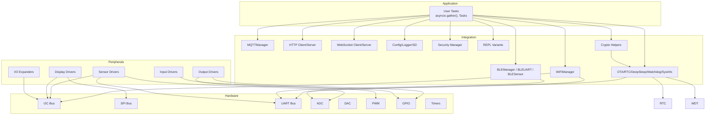
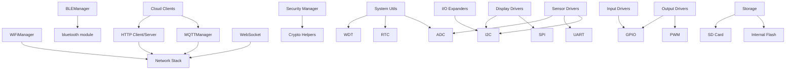

# API Reference

<cite>
**Referenced Files in This Document**
- [README.md](file://src/lib/README.md)
- [List_module.md](file://src/List_module.md)
- [device.cfg](file://src/device.cfg)
- [README_ASYNCIO.md](file://src/main/README_ASYNCIO.md)
- [README_BLE_MODULE.md](file://src/main/README_BLE_MODULE.md)
- [README_WIFI_MODULE.md](file://src/main/README_WIFI_MODULE.md)
- [wifi_example.py](file://src/main/examples/wifi_example.py)
- [sensors_example.py](file://src/main/examples/sensors_example.py)
- [display_example.py](file://src/main/examples/display_example.py)
- [output_example.py](file://src/main/examples/output_example.py)
- [input_example.py](file://src/main/examples/input_example.py)
- [storage_example.py](file://src/main/examples/storage_example.py)
</cite>

## Table of Contents
1. [Introduction](#introduction)
2. [Project Structure](#project-structure)
3. [Core Components](#core-components)
4. [Architecture Overview](#architecture-overview)
5. [Detailed Component Analysis](#detailed-component-analysis)
6. [Dependency Analysis](#dependency-analysis)
7. [Performance Considerations](#performance-considerations)
8. [Troubleshooting Guide](#troubleshooting-guide)
9. [Conclusion](#conclusion)
10. [Appendices](#appendices)

## Introduction
This API Reference documents the ESP32-C3 MicroPython Library Framework, covering 80+ modules organized into functional categories such as WiFi, BLE, sensors, displays, outputs, inputs, storage, networking, cloud platforms, system utilities, security, REPL, cryptography, analog I/O, GPIO, and timers. It consolidates public interfaces, method signatures, parameters, return values, usage patterns, configuration options, validation rules, exception handling, threading considerations, and integration guidelines. Cross-references between related modules are included to help developers compose robust IoT applications.

## Project Structure
The repository is organized around a modular library layout under src/lib with category folders for each domain. Example scripts under src/main demonstrate typical usage patterns and integration scenarios. The top-level README and module inventory summarize supported hardware, software-only modules, and recommended usage order.

```mermaid
graph TB
A["src/lib/"] --> B["wifi/"]
A --> C["ble/"]
A --> D["sensors/"]
A --> E["display/"]
A --> F["output/"]
A --> G["input/"]
A --> H["storage/"]
A --> I["mqtt/"]
A --> J["http/"]
A --> K["websocket/"]
A --> L["cloud/"]
A --> M["system/"]
A --> N["security/"]
A --> O["repl/"]
A --> P["crypto/"]
A --> Q["adc/", "dac/", "pwm/"]
A --> R["pin/"]
A --> S["timer/"]
A --> T["i2c/", "spi/", "uart/", "can/", "ethernet/", "audio/"]
U["src/main/examples/"] --> U1["wifi_example.py"]
U --> U2["sensors_example.py"]
U --> U3["display_example.py"]
U --> U4["output_example.py"]
U --> U5["input_example.py"]
U --> U6["storage_example.py"]
```

**Diagram sources**
- [README.md:1-72](file://src/lib/README.md#L1-L72)
- [List_module.md:1-358](file://src/List_module.md#L1-L358)

**Section sources**
- [README.md:1-72](file://src/lib/README.md#L1-L72)
- [List_module.md:1-358](file://src/List_module.md#L1-L358)

## Core Components
This section outlines the primary modules and their roles, derived from the library overview and module inventory.

- WiFi Management: STA mode connectivity, configuration persistence, keep-alive monitoring, and a web-based configuration portal.
- BLE Management: BLE server/client, UART over BLE, sensor streaming, and custom service support.
- Sensors: 20+ drivers for temperature/humidity, pressure, gas, light, soil moisture, motion detection, power monitoring, air quality, and more.
- Displays: OLED, TFT, LCD, LED matrix, E-paper, P10 panels, and TJC HMI via UART.
- Outputs: LEDs (NeoPixel, PWM), servos, DC motors, steppers, relays, buzzers, and IR remote control.
- Inputs: Buttons, rotary encoders, keypads, joysticks, and capacitive touch (ESP32/S2/S3 only).
- Storage: JSON configuration manager, internal flash logging, and SD card file operations.
- Networking: MQTT client/server, HTTP client/server, and WebSocket client/server.
- Cloud Platforms: Integrations for ThingsBoard, Adafruit IO, Blynk, Firebase, and AWS IoT.
- System Utilities: OTA updates, RTC, deep sleep, watchdog, and system information.
- Security: Audit logging, authentication provider, REPL lock, secret store, and centralized security manager.
- REPL: TCP, UART, BLE, and web REPL variants plus command dispatch.
- Cryptography: Hashing, HMAC, AES, Base64, PBKDF2, and TLS helpers.
- Analog I/O: ADC, DAC, and PWM drivers.
- GPIO: Digital input/output with edge detection and debouncing.
- Timers: Hardware/software timers for periodic and one-shot operations.

**Section sources**
- [README.md:9-21](file://src/lib/README.md#L9-L21)
- [List_module.md:32-231](file://src/List_module.md#L32-L231)

## Architecture Overview
The framework follows a layered architecture:
- Application Layer: User tasks and coroutines orchestrated via asyncio.
- Integration Layer: Managers for networking (WiFi, BLE), storage, and system services.
- Peripheral Abstraction Layer: Device drivers for sensors, displays, outputs, and I/O expanders.
- Hardware Interface Layer: Built-in peripherals (I2C, SPI, UART, ADC, DAC, PWM) and external protocols.



**Diagram sources**
- [README.md:22-51](file://src/lib/README.md#L22-L51)
- [README_ASYNCIO.md:1-840](file://src/main/README_ASYNCIO.md#L1-L840)
- [List_module.md:116-231](file://src/List_module.md#L116-L231)

## Detailed Component Analysis

### WiFi Manager
The WiFi Manager provides STA connectivity with persistent configuration, scanning, keep-alive monitoring, and a web-based configuration portal.

- Public Interfaces
  - Constructor: Initialize with optional configuration file.
  - load_config(): Load persisted configuration.
  - save_config(ssid=None, password=None): Persist credentials.
  - update_config(new_config): Update configuration dictionary.
  - get_config(): Retrieve current configuration.
  - is_connected(): Boolean check for connectivity.
  - get_ip(): Return assigned IP address.
  - get_connection_info(): Return detailed connection metadata.
  - scan_networks(): Enumerate visible networks.
  - connect(ssid=None, password=None, timeout=None): Establish STA connection.
  - disconnect(): Terminate connection.
  - reconnect(): Reconnect using saved configuration.
  - keep_alive(check_interval=None): Continuous connectivity monitor.
  - stop_keep_alive(): Stop keep-alive loop.
  - set_auto_connect(enabled=True): Toggle auto-connect.
  - connect_auto(): Connect using stored config.
  - get_status(): Human-readable status string.

- Configuration Options (wifi_config.json)
  - ssid: string, required.
  - password: string, required.
  - auto_connect: bool, default true.
  - timeout: int seconds, default 15.
  - reconnect: bool, default true.
  - reconnect_interval: int seconds, default 30.
  - hostname: string, optional.

- Usage Patterns
  - Basic connection with saved credentials.
  - Direct connect with inline parameters.
  - Keep-alive mode to maintain connectivity.
  - Scanning and selective connection.
  - Coexistence with other tasks via asyncio.gather.
  - Web-based configuration portal for out-of-band setup.

- Threading and Concurrency
  - All methods are designed for cooperative multitasking; blocking operations are avoided.
  - Keep-alive runs indefinitely until stopped; use stop_keep_alive() to terminate.

- Validation Rules
  - timeout must be positive; reconnect_interval must be non-negative.
  - AP password for portal must be at least 8 characters.

- Migration Notes
  - Earlier versions may have used hardcoded constants; prefer configuration files for portability.

**Section sources**
- [README_WIFI_MODULE.md:163-270](file://src/main/README_WIFI_MODULE.md#L163-L270)
- [README_WIFI_MODULE.md:135-162](file://src/main/README_WIFI_MODULE.md#L135-L162)
- [wifi_example.py:13-338](file://src/main/examples/wifi_example.py#L13-L338)

### BLE Manager
The BLE Manager supports GATT server/client operations, BLE UART, and sensor streaming with callbacks and custom services.

- Public Interfaces
  - Constructor: Initialize with device name and optional config file.
  - load_config(): Load configuration from JSON.
  - save_config(**kwargs): Persist configuration keys.
  - is_available(): Check BLE availability.
  - init(): Initialize BLE stack.
  - start_server(services=None): Start GATT server.
  - start_simple_server(): Start server with built-in UART.
  - stop_advertising(): Stop advertising.
  - set_callback(event_name, callback): Register event handlers.
  - send_data(data, notify=True, indicate=False): Send data via notifications/indications.
  - send_uart(text): Send text via BLE UART.
  - disconnect(): Disconnect peers.
  - stop(): Stop server.
  - get_status(): Return BLE status dictionary.

- BLEUART
  - begin(baudrate=115200): Initialize UART service.
  - read()/readline(): Read from RX buffer.
  - write(data)/println(text): Write to TX.
  - any(): Check RX availability.
  - stop(): Stop UART service.

- BLESensor
  - begin(): Initialize sensor service.
  - update_sensor(**kwargs): Update sensor values.
  - get_sensor_data(): Retrieve latest values.
  - start_streaming(interval=5): Start periodic streaming.
  - stop_streaming(): Stop streaming.
  - stop(): Stop sensor service.

- Configuration Options (ble_config.json)
  - device_name: string, default "ESP32-C3".
  - advertise_interval: int milliseconds, default 100.
  - min_connection_interval: int units of 1.25 ms, default 6.
  - max_connection_interval: int units of 1.25 ms, default 12.

- Callback Events
  - on_connect(conn_handle)
  - on_disconnect(conn_handle)
  - on_write(conn_handle, value_handle, data)
  - on_read(conn_handle, value_handle)
  - on_uart_rx(text)

- Threading and Concurrency
  - BLE operations integrate with asyncio; use callbacks for asynchronous event handling.
  - Mock mode is available when BLE module is absent for testing.

- Validation Rules
  - Connection limits apply; advertising continues until connected.
  - Characteristic handles must match registered services.

- Migration Notes
  - Earlier versions may have used different UUIDs; align with documented custom services.

**Section sources**
- [README_BLE_MODULE.md:120-289](file://src/main/README_BLE_MODULE.md#L120-L289)
- [README_BLE_MODULE.md:98-119](file://src/main/README_BLE_MODULE.md#L98-L119)
- [README_BLE_MODULE.md:291-301](file://src/main/README_BLE_MODULE.md#L291-L301)

### Sensor Drivers
The sensors package includes 20+ drivers for environmental, motion, power, and air quality monitoring.

Representative APIs (signatures and behaviors are summarized; refer to examples for usage):

- DHTSensor
  - read(): Returns (temperature, humidity) or (None, None) on failure.
  - read_fahrenheit(): Returns temperature in Fahrenheit.
- BMP280/BME280
  - read(): Returns dict with temperature, pressure, and optional humidity.
  - altitude(): Returns calculated altitude.
- DS18B20
  - count: Number of devices found.
  - read_all(): Returns list of (ROM, temperature).
  - read(index): Returns temperature for nth device.
- MPU6050
  - acceleration: Tuple of (x, y, z) in g.
  - gyroscope: Tuple of (x, y, z) in deg/s.
  - temperature: Die temperature in Celsius.
- HCSR04
  - distance_cm()/distance_mm(): Single measurement or None.
  - read_median(samples): Median-filtered distance.
- ADS1115
  - read_voltage(channel): Voltage per channel with gain configuration.
- MAX30102
  - finger_detected(): Boolean presence.
  - read_samples(count): Returns list of (red, ir) tuples.
- LDR
  - light_level: Percentage brightness.
  - voltage: Measured voltage.
  - is_dark(): Boolean threshold check.
  - read_average(samples): Average over N samples.
- SoilMoisture
  - moisture_percent: Calculated percentage.
  - is_dry()/is_wet(): Threshold checks.
- PIR
  - motion_detected: Boolean immediate detection.
  - watch(interval_ms, on_motion): Asynchronous watch with callback.
- RCWL0516
  - motion_detected: Boolean immediate detection.
  - wait_for_motion(timeout_ms): Blocking wait with timeout.
  - watch(interval_ms, on_motion, on_clear): Asynchronous watch.
  - last_motion_time: Milliseconds since last motion.
- MQGas
  - ratio: Sensor resistance ratio.
  - read_ppm(gas_type): Returns parts per million for supported gases.
  - digital_alarm(): Optional digital output state.
- INA219
  - read_all(): Returns dict with bus/shunt voltage, current, power.
  - overflow(): Boolean indicating range exceeded.
- OH49E
  - calibrate_midpoint(samples): Calibrate null zone midpoint.
  - voltage/deviation_mv: Voltage and deviation in millivolts.
  - field_strength: Magnetic field in millitesla.
  - polarity: One of NORTH, SOUTH, NONE.
  - is_magnet_near(): Boolean proximity check.
  - read_average(samples): Averaged deviation.
  - watch(on_change, poll_ms): Asynchronous polarity change watcher.
- PZEM004T/PZEM004Tv3
  - Properties: voltage, current, power, energy, power_factor.
  - read_all(): Bulk read as dict.
  - monitor(on_data, interval_s): Asynchronous monitoring callback.
  - set_alarm_threshold(value), get_alarm_threshold(), alarm_status: Alarm controls.

- Threading and Concurrency
  - Many drivers expose async watchers and monitors; use asyncio.wait_for for timeouts.

- Validation Rules
  - I2C addresses and pull-up resistors are required for I2C sensors.
  - UART-based sensors require correct wiring and baud rates.

- Migration Notes
  - Some drivers may expose additional properties/methods; consult individual examples.

**Section sources**
- [sensors_example.py:30-529](file://src/main/examples/sensors_example.py#L30-L529)

### Display Drivers
The display package supports OLED, TFT, LCD, LED matrix, E-paper, P10 panels, and TJC HMI.

Representative APIs (usage patterns and parameters are described; see examples for wiring and initialization):

- SSD1306_I2C
  - clear(), text(), rect(), fill_rect(), show(), off(): Standard framebuffer operations.
- ILI9341
  - fill(), text(), rect(), fill_rect(), line(), off(): SPI-driven TFT operations.
- ST7789
  - fill(), text(), rect(), fill_rect(), line(): SPI-driven TFT with orientation offsets.
- LCD_I2C
  - clear(), print_line(), print(), backlight(): HD44780-style controller over I2C.
- MAX7219
  - brightness(level), clear(), show_char(), scroll_text(), show(): 8x8 LED matrix.
- EPaper29
  - clear(), text(), rect(), show(), sleep(): E-paper refresh lifecycle.
- TJCManager
  - start(), page(n), stop(): Initialize and control TJC HMI via UART.
  - t0.txt, n0.val: Virtual widgets mapped to attributes.
- P10 Panels (P10Mono, P10RGB)
  - fill(color), clear(), text(), rect(), fill_rect(), show(), off(): Monochrome and RGB panels.
  - scroll_text(message, delay_ms): Horizontal scrolling text.

- Threading and Concurrency
  - Display operations are synchronous; avoid long delays in tight loops to prevent blocking.

- Validation Rules
  - SPI pins and chip-select must match hardware connections.
  - I2C addresses must be correct; verify with scanner utilities.

- Migration Notes
  - P10 drivers may expose additional color modes; review constructor parameters.

**Section sources**
- [display_example.py:14-240](file://src/main/examples/display_example.py#L14-L240)

### Output Drivers
The output package covers LEDs, servos, motors, steppers, relays, buzzers, and IR control.

Representative APIs:

- NeoPixelController
  - fill(r, g, b), color_wipe(r, g, b, wait_ms), rainbow_cycle(wait_ms, cycles), set(i, r, g, b), show(), clear().
  - from_hsv(h, s, v): Convert HSV to RGB tuple.
- Servo
  - angle(degrees), sweep(start, end, step, delay_ms), center(), off().
- DCMotor
  - forward(speed), backward(speed), stop(), brake(), deinit().
- Stepper Drivers (ULN2003, A4988, DRV8825, TMC2208/2209, TMC5160)
  - enable(), disable(), rotate(degrees), set_current(mA), set_microstep(steps), homing(...), deinit().
- Relay/RelayBoard
  - on(), off(), timed_on(seconds), set_mask(mask), off_all().
- Buzzer/PassiveBuzzer
  - async_beep(count, on_ms, off_ms), async_melody([(note, duration_ms), ...]).
- PWMLed/RGBLed
  - on(), off(), fade_out/in(duration_ms), blink(count), color(r, g, b), fade_color(from, to, duration_ms), deinit().

- Threading and Concurrency
  - PWM-based effects are non-blocking; ensure proper duty cycle and frequency settings.

- Validation Rules
  - Servo angles and stepper steps must be within supported ranges.
  - Relay boards require correct wiring and active-high/low selection.

- Migration Notes
  - TMC drivers expose advanced features like stealthChop and stallGuard; consult manufacturer docs.

**Section sources**
- [output_example.py:14-251](file://src/main/examples/output_example.py#L14-L251)

### Input Drivers
The input package provides buttons, encoders, keypads, joysticks, and touch sensors.

Representative APIs:

- Button
  - wait_press(), wait_release(), is_pressed: Event-driven input.
- RotaryEncoder
  - on_change(callback), disable_irq(): Interrupt-driven rotation with callback.
- MatrixKeypad
  - wait_key(): Wait for key press.
- TouchSensor
  - baseline, read_raw(), is_touched: Capacitive touch with calibration.
- Joystick
  - read_raw(), read_norm(), direction(), button_pressed: Analog axes and switch.

- Threading and Concurrency
  - Use callbacks and asyncio events to avoid blocking; ISR-safe mechanisms are available in asyncio.

- Validation Rules
  - Pull-up/pull-down resistors must be configured appropriately.
  - Touch sensors are not available on ESP32-C3/C6.

- Migration Notes
  - Touch support differs across ESP32 variants; use conditional imports.

**Section sources**
- [input_example.py:12-88](file://src/main/examples/input_example.py#L12-L88)

### Storage Managers
The storage package offers JSON configuration, logging, and SD card operations.

Representative APIs:

- JsonConfigManager
  - load(default): Load JSON with defaults.
  - update(dict): Merge and persist configuration.
  - get(key): Retrieve nested values safely.
- FileLogger
  - debug()/info()/warn()/error(): Log with levels and rotation.
  - max_bytes: Rotate logs when exceeding size.
- SDCardManager
  - mount(): Mount SD card filesystem.
  - info(): Return filesystem statistics.
  - write_text(path, content), read_text(path), listdir(path), umount(): File operations.

- Threading and Concurrency
  - Logging is thread-safe; avoid concurrent writes to the same file.

- Validation Rules
  - Ensure sufficient free space for logs and SD operations.
  - SD card must be properly inserted and formatted.

- Migration Notes
  - Configuration file locations and permissions may vary by deployment.

**Section sources**
- [storage_example.py:10-63](file://src/main/examples/storage_example.py#L10-L63)

### Networking and Cloud
Networking and cloud integrations provide MQTT, HTTP, WebSocket, and platform-specific clients.

Representative APIs (conceptual summaries; consult platform-specific modules for exact signatures):

- MQTTManager
  - publish(topic, payload, qos, retain), subscribe(topic, qos), start(), stop().
- HTTP Client/Server
  - Client: get/post/put/delete with headers and timeouts.
  - Server: route handlers, static files, CORS.
- WebSocket Client/Server
  - connect()/send()/receive()/close() with RFC 6455 compliance.
- Cloud Clients
  - ThingsBoard, Adafruit IO, Blynk, Firebase, AWS IoT: Telemetry, attributes, RPC, REST/HTTPS.

- Threading and Concurrency
  - Use asyncio streams and tasks for concurrent operations.

- Validation Rules
  - TLS certificates and network credentials must be valid.

- Migration Notes
  - AWS IoT uses TLS and requires adequate RAM; test memory usage.

**Section sources**
- [List_module.md:131-151](file://src/List_module.md#L131-L151)

### System Utilities
System modules manage OTA updates, RTC, deep sleep, watchdog, and system information.

Representative APIs:

- OTA Updater
  - check(), download(), install(), reboot(): Over-the-air firmware updates.
- RTC
  - sync_ntp(), datetime(), set_datetime(): Time synchronization and manipulation.
- Deep Sleep Manager
  - sleep(seconds), wake_on_gpio(pin, level), wake_on_timer(seconds).
- Watchdog Manager
  - enable(timeout), feed(): Software watchdog with automatic reset.
- SysInfo
  - uptime(), heap_stats(), cpu_frequency(), mac_address(): System diagnostics.

- Threading and Concurrency
  - Watchdog must be fed periodically; use dedicated tasks.

- Validation Rules
  - RTC requires valid NTP servers or manual configuration.
  - Deep sleep wake sources must be supported by the MCU variant.

- Migration Notes
  - OTA requires signed images and secure boot depending on platform.

**Section sources**
- [List_module.md:164-173](file://src/List_module.md#L164-L173)

### Security and REPL
Security and REPL modules provide audit logging, authentication, REPL locking, secret storage, and multiple REPL transports.

Representative APIs:

- AuditLogger
  - log(event, details): Timestamped audit entries.
- AuthProvider
  - generate_token(), verify_token(): Token-based authentication.
- REPL Lock
  - enable_lock(token), disable_lock(): Protect REPL access.
- SecretStore
  - store(key, value), retrieve(key): Encrypted secrets with PBKDF2 and AES.
- SecurityManager
  - configure_policies(), audit_trail(): Centralized security orchestration.
- REPL Variants
  - TCP REPL, UART REPL, BLE REPL, Web REPL, CommandDispatcher: Transport-agnostic console.

- Threading and Concurrency
  - REPL tasks must be isolated and secured; avoid exposing sensitive commands.

- Validation Rules
  - Tokens must be rotated; secrets must be stored securely.

- Migration Notes
  - Ensure secure defaults and regular audits.

**Section sources**
- [List_module.md:176-197](file://src/List_module.md#L176-L197)

### Cryptography
Crypto helpers provide hashing, HMAC, AES, Base64, PBKDF2, and TLS utilities.

Representative APIs:
- sha256()/sha512(): Hash functions.
- hmac_sha256()/hmac_sha512(): HMAC with configurable keys.
- aes_encrypt()/aes_decrypt(): AES block cipher modes.
- base64_encode()/base64_decode(): Base64 encoding/decoding.
- pbkdf2_hmac(): Password-based key derivation.
- ssl_context(): TLS context creation.

- Threading and Concurrency
  - Crypto operations are CPU-intensive; schedule during idle periods.

- Validation Rules
  - Keys and salts must meet minimum entropy requirements.

- Migration Notes
  - Prefer modern algorithms; avoid deprecated ciphers.

**Section sources**
- [List_module.md:200-205](file://src/List_module.md#L200-L205)

### Analog I/O, GPIO, and Timers
Analog and digital I/O modules provide ADC, DAC, PWM, GPIO, and timer abstractions.

Representative APIs:
- ADC
  - read_u16(): 12-bit ADC reading with calibration support.
- DAC
  - write(value): 8-bit DAC output with waveform generation.
- PWM
  - freq(hz), duty(percent): LEDC PWM control.
- GPIO
  - Pin(pin, mode, pull, value): Digital I/O with edge detection and debouncing.
- Timer
  - periodic(callback, period_ms), oneshot(callback, delay_ms): Software and hardware timers.

- Threading and Concurrency
  - Use ThreadSafeFlag for ISR-to-async transitions.

- Validation Rules
  - DAC pins are limited; ADC channels depend on hardware capabilities.

- Migration Notes
  - Timer resolution and overflow behavior vary by platform.

**Section sources**
- [List_module.md:208-231](file://src/List_module.md#L208-L231)

## Dependency Analysis
The following diagram illustrates high-level dependencies among major components:



**Diagram sources**
- [README.md:22-51](file://src/lib/README.md#L22-L51)
- [List_module.md:116-173](file://src/List_module.md#L116-L173)

**Section sources**
- [README.md:22-51](file://src/lib/README.md#L22-L51)
- [List_module.md:116-173](file://src/List_module.md#L116-L173)

## Performance Considerations
- Use asyncio for concurrency; avoid blocking operations.
- Prefer non-blocking queues and events for inter-task communication.
- Limit queue sizes to prevent memory exhaustion.
- Use sleep_ms for short delays; avoid time.sleep in async contexts.
- Defer heavy computations to idle tasks and call garbage collection periodically.
- Minimize BLE and WiFi overhead; batch transmissions when possible.
- Validate hardware configurations to reduce retries and errors.

[No sources needed since this section provides general guidance]

## Troubleshooting Guide
Common issues and resolutions:

- WiFi
  - Cannot connect: Verify SSID/password; increase timeout; check router availability.
  - Config not saved: Check filesystem permissions and free space.
  - Keep-alive not working: Ensure task is scheduled; verify signal strength.
  - Portal not opening: Confirm sufficient memory; check AP mode support.

- BLE
  - Not advertising: Check BLE availability and firmware; restart device.
  - No data received: Confirm connection state and characteristic handles.
  - Memory errors: Reduce number of services and payload sizes.

- Sensors
  - I2C errors: Verify addresses and pull-ups; use scanner to detect devices.
  - UART timeouts: Check wiring and baud rates; ensure correct pins.

- Displays
  - Blank screen: Confirm wiring and initialization parameters; check backlight.
  - SPI conflicts: Ensure single-writer locks for shared buses.

- Outputs
  - PWM jitter: Adjust frequency and duty cycle; use smoothing filters.
  - Stepper not moving: Check enable pins and driver wiring.

- Storage
  - SD mount fails: Verify card type/format; check CS pin and SPI speed.
  - Logs not rotating: Check max_bytes and filesystem permissions.

- Security
  - REPL lock ineffective: Ensure correct token; rotate tokens regularly.
  - Secrets unreadable: Verify encryption keys and PBKDF2 parameters.

**Section sources**
- [README_WIFI_MODULE.md:438-462](file://src/main/README_WIFI_MODULE.md#L438-L462)
- [README_BLE_MODULE.md:456-477](file://src/main/README_BLE_MODULE.md#L456-L477)

## Conclusion
This API Reference consolidates the ESP32-C3 MicroPython Library Framework’s public interfaces across 80+ modules. By following the documented patterns, configuration options, and integration guidelines, developers can build scalable IoT applications with robust networking, sensing, actuation, and security features. Use asyncio for concurrency, validate hardware configurations, and leverage the provided examples as starting points for production deployments.

[No sources needed since this section summarizes without analyzing specific files]

## Appendices

### Recommended Workflow
1. Initialize WiFi with saved configuration or the web portal.
2. Read sensor data asynchronously and buffer measurements.
3. Render status on displays or stream telemetry via BLE/MQTT.
4. Control actuators based on sensor thresholds.
5. Persist configuration and logs to internal flash or SD.
6. Monitor system health with watchdog and periodic diagnostics.

**Section sources**
- [README.md:43-51](file://src/lib/README.md#L43-L51)

### Device Configuration
Device-level settings include MCU type, sync folder, and Python virtual environment paths.

**Section sources**
- [device.cfg:1-16](file://src/device.cfg#L1-L16)