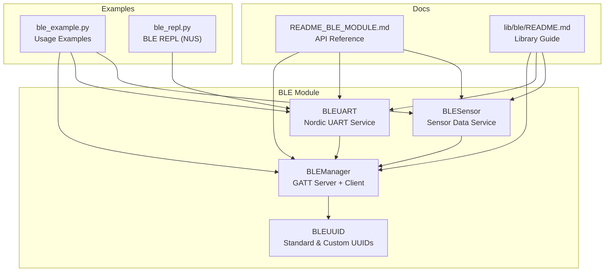
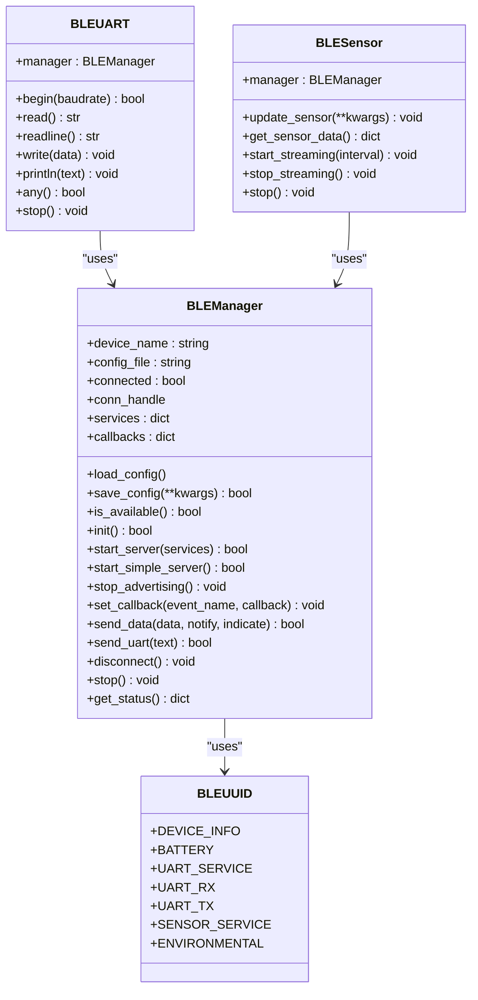
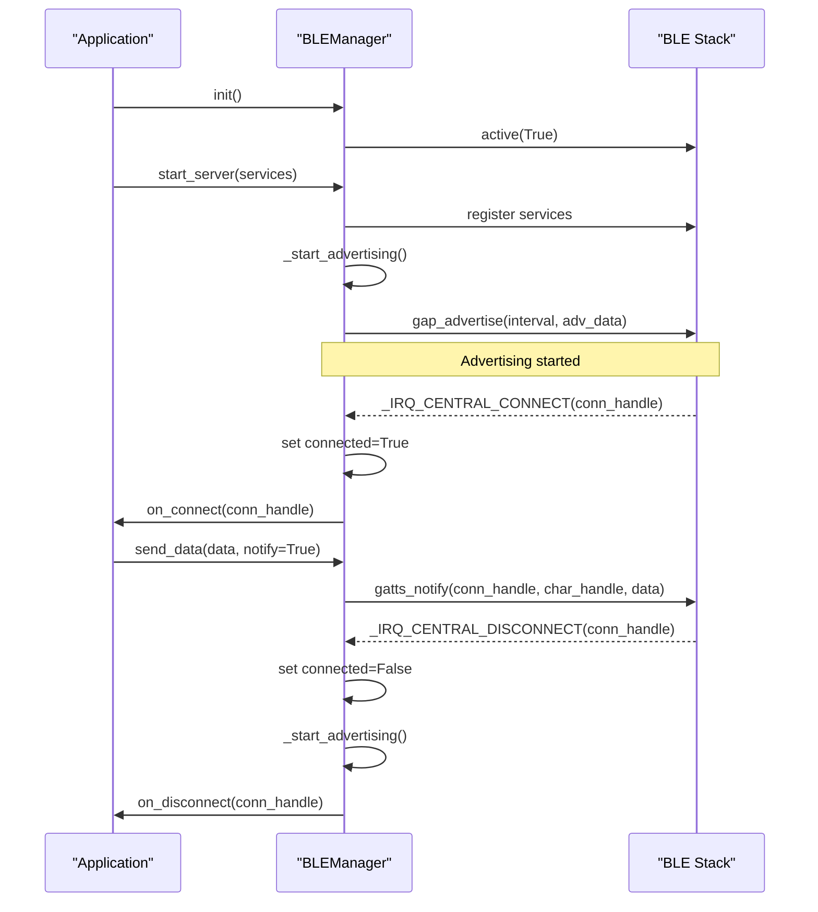
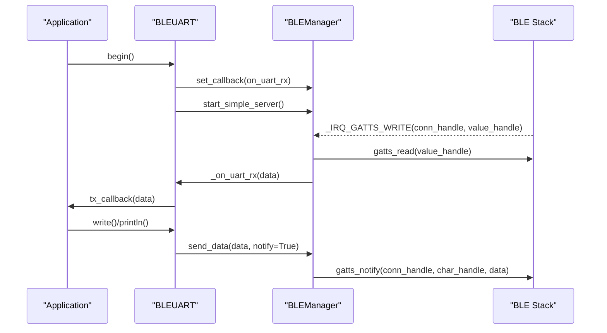
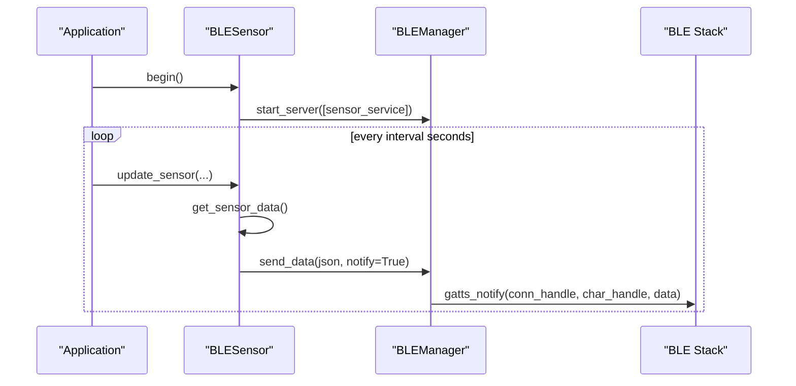
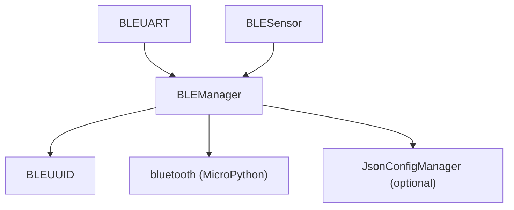

# BLE API

<cite>
**Referenced Files in This Document**
- [blemanager.py](file://src/lib/ble/blemanager.py)
- [README_BLE_MODULE.md](file://src/main/README_BLE_MODULE.md)
- [ble_example.py](file://src/main/examples/ble_example.py)
- [README.md](file://src/lib/ble/README.md)
- [ble_repl.py](file://src/lib/repl/ble_repl.py)
</cite>

## Table of Contents
1. [Introduction](#introduction)
2. [Project Structure](#project-structure)
3. [Core Components](#core-components)
4. [Architecture Overview](#architecture-overview)
5. [Detailed Component Analysis](#detailed-component-analysis)
6. [Dependency Analysis](#dependency-analysis)
7. [Performance Considerations](#performance-considerations)
8. [Troubleshooting Guide](#troubleshooting-guide)
9. [Conclusion](#conclusion)
10. [Appendices](#appendices)

## Introduction
This document provides comprehensive API documentation for the Bluetooth Low Energy (BLE) modules targeting ESP32-C3 with MicroPython. It focuses on the BLEManager class and related services (BLEUART, BLESensor) to support GAP advertising, GATT server operations, client connections, and peripheral data exchange. It covers method signatures, parameters, return values, configuration options, and practical usage patterns for both central and peripheral scenarios. It also includes guidance on BLE-specific configurations, power management, security considerations, and connection timeout handling.

## Project Structure
The BLE functionality is implemented in a single module with supporting examples and documentation:
- Core implementation: BLEManager, BLEUART, BLESensor, and BLEUUID helpers
- Examples demonstrating server modes, callbacks, sensor streaming, iBeacon-style advertising, and client notes
- Developer documentation with API reference, configuration options, and troubleshooting

**Diagram sources**
- [blemanager.py:39-53](file://src/lib/ble/blemanager.py#L39-L53)
- [blemanager.py:55-384](file://src/lib/ble/blemanager.py#L55-L384)
- [blemanager.py:387-474](file://src/lib/ble/blemanager.py#L387-L474)
- [blemanager.py:477-553](file://src/lib/ble/blemanager.py#L477-L553)
- [README_BLE_MODULE.md:1-526](file://src/main/README_BLE_MODULE.md#L1-L526)
- [README.md:1-280](file://src/lib/ble/README.md#L1-L280)
- [ble_example.py:1-408](file://src/main/examples/ble_example.py#L1-L408)
- [ble_repl.py:1-185](file://src/lib/repl/ble_repl.py#L1-L185)

**Section sources**
- [blemanager.py:1-691](file://src/lib/ble/blemanager.py#L1-L691)
- [README_BLE_MODULE.md:1-526](file://src/main/README_BLE_MODULE.md#L1-L526)
- [README.md:1-280](file://src/lib/ble/README.md#L1-L280)
- [ble_example.py:1-408](file://src/main/examples/ble_example.py#L1-L408)
- [ble_repl.py:1-185](file://src/lib/repl/ble_repl.py#L1-L185)

## Core Components
This section documents the primary classes and their roles in BLE operations.

- BLEUUID: Provides standard and custom UUID constants for BLE services and characteristics.
- BLEManager: Central class implementing GAP advertising, GATT server registration, client connection handling, notifications, and configuration persistence.
- BLEUART: Implements Nordic UART Service (NUS) for serial-like communication over BLE.
- BLESensor: Registers a sensor service and streams sensor data via notifications.

Key capabilities:
- Advertising lifecycle control (start/stop)
- GATT service registration and characteristic property handling
- Connection event callbacks (connect/disconnect)
- Data transmission via notifications or indications
- Status reporting and configuration persistence

**Section sources**
- [blemanager.py:39-53](file://src/lib/ble/blemanager.py#L39-L53)
- [blemanager.py:55-384](file://src/lib/ble/blemanager.py#L55-L384)
- [blemanager.py:387-474](file://src/lib/ble/blemanager.py#L387-L474)
- [blemanager.py:477-553](file://src/lib/ble/blemanager.py#L477-L553)

## Architecture Overview
The BLE subsystem centers around BLEManager, which orchestrates GAP advertising and GATT server behavior. BLEUART and BLESensor are convenience wrappers built on top of BLEManager to expose common services.

**Diagram sources**
- [blemanager.py:39-53](file://src/lib/ble/blemanager.py#L39-L53)
- [blemanager.py:55-384](file://src/lib/ble/blemanager.py#L55-L384)
- [blemanager.py:387-474](file://src/lib/ble/blemanager.py#L387-L474)
- [blemanager.py:477-553](file://src/lib/ble/blemanager.py#L477-L553)

## Detailed Component Analysis

### BLEManager API Reference
BLEManager is the core class for BLE operations. Below are the documented methods, parameters, and return values.

- Constructor
  - Parameters:
    - device_name (string): BLE device name advertised
    - config_file (string): Path to JSON configuration file
  - Behavior: Initializes internal state, loads configuration

- Configuration
  - load_config(): Loads configuration from JSON file or embedded manager; updates device_name if present
  - save_config(**kwargs): Persists configuration; returns boolean success

- Availability and Initialization
  - is_available(): Returns boolean indicating BLE availability
  - init(): Activates BLE hardware; returns boolean success

- Server Lifecycle
  - start_server(services=None): Registers services and starts advertising; returns boolean success
  - start_simple_server(): Starts server with default UART service; returns boolean success
  - stop(): Disconnects and deactivates BLE

- Advertising
  - stop_advertising(): Stops advertising
  - Internal: _start_advertising() constructs advertising data and calls gap_advertise

- Connection Handling
  - disconnect(): Disconnects active connection
  - Internal: _ble_irq_handler handles connect/disconnect/write/indicate-done events

- Data Transmission
  - send_data(data, notify=True, indicate=False): Sends bytes via notification or indication; returns boolean success
  - send_uart(text): Convenience wrapper for UART TX notification

- Callbacks
  - set_callback(event_name, callback): Registers callbacks for:
    - on_connect(conn_handle)
    - on_disconnect(conn_handle)
    - on_write(conn_handle, value_handle, data)
    - on_read(conn_handle, value_handle)
    - on_indicate_done()

- Status
  - get_status(): Returns dictionary with active state, connection status, device name, number of services, and connection handle

- Notes
  - Characteristic handle resolution is currently a placeholder; the implementation sends to a dummy handle.

**Section sources**
- [blemanager.py:60-121](file://src/lib/ble/blemanager.py#L60-L121)
- [blemanager.py:126-177](file://src/lib/ble/blemanager.py#L126-L177)
- [blemanager.py:178-197](file://src/lib/ble/blemanager.py#L178-L197)
- [blemanager.py:231-253](file://src/lib/ble/blemanager.py#L231-L253)
- [blemanager.py:254-285](file://src/lib/ble/blemanager.py#L254-L285)
- [blemanager.py:286-326](file://src/lib/ble/blemanager.py#L286-L326)
- [blemanager.py:327-356](file://src/lib/ble/blemanager.py#L327-L356)
- [blemanager.py:366-384](file://src/lib/ble/blemanager.py#L366-L384)

### BLEUART API Reference
BLEUART provides a Nordic UART Service (NUS) interface for serial-like communication.

- Constructor
  - Parameters:
    - device_name (string): BLE device name for advertising

- Methods
  - begin(baudrate=115200): Starts simple server with UART service; registers on_uart_rx callback
  - read(): Returns accumulated buffered string or None
  - readline(): Returns first complete line from buffer or None
  - write(data): Encodes and sends via BLE notification
  - println(text): Sends text with newline
  - any(): Returns boolean indicating pending data
  - stop(): Stops underlying manager

- Notes
  - Uses manager’s send_data internally for TX notifications
  - Maintains an internal receive buffer and optional tx_callback for downstream processing

**Section sources**
- [blemanager.py:387-474](file://src/lib/ble/blemanager.py#L387-L474)

### BLESensor API Reference
BLESensor registers a sensor service and streams sensor readings via notifications.

- Constructor
  - Parameters:
    - device_name (string): BLE device name for advertising

- Methods
  - begin(): Starts server with sensor service (READ + NOTIFY)
  - update_sensor(**kwargs): Updates internal sensor data dictionary
  - get_sensor_data(): Returns copy of current sensor data
  - start_streaming(interval=5): Periodically sends sensor data as JSON via notifications
  - stop_streaming(): Stops periodic streaming
  - stop(): Stops streaming and underlying manager

- Notes
  - Streaming runs until stopped; data is sent only when connected

**Section sources**
- [blemanager.py:477-553](file://src/lib/ble/blemanager.py#L477-L553)

### BLEUUID Constants
Standard and custom UUIDs used across services:
- DEVICE_INFO: 0000180A-0000-1000-8000-00805F9B34FB
- BATTERY: 0000180F-0000-1000-8000-00805F9B34FB
- UART_SERVICE: 6E400001-B5A3-F393-E0A9-E50E24DCCA9E
- UART_RX: 6E400002-B5A3-F393-E0A9-E50E24DCCA9E
- UART_TX: 6E400003-B5A3-F393-E0A9-E50E24DCCA9E
- SENSOR_SERVICE: 0000181A-0000-1000-8000-00805F9B34FB
- ENVIRONMENTAL: 00002A6E-0000-1000-8000-00805F9B34FB

These constants are used to define service and characteristic UUIDs in service definitions.

**Section sources**
- [blemanager.py:39-53](file://src/lib/ble/blemanager.py#L39-L53)

### Advertising and Connection Flow
The following sequence diagrams illustrate typical server and client interactions.

#### Server Advertising and Connection

**Diagram sources**
- [blemanager.py:126-177](file://src/lib/ble/blemanager.py#L126-L177)
- [blemanager.py:231-285](file://src/lib/ble/blemanager.py#L231-L285)

#### UART Service Interaction

**Diagram sources**
- [blemanager.py:178-197](file://src/lib/ble/blemanager.py#L178-L197)
- [blemanager.py:338-348](file://src/lib/ble/blemanager.py#L338-L348)
- [blemanager.py:295-326](file://src/lib/ble/blemanager.py#L295-L326)

#### Sensor Streaming

**Diagram sources**
- [blemanager.py:495-553](file://src/lib/ble/blemanager.py#L495-L553)

### Configuration and Parameters
BLE configuration is persisted in a JSON file with the following structure and defaults:

- device_name: string, default "ESP32-C3"
- advertise_interval: integer milliseconds, default 100
- min_connection_interval: integer (multiple of 1.25 ms), default 6
- max_connection_interval: integer (multiple of 1.25 ms), default 12

Notes:
- The implementation currently hardcodes advertising interval and does not apply min/max connection intervals.
- To persist configuration, use save_config() with desired key-value pairs.

**Section sources**
- [README_BLE_MODULE.md:98-119](file://src/main/README_BLE_MODULE.md#L98-L119)
- [blemanager.py:84-121](file://src/lib/ble/blemanager.py#L84-L121)
- [blemanager.py:236-246](file://src/lib/ble/blemanager.py#L236-L246)

### Usage Examples
Examples demonstrate practical usage patterns for both central and peripheral modes, service implementation, and data exchange.

- Basic Server
  - Initialize BLEManager, start server, wait for connections, and send notifications.
  - See [example_1_basic_server:14-59](file://src/main/examples/ble_example.py#L14-L59).

- BLE UART
  - Start BLEUART, receive and echo data, and send responses.
  - See [example_2_uart:62-94](file://src/main/examples/ble_example.py#L62-L94).

- Sensor Streaming
  - Initialize BLESensor, simulate sensor values, and stream periodically.
  - See [example_3_sensor:96-155](file://src/main/examples/ble_example.py#L96-L155).

- Callbacks
  - Set on_connect, on_disconnect, on_write, on_read callbacks and react to events.
  - See [example_4_callbacks:158-206](file://src/main/examples/ble_example.py#L158-L206).

- BLE + WiFi Coexistence
  - Run BLE server and WiFi manager concurrently using asyncio tasks.
  - See [example_5_ble_wifi:209-278](file://src/main/examples/ble_example.py#L209-L278).

- LED Control via BLE
  - Parse incoming commands and control GPIO via callbacks.
  - See [example_6_ble_led:281-338](file://src/main/examples/ble_example.py#L281-L338).

- iBeacon-style Advertising
  - Continuously re-advertise to emulate beacon behavior.
  - See [example_7_ibeacon:341-366](file://src/main/examples/ble_example.py#L341-L366).

- GATT Client Notes
  - Example outlines scanning and connecting using gap_scan/gap_connect (not implemented in current module).
  - See [example_8_gatt_client:370-394](file://src/main/examples/ble_example.py#L370-L394).

**Section sources**
- [ble_example.py:14-394](file://src/main/examples/ble_example.py#L14-L394)

### BLE REPL Integration
The BLE REPL module builds on BLEUART to provide a command-line interface over BLE using Nordic UART Service. It handles chunked transmission respecting MTU limits and dispatches received commands to a command dispatcher.

- Key behaviors:
  - MTU_SIZE = 20 bytes
  - Buffers incoming lines until newline delimiter
  - Splits long responses into chunks and sends via BLEUART.write
  - Exposes is_connected and is_running properties

**Section sources**
- [ble_repl.py:48-185](file://src/lib/repl/ble_repl.py#L48-L185)

## Dependency Analysis
The BLE module depends on:
- MicroPython bluetooth module for BLE stack operations
- Optional JsonConfigManager for configuration persistence
- asyncio for asynchronous operation
- Optional storage.config_mgr for configuration management

**Diagram sources**
- [blemanager.py:24-36](file://src/lib/ble/blemanager.py#L24-L36)
- [blemanager.py:60-83](file://src/lib/ble/blemanager.py#L60-L83)
- [blemanager.py:387-474](file://src/lib/ble/blemanager.py#L387-L474)
- [blemanager.py:477-553](file://src/lib/ble/blemanager.py#L477-L553)

**Section sources**
- [blemanager.py:24-36](file://src/lib/ble/blemanager.py#L24-L36)
- [blemanager.py:60-83](file://src/lib/ble/blemanager.py#L60-L83)

## Performance Considerations
- Advertising interval: The current implementation uses a fixed interval in advertising payload construction. For lower power consumption, consider reducing advertising duty cycle or switching to non-connectable advertising when appropriate.
- Connection intervals: The configuration supports min/max connection intervals, but the implementation does not currently apply them. For power-sensitive applications, tune these values to balance responsiveness and battery life.
- Notification batching: Group small writes into larger notifications to reduce overhead.
- MTU awareness: Responses exceeding MTU should be chunked. The BLE REPL module demonstrates chunking; similar patterns should be applied in custom services.
- Memory footprint: BLE services and buffers consume RAM. Keep service definitions minimal and avoid excessive buffering.

[No sources needed since this section provides general guidance]

## Troubleshooting Guide
Common issues and resolutions:
- BLE not available
  - Verify MicroPython supports the bluetooth module and firmware version.
  - Restart the device and check for mock mode warnings.
- Cannot connect
  - Ensure advertising is active and device name is discoverable.
  - Confirm the client is within range and not already connected to another device.
- Data not transmitted
  - Confirm the device is connected before sending.
  - Verify characteristic properties and handle resolution.
  - Check callback registrations for write/read events.
- Memory errors
  - Reduce number of services and payload sizes.
  - Disable unused services during operation.

**Section sources**
- [README_BLE_MODULE.md:456-477](file://src/main/README_BLE_MODULE.md#L456-L477)

## Conclusion
The BLE module provides a robust foundation for BLE operations on ESP32-C3 with MicroPython. BLEManager encapsulates GAP advertising and GATT server functionality, while BLEUART and BLESensor offer ready-to-use services for serial communication and sensor data streaming. The examples demonstrate practical patterns for both peripheral and hybrid scenarios. For production deployments, consider optimizing advertising intervals, applying connection parameters, and managing memory and power consumption carefully.

[No sources needed since this section summarizes without analyzing specific files]

## Appendices

### API Summary Tables

- BLEManager Methods
  - load_config(): Returns configuration dictionary
  - save_config(**kwargs): Returns boolean success
  - is_available(): Returns boolean
  - init(): Returns boolean success
  - start_server(services): Returns boolean success
  - start_simple_server(): Returns boolean success
  - stop_advertising(): No return
  - set_callback(event_name, callback): No return
  - send_data(data, notify, indicate): Returns boolean success
  - send_uart(text): Returns boolean success
  - disconnect(): No return
  - stop(): No return
  - get_status(): Returns status dictionary

- BLEUART Methods
  - begin(baudrate): Returns boolean success
  - read(): Returns string or None
  - readline(): Returns string or None
  - write(data): No return
  - println(text): No return
  - any(): Returns boolean
  - stop(): No return

- BLESensor Methods
  - begin(): Returns boolean success
  - update_sensor(**kwargs): No return
  - get_sensor_data(): Returns dictionary
  - start_streaming(interval): No return
  - stop_streaming(): No return
  - stop(): No return

**Section sources**
- [README_BLE_MODULE.md:120-301](file://src/main/README_BLE_MODULE.md#L120-L301)
- [blemanager.py:136-148](file://src/lib/ble/blemanager.py#L136-L148)
- [blemanager.py:178-197](file://src/lib/ble/blemanager.py#L178-L197)
- [blemanager.py:295-326](file://src/lib/ble/blemanager.py#L295-L326)
- [blemanager.py:404-411](file://src/lib/ble/blemanager.py#L404-L411)
- [blemanager.py:420-431](file://src/lib/ble/blemanager.py#L420-L431)
- [blemanager.py:445-462](file://src/lib/ble/blemanager.py#L445-L462)
- [blemanager.py:463-470](file://src/lib/ble/blemanager.py#L463-L470)
- [blemanager.py:495-553](file://src/lib/ble/blemanager.py#L495-L553)

### BLE-Specific Configurations and Security
- Configuration file: JSON with device_name, advertise_interval, min/max connection intervals
- Security considerations: The current implementation does not enable encryption/authentication. For secure applications, integrate pairing and bonding as supported by the platform.
- Power management: Prefer non-connectable advertising when possible; reduce advertising interval; disconnect idle clients promptly.
- Connection timeouts: Implement keep-alive mechanisms and handle disconnections gracefully.

**Section sources**
- [README_BLE_MODULE.md:98-119](file://src/main/README_BLE_MODULE.md#L98-L119)
- [README.md:272-280](file://src/lib/ble/README.md#L272-L280)