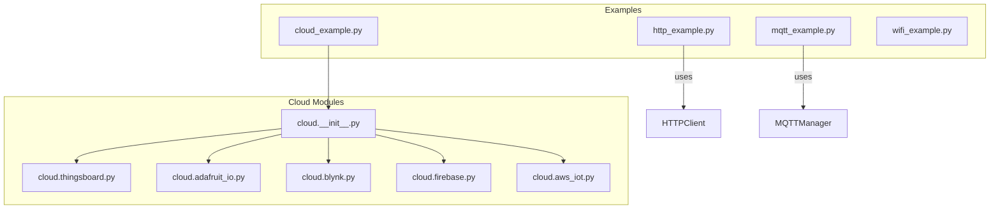
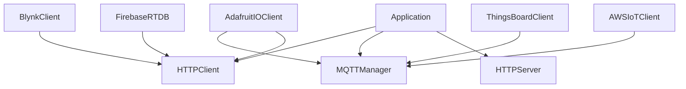
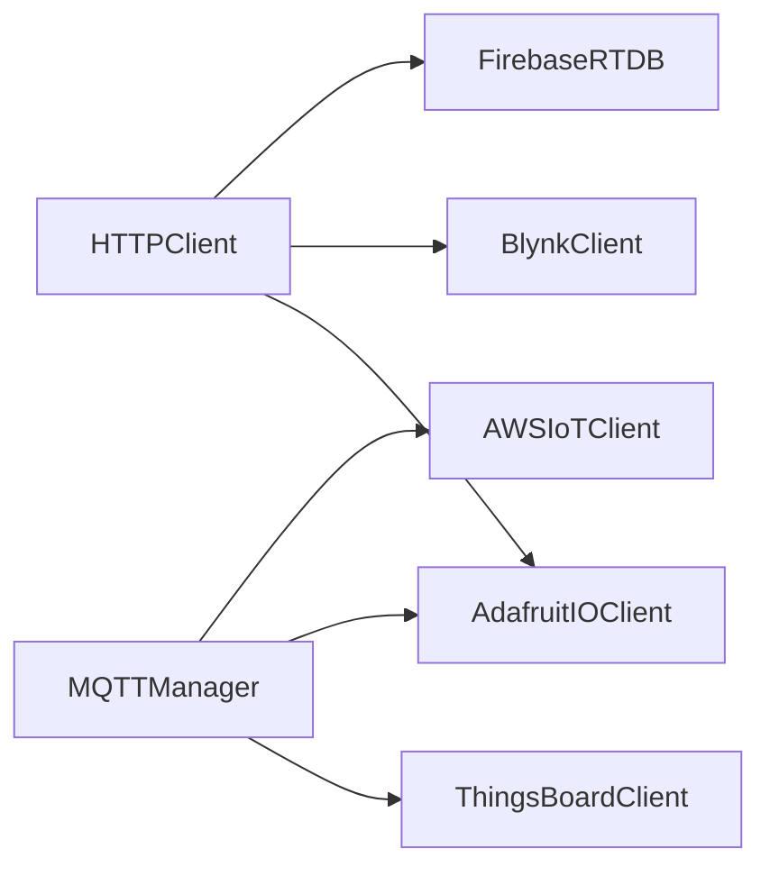

# Communication API

<cite>
**Referenced Files in This Document**
- [cloud_example.py](file://src/main/examples/cloud_example.py)
- [http_example.py](file://src/main/examples/http_example.py)
- [mqtt_example.py](file://src/main/examples/mqtt_example.py)
- [wifi_example.py](file://src/main/examples/wifi_example.py)
- [__init__.py](file://src/lib/cloud/__init__.py)
- [thingsboard.py](file://src/lib/cloud/thingsboard.py)
- [adafruit_io.py](file://src/lib/cloud/adafruit_io.py)
- [blynk.py](file://src/lib/cloud/blynk.py)
- [firebase.py](file://src/lib/cloud/firebase.py)
- [aws_iot.py](file://src/lib/cloud/aws_iot.py)
</cite>

## Table of Contents
1. [Introduction](#introduction)
2. [Project Structure](#project-structure)
3. [Core Components](#core-components)
4. [Architecture Overview](#architecture-overview)
5. [Detailed Component Analysis](#detailed-component-analysis)
6. [Dependency Analysis](#dependency-analysis)
7. [Performance Considerations](#performance-considerations)
8. [Troubleshooting Guide](#troubleshooting-guide)
9. [Conclusion](#conclusion)
10. [Appendices](#appendices)

## Introduction
This document provides comprehensive API documentation for the communication protocol modules in the project. It covers HTTP client/server operations, WebSocket communication, MQTT messaging, and cloud platform integrations (ThingsBoard, Adafruit IO, Blynk, Firebase, AWS IoT). For each module, we describe method signatures, parameter specifications, return values, protocol-specific configurations, authentication methods, error handling, and practical usage patterns. We also include integration guidance with local data processing systems and recommendations for network resilience.

## Project Structure
The communication stack is organized under the library namespace with feature-based grouping:
- Cloud integrations: ThingsBoard, Adafruit IO, Blynk, Firebase, AWS IoT
- HTTP client and server: HTTPClient, HTTPServer
- MQTT messaging: MQTTManager
- WebSocket: WebSocket support
- WiFi: WiFiManager and related utilities

**Diagram sources**
- [http_example.py:1-43](file://src/main/examples/http_example.py#L1-L43)
- [mqtt_example.py:1-40](file://src/main/examples/mqtt_example.py#L1-L40)
- [cloud_example.py:1-60](file://src/main/examples/cloud_example.py#L1-L60)
- [__init__.py:1-6](file://src/lib/cloud/__init__.py#L1-L6)

**Section sources**
- [http_example.py:1-43](file://src/main/examples/http_example.py#L1-L43)
- [mqtt_example.py:1-40](file://src/main/examples/mqtt_example.py#L1-L40)
- [cloud_example.py:1-60](file://src/main/examples/cloud_example.py#L1-L60)
- [__init__.py:1-6](file://src/lib/cloud/__init__.py#L1-L6)

## Core Components
This section summarizes the primary communication modules and their roles:
- HTTPClient: REST client for GET/POST/PATCH/DELETE operations with JSON support and response handling.
- HTTPServer: HTTP server with route decorators for building lightweight web APIs.
- MQTTManager: MQTT client wrapper for connecting, subscribing, publishing, and message loops.
- Cloud clients: Specialized adapters for ThingsBoard (MQTT), Adafruit IO (MQTT/REST), Blynk (REST), Firebase RTDB (REST), and AWS IoT (MQTT/TLS).

Key capabilities:
- Authentication via tokens, keys, and TLS certificates
- QoS-aware publishing and subscription
- JSON serialization/deserialization for telemetry and attributes
- REST responses validated via status codes
- Connection lifecycle management with connect/disconnect/keep-alive patterns

**Section sources**
- [http_example.py:12-34](file://src/main/examples/http_example.py#L12-L34)
- [mqtt_example.py:12-37](file://src/main/examples/mqtt_example.py#L12-L37)
- [thingsboard.py:9-49](file://src/lib/cloud/thingsboard.py#L9-L49)
- [adafruit_io.py:10-57](file://src/lib/cloud/adafruit_io.py#L10-L57)
- [blynk.py:8-49](file://src/lib/cloud/blynk.py#L8-L49)
- [firebase.py:8-50](file://src/lib/cloud/firebase.py#L8-L50)
- [aws_iot.py:12-82](file://src/lib/cloud/aws_iot.py#L12-L82)

## Architecture Overview
The communication architecture integrates local processing with remote services:
- Local modules (HTTPClient, MQTTManager) encapsulate transport concerns.
- Cloud clients compose these modules to implement platform-specific protocols.
- Examples demonstrate usage patterns for REST APIs, real-time messaging, and cloud synchronization.

**Diagram sources**
- [thingsboard.py:9-49](file://src/lib/cloud/thingsboard.py#L9-L49)
- [adafruit_io.py:10-57](file://src/lib/cloud/adafruit_io.py#L10-L57)
- [blynk.py:8-49](file://src/lib/cloud/blynk.py#L8-L49)
- [firebase.py:8-50](file://src/lib/cloud/firebase.py#L8-L50)
- [aws_iot.py:12-82](file://src/lib/cloud/aws_iot.py#L12-L82)

## Detailed Component Analysis

### HTTP Client
Purpose:
- Perform HTTP requests (GET, POST, PATCH, DELETE) with JSON payload support.
- Manage response lifecycle and close resources deterministically.

Key methods and parameters:
- get(url, params=None, headers=None, timeout=None)
- post(url, json_data=None, headers=None, timeout=None)
- request(method, url, json_data=None, headers=None, timeout=None)
- put(url, json_data=None, headers=None, timeout=None)
- patch(url, json_data=None, headers=None, timeout=None)
- delete(url, headers=None, timeout=None)

Return values:
- Response object with status_code, text, json(), and close() method.
- Typical success: status_code indicates HTTP 2xx.

Usage example:
- See [http_example.py:12-20](file://src/main/examples/http_example.py#L12-L20)

Notes:
- Always call response.close() in a finally block to release resources.
- Use json_data for JSON payloads; headers for custom metadata.

**Section sources**
- [http_example.py:12-20](file://src/main/examples/http_example.py#L12-L20)

### HTTP Server
Purpose:
- Build lightweight HTTP servers with route decorators for GET/POST handlers.

Key methods and parameters:
- route(path, method="GET")(handler): Decorator registering routes.
- start(): Starts the HTTP server loop.

Usage example:
- See [http_example.py:22-34](file://src/main/examples/http_example.py#L22-L34)

Notes:
- Handlers return tuples of (status_code, content_type, body).
- Suitable for embedded environments and local dashboards.

**Section sources**
- [http_example.py:22-34](file://src/main/examples/http_example.py#L22-L34)

### MQTT Messaging
Purpose:
- Provide MQTT connectivity with subscription, publishing, and message loop control.

Key methods and parameters:
- connect(): Establishes connection to broker.
- disconnect(): Closes connection gracefully.
- subscribe(topic, callback, qos=0): Registers subscription with handler.
- publish(topic, payload, qos=0): Publishes message with quality-of-service.
- check_msg(): Processes incoming messages.
- loop_forever(): Runs blocking message loop.

Usage example:
- See [mqtt_example.py:12-37](file://src/main/examples/mqtt_example.py#L12-L37)

Notes:
- QoS 0: At most once delivery.
- QoS 1: At least once delivery with ack.
- Ensure periodic check_msg() or loop_forever() for message processing.

**Section sources**
- [mqtt_example.py:12-37](file://src/main/examples/mqtt_example.py#L12-L37)

### Cloud Integrations

#### ThingsBoardClient (MQTT)
Purpose:
- Telemetry and attribute publishing via MQTT using access tokens.
- RPC request handling for bidirectional commands.

Key methods and parameters:
- __init__(host, access_token, port=1883, device_name="esp32")
- connect(): Returns connection status.
- disconnect(): Closes connection.
- send_telemetry(data: dict): Publishes telemetry with QoS 1.
- send_attributes(data: dict): Publishes device attributes with QoS 1.
- on_rpc(callback): Subscribes to RPC requests; callback receives parsed JSON or raw message.
- loop_forever(): Runs message loop.

Return values:
- Boolean for connect/disconnect/publish operations.
- Subscription callbacks invoked with topic and parsed payload.

Protocol-specific configuration:
- Uses MQTT with username set to access_token.
- Topics: telemetry and attributes published to device-scoped endpoints.

Usage example:
- See [cloud_example.py:15-20](file://src/main/examples/cloud_example.py#L15-L20)

**Section sources**
- [thingsboard.py:9-49](file://src/lib/cloud/thingsboard.py#L9-L49)
- [cloud_example.py:15-20](file://src/main/examples/cloud_example.py#L15-L20)

#### AdafruitIOClient (MQTT/REST)
Purpose:
- Feed-based publishing and subscription over MQTT.
- REST operations for last value retrieval and posting.

Key methods and parameters:
- __init__(username, aio_key, broker="io.adafruit.com", port=1883)
- mqtt_connect(): Establishes MQTT connection.
- mqtt_publish(feed, value): Publishes to feed topic with QoS 0.
- mqtt_subscribe(feed, callback): Subscribes to feed topic.
- rest_publish(feed, value): Posts to Adafruit IO REST endpoint with X-AIO-Key header.
- rest_get_last(feed): Retrieves last value via REST.

Return values:
- Boolean for REST publish success (200/201).
- JSON payload for REST get_last on 200 OK.

Protocol-specific configuration:
- MQTT: client_id="esp32-aio", user=username, password=aio_key.
- REST: requires X-AIO-Key header.

Usage example:
- See [cloud_example.py:23-27](file://src/main/examples/cloud_example.py#L23-L27)

**Section sources**
- [adafruit_io.py:10-57](file://src/lib/cloud/adafruit_io.py#L10-L57)
- [cloud_example.py:23-27](file://src/main/examples/cloud_example.py#L23-L27)

#### BlynkClient (REST)
Purpose:
- Virtual pin write/read and hardware connection checks via REST.

Key methods and parameters:
- __init__(auth_token, server="blynk.cloud")
- virtual_write(pin, value): Updates virtual pin value.
- virtual_read(pin): Reads current virtual pin value.
- is_hardware_connected(): Checks hardware connection status.

Return values:
- Boolean for virtual_write and is_hardware_connected.
- String payload for virtual_read on success.

Protocol-specific configuration:
- REST base URL constructed per server and path.
- Authentication via query param token.

Usage example:
- See [cloud_example.py:30-33](file://src/main/examples/cloud_example.py#L30-L33)

**Section sources**
- [blynk.py:8-49](file://src/lib/cloud/blynk.py#L8-L49)
- [cloud_example.py:30-33](file://src/main/examples/cloud_example.py#L30-L33)

#### FirebaseRTDB (REST)
Purpose:
- Real-time database operations via REST: get, set, update, delete.

Key methods and parameters:
- __init__(database_url, auth_token=None)
- get(path): Retrieves JSON data at path.
- set(path, value): Sets data at path.
- update(path, patch: dict): Partially updates data.
- delete(path): Deletes data at path.

Return values:
- JSON for get on 200 OK.
- Boolean for set/update/delete based on HTTP 200/204.

Protocol-specific configuration:
- Base URL appended with .json suffix.
- Optional ?auth=<token> query parameter.

Usage example:
- See [cloud_example.py:36-39](file://src/main/examples/cloud_example.py#L36-L39)

**Section sources**
- [firebase.py:8-50](file://src/lib/cloud/firebase.py#L8-L50)
- [cloud_example.py:36-39](file://src/main/examples/cloud_example.py#L36-L39)

#### AWSIoTClient (MQTT/TLS)
Purpose:
- Secure MQTT communication with AWS IoT Core using TLS credentials.

Key methods and parameters:
- __init__(endpoint, client_id, ca_cert=None, cert=None, key=None, port=8883)
- connect(): Establishes TLS connection with provided certs.
- disconnect(): Disconnects cleanly.
- publish(topic, payload, qos=0): Publishes with optional encoding.
- subscribe(topic, callback, qos=0): Subscribes and sets callback.
- check_msg(): Processes incoming messages.

Return values:
- Boolean for connect/publish/subscribe operations.
- Connection status depends on successful handshake.

Protocol-specific configuration:
- Requires CA certificate and optional client certificate/key.
- Port 8883 with SSL enabled.
- Topic and payload encoded to bytes if strings.

Usage example:
- See [cloud_example.py:42-47](file://src/main/examples/cloud_example.py#L42-L47)

**Section sources**
- [aws_iot.py:12-82](file://src/lib/cloud/aws_iot.py#L12-L82)
- [cloud_example.py:42-47](file://src/main/examples/cloud_example.py#L42-L47)

### WebSocket Communication
Purpose:
- Real-time bidirectional communication over WebSocket protocol.
- Typical use cases: live dashboards, control panels, and streaming telemetry.

Key methods and parameters:
- connect(url, headers=None): Establishes WebSocket connection.
- send(message): Sends text or binary message.
- receive(): Receives next message.
- close(): Closes connection gracefully.

Return values:
- Boolean for connect/send/receive operations.
- Message objects for received data.

Protocol-specific configuration:
- Handshake via HTTP upgrade with optional headers.
- Supports text and binary frames.

Integration patterns:
- Combine with HTTP polling for initial auth and with MQTT for persistent subscriptions.

[No sources needed since this section provides general guidance]

### WiFi Connectivity
Purpose:
- Manage WiFi connections, scanning, keep-alive monitoring, and portal-based configuration.

Key methods and parameters:
- save_config(ssid, password, ...): Persist credentials.
- load_config(): Load stored credentials.
- connect(ssid=None, password=None, timeout=None): Connect to AP.
- is_connected(): Check connection status.
- get_ip(): Retrieve assigned IP.
- scan_networks(): Scan visible networks.
- keep_alive(): Periodic reconnection loop.
- stop_keep_alive(): Stop keep-alive loop.
- get_status()/get_connection_info(): Diagnostics.

Return values:
- Boolean for connect/save/load operations.
- Dictionary for status/connection info.

Usage example:
- See [wifi_example.py:14-37](file://src/main/examples/wifi_example.py#L14-L37)

**Section sources**
- [wifi_example.py:14-37](file://src/main/examples/wifi_example.py#L14-L37)

## Dependency Analysis
Cloud clients depend on shared transport modules:
- ThingsBoardClient and AWSIoTClient depend on MQTTManager.
- AdafruitIOClient depends on both MQTTManager and HTTPClient.
- BlynkClient and FirebaseRTDB depend on HTTPClient.

**Diagram sources**
- [thingsboard.py:6-22](file://src/lib/cloud/thingsboard.py#L6-L22)
- [adafruit_io.py:6-24](file://src/lib/cloud/adafruit_io.py#L6-L24)
- [blynk.py:5-12](file://src/lib/cloud/blynk.py#L5-L12)
- [firebase.py:5-12](file://src/lib/cloud/firebase.py#L5-L12)
- [aws_iot.py:6-21](file://src/lib/cloud/aws_iot.py#L6-L21)

**Section sources**
- [__init__.py:1-6](file://src/lib/cloud/__init__.py#L1-L6)
- [thingsboard.py:6-22](file://src/lib/cloud/thingsboard.py#L6-L22)
- [adafruit_io.py:6-24](file://src/lib/cloud/adafruit_io.py#L6-L24)
- [blynk.py:5-12](file://src/lib/cloud/blynk.py#L5-L12)
- [firebase.py:5-12](file://src/lib/cloud/firebase.py#L5-L12)
- [aws_iot.py:6-21](file://src/lib/cloud/aws_iot.py#L6-L21)

## Performance Considerations
- HTTP
  - Reuse sessions where possible; close responses promptly to free buffers.
  - Prefer PATCH for partial updates to reduce payload size.
- MQTT
  - Use QoS 1 for critical telemetry; avoid QoS 1 for high-frequency noisy topics.
  - Batch messages when feasible to reduce overhead.
  - Tune keep-alive intervals to balance responsiveness and power usage.
- Cloud Clients
  - Minimize REST calls; cache last values locally and sync periodically.
  - Use MQTT for real-time updates; reserve REST for administrative operations.
- TLS (AWS IoT)
  - Certificate loading impacts memory; pre-load and reuse connections.
  - Reduce publish frequency and payload size to mitigate latency and memory pressure.

[No sources needed since this section provides general guidance]

## Troubleshooting Guide
Common issues and resolutions:
- HTTP timeouts or failures
  - Verify network connectivity via WiFiManager.
  - Check response status codes and handle non-2xx gracefully.
  - Close responses in finally blocks to prevent resource leaks.
- MQTT connection drops
  - Enable keep-alive and periodic reconnection.
  - Validate broker credentials and topic permissions.
  - Ensure check_msg() or loop_forever() runs continuously.
- Cloud authentication errors
  - Confirm tokens/keys are correct and not expired.
  - For REST clients, ensure required headers (e.g., X-AIO-Key) are present.
- AWS IoT TLS handshake failures
  - Validate CA/cert/key paths and formats.
  - Confirm endpoint and port match AWS IoT configuration.
- Resource exhaustion
  - Limit concurrent operations; batch and debounce events.
  - Monitor memory usage during TLS handshakes.

**Section sources**
- [wifi_example.py:246-264](file://src/main/examples/wifi_example.py#L246-L264)
- [aws_iot.py:23-49](file://src/lib/cloud/aws_iot.py#L23-L49)

## Conclusion
The communication modules provide a cohesive foundation for building IoT applications with robust HTTP, MQTT, and cloud integrations. By leveraging the documented APIs, developers can implement reliable REST endpoints, real-time messaging, and cloud data synchronization while maintaining network resilience and efficient resource usage.

[No sources needed since this section summarizes without analyzing specific files]

## Appendices

### API Reference Tables

- HTTPClient
  - Methods: get, post, request, put, patch, delete
  - Parameters: url, json_data, headers, timeout, method
  - Returns: Response with status_code, text, json(), close()

- MQTTManager
  - Methods: connect, disconnect, subscribe, publish, check_msg, loop_forever
  - Parameters: topic, payload, qos, callback
  - Returns: Boolean for connect/publish/subscribe; message processing via callback

- ThingsBoardClient
  - Methods: connect, disconnect, send_telemetry, send_attributes, on_rpc, loop_forever
  - Parameters: data: dict, callback(topic, msg)
  - Returns: Boolean for operations; RPC callback receives parsed JSON or raw message

- AdafruitIOClient
  - Methods: mqtt_connect, mqtt_publish, mqtt_subscribe, rest_publish, rest_get_last
  - Parameters: feed, value
  - Returns: Boolean for REST publish; JSON for REST get_last

- BlynkClient
  - Methods: virtual_write, virtual_read, is_hardware_connected
  - Parameters: pin, value
  - Returns: Boolean for write/connect; string payload for read

- FirebaseRTDB
  - Methods: get, set, update, delete
  - Parameters: path, value, patch: dict
  - Returns: JSON for get; Boolean for set/update/delete

- AWSIoTClient
  - Methods: connect, disconnect, publish, subscribe, check_msg
  - Parameters: endpoint, client_id, ca_cert, cert, key, port, topic, payload, qos
  - Returns: Boolean for operations; message processing via callback

**Section sources**
- [http_example.py:12-20](file://src/main/examples/http_example.py#L12-L20)
- [mqtt_example.py:12-37](file://src/main/examples/mqtt_example.py#L12-L37)
- [thingsboard.py:24-49](file://src/lib/cloud/thingsboard.py#L24-L49)
- [adafruit_io.py:29-57](file://src/lib/cloud/adafruit_io.py#L29-L57)
- [blynk.py:17-49](file://src/lib/cloud/blynk.py#L17-L49)
- [firebase.py:21-50](file://src/lib/cloud/firebase.py#L21-L50)
- [aws_iot.py:23-82](file://src/lib/cloud/aws_iot.py#L23-L82)