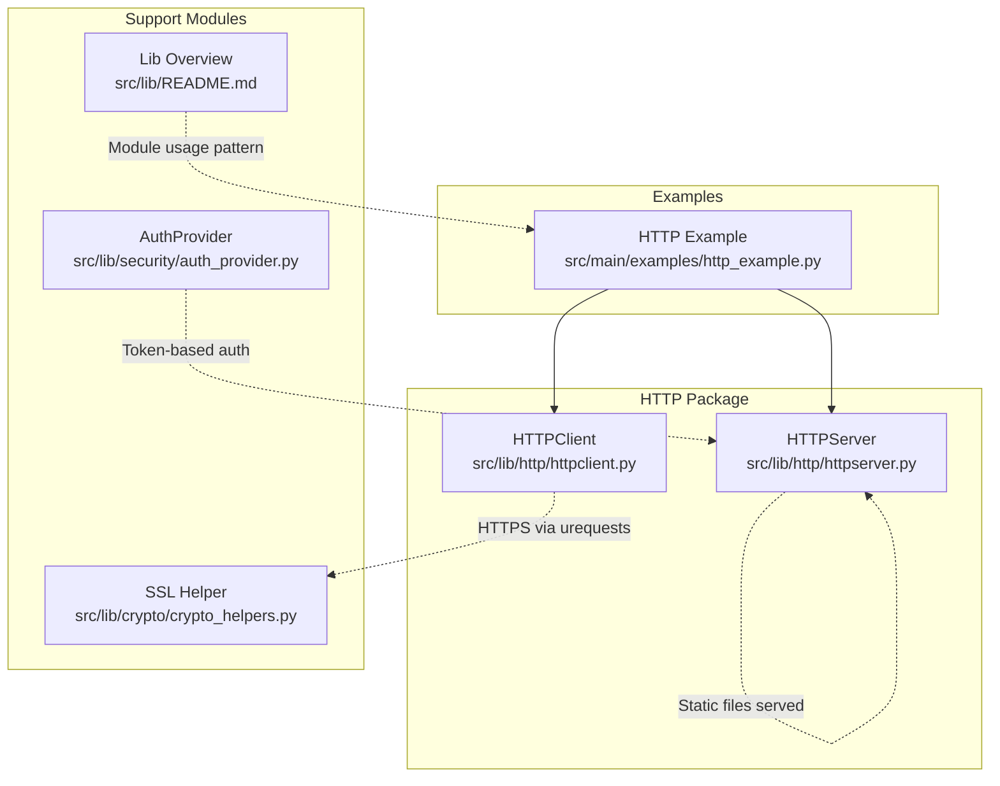
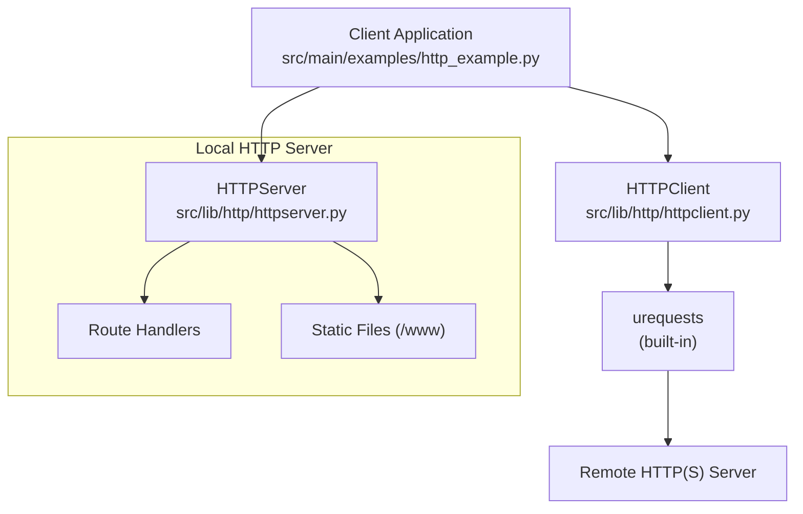
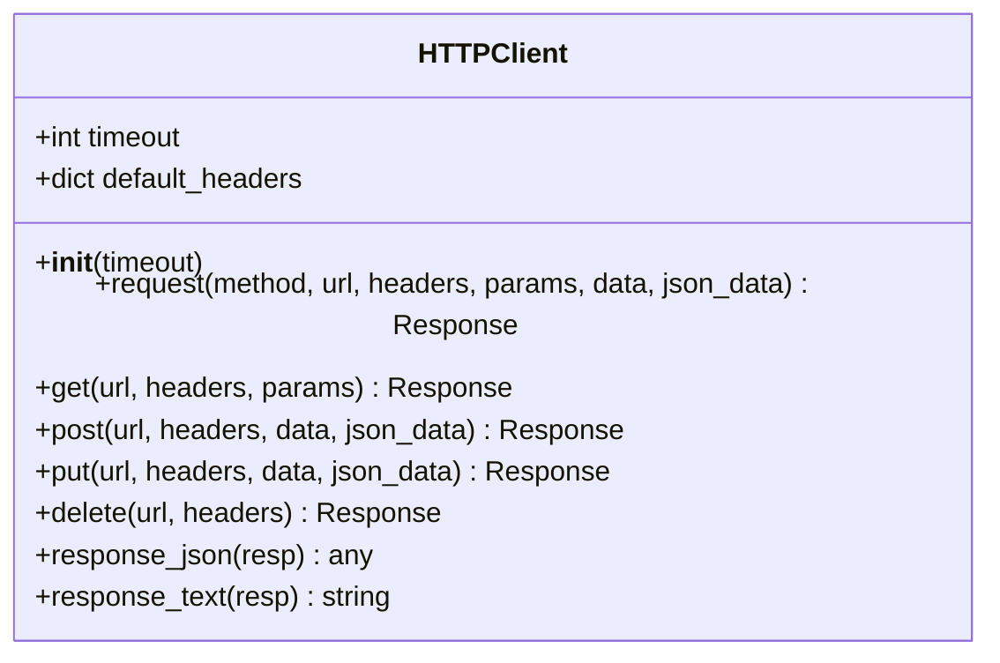
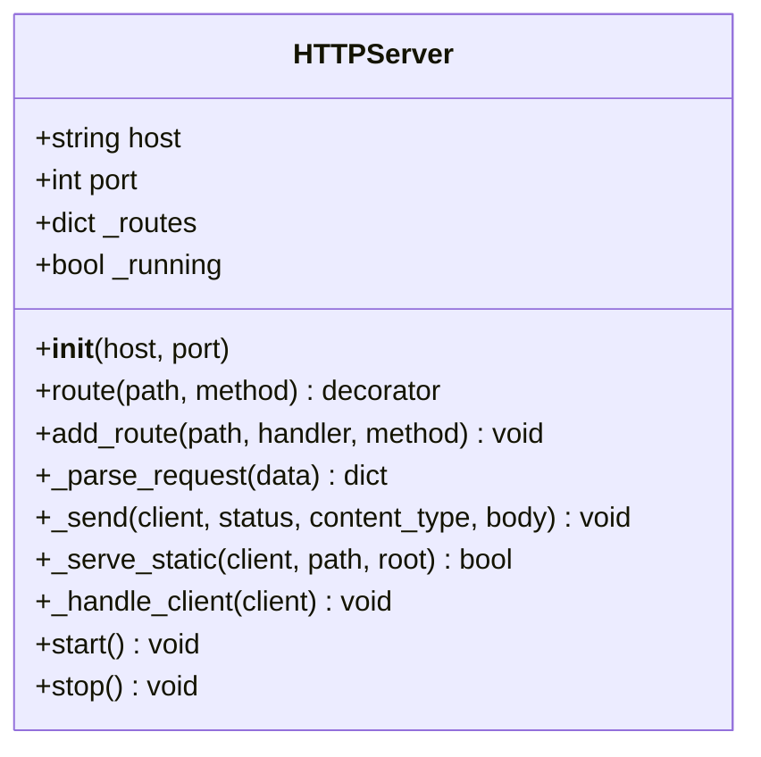
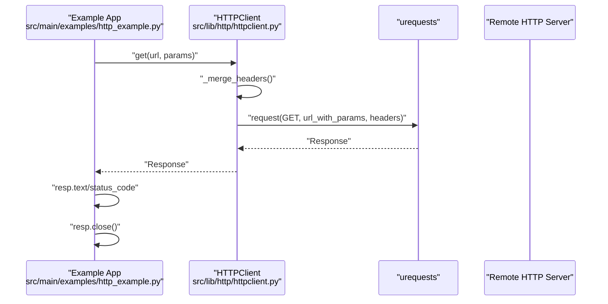
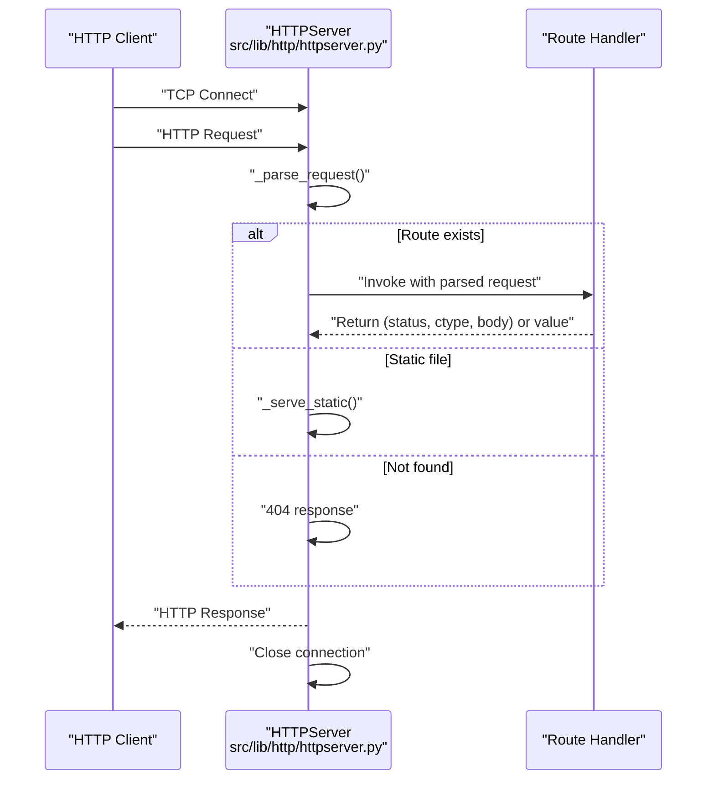
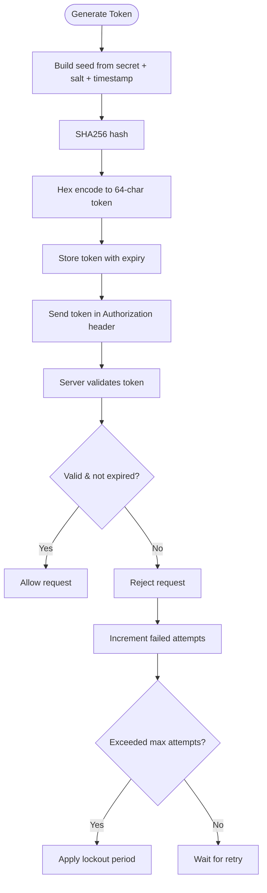
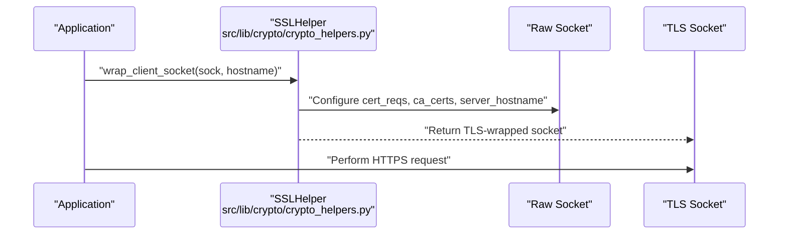
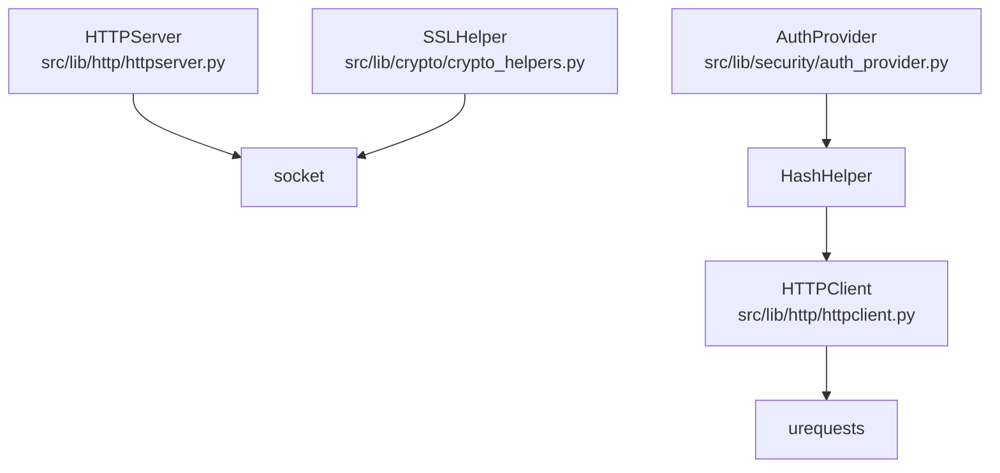

# HTTP API

<cite>
**Referenced Files in This Document**
- [httpclient.py](file://src/lib/http/httpclient.py)
- [httpserver.py](file://src/lib/http/httpserver.py)
- [http_example.py](file://src/main/examples/http_example.py)
- [crypto_helpers.py](file://src/lib/crypto/crypto_helpers.py)
- [auth_provider.py](file://src/lib/security/auth_provider.py)
- [README.md](file://src/lib/README.md)
</cite>

## Table of Contents
1. [Introduction](#introduction)
2. [Project Structure](#project-structure)
3. [Core Components](#core-components)
4. [Architecture Overview](#architecture-overview)
5. [Detailed Component Analysis](#detailed-component-analysis)
6. [Dependency Analysis](#dependency-analysis)
7. [Performance Considerations](#performance-considerations)
8. [Troubleshooting Guide](#troubleshooting-guide)
9. [Conclusion](#conclusion)
10. [Appendices](#appendices)

## Introduction
This document provides comprehensive HTTP API documentation for both client and server implementations in the project. It covers HTTP client methods (GET, POST, PUT, DELETE), parameter handling, headers, response processing, and server routing, request handling, response formatting, and middleware support. It also documents authentication methods (token-based), SSL/TLS configuration, timeouts, error response codes, and practical examples for REST API integration, form submissions, file uploads/downloads, and custom header management. Finally, it addresses connection pooling, keep-alive connections, and performance optimization techniques tailored for embedded environments.

## Project Structure
The HTTP-related functionality resides under the lib/http package and is complemented by examples and supporting modules for cryptography and security.

**Diagram sources**
- [httpclient.py:1-69](file://src/lib/http/httpclient.py#L1-L69)
- [httpserver.py:1-123](file://src/lib/http/httpserver.py#L1-L123)
- [http_example.py:1-43](file://src/main/examples/http_example.py#L1-L43)
- [crypto_helpers.py:1-194](file://src/lib/crypto/crypto_helpers.py#L1-L194)
- [auth_provider.py:1-257](file://src/lib/security/auth_provider.py#L1-L257)
- [README.md:1-72](file://src/lib/README.md#L1-L72)

**Section sources**
- [README.md:1-72](file://src/lib/README.md#L1-L72)

## Core Components
- HTTPClient: A lightweight HTTP client wrapper around MicroPython's urequests, supporting GET, POST, PUT, DELETE, query parameters, custom headers, JSON and raw data payloads, and response helpers for JSON and text.
- HTTPServer: A minimal HTTP server with route registration, request parsing, response formatting, static file serving, and basic middleware hooks via decorators.

Key capabilities:
- Client: request method with merged defaults, parameterized URLs, optional JSON or raw body, and response helpers.
- Server: route decorator and manual registration, request parsing, dynamic handler return values, static file serving, and connection closure.

**Section sources**
- [httpclient.py:12-69](file://src/lib/http/httpclient.py#L12-L69)
- [httpserver.py:9-123](file://src/lib/http/httpserver.py#L9-L123)

## Architecture Overview
The HTTP client leverages MicroPython’s urequests to perform HTTP(S) requests. The HTTP server is a socket-based implementation that parses incoming requests, dispatches to registered routes, and sends formatted responses. Optional SSL/TLS wrapping is supported via the crypto module.

**Diagram sources**
- [http_example.py:8-39](file://src/main/examples/http_example.py#L8-L39)
- [httpclient.py:6-10](file://src/lib/http/httpclient.py#L6-L10)
- [httpserver.py:102-123](file://src/lib/http/httpserver.py#L102-L123)

## Detailed Component Analysis

### HTTP Client: Methods, Parameters, Headers, and Responses
- Methods: get, post, put, delete, and a generic request method.
- Parameters: query parameters are appended to the URL automatically.
- Headers: default headers (e.g., User-Agent) are merged with caller-provided headers.
- Payloads: supports raw data and JSON payloads via dedicated parameters.
- Responses: helper methods to extract JSON and text safely.

**Diagram sources**
- [httpclient.py:12-69](file://src/lib/http/httpclient.py#L12-L69)

**Section sources**
- [httpclient.py:12-69](file://src/lib/http/httpclient.py#L12-L69)

### HTTP Server: Routing, Request Handling, and Responses
- Route registration: decorator-based and programmatic registration.
- Request parsing: extracts method, path, and body from raw HTTP text.
- Handler responses: handlers can return either a single value (converted to text/plain) or a tuple of (status, content_type, body).
- Static file serving: serves files from a configurable root with basic MIME inference.
- Connection lifecycle: accepts clients, handles requests, and closes connections.

**Diagram sources**
- [httpserver.py:9-123](file://src/lib/http/httpserver.py#L9-L123)

**Section sources**
- [httpserver.py:9-123](file://src/lib/http/httpserver.py#L9-L123)

### Client-Server Interaction Flow
This sequence illustrates a typical GET request from the example to a remote server.

**Diagram sources**
- [http_example.py:12-19](file://src/main/examples/http_example.py#L12-L19)
- [httpclient.py:25-42](file://src/lib/http/httpclient.py#L25-L42)

### Server Request Handling Flow
This flow shows how the server parses a request, dispatches to a route, and sends a response.

**Diagram sources**
- [httpserver.py:71-100](file://src/lib/http/httpserver.py#L71-L100)

### Authentication Methods
- Token-based authentication: The AuthProvider generates and validates short-lived tokens using cryptographic primitives. Tokens are stored with expiration and enforced via rate limiting and lockout policies.
- Basic authentication: Not implemented in the HTTP client/server; however, custom headers (such as Authorization) can be passed via the client’s headers parameter.

**Diagram sources**
- [auth_provider.py:100-183](file://src/lib/security/auth_provider.py#L100-L183)

**Section sources**
- [auth_provider.py:23-257](file://src/lib/security/auth_provider.py#L23-L257)

### SSL/TLS Configuration
- HTTPS via client: The HTTP client uses MicroPython’s urequests, which supports HTTPS when available in the runtime.
- TLS wrapping: The crypto module provides SSLHelper to wrap raw sockets for TLS client/server modes, enabling certificate verification and hostname SNI.

**Diagram sources**
- [crypto_helpers.py:151-173](file://src/lib/crypto/crypto_helpers.py#L151-L173)

**Section sources**
- [crypto_helpers.py:111-194](file://src/lib/crypto/crypto_helpers.py#L111-L194)

### Practical Examples

- REST API integration:
  - Use HTTPClient.get/post/put/delete with params and headers to interact with REST endpoints.
  - Example path: [http_example.py:12-19](file://src/main/examples/http_example.py#L12-L19)

- Form submissions:
  - Send form-encoded data via POST with data parameter and appropriate Content-Type via headers.

- File uploads/downloads:
  - Upload binary data using POST with data parameter.
  - Download files by requesting URLs and saving response content to storage.

- Custom header management:
  - Pass headers dictionary to HTTPClient methods; default headers are merged with custom ones.

- Static file serving:
  - Place files under the configured static root; the server serves index.html for root path and infers content type.

**Section sources**
- [http_example.py:12-39](file://src/main/examples/http_example.py#L12-L39)
- [httpserver.py:58-69](file://src/lib/http/httpserver.py#L58-L69)

## Dependency Analysis
- HTTPClient depends on MicroPython’s urequests module for HTTP(S) transport.
- HTTPServer is self-contained and uses Python’s socket module for networking.
- Crypto SSLHelper complements HTTPClient for advanced TLS scenarios.
- AuthProvider provides token-based authentication that can be integrated with server routes.

**Diagram sources**
- [httpclient.py:6-10](file://src/lib/http/httpclient.py#L6-L10)
- [httpserver.py:6-14](file://src/lib/http/httpserver.py#L6-L14)
- [crypto_helpers.py:16-28](file://src/lib/crypto/crypto_helpers.py#L16-L28)
- [auth_provider.py:16-20](file://src/lib/security/auth_provider.py#L16-L20)

**Section sources**
- [httpclient.py:6-10](file://src/lib/http/httpclient.py#L6-L10)
- [httpserver.py:6-14](file://src/lib/http/httpserver.py#L6-L14)
- [crypto_helpers.py:16-28](file://src/lib/crypto/crypto_helpers.py#L16-L28)
- [auth_provider.py:16-20](file://src/lib/security/auth_provider.py#L16-L20)

## Performance Considerations
- Timeout handling: The HTTPClient constructor accepts a timeout parameter; configure appropriately for embedded networks.
- Keep-alive: The server closes connections after each response; long-lived connections are not supported. For persistent connections, consider external reverse proxies or load balancers.
- Connection pooling: Not implemented in the HTTPServer; reuse sockets externally if needed.
- Static file serving: Serve static assets from the configured root to reduce CPU overhead.
- Memory constraints: Prefer streaming responses and avoid loading large payloads into memory when possible.
- Network reliability: Combine with WiFi keep-alive mechanisms to maintain connectivity in embedded environments.

[No sources needed since this section provides general guidance]

## Troubleshooting Guide
- Missing urequests module: The HTTPClient raises a runtime error if urequests is unavailable. Ensure the MicroPython firmware includes urequests.
- Bad request parsing: The server responds with 400 if the request cannot be parsed.
- Route not found: The server responds with 404 if no route matches and static file serving fails.
- Connection closure: The server closes the socket after sending the response; ensure clients handle this correctly.
- SSL/TLS failures: Verify certificate files and hostname configuration when using SSLHelper.

**Section sources**
- [httpclient.py:26-27](file://src/lib/http/httpclient.py#L26-L27)
- [httpserver.py:78-95](file://src/lib/http/httpserver.py#L78-L95)

## Conclusion
The HTTP client and server components provide a compact yet functional foundation for embedded HTTP communication. The client supports standard HTTP methods, parameterization, and response helpers, while the server offers route registration, request parsing, and static file serving. Optional SSL/TLS wrapping via the crypto module enables secure communications. Token-based authentication from the security module can be integrated to protect endpoints. For production embedded deployments, combine these components with robust network management and performance-conscious practices.

[No sources needed since this section summarizes without analyzing specific files]

## Appendices

### API Reference: HTTPClient
- Constructor: timeout (seconds)
- Methods:
  - request(method, url, headers=None, params=None, data=None, json_data=None)
  - get(url, headers=None, params=None)
  - post(url, headers=None, data=None, json_data=None)
  - put(url, headers=None, data=None, json_data=None)
  - delete(url, headers=None)
  - response_json(resp) -> decoded JSON or None
  - response_text(resp) -> text or empty string

**Section sources**
- [httpclient.py:12-69](file://src/lib/http/httpclient.py#L12-L69)

### API Reference: HTTPServer
- Constructor: host, port
- Methods:
  - route(path, method="GET") -> decorator
  - add_route(path, handler, method="GET")
  - start() -> runs event loop until stopped
  - stop() -> stops the server

- Handler return values:
  - Tuple: (status, content_type, body)
  - Single value: converted to text/plain

**Section sources**
- [httpserver.py:9-123](file://src/lib/http/httpserver.py#L9-L123)

### Example Usage References
- Client example: [http_example.py:12-19](file://src/main/examples/http_example.py#L12-L19)
- Server example skeleton: [http_example.py:22-34](file://src/main/examples/http_example.py#L22-L34)

**Section sources**
- [http_example.py:12-39](file://src/main/examples/http_example.py#L12-L39)