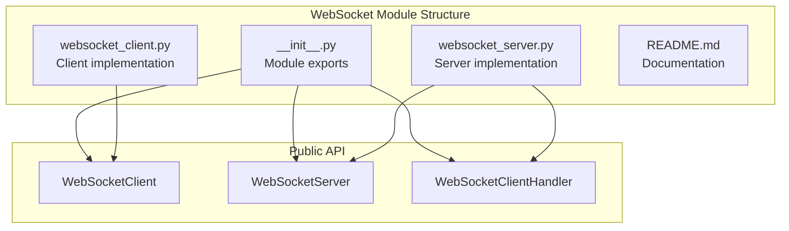
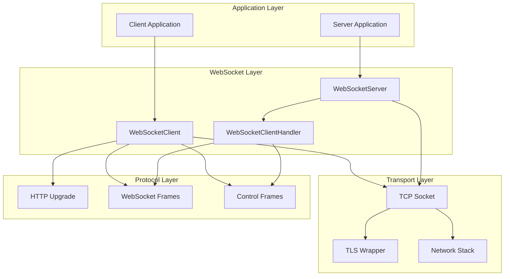
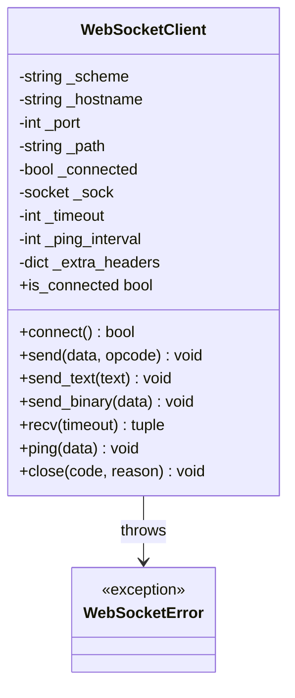
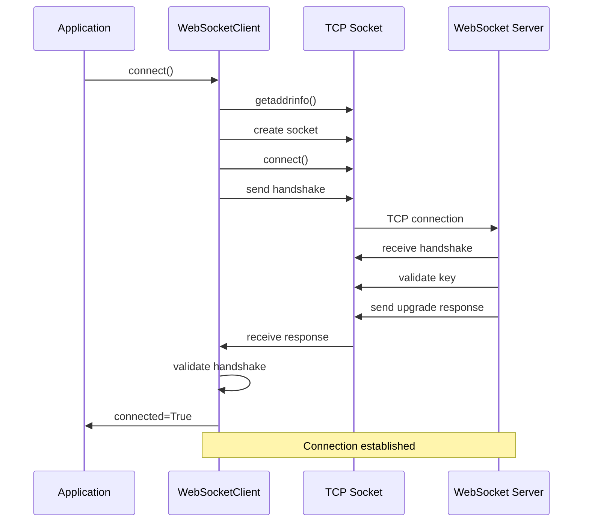
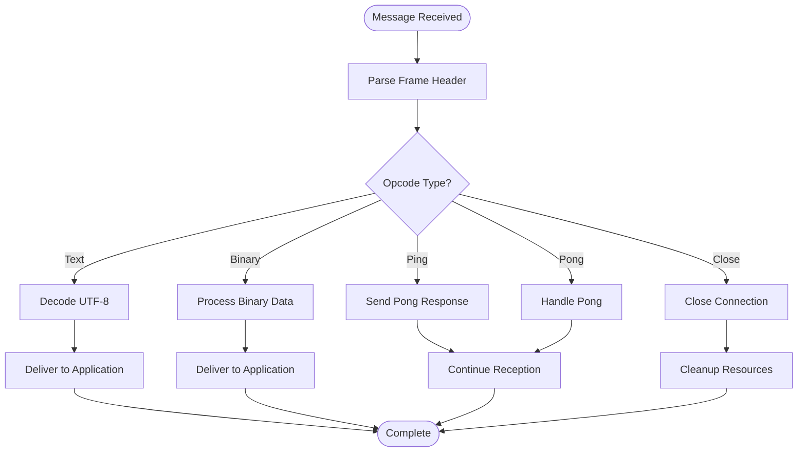
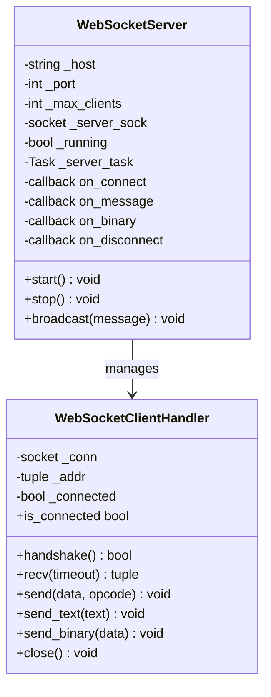
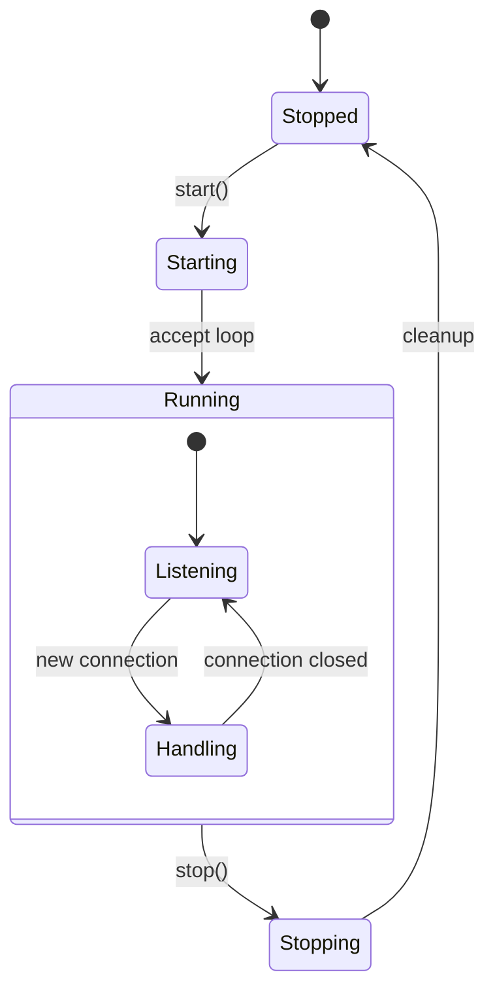
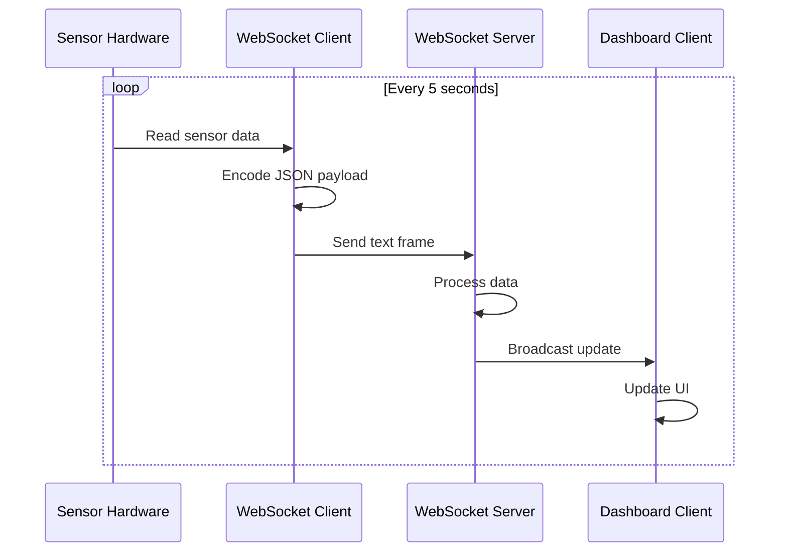

# WebSocket API

<cite>
**Referenced Files in This Document**
- [websocket_client.py](file://src/lib/websocket/websocket_client.py)
- [websocket_server.py](file://src/lib/websocket/websocket_server.py)
- [__init__.py](file://src/lib/websocket/__init__.py)
- [README.md](file://src/lib/websocket/README.md)
</cite>

## Table of Contents
1. [Introduction](#introduction)
2. [Project Structure](#project-structure)
3. [Core Components](#core-components)
4. [Architecture Overview](#architecture-overview)
5. [Detailed Component Analysis](#detailed-component-analysis)
6. [Protocol Implementation](#protocol-implementation)
7. [Security and Authentication](#security-and-authentication)
8. [Real-time Applications](#real-time-applications)
9. [Performance Considerations](#performance-considerations)
10. [Troubleshooting Guide](#troubleshooting-guide)
11. [Conclusion](#conclusion)

## Introduction

The WebSocket API provides real-time bidirectional communication capabilities for ESP32 microcontrollers using the WebSocket protocol (RFC 6455). This implementation enables both client and server functionality for building interactive applications, live data streaming systems, and event-driven architectures.

The WebSocket implementation consists of two main components:
- **WebSocketClient**: RFC 6455 compliant client for connecting to WebSocket servers
- **WebSocketServer**: Lightweight server for handling multiple client connections

Both implementations support text and binary frame types, automatic masking for client-to-server communication, ping/pong keepalive mechanisms, and asynchronous operation patterns suitable for embedded environments.

## Project Structure

The WebSocket module is organized with clear separation of concerns:

**Diagram sources**
- [__init__.py:1-8](file://src/lib/websocket/__init__.py#L1-L8)
- [websocket_client.py:59-105](file://src/lib/websocket/websocket_client.py#L59-L105)
- [websocket_server.py:200-231](file://src/lib/websocket/websocket_server.py#L200-L231)

**Section sources**
- [__init__.py:1-8](file://src/lib/websocket/__init__.py#L1-L8)
- [README.md:1-159](file://src/lib/websocket/README.md#L1-L159)

## Core Components

### WebSocketClient Class

The WebSocketClient provides comprehensive client functionality for connecting to WebSocket servers:

**Key Features:**
- RFC 6455 compliance with automatic handshake validation
- Support for both ws:// and wss:// protocols
- Automatic masking for client-to-server frames
- Built-in ping/pong keepalive mechanism
- Asynchronous operation with asyncio integration
- Text and binary frame support

**Connection Management:**
- URL parsing with automatic scheme detection
- TCP connection establishment with configurable timeouts
- TLS wrapping for secure connections (wss://)
- Graceful connection closure with proper status codes

**Message Handling:**
- Bidirectional text and binary frame processing
- Automatic unmasking for received frames
- Control frame handling (ping, pong, close)
- Fragmented frame support for large payloads

**Section sources**
- [websocket_client.py:59-105](file://src/lib/websocket/websocket_client.py#L59-L105)
- [websocket_client.py:147-195](file://src/lib/websocket/websocket_client.py#L147-L195)
- [websocket_client.py:285-392](file://src/lib/websocket/websocket_client.py#L285-L392)

### WebSocketServer Class

The WebSocketServer provides lightweight server functionality for handling client connections:

**Key Features:**
- Single-client connection management per connection
- Asynchronous client handling with separate tasks
- Built-in callback system for connection events
- Support for text and binary frame processing
- Automatic ping/pong handling

**Server Architecture:**
- Non-blocking socket listening with configurable backlog
- Per-connection handler management
- Event-driven callback system (connect, message, disconnect)
- Graceful shutdown with resource cleanup

**Section sources**
- [websocket_server.py:200-231](file://src/lib/websocket/websocket_server.py#L200-L231)
- [websocket_server.py:232-243](file://src/lib/websocket/websocket_server.py#L232-L243)
- [websocket_server.py:254-298](file://src/lib/websocket/websocket_server.py#L254-L298)

### WebSocketClientHandler Class

The WebSocketClientHandler manages individual client connections within the server:

**Responsibilities:**
- WebSocket handshake validation and response
- Frame encoding and decoding for bidirectional communication
- Connection state management and cleanup
- Control frame processing (ping/pong/close)

**Section sources**
- [websocket_server.py:36-44](file://src/lib/websocket/websocket_server.py#L36-L44)
- [websocket_server.py:46-87](file://src/lib/websocket/websocket_server.py#L46-L87)
- [websocket_server.py:89-145](file://src/lib/websocket/websocket_server.py#L89-L145)

## Architecture Overview

The WebSocket implementation follows a layered architecture with clear separation between protocol handling, connection management, and application-level callbacks:

**Diagram sources**
- [websocket_client.py:147-195](file://src/lib/websocket/websocket_client.py#L147-L195)
- [websocket_server.py:254-298](file://src/lib/websocket/websocket_server.py#L254-L298)
- [websocket_server.py:46-87](file://src/lib/websocket/websocket_server.py#L46-L87)

## Detailed Component Analysis

### WebSocket Client Implementation

The WebSocketClient implements the complete RFC 6455 specification with careful attention to protocol compliance and error handling:

**Diagram sources**
- [websocket_client.py:59-105](file://src/lib/websocket/websocket_client.py#L59-L105)
- [websocket_client.py:54-56](file://src/lib/websocket/websocket_client.py#L54-L56)

**Connection Establishment Flow:**

**Diagram sources**
- [websocket_client.py:147-195](file://src/lib/websocket/websocket_client.py#L147-L195)
- [websocket_server.py:46-87](file://src/lib/websocket/websocket_server.py#L46-L87)

**Message Processing Flow:**

**Diagram sources**
- [websocket_client.py:314-392](file://src/lib/websocket/websocket_client.py#L314-L392)
- [websocket_server.py:89-145](file://src/lib/websocket/websocket_server.py#L89-L145)

**Section sources**
- [websocket_client.py:198-244](file://src/lib/websocket/websocket_client.py#L198-L244)
- [websocket_client.py:246-283](file://src/lib/websocket/websocket_client.py#L246-L283)
- [websocket_client.py:314-392](file://src/lib/websocket/websocket_client.py#L314-L392)

### WebSocket Server Implementation

The WebSocketServer provides a lightweight solution for managing client connections with minimal resource overhead:

**Diagram sources**
- [websocket_server.py:200-231](file://src/lib/websocket/websocket_server.py#L200-L231)
- [websocket_server.py:36-44](file://src/lib/websocket/websocket_server.py#L36-L44)

**Server Lifecycle Management:**

**Diagram sources**
- [websocket_server.py:232-243](file://src/lib/websocket/websocket_server.py#L232-L243)
- [websocket_server.py:244-253](file://src/lib/websocket/websocket_server.py#L244-L253)

**Section sources**
- [websocket_server.py:200-231](file://src/lib/websocket/websocket_server.py#L200-L231)
- [websocket_server.py:232-243](file://src/lib/websocket/websocket_server.py#L232-L243)
- [websocket_server.py:254-298](file://src/lib/websocket/websocket_server.py#L254-L298)

## Protocol Implementation

### Frame Format and Encoding

The WebSocket implementation strictly follows RFC 6455 frame format specifications:

**Frame Structure:**
- **FIN bit**: Indicates final fragment in message
- **Rsv bits**: Reserved for future extensions (must be 0)
- **Opcode**: Frame type (text, binary, close, ping, pong)
- **Mask bit**: Indicates if payload is masked
- **Payload length**: Length field (126 for 16-bit, 127 for 64-bit)
- **Masking key**: 4-byte key for payload masking
- **Payload data**: Actual message content

**Payload Length Encoding:**
- 0-125: Direct length
- 126: Extended length in next 2 bytes
- 127: Extended length in next 8 bytes

**Section sources**
- [websocket_client.py:198-244](file://src/lib/websocket/websocket_client.py#L198-L244)
- [websocket_server.py:147-177](file://src/lib/websocket/websocket_server.py#L147-L177)

### Handshake Process

The WebSocket handshake follows the HTTP Upgrade mechanism:

**Client Handshake:**
1. Send HTTP GET request with WebSocket upgrade headers
2. Include Sec-WebSocket-Key for challenge-response
3. Wait for HTTP 101 Switching Protocols response
4. Verify Sec-WebSocket-Accept response

**Server Handshake:**
1. Parse incoming HTTP request for upgrade headers
2. Extract and validate Sec-WebSocket-Key
3. Generate response using SHA-1 hash + GUID
4. Send HTTP 101 response with accepted key

**Section sources**
- [websocket_client.py:107-144](file://src/lib/websocket/websocket_client.py#L107-L144)
- [websocket_server.py:46-87](file://src/lib/websocket/websocket_server.py#L46-L87)

### Control Frame Processing

The implementation handles WebSocket control frames automatically:

**Ping/Pong Handling:**
- Client automatically responds to server ping frames
- Server automatically responds to client ping frames
- Configurable ping interval for keepalive
- Ping data echo for latency measurement

**Close Frame Processing:**
- Proper close handshake with status codes
- Graceful connection termination
- Resource cleanup and callback invocation

**Section sources**
- [websocket_client.py:380-392](file://src/lib/websocket/websocket_client.py#L380-L392)
- [websocket_server.py:137-145](file://src/lib/websocket/websocket_server.py#L137-L145)

## Security and Authentication

### Transport Security (WSS)

The WebSocket implementation supports secure connections through TLS:

**TLS Configuration:**
- Automatic TLS wrapping for wss:// URLs
- Fallback to standard socket for ws:// URLs
- SSL module availability checking
- Server hostname verification for secure contexts

**Security Considerations:**
- Certificate validation for secure connections
- Cipher suite selection based on platform capabilities
- Memory usage optimization for embedded environments

**Limitations:**
- Requires ussl module for ESP32 platforms
- Limited cipher suite support compared to desktop implementations
- Certificate verification may require additional configuration

**Section sources**
- [websocket_client.py:162-169](file://src/lib/websocket/websocket_client.py#L162-L169)
- [README.md:155-158](file://src/lib/websocket/README.md#L155-L158)

### Authentication Mechanisms

The WebSocket protocol itself does not define authentication methods. Authentication can be implemented through several approaches:

**HTTP Header Authentication:**
- Pass authentication tokens in WebSocket headers during handshake
- JWT tokens or API keys in custom headers
- Session-based authentication through cookie headers

**Post-Handshake Authentication:**
- Send authentication message immediately after successful handshake
- Protocol-specific authentication commands
- Application-level session management

**Section sources**
- [websocket_client.py:122-125](file://src/lib/websocket/websocket_client.py#L122-L125)
- [websocket_client.py:73-100](file://src/lib/websocket/websocket_client.py#L73-L100)

## Real-time Applications

### Live Data Streaming

The WebSocket implementation excels at real-time data streaming scenarios:

**Sensor Data Streaming:**
- Continuous temperature and humidity monitoring
- Real-time environmental data collection
- Periodic data aggregation and transmission
- Automatic retry on connection failures

**Dashboard Applications:**
- Live chart updates with streaming data
- Multi-client broadcast messaging
- Interactive control interfaces
- Event-driven notification systems

**Example Implementation Patterns:**

**Diagram sources**
- [README.md:43-66](file://src/lib/websocket/README.md#L43-L66)
- [README.md:68-115](file://src/lib/websocket/README.md#L68-L115)

### Event-Driven Architectures

The callback-based server implementation supports event-driven patterns:

**Event Types:**
- Connection events (connect, disconnect)
- Message events (text, binary)
- System events (server start, stop)

**Application Patterns:**
- Command-response patterns
- Publish-subscribe messaging
- Real-time collaboration systems
- IoT device management

**Section sources**
- [websocket_server.py:224-228](file://src/lib/websocket/websocket_server.py#L224-L228)
- [websocket_server.py:262-288](file://src/lib/websocket/websocket_server.py#L262-L288)

### Interactive Applications

The WebSocket implementation supports various interactive application patterns:

**Chat Systems:**
- Real-time messaging between clients
- Room-based communication channels
- User presence indicators
- Message history and synchronization

**Remote Control:**
- Bidirectional control commands
- Real-time feedback and status updates
- Multi-device coordination
- Command queuing and replay

**Monitoring and Alerting:**
- Real-time system status monitoring
- Automated alert distribution
- Historical data visualization
- Threshold-based notifications

## Performance Considerations

### Memory Management

The WebSocket implementation is designed for memory-constrained environments:

**Memory Optimization Strategies:**
- Chunked frame processing to minimize buffer usage
- Non-blocking socket operations for concurrent handling
- Efficient frame encoding without unnecessary copies
- Minimal heap allocation during normal operation

**Resource Limits:**
- Maximum payload size determined by available RAM
- Connection pooling for multiple simultaneous connections
- Timeout-based resource cleanup
- Garbage collection considerations for long-running applications

### Network Efficiency

**Optimization Techniques:**
- Automatic ping/pong keepalive to detect dead connections
- Configurable timeout values for different network conditions
- Efficient frame parsing with minimal CPU overhead
- Buffer management for high-throughput scenarios

**Scalability Considerations:**
- Single-client limitation per connection handler
- Asynchronous processing for concurrent operations
- Connection reuse patterns for reduced overhead
- Network interface optimization for embedded platforms

### Error Recovery

**Robust Error Handling:**
- Graceful degradation on protocol violations
- Automatic retry mechanisms for transient failures
- Connection state recovery after interruptions
- Resource cleanup on error conditions

**Network Resilience:**
- Timeout-based operation limits
- Partial frame recovery for corrupted data
- Connection health monitoring
- Automatic failover to backup endpoints

## Troubleshooting Guide

### Common Connection Issues

**Handshake Failures:**
- Verify server supports WebSocket protocol
- Check network connectivity and firewall settings
- Validate URL format and port accessibility
- Ensure server responds to HTTP upgrade requests

**TLS/SSL Problems:**
- Confirm ussl module availability on target platform
- Verify certificate validity and trust chain
- Check hostname matching for secure connections
- Review cipher suite compatibility

**Timeout Issues:**
- Adjust connection timeout values based on network conditions
- Implement exponential backoff for reconnection attempts
- Monitor network latency and adjust ping intervals
- Consider network buffering for high-latency links

### Debugging Techniques

**Logging and Monitoring:**
- Enable verbose logging for connection establishment
- Monitor frame counts and sizes for performance analysis
- Track error rates and failure patterns
- Log connection lifecycle events for troubleshooting

**Diagnostic Tools:**
- Network packet capture for protocol analysis
- Connection state monitoring during operation
- Memory usage tracking for resource constraints
- Performance profiling for optimization opportunities

**Section sources**
- [websocket_client.py:157-160](file://src/lib/websocket/websocket_client.py#L157-L160)
- [websocket_client.py:164-169](file://src/lib/websocket/websocket_client.py#L164-L169)
- [websocket_client.py:127-144](file://src/lib/websocket/websocket_client.py#L127-L144)

### Performance Optimization

**Frame Processing Optimization:**
- Minimize payload size for frequent updates
- Batch multiple small messages into larger frames
- Use binary frames for structured data transmission
- Implement efficient serialization for complex data

**Connection Management:**
- Optimize ping interval based on network characteristics
- Implement connection pooling for multiple endpoints
- Use connection reuse to reduce handshake overhead
- Monitor connection health and proactively reconnect

**Memory Management:**
- Monitor heap usage during peak operations
- Implement buffer recycling for high-frequency updates
- Use streaming for large payload processing
- Consider external storage for persistent message queues

## Conclusion

The WebSocket API provides a comprehensive solution for real-time bidirectional communication in embedded environments. The implementation successfully balances protocol compliance with resource efficiency, making it suitable for a wide range of applications from simple sensor monitoring to complex interactive systems.

**Key Strengths:**
- Complete RFC 6455 compliance with robust error handling
- Lightweight implementation optimized for embedded platforms
- Comprehensive callback system for event-driven architectures
- Support for both ws:// and wss:// protocols
- Automatic ping/pong keepalive for connection health

**Limitations and Considerations:**
- Single-client connection limitation per server handler
- Memory constraints in highly concurrent scenarios
- Platform-specific SSL/TLS requirements
- Need for external authentication mechanisms

**Future Enhancement Opportunities:**
- Multi-client server support for scalable deployments
- Enhanced security features including certificate management
- Message queuing and persistence for reliable delivery
- Advanced room-based communication patterns
- Integration with existing IoT frameworks and protocols

The WebSocket API serves as a solid foundation for building real-time applications on ESP32 platforms, providing the essential building blocks for modern interactive systems while maintaining the simplicity and reliability required for embedded development.