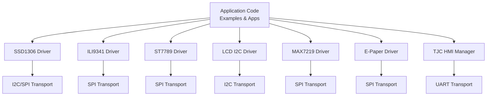
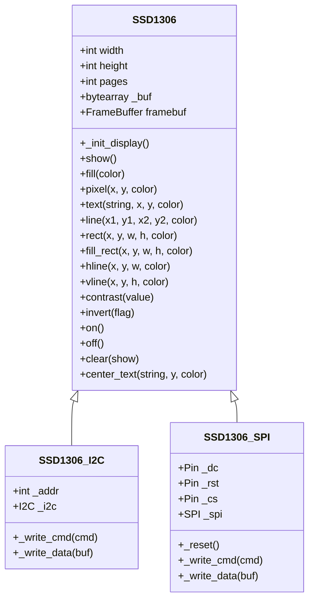
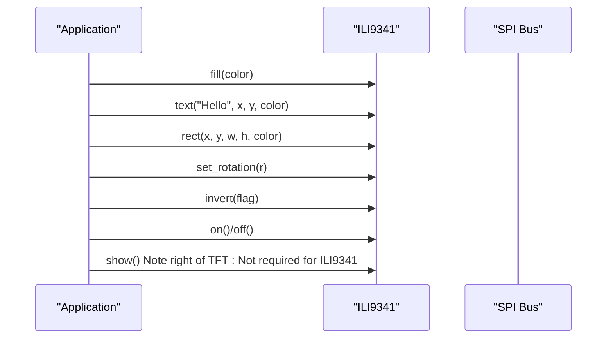
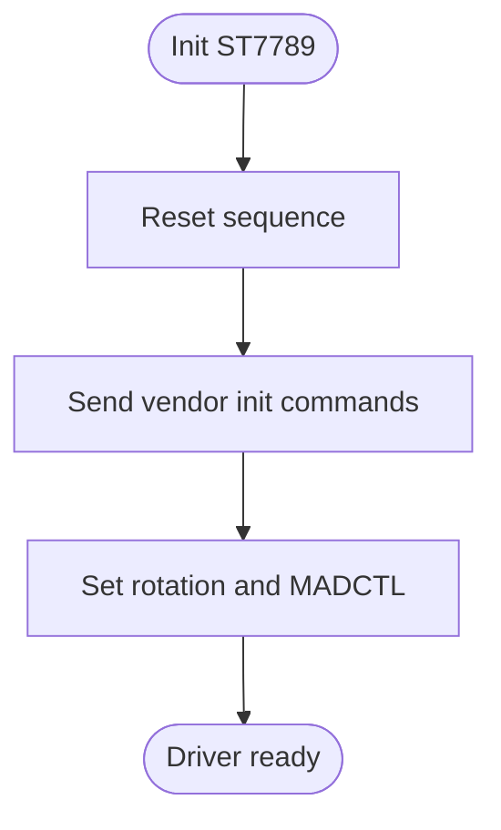
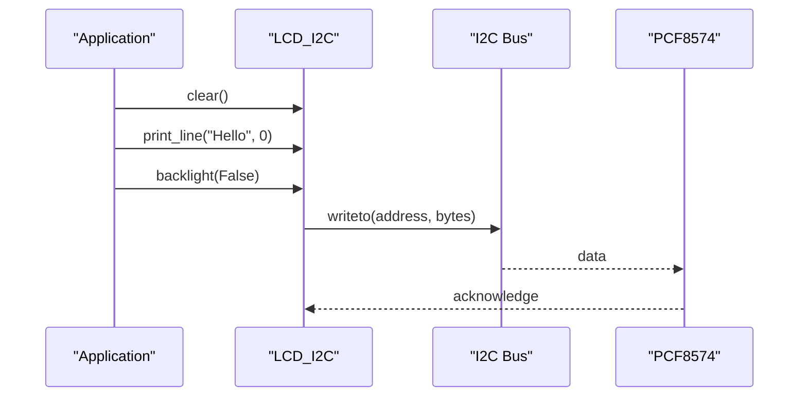
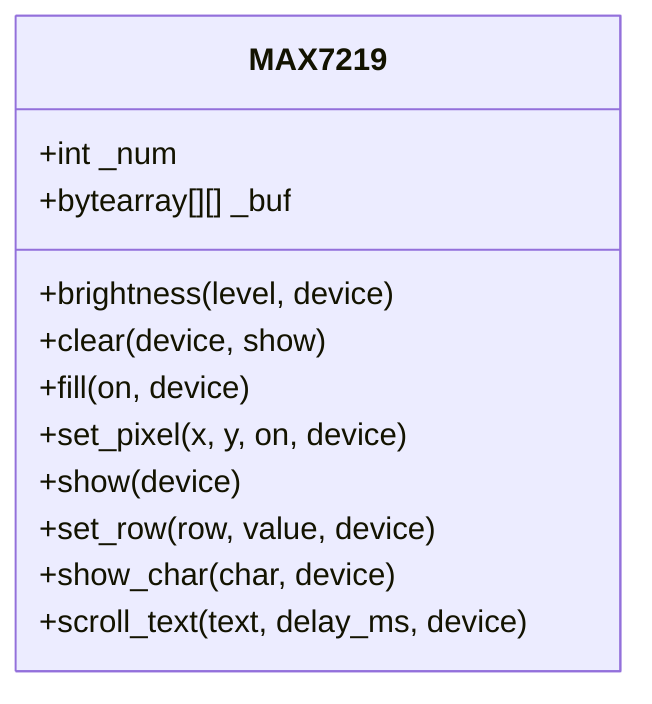
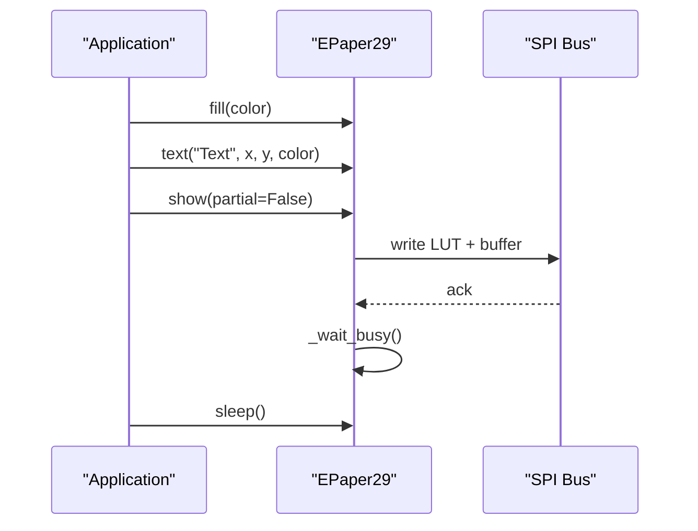
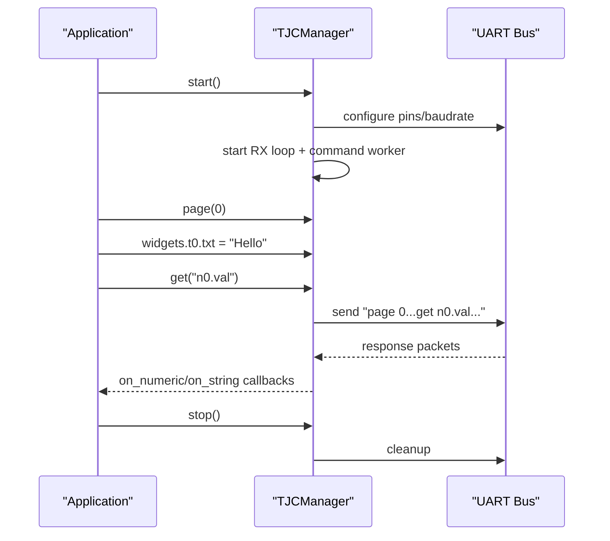
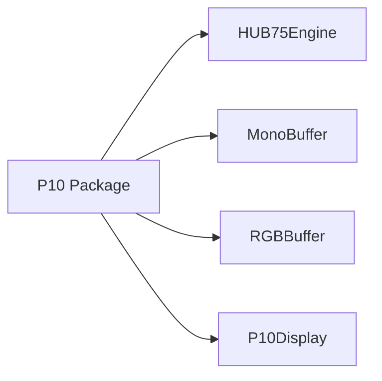
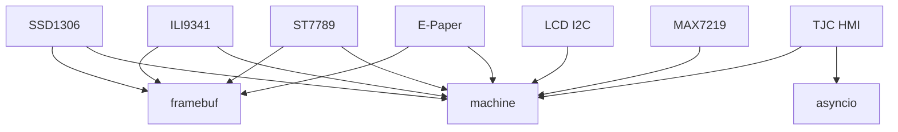

# Display API

<cite>
**Referenced Files in This Document**
- [display_example.py](file://src/main/examples/display_example.py)
- [README.md](file://src/lib/display/README.md)
- [ssd1306.py](file://src/lib/display/ssd1306.py)
- [ili9341.py](file://src/lib/display/ili9341.py)
- [st7789.py](file://src/lib/display/st7789.py)
- [lcd_i2c.py](file://src/lib/display/lcd_i2c.py)
- [max7219.py](file://src/lib/display/max7219.py)
- [epaper.py](file://src/lib/display/epaper.py)
- [tjc_hmi.py](file://src/lib/display/tjc_hmi.py)
- [__init__.py](file://src/lib/p10/__init__.py)
</cite>

## Table of Contents
1. [Introduction](#introduction)
2. [Project Structure](#project-structure)
3. [Core Components](#core-components)
4. [Architecture Overview](#architecture-overview)
5. [Detailed Component Analysis](#detailed-component-analysis)
6. [Dependency Analysis](#dependency-analysis)
7. [Performance Considerations](#performance-considerations)
8. [Troubleshooting Guide](#troubleshooting-guide)
9. [Conclusion](#conclusion)
10. [Appendices](#appendices)

## Introduction
This document provides comprehensive API documentation for display driver modules in the repository. It covers OLED displays (SSD1306), TFT displays (ILI9341, ST7789), LCD displays (I2C), LED matrices (MAX7219), E-paper displays, and specialized displays (TJC HMI). For each driver, it documents initialization sequences, drawing primitives, text rendering, image display, color management, coordinate systems, pixel formats, buffer management, refresh operations, and usage patterns. It also includes practical examples for graphics programming, text display, animation effects, and user interface elements, along with configuration notes, resolution handling, power management, and performance optimization tips. Multi-display setups and integration with input systems are addressed for interactive applications.

## Project Structure
The display-related code resides under src/lib/display and src/lib/p10. The primary display drivers are implemented as separate modules, each encapsulating initialization, command/data transfers, and drawing primitives. Example usage is provided in src/main/examples/display_example.py, demonstrating how to instantiate and operate each display type.

```mermaid
graph TB
subgraph "Display Drivers"
SSD["SSD1306 (I2C/SPI)"]
ILI["ILI9341 (SPI)"]
ST7789["ST7789 (SPI)"]
LCD["LCD I2C (PCF8574)"]
MAX["MAX7219 (SPI)"]
EPD["E-Paper 2.9\" (SPI)"]
TJC["TJC HMI (UART)"]
end
subgraph "P10 Panels"
P10["P10 Modules (HUB75)"]
end
SSD --> |"I2C/SPI"| SSD
ILI --> |"SPI"| ILI
ST7789 --> |"SPI"| ST7789
LCD --> |"I2C via PCF8574"| LCD
MAX --> |"SPI daisy-chain"| MAX
EPD --> |"SPI"| EPD
TJC --> |"UART"| TJC
P10 --> |"HUB75"| P10
```

**Diagram sources**
- [ssd1306.py:151-247](file://src/lib/display/ssd1306.py#L151-L247)
- [ili9341.py:56-261](file://src/lib/display/ili9341.py#L56-L261)
- [st7789.py:56-241](file://src/lib/display/st7789.py#L56-L241)
- [lcd_i2c.py:45-214](file://src/lib/display/lcd_i2c.py#L45-L214)
- [max7219.py:55-229](file://src/lib/display/max7219.py#L55-L229)
- [epaper.py:34-207](file://src/lib/display/epaper.py#L34-L207)
- [tjc_hmi.py:152-917](file://src/lib/display/tjc_hmi.py#L152-L917)
- [__init__.py:13-16](file://src/lib/p10/__init__.py#L13-L16)

**Section sources**
- [README.md:18-29](file://src/lib/display/README.md#L18-L29)
- [display_example.py:11-240](file://src/main/examples/display_example.py#L11-L240)

## Core Components
This section summarizes the core capabilities and APIs for each display driver family.

- SSD1306 OLED (I2C/SPI)
  - Initialization: constructor with width/height and interface pins; internal framebuffer via framebuf
  - Drawing: pixel, line, rect, fill_rect, hline, vline, text
  - Control: show, fill, clear, contrast, invert, on/off
  - Coordinate system: logical pixels; orientation handled by controller
  - Pixel format: monochrome (1-bit)
  - Refresh: show flushes framebuffer to display
  - Power: on/off, contrast control

- ILI9341 TFT (SPI)
  - Initialization: constructor with SPI pins, optional width/height, rotation
  - Drawing: pixel, line (Bresenham), rect, fill_rect, hline, vline, text (bitmap font, scalable)
  - Color: RGB565 helpers and constants
  - Control: set_rotation, invert, on/off
  - Windowing: _set_window for efficient partial updates
  - Buffering: direct pixel writes and bulk fills

- ST7789 TFT (SPI)
  - Initialization: constructor with SPI pins, width/height, optional x/y offsets, rotation
  - Drawing: pixel, line, rect, fill_rect, hline, vline, text (bitmap font, scalable)
  - Color: RGB565 helpers and constants
  - Control: set_rotation, invert, on/off, clear
  - Windowing: _set_window with optional offsets for rotated/resolution variants

- LCD I2C (PCF8574)
  - Initialization: constructor with I2C pins, address, cols/rows
  - Control: clear, home, set_cursor, print/print_line, backlight, display_on, cursor, blink
  - Custom characters: create_char, write_char
  - Backplane: 4-bit mode via PCF8574

- MAX7219 LED Matrix (SPI)
  - Initialization: constructor with SPI pins, num_devices (daisy-chain)
  - Drawing: set_pixel, set_row, show_char, fill/clear
  - Scrolling: scroll_text with configurable delay
  - Brightness: brightness(level)
  - Buffering: per-device 8x8 row buffers

- E-Paper 2.9" (SPI)
  - Initialization: constructor with SPI pins, busy pin, internal 1-bit framebuffer
  - Drawing: pixel, line, rect, fill_rect, text
  - Control: show (full vs partial), clear, sleep
  - LUT: precomputed lookup tables for waveform control

- TJC HMI (UART)
  - Initialization: constructor with UART pins, baudrate, response mode, brightness
  - High-level commands: page, click, vis, tsw, get, dim, baud, sleep, beep, play, add/cle curves, RTC, EEPROM, GPIO, layer/move, GUI drawing
  - Widget access: dot-notation proxy (e.g., tjc.t0.txt = "...")
  - Callbacks: touch, touch coordinates, page, numeric/string, system events, error, raw, custom commands
  - Async: RX loop and command queue for reliable operation

- P10 Panels (HUB75)
  - Exposed via p10 package: P10Mono, P10RGB, P10Chain
  - Underlying: HUB75Engine, MonoBuffer/RGBBuffer, P10Display
  - Panels: P10 32x16 (1/4 scan), 64x32 (1/16 scan)
  - Modes: monochrome, RGB full color, chained panels

**Section sources**
- [ssd1306.py:34-149](file://src/lib/display/ssd1306.py#L34-L149)
- [ili9341.py:56-261](file://src/lib/display/ili9341.py#L56-L261)
- [st7789.py:56-241](file://src/lib/display/st7789.py#L56-L241)
- [lcd_i2c.py:45-214](file://src/lib/display/lcd_i2c.py#L45-L214)
- [max7219.py:55-229](file://src/lib/display/max7219.py#L55-L229)
- [epaper.py:34-207](file://src/lib/display/epaper.py#L34-L207)
- [tjc_hmi.py:152-917](file://src/lib/display/tjc_hmi.py#L152-L917)
- [__init__.py:13-16](file://src/lib/p10/__init__.py#L13-L16)

## Architecture Overview
The display drivers follow a layered architecture:
- Hardware abstraction: SPI/I2C/UART transport and reset/control pin management
- Command/data framing: dedicated write functions for commands and data
- Initialization sequences: vendor-specific init scripts applied during construction
- Drawing primitives: unified framebuf-based or direct pixel writes
- Buffering: framebuffer for monochrome displays; direct pixel writes for color TFTs
- Application integration: examples demonstrate async usage and callback-driven workflows



**Diagram sources**
- [ssd1306.py:151-247](file://src/lib/display/ssd1306.py#L151-L247)
- [ili9341.py:56-102](file://src/lib/display/ili9341.py#L56-L102)
- [st7789.py:56-104](file://src/lib/display/st7789.py#L56-L104)
- [lcd_i2c.py:69-86](file://src/lib/display/lcd_i2c.py#L69-L86)
- [max7219.py:76-93](file://src/lib/display/max7219.py#L76-L93)
- [epaper.py:60-84](file://src/lib/display/epaper.py#L60-L84)
- [tjc_hmi.py:188-220](file://src/lib/display/tjc_hmi.py#L188-L220)

## Detailed Component Analysis

### SSD1306 OLED (I2C/SPI)
- Initialization
  - Constructor sets width/height, pages, and allocates a framebuffer (MONO_VLSB)
  - _init_display applies vendor-specific initialization sequence
- Drawing primitives
  - Framebuffer-backed: pixel, line, rect, fill_rect, hline, vline, text
  - fill clears framebuffer; show writes framebuffer to display window
- Control and power
  - contrast, invert, on/off, clear
- Coordinate system and pixel format
  - Logical pixels; vertical byte layout (pages)
- Buffering and refresh
  - Internal bytearray buffer; show flushes entire window
- Usage patterns
  - Clear, draw text/lines, show, off



**Diagram sources**
- [ssd1306.py:34-247](file://src/lib/display/ssd1306.py#L34-L247)

**Section sources**
- [ssd1306.py:34-149](file://src/lib/display/ssd1306.py#L34-L149)
- [display_example.py:14-26](file://src/main/examples/display_example.py#L14-L26)

### ILI9341 TFT (SPI)
- Initialization
  - Constructor initializes pins, SPI, resets, and runs vendor init sequence
  - set_rotation adjusts MADCTL and effective width/height
- Drawing primitives
  - pixel writes single pixels via windowing
  - fill_rect performs bulk writes with chunked SPI transfers
  - line uses Bresenham algorithm
  - text renders bitmap characters with optional scaling
- Color management
  - color565 converts RGB888 to RGB565
  - constants for common colors
- Control and power
  - invert, on/off, clear/fill
- Coordinate system and pixel format
  - Logical pixels; 16-bit RGB565
- Buffering and refresh
  - Direct pixel writes; no framebuffer; show not required



**Diagram sources**
- [ili9341.py:56-261](file://src/lib/display/ili9341.py#L56-L261)

**Section sources**
- [ili9341.py:56-261](file://src/lib/display/ili9341.py#L56-L261)
- [display_example.py:32-43](file://src/main/examples/display_example.py#L32-L43)

### ST7789 TFT (SPI)
- Initialization
  - Constructor initializes pins, SPI, resets, and runs vendor init sequence
  - set_rotation adjusts MADCTL; supports optional x/y offsets for variant panels
- Drawing primitives
  - pixel, line, rect, fill_rect, hline, vline, text (bitmap font, scalable)
- Color management
  - color565 helper and constants
- Control and power
  - invert, on/off, clear
- Coordinate system and pixel format
  - Logical pixels; 16-bit RGB565
- Buffering and refresh
  - Direct pixel writes; no framebuffer; show not required



**Diagram sources**
- [st7789.py:108-152](file://src/lib/display/st7789.py#L108-L152)

**Section sources**
- [st7789.py:56-241](file://src/lib/display/st7789.py#L56-L241)
- [display_example.py:49-60](file://src/main/examples/display_example.py#L49-L60)

### LCD I2C (PCF8574)
- Initialization
  - Constructor initializes I2C, address, rows/columns, and PCF8574 in 4-bit mode
- Control and text
  - clear, home, set_cursor, print/print_line
  - backlight, display_on, cursor, blink
- Custom characters
  - create_char and write_char for CGRAM-defined glyphs
- Backplane specifics
  - 4-bit mode via PCF8574; nibble writes with enable strobe



**Diagram sources**
- [lcd_i2c.py:69-133](file://src/lib/display/lcd_i2c.py#L69-L133)

**Section sources**
- [lcd_i2c.py:45-214](file://src/lib/display/lcd_i2c.py#L45-L214)
- [display_example.py:66-82](file://src/main/examples/display_example.py#L66-L82)

### MAX7219 LED Matrix (SPI)
- Initialization
  - Constructor initializes SPI, CS, and daisy-chain devices; configures registers
- Drawing primitives
  - set_pixel, set_row, show_char, fill/clear
- Scrolling
  - scroll_text animates text across chained matrices
- Brightness and buffering
  - brightness(level); per-device 8x8 row buffers; flush to display



**Diagram sources**
- [max7219.py:55-229](file://src/lib/display/max7219.py#L55-L229)

**Section sources**
- [max7219.py:55-229](file://src/lib/display/max7219.py#L55-L229)
- [display_example.py:88-98](file://src/main/examples/display_example.py#L88-L98)

### E-Paper 2.9" (SPI)
- Initialization
  - Constructor sets up SPI, DC/RST/BUSY pins, allocates 1-bit framebuffer
  - _init_display configures LUTs and windows
- Drawing primitives
  - pixel, line, rect, fill_rect, text
- Control and power
  - show(full vs partial), clear, sleep
- Buffering and refresh
  - 1-bit framebuffer (MONO_HLSB); show transfers buffer to display with LUT selection



**Diagram sources**
- [epaper.py:60-137](file://src/lib/display/epaper.py#L60-L137)

**Section sources**
- [epaper.py:34-207](file://src/lib/display/epaper.py#L34-L207)
- [display_example.py:104-115](file://src/main/examples/display_example.py#L104-L115)

### TJC HMI (UART)
- Initialization
  - Constructor configures UART, response mode, brightness; starts RX loop and command worker
- High-level commands
  - Page switching, component visibility/touch, value retrieval, dimming, sleep, beeps, audio playback, curve management, RTC, EEPROM, GPIO, layer/move, GUI drawing
- Widget access
  - Dot-notation proxy for widget attributes (e.g., tjc.t0.txt = "...")
- Callbacks
  - Touch, touch coordinates, page change, numeric/string values, system events, errors, raw packets, custom commands
- Async operation
  - Non-blocking RX parsing and command queue with flow control



**Diagram sources**
- [tjc_hmi.py:188-220](file://src/lib/display/tjc_hmi.py#L188-L220)
- [tjc_hmi.py:771-797](file://src/lib/display/tjc_hmi.py#L771-L797)
- [tjc_hmi.py:800-834](file://src/lib/display/tjc_hmi.py#L800-L834)

**Section sources**
- [tjc_hmi.py:152-917](file://src/lib/display/tjc_hmi.py#L152-L917)
- [display_example.py:124-141](file://src/main/examples/display_example.py#L124-L141)

### P10 Panels (HUB75)
- Package exposure
  - P10Mono, P10RGB, P10Chain via p10 package
- Underlying components
  - HUB75Engine: low-level HUB75 protocol via RMT and GPIO
  - MonoBuffer/RGBBuffer: frame buffers
  - P10Display: high-level display API
- Panels and modes
  - P10 32x16 (1/4 scan), 64x32 (1/16 scan)
  - Monochrome, RGB full color, chained panels



**Diagram sources**
- [__init__.py:13-16](file://src/lib/p10/__init__.py#L13-L16)

**Section sources**
- [__init__.py:1-16](file://src/lib/p10/__init__.py#L1-L16)

## Dependency Analysis
- Inter-driver dependencies
  - No cross-driver dependencies among display modules
- External dependencies
  - machine: Pin, SPI, I2C, UART, time
  - framebuf: framebuffer creation and drawing primitives
  - asyncio: TJC RX loop and command queue
- Coupling and cohesion
  - Each driver is cohesive around a single display controller or backpack
  - Coupling is limited to hardware abstractions and shared framebuf



**Diagram sources**
- [ssd1306.py:9-11](file://src/lib/display/ssd1306.py#L9-L11)
- [ili9341.py:9-11](file://src/lib/display/ili9341.py#L9-L11)
- [st7789.py:9-11](file://src/lib/display/st7789.py#L9-L11)
- [lcd_i2c.py:7-8](file://src/lib/display/lcd_i2c.py#L7-L8)
- [max7219.py:9-10](file://src/lib/display/max7219.py#L9-L10)
- [epaper.py:9-11](file://src/lib/display/epaper.py#L9-L11)
- [tjc_hmi.py:21-24](file://src/lib/display/tjc_hmi.py#L21-L24)

**Section sources**
- [ssd1306.py:9-11](file://src/lib/display/ssd1306.py#L9-L11)
- [ili9341.py:9-11](file://src/lib/display/ili9341.py#L9-L11)
- [st7789.py:9-11](file://src/lib/display/st7789.py#L9-L11)
- [lcd_i2c.py:7-8](file://src/lib/display/lcd_i2c.py#L7-L8)
- [max7219.py:9-10](file://src/lib/display/max7219.py#L9-L10)
- [epaper.py:9-11](file://src/lib/display/epaper.py#L9-L11)
- [tjc_hmi.py:21-24](file://src/lib/display/tjc_hmi.py#L21-L24)

## Performance Considerations
- SPI speed and bus sharing
  - Increase SPI baudrate where supported by the display controller and cable length
  - Use separate CS pins or manage CS carefully in multi-device setups
- Bulk operations
  - Prefer fill_rect over multiple pixel writes for large areas
  - ILI9341 and ST7789 use chunked transfers for fill_rect to minimize SPI overhead
- Refresh strategies
  - SSD1306: show after drawing operations
  - ILI9341/ST7789: direct pixel writes; avoid unnecessary redraws
  - E-Paper: partial updates are faster but may ghost; full update is more reliable
- Asynchronous operation
  - TJC HMI uses async RX loop and command queue to prevent blocking
- Power management
  - SSD1306 contrast and ILI9341/ST7789 brightness controls
  - E-Paper sleep after updates to conserve energy
- Buffering
  - SSD1306/E-Paper maintain framebuffers; ILI9341/ST7789 write directly

[No sources needed since this section provides general guidance]

## Troubleshooting Guide
- Display not initializing
  - Verify wiring and supply voltage (e.g., LCD requires 5V; OLED/TFT require 3.3V)
  - Check I2C address and pull-ups; confirm SPI polarity/phasing match
- Blank screen or garbled text
  - Confirm correct constructor parameters (width/height, offsets)
  - Ensure show() is called for drivers requiring it (SSD1306)
  - For E-Paper, ensure show() completes and wait for busy pin
- Touch not responding (TJC HMI)
  - Enable touch coordinates with sendxy(True)
  - Register on_touch/on_touch_coord callbacks
  - Verify UART wiring and correct baudrate
- Performance issues
  - Reduce SPI speed or limit redraw regions
  - Use partial updates where appropriate (E-Paper partial)
  - Minimize frequent small writes; batch operations

**Section sources**
- [epaper.py:111-119](file://src/lib/display/epaper.py#L111-L119)
- [tjc_hmi.py:402-404](file://src/lib/display/tjc_hmi.py#L402-L404)

## Conclusion
The display driver collection offers a comprehensive toolkit for embedded displays on ESP32 platforms. Each driver encapsulates controller-specific initialization and exposes a consistent set of drawing primitives and control methods. SSD1306 and E-Paper rely on framebuffers; ILI9341 and ST7789 perform direct pixel writes; LCD I2C uses a PCF8574 backpack; MAX7219 provides LED matrix control; TJC HMI integrates via UART with a rich command set and callback system; P10 panels support HUB75-based chained RGB or monochrome panels. Following the configuration notes, resolution handling, power management, and performance recommendations ensures robust and efficient display operation across diverse applications.

[No sources needed since this section summarizes without analyzing specific files]

## Appendices

### API Reference Tables

- SSD1306 Methods
  - show, fill, clear, text, center_text, pixel, line, hline, vline, rect, fill_rect, contrast, invert, on, off

- ILI9341 Methods
  - set_rotation, fill, pixel, fill_rect, rect, hline, vline, line, text, on, off, invert, color565

- ST7789 Methods
  - set_rotation, fill, pixel, fill_rect, rect, hline, vline, text, on, off, invert, clear

- LCD I2C Methods
  - clear, home, set_cursor, print, print_line, backlight, display_on, cursor, blink, create_char, write_char

- MAX7219 Methods
  - brightness, clear, fill, set_pixel, show, set_row, show_char, scroll_text

- E-Paper Methods
  - fill, pixel, text, line, rect, fill_rect, show, clear, sleep

- TJC HMI Methods
  - start, stop, deinit, page, click, vis, tsw, get, dim, baud, sleep_cmd, beep, play, add/cle curves, rtc_sync, wepo/repo, cfgpio/pwm, setlayer/move, cls/pic/xstr/fill/line/draw_rect/cir/cirs, update_all, on_touch/on_touch_coord/on_page/on_numeric/on_string/on_system/on_error/on_command/on_raw

**Section sources**
- [ssd1306.py:77-149](file://src/lib/display/ssd1306.py#L77-L149)
- [ili9341.py:159-261](file://src/lib/display/ili9341.py#L159-L261)
- [st7789.py:167-241](file://src/lib/display/st7789.py#L167-L241)
- [lcd_i2c.py:136-214](file://src/lib/display/lcd_i2c.py#L136-L214)
- [max7219.py:134-229](file://src/lib/display/max7219.py#L134-L229)
- [epaper.py:158-207](file://src/lib/display/epaper.py#L158-L207)
- [tjc_hmi.py:305-580](file://src/lib/display/tjc_hmi.py#L305-L580)

### Usage Examples Index
- SSD1306: clear, text, rect, center_text, show, off
- ILI9341: fill, text, rect, fill_rect, line
- ST7789: fill, text, fill_rect, text
- LCD I2C: clear, print_line, print, backlight toggle
- MAX7219: brightness, clear, show_char, scroll_text
- E-Paper: clear, text, rect, show, sleep
- TJC HMI: page, widget assignment, get, async lifecycle
- P10: mono RGB tests, scrolling text

**Section sources**
- [display_example.py:14-240](file://src/main/examples/display_example.py#L14-L240)