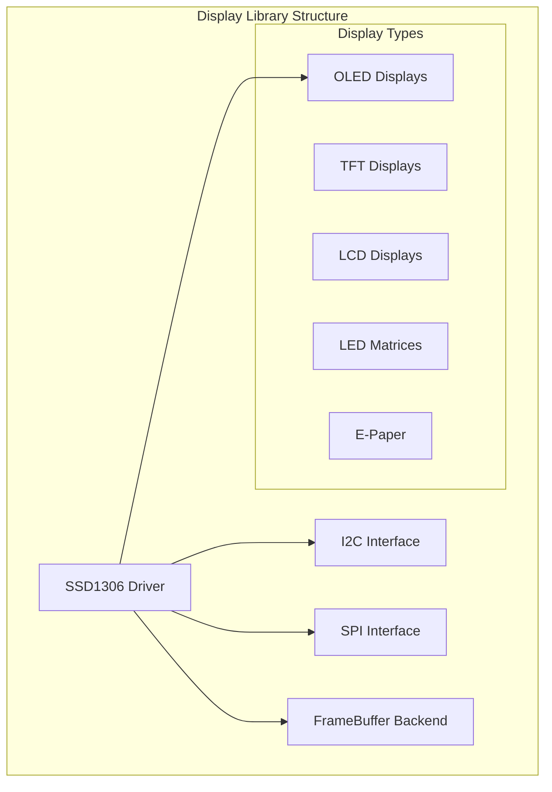
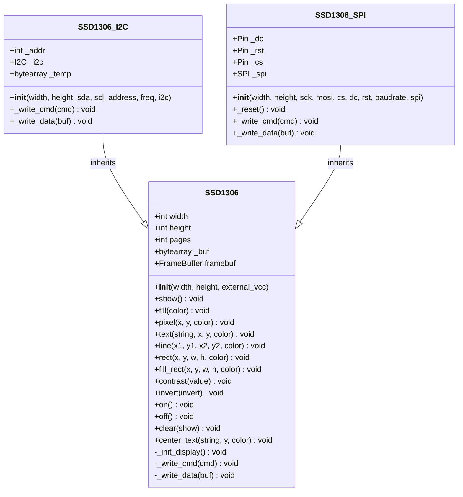
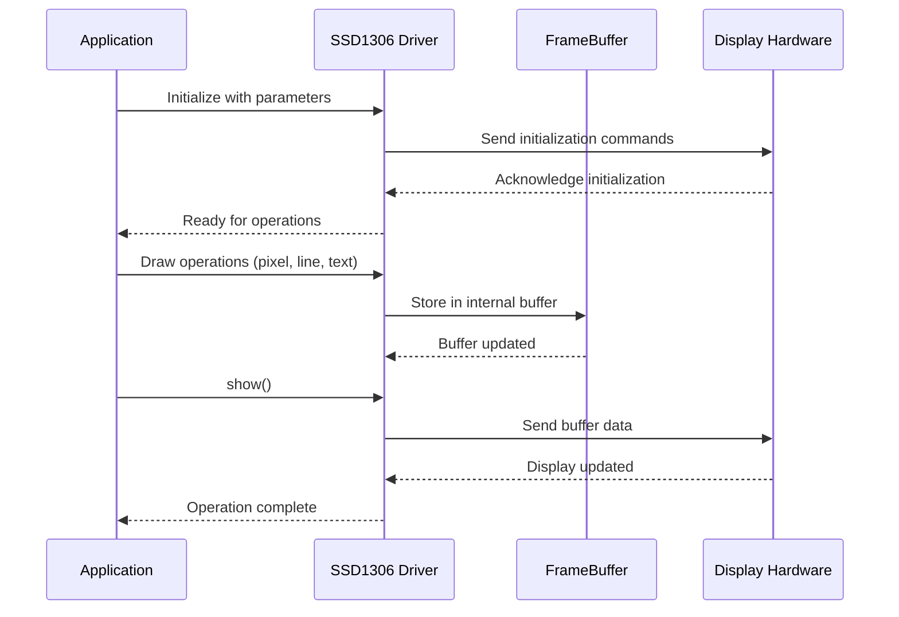
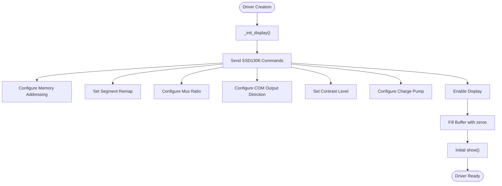
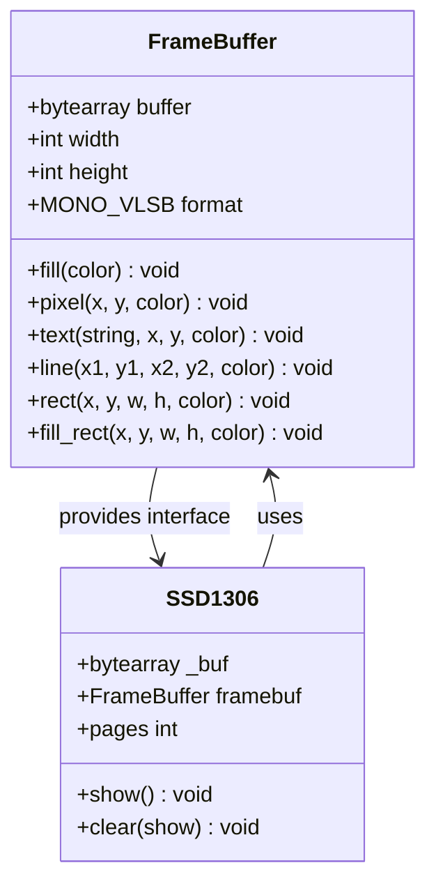
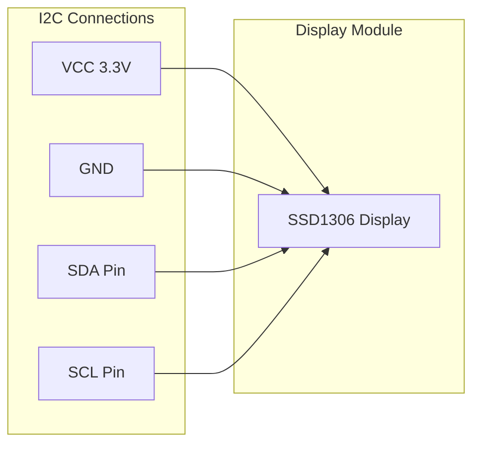
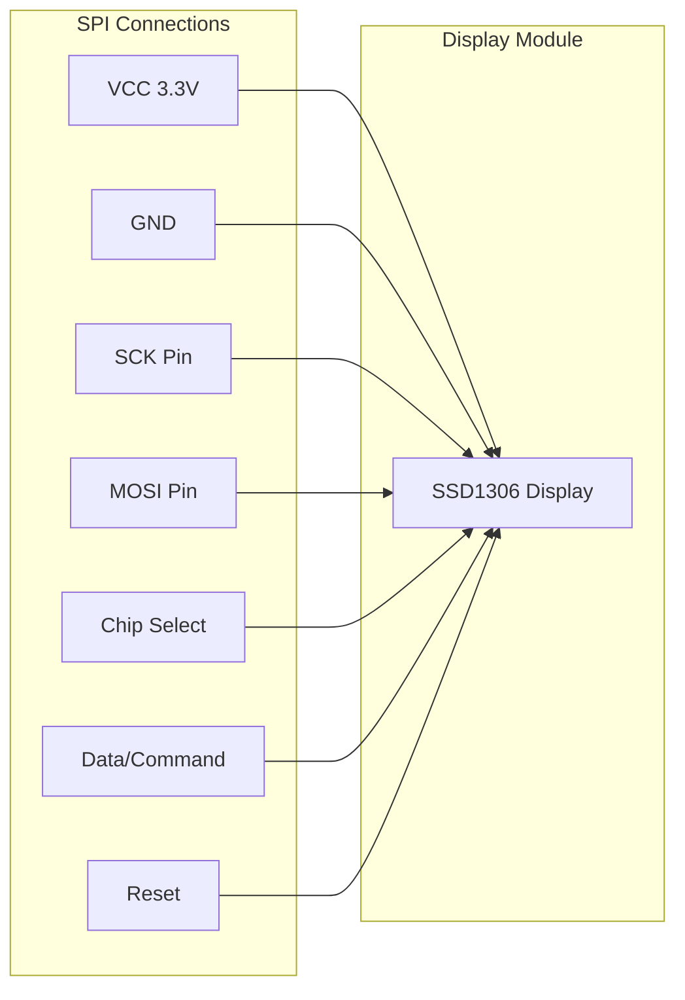
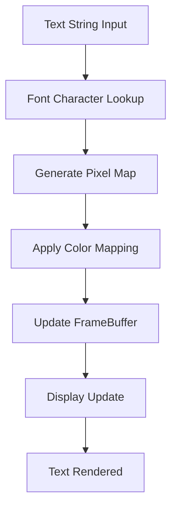

# OLED Displays (SSD1306)

<cite>
**Referenced Files in This Document**
- [ssd1306.py](file://src/lib/display/ssd1306.py)
- [display_example.py](file://src/main/examples/display_example.py)
- [README.md](file://src/main/examples/README.md)
- [__init__.py](file://src/lib/display/__init__.py)
</cite>

## Table of Contents
1. [Introduction](#introduction)
2. [Project Structure](#project-structure)
3. [Core Components](#core-components)
4. [Architecture Overview](#architecture-overview)
5. [Detailed Component Analysis](#detailed-component-analysis)
6. [API Reference](#api-reference)
7. [Initialization and Configuration](#initialization-and-configuration)
8. [Drawing Primitives](#drawing-primitives)
9. [Text Rendering](#text-rendering)
10. [Buffer Management](#buffer-management)
11. [Display Refresh Operations](#display-refresh-operations)
12. [Power Management](#power-management)
13. [Practical Examples](#practical-examples)
14. [Memory Optimization](#memory-optimization)
15. [Performance Tuning](#performance-tuning)
16. [Troubleshooting Guide](#troubleshooting-guide)
17. [Conclusion](#conclusion)

## Introduction

The SSD1306 OLED display driver is a comprehensive implementation for controlling monochrome OLED displays with 128x64 and 128x32 pixel resolutions. This driver provides a unified interface for both I2C and SPI communication protocols, leveraging MicroPython's built-in framebuf module for efficient graphics operations.

The driver supports various display orientations, power management features, and includes optimized drawing primitives for creating engaging user interfaces on resource-constrained embedded systems.

## Project Structure

The SSD1306 driver is part of a larger display library ecosystem within the ESP32-C3 MicroPython project. The display subsystem provides drivers for multiple display types including OLED, TFT, LCD, LED matrices, and e-paper displays.

**Diagram sources**
- [ssd1306.py:1-7](file://src/lib/display/ssd1306.py#L1-L7)
- [__init__.py:1-14](file://src/lib/display/__init__.py#L1-L14)

**Section sources**
- [ssd1306.py:1-7](file://src/lib/display/ssd1306.py#L1-L7)
- [__init__.py:1-14](file://src/lib/display/__init__.py#L1-L14)

## Core Components

The SSD1306 driver consists of three main components working together to provide comprehensive display functionality:

### Base SSD1306 Class
The foundation class that handles display initialization, buffer management, and basic drawing operations. It uses MicroPython's framebuf module for efficient graphics rendering.

### SSD1306_I2C Class
Provides I2C communication interface for SSD1306 displays, supporting standard I2C addresses and configurable SDA/SCL pins.

### SSD1306_SPI Class
Handles SPI communication with dedicated control pins for chip select, data/command selection, and reset functionality.

**Diagram sources**
- [ssd1306.py:34-150](file://src/lib/display/ssd1306.py#L34-L150)
- [ssd1306.py:151-191](file://src/lib/display/ssd1306.py#L151-L191)
- [ssd1306.py:193-247](file://src/lib/display/ssd1306.py#L193-L247)

**Section sources**
- [ssd1306.py:34-150](file://src/lib/display/ssd1306.py#L34-L150)
- [ssd1306.py:151-191](file://src/lib/display/ssd1306.py#L151-L191)
- [ssd1306.py:193-247](file://src/lib/display/ssd1306.py#L193-L247)

## Architecture Overview

The SSD1306 driver follows a layered architecture pattern that separates concerns between hardware communication, buffer management, and graphics operations.

**Diagram sources**
- [ssd1306.py:37-70](file://src/lib/display/ssd1306.py#L37-L70)
- [ssd1306.py:79-89](file://src/lib/display/ssd1306.py#L79-L89)

The architecture provides several key benefits:
- **Hardware Abstraction**: Both I2C and SPI interfaces share the same API
- **Buffer Management**: Efficient framebuffer operations reduce memory overhead
- **Command Separation**: Clear distinction between drawing operations and display updates

**Section sources**
- [ssd1306.py:37-70](file://src/lib/display/ssd1306.py#L37-L70)
- [ssd1306.py:79-89](file://src/lib/display/ssd1306.py#L79-L89)

## Detailed Component Analysis

### Initialization Process

The SSD1306 driver performs a comprehensive initialization sequence during object creation, configuring the display controller with optimal settings for different display sizes and power configurations.

**Diagram sources**
- [ssd1306.py:47-69](file://src/lib/display/ssd1306.py#L47-L69)

The initialization sequence includes:
- **Display Configuration**: Memory addressing mode, segment remapping, and COM output direction
- **Timing Settings**: Display clock division and precharge periods
- **Power Management**: Charge pump configuration for both internal and external VCC scenarios
- **Optimization**: Contrast adjustment and normal/inverse display modes

**Section sources**
- [ssd1306.py:47-69](file://src/lib/display/ssd1306.py#L47-L69)

### Buffer Management System

The driver utilizes MicroPython's framebuf module for efficient buffer management, providing a unified interface for all drawing operations.

**Diagram sources**
- [ssd1306.py:37-45](file://src/lib/display/ssd1306.py#L37-L45)

The buffer management system offers:
- **Efficient Memory Usage**: Single contiguous buffer for entire display area
- **Fast Operations**: Direct pixel manipulation through framebuf methods
- **Flexible Formats**: Support for various pixel formats and color depths

**Section sources**
- [ssd1306.py:37-45](file://src/lib/display/ssd1306.py#L37-L45)

## API Reference

### Constructor Parameters

The SSD1306 driver accepts several parameters for flexible configuration:

| Parameter | Type | Default | Description |
|-----------|------|---------|-------------|
| `width` | int | 128 | Display width in pixels |
| `height` | int | 64 | Display height in pixels |
| `external_vcc` | bool | False | Use external power supply |
| `sda` | int | 21 | I2C SDA pin number |
| `scl` | int | 22 | I2C SCL pin number |
| `address` | int | 0x3C | I2C device address |
| `freq` | int | 400000 | I2C bus frequency |
| `i2c` | machine.I2C | None | External I2C bus instance |
| `sck` | int | 18 | SPI SCK pin number |
| `mosi` | int | 23 | SPI MOSI pin number |
| `cs` | int | 5 | SPI Chip Select pin |
| `dc` | int | 4 | SPI Data/Command pin |
| `rst` | int | 2 | SPI Reset pin |
| `baudrate` | int | 8000000 | SPI bus speed |

### Core Methods

#### Display Control
- `show()`: Updates the physical display with current buffer contents
- `on()`: Turns display on
- `off()`: Puts display in sleep mode
- `clear(show=True)`: Clears display buffer and optionally updates display

#### Drawing Operations
- `fill(color)`: Fills entire display with specified color
- `pixel(x, y, color)`: Draws individual pixel
- `text(string, x, y, color)`: Renders text at specified position
- `line(x1, y1, x2, y2, color)`: Draws straight line
- `rect(x, y, w, h, color)`: Draws rectangle outline
- `fill_rect(x, y, w, h, color)`: Draws filled rectangle
- `hline(x, y, w, color)`: Draws horizontal line
- `vline(x, y, h, color)`: Draws vertical line

#### Display Configuration
- `contrast(value)`: Adjusts display brightness (0-255)
- `invert(invert)`: Sets normal or inverse display mode

**Section sources**
- [ssd1306.py:79-149](file://src/lib/display/ssd1306.py#L79-L149)

## Initialization and Configuration

### I2C Interface Setup

The I2C interface provides the simplest connection method for SSD1306 displays, requiring only four connections: VCC, GND, SDA, and SCL.

**Diagram sources**
- [ssd1306.py:155-159](file://src/lib/display/ssd1306.py#L155-L159)

### SPI Interface Setup

The SPI interface offers higher data rates and more flexible pin assignments, requiring additional control pins for operation.

**Diagram sources**
- [ssd1306.py:197-204](file://src/lib/display/ssd1306.py#L197-L204)

### Display Orientation Configuration

The driver automatically configures display orientation based on the display dimensions and hardware setup. The segment remapping and COM output direction settings ensure proper pixel mapping for different display orientations.

**Section sources**
- [ssd1306.py:151-191](file://src/lib/display/ssd1306.py#L151-L191)
- [ssd1306.py:193-247](file://src/lib/display/ssd1306.py#L193-L247)

## Drawing Primitives

### Pixel Operations

The pixel drawing method provides the fundamental building block for all graphics operations, supporting direct pixel manipulation with color control.

### Line Drawing Algorithm

The line drawing primitive implements efficient line drawing algorithms optimized for embedded systems, supporting both horizontal and diagonal line rendering.

### Rectangle Operations

Rectangle drawing includes both outline and filled rectangle operations, with optimized implementations for common use cases like progress bars and window borders.

### Text Rendering

Text rendering utilizes the built-in 8x8 bitmap font system, providing scalable text rendering with configurable colors and positions.

**Diagram sources**
- [ssd1306.py:98-100](file://src/lib/display/ssd1306.py#L98-L100)

**Section sources**
- [ssd1306.py:94-121](file://src/lib/display/ssd1306.py#L94-L121)

## Text Rendering

### Font System

The SSD1306 driver uses MicroPython's built-in 8x8 bitmap font system, providing efficient text rendering with minimal memory overhead.

### Character Positioning

Text positioning supports absolute coordinates with automatic boundary checking to prevent buffer overflow conditions.

### Text Alignment Options

The driver provides convenience methods for common text alignment scenarios, including center alignment for user interface elements.

**Section sources**
- [ssd1306.py:98-149](file://src/lib/display/ssd1306.py#L98-L149)

## Buffer Management

### FrameBuffer Integration

The driver leverages MicroPython's framebuf module for efficient buffer management, providing a unified interface for all graphics operations while maintaining optimal memory usage.

### Memory Layout

The buffer layout follows the MONO_VLSB format, organizing pixel data efficiently for both I2C and SPI transmission protocols.

### Update Strategy

The driver implements a two-stage update strategy: immediate buffer updates for local operations and batch updates for display synchronization.

**Section sources**
- [ssd1306.py:37-45](file://src/lib/display/ssd1306.py#L37-L45)
- [ssd1306.py:79-89](file://src/lib/display/ssd1306.py#L79-L89)

## Display Refresh Operations

### Partial Updates

The driver supports efficient partial updates by sending only changed regions to the display hardware, reducing bandwidth usage and improving performance.

### Refresh Timing

Display refresh operations are optimized for real-time applications, with configurable timing parameters for different use cases from simple status displays to animated interfaces.

### Synchronization

The show() method provides synchronized updates that ensure consistent display state across all drawing operations.

**Section sources**
- [ssd1306.py:79-89](file://src/lib/display/ssd1306.py#L79-L89)

## Power Management

### Power States

The driver provides comprehensive power management with separate on/off control and sleep mode functionality for battery-powered applications.

### Brightness Control

Dynamic brightness adjustment allows for power optimization and user preference customization across the full 0-255 range.

### Low Power Modes

The driver supports various low-power modes suitable for portable applications, with minimal power consumption in sleep state.

**Section sources**
- [ssd1306.py:122-138](file://src/lib/display/ssd1306.py#L122-L138)

## Practical Examples

### Basic Display Operations

The example demonstrates fundamental SSD1306 operations including initialization, text rendering, shape drawing, and power management.

### Sensor Data Display

Common use cases include displaying sensor readings, status indicators, and real-time data visualization on OLED displays.

### User Interface Elements

The driver supports creation of user interfaces with buttons, progress indicators, and navigation elements suitable for embedded applications.

**Section sources**
- [display_example.py:14-26](file://src/main/examples/display_example.py#L14-L26)

## Memory Optimization

### Buffer Size Calculation

For SSD1306 displays, the buffer size equals width × (height ÷ 8) bytes, allowing for efficient memory allocation and management.

### FrameBuffer Efficiency

Using the framebuf module reduces memory overhead compared to manual pixel manipulation, with optimized C implementations for fast operations.

### Power Consumption

The driver minimizes power consumption through efficient refresh cycles and comprehensive power management features.

## Performance Tuning

### Refresh Rate Optimization

The driver supports various refresh strategies from continuous updates for dynamic content to periodic updates for static displays.

### Animation Performance

Animation support includes smooth transitions and optimized update sequences for fluid motion effects.

### Throughput Optimization

SPI interface provides higher data throughput compared to I2C, making it suitable for high-frequency updates and animation scenarios.

## Troubleshooting Guide

### Common Issues

- **Display Not Responding**: Verify I2C address configuration and wiring connections
- **Incorrect Orientation**: Check segment remapping settings and display mounting
- **Poor Visibility**: Adjust contrast settings and ambient lighting conditions
- **Slow Updates**: Consider SPI interface for higher bandwidth requirements

### Diagnostic Methods

- **Connection Testing**: Verify I2C device detection and SPI communication
- **Power Supply**: Ensure adequate power delivery and voltage levels
- **Timing Issues**: Check bus frequency settings and timing constraints

### Performance Monitoring

Monitor refresh rates, memory usage, and power consumption to identify optimization opportunities.

## Conclusion

The SSD1306 OLED display driver provides a comprehensive solution for monochrome display applications on ESP32 platforms. Its unified interface for both I2C and SPI protocols, combined with efficient buffer management and extensive drawing primitives, makes it suitable for a wide range of embedded applications from simple status displays to complex user interfaces.

The driver's focus on memory efficiency and power management ensures optimal performance in resource-constrained environments, while its flexible configuration options accommodate various hardware setups and application requirements.