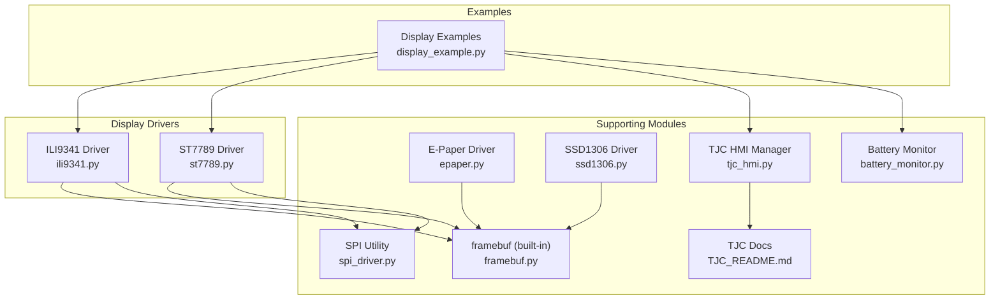
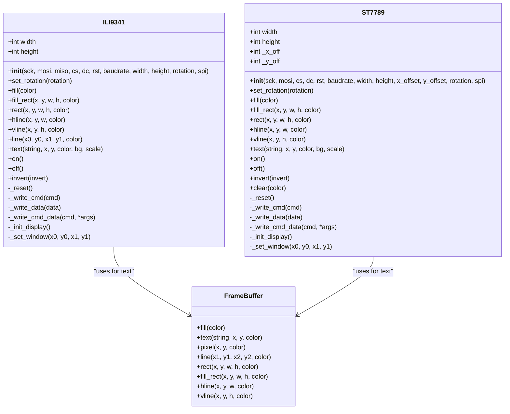
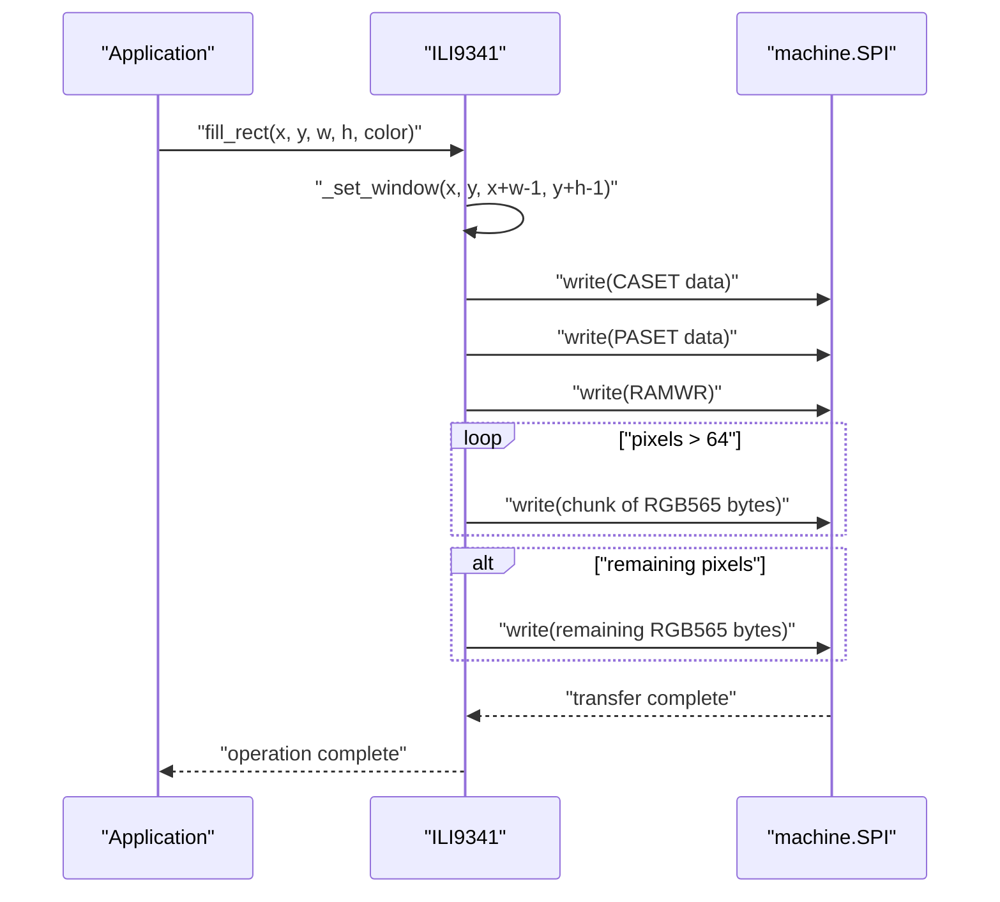
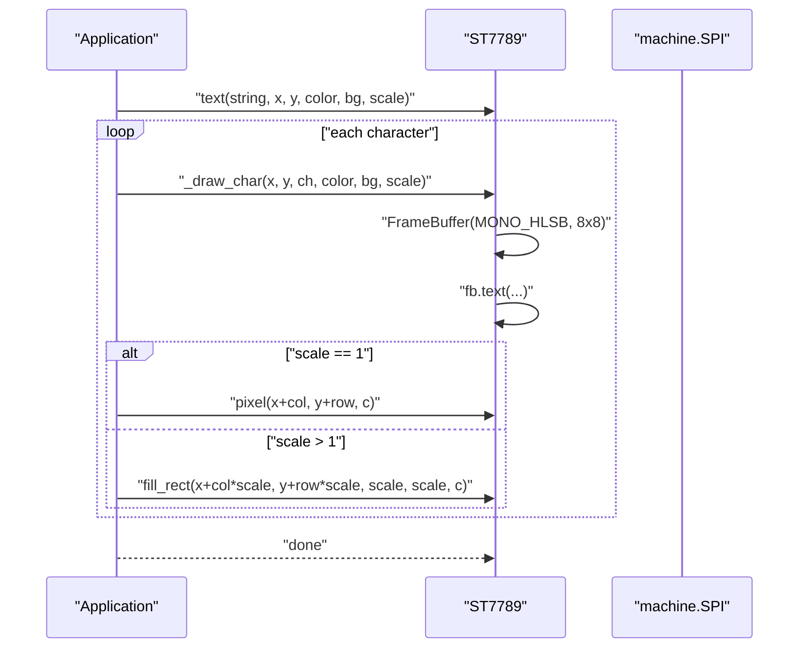
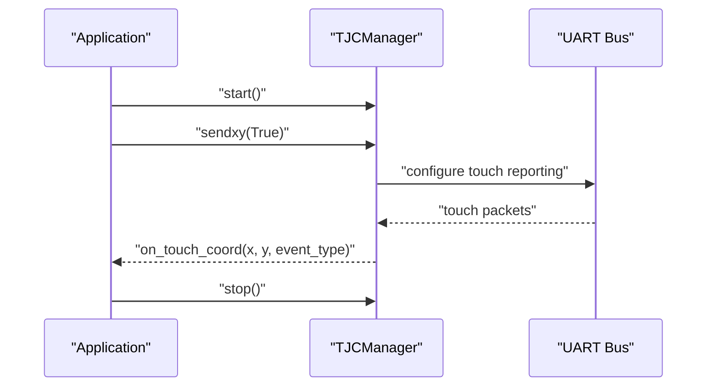
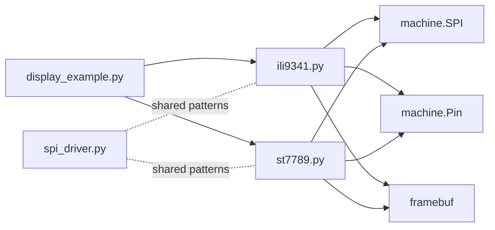

# TFT Displays (ILI9341, ST7789)

<cite>
**Referenced Files in This Document**
- [ili9341.py](file://src/lib/display/ili9341.py)
- [st7789.py](file://src/lib/display/st7789.py)
- [display_example.py](file://src/main/examples/display_example.py)
- [framebuf.py](file://framebuf.py)
- [epaper.py](file://src/lib/display/epaper.py)
- [ssd1306.py](file://src/lib/display/ssd1306.py)
- [spi_driver.py](file://src/lib/spi/spi_driver.py)
- [battery_monitor.py](file://src/lib/sensors/battery_monitor.py)
- [README.md](file://src/lib/display/TJC_README.md)
- [tjc_hmi.py](file://src/lib/display/tjc_hmi.py)
</cite>

## Table of Contents
1. [Introduction](#introduction)
2. [Project Structure](#project-structure)
3. [Core Components](#core-components)
4. [Architecture Overview](#architecture-overview)
5. [Detailed Component Analysis](#detailed-component-analysis)
6. [Dependency Analysis](#dependency-analysis)
7. [Performance Considerations](#performance-considerations)
8. [Troubleshooting Guide](#troubleshooting-guide)
9. [Conclusion](#conclusion)
10. [Appendices](#appendices)

## Introduction
This document provides comprehensive API documentation for the ILI9341 and ST7789 TFT display drivers included in the repository. It covers initialization sequences, SPI configuration, display resolution and orientation, color space and pixel format, framebuffer usage, drawing primitives, text rendering, backlight control, and optional touch integration via a UART-based HMI interface. Practical examples demonstrate creating rich graphical interfaces, displaying bitmaps, implementing scrolling effects, and optimizing rendering performance. Guidance on memory management and power-saving strategies for battery-powered applications is also provided.

## Project Structure
The TFT drivers are located under the display library and are accompanied by example usage in the main examples. Additional display technologies (e.g., E-paper, SSD1306) and SPI utilities are present to illustrate framebuffer usage and SPI configuration patterns.

**Diagram sources**
- [ili9341.py:56-261](file://src/lib/display/ili9341.py#L56-L261)
- [st7789.py:56-241](file://src/lib/display/st7789.py#L56-L241)
- [display_example.py:29-61](file://src/main/examples/display_example.py#L29-L61)
- [framebuf.py](file://framebuf.py)
- [spi_driver.py:41-96](file://src/lib/spi/spi_driver.py#L41-L96)
- [epaper.py:34-207](file://src/lib/display/epaper.py#L34-L207)
- [ssd1306.py:34-247](file://src/lib/display/ssd1306.py#L34-L247)
- [battery_monitor.py:65-290](file://src/lib/sensors/battery_monitor.py#L65-L290)
- [tjc_hmi.py:624-862](file://src/lib/display/tjc_hmi.py#L624-L862)
- [README.md:929-980](file://src/lib/display/TJC_README.md#L929-L980)

**Section sources**
- [ili9341.py:1-261](file://src/lib/display/ili9341.py#L1-L261)
- [st7789.py:1-241](file://src/lib/display/st7789.py#L1-L241)
- [display_example.py:29-61](file://src/main/examples/display_example.py#L29-L61)

## Core Components
- ILI9341: SPI-driven 240x320 TFT controller supporting RGB565 color, windowed writes, and basic graphics primitives.
- ST7789: SPI-driven flexible-size TFT controller supporting RGB565 color, configurable offsets, MADCTL rotation, and primitives.
- Framebuffer usage: Both drivers rely on MicroPython’s framebuf for text rasterization and internal buffering patterns.
- SPI configuration: Drivers construct or accept an SPI instance and configure baudrate and pins.
- Backlight control: Not directly exposed by the drivers; can be controlled via GPIO/PWM externally.
- Touch integration: Optional via TJC HMI UART interface with coordinate callbacks.

**Section sources**
- [ili9341.py:56-261](file://src/lib/display/ili9341.py#L56-L261)
- [st7789.py:56-241](file://src/lib/display/st7789.py#L56-L241)
- [display_example.py:29-61](file://src/main/examples/display_example.py#L29-L61)

## Architecture Overview
The drivers encapsulate initialization sequences, SPI transactions, and primitive drawing routines. They expose a simple API for clearing, filling rectangles, drawing lines, text rendering, and power control. Orientation is handled via MADCTL registers, and window setting optimizes pixel transfers.

**Diagram sources**
- [ili9341.py:56-261](file://src/lib/display/ili9341.py#L56-L261)
- [st7789.py:56-241](file://src/lib/display/st7789.py#L56-L241)
- [framebuf.py](file://framebuf.py)

## Detailed Component Analysis

### ILI9341 Driver API
- Initialization
  - SPI: Creates or accepts an SPI instance with configurable baudrate and pins.
  - Reset and display initialization sequence sets up power, timing, color mode, and display on.
  - Rotation adjustment updates MADCTL and swaps width/height accordingly.
- Drawing primitives
  - Pixel, line (Bresenham), horizontal/vertical lines, rectangles (outline/filled).
  - Filled rectangles optimized by streaming pixel data in chunks.
- Text rendering
  - Uses a small 8x8 monochrome font via framebuf and scales by integer factors.
- Power control
  - On/off and invert modes supported.

**Diagram sources**
- [ili9341.py:150-194](file://src/lib/display/ili9341.py#L150-L194)

**Section sources**
- [ili9341.py:56-261](file://src/lib/display/ili9341.py#L56-L261)
- [display_example.py:32-43](file://src/main/examples/display_example.py#L32-L43)

### ST7789 Driver API
- Initialization
  - Supports flexible sizes and optional x/y offsets for panels requiring trimming.
  - Initializes color mode, porch, gamma, and display on.
  - Rotation via MADCTL with four orientations.
- Drawing primitives
  - Similar to ILI9341 with windowed writes and chunked transfers.
  - Includes a bounds-checked pixel routine.
- Text rendering
  - Same 8x8 monochrome font approach with scaling.
- Power control
  - On/off and invert modes supported.
- Clear convenience
  - Dedicated clear method fills with a given color.

**Diagram sources**
- [st7789.py:216-228](file://src/lib/display/st7789.py#L216-L228)

**Section sources**
- [st7789.py:56-241](file://src/lib/display/st7789.py#L56-L241)
- [display_example.py:49-60](file://src/main/examples/display_example.py#L49-L60)

### Color Space and Pixel Format
- Both drivers use RGB565 color format internally.
- Helper conversion function supports RGB888 to RGB565 packing.
- Predefined named colors are provided for convenience.

**Section sources**
- [ili9341.py:38-53](file://src/lib/display/ili9341.py#L38-L53)
- [st7789.py:39-53](file://src/lib/display/st7789.py#L39-L53)

### Framebuffer Management
- Text rendering relies on a small 8x8 monochrome font buffer managed via framebuf.
- The drivers do not maintain a full-screen framebuffer; drawing operations stream pixel data directly to the display.
- Other display modules in the repository (e.g., E-paper, SSD1306) demonstrate framebuffer usage patterns for comparison.

**Section sources**
- [ili9341.py:236-248](file://src/lib/display/ili9341.py#L236-L248)
- [st7789.py:216-228](file://src/lib/display/st7789.py#L216-L228)
- [epaper.py:76-84](file://src/lib/display/epaper.py#L76-L84)
- [ssd1306.py:42-44](file://src/lib/display/ssd1306.py#L42-L44)

### SPI Configuration
- Default SPI bus and pins are constructed inside the drivers.
- Optional external SPI instance can be passed during construction.
- SPI utility module demonstrates advanced SPI configuration and baudrate control.

**Section sources**
- [ili9341.py:92-98](file://src/lib/display/ili9341.py#L92-L98)
- [st7789.py:95-100](file://src/lib/display/st7789.py#L95-L100)
- [spi_driver.py:41-96](file://src/lib/spi/spi_driver.py#L41-L96)

### Display Resolution and Orientation
- ILI9341: Fixed native resolution; rotation toggles width/height mapping.
- ST7789: Configurable width/height; MADCTL rotation supports four orientations.

**Section sources**
- [ili9341.py:87-102](file://src/lib/display/ili9341.py#L87-L102)
- [st7789.py:87-104](file://src/lib/display/st7789.py#L87-L104)

### Backlight Control
- Not directly exposed by the drivers. Use an external GPIO or PWM pin to control backlight brightness.

[No sources needed since this section provides general guidance]

### Touch Integration
- Optional integration via TJC HMI over UART with coordinate callbacks and page change events.

**Diagram sources**
- [tjc_hmi.py:624-862](file://src/lib/display/tjc_hmi.py#L624-L862)
- [README.md:929-980](file://src/lib/display/TJC_README.md#L929-L980)

**Section sources**
- [tjc_hmi.py:624-862](file://src/lib/display/tjc_hmi.py#L624-L862)
- [README.md:929-980](file://src/lib/display/TJC_README.md#L929-L980)

## Dependency Analysis
- ILI9341 depends on machine.SPI, machine.Pin, time, and framebuf for text.
- ST7789 mirrors ILI9341 with similar dependencies and adds offset handling.
- Example usage demonstrates constructor parameters and basic drawing operations.
- SPI utility module provides reusable SPI configuration patterns.

**Diagram sources**
- [display_example.py:29-61](file://src/main/examples/display_example.py#L29-L61)
- [ili9341.py:92-98](file://src/lib/display/ili9341.py#L92-L98)
- [st7789.py:95-100](file://src/lib/display/st7789.py#L95-L100)
- [spi_driver.py:41-96](file://src/lib/spi/spi_driver.py#L41-L96)

**Section sources**
- [display_example.py:29-61](file://src/main/examples/display_example.py#L29-L61)
- [ili9341.py:92-98](file://src/lib/display/ili9341.py#L92-L98)
- [st7789.py:95-100](file://src/lib/display/st7789.py#L95-L100)
- [spi_driver.py:41-96](file://src/lib/spi/spi_driver.py#L41-L96)

## Performance Considerations
- Prefer chunked transfers for large fills to reduce overhead.
- Use integer scaling for text to avoid per-pixel loops.
- Limit redraw regions by using targeted windowed writes.
- For battery-powered devices, minimize display on-time and use sleep/invert sparingly.
- Consider reducing SPI baudrate if stability is preferred over throughput.

[No sources needed since this section provides general guidance]

## Troubleshooting Guide
- No display output
  - Verify wiring and SPI pins match constructor arguments.
  - Ensure reset and chip-select pins are configured correctly.
  - Confirm SPI bus availability and correct SPI ID.
- Incorrect orientation or mirrored display
  - Adjust rotation parameter or call set_rotation after initialization.
- Slow rendering
  - Use fill_rect for large areas; avoid per-pixel loops.
  - Increase SPI baudrate cautiously and test stability.
- Text appears faint or unreadable
  - Check contrast settings on compatible displays (not applicable to ILI9341/ST7789).
- Touch not responding
  - Enable coordinate reporting on the HMI and register callbacks.

**Section sources**
- [ili9341.py:78-102](file://src/lib/display/ili9341.py#L78-L102)
- [st7789.py:81-104](file://src/lib/display/st7789.py#L81-L104)
- [display_example.py:29-61](file://src/main/examples/display_example.py#L29-L61)
- [tjc_hmi.py:624-862](file://src/lib/display/tjc_hmi.py#L624-L862)

## Conclusion
The ILI9341 and ST7789 drivers provide a concise, efficient interface for SPI-based TFT displays. They support essential drawing primitives, scalable text rendering, and flexible orientation. While framebuffer management is not implemented in these drivers, the repository includes complementary modules demonstrating framebuffer usage and SPI configuration patterns. For battery-powered applications, careful control of display activity and SPI settings can improve power efficiency.

[No sources needed since this section summarizes without analyzing specific files]

## Appendices

### API Reference Summary

- ILI9341
  - Constructor: sck, mosi, miso, cs, dc, rst, baudrate, width, height, rotation, spi
  - Methods: set_rotation, fill, fill_rect, rect, hline, vline, line, text, on, off, invert
  - Constants: predefined RGB565 colors and color565 conversion helper

- ST7789
  - Constructor: sck, mosi, cs, dc, rst, baudrate, width, height, x_offset, y_offset, rotation, spi
  - Methods: set_rotation, fill, fill_rect, rect, hline, vline, text, on, off, invert, clear
  - Constants: predefined RGB565 colors and color565 conversion helper

- Example usage
  - Demonstrates instantiation, drawing shapes, text, and power control.

**Section sources**
- [ili9341.py:56-261](file://src/lib/display/ili9341.py#L56-L261)
- [st7789.py:56-241](file://src/lib/display/st7789.py#L56-L241)
- [display_example.py:29-61](file://src/main/examples/display_example.py#L29-L61)

### Practical Recipes

- Rich graphical interface
  - Combine fill_rect, rect, and text to build menus and widgets.
  - Use integer scaling for readable text at different sizes.

- Bitmap-like rendering
  - Use fill_rect calls to simulate blocks or sprites; combine with pixel-level drawing for details.

- Scrolling effects
  - Implement by redrawing regions with adjusted coordinates and using minimal refresh areas.

- Optimizing rendering
  - Batch drawing operations; use fill_rect for large fills; leverage windowed writes.

**Section sources**
- [ili9341.py:177-226](file://src/lib/display/ili9341.py#L177-L226)
- [st7789.py:182-207](file://src/lib/display/st7789.py#L182-L207)
- [display_example.py:32-60](file://src/main/examples/display_example.py#L32-L60)

### Power Saving and Memory Management
- Power saving
  - Use off/invert sparingly; prefer partial updates when possible.
  - Consider external backlight control via GPIO/PWM.

- Memory management
  - Avoid large static buffers; use on-demand generation for graphics.
  - Monitor RAM usage in long-running applications.

**Section sources**
- [battery_monitor.py:65-290](file://src/lib/sensors/battery_monitor.py#L65-L290)