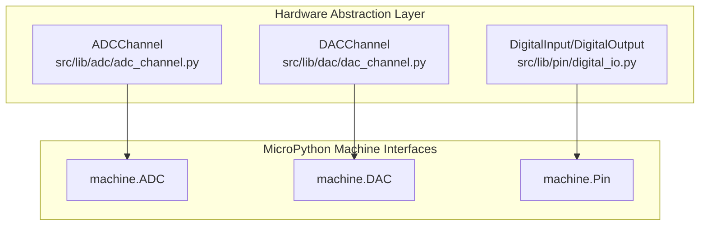
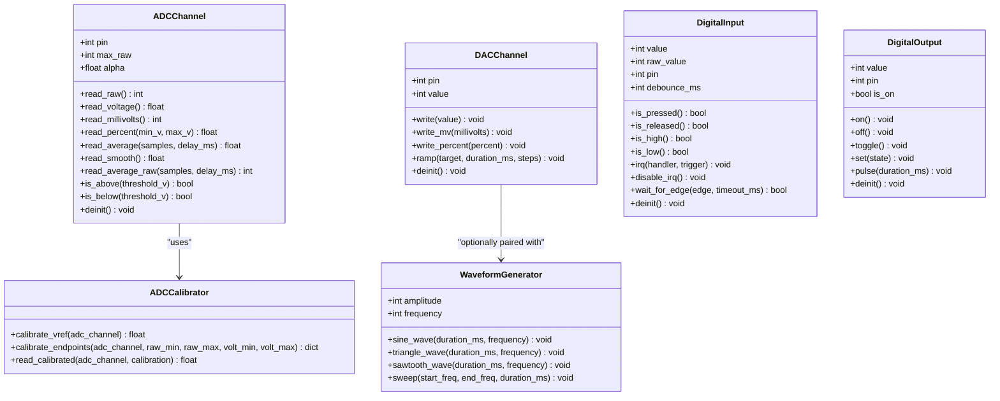
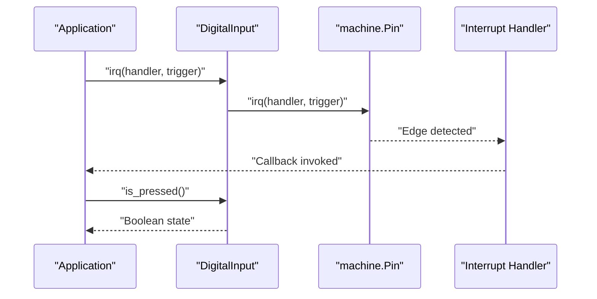
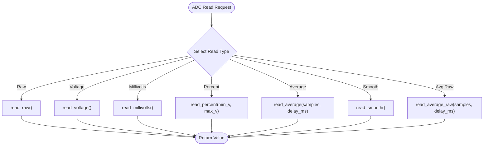
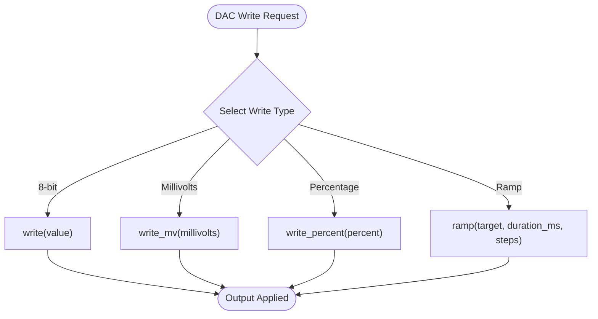
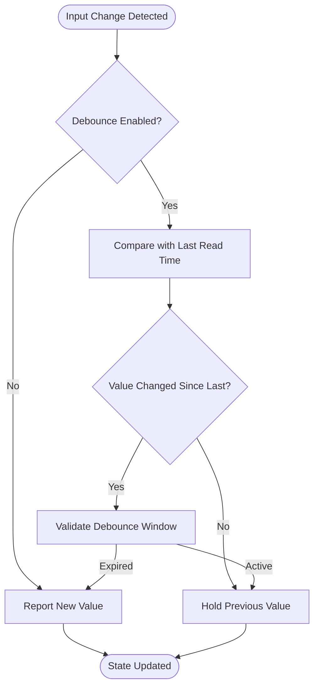
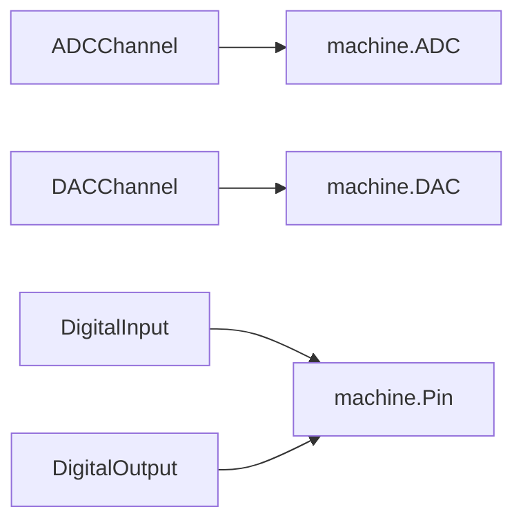

# Hardware Interface API

<cite>
**Referenced Files in This Document**
- [adc_channel.py](file://src/lib/adc/adc_channel.py)
- [dac_channel.py](file://src/lib/dac/dac_channel.py)
- [digital_io.py](file://src/lib/pin/digital_io.py)
- [README.md](file://src/lib/README.md)
</cite>

## Table of Contents
1. [Introduction](#introduction)
2. [Project Structure](#project-structure)
3. [Core Components](#core-components)
4. [Architecture Overview](#architecture-overview)
5. [Detailed Component Analysis](#detailed-component-analysis)
6. [Dependency Analysis](#dependency-analysis)
7. [Performance Considerations](#performance-considerations)
8. [Troubleshooting Guide](#troubleshooting-guide)
9. [Conclusion](#conclusion)

## Introduction
This document provides comprehensive API documentation for hardware abstraction modules focused on analog and digital I/O, including ADC channels, DAC channels, digital input/output pins, and related helpers. It covers pin configurations, communication protocols, timing specifications, hardware limitations, return values, usage examples, and integration with higher-level abstractions. The goal is to enable reliable multi-device communication, proper initialization, interrupt handling, and performance optimization while respecting signal integrity and power considerations.

## Project Structure
The hardware abstraction modules are organized under the src/lib directory. The relevant modules for this document are:
- Analog: adc (ADC channel wrapper)
- Analog: dac (DAC channel driver)
- Digital I/O: pin (DigitalInput/DigitalOutput wrappers around machine.Pin)

**Diagram sources**
- [adc_channel.py:22-277](file://src/lib/adc/adc_channel.py#L22-L277)
- [dac_channel.py:31-270](file://src/lib/dac/dac_channel.py#L31-L270)
- [digital_io.py:21-317](file://src/lib/pin/digital_io.py#L21-L317)

**Section sources**
- [README.md:1-72](file://src/lib/README.md#L1-L72)

## Core Components
This section summarizes the primary hardware modules and their responsibilities:
- ADCChannel: Provides raw, voltage, millivolt, and percentage readings; supports averaging and exponential smoothing; includes calibration utilities.
- DACChannel: Provides 8-bit output to GPIO25/GPIO26 with voltage and percentage writes; includes ramping and cleanup.
- DigitalInput/DigitalOutput: Wrappers around machine.Pin offering pull-up/down, debounce, interrupts, edge detection, and pulse generation.

Key capabilities and constraints:
- ADCChannel supports attenuation modes and configurable bit width; note ESP32-C3 ADC1 vs ADC2 constraints when WiFi is active.
- DACChannel is limited to ESP32-C3 DAC pins (GPIO25/GPIO26) with 8-bit resolution and specific output impedance considerations.
- DigitalInput/DigitalOutput provide robust input handling with debouncing and interrupt support, plus convenient output toggling and pulses.

**Section sources**
- [adc_channel.py:22-277](file://src/lib/adc/adc_channel.py#L22-L277)
- [dac_channel.py:31-270](file://src/lib/dac/dac_channel.py#L31-L270)
- [digital_io.py:21-317](file://src/lib/pin/digital_io.py#L21-L317)

## Architecture Overview
The hardware modules build on MicroPython’s machine interfaces:
- ADCChannel wraps machine.ADC for reading and calibration.
- DACChannel wraps machine.DAC for analog output generation.
- DigitalInput/DigitalOutput wrap machine.Pin for digital I/O with convenience features.

**Diagram sources**
- [adc_channel.py:22-277](file://src/lib/adc/adc_channel.py#L22-L277)
- [dac_channel.py:31-270](file://src/lib/dac/dac_channel.py#L31-L270)
- [digital_io.py:21-317](file://src/lib/pin/digital_io.py#L21-L317)

## Detailed Component Analysis

### ADCChannel API
Purpose:
- Provide a unified interface for analog-to-digital conversion with multiple output formats and smoothing.

Initialization:
- Parameters: pin (ADC-capable GPIO), atten (attenuation selection), width (resolution bits), vref (reference voltage).
- Constraints: ESP32-C3 ADC1 (GPIO0-4) is safe when WiFi is active; ADC2 (GPIO5-14) conflicts with WiFi.

Methods and behavior:
- read_raw(): Returns integer in [0, max_raw].
- read_voltage(): Returns floating-point voltage in volts.
- read_millivolts(): Returns integer millivolt value.
- read_percent(min_v, max_v): Returns percentage mapped to the given voltage range.
- read_average(samples, delay_ms): Averaged voltage over N samples with optional inter-sample delay.
- read_smooth(): Exponential moving average smoothed voltage.
- read_average_raw(samples, delay_ms): Averaged raw value.
- is_above/threshold_v(): Boolean checks against thresholds.
- deinit(): Releases ADC resources.

Timing and accuracy:
- Sampling delay can be introduced between reads to reduce noise.
- Smoothing factor alpha controls convergence speed and noise suppression.

Calibration:
- ADCCalibrator supports internal reference measurement and two-point endpoint calibration for precise scaling.

Usage examples (conceptual):
- Measure battery voltage via read_millivolts() with appropriate attenuation.
- Smooth noisy sensor readings using read_smooth().
- Calibrate using calibrate_vref() and calibrate_endpoints() for repeatable results.

Return values and states:
- read_raw(): integer in [0, max_raw]; raises if ADC unavailable.
- read_voltage/read_millivolts/read_percent(): numeric values; percentage clamped to [0, 100].
- read_average/read_smooth(): numeric values; averaged or smoothed.
- is_above/is_below(): boolean.

Limitations:
- ESP32-C3 ADC1 vs ADC2 constraints when WiFi is active.
- Bit-width and attenuation affect dynamic range and precision.

**Section sources**
- [adc_channel.py:22-277](file://src/lib/adc/adc_channel.py#L22-L277)

### DACChannel API
Purpose:
- Provide 8-bit analog output on dedicated DAC pins with voltage and percentage interfaces.

Initialization:
- Parameters: pin (must be GPIO25 or GPIO26 on ESP32-C3).
- Constraints: ESP32-C3 DAC pins are limited to GPIO25/GPIO26 with 8-bit resolution and specific output impedance.

Methods and behavior:
- write(value): Writes 8-bit value (0–255) to DAC.
- write_mv(millivolts): Converts millivolts to 8-bit value and writes.
- write_percent(percent): Converts percentage to 8-bit value and writes.
- ramp(target, duration_ms, steps): Smoothly transitions from current value to target over steps.
- deinit(): Resets output to 0 and releases resources.

Waveform generation:
- WaveformGenerator optionally pairs with DACChannel to produce sine, triangle, sawtooth, and sweep waveforms at configurable amplitude, offset, and sample rate.

Usage examples (conceptual):
- Drive a low-impedance load or buffer amplifier with write_mv()/write_percent().
- Generate test tones using WaveformGenerator with sine_wave()/triangle_wave()/sawtooth_wave()/sweep().

Return values and states:
- write/write_mv/write_percent(): no return; validates input ranges.
- ramp(): no return; performs blocking stepping.
- deinit(): no return.

Limitations:
- Only 8-bit resolution.
- Output impedance ~200Ω; consider buffering for low-impedance loads.

**Section sources**
- [dac_channel.py:31-270](file://src/lib/dac/dac_channel.py#L31-L270)

### DigitalInput/DigitalOutput API
Purpose:
- Provide robust digital input and output abstractions around machine.Pin with convenience features.

DigitalInput:
- Initialization: pin, pull ('up'/'down'/None), invert flag.
- Features: debouncing, interrupt handling, edge detection, and logical state queries.
- Methods: value/raw_value, is_pressed/is_released/is_high/is_low, irq/disable_irq, wait_for_edge, deinit.

DigitalOutput:
- Initialization: pin, active_low flag, initial_state.
- Features: on/off/toggle/set, pulse generation, and cleanup.
- Methods: on/off/toggle/set, pulse(duration_ms), deinit.

Usage examples (conceptual):
- Debounced button press detection with is_pressed() and irq().
- Toggle LED state with toggle() or pulse() for short actuation events.
- Active-low relay control by setting active_low during initialization.

Return values and states:
- value/raw_value: integer 0 or 1.
- is_pressed/is_released/is_high/is_low: boolean.
- irq/disable_irq/wait_for_edge: no return; wait_for_edge returns boolean indicating edge occurrence.
- on/off/toggle/set/pulse/deinit: no return.

Limitations:
- Debounce relies on time.ticks_ms(); ensure adequate debounce_ms for mechanical switches.
- Interrupt handlers must be lightweight to avoid jitter.

**Section sources**
- [digital_io.py:21-317](file://src/lib/pin/digital_io.py#L21-L317)

## Architecture Overview
The hardware modules layer consistently on top of MicroPython machine interfaces:
- ADCChannel → machine.ADC
- DACChannel → machine.DAC
- DigitalInput/DigitalOutput → machine.Pin

**Diagram sources**
- [digital_io.py:162-176](file://src/lib/pin/digital_io.py#L162-L176)
- [digital_io.py:133-150](file://src/lib/pin/digital_io.py#L133-L150)

## Detailed Component Analysis

### ADCChannel Data Path

**Diagram sources**
- [adc_channel.py:104-194](file://src/lib/adc/adc_channel.py#L104-L194)

### DACChannel Output Control

**Diagram sources**
- [dac_channel.py:76-128](file://src/lib/dac/dac_channel.py#L76-L128)

### DigitalInput Debounce and Edge Detection

**Diagram sources**
- [digital_io.py:114-129](file://src/lib/pin/digital_io.py#L114-L129)

## Dependency Analysis
- ADCChannel depends on machine.ADC and machine.Pin; it exposes a higher-level API for reading and calibration.
- DACChannel depends on machine.DAC and machine.Pin; it provides 8-bit output control and optional waveform generation.
- DigitalInput/DigitalOutput depend on machine.Pin; they encapsulate pull-up/down, debounce, interrupts, and convenience methods.

**Diagram sources**
- [adc_channel.py:67-69](file://src/lib/adc/adc_channel.py#L67-L69)
- [dac_channel.py:57](file://src/lib/dac/dac_channel.py#L57)
- [digital_io.py:71-73](file://src/lib/pin/digital_io.py#L71-L73)

**Section sources**
- [adc_channel.py:13-19](file://src/lib/adc/adc_channel.py#L13-L19)
- [dac_channel.py:21-25](file://src/lib/dac/dac_channel.py#L21-L25)
- [digital_io.py:14-18](file://src/lib/pin/digital_io.py#L14-L18)

## Performance Considerations
- ADC sampling:
  - Use read_average() with moderate sample counts to balance noise reduction and latency.
  - Introduce small delays between samples to minimize interference.
  - Prefer read_smooth() for continuous filtering with minimal CPU overhead.
- DAC output:
  - For waveform generation, tune sample_rate and amplitude to match audible bandwidth and load characteristics.
  - Use ramp() for smooth transitions to avoid audible clicks.
- Digital I/O:
  - Set appropriate debounce_ms to suppress switch bounce without adding noticeable latency.
  - Keep interrupt handlers minimal to maintain responsiveness.
- Power and signal integrity:
  - Ensure ADC input voltages remain within supported ranges per attenuation settings.
  - Use buffers for DAC outputs driving low-impedance loads due to typical output impedance.
  - Route analog traces away from digital switching noise; keep ground planes solid.

## Troubleshooting Guide
Common issues and resolutions:
- ADC unavailable:
  - Ensure machine.ADC is present; otherwise, initialize ADCChannel will raise an error.
- DAC pin invalid:
  - Only GPIO25/GPIO26 are valid for ESP32-C3; supplying other pins raises an error.
- WiFi conflicts with ADC:
  - When WiFi is active, prefer ADC1 pins (GPIO0-4) to avoid interference.
- Interrupt handler not firing:
  - Verify trigger configuration and ensure handler is registered correctly.
- Debounce not working:
  - Increase debounce_ms or confirm pull-up/pull-down configuration matches hardware.

**Section sources**
- [adc_channel.py:59-60](file://src/lib/adc/adc_channel.py#L59-L60)
- [dac_channel.py:50-54](file://src/lib/dac/dac_channel.py#L50-L54)
- [digital_io.py:56-57](file://src/lib/pin/digital_io.py#L56-L57)

## Conclusion
The hardware abstraction modules provide a consistent, high-level interface over MicroPython’s machine APIs. ADCChannel offers flexible analog reading with smoothing and calibration; DACChannel enables controlled analog output with optional waveform synthesis; DigitalInput/DigitalOutput deliver robust digital I/O with debouncing and interrupts. By adhering to the documented constraints and leveraging the provided methods, developers can implement reliable multi-device communication, efficient initialization, responsive interrupt handling, and optimized performance while maintaining signal integrity and power considerations.