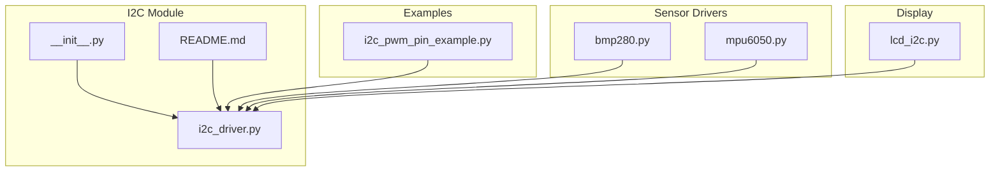
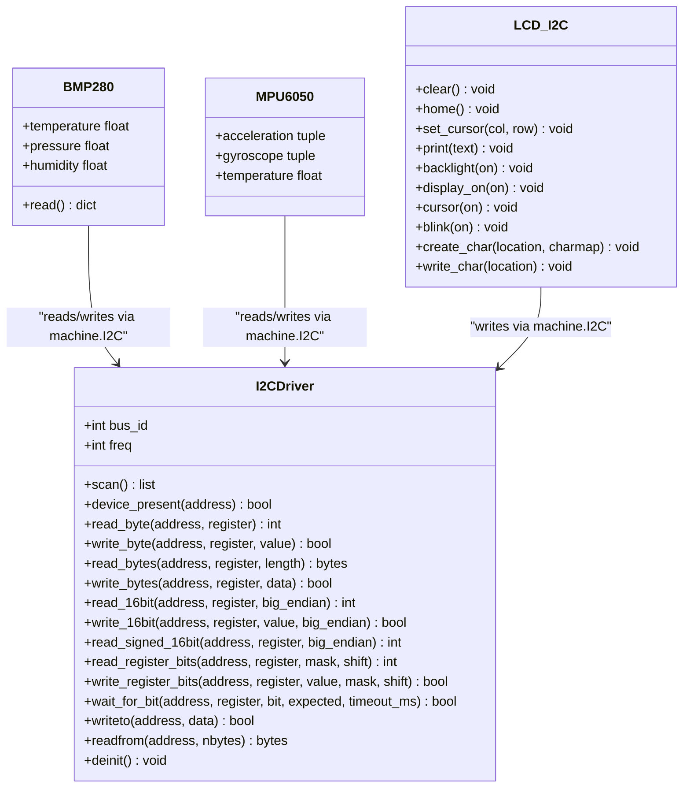
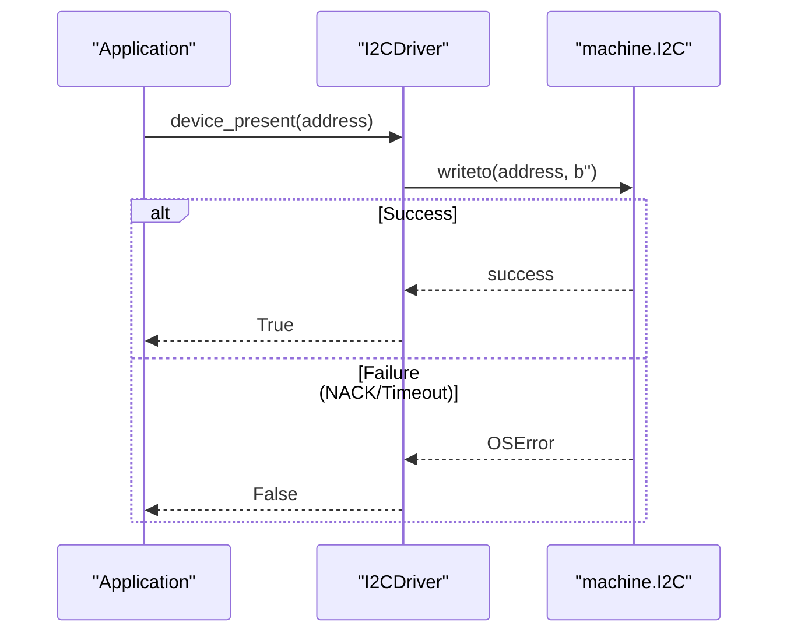
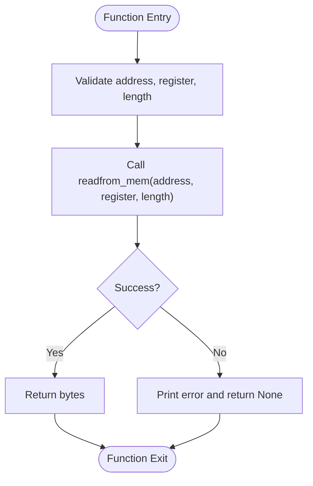
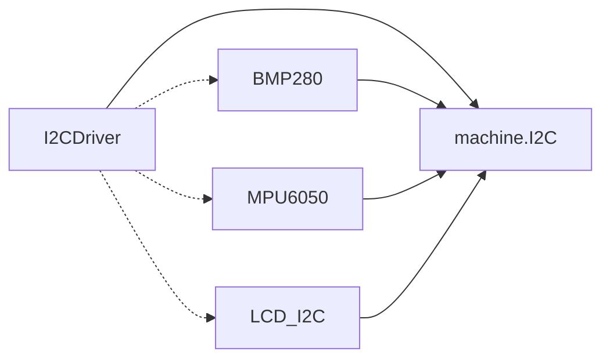

# I2C Interface

<cite>
**Referenced Files in This Document**
- [i2c_driver.py](file://src/lib/i2c/i2c_driver.py)
- [__init__.py](file://src/lib/i2c/__init__.py)
- [README.md](file://src/lib/i2c/README.md)
- [i2c_pwm_pin_example.py](file://src/main/examples/i2c_pwm_pin_example.py)
- [bmp280.py](file://src/lib/sensors/bmp280.py)
- [mpu6050.py](file://src/lib/sensors/mpu6050.py)
- [lcd_i2c.py](file://src/lib/display/lcd_i2c.py)
</cite>

## Table of Contents
1. [Introduction](#introduction)
2. [Project Structure](#project-structure)
3. [Core Components](#core-components)
4. [Architecture Overview](#architecture-overview)
5. [Detailed Component Analysis](#detailed-component-analysis)
6. [Dependency Analysis](#dependency-analysis)
7. [Performance Considerations](#performance-considerations)
8. [Troubleshooting Guide](#troubleshooting-guide)
9. [Conclusion](#conclusion)
10. [Appendices](#appendices)

## Introduction
This document provides comprehensive API documentation for the I2C interface module centered around the I2CDriver class. It covers initialization parameters, SDA/SCL pin configuration, clock speed settings, device addressing, read/write operations, multi-byte transfers, and transaction handling. It also documents error handling for NACK conditions, timeouts, and bus conflicts, along with practical usage examples for connecting multiple I2C devices, scanning for addresses, and implementing device-specific protocols. Timing considerations, pull-up resistor requirements, and signal integrity are addressed to ensure reliable communication.

## Project Structure
The I2C module is organized under src/lib/i2c with a driver implementation and usage examples. The primary driver class is I2CDriver, which wraps MicroPython’s machine.I2C to provide convenient register-level helpers and shared-bus management. Example usage appears in the main examples and sensor drivers.

**Diagram sources**
- [__init__.py:1-13](file://src/lib/i2c/__init__.py#L1-L13)
- [i2c_driver.py:1-367](file://src/lib/i2c/i2c_driver.py#L1-L367)
- [README.md:1-147](file://src/lib/i2c/README.md#L1-L147)
- [i2c_pwm_pin_example.py:1-364](file://src/main/examples/i2c_pwm_pin_example.py#L1-L364)
- [bmp280.py:1-204](file://src/lib/sensors/bmp280.py#L1-L204)
- [mpu6050.py:1-167](file://src/lib/sensors/mpu6050.py#L1-L167)
- [lcd_i2c.py:1-214](file://src/lib/display/lcd_i2c.py#L1-L214)

**Section sources**
- [__init__.py:1-13](file://src/lib/i2c/__init__.py#L1-L13)
- [README.md:1-147](file://src/lib/i2c/README.md#L1-L147)

## Core Components
- I2CDriver: A shared-bus manager that encapsulates machine.I2C and provides register-level helpers for reading/writing bytes, 16-bit values, signed 16-bit values, and performing bit-manipulation read-modify-write operations. It also supports device scanning, presence checks, and raw I2C transactions.

Key capabilities:
- Initialization with configurable SDA/SCL pins, bus frequency, and bus ID
- Device scanning and presence detection
- Register-level helpers for byte, multi-byte, and 16-bit operations
- Signed 16-bit value support
- Bit-level register manipulation (read-modify-write)
- Timeout-aware polling of status bits
- Raw I2C write/read without register addressing
- Bus deinitialization

**Section sources**
- [i2c_driver.py:24-367](file://src/lib/i2c/i2c_driver.py#L24-L367)
- [README.md:114-147](file://src/lib/i2c/README.md#L114-L147)

## Architecture Overview
The I2CDriver acts as a thin abstraction over machine.I2C, enabling multiple sensor and display drivers to share a single I2C bus. Sensor drivers commonly accept either an I2C object or construct their own, but the I2CDriver encourages sharing a single bus instance to reduce RAM usage and prevent bus conflicts.

**Diagram sources**
- [i2c_driver.py:24-367](file://src/lib/i2c/i2c_driver.py#L24-L367)
- [bmp280.py:36-204](file://src/lib/sensors/bmp280.py#L36-L204)
- [mpu6050.py:32-167](file://src/lib/sensors/mpu6050.py#L32-L167)
- [lcd_i2c.py:45-214](file://src/lib/display/lcd_i2c.py#L45-L214)

## Detailed Component Analysis

### I2CDriver API Reference
Below are the documented APIs for I2CDriver, including method signatures and behavior. These methods are implemented in the driver and used across examples and sensor drivers.

- Initialization
  - I2CDriver.__init__(sda: int, scl: int, freq: int = 400000, bus_id: int = 0)
    - Initializes an I2C bus with specified SDA/SCL pins, frequency, and bus ID.
    - Raises a runtime error if machine.I2C is unavailable on the platform.
    - Prints initialization status including bus ID, SDA/SCL pins, and frequency.

- Bus Management
  - I2CDriver.scan() -> list[int]
    - Scans the bus and returns a list of discovered I2C addresses.
    - Prints friendly device names for known addresses.
  - I2CDriver.device_present(address: int) -> bool
    - Checks whether a device responds at the given address.
  - I2CDriver.freq property
    - Getter returns current bus frequency.
    - Setter updates the bus frequency and reinitializes the underlying I2C peripheral.
  - I2CDriver.bus property
    - Exposes the underlying machine.I2C instance for drivers that require it.

- Register-Level Helpers
  - I2CDriver.read_byte(address: int, register: int) -> int | None
    - Reads a single byte from a register.
    - Returns None on error and prints a diagnostic message.
  - I2CDriver.write_byte(address: int, register: int, value: int) -> bool
    - Writes a single byte to a register.
    - Returns False on error and prints a diagnostic message.
  - I2CDriver.read_bytes(address: int, register: int, length: int) -> bytes | None
    - Reads multiple bytes from a register.
    - Returns None on error.
  - I2CDriver.write_bytes(address: int, register: int, data: bytes) -> bool
    - Writes multiple bytes to a register.
    - Returns False on error.
  - I2CDriver.read_16bit(address: int, register: int, big_endian: bool = True) -> int | None
    - Reads two consecutive bytes as a 16-bit value.
    - Supports big-endian or little-endian ordering.
  - I2CDriver.write_16bit(address: int, register: int, value: int, big_endian: bool = True) -> bool
    - Writes a 16-bit value to two consecutive registers.
  - I2CDriver.read_signed_16bit(address: int, register: int, big_endian: bool = True) -> int | None
    - Reads a signed 16-bit value using two’s complement interpretation.
  - I2CDriver.read_register_bits(address: int, register: int, mask: int, shift: int = 0) -> int | None
    - Extracts a masked subset of bits from a register.
  - I2CDriver.write_register_bits(address: int, register: int, value: int, mask: int, shift: int = 0) -> bool
    - Performs read-modify-write to update selected bits.

- Transaction Utilities
  - I2CDriver.wait_for_bit(address: int, register: int, bit: int, expected: bool, timeout_ms: int = 1000) -> bool
    - Polls a specific bit in a register until it reaches the expected state or times out.
    - Returns False on timeout and prints a warning.
  - I2CDriver.status_byte(address: int, register: int) -> int
    - Alias for read_byte used to poll status registers.

- Raw I2C Transactions
  - I2CDriver.writeto(address: int, data: bytes) -> bool
    - Writes raw bytes without specifying a register (useful for devices without register maps).
  - I2CDriver.readfrom(address: int, nbytes: int) -> bytes | None
    - Reads raw bytes without specifying a register.

- Lifecycle
  - I2CDriver.deinit() -> None
    - Deinitializes the I2C bus and releases resources.

Notes on transaction handling:
- The driver relies on machine.I2C’s built-in transaction semantics. There is no explicit begin_transaction() or end_transaction() method in the driver. Instead, each read/write operation is a separate transaction. For multi-register reads/writes, use read_bytes()/write_bytes() or chained read_byte()/write_byte() calls. For devices requiring continuous reads (e.g., FIFO), use read_bytes() to minimize repeated START/STOP sequences.

**Section sources**
- [i2c_driver.py:64-367](file://src/lib/i2c/i2c_driver.py#L64-L367)
- [README.md:114-147](file://src/lib/i2c/README.md#L114-L147)

### Usage Examples

- Connecting multiple I2C devices on a shared bus
  - Create a single I2CDriver instance and pass its raw machine.I2C bus to multiple sensor drivers.
  - Example usage demonstrates constructing BMP280, MPU6050, and ADS1115 with i2c.bus.

- Scanning for addresses
  - Use scan() to discover connected devices and device_present() to check for a specific address.

- Implementing device-specific protocols
  - Use read_byte(), write_byte(), read_16bit(), and write_16bit() for typical register-based sensors.
  - Use wait_for_bit() to poll status registers (e.g., BMP280 conversion completion).
  - Use read_bytes() for multi-byte bursts (e.g., MAX30102 FIFO).
  - Use writeto()/readfrom() for devices without register maps (e.g., PCF8574 LCD backpack).

**Section sources**
- [i2c_pwm_pin_example.py:18-147](file://src/main/examples/i2c_pwm_pin_example.py#L18-L147)
- [bmp280.py:147-172](file://src/lib/sensors/bmp280.py#L147-L172)
- [mpu6050.py:104-167](file://src/lib/sensors/mpu6050.py#L104-L167)
- [lcd_i2c.py:69-86](file://src/lib/display/lcd_i2c.py#L69-L86)

### Sequence Diagram: Device Presence Check
This sequence illustrates how a presence check is performed using the I2C bus.

**Diagram sources**
- [i2c_driver.py:122-134](file://src/lib/i2c/i2c_driver.py#L122-L134)

### Flowchart: Multi-Byte Read Operation
This flowchart outlines the steps for a multi-byte read operation.

**Diagram sources**
- [i2c_driver.py:169-183](file://src/lib/i2c/i2c_driver.py#L169-L183)

## Dependency Analysis
- I2CDriver depends on machine.I2C for hardware-level transactions.
- Sensor drivers (e.g., BMP280, MPU6050) depend on machine.I2C for register access.
- The I2CDriver encourages sharing a single bus instance among multiple drivers to reduce resource usage and avoid bus conflicts.
- Display drivers (e.g., LCD_I2C) rely on raw I2C writes to communicate with PCF8574 backpacks.

**Diagram sources**
- [i2c_driver.py:14-21](file://src/lib/i2c/i2c_driver.py#L14-L21)
- [bmp280.py:10-11](file://src/lib/sensors/bmp280.py#L10-L11)
- [mpu6050.py:9-10](file://src/lib/sensors/mpu6050.py#L9-L10)
- [lcd_i2c.py:7-8](file://src/lib/display/lcd_i2c.py#L7-L8)

**Section sources**
- [i2c_driver.py:14-21](file://src/lib/i2c/i2c_driver.py#L14-L21)
- [bmp280.py:10-11](file://src/lib/sensors/bmp280.py#L10-L11)
- [mpu6050.py:9-10](file://src/lib/sensors/mpu6050.py#L9-L10)
- [lcd_i2c.py:7-8](file://src/lib/display/lcd_i2c.py#L7-L8)

## Performance Considerations
- Clock speed selection
  - The driver supports standard (100 kHz), fast (400 kHz), and fast+ (1 MHz) modes. Choose speeds appropriate for the slowest device on the bus.
- Minimizing bus contention
  - Use a single I2CDriver instance to share the bus among multiple sensors and displays.
- Burst operations
  - Prefer read_bytes() and write_bytes() for multi-byte transfers to reduce overhead.
- Polling and timeouts
  - Use wait_for_bit() with reasonable timeout values to avoid indefinite blocking.
- Pull-up resistors
  - Install 4.7 kΩ pull-up resistors on both SDA and SCL lines for reliable communication at higher speeds.

**Section sources**
- [README.md:139-147](file://src/lib/i2c/README.md#L139-L147)
- [i2c_driver.py:293-320](file://src/lib/i2c/i2c_driver.py#L293-L320)

## Troubleshooting Guide
Common issues and resolutions:
- NACK condition
  - Symptoms: write_byte()/write_bytes() returns False or read_byte()/read_bytes() returns None.
  - Causes: Incorrect address, device not present, or device busy.
  - Resolution: Verify address, confirm device presence with device_present(), and ensure no other master is using the bus.
- Timeout scenarios
  - Symptoms: wait_for_bit() returns False.
  - Causes: Device did not reach expected bit state within timeout.
  - Resolution: Increase timeout_ms, verify device status register, and check wiring.
- Bus conflicts
  - Symptoms: Intermittent failures or corrupted data.
  - Causes: Multiple masters or improper pull-ups.
  - Resolution: Ensure only one master controls the bus, verify pull-up resistors, and keep bus traces short and matched.
- Signal integrity
  - Symptoms: Frequent retries or CRC errors.
  - Causes: Long traces, noisy environment, or incorrect termination.
  - Resolution: Use shorter traces, shielded cables if needed, and appropriate pull-up values.

**Section sources**
- [i2c_driver.py:137-166](file://src/lib/i2c/i2c_driver.py#L137-L166)
- [i2c_driver.py:169-198](file://src/lib/i2c/i2c_driver.py#L169-L198)
- [i2c_driver.py:293-320](file://src/lib/i2c/i2c_driver.py#L293-L320)
- [README.md:145-147](file://src/lib/i2c/README.md#L145-L147)

## Conclusion
The I2CDriver provides a robust, high-level abstraction over machine.I2C tailored for embedded IoT applications. It simplifies register-level operations, supports multi-device sharing, and offers helpful utilities for status polling and raw transactions. By following the guidelines for addressing, timing, and pull-up requirements, developers can achieve reliable and efficient I2C communication across diverse sensor and display ecosystems.

## Appendices

### API Summary Table
- I2CDriver.__init__(sda, scl, freq, bus_id)
- I2CDriver.scan() -> list[int]
- I2CDriver.device_present(address) -> bool
- I2CDriver.read_byte(address, register) -> int | None
- I2CDriver.write_byte(address, register, value) -> bool
- I2CDriver.read_bytes(address, register, length) -> bytes | None
- I2CDriver.write_bytes(address, register, data) -> bool
- I2CDriver.read_16bit(address, register, big_endian) -> int | None
- I2CDriver.write_16bit(address, register, value, big_endian) -> bool
- I2CDriver.read_signed_16bit(address, register, big_endian) -> int | None
- I2CDriver.read_register_bits(address, register, mask, shift) -> int | None
- I2CDriver.write_register_bits(address, register, value, mask, shift) -> bool
- I2CDriver.wait_for_bit(address, register, bit, expected, timeout_ms) -> bool
- I2CDriver.writeto(address, data) -> bool
- I2CDriver.readfrom(address, nbytes) -> bytes | None
- I2CDriver.deinit() -> None

Note: There is no begin_transaction() or end_transaction() method in the driver. Transactions are implicit per method call.

**Section sources**
- [README.md:114-147](file://src/lib/i2c/README.md#L114-L147)
- [i2c_driver.py:64-367](file://src/lib/i2c/i2c_driver.py#L64-L367)