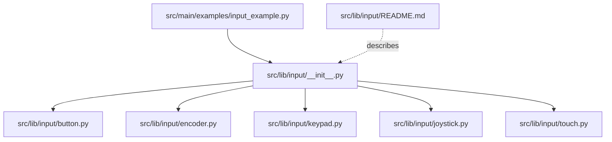
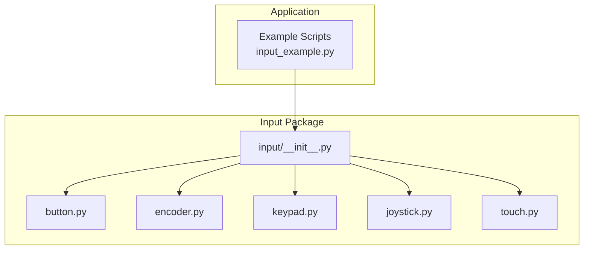
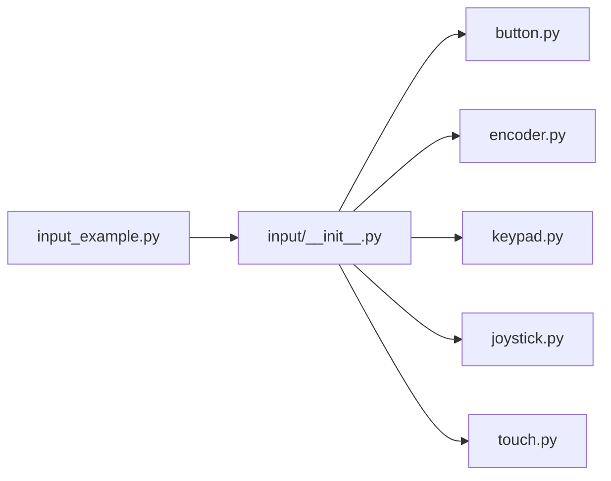

# Input API

<cite>
**Referenced Files in This Document**
- [input_example.py](file://src/main/examples/input_example.py)
- [input/__init__.py](file://src/lib/input/__init__.py)
- [input/README.md](file://src/lib/input/README.md)
- [button.py](file://src/lib/input/button.py)
- [encoder.py](file://src/lib/input/encoder.py)
- [keypad.py](file://src/lib/input/keypad.py)
- [joystick.py](file://src/lib/input/joystick.py)
</cite>

## Table of Contents
1. [Introduction](#introduction)
2. [Project Structure](#project-structure)
3. [Core Components](#core-components)
4. [Architecture Overview](#architecture-overview)
5. [Detailed Component Analysis](#detailed-component-analysis)
6. [Dependency Analysis](#dependency-analysis)
7. [Performance Considerations](#performance-considerations)
8. [Troubleshooting Guide](#troubleshooting-guide)
9. [Conclusion](#conclusion)
10. [Appendices](#appendices)

## Introduction
This document provides comprehensive API documentation for the input handling modules in the project. It covers button interfaces, rotary encoders, matrix keypads, analog joysticks, and capacitive touch sensors. For each input type, it documents constructor parameters, methods, properties, debouncing and event detection mechanisms, calibration and configuration options, return values, and practical usage examples. It also explains integration patterns with asynchronous workflows and user interface systems, along with filtering and threshold management for responsive user interactions.

## Project Structure
The input library is organized under the input package with a public API surface exposed via the package’s init file. Example scripts demonstrate usage patterns across all supported input devices.

**Diagram sources**
- [input_example.py:1-88](file://src/main/examples/input_example.py#L1-L88)
- [input/__init__.py:1-15](file://src/lib/input/__init__.py#L1-L15)
- [input/README.md:1-62](file://src/lib/input/README.md#L1-L62)

**Section sources**
- [input_example.py:1-88](file://src/main/examples/input_example.py#L1-L88)
- [input/__init__.py:1-15](file://src/lib/input/__init__.py#L1-L15)
- [input/README.md:1-62](file://src/lib/input/README.md#L1-L62)

## Core Components
This section summarizes the primary input components and their roles:
- Button: GPIO-based push-button with interrupt-driven callbacks, debouncing, long press detection, multi-click detection, pattern recognition, and async polling.
- RotaryEncoder: Two-channel quadrature encoder with position tracking, optional switch, change callbacks, and async monitoring.
- MatrixKeypad: Row/column matrix scanning keypad with instant read and async wait for key events.
- Joystick: Analog joystick with X/Y axes, optional button, normalization, dead-zone handling, and async integration.
- TouchPad: Capacitive touch sensor driver (supported on ESP32/S2/S3; raises NotImplementedError on ESP32-C3/C6).

Key capabilities:
- Debouncing and event detection are handled internally for buttons and encoders.
- Calibration and thresholds are configurable per device (e.g., dead zone for joysticks).
- Async-friendly APIs enable cooperative multitasking and integration with UI loops.

**Section sources**
- [input/README.md:21-30](file://src/lib/input/README.md#L21-L30)
- [input_example.py:12-87](file://src/main/examples/input_example.py#L12-L87)

## Architecture Overview
The input modules expose a unified import surface and provide both synchronous and asynchronous interfaces. The examples illustrate how to instantiate devices, register callbacks, and integrate with async loops and UI components.

**Diagram sources**
- [input_example.py:1-88](file://src/main/examples/input_example.py#L1-L88)
- [input/__init__.py:1-15](file://src/lib/input/__init__.py#L1-L15)

## Detailed Component Analysis

### Button API
Purpose: Detect button presses, releases, long presses, multi-clicks, and custom press patterns with debouncing and interrupt-driven callbacks.

Constructor parameters:
- pin: GPIO pin number
- pull_up: Boolean indicating internal pull-up configuration
- debounce_ms: Debounce window in milliseconds

Methods and properties:
- is_pressed: Property returning current button state
- read(): Alias of is_pressed
- on_press(callback): Register press callback
- on_release(callback): Register release callback
- on_long_press(callback, threshold_ms): Register long press callback with custom threshold
- on_double_click(callback), on_triple_click(callback), on_multi_click(count, callback): Multi-click handlers
- get_last_press_duration(): Returns last press duration in milliseconds
- register_pattern(name, pattern, callback): Register custom press pattern recognition
- unregister_pattern(name), clear_patterns(): Manage registered patterns
- disable_irq(): Disable interrupts
- wait_press(poll_ms), wait_release(poll_ms): Async wait for events
- watch(on_press, on_release, interval_ms): Async polling loop supporting long press

Debouncing algorithm:
- Interrupt-triggered state transitions are filtered by a minimum time window to prevent bouncing.
- Internal timing tracks last interrupt timestamp and compares against debounce threshold.

Event detection:
- Press/release callbacks fire upon validated state transitions.
- Long press detection computes elapsed time since press start.
- Multi-click detection uses configurable click windows and maximum click counts.
- Pattern recognition maintains timing gaps and durations to match predefined sequences.

Return values:
- Boolean states for is_pressed and button availability.
- Duration integers for press duration tracking.
- Pattern registration identifiers for pattern management.

Usage examples:
- Basic polling and interrupt callbacks
- Long press detection with custom thresholds
- Multi-click detection (double/triple/quadruple)
- Pattern recognition for custom gesture sequences
- Async watch for continuous monitoring with long press support
- Multi-device async coordination

Integration tips:
- Combine with async loops for responsive UI updates.
- Use polling mode when interrupts are unavailable or undesirable.
- Configure debounce and click thresholds based on hardware and UX requirements.

**Section sources**
- [input/README.md:33-231](file://src/lib/input/README.md#L33-L231)
- [input_example.py:12-21](file://src/main/examples/input_example.py#L12-L21)

### RotaryEncoder API
Purpose: Track incremental rotation and detect switch presses on a quadrature encoder.

Constructor parameters:
- clk_pin: Clock channel GPIO
- dt_pin: Direction channel GPIO
- sw_pin: Optional switch GPIO

Methods and properties:
- position: Accumulated position (integer)
- count: Step counter (integer)
- reset(): Reset position and count
- on_change(callback): Register change callback receiving delta
- on_press(callback): Register switch press callback
- watch(on_change, on_press, interval): Async monitoring loop

Event detection:
- Change events are generated when quadrature phase transitions indicate rotation.
- Switch press events are detected via GPIO interrupt.

Return values:
- Integer position and count for navigation and state tracking.
- Delta integer passed to change callbacks for direction-aware adjustments.

Usage examples:
- Basic position reading
- Volume control with delta-based adjustments
- Menu navigation with async watch and UI rendering

Integration tips:
- Use async watch for non-blocking operation in UI loops.
- Pair with displays or audio controls for immediate feedback.

**Section sources**
- [input/README.md:233-340](file://src/lib/input/README.md#L233-L340)
- [input_example.py:23-35](file://src/main/examples/input_example.py#L23-L35)

### MatrixKeypad API
Purpose: Scan a matrix of rows and columns to detect key presses.

Constructor parameters:
- rows: List of GPIO pins configured as outputs
- cols: List of GPIO pins configured as inputs with pull-ups
- keys_layout: 2D array mapping physical keys to logical values

Methods:
- read_key(): Instant key value or None
- wait_key(): Coroutine awaiting next key press
- watch(callback, interval): Async loop periodically checking for key events

Event detection:
- Rows are driven low in sequence while columns are sampled to detect closures.
- Async wait returns immediately upon key detection.

Return values:
- String key identifier or None when idle.
- Coroutine yielding the pressed key value.

Usage examples:
- Basic key reading in a loop
- PIN entry system with special keys for confirm/clear

Integration tips:
- Ensure rows are outputs and columns are inputs with pull-ups.
- Use async watch for responsive UI handling.

**Section sources**
- [input/README.md:342-432](file://src/lib/input/README.md#L342-L432)
- [input_example.py:37-49](file://src/main/examples/input_example.py#L37-L49)

### Joystick API
Purpose: Read analog X/Y axes and optional button, normalize values, and apply dead-zone filtering.

Constructor parameters:
- x_pin: ADC-capable GPIO for X axis
- y_pin: ADC-capable GPIO for Y axis
- btn_pin: Optional GPIO for button
- invert_x, invert_y: Optional inversion flags
- deadzone: Dead-zone threshold for normalized output

Methods and properties:
- read_raw(): Tuple of raw ADC readings (0–4095)
- read_percent(): Tuple of percent values (-100 to 100)
- x_pct, y_pct: Normalized percentage properties
- is_pressed(): Button state or None if not configured

Calibration and thresholds:
- Center is derived from ADC max and half-range.
- Dead-zone clamps small deviations to zero for stable UI behavior.
- Optional inversion flips axis polarity.

Return values:
- Raw tuples for precise control.
- Normalized floats for UI-friendly scaling.

Usage examples:
- Basic reading of raw and normalized values
- Camera gimbal control with servo motors

Integration tips:
- Apply dead-zone to avoid jitter near center.
- Normalize values to drive actuators or UI sliders.

**Section sources**
- [input/README.md:469-541](file://src/lib/input/README.md#L469-L541)
- [input_example.py:66-75](file://src/main/examples/input_example.py#L66-L75)

### TouchPad API
Purpose: Capacitive touch sensing using ESP32 touch peripherals.

Notes:
- Supported on ESP32, ESP32-S2, ESP32-S3.
- Raises NotImplementedError on ESP32-C3/C6.

Constructor parameters:
- pin: Touch-capable GPIO pin

Usage examples:
- Reading baseline and detecting touches
- Threshold-based touch detection

Integration tips:
- Use baseline measurements to adapt to environmental conditions.
- Guard against unsupported platforms with try/except blocks.

**Section sources**
- [input/README.md:434-467](file://src/lib/input/README.md#L434-L467)
- [input_example.py:51-64](file://src/main/examples/input_example.py#L51-L64)

## Dependency Analysis
The input package exposes a clean facade via its init file, re-exporting device classes. Example scripts demonstrate device instantiation and event handling across modules.

**Diagram sources**
- [input_example.py:1-88](file://src/main/examples/input_example.py#L1-L88)
- [input/__init__.py:1-15](file://src/lib/input/__init__.py#L1-L15)

**Section sources**
- [input_example.py:1-88](file://src/main/examples/input_example.py#L1-L88)
- [input/__init__.py:1-15](file://src/lib/input/__init__.py#L1-L15)

## Performance Considerations
- Debounce and polling intervals: Tune debounce_ms for buttons and polling intervals for watch loops to balance responsiveness and CPU usage.
- Interrupt handling: Prefer IRQ-based callbacks for latency-sensitive inputs; use polling mode when interrupts are constrained.
- Filtering and thresholds: Apply dead zones for joysticks and configurable thresholds for touch to reduce false positives.
- Async coordination: Use asyncio.gather for multi-input coordination to keep UI responsive.
- Hardware considerations: Use external pull-ups for encoders and proper grounding to minimize noise.

[No sources needed since this section provides general guidance]

## Troubleshooting Guide
Common issues and resolutions:
- Unsupported platform for TouchPad: Catch NotImplementedError and fall back to alternative input methods.
- Button bounce: Increase debounce_ms and verify wiring; ensure pull-up/pull-down configuration matches hardware.
- Encoder noise: Add 100nF capacitors across CLK/DT and verify pull-ups.
- Keypad wiring: Confirm rows are outputs and columns are inputs with pull-ups.
- Joystick drift: Calibrate center and adjust deadzone; consider inversion flags for axis orientation.

**Section sources**
- [input/README.md:544-553](file://src/lib/input/README.md#L544-L553)
- [input_example.py:54-58](file://src/main/examples/input_example.py#L54-L58)

## Conclusion
The input API provides robust, asynchronous-first abstractions for common human-interface devices. With built-in debouncing, event detection, and flexible configuration, it enables responsive and reliable user interactions across diverse UI and control scenarios. Use the provided examples as starting points and adapt parameters to match hardware characteristics and user experience goals.

[No sources needed since this section summarizes without analyzing specific files]

## Appendices

### API Reference Quick Links
- Button: Constructor parameters, methods, and properties
- RotaryEncoder: Position tracking, change callbacks, and switch handling
- MatrixKeypad: Row/column scanning and key mapping
- Joystick: Raw and normalized reads, dead-zone, and button state
- TouchPad: Baseline measurement and touch detection

**Section sources**
- [input/README.md:33-541](file://src/lib/input/README.md#L33-L541)