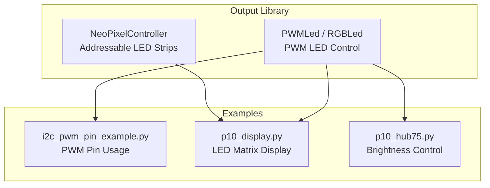
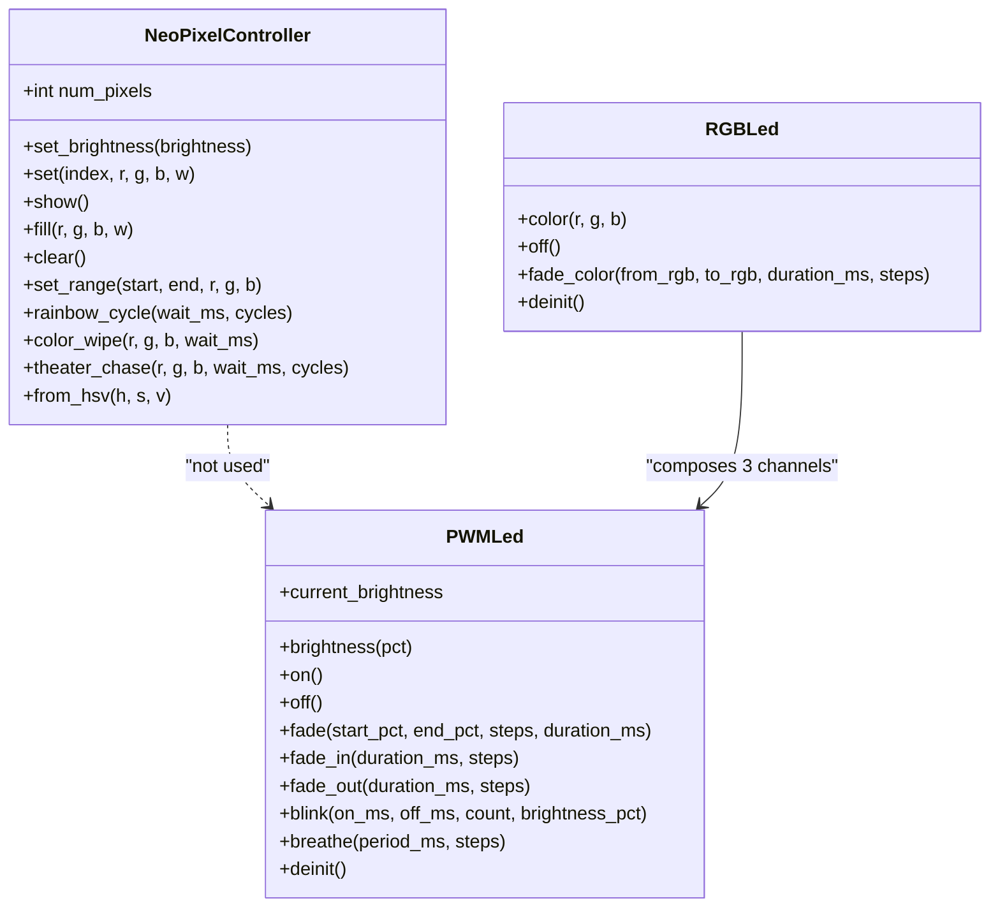
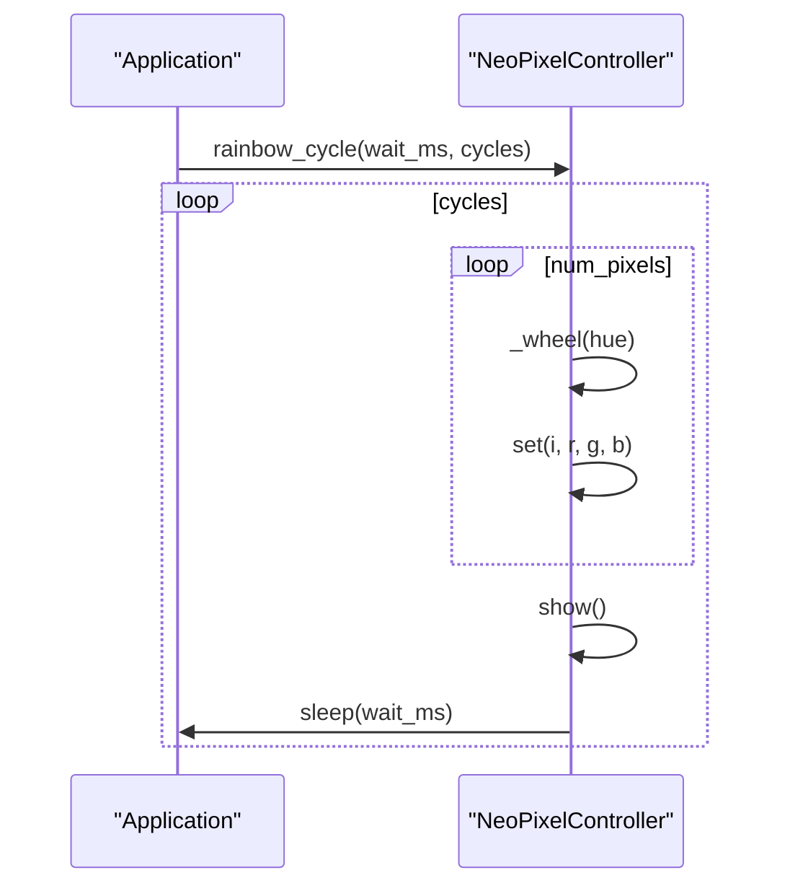
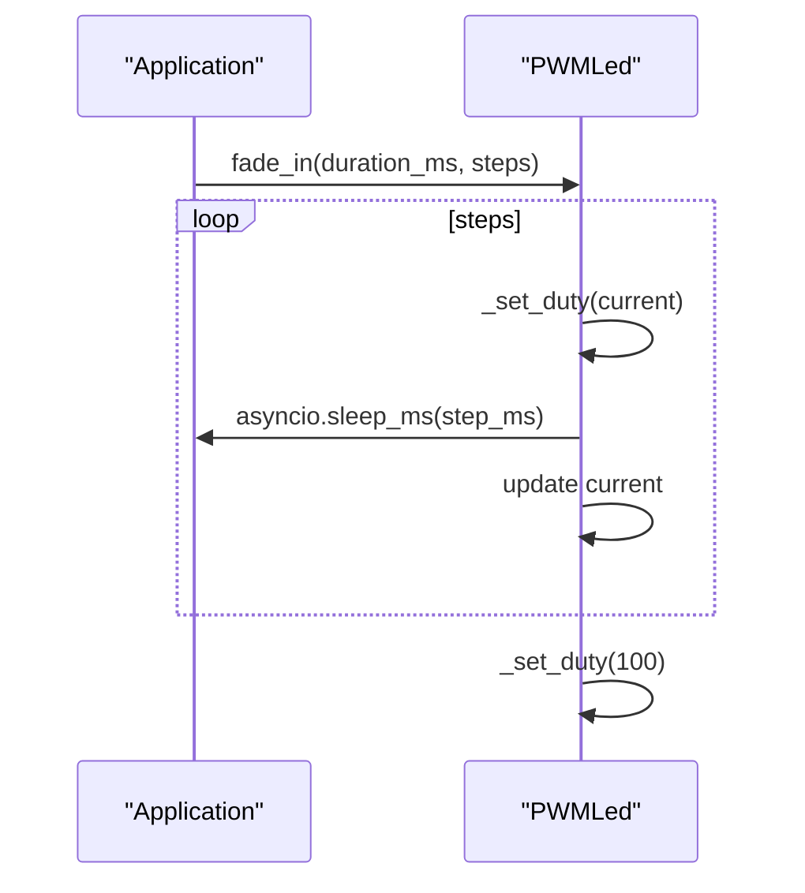
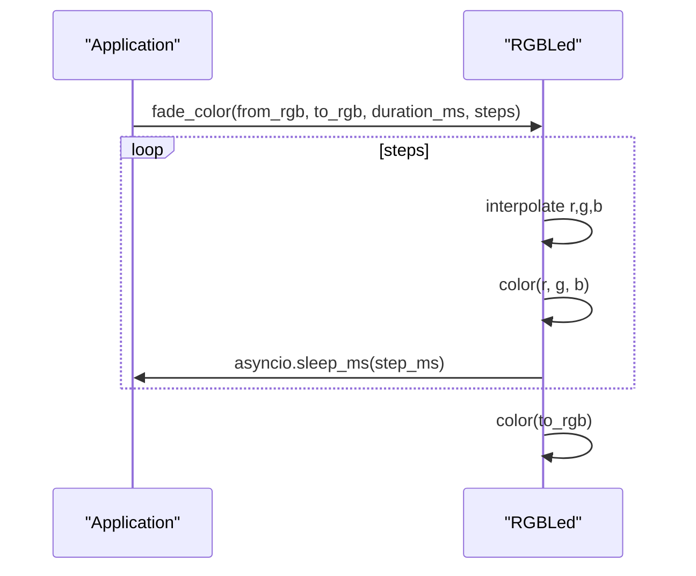
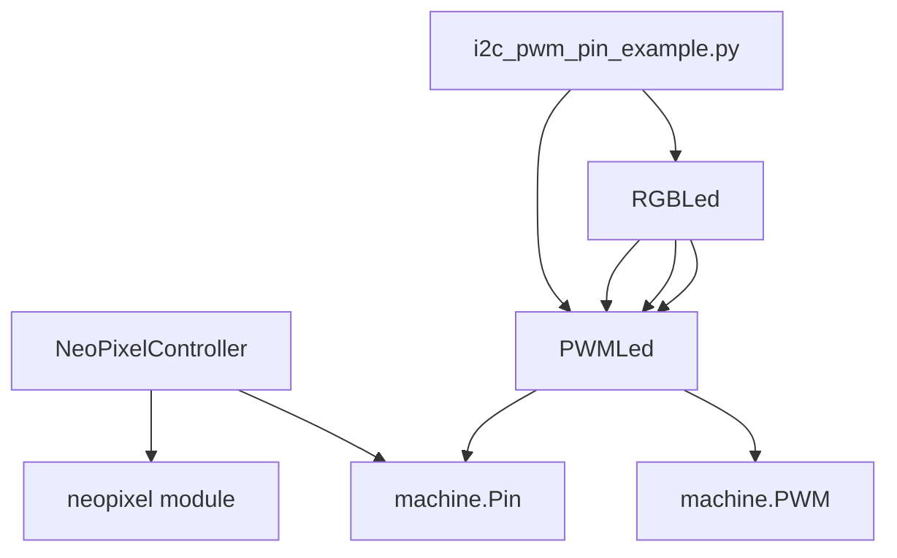

# LED Control API

<cite>
**Referenced Files in This Document**
- [neopixel_ctrl.py](file://src/lib/output/neopixel_ctrl.py)
- [pwm_led.py](file://src/lib/output/pwm_led.py)
- [README.md](file://src/lib/output/README.md)
- [i2c_pwm_pin_example.py](file://src/main/examples/i2c_pwm_pin_example.py)
- [p10_hub75.py](file://src/lib/p10/p10_hub75.py)
- [p10_display.py](file://src/lib/p10/p10_display.py)
</cite>

## Table of Contents
1. [Introduction](#introduction)
2. [Project Structure](#project-structure)
3. [Core Components](#core-components)
4. [Architecture Overview](#architecture-overview)
5. [Detailed Component Analysis](#detailed-component-analysis)
6. [Dependency Analysis](#dependency-analysis)
7. [Performance Considerations](#performance-considerations)
8. [Troubleshooting Guide](#troubleshooting-guide)
9. [Conclusion](#conclusion)
10. [Appendices](#appendices)

## Introduction
This document provides comprehensive API documentation for LED control modules in the repository, focusing on:
- Addressable LED strips via NeoPixel (WS2812B/SK6812) using the NeoPixelController class
- PWM-based LED control for single LEDs and RGB LEDs using PWMLed and RGBLed classes
- Practical lighting effects, status indicators, ambient lighting, and display applications
- Power management, current limiting, and thermal protection considerations
- Integration patterns with sensor feedback and user interface systems

The documentation includes method signatures, parameter specifications, timing constraints, memory usage considerations, and real-world usage scenarios derived from the repository’s examples and libraries.

## Project Structure
The LED control APIs are implemented in two primary modules under the output library:
- NeoPixel controller for addressable LED strips
- PWM LED controller for single LEDs and RGB LEDs

**Diagram sources**
- [neopixel_ctrl.py:14-147](file://src/lib/output/neopixel_ctrl.py#L14-L147)
- [pwm_led.py:14-215](file://src/lib/output/pwm_led.py#L14-L215)
- [i2c_pwm_pin_example.py:153-191](file://src/main/examples/i2c_pwm_pin_example.py#L153-L191)
- [p10_display.py:347-547](file://src/lib/p10/p10_display.py#L347-L547)
- [p10_hub75.py:336-360](file://src/lib/p10/p10_hub75.py#L336-L360)

**Section sources**
- [README.md:18-34](file://src/lib/output/README.md#L18-L34)
- [neopixel_ctrl.py:1-147](file://src/lib/output/neopixel_ctrl.py#L1-L147)
- [pwm_led.py:1-215](file://src/lib/output/pwm_led.py#L1-L215)

## Core Components
This section documents the primary LED control APIs and their capabilities.

### NeoPixelController (Addressable LED Strips)
The NeoPixelController class controls WS2812B/SK6812 strips via GPIO (RMT/bit-bang). It supports per-pixel color setting, bulk operations, brightness scaling, and several built-in animations.

Key capabilities:
- Per-pixel color setting with brightness scaling
- Bulk fill/clear operations
- Range-based color setting
- Built-in animations: rainbow cycle, color wipe, theater chase
- Color conversion from HSV to RGB

Constructor and initialization:
- Parameters: pin (GPIO), num_pixels (int), brightness (0.0–1.0), bpp (bytes per pixel, 3=RGB, 4=RGBW)
- Internal brightness scaling applied before writing to pixels

Core methods:
- set_brightness(value): Adjusts internal brightness scale
- set(index, r, g, b, w=0): Sets a single pixel with brightness applied
- show(): Commits pixel buffer to LEDs
- fill(r, g, b, w=0): Fills all pixels with a color
- clear(): Turns off all LEDs
- set_range(start, end, r, g, b): Applies color to a range of pixels
- rainbow_cycle(wait_ms=20, cycles=1): Rainbow rotation effect
- color_wipe(r, g, b, wait_ms=50): Sequential pixel activation
- theater_chase(r, g, b, wait_ms=50, cycles=10): Chase pattern
- from_hsv(h, s, v): Static method to convert HSV to RGB
- _wheel(pos): Internal helper for rainbow generation

Timing and memory considerations:
- Each pixel write involves a protocol timing constraint; avoid excessive refresh rates
- Memory usage scales linearly with number of pixels (bpp bytes per pixel)
- Brightness scaling reduces effective color precision but avoids overcurrent

Practical examples:
- Basic color filling and per-pixel control
- Status indicators using predefined colors
- Asynchronous rainbow animation loops

**Section sources**
- [neopixel_ctrl.py:14-147](file://src/lib/output/neopixel_ctrl.py#L14-L147)
- [README.md:37-123](file://src/lib/output/README.md#L37-L123)

### PWMLed and RGBLed (PWM LED Control)
The PWMLed class controls a single LED via PWM, while RGBLed composes three PWMLed instances to control RGB color channels. Both support brightness control, fading, blinking, and continuous breathing effects.

Constructor and initialization:
- PWMLed: pin (PWM-capable GPIO), freq (PWM frequency Hz), invert (active-low flag)
- RGBLed: r_pin, g_pin, b_pin, freq, invert

Core methods:
- PWMLed
  - brightness(pct): Sets brightness percentage (0–100)
  - on(): Sets 100% brightness
  - off(): Sets 0% brightness
  - current_brightness: property returning current brightness percentage
  - fade(start_pct, end_pct, steps=50, duration_ms=1000): Smooth brightness transition
  - fade_in(duration_ms=1000, steps=50): Fade from 0 to 100%
  - fade_out(duration_ms=1000, steps=50): Fade from 100% to 0
  - blink(on_ms, off_ms, count, brightness_pct): Blink pattern (count=0 for continuous)
  - breathe(period_ms, steps): Continuous fade in/out loop
  - deinit(): Releases PWM resources

- RGBLed
  - color(r, g, b): Sets RGB color (0–255 per channel)
  - off(): Turns off all channels
  - fade_color(from_rgb, to_rgb, duration_ms, steps): Smooth color transition
  - deinit(): Releases PWM resources

Timing and memory considerations:
- PWM duty resolution is 16-bit; brightness is mapped accordingly
- Fading and blinking rely on asyncio sleep; ensure event loop is responsive
- RGBLed composes three independent PWM channels; shared frequency applies to all channels

Practical examples:
- Single LED brightness control and fades
- RGB status indicator with color mapping
- Coordinated heartbeat and color cycling using asyncio tasks

**Section sources**
- [pwm_led.py:14-215](file://src/lib/output/pwm_led.py#L14-L215)
- [README.md:1069-1177](file://src/lib/output/README.md#L1069-L1177)

## Architecture Overview
The LED control architecture separates concerns between:
- Addressable LED strips (NeoPixel) controlled via GPIO
- PWM-based LEDs (single and RGB) controlled via hardware timers

**Diagram sources**
- [neopixel_ctrl.py:14-147](file://src/lib/output/neopixel_ctrl.py#L14-L147)
- [pwm_led.py:14-215](file://src/lib/output/pwm_led.py#L14-L215)

## Detailed Component Analysis

### NeoPixelController API Reference
- Constructor: NeoPixelController(pin, num_pixels, brightness=1.0, bpp=3)
- Methods:
  - set_brightness(brightness: float)
  - set(index: int, r: int, g: int, b: int, w: int = 0)
  - show()
  - fill(r: int, g: int, b: int, w: int = 0)
  - clear()
  - set_range(start: int, end: int, r: int, g: int, b: int)
  - rainbow_cycle(wait_ms: int = 20, cycles: int = 1)
  - color_wipe(r: int, g: int, b: int, wait_ms: int = 50)
  - theater_chase(r: int, g: int, b: int, wait_ms: int = 50, cycles: int = 10)
  - from_hsv(h: float, s: float, v: float) -> tuple
- Timing constraints:
  - Animation loops sleep between updates; adjust wait_ms to balance smoothness and CPU usage
- Memory usage:
  - Pixel buffer size = num_pixels × bpp bytes
- Practical examples:
  - Basic color filling and per-pixel control
  - Status indicators using predefined colors
  - Asynchronous rainbow animation loops

**Section sources**
- [neopixel_ctrl.py:30-147](file://src/lib/output/neopixel_ctrl.py#L30-L147)
- [README.md:63-123](file://src/lib/output/README.md#L63-L123)

### PWMLed API Reference
- Constructor: PWMLed(pin, freq=1000, invert=False)
- Methods:
  - brightness(pct: float)
  - on()
  - off()
  - current_brightness: property
  - fade(start_pct, end_pct, steps: int = 50, duration_ms: int = 1000)
  - fade_in(duration_ms: int = 1000, steps: int = 50)
  - fade_out(duration_ms: int = 1000, steps: int = 50)
  - blink(on_ms: int = 200, off_ms: int = 200, count: int = 3, brightness_pct: float = 100)
  - breathe(period_ms: int = 2000, steps: int = 100)
  - deinit()
- Timing constraints:
  - Fading and blinking use millisecond sleeps; ensure adequate time slices for responsiveness
- Memory usage:
  - Minimal; maintains internal duty and brightness state
- Practical examples:
  - Single LED brightness control and fades
  - Continuous breathing effect for status indication

**Section sources**
- [pwm_led.py:31-139](file://src/lib/output/pwm_led.py#L31-L139)
- [README.md:1104-1118](file://src/lib/output/README.md#L1104-L1118)

### RGBLed API Reference
- Constructor: RGBLed(r_pin, g_pin, b_pin, freq=1000, invert=False)
- Methods:
  - color(r: int, g: int, b: int)
  - off()
  - fade_color(from_rgb: tuple, to_rgb: tuple, duration_ms: int = 1000, steps: int = 50)
  - deinit()
- Timing constraints:
  - Color transitions use millisecond sleeps; steps determine smoothness
- Memory usage:
  - Minimal; delegates to three PWMLed instances
- Practical examples:
  - RGB status indicator with color mapping
  - Coordinated heartbeat and color cycling using asyncio tasks

**Section sources**
- [pwm_led.py:160-215](file://src/lib/output/pwm_led.py#L160-L215)
- [README.md:1119-1125](file://src/lib/output/README.md#L1119-L1125)

### Example Workflows

#### NeoPixel Rainbow Cycle

**Diagram sources**
- [neopixel_ctrl.py:82-92](file://src/lib/output/neopixel_ctrl.py#L82-L92)

#### PWM Fade In/Out

**Diagram sources**
- [pwm_led.py:74-92](file://src/lib/output/pwm_led.py#L74-L92)

#### RGB Color Transition

**Diagram sources**
- [pwm_led.py:190-210](file://src/lib/output/pwm_led.py#L190-L210)

## Dependency Analysis
- NeoPixelController depends on the onboard neopixel module and machine.Pin for GPIO control
- PWMLed depends on machine.PWM and machine.Pin for hardware PWM generation
- RGBLed composes three PWMLed instances for independent channel control
- Example integrations demonstrate PWM pin usage and LED matrix display brightness control

**Diagram sources**
- [neopixel_ctrl.py:9-11](file://src/lib/output/neopixel_ctrl.py#L9-L11)
- [pwm_led.py:10-11](file://src/lib/output/pwm_led.py#L10-L11)
- [i2c_pwm_pin_example.py:159-189](file://src/main/examples/i2c_pwm_pin_example.py#L159-L189)

**Section sources**
- [neopixel_ctrl.py:9-11](file://src/lib/output/neopixel_ctrl.py#L9-L11)
- [pwm_led.py:10-11](file://src/lib/output/pwm_led.py#L10-L11)
- [i2c_pwm_pin_example.py:153-191](file://src/main/examples/i2c_pwm_pin_example.py#L153-L191)

## Performance Considerations
- NeoPixel refresh rate:
  - Each pixel write has strict timing; avoid very high update frequencies
  - Use set_range and fill for bulk operations to minimize per-pixel overhead
- PWM duty resolution:
  - 16-bit duty cycle provides fine granularity; ensure steps are sufficient for smooth fades
  - Avoid excessively high frequencies that increase switching losses
- Memory usage:
  - NeoPixel buffer grows linearly with pixel count; monitor heap usage on constrained devices
- Event loop scheduling:
  - Fading and blinking use asyncio sleeps; keep durations reasonable to maintain UI responsiveness

[No sources needed since this section provides general guidance]

## Troubleshooting Guide
Common issues and resolutions:
- NeoPixel not updating:
  - Ensure show() is called after batched set operations
  - Verify pin and power connections; long strips require level shifting and proper grounding
- PWM flicker or noise:
  - Reduce frequency or increase series resistance; verify power supply stability
- RGB color imbalance:
  - Calibrate resistors per channel; confirm invert flag matches LED configuration
- Thermal throttling:
  - Limit brightness and duty cycles; ensure adequate heatsinking and airflow

Integration tips:
- Combine sensor feedback with LED status indicators for user-friendly diagnostics
- Use asynchronous tasks to coordinate multiple LED effects without blocking the main loop

**Section sources**
- [README.md:1313-1322](file://src/lib/output/README.md#L1313-L1322)

## Conclusion
The repository provides robust APIs for controlling both addressable and PWM-based LEDs:
- NeoPixelController offers rich animation capabilities and per-pixel control for creative lighting projects
- PWMLed and RGBLed deliver efficient brightness and color control suitable for status indicators and ambient lighting
By following the documented parameters, timing constraints, and integration patterns, developers can implement reliable and visually appealing LED applications while managing power and thermal budgets effectively.

[No sources needed since this section summarizes without analyzing specific files]

## Appendices

### Practical Application Scenarios
- Lighting effects:
  - Use rainbow_cycle and theater_chase for dynamic ambiance
  - Employ color_wipe for attention-grabbing alerts
- Status indicators:
  - Map predefined colors to operational states (OK, warning, error, idle)
  - Utilize breathe for low-power status indication
- Ambient lighting:
  - Combine multiple strips with synchronized animations
  - Use HSV-based color transitions for smooth mood lighting
- Display applications:
  - Integrate with LED matrix displays for brightness control and frame updates

**Section sources**
- [README.md:89-123](file://src/lib/output/README.md#L89-L123)
- [README.md:1126-1177](file://src/lib/output/README.md#L1126-L1177)
- [p10_display.py:347-547](file://src/lib/p10/p10_display.py#L347-L547)
- [p10_hub75.py:336-360](file://src/lib/p10/p10_hub75.py#L336-L360)