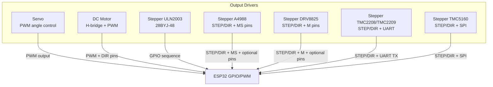
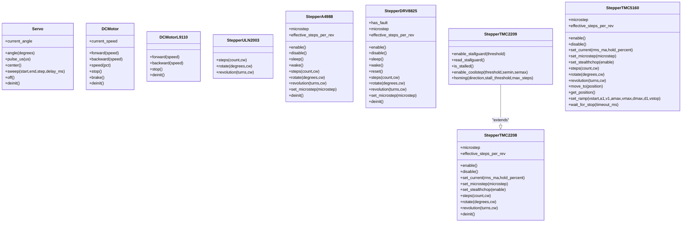
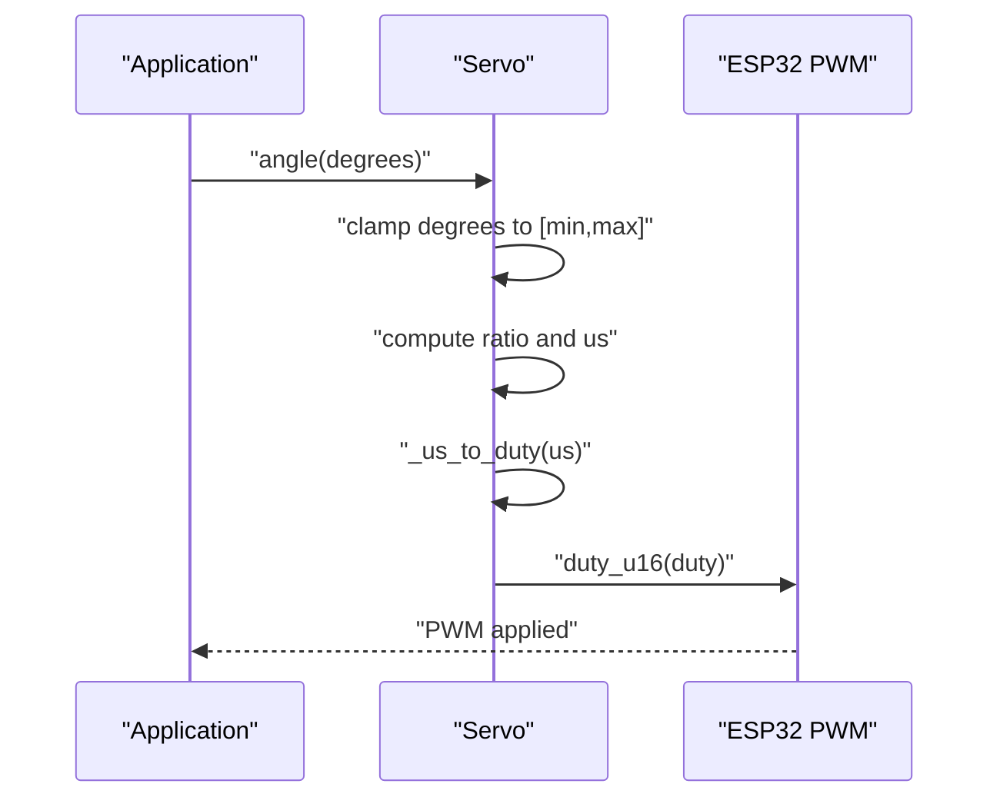
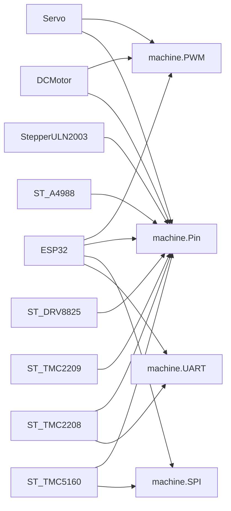

# Motor Control API

<cite>
**Referenced Files in This Document**
- [servo.py](file://src/lib/output/servo.py)
- [dc_motor.py](file://src/lib/output/dc_motor.py)
- [stepper.py](file://src/lib/output/stepper.py)
- [stepper_a4988.py](file://src/lib/output/stepper_a4988.py)
- [stepper_drv8825.py](file://src/lib/output/stepper_drv8825.py)
- [stepper_tmc2208.py](file://src/lib/output/stepper_tmc2208.py)
- [stepper_tmc5160.py](file://src/lib/output/stepper_tmc5160.py)
</cite>

## Table of Contents
1. [Introduction](#introduction)
2. [Project Structure](#project-structure)
3. [Core Components](#core-components)
4. [Architecture Overview](#architecture-overview)
5. [Detailed Component Analysis](#detailed-component-analysis)
6. [Dependency Analysis](#dependency-analysis)
7. [Performance Considerations](#performance-considerations)
8. [Troubleshooting Guide](#troubleshooting-guide)
9. [Conclusion](#conclusion)
10. [Appendices](#appendices)

## Introduction
This document provides comprehensive API documentation for motor control modules targeting ESP32 platforms. It covers:
- Servo control for precise angular positioning, speed-like smoothing via pulse-width modulation, and multi-servo coordination patterns.
- DC motor control with direction management, speed regulation, coasting, and braking.
- Stepper motor drivers for A4988, DRV8825, TMC2208/TMC2209, and TMC5160, including step control, microstepping configuration, torque/current management, and positioning accuracy.

Each section documents method signatures, parameter ranges, operational notes, and practical examples for robotics, positioning systems, and automated machinery. Safety limits, power requirements, heat dissipation, and protective circuitry integration are addressed to guide robust deployments.

## Project Structure
The motor control modules reside under src/lib/output and are organized by motor type:
- Servo: PWM-based angular control
- DC motor: H-bridge controlled with PWM and direction pins
- Stepper: Generic ULN2003-based 28BYJ-48 driver and dedicated drivers for A4988, DRV8825, TMC2208/TMC2209, and TMC5160

**Diagram sources**
- [servo.py:12-120](file://src/lib/output/servo.py#L12-L120)
- [dc_motor.py:12-154](file://src/lib/output/dc_motor.py#L12-L154)
- [stepper.py:42-121](file://src/lib/output/stepper.py#L42-L121)
- [stepper_a4988.py:27-207](file://src/lib/output/stepper_a4988.py#L27-L207)
- [stepper_drv8825.py:30-227](file://src/lib/output/stepper_drv8825.py#L30-L227)
- [stepper_tmc2208.py:83-476](file://src/lib/output/stepper_tmc2208.py#L83-L476)
- [stepper_tmc5160.py:103-451](file://src/lib/output/stepper_tmc5160.py#L103-L451)

**Section sources**
- [servo.py:1-120](file://src/lib/output/servo.py#L1-L120)
- [dc_motor.py:1-154](file://src/lib/output/dc_motor.py#L1-L154)
- [stepper.py:1-121](file://src/lib/output/stepper.py#L1-L121)
- [stepper_a4988.py:1-207](file://src/lib/output/stepper_a4988.py#L1-L207)
- [stepper_drv8825.py:1-227](file://src/lib/output/stepper_drv8825.py#L1-L227)
- [stepper_tmc2208.py:1-476](file://src/lib/output/stepper_tmc2208.py#L1-L476)
- [stepper_tmc5160.py:1-451](file://src/lib/output/stepper_tmc5160.py#L1-L451)

## Core Components
This section summarizes the primary classes and their responsibilities.

- Servo
  - Purpose: Angular positioning via PWM with configurable min/max angles and pulse widths.
  - Key methods: angle, pulse_us, center, sweep, off, deinit.
  - Typical use: robotic arms, pan/tilt mechanisms, precise positioning.

- DC Motor
  - Purpose: Directional speed control with coast and brake modes.
  - Key methods: forward, backward, speed, stop, brake, deinit.
  - Variants: DCMotor (L298N-style H-bridge), DCMotorL9110 (dual PWM channel).

- Stepper ULN2003
  - Purpose: 28BYJ-48 with ULN2003 using half/full step sequences.
  - Key methods: steps, rotate, revolution; configuration: half_step, delay_us.

- Stepper A4988
  - Purpose: NEMA17 with STEP/DIR and microstepping via MS1/MS2/MS3.
  - Key methods: enable/disable, sleep/wake, steps, rotate, revolution, set_microstep.

- Stepper DRV8825
  - Purpose: Enhanced microstepping up to 1/32, optional fault pin, sleep/reset.
  - Key methods: enable/disable/sleep/wake/reset, steps, rotate, revolution, set_microstep, has_fault.

- Stepper TMC2208/TMC2209
  - Purpose: Silent operation via StealthChop2, UART-based configuration, optional StallGuard4/CoolStep/DIAG.
  - Key methods: enable/disable, set_current, set_microstep, set_stealthchop, steps, rotate, revolution, enable_stallguard, read_stallguard, is_stalled, enable_coolstep, homing.

- Stepper TMC5160
  - Purpose: High-power, built-in motion ramp generator, SPI configuration, StallGuard2/CoolStep/DcStep.
  - Key methods: enable/disable, set_current, set_microstep, set_stealthchop, steps, rotate, revolution, move_to, get_position, set_ramp, wait_for_stop.

**Section sources**
- [servo.py:12-120](file://src/lib/output/servo.py#L12-L120)
- [dc_motor.py:12-154](file://src/lib/output/dc_motor.py#L12-L154)
- [stepper.py:42-121](file://src/lib/output/stepper.py#L42-L121)
- [stepper_a4988.py:27-207](file://src/lib/output/stepper_a4988.py#L27-L207)
- [stepper_drv8825.py:30-227](file://src/lib/output/stepper_drv8825.py#L30-L227)
- [stepper_tmc2208.py:83-476](file://src/lib/output/stepper_tmc2208.py#L83-L476)
- [stepper_tmc5160.py:103-451](file://src/lib/output/stepper_tmc5160.py#L103-L451)

## Architecture Overview
The drivers abstract hardware-specific interfaces behind unified method calls. Timing-sensitive operations rely on microsecond delays and precise pin toggles. Some drivers communicate via UART/SPI to configure advanced features like current, microstepping, and chopper modes.

**Diagram sources**
- [servo.py:12-120](file://src/lib/output/servo.py#L12-L120)
- [dc_motor.py:12-154](file://src/lib/output/dc_motor.py#L12-L154)
- [stepper.py:42-121](file://src/lib/output/stepper.py#L42-L121)
- [stepper_a4988.py:27-207](file://src/lib/output/stepper_a4988.py#L27-L207)
- [stepper_drv8825.py:30-227](file://src/lib/output/stepper_drv8825.py#L30-L227)
- [stepper_tmc2208.py:83-476](file://src/lib/output/stepper_tmc2208.py#L83-L476)
- [stepper_tmc5160.py:103-451](file://src/lib/output/stepper_tmc5160.py#L103-L451)

## Detailed Component Analysis

### Servo API
- Purpose: Control RC servos with PWM, mapping angle to pulse width.
- Initialization parameters:
  - pin: GPIO pin capable of PWM
  - freq: PWM frequency (default 50 Hz)
  - min_us: minimum pulse width for min_angle (default 500 µs)
  - max_us: maximum pulse width for max_angle (default 2500 µs)
  - min_angle, max_angle: physical range in degrees (default ±90)
- Methods:
  - angle(degrees): set absolute angle clamped to [min_angle, max_angle]
  - pulse_us(us): set raw pulse width clamped to [min_us, max_us]
  - center(): move to midpoint
  - sweep(start, end, step, delay_ms): oscillate between angles
  - off(): disable PWM output
  - deinit(): release PWM resources
- Properties:
  - current_angle: last commanded angle
- Notes:
  - Pulse width duty cycle mapped to internal 16-bit duty scale based on period
  - sweep uses blocking sleeps; consider non-blocking alternatives for responsive systems
- Example usage patterns:
  - Single-axis pan/tilt: command angle periodically with sweep for search
  - Multi-servo coordination: stagger initialization and update cycles to avoid PWM contention

**Section sources**
- [servo.py:33-56](file://src/lib/output/servo.py#L33-L56)
- [servo.py:62-72](file://src/lib/output/servo.py#L62-L72)
- [servo.py:74-82](file://src/lib/output/servo.py#L74-L82)
- [servo.py:88-90](file://src/lib/output/servo.py#L88-L90)
- [servo.py:92-111](file://src/lib/output/servo.py#L92-L111)
- [servo.py:113-119](file://src/lib/output/servo.py#L113-L119)

### DC Motor API
- Purpose: Drive DC motors via H-bridge with PWM speed control and braking.
- Initialization parameters:
  - pwm_pin: PWM-capable GPIO for speed
  - in1_pin, in2_pin: direction pins (H-bridge)
  - freq: PWM frequency (default 1000 Hz)
  - min_duty: minimum duty to prevent motor stalls (default 0–100%)
  - max_duty: upper bound for duty cycle (default 0–100%)
- Methods:
  - forward(speed): set forward rotation with speed percentage
  - backward(speed): set reverse rotation with speed percentage
  - speed(pct): adjust speed without changing direction
  - stop(): coast (both pins low)
  - brake(): fast stop (both pins high)
  - deinit(): release PWM and set pins to input
- Properties:
  - current_speed: last commanded speed percentage
- Notes:
  - Dead-zone handling: speeds below min_duty are coerced to min_duty to avoid vibration/stall
  - Brake mode shorts windings for rapid stopping; use judiciously to avoid excessive current draw
- Example usage patterns:
  - Differential steering: pair two DCMotor instances; apply opposite directions for pivot
  - Conveyor systems: continuous forward/backward with speed control and periodic brake for holding

**Section sources**
- [dc_motor.py:34-52](file://src/lib/output/dc_motor.py#L34-L52)
- [dc_motor.py:54-61](file://src/lib/output/dc_motor.py#L54-L61)
- [dc_motor.py:63-81](file://src/lib/output/dc_motor.py#L63-L81)
- [dc_motor.py:83-93](file://src/lib/output/dc_motor.py#L83-L93)
- [dc_motor.py:95-101](file://src/lib/output/dc_motor.py#L95-L101)
- [dc_motor.py:108-111](file://src/lib/output/dc_motor.py#L108-L111)

### Stepper ULN2003 (28BYJ-48)
- Purpose: Control 28BYJ-48 steppers through ULN2003 driver with half/full step modes.
- Initialization parameters:
  - pins: list of four GPIO pins [IN1, IN2, IN3, IN4]
  - half_step: True for higher resolution (default), False for full step
  - delay_us: delay between steps in microseconds (~1000 µs typical for 28BYJ-48)
- Methods:
  - steps(count, cw): rotate by number of steps
  - rotate(degrees, cw): convert degrees to steps based on selected step mode
  - revolution(turns, cw): rotate full turns
- Notes:
  - Half-step mode yields 4096 steps/rev; full-step mode yields 2048 steps/rev
  - Sequence applied to pins rotates the stepper; off() disables all pins after movement
- Example usage patterns:
  - Simple dispensers: precise indexing via steps or rotate
  - Low-torque positioning: full-step for speed, half-step for finer control

**Section sources**
- [stepper.py:68-80](file://src/lib/output/stepper.py#L68-L80)
- [stepper.py:86-91](file://src/lib/output/stepper.py#L86-L91)
- [stepper.py:93-102](file://src/lib/output/stepper.py#L93-L102)
- [stepper.py:104-112](file://src/lib/output/stepper.py#L104-L112)
- [stepper.py:114-120](file://src/lib/output/stepper.py#L114-L120)

### Stepper A4988
- Purpose: NEMA17 stepping with STEP/DIR interface and microstepping via MS1/MS2/MS3.
- Initialization parameters:
  - step_pin, dir_pin: STEP and DIR GPIOs
  - en_pin: optional ENABLE pin (active low)
  - ms1_pin, ms2_pin, ms3_pin: optional microstep pins
  - sleep_pin: optional SLEEP pin (active low)
  - microstep: 1, 2, 4, 8, 16
  - step_delay_us: delay for step pulses
- Methods:
  - enable()/disable(): activate/deactivate driver
  - sleep()/wake(): enter/exit sleep state
  - steps(count, cw), rotate(degrees, cw), revolution(turns, cw)
  - set_microstep(microstep): reconfigure MS pins dynamically
  - deinit(): release pins and restore inputs
- Properties:
  - microstep, effective_steps_per_rev
- Notes:
  - Effective steps per revolution = 200 × microstep
  - Sleep/wake affects microstep state; ensure wake delay per datasheet
- Example usage patterns:
  - CNC axes: high-resolution positioning with 1/16 microstepping
  - Focus mechanisms: fine Z-axis adjustment with reduced step angle

**Section sources**
- [stepper_a4988.py:58-108](file://src/lib/output/stepper_a4988.py#L58-L108)
- [stepper_a4988.py:111-132](file://src/lib/output/stepper_a4988.py#L111-L132)
- [stepper_a4988.py:144-157](file://src/lib/output/stepper_a4988.py#L144-L157)
- [stepper_a4988.py:160-195](file://src/lib/output/stepper_a4988.py#L160-L195)
- [stepper_a4988.py:198-206](file://src/lib/output/stepper_a4988.py#L198-L206)

### Stepper DRV8825
- Purpose: High-current NEMA17 driver with up to 1/32 microstepping and enhanced diagnostics.
- Initialization parameters:
  - step_pin, dir_pin: STEP and DIR GPIOs
  - en_pin: optional ENABLE (active low)
  - m0_pin, m1_pin, m2_pin: microstep pins
  - sleep_pin, reset_pin, fault_pin: optional control/status pins
  - microstep: 1, 2, 4, 8, 16, 32
  - step_delay_us: delay for step pulses
- Methods:
  - enable()/disable()/sleep()/wake()/reset(): control states
  - steps/count, rotate/revolution
  - set_microstep(microstep): configure M pins
  - has_fault(): read FAULT pin
  - deinit(): release pins
- Properties:
  - microstep, effective_steps_per_rev
- Notes:
  - Fault pin indicates overcurrent/overtemperature conditions
  - Sleep mode resets microstep state; reconfigure after sleep
- Example usage patterns:
  - Heavy gantry: 2.5 A per coil with 1/32 microstepping for smooth motion
  - Diagnostic monitoring: poll has_fault() for runtime health

**Section sources**
- [stepper_drv8825.py:64-126](file://src/lib/output/stepper_drv8825.py#L64-L126)
- [stepper_drv8825.py:129-162](file://src/lib/output/stepper_drv8825.py#L129-L162)
- [stepper_drv8825.py:186-198](file://src/lib/output/stepper_drv8825.py#L186-L198)
- [stepper_drv8825.py:201-217](file://src/lib/output/stepper_drv8825.py#L201-L217)
- [stepper_drv8825.py:220-226](file://src/lib/output/stepper_drv8825.py#L220-L226)

### Stepper TMC2208/TMC2209
- Purpose: Silent micro-stepping via UART, with optional StallGuard4 and CoolStep.
- Initialization parameters:
  - step_pin, dir_pin: STEP and DIR GPIOs
  - uart_tx: ESP32 UART TX connected to PDN_UART (single-wire loopback)
  - en_pin: optional ENABLE (active low)
  - uart_id, uart_addr: UART bus and slave address
  - step_delay_us: delay for step pulses
- Methods:
  - enable()/disable(): activate/deactivate driver
  - set_current(rms_ma, hold_percent): configure IRUN/IHOLD
  - set_microstep(microstep): set MRES via CHOPCONF (1–256)
  - set_stealthchop(enable): toggle StealthChop2 vs SpreadCycle
  - steps/count, rotate/revolution
  - TMC2209 extensions:
    - enable_stallguard(threshold), read_stallguard(), is_stalled()
    - enable_coolstep(threshold, semin, semax)
    - homing(direction, stall_threshold, max_steps)
- Notes:
  - UART protocol uses 8N1 framing with CRC; single-wire loopback requires resistors as described
  - TMC2209 adds DIAG pin and StallGuard4 for sensorless homing
- Example usage patterns:
  - Precision axes: 256 microsteps with StealthChop for quiet operation
  - Sensorless home: use StallGuard thresholds and homing routine

**Section sources**
- [stepper_tmc2208.py:116-164](file://src/lib/output/stepper_tmc2208.py#L116-L164)
- [stepper_tmc2208.py:251-276](file://src/lib/output/stepper_tmc2208.py#L251-L276)
- [stepper_tmc2208.py:278-294](file://src/lib/output/stepper_tmc2208.py#L278-L294)
- [stepper_tmc2208.py:296-314](file://src/lib/output/stepper_tmc2208.py#L296-L314)
- [stepper_tmc2208.py:316-330](file://src/lib/output/stepper_tmc2208.py#L316-L330)
- [stepper_tmc2208.py:339-349](file://src/lib/output/stepper_tmc2208.py#L339-L349)
- [stepper_tmc2208.py:362-476](file://src/lib/output/stepper_tmc2208.py#L362-L476)

### Stepper TMC5160
- Purpose: High-power driver with integrated motion control and advanced features.
- Initialization parameters:
  - step_pin, dir_pin: STEP and DIR GPIOs
  - cs_pin, sck_pin, mosi_pin, miso_pin: SPI pins (MISO optional for reads)
  - en_pin: optional ENABLE (active low)
  - spi_id, step_delay_us: SPI bus and step delay
- Methods:
  - enable()/disable(): activate/deactivate driver
  - set_current(rms_ma, hold_percent): configure current via GLOBAL_SCALER and IHOLD/IRUN
  - set_microstep(microstep): set MRES via CHOPCONF (1–256)
  - set_stealthchop(enable): toggle StealthChop2 vs SpreadCycle
  - steps/count, rotate/revolution
  - move_to(position), get_position(): position mode with ramp generator
  - set_ramp(vstart, a1, v1, amax, vmax, dmax, d1, vstop): define 6-point motion profile
  - wait_for_stop(timeout_ms): await position reach
- Notes:
  - SPI operates in Mode 3 (CPOL=1, CPHA=1); safe baud ~1–4 MHz
  - Integrated ramp generator supports position/velocity control
- Example usage patterns:
  - High-torque gantry: 20 A capability with 256 microsteps and smooth ramps
  - Closed-loop positioning: combine set_ramp with wait_for_stop for repeatability

**Section sources**
- [stepper_tmc5160.py:139-192](file://src/lib/output/stepper_tmc5160.py#L139-L192)
- [stepper_tmc5160.py:195-232](file://src/lib/output/stepper_tmc5160.py#L195-L232)
- [stepper_tmc5160.py:259-277](file://src/lib/output/stepper_tmc5160.py#L259-L277)
- [stepper_tmc5160.py:280-303](file://src/lib/output/stepper_tmc5160.py#L280-L303)
- [stepper_tmc5160.py:306-336](file://src/lib/output/stepper_tmc5160.py#L306-L336)
- [stepper_tmc5160.py:362-379](file://src/lib/output/stepper_tmc5160.py#L362-L379)
- [stepper_tmc5160.py:382-441](file://src/lib/output/stepper_tmc5160.py#L382-L441)

## Architecture Overview
The following sequence diagram illustrates a typical servo control flow from user command to PWM output.

**Diagram sources**
- [servo.py:62-72](file://src/lib/output/servo.py#L62-L72)
- [servo.py:58-60](file://src/lib/output/servo.py#L58-L60)

## Detailed Component Analysis

### Servo Class
- Implementation highlights:
  - Angle-to-pulse mapping uses linear interpolation between configured min/max bounds
  - Duty cycle conversion scales pulse duration to internal 16-bit duty value
  - Sweep iterates with a delay; consider async scheduling for multitasking
- Parameter ranges:
  - degrees: [min_angle, max_angle]
  - us: [min_us, max_us]
  - delay_ms: positive integer controlling sweep granularity
- Safety limits:
  - Inputs clamped to configured ranges
  - off() disables PWM; deinit() releases PWM resources

**Section sources**
- [servo.py:62-72](file://src/lib/output/servo.py#L62-L72)
- [servo.py:74-82](file://src/lib/output/servo.py#L74-L82)
- [servo.py:92-111](file://src/lib/output/servo.py#L92-L111)
- [servo.py:113-119](file://src/lib/output/servo.py#L113-L119)

### DC Motor Class
- Implementation highlights:
  - Speed setting coerces values to [min_duty, max_duty], applying dead-zone logic
  - Brake mode shorts motor terminals for quick stop
- Parameter ranges:
  - speed/pct: [0, 100]
  - min_duty/max_duty: [0, 100], with min_duty ≥ 0
- Safety limits:
  - Speed below min_duty is forced to min_duty to prevent stiction
  - stop() sets pins low; brake() forces pins high

**Section sources**
- [dc_motor.py:54-61](file://src/lib/output/dc_motor.py#L54-L61)
- [dc_motor.py:63-81](file://src/lib/output/dc_motor.py#L63-L81)
- [dc_motor.py:83-93](file://src/lib/output/dc_motor.py#L83-L93)

### Stepper ULN2003
- Implementation highlights:
  - Half/full step sequences stored as lookup tables
  - Steps executed with precise delays; off() ensures pins are cleared after motion
- Parameter ranges:
  - count: positive integer steps
  - degrees: any real; converted to steps based on selected mode
  - delay_us: typically ≥ 1000 µs for 28BYJ-48
- Accuracy:
  - Half-step mode improves resolution; full-step mode increases torque and speed

**Section sources**
- [stepper.py:68-80](file://src/lib/output/stepper.py#L68-L80)
- [stepper.py:86-102](file://src/lib/output/stepper.py#L86-L102)
- [stepper.py:104-120](file://src/lib/output/stepper.py#L104-L120)

### Stepper A4988
- Implementation highlights:
  - Microstepping configured via MS1/MS2/MS3 pins according to predefined mapping
  - Sleep/wake routines manage driver state and microstep registers
- Parameter ranges:
  - microstep: 1, 2, 4, 8, 16
  - step_delay_us: positive integer controlling step timing
- Accuracy:
  - Effective steps per revolution scaled by microstep factor

**Section sources**
- [stepper_a4988.py:58-108](file://src/lib/output/stepper_a4988.py#L58-L108)
- [stepper_a4988.py:144-157](file://src/lib/output/stepper_a4988.py#L144-L157)
- [stepper_a4988.py:160-195](file://src/lib/output/stepper_a4988.py#L160-L195)

### Stepper DRV8825
- Implementation highlights:
  - Fault pin monitoring for overcurrent/overtemperature
  - Sleep/reset control for power management and state recovery
- Parameter ranges:
  - microstep: 1, 2, 4, 8, 16, 32
  - step_delay_us: positive integer
- Diagnostics:
  - has_fault() provides runtime fault status

**Section sources**
- [stepper_drv8825.py:129-162](file://src/lib/output/stepper_drv8825.py#L129-L162)
- [stepper_drv8825.py:186-198](file://src/lib/output/stepper_drv8825.py#L186-L198)
- [stepper_drv8825.py:201-217](file://src/lib/output/stepper_drv8825.py#L201-L217)
- [stepper_drv8825.py:163-172](file://src/lib/output/stepper_drv8825.py#L163-L172)

### Stepper TMC2208/TMC2209
- Implementation highlights:
  - UART protocol for register access; CRC verification and response parsing
  - Current and microstepping configured via CHOPCONF and IHOLD/IRUN
  - TMC2209 adds StallGuard4 and CoolStep for intelligent operation
- Parameter ranges:
  - rms_ma: motor current in mA (e.g., 800 for 0.8 A)
  - microstep: 1, 2, ..., 256
  - stall_threshold: -64..63 (TMC2209)
- Example routines:
  - homing() performs sensorless approach until stall detected

**Section sources**
- [stepper_tmc2208.py:167-214](file://src/lib/output/stepper_tmc2208.py#L167-L214)
- [stepper_tmc2208.py:216-248](file://src/lib/output/stepper_tmc2208.py#L216-L248)
- [stepper_tmc2208.py:278-294](file://src/lib/output/stepper_tmc2208.py#L278-L294)
- [stepper_tmc2208.py:296-314](file://src/lib/output/stepper_tmc2208.py#L296-L314)
- [stepper_tmc2208.py:392-433](file://src/lib/output/stepper_tmc2208.py#L392-L433)
- [stepper_tmc2208.py:455-475](file://src/lib/output/stepper_tmc2208.py#L455-L475)

### Stepper TMC5160
- Implementation highlights:
  - SPI protocol with 40-bit frames; read/write and read-back variants
  - Integrated motion ramp generator enables position/velocity control
- Parameter ranges:
  - rms_ma: motor current in mA (e.g., 1500 for 1.5 A)
  - microstep: 1, 2, ..., 256
  - vstart/a1/v1/...: ramp parameters in µsteps/s and µsteps/s²
- Positioning:
  - move_to() sets target; wait_for_stop() polls ramp status

**Section sources**
- [stepper_tmc5160.py:195-232](file://src/lib/output/stepper_tmc5160.py#L195-L232)
- [stepper_tmc5160.py:234-256](file://src/lib/output/stepper_tmc5160.py#L234-L256)
- [stepper_tmc5160.py:280-303](file://src/lib/output/stepper_tmc5160.py#L280-L303)
- [stepper_tmc5160.py:306-336](file://src/lib/output/stepper_tmc5160.py#L306-L336)
- [stepper_tmc5160.py:382-441](file://src/lib/output/stepper_tmc5160.py#L382-L441)

## Dependency Analysis
Drivers depend on ESP32 machine module abstractions for PWM, GPIO, SPI, and UART. Timing relies on microsecond delays and precise pin toggles. Some drivers require external wiring for single-wire UART or SPI read paths.

**Diagram sources**
- [servo.py:47](file://src/lib/output/servo.py#L47)
- [dc_motor.py:45-47](file://src/lib/output/dc_motor.py#L45-L47)
- [stepper.py:74-80](file://src/lib/output/stepper.py#L74-L80)
- [stepper_a4988.py:78-90](file://src/lib/output/stepper_a4988.py#L78-L90)
- [stepper_drv8825.py:87-109](file://src/lib/output/stepper_drv8825.py#L87-L109)
- [stepper_tmc2208.py:140-148](file://src/lib/output/stepper_tmc2208.py#L140-L148)
- [stepper_tmc5160.py:167-176](file://src/lib/output/stepper_tmc5160.py#L167-L176)

**Section sources**
- [servo.py:9](file://src/lib/output/servo.py#L9)
- [dc_motor.py:9](file://src/lib/output/dc_motor.py#L9)
- [stepper_tmc2208.py:18](file://src/lib/output/stepper_tmc2208.py#L18)
- [stepper_tmc5160.py:19](file://src/lib/output/stepper_tmc5160.py#L19)

## Performance Considerations
- Timing precision:
  - Servo: duty cycle derived from period and pulse width; ensure adequate PWM frequency for stability
  - Stepper: step_delay_us directly impacts torque and acoustic noise; balance with motor inductance
- Power and thermal:
  - DC motors: brake mode generates significant current; monitor thermal shutdown
  - Stepper drivers: A4988/DRV8825/TMC2208/TMC5160 have overcurrent/thermal protection; select appropriate current and microstepping
- Communication overhead:
  - TMC2208/TMC2209 UART and TMC5160 SPI introduce latency; batch register writes where possible
- Coordination:
  - Multi-servo: stagger updates to minimize PWM jitter
  - Multi-stepper: coordinate enabling and sleep states to reduce crosstalk

[No sources needed since this section provides general guidance]

## Troubleshooting Guide
- Servo does not move:
  - Verify pin assignment and PWM availability; check angle range and off() state
- DC motor vibrates at low speeds:
  - Increase min_duty to overcome friction/stiction
- Stepper missed steps:
  - Reduce microstep or increase current; verify load/torque
- TMC2208/TMC2209 UART communication errors:
  - Confirm single-wire loopback wiring and correct baud/address; validate CRC and response parsing
- TMC5160 SPI read failures:
  - Ensure MISO is wired and configured; verify SPI mode and baudrate
- DRV8825 fault condition:
  - Check FAULT pin; inspect overcurrent/overtemperature; re-enable after clearing

**Section sources**
- [servo.py:113-119](file://src/lib/output/servo.py#L113-L119)
- [dc_motor.py:54-61](file://src/lib/output/dc_motor.py#L54-L61)
- [stepper_tmc2208.py:167-214](file://src/lib/output/stepper_tmc2208.py#L167-L214)
- [stepper_tmc5160.py:213-232](file://src/lib/output/stepper_tmc5160.py#L213-L232)
- [stepper_drv8825.py:163-172](file://src/lib/output/stepper_drv8825.py#L163-L172)

## Conclusion
These motor control APIs provide a cohesive set of primitives for ESP32-based automation:
- Servo offers precise angular control suitable for light-duty robotic mechanisms.
- DC motor drivers support versatile speed and direction control with braking capabilities.
- Stepper drivers span from basic ULN2003 control to advanced Trinamic solutions with silent operation, diagnostics, and motion control.

Adopt the appropriate driver for your torque, resolution, and control needs, and integrate protective measures for reliable long-term operation.

[No sources needed since this section summarizes without analyzing specific files]

## Appendices

### Practical Examples Index
- Servo
  - Pan/tilt control: command angle periodically; use sweep for broad scanning
  - Multi-servo synchronization: initialize with staggered start times
- DC Motor
  - Differential drive: opposite directions for turning; equal for straight-line motion
  - Braking strategy: use brake() for emergency stops; prefer coast for extended holding
- Stepper
  - CNC axis: 1/16 or 1/32 microstepping for smooth motion
  - Sensorless homing: TMC2209 StallGuard4 with homing routine
  - High-torque positioning: TMC5160 with ramp generator and wait_for_stop

[No sources needed since this section provides general guidance]