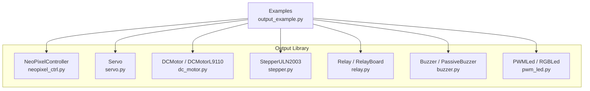
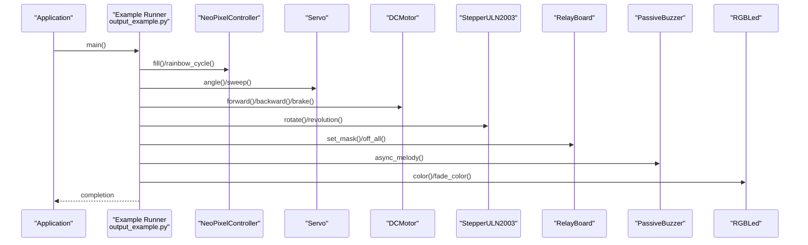
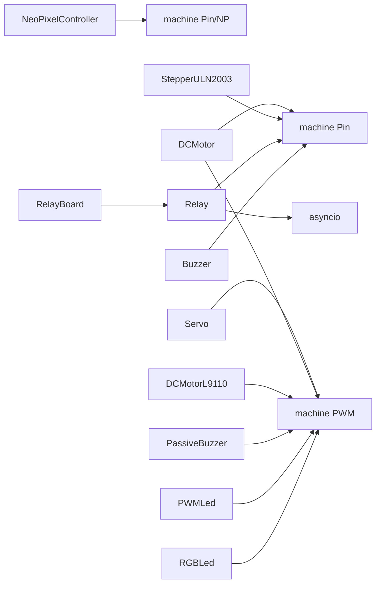

# Output API

<cite>
**Referenced Files in This Document**
- [neopixel_ctrl.py](file://src/lib/output/neopixel_ctrl.py)
- [servo.py](file://src/lib/output/servo.py)
- [dc_motor.py](file://src/lib/output/dc_motor.py)
- [stepper.py](file://src/lib/output/stepper.py)
- [relay.py](file://src/lib/output/relay.py)
- [buzzer.py](file://src/lib/output/buzzer.py)
- [pwm_led.py](file://src/lib/output/pwm_led.py)
- [output_example.py](file://src/main/examples/output_example.py)
- [README.md](file://src/lib/output/README.md)
</cite>

## Table of Contents
1. [Introduction](#introduction)
2. [Project Structure](#project-structure)
3. [Core Components](#core-components)
4. [Architecture Overview](#architecture-overview)
5. [Detailed Component Analysis](#detailed-component-analysis)
6. [Dependency Analysis](#dependency-analysis)
7. [Performance Considerations](#performance-considerations)
8. [Troubleshooting Guide](#troubleshooting-guide)
9. [Conclusion](#conclusion)

## Introduction
This document provides comprehensive API documentation for output control modules targeting ESP32-class devices with MicroPython. It covers LED control (Neopixel, PWM LEDs), motor control (Servo, Stepper drivers), audio systems (Buzzer, Passive Buzzer), and relay control. For each output type, you will find method signatures, parameter ranges, timing specifications, safety considerations, and practical usage examples. Integration with sensor feedback systems, multi-output coordination, sequencing operations, and emergency shutdown procedures are also addressed to ensure safe and reliable operation.

## Project Structure
The output control modules are organized under the output library with dedicated classes per actuator type. Example usage is provided in the main examples directory.

**Diagram sources**
- [neopixel_ctrl.py:14-147](file://src/lib/output/neopixel_ctrl.py#L14-L147)
- [servo.py:12-120](file://src/lib/output/servo.py#L12-L120)
- [dc_motor.py:12-154](file://src/lib/output/dc_motor.py#L12-L154)
- [stepper.py:42-121](file://src/lib/output/stepper.py#L42-L121)
- [relay.py:13-170](file://src/lib/output/relay.py#L13-L170)
- [buzzer.py:25-297](file://src/lib/output/buzzer.py#L25-L297)
- [pwm_led.py:13-140](file://src/lib/output/pwm_led.py#L13-L140)
- [output_example.py:14-251](file://src/main/examples/output_example.py#L14-L251)

**Section sources**
- [README.md:1-1322](file://src/lib/output/README.md#L1-L1322)
- [output_example.py:14-251](file://src/main/examples/output_example.py#L14-L251)

## Core Components
- NeoPixelController: Controls WS2812/SK6812 strips via GPIO with brightness scaling and built-in animations.
- Servo: PWM-based RC servo control with angle limits and sweep capabilities.
- DCMotor / DCMotorL9110: H-bridge controlled DC motors supporting forward/backward, coast/brake, and speed control.
- StepperULN2003: 28BYJ-48 geared stepper via ULN2003 with half/full step modes and precise rotation control.
- Relay / RelayBoard: GPIO-controlled relays supporting single and multi-channel boards with timing and masking.
- Buzzer / PassiveBuzzer: Active and passive piezo sound generation with tone, melody, pattern, and async APIs.
- PWMLed / RGBLed: PWM-controlled single and RGB LEDs with brightness, fading, blinking, and color transitions.

**Section sources**
- [neopixel_ctrl.py:14-147](file://src/lib/output/neopixel_ctrl.py#L14-L147)
- [servo.py:12-120](file://src/lib/output/servo.py#L12-L120)
- [dc_motor.py:12-154](file://src/lib/output/dc_motor.py#L12-L154)
- [stepper.py:42-121](file://src/lib/output/stepper.py#L42-L121)
- [relay.py:13-170](file://src/lib/output/relay.py#L13-L170)
- [buzzer.py:25-297](file://src/lib/output/buzzer.py#L25-L297)
- [pwm_led.py:13-140](file://src/lib/output/pwm_led.py#L13-L140)

## Architecture Overview
The output modules expose synchronous and asynchronous APIs suitable for real-time control and automation. Timing-sensitive operations rely on MicroPython’s machine.PWM and precise sleep/delay mechanisms. Multi-output coordination is achieved through asyncio tasks and shared timing control.

**Diagram sources**
- [output_example.py:14-251](file://src/main/examples/output_example.py#L14-L251)
- [neopixel_ctrl.py:65-91](file://src/lib/output/neopixel_ctrl.py#L65-L91)
- [servo.py:62-111](file://src/lib/output/servo.py#L62-L111)
- [dc_motor.py:63-93](file://src/lib/output/dc_motor.py#L63-L93)
- [stepper.py:104-120](file://src/lib/output/stepper.py#L104-L120)
- [relay.py:144-163](file://src/lib/output/relay.py#L144-L163)
- [buzzer.py:297-350](file://src/lib/output/buzzer.py#L297-L350)
- [pwm_led.py:140-140](file://src/lib/output/pwm_led.py#L140-L140)

## Detailed Component Analysis

### NeoPixelController
- Purpose: Control WS2812/SK6812 LED strips with brightness scaling and animations.
- Constructor parameters:
  - pin: GPIO pin number
  - num_pixels: number of LEDs on the strip
  - brightness: float 0.0–1.0
  - bpp: bytes per pixel (3 for RGB, 4 for RGBW)
- Methods and properties:
  - set(index, r, g, b, w=0): set a single pixel color
  - show(): update LEDs
  - fill(r, g, b, w=0): fill all pixels
  - clear(): turn all off
  - set_range(start, end, r, g, b): set a range of pixels
  - set_brightness(val): adjust global brightness
  - rainbow_cycle(wait_ms, cycles): animated rainbow effect
  - color_wipe(r, g, b, wait_ms): theater-style wipe
  - theater_chase(r, g, b, wait_ms, cycles): chase pattern
  - from_hsv(h, s, v): static conversion from HSV to RGB
- Timing and safety:
  - Uses internal write mechanism; brightness scaling applied before writes.
  - No explicit timing parameters exposed; animations use millisecond sleeps internally.
  - Power: 5V recommended; avoid sourcing from 3.3V pins for multiple LEDs.
- Usage examples:
  - Basic color fill and wipe
  - Rainbow cycling and HSV-based pixel coloring
  - Clearing and showing

**Section sources**
- [neopixel_ctrl.py:30-91](file://src/lib/output/neopixel_ctrl.py#L30-L91)
- [neopixel_ctrl.py:114-147](file://src/lib/output/neopixel_ctrl.py#L114-L147)
- [output_example.py:14-38](file://src/main/examples/output_example.py#L14-L38)
- [README.md:37-124](file://src/lib/output/README.md#L37-L124)

### Servo
- Purpose: Control RC servo motors via PWM with angle limits and sweep.
- Constructor parameters:
  - pin: GPIO pin (PWM capable)
  - freq: PWM frequency in Hz (default 50)
  - min_us: minimum pulse width in microseconds (default 500)
  - max_us: maximum pulse width in microseconds (default 2500)
  - min_angle: minimum angle in degrees (default -90)
  - max_angle: maximum angle in degrees (default 90)
- Methods and properties:
  - angle(deg): move to a specific angle clamped to configured limits
  - pulse_us(us): set pulse width directly (clamped)
  - current_angle: property returning last commanded angle
  - center(): move to center position
  - sweep(start, end, step, delay_ms): oscillate between angles
  - off(): disable PWM output
  - deinit(): release PWM resources
- Timing and safety:
  - Frequency defaults to 50 Hz; pulse width mapped to duty cycle.
  - Angle limits enforced; out-of-range values are clamped.
  - Power: Dedicated 5V supply recommended; do not power servo from MCU pin.
- Usage examples:
  - Move to extreme angles, sweep, center, and off

**Section sources**
- [servo.py:33-86](file://src/lib/output/servo.py#L33-L86)
- [servo.py:92-119](file://src/lib/output/servo.py#L92-L119)
- [output_example.py:43-56](file://src/main/examples/output_example.py#L43-L56)
- [README.md:126-211](file://src/lib/output/README.md#L126-L211)

### DCMotor and DCMotorL9110
- Purpose: Drive DC motors through H-bridges with speed and direction control.
- DCMotor constructor parameters:
  - pwm_pin: enable/control pin (PWM)
  - in1_pin: direction control 1
  - in2_pin: direction control 2
  - freq: PWM frequency (default 1000)
  - min_duty: minimum duty threshold to prevent motor stalls (default 0–100)
- DCMotorL9110 constructor parameters:
  - ia_pin: forward PWM
  - ib_pin: backward PWM
  - freq: PWM frequency (default 1000)
- Methods:
  - forward(speed 0–100)
  - backward(speed 0–100)
  - stop(): coast (no braking)
  - brake(): short brake (fast stop)
  - speed(pct): change speed without altering direction
  - current_speed: property returning last set percentage
  - deinit(): release PWM and pins
- Safety and power:
  - Flyback diodes recommended across motors.
  - Minimum duty threshold prevents stalled motors at low speeds.
- Usage examples:
  - Forward/backward movement, stop/brake, deinit

**Section sources**
- [dc_motor.py:34-106](file://src/lib/output/dc_motor.py#L34-L106)
- [dc_motor.py:130-153](file://src/lib/output/dc_motor.py#L130-L153)
- [output_example.py:62-74](file://src/main/examples/output_example.py#L62-L74)
- [README.md:213-312](file://src/lib/output/README.md#L213-L312)

### StepperULN2003
- Purpose: Control 28BYJ-48 geared stepper via ULN2003 with half/full step modes.
- Constructor parameters:
  - pins: list of 4 GPIO pins [IN1, IN2, IN3, IN4]
  - half_step: enable half-step mode for finer resolution (default True)
  - delay_us: delay between steps in microseconds (default 1200)
- Methods:
  - steps(count, direction): rotate by a number of steps
  - rotate(degrees, direction): rotate by angle using step-per-revolution constants
  - revolution(turns, direction): rotate full turns
- Specifications:
  - Half-step: 4096 steps/revolution
  - Full-step: 2048 steps/revolution
- Safety:
  - Minimum delay around 1000 µs recommended for 28BYJ-48 motors.
- Usage examples:
  - Rotate 360 degrees clockwise and counterclockwise

**Section sources**
- [stepper.py:68-120](file://src/lib/output/stepper.py#L68-L120)
- [output_example.py:80-87](file://src/main/examples/output_example.py#L80-L87)
- [README.md:314-366](file://src/lib/output/README.md#L314-L366)

### Relay and RelayBoard
- Purpose: Switch loads via GPIO-controlled relays with support for single and multi-channel boards.
- Relay constructor parameters:
  - pin: GPIO pin
  - active_low: True for active-low modules (default)
  - initial_state: initial output state (default False)
- Relay methods and properties:
  - on(), off(), toggle()
  - is_on: property indicating current state
  - timed_on(seconds): async on for a duration
  - pulse(on_seconds, off_seconds, count): async toggle pattern
- RelayBoard constructor parameters:
  - pins: list of GPIO pins for each channel
  - active_low: True for active-low modules (default)
- RelayBoard methods:
  - on(channel), off(channel), toggle(channel)
  - on_all(), off_all()
  - set_mask(mask), get_mask(), status()
- Safety:
  - Verify module polarity (active-high vs active-low) before wiring.
- Usage examples:
  - Single relay on/off and timed operation
  - Multi-channel board with bitmask control

**Section sources**
- [relay.py:33-100](file://src/lib/output/relay.py#L33-L100)
- [relay.py:114-170](file://src/lib/output/relay.py#L114-L170)
- [output_example.py:162-180](file://src/main/examples/output_example.py#L162-L180)
- [README.md:797-956](file://src/lib/output/README.md#L797-L956)

### Buzzer and PassiveBuzzer
- Purpose: Produce sounds via active buzzer (fixed tone) and passive buzzer (frequency/tone control).
- Buzzer constructor parameters:
  - pin: GPIO pin
  - active_low: whether to invert logic for module wiring (default False)
- Buzzer methods:
  - on(), off(), toggle()
  - beep(count, on_ms, off_ms)
  - async_beep(count, on_ms, off_ms)
  - pattern(pattern_list, repeat, gap_ms)
  - async_pattern(pattern_list, repeat, gap_ms)
  - morse_code(message, dot_ms, repeat)
  - async_morse_code(message, dot_ms, repeat)
  - alarm_sequence(stages, base_freq_ms, increment_ms, repeat)
  - async_alarm_sequence(stages, base_freq_ms, increment_ms, repeat)
- PassiveBuzzer constructor parameters:
  - pin: GPIO pin (PWM required)
  - default_volume: initial volume scale (0–65535)
- PassiveBuzzer methods:
  - tone(freq, duration_ms)
  - note(name, duration_ms)
  - melody(notes, gap_ms, repeat, volume)
  - async_melody(notes, gap_ms, repeat, volume)
  - set_volume(volume)
  - pattern_melody(patterns, gap_ms, repeat)
  - async_pattern_melody(patterns, gap_ms, repeat)
  - deinit()
- Audio specifications:
  - Tone generation uses PWM; note names supported include standard octaves.
- Usage examples:
  - Active buzzer beep and pattern playback
  - Passive buzzer melody and volume control

**Section sources**
- [buzzer.py:25-120](file://src/lib/output/buzzer.py#L25-L120)
- [buzzer.py:297-350](file://src/lib/output/buzzer.py#L297-L350)
- [output_example.py:185-200](file://src/main/examples/output_example.py#L185-L200)
- [README.md:899-1067](file://src/lib/output/README.md#L899-L1067)

### PWMLed and RGBLed
- Purpose: Control brightness and color of LEDs via PWM with smooth transitions.
- PWMLed constructor parameters:
  - pin: GPIO pin (PWM)
  - freq: PWM frequency (default 1000)
  - invert: invert logic for active-low circuits (default False)
- PWMLed methods and properties:
  - brightness(val 0–100)
  - on(), off()
  - current_brightness: property
  - fade(target, step, delay_ms)
  - fade_in(duration_ms), fade_out(duration_ms)
  - blink(on_ms, off_ms, count)
  - breathe(period_ms)
  - deinit()
- RGBLed constructor parameters:
  - r_pin, g_pin, b_pin: individual PWM pins
  - invert: invert logic (default False)
- RGBLed methods:
  - color(r, g, b 0–255)
  - fade_color(target_rgb, duration_ms)
- Usage examples:
  - Single LED on/off/fade/blink
  - RGB status indicators and color transitions

**Section sources**
- [pwm_led.py:13-117](file://src/lib/output/pwm_led.py#L13-L117)
- [pwm_led.py:140-140](file://src/lib/output/pwm_led.py#L140-L140)
- [output_example.py:206-227](file://src/main/examples/output_example.py#L206-L227)
- [README.md:1069-1178](file://src/lib/output/README.md#L1069-L1178)

## Dependency Analysis
- Internal dependencies:
  - All modules depend on MicroPython’s machine and time primitives for PWM and delays.
  - NeoPixelController uses the onboard neopixel module for efficient bit-banging.
  - Relay and RelayBoard use asyncio for timed operations.
- External integration:
  - Audio output relies on PWM-capable pins; ensure no conflicts with other PWM users.
  - Stepper drivers (A4988, TMC2xxx, DRV8825, TMC5160) are documented separately and require distinct wiring and protocols.
- Coupling and cohesion:
  - Each module encapsulates its hardware interface tightly, minimizing cross-module coupling.
  - Shared timing and PWM resources are managed per-instance.

**Diagram sources**
- [neopixel_ctrl.py:38-42](file://src/lib/output/neopixel_ctrl.py#L38-L42)
- [servo.py:47-56](file://src/lib/output/servo.py#L47-L56)
- [dc_motor.py:45-51](file://src/lib/output/dc_motor.py#L45-L51)
- [stepper.py:74-80](file://src/lib/output/stepper.py#L74-L80)
- [relay.py:40-48](file://src/lib/output/relay.py#L40-L48)
- [buzzer.py:25-35](file://src/lib/output/buzzer.py#L25-L35)
- [pwm_led.py:13-20](file://src/lib/output/pwm_led.py#L13-L20)

**Section sources**
- [neopixel_ctrl.py:9-11](file://src/lib/output/neopixel_ctrl.py#L9-L11)
- [servo.py:9-10](file://src/lib/output/servo.py#L9-L10)
- [dc_motor.py:9-10](file://src/lib/output/dc_motor.py#L9-L10)
- [stepper.py:17-18](file://src/lib/output/stepper.py#L17-L18)
- [relay.py:9-10](file://src/lib/output/relay.py#L9-L10)
- [buzzer.py:25-25](file://src/lib/output/buzzer.py#L25-L25)
- [pwm_led.py:13-13](file://src/lib/output/pwm_led.py#L13-L13)

## Performance Considerations
- PWM resource sharing:
  - ESP32-C3 supports PWM on all GPIOs, but timers are shared. Avoid conflicting multiple high-frequency PWM peripherals.
- Timing precision:
  - Use microsecond delays for steppers and precise LED effects; ensure adequate CPU headroom for asyncio tasks.
- Thermal and power:
  - Motors and steppers draw significant current; use appropriate power supplies and external drivers with heat sinking.
  - NeoPixels consume substantial current; power from external 5V supply and limit per-pin sourcing from MCU.
- Audio quality:
  - Choose PWM frequencies that minimize audible noise; avoid harmonics near human hearing range.
- Coordination:
  - Use asyncio tasks for concurrent control of multiple actuators; synchronize via shared timing or event loops.

[No sources needed since this section provides general guidance]

## Troubleshooting Guide
- Servo does not move:
  - Verify dedicated 5V power supply and correct wiring; confirm angle limits and pulse width parameters.
- Stepper vibration or stalling:
  - Increase delay_us for 28BYJ-48; ensure gear ratio and step mode are appropriate.
- Relay not switching:
  - Check module polarity (active-high vs active-low) and wiring; confirm GPIO direction and pull-up/down resistors.
- NeoPixels flicker or fail:
  - Use 5V power; add series resistors; ensure level shifting if needed; reduce brightness or number of LEDs.
- Buzzer produces no sound:
  - Confirm PWM-capable pin assignment for passive buzzer; verify volume and frequency settings.
- Emergency shutdown:
  - Call off() for servo, brake() for DC motor, off_all() for relay board, and deinit() for PWM-based devices to release resources safely.

**Section sources**
- [README.md:1313-1322](file://src/lib/output/README.md#L1313-L1322)
- [servo.py:113-119](file://src/lib/output/servo.py#L113-L119)
- [dc_motor.py:89-93](file://src/lib/output/dc_motor.py#L89-L93)
- [relay.py:139-142](file://src/lib/output/relay.py#L139-L142)
- [pwm_led.py:117-117](file://src/lib/output/pwm_led.py#L117-L117)

## Conclusion
The output control modules provide robust, easy-to-use APIs for LEDs, servos, steppers, relays, buzzers, and PWM-controlled lights. By adhering to the documented parameter ranges, timing guidelines, and safety practices—especially around power delivery and PWM conflicts—you can build reliable automation and control systems. Combine these modules with sensor feedback and asyncio-based sequencing to achieve sophisticated, responsive behavior.