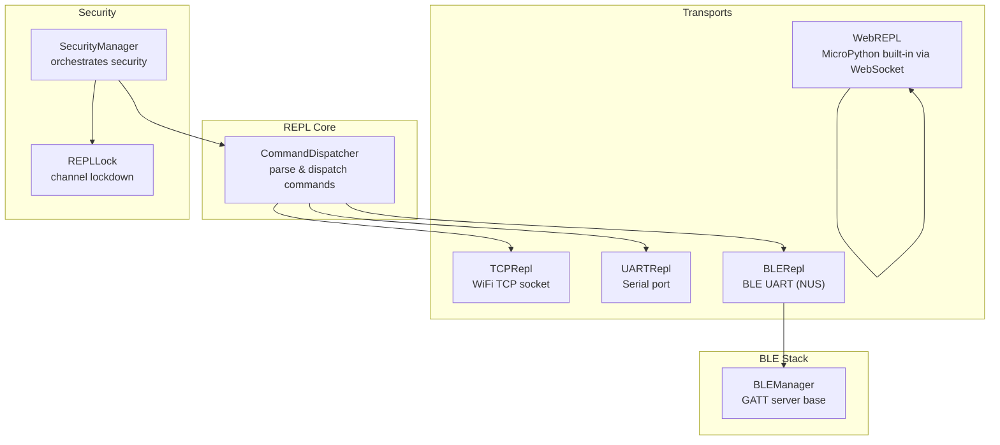
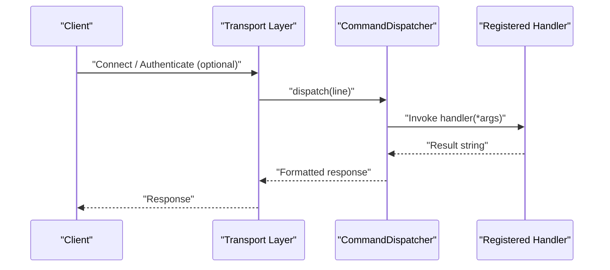
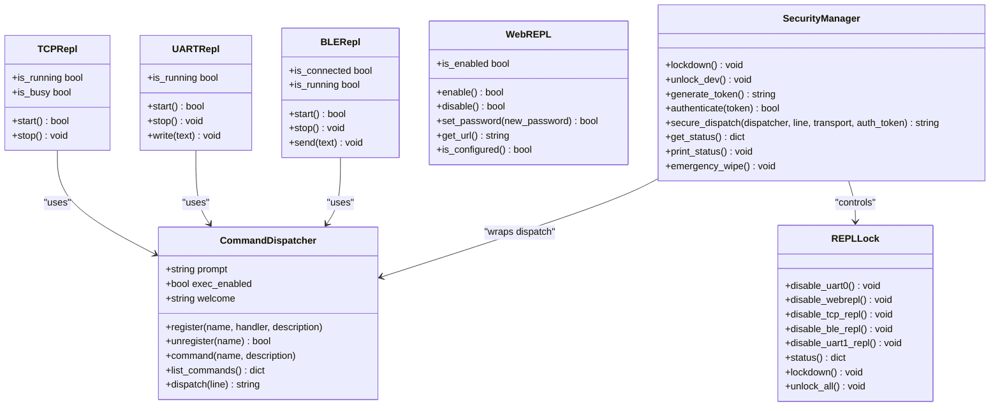
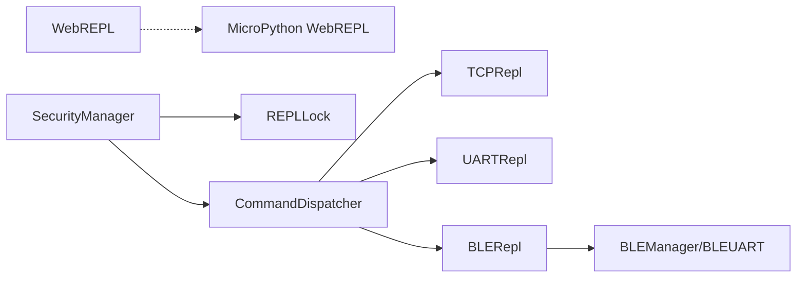

# REPL API

<cite>
**Referenced Files in This Document**
- [__init__.py](file://src/lib/repl/__init__.py)
- [command_dispatcher.py](file://src/lib/repl/command_dispatcher.py)
- [tcp_repl.py](file://src/lib/repl/tcp_repl.py)
- [uart_repl.py](file://src/lib/repl/uart_repl.py)
- [ble_repl.py](file://src/lib/repl/ble_repl.py)
- [web_repl.py](file://src/lib/repl/web_repl.py)
- [repl_example.py](file://src/main/examples/repl_example.py)
- [repl_lock.py](file://src/lib/security/repl_lock.py)
- [security_manager.py](file://src/lib/security/security_manager.py)
- [blemanager.py](file://src/lib/ble/blemanager.py)
</cite>

## Table of Contents
1. [Introduction](#introduction)
2. [Project Structure](#project-structure)
3. [Core Components](#core-components)
4. [Architecture Overview](#architecture-overview)
5. [Detailed Component Analysis](#detailed-component-analysis)
6. [Dependency Analysis](#dependency-analysis)
7. [Performance Considerations](#performance-considerations)
8. [Troubleshooting Guide](#troubleshooting-guide)
9. [Conclusion](#conclusion)
10. [Appendices](#appendices)

## Introduction
This document provides comprehensive API documentation for the Remote Python REPL modules in the project. It covers the command dispatcher and four REPL transports: TCP REPL, UART REPL, BLE REPL, and Web REPL. For each transport, you will find:
- Connection establishment and lifecycle
- Command execution and dispatch
- Session management and status
- Security controls and authentication
- Return values and behavior
- Usage examples for remote debugging, over-the-air development, and multi-transport access
- REPL-specific configurations, authentication methods, command filtering, and integration with development workflows
- Security, access control, and production deployment considerations

## Project Structure
The REPL subsystem resides under src/lib/repl and integrates with transport-specific modules and security utilities.

**Diagram sources**
- [__init__.py:1-6](file://src/lib/repl/__init__.py#L1-L6)
- [command_dispatcher.py:22-212](file://src/lib/repl/command_dispatcher.py#L22-L212)
- [tcp_repl.py:26-154](file://src/lib/repl/tcp_repl.py#L26-L154)
- [uart_repl.py:32-162](file://src/lib/repl/uart_repl.py#L32-L162)
- [ble_repl.py:37-185](file://src/lib/repl/ble_repl.py#L37-L185)
- [web_repl.py:41-187](file://src/lib/repl/web_repl.py#L41-L187)
- [repl_lock.py:29-227](file://src/lib/security/repl_lock.py#L29-L227)
- [security_manager.py:25-323](file://src/lib/security/security_manager.py#L25-L323)
- [blemanager.py:55-691](file://src/lib/ble/blemanager.py#L55-L691)

**Section sources**
- [__init__.py:1-6](file://src/lib/repl/__init__.py#L1-L6)
- [repl_example.py:1-392](file://src/main/examples/repl_example.py#L1-L392)

## Core Components
- CommandDispatcher: Parses user input and dispatches to registered handlers. Provides built-in commands (help, mem, gc, echo) and optional raw exec mode.
- Transport modules: TCPRepl, UARTRepl, BLERepl, WebREPL. Each wraps a CommandDispatcher and manages transport-specific IO, sessions, and security.
- Security modules: REPLLock and SecurityManager coordinate lockdown, authentication, auditing, and secrets.

Key capabilities:
- Structured command dispatch with help, memory reporting, and garbage collection.
- Optional raw exec mode guarded by exec_enabled flag.
- Built-in authentication for TCP and BLE transports.
- BLE fragmentation for long responses constrained by MTU.
- WebREPL wrapper around MicroPython’s built-in WebREPL.

**Section sources**
- [command_dispatcher.py:22-212](file://src/lib/repl/command_dispatcher.py#L22-L212)
- [tcp_repl.py:26-154](file://src/lib/repl/tcp_repl.py#L26-L154)
- [uart_repl.py:32-162](file://src/lib/repl/uart_repl.py#L32-L162)
- [ble_repl.py:37-185](file://src/lib/repl/ble_repl.py#L37-L185)
- [web_repl.py:41-187](file://src/lib/repl/web_repl.py#L41-L187)
- [repl_lock.py:29-227](file://src/lib/security/repl_lock.py#L29-L227)
- [security_manager.py:25-323](file://src/lib/security/security_manager.py#L25-L323)

## Architecture Overview
The transports share a single CommandDispatcher. Each transport:
- Establishes a session/connection
- Optionally authenticates
- Receives input lines
- Dispatches to CommandDispatcher
- Sends formatted responses back to the client

**Diagram sources**
- [command_dispatcher.py:111-152](file://src/lib/repl/command_dispatcher.py#L111-L152)
- [tcp_repl.py:118-134](file://src/lib/repl/tcp_repl.py#L118-L134)
- [uart_repl.py:135-141](file://src/lib/repl/uart_repl.py#L135-L141)
- [ble_repl.py:138-143](file://src/lib/repl/ble_repl.py#L138-L143)

## Detailed Component Analysis

### CommandDispatcher
Responsibilities:
- Register/unregister commands and decorators
- Parse input lines into command and arguments
- Dispatch to handlers and format responses
- Provide built-in commands (help, mem, gc, echo)
- Optional raw exec mode (exec_enabled)

Methods and behaviors:
- register(name, handler, description): Registers a command handler.
- unregister(name): Removes a command.
- command(name, description): Decorator shorthand for registration.
- list_commands(): Returns {name: description}.
- dispatch(line): Parses and executes, returning formatted response with prompt.
- Built-in commands:
  - help: Lists commands and optionally mentions exec availability.
  - mem: Reports memory stats.
  - gc: Runs garbage collection and reports freed bytes.
  - echo: Echoes input text.
- exec handling:
  - Enabled only when exec_enabled is True.
  - Executes arbitrary code in an isolated global namespace.
  - Returns OK or error messages.

Return values:
- dispatch returns a string containing the result and prompt.
- Built-in commands return formatted status strings.
- exec returns OK on success or error message.

Usage examples:
- See examples in repl_example.py for registering commands and testing dispatch.

**Section sources**
- [command_dispatcher.py:22-212](file://src/lib/repl/command_dispatcher.py#L22-L212)
- [repl_example.py:31-76](file://src/main/examples/repl_example.py#L31-L76)

### TCPRepl
Responsibilities:
- Serve a single TCP client over WiFi.
- Optional password authentication.
- Manage session lifecycle and timeouts.

Key methods and properties:
- start(): Starts the TCP server; returns a boolean success indicator.
- stop(): Stops the server.
- is_running: Property indicating server activity.
- is_busy: Property indicating client presence.

Connection and authentication:
- Binds to host/port; accepts one client at a time.
- Optional password challenge at connection start.
- Welcome banner sent after successful auth.
- Reads lines with a timeout; sends responses encoded as UTF-8.

Return values:
- start returns True on success, False on failure.
- stop returns None.
- is_running/is_busy return booleans.

Security controls:
- Optional password protects access.
- Single-client constraint limits resource usage.

Usage examples:
- See repl_example.py for WiFi setup, dispatcher registration, and TCP REPL startup.

**Section sources**
- [tcp_repl.py:26-154](file://src/lib/repl/tcp_repl.py#L26-L154)
- [repl_example.py:82-165](file://src/main/examples/repl_example.py#L82-L165)

### UARTRepl
Responsibilities:
- Provide REPL over a serial UART.
- Line editing support (basic backspace).
- Non-blocking read loop using asyncio.

Key methods and properties:
- start(): Initializes UART and starts read loop; returns boolean success.
- stop(): Deinitializes UART and clears buffers.
- write(text): Writes text directly to UART (for async pushes).
- is_running: Indicates operational status.

Connection and session:
- Uses asyncio non-blocking reads with small chunks.
- Supports basic line editing (backspace) and local echo.
- Sends welcome banner on start.

Return values:
- start returns True on success, False otherwise.
- stop returns None.
- write returns None.

Security controls:
- No built-in authentication; rely on physical access control and lockdown.

Usage examples:
- See repl_example.py for UART wiring, dispatcher registration, and startup.

**Section sources**
- [uart_repl.py:32-162](file://src/lib/repl/uart_repl.py#L32-L162)
- [repl_example.py:171-241](file://src/main/examples/repl_example.py#L171-L241)

### BLERepl
Responsibilities:
- Provide REPL over BLE using Nordic UART Service (NUS).
- Fragment long responses to fit BLE MTU (20 bytes).
- Manage BLE advertising and connection.

Key methods and properties:
- start(): Starts BLE advertising and sets up callbacks; returns boolean success.
- stop(): Clears callbacks and stops.
- send(text): Pushes unsolicited text to client.
- is_connected: Indicates client connection status.
- is_running: Indicates advertising/connected state.

Connection and session:
- Uses BLEUART from blemanager.py; sets tx_callback to receive data.
- Accumulates input until newline delimiter and dispatches.
- Splits responses into MTU-sized chunks and writes via BLEUART.

Return values:
- start returns True on success, False otherwise.
- stop returns None.
- send returns None.
- is_connected/is_running return booleans.

Security controls:
- No built-in authentication; rely on transport lockdown and token-based access via SecurityManager.

Usage examples:
- See repl_example.py for BLE device naming, dispatcher registration, and startup.

**Section sources**
- [ble_repl.py:37-185](file://src/lib/repl/ble_repl.py#L37-L185)
- [blemanager.py:387-474](file://src/lib/ble/blemanager.py#L387-L474)
- [repl_example.py:247-299](file://src/main/examples/repl_example.py#L247-L299)

### WebREPL
Responsibilities:
- Wrap MicroPython’s built-in WebREPL over WebSocket.
- Enable/disable server and manage password.
- Provide URL discovery.

Key methods and properties:
- enable(): Writes config and starts WebREPL; returns boolean success.
- disable(): Stops WebREPL; returns boolean success.
- set_password(new_password): Changes password and restarts if enabled.
- get_url(): Returns WebSocket URL ws://IP:8266.
- is_configured(): Checks presence of webrepl config file.
- is_enabled: Indicates server status.

Connection and session:
- Requires WiFi connectivity.
- Uses fixed port 8266.
- Password enforced by underlying WebREPL.

Return values:
- enable/disable/set_password/get_url/is_configured/is_enabled return booleans or strings.

Security controls:
- Enforce a strong password (4–9 characters).
- Disable in production or behind secure networks.

Usage examples:
- See repl_example.py for enabling WebREPL and printing URL.

**Section sources**
- [web_repl.py:41-187](file://src/lib/repl/web_repl.py#L41-L187)
- [repl_example.py:361-368](file://src/main/examples/repl_example.py#L361-L368)

### Security Integration
- REPLLock: Disables or enables REPL channels (UART0, WebREPL, TCP, BLE, UART1) and redirects stdout/stdin to prevent REPL usage.
- SecurityManager: Orchestrates lockdown, authentication, audit logging, and secrets. Provides secure_dispatch to gate commands with tokens.

Key methods:
- REPLLock: disable_uart0, disable_webrepl, disable_tcp_repl, disable_ble_repl, disable_uart1_repl; status, lockdown, unlock_all.
- SecurityManager: lockdown, unlock_dev, generate_token, authenticate, secure_dispatch, get_status, print_status, emergency_wipe.

Usage examples:
- See secure_production_example.py for lockdown, secrets, token auth, audit logging, and emergency wipe.

**Section sources**
- [repl_lock.py:29-227](file://src/lib/security/repl_lock.py#L29-L227)
- [security_manager.py:25-323](file://src/lib/security/security_manager.py#L25-L323)
- [repl_example.py:18-392](file://src/main/examples/repl_example.py#L18-L392)

## Architecture Overview

**Diagram sources**
- [command_dispatcher.py:22-212](file://src/lib/repl/command_dispatcher.py#L22-L212)
- [tcp_repl.py:26-154](file://src/lib/repl/tcp_repl.py#L26-L154)
- [uart_repl.py:32-162](file://src/lib/repl/uart_repl.py#L32-L162)
- [ble_repl.py:37-185](file://src/lib/repl/ble_repl.py#L37-L185)
- [web_repl.py:41-187](file://src/lib/repl/web_repl.py#L41-L187)
- [repl_lock.py:29-227](file://src/lib/security/repl_lock.py#L29-L227)
- [security_manager.py:25-323](file://src/lib/security/security_manager.py#L25-L323)

## Detailed Component Analysis

### TCP REPL API Reference
- Constructor: TCPRepl(dispatcher, host="0.0.0.0", port=8266, password=None)
- Methods:
  - start(): Asynchronously starts the server; returns True on success.
  - stop(): Stops the server gracefully.
- Properties:
  - is_running: Boolean indicating server activity.
  - is_busy: Boolean indicating a connected client.
- Behavior:
  - Accepts a single client; rejects additional connections.
  - Optional password challenge at connect.
  - Sends welcome banner; reads lines with timeout; responds with formatted output.

Return values:
- start: True on success, False on failure.
- stop: None.

Security:
- Optional password; recommended for production.

**Section sources**
- [tcp_repl.py:26-154](file://src/lib/repl/tcp_repl.py#L26-L154)

### UART REPL API Reference
- Constructor: UARTRepl(dispatcher, uart_id=1, baudrate=115200, tx=21, rx=20, timeout_ms=10, newline=b"\r\n")
- Methods:
  - start(): Initializes UART and begins read loop; returns True on success.
  - stop(): Deinitializes UART and clears buffers.
  - write(text): Writes text directly to UART.
- Properties:
  - is_running: Boolean indicating operational status.
- Behavior:
  - Non-blocking read loop; supports backspace and local echo.
  - Sends welcome banner on start.

Return values:
- start: True on success, False otherwise.
- stop: None.
- write: None.

Security:
- No built-in auth; rely on physical access control and lockdown.

**Section sources**
- [uart_repl.py:32-162](file://src/lib/repl/uart_repl.py#L32-L162)

### BLE REPL API Reference
- Constructor: BLERepl(dispatcher, name="ESP32-REPL", ble_uart=None)
- Methods:
  - start(): Starts BLE advertising and sets callbacks; returns True on success.
  - stop(): Clears callbacks and stops.
  - send(text): Pushes unsolicited text to client.
- Properties:
  - is_connected: Boolean indicating client connection.
  - is_running: Boolean indicating advertising/connected state.
- Behavior:
  - Uses BLEUART; accumulates input until newline; dispatches commands.
  - Splits responses into 20-byte chunks to respect MTU.

Return values:
- start: True on success, False otherwise.
- stop: None.
- send: None.

Security:
- No built-in auth; use token-based access via SecurityManager.

**Section sources**
- [ble_repl.py:37-185](file://src/lib/repl/ble_repl.py#L37-L185)
- [blemanager.py:387-474](file://src/lib/ble/blemanager.py#L387-L474)

### Web REPL API Reference
- Constructor: WebREPL(password="micropython")
- Methods:
  - enable(): Writes config and starts WebREPL; returns True on success.
  - disable(): Stops WebREPL; returns True on success.
  - set_password(new_password): Validates length (4–9) and restarts if enabled.
  - get_url(): Returns ws://IP:8266.
  - is_configured(): Checks presence of webrepl config file.
  - is_enabled: Boolean indicating server status.
- Behavior:
  - Requires WiFi connectivity.
  - Fixed port 8266.

Return values:
- enable/disable/set_password/get_url/is_configured/is_enabled return booleans or strings.

Security:
- Enforce a strong password; disable in production.

**Section sources**
- [web_repl.py:41-187](file://src/lib/repl/web_repl.py#L41-L187)

### CommandDispatcher API Reference
- Constructor: CommandDispatcher(prompt="esp32> ", exec_enabled=False, welcome=None)
- Methods:
  - register(name, handler, description)
  - unregister(name) -> bool
  - command(name, description) -> decorator
  - list_commands() -> dict
  - dispatch(line) -> formatted response string
- Built-in commands:
  - help, mem, gc, echo
- exec mode:
  - Controlled by exec_enabled flag.
  - Executes code in isolated globals.

Return values:
- dispatch returns a formatted string with result and prompt.
- Built-in commands return status strings.

**Section sources**
- [command_dispatcher.py:22-212](file://src/lib/repl/command_dispatcher.py#L22-L212)

### Security Integration API Reference
- REPLLock:
  - disable_uart0, disable_webrepl, disable_tcp_repl, disable_ble_repl, disable_uart1_repl
  - status() -> dict, lockdown() -> void, unlock_all() -> void
- SecurityManager:
  - lockdown() -> void, unlock_dev() -> void
  - generate_token() -> str, authenticate(token) -> bool
  - secure_dispatch(dispatcher, line, transport, auth_token) -> str
  - get_status() -> dict, print_status() -> void
  - emergency_wipe() -> void

**Section sources**
- [repl_lock.py:29-227](file://src/lib/security/repl_lock.py#L29-L227)
- [security_manager.py:25-323](file://src/lib/security/security_manager.py#L25-L323)

## Dependency Analysis

**Diagram sources**
- [__init__.py:1-6](file://src/lib/repl/__init__.py#L1-L6)
- [blemanager.py:387-474](file://src/lib/ble/blemanager.py#L387-L474)
- [web_repl.py:23-37](file://src/lib/repl/web_repl.py#L23-L37)
- [security_manager.py:19-23](file://src/lib/security/security_manager.py#L19-L23)

**Section sources**
- [__init__.py:1-6](file://src/lib/repl/__init__.py#L1-L6)
- [blemanager.py:387-474](file://src/lib/ble/blemanager.py#L387-L474)
- [web_repl.py:23-37](file://src/lib/repl/web_repl.py#L23-L37)
- [security_manager.py:19-23](file://src/lib/security/security_manager.py#L19-L23)

## Performance Considerations
- TCPRepl: Single-client design prevents resource exhaustion; uses timeouts to close idle sessions.
- UARTRepl: Non-blocking reads with small sleeps avoid blocking other tasks; buffer size limits input length.
- BLERepl: MTU fragmentation ensures reliable delivery; callbacks process incoming data incrementally.
- CommandDispatcher: Built-in commands are lightweight; exec mode disabled by default to reduce risk and overhead.
- SecurityManager: Audit logging and token management add minimal overhead; configure log sizes appropriately.

[No sources needed since this section provides general guidance]

## Troubleshooting Guide
Common issues and resolutions:
- TCPRepl fails to start:
  - Verify WiFi connectivity and port availability.
  - Check for exceptions during server creation.
- TCPRepl rejects clients:
  - Ensure only one client connects at a time.
  - Confirm password matches if enabled.
- UARTRepl does not respond:
  - Confirm UART pins and baudrate match hardware.
  - Ensure UART0 is not used by the default MicroPython REPL.
- BLERepl not visible or disconnects:
  - Confirm BLE availability and permissions.
  - Check MTU constraints; long responses are fragmented.
- WebREPL not reachable:
  - Ensure WiFi is connected and firewall allows port 8266.
  - Verify password and config file presence.
- Security lockdown concerns:
  - Use SecurityManager lockdown in production.
  - Use REPLLock to disable specific channels.
  - Use SecurityManager secure_dispatch for token-gated access.

**Section sources**
- [tcp_repl.py:55-82](file://src/lib/repl/tcp_repl.py#L55-L82)
- [uart_repl.py:68-101](file://src/lib/repl/uart_repl.py#L68-L101)
- [ble_repl.py:66-97](file://src/lib/repl/ble_repl.py#L66-L97)
- [web_repl.py:67-111](file://src/lib/repl/web_repl.py#L67-L111)
- [repl_lock.py:204-227](file://src/lib/security/repl_lock.py#L204-L227)
- [security_manager.py:125-178](file://src/lib/security/security_manager.py#L125-L178)

## Conclusion
The REPL subsystem offers flexible, secure remote access across multiple transports. Use CommandDispatcher for structured commands, and apply SecurityManager and REPLLock for production-grade access control. Integrate WebREPL for browser-based REPL and combine transports for robust development workflows.

[No sources needed since this section summarizes without analyzing specific files]

## Appendices

### Usage Examples Index
- Basic CommandDispatcher: [repl_example.py:31-76](file://src/main/examples/repl_example.py#L31-L76)
- TCP REPL (WiFi): [repl_example.py:82-165](file://src/main/examples/repl_example.py#L82-L165)
- UART REPL (Serial): [repl_example.py:171-241](file://src/main/examples/repl_example.py#L171-L241)
- BLE REPL (Bluetooth): [repl_example.py:247-299](file://src/main/examples/repl_example.py#L247-L299)
- Multi-transport REPL: [repl_example.py:305-383](file://src/main/examples/repl_example.py#L305-L383)
- Security lockdown and tokens: [secure_production_example.py:18-268](file://src/main/examples/secure_production_example.py#L18-L268)

### Security Best Practices
- Enable SecurityManager lockdown in production.
- Use strong passwords for TCP and WebREPL.
- Prefer token-based access via SecurityManager secure_dispatch.
- Disable unnecessary REPL channels with REPLLock.
- Monitor audit logs and suspicious events.

**Section sources**
- [security_manager.py:125-178](file://src/lib/security/security_manager.py#L125-L178)
- [repl_lock.py:204-227](file://src/lib/security/repl_lock.py#L204-L227)
- [web_repl.py:62-64](file://src/lib/repl/web_repl.py#L62-L64)