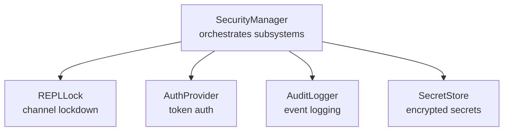
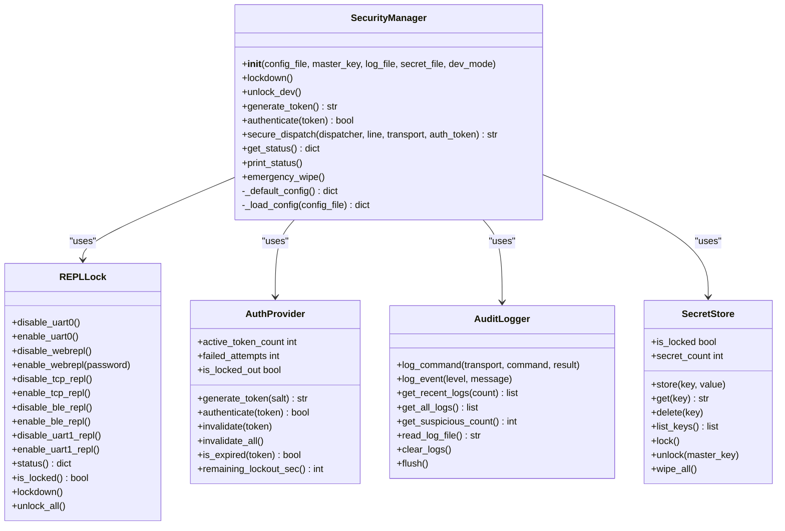
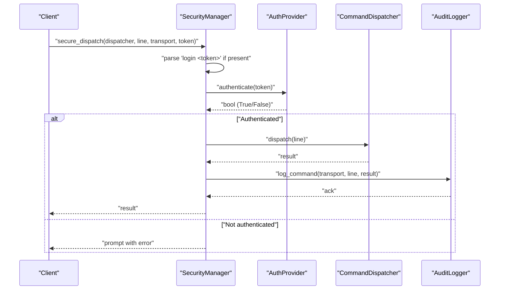
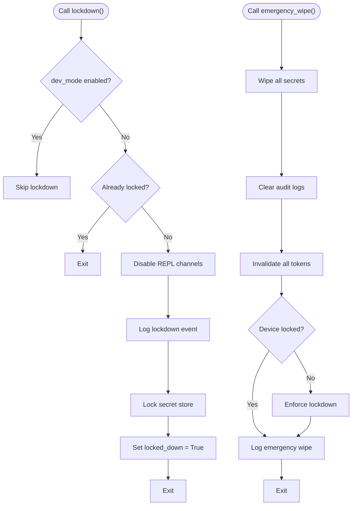
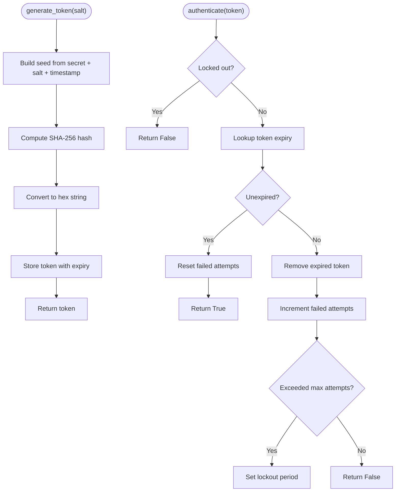
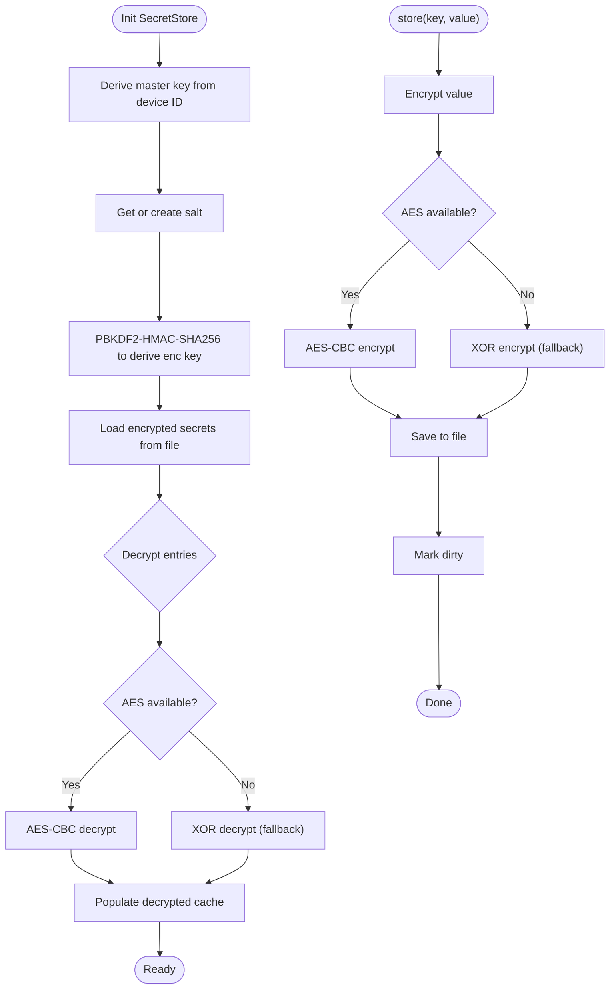
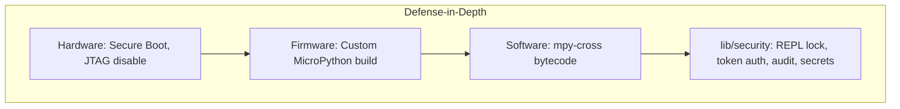
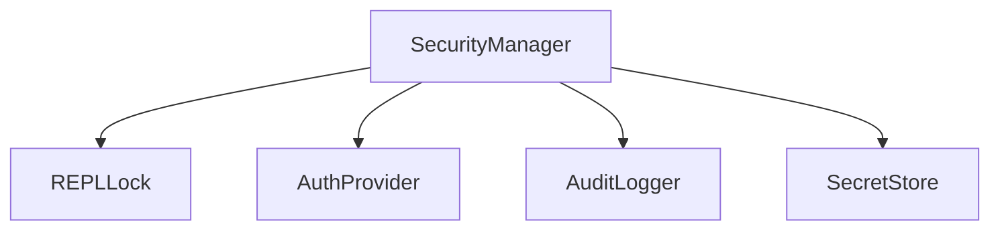

# Security API

<cite>
**Referenced Files in This Document**
- [security_manager.py](file://src/lib/security/security_manager.py)
- [repl_lock.py](file://src/lib/security/repl_lock.py)
- [auth_provider.py](file://src/lib/security/auth_provider.py)
- [audit_logger.py](file://src/lib/security/audit_logger.py)
- [secret_store.py](file://src/lib/security/secret_store.py)
- [__init__.py](file://src/lib/security/__init__.py)
- [README.md](file://src/lib/security/README.md)
- [secure_production_example.py](file://src/main/examples/secure_production_example.py)
- [boot_production.py](file://src/main/boot_production.py)
</cite>

## Table of Contents
1. [Introduction](#introduction)
2. [Project Structure](#project-structure)
3. [Core Components](#core-components)
4. [Architecture Overview](#architecture-overview)
5. [Detailed Component Analysis](#detailed-component-analysis)
6. [Dependency Analysis](#dependency-analysis)
7. [Performance Considerations](#performance-considerations)
8. [Troubleshooting Guide](#troubleshooting-guide)
9. [Conclusion](#conclusion)
10. [Appendices](#appendices)

## Introduction
This document provides comprehensive API documentation for the security modules designed for production-grade protection of ESP32 devices running MicroPython. It covers the central SecurityManager orchestrator and its integrated subsystems: REPLLock for access control, AuthProvider for token-based authentication, AuditLogger for security event logging, and SecretStore for encrypted secret management. The guide includes method-level documentation, return values, usage examples for production deployment, secure configuration, access control, and security monitoring. It also addresses security-specific configurations, threat mitigation, compliance considerations, and integration with network security.

## Project Structure
The security module resides under src/lib/security and exposes a cohesive API surface via the package initializer. The main orchestrator, SecurityManager, composes REPLLock, AuthProvider, AuditLogger, and SecretStore. Example scripts demonstrate production integration and boot-time lockdown.

**Diagram sources**
- [security_manager.py:25-82](file://src/lib/security/security_manager.py#L25-L82)
- [repl_lock.py:29-58](file://src/lib/security/repl_lock.py#L29-L58)
- [auth_provider.py:23-66](file://src/lib/security/auth_provider.py#L23-L66)
- [audit_logger.py:17-53](file://src/lib/security/audit_logger.py#L17-L53)
- [secret_store.py:39-78](file://src/lib/security/secret_store.py#L39-L78)

**Section sources**
- [__init__.py:11-15](file://src/lib/security/__init__.py#L11-L15)
- [README.md:1-16](file://src/lib/security/README.md#L1-L16)

## Core Components
This section documents the primary security modules and their responsibilities.

- SecurityManager: Central orchestrator that initializes and coordinates REPLLock, AuthProvider, AuditLogger, and SecretStore. Provides lockdown, token generation, authentication, secure REPL dispatch, status reporting, and emergency wipe.
- REPLLock: Controls access to REPL channels (UART0, WebREPL, TCP REPL, BLE REPL, UART1) with enable/disable operations and status reporting.
- AuthProvider: Implements token-based authentication using SHA-256-derived tokens with configurable expiry, rate limiting, lockout, and token invalidation.
- AuditLogger: Records all REPL commands and security events with FIFO buffering, suspicious pattern detection, and persistent log rotation.
- SecretStore: Stores secrets encrypted with PBKDF2-derived keys and AES-CBC (or XOR fallback), supports locking, wiping, and listing keys.

**Section sources**
- [security_manager.py:25-82](file://src/lib/security/security_manager.py#L25-L82)
- [repl_lock.py:29-58](file://src/lib/security/repl_lock.py#L29-L58)
- [auth_provider.py:23-66](file://src/lib/security/auth_provider.py#L23-L66)
- [audit_logger.py:17-53](file://src/lib/security/audit_logger.py#L17-L53)
- [secret_store.py:39-78](file://src/lib/security/secret_store.py#L39-L78)

## Architecture Overview
The SecurityManager composes and coordinates the security subsystems. It loads configuration, initializes components, enforces lockdown, and integrates authentication and auditing into REPL dispatch.

**Diagram sources**
- [security_manager.py:25-323](file://src/lib/security/security_manager.py#L25-L323)
- [repl_lock.py:29-227](file://src/lib/security/repl_lock.py#L29-L227)
- [auth_provider.py:23-257](file://src/lib/security/auth_provider.py#L23-L257)
- [audit_logger.py:17-197](file://src/lib/security/audit_logger.py#L17-L197)
- [secret_store.py:39-375](file://src/lib/security/secret_store.py#L39-L375)

## Detailed Component Analysis

### SecurityManager
SecurityManager is the central orchestrator for all security operations. It initializes subsystems, applies lockdown policies, manages tokens, audits commands, and supports emergency wipe.

Key capabilities:
- Initialization with optional configuration file, master key, log file, secret file, and development mode flag.
- Lockdown that disables REPL channels, logs the event, and optionally locks the secret store.
- Token lifecycle management: generate, authenticate, invalidate, and invalidate all.
- Secure REPL dispatch wrapper that enforces authentication and logs commands.
- Status reporting and printing for diagnostics.
- Emergency wipe to purge secrets, logs, and tokens, and enforce lockdown.

Return values:
- generate_token(): returns a 64-character hexadecimal token string.
- authenticate(token): returns True if the token is valid and unexpired.
- secure_dispatch(...): returns a response string suitable for REPL transport.
- get_status(): returns a dictionary containing locked-down state, REPL status, auth metrics, audit suspicious events, and secret store metadata.

Usage examples:
- Basic lockdown and status inspection.
- Token generation and authentication checks.
- Secure REPL dispatch wrapping a command dispatcher.
- Emergency wipe for incident response.

**Section sources**
- [security_manager.py:42-122](file://src/lib/security/security_manager.py#L42-L122)
- [security_manager.py:125-178](file://src/lib/security/security_manager.py#L125-L178)
- [security_manager.py:193-217](file://src/lib/security/security_manager.py#L193-L217)
- [security_manager.py:220-251](file://src/lib/security/security_manager.py#L220-L251)
- [security_manager.py:255-294](file://src/lib/security/security_manager.py#L255-L294)
- [security_manager.py:297-323](file://src/lib/security/security_manager.py#L297-L323)
- [secure_production_example.py:20-40](file://src/main/examples/secure_production_example.py#L20-L40)
- [secure_production_example.py:79-110](file://src/main/examples/secure_production_example.py#L79-L110)
- [secure_production_example.py:183-207](file://src/main/examples/secure_production_example.py#L183-L207)
- [secure_production_example.py:212-244](file://src/main/examples/secure_production_example.py#L212-L244)

### REPLLock
REPLLock controls access to REPL channels. It can disable/enable UART0 (MicroPython default REPL), WebREPL, TCP REPL, BLE REPL, and UART1. It maintains status per channel and supports bulk lockdown/unlock.

Key capabilities:
- Disable/enable operations for each channel.
- Status reporting and lock state verification.
- Bulk lockdown and unlock routines.

Return values:
- status(): returns a dictionary indicating lock state per channel.
- is_locked(): returns True if all channels are locked.

Usage examples:
- Individually lock specific REPL channels.
- Verify current lock status across channels.

**Section sources**
- [repl_lock.py:62-113](file://src/lib/security/repl_lock.py#L62-L113)
- [repl_lock.py:116-149](file://src/lib/security/repl_lock.py#L116-L149)
- [repl_lock.py:152-171](file://src/lib/security/repl_lock.py#L152-L171)
- [repl_lock.py:174-182](file://src/lib/security/repl_lock.py#L174-L182)
- [repl_lock.py:185-203](file://src/lib/security/repl_lock.py#L185-L203)
- [repl_lock.py:204-227](file://src/lib/security/repl_lock.py#L204-L227)
- [secure_production_example.py:189-207](file://src/main/examples/secure_production_example.py#L189-L207)

### AuthProvider
AuthProvider implements token-based authentication with SHA-256-derived tokens, configurable expiry, rate limiting, and lockout. It supports token invalidation and status queries.

Key capabilities:
- Token generation with random salt and timestamp.
- Authentication with expiry and failed attempt tracking.
- Rate limiting and lockout enforcement.
- Token invalidation and bulk invalidation.
- Status properties for active token count, failed attempts, lockout state, and remaining lockout seconds.

Return values:
- generate_token(): returns a 64-character hexadecimal token string.
- authenticate(token): returns True if the token is valid and unexpired.
- invalidate(token): no return value.
- invalidate_all(): no return value.
- is_expired(token): returns True if the token is expired or unknown.
- Properties: active_token_count, failed_attempts, is_locked_out, remaining_lockout_sec.

Usage examples:
- Generate and validate tokens.
- Monitor failed attempts and lockout state.
- Invalidate specific or all tokens.

**Section sources**
- [auth_provider.py:100-128](file://src/lib/security/auth_provider.py#L100-L128)
- [auth_provider.py:147-184](file://src/lib/security/auth_provider.py#L147-L184)
- [auth_provider.py:198-212](file://src/lib/security/auth_provider.py#L198-L212)
- [auth_provider.py:213-225](file://src/lib/security/auth_provider.py#L213-L225)
- [auth_provider.py:236-257](file://src/lib/security/auth_provider.py#L236-L257)
- [secure_production_example.py:89-110](file://src/main/examples/secure_production_example.py#L89-L110)

### AuditLogger
AuditLogger records REPL commands and security events with FIFO buffering, suspicious pattern detection, and persistent log rotation. It supports querying recent logs, counting suspicious events, clearing logs, and forcing flush to flash.

Key capabilities:
- Log command and security event entries with timestamps and transports.
- FIFO RAM buffer with periodic flushing to flash.
- Suspicious pattern detection for risky commands.
- Query recent/all logs, suspicious count, and read log file content.
- Clear logs and force flush.

Return values:
- log_command(...): no return value.
- log_event(...): no return value.
- get_recent_logs(count): returns a list of tuples representing recent log entries.
- get_all_logs(): returns a list of all buffered log entries.
- get_suspicious_count(): returns an integer count of suspicious events.
- read_log_file(): returns a string containing the log file content.
- clear_logs(): no return value.
- flush(): no return value.

Usage examples:
- Log REPL commands and security events.
- Retrieve recent logs and suspicious counts.
- Read log file content and clear logs.

**Section sources**
- [audit_logger.py:57-97](file://src/lib/security/audit_logger.py#L57-L97)
- [audit_logger.py:152-160](file://src/lib/security/audit_logger.py#L152-L160)
- [audit_logger.py:161-164](file://src/lib/security/audit_logger.py#L161-L164)
- [audit_logger.py:165-168](file://src/lib/security/audit_logger.py#L165-L168)
- [audit_logger.py:169-180](file://src/lib/security/audit_logger.py#L169-L180)
- [audit_logger.py:183-197](file://src/lib/security/audit_logger.py#L183-L197)
- [secure_production_example.py:125-151](file://src/main/examples/secure_production_example.py#L125-L151)

### SecretStore
SecretStore provides encrypted secret storage using PBKDF2-derived keys and AES-CBC encryption (with XOR fallback). It supports storing, retrieving, deleting, listing keys, locking, unlocking, and wiping all secrets.

Key capabilities:
- Key derivation from master key and salt with PBKDF2-HMAC-SHA256.
- Encryption and decryption with AES-CBC (ucryptolib) or XOR fallback.
- Persistent JSON storage of encrypted secrets.
- Locking to prevent reads/writes and clear RAM cache.
- Unlocking with optional master key rederivation.
- Wiping all secrets, files, and salts for incident response.

Return values:
- store(key, value): no return value.
- get(key): returns the plaintext value or None if locked/not found.
- delete(key): no return value.
- list_keys(): returns a list of stored key names.
- lock(): no return value.
- unlock(master_key): no return value.
- wipe_all(): no return value.
- Properties: is_locked, secret_count.

Usage examples:
- Store and retrieve secrets securely.
- List stored keys without exposing values.
- Lock and unlock the store during incident response.
- Wipe all secrets for emergency scenarios.

**Section sources**
- [secret_store.py:222-236](file://src/lib/security/secret_store.py#L222-L236)
- [secret_store.py:237-249](file://src/lib/security/secret_store.py#L237-L249)
- [secret_store.py:250-260](file://src/lib/security/secret_store.py#L250-L260)
- [secret_store.py:261-264](file://src/lib/security/secret_store.py#L261-L264)
- [secret_store.py:311-321](file://src/lib/security/secret_store.py#L311-L321)
- [secret_store.py:322-336](file://src/lib/security/secret_store.py#L322-L336)
- [secret_store.py:337-365](file://src/lib/security/secret_store.py#L337-L365)
- [secure_production_example.py:54-74](file://src/main/examples/secure_production_example.py#L54-L74)

## Architecture Overview
The following sequence diagram illustrates the secure REPL dispatch flow, integrating authentication and auditing.

**Diagram sources**
- [security_manager.py:220-251](file://src/lib/security/security_manager.py#L220-L251)
- [auth_provider.py:147-184](file://src/lib/security/auth_provider.py#L147-L184)
- [audit_logger.py:57-66](file://src/lib/security/audit_logger.py#L57-L66)

## Detailed Component Analysis

### SecurityManager lockdown and emergency wipe
The lockdown process disables all REPL channels, logs the event, and optionally locks the secret store. The emergency wipe purges secrets, clears logs, invalidates tokens, and ensures lockdown if not already active.

**Diagram sources**
- [security_manager.py:125-178](file://src/lib/security/security_manager.py#L125-L178)
- [security_manager.py:297-323](file://src/lib/security/security_manager.py#L297-L323)

**Section sources**
- [security_manager.py:125-178](file://src/lib/security/security_manager.py#L125-L178)
- [security_manager.py:297-323](file://src/lib/security/security_manager.py#L297-L323)
- [secure_production_example.py:156-178](file://src/main/examples/secure_production_example.py#L156-L178)

### AuthProvider token lifecycle
The token lifecycle includes generation, storage with expiry, authentication checks, cleanup of expired tokens, and rate limiting with lockout.

**Diagram sources**
- [auth_provider.py:100-128](file://src/lib/security/auth_provider.py#L100-L128)
- [auth_provider.py:147-184](file://src/lib/security/auth_provider.py#L147-L184)
- [auth_provider.py:185-195](file://src/lib/security/auth_provider.py#L185-L195)

**Section sources**
- [auth_provider.py:100-128](file://src/lib/security/auth_provider.py#L100-L128)
- [auth_provider.py:147-184](file://src/lib/security/auth_provider.py#L147-L184)
- [auth_provider.py:185-195](file://src/lib/security/auth_provider.py#L185-L195)

### SecretStore encryption and fallback
SecretStore derives an encryption key using PBKDF2 and attempts AES-CBC encryption. On failure or absence of ucryptolib, it falls back to XOR-based encryption.

**Diagram sources**
- [secret_store.py:82-129](file://src/lib/security/secret_store.py#L82-L129)
- [secret_store.py:132-183](file://src/lib/security/secret_store.py#L132-L183)
- [secret_store.py:267-308](file://src/lib/security/secret_store.py#L267-L308)

**Section sources**
- [secret_store.py:82-129](file://src/lib/security/secret_store.py#L82-L129)
- [secret_store.py:132-183](file://src/lib/security/secret_store.py#L132-L183)
- [secret_store.py:267-308](file://src/lib/security/secret_store.py#L267-L308)

### Conceptual Overview
The security module provides layered protection against common software-based threats while acknowledging hardware-level attacks require additional measures (Secure Boot, flash encryption, custom firmware).

[No sources needed since this diagram shows conceptual workflow, not actual code structure]

[No sources needed since this section doesn't analyze specific source files]

## Dependency Analysis
SecurityManager depends on REPLLock, AuthProvider, AuditLogger, and SecretStore. Each module encapsulates distinct responsibilities with minimal coupling.

**Diagram sources**
- [security_manager.py:19-22](file://src/lib/security/security_manager.py#L19-L22)

**Section sources**
- [security_manager.py:19-22](file://src/lib/security/security_manager.py#L19-L22)

## Performance Considerations
- Token management: AuthProvider cleans up expired tokens periodically; avoid excessive token churn to minimize overhead.
- Audit logging: FIFO buffer reduces flash writes; adjust max entries and flush frequency based on usage patterns.
- Secret storage: PBKDF2 iterations balance security and performance; tune iterations according to device capabilities.
- REPL redirection: Redirecting stdout/stdin avoids blocking but may increase GC pressure; monitor memory usage during lockdown.

[No sources needed since this section provides general guidance]

## Troubleshooting Guide
Common issues and resolutions:
- REPL remains accessible: Verify lockdown was called and dev_mode is disabled. Check REPLLock status per channel.
- Authentication failures: Confirm token validity, expiry, and rate limiting state. Use status reporting to inspect failed attempts and lockout.
- Audit logs missing: Ensure flush conditions trigger and log file permissions are valid. Use read_log_file() to verify content.
- Secrets inaccessible: Confirm secret store is unlocked and master key matches. Use wipe_all() for emergency scenarios.

**Section sources**
- [repl_lock.py:185-203](file://src/lib/security/repl_lock.py#L185-L203)
- [auth_provider.py:236-257](file://src/lib/security/auth_provider.py#L236-L257)
- [audit_logger.py:169-180](file://src/lib/security/audit_logger.py#L169-L180)
- [secret_store.py:337-365](file://src/lib/security/secret_store.py#L337-L365)

## Conclusion
The security module provides a robust, production-ready set of protections for ESP32 devices. By combining REPL lockdown, token-based authentication, comprehensive audit logging, and encrypted secret storage, it significantly mitigates common software-based threats. For environments requiring stronger hardware-level protection, consider Secure Boot, flash encryption, and custom firmware builds as part of a defense-in-depth strategy.

[No sources needed since this section summarizes without analyzing specific files]

## Appendices

### Production Deployment Checklist
- Enable lockdown during boot via SecurityManager.
- Generate and distribute short-lived tokens for administrative access.
- Configure audit logging and monitor suspicious events.
- Store sensitive secrets in SecretStore and lock after use.
- Implement emergency wipe procedure for incident response.

**Section sources**
- [boot_production.py:41-48](file://src/main/boot_production.py#L41-L48)
- [secure_production_example.py:212-244](file://src/main/examples/secure_production_example.py#L212-L244)

### Security Configuration Options
- REPL lockdown: disable specific channels as needed.
- Authentication: configure token expiry, max attempts, and lockout duration.
- Audit: set log file size limits and suspicious detection.
- Secrets: tune PBKDF2 iterations and auto-wipe behavior.

**Section sources**
- [security_manager.py:85-111](file://src/lib/security/security_manager.py#L85-L111)
- [README.md:169-193](file://src/lib/security/README.md#L169-L193)

### Compliance and Threat Mitigation Notes
- The module protects against typical software-based attacks but does not defend against hardware-level attacks without additional hardware features.
- For compliance requirements, combine software protections with Secure Boot and audit logging.

**Section sources**
- [README.md:261-357](file://src/lib/security/README.md#L261-L357)