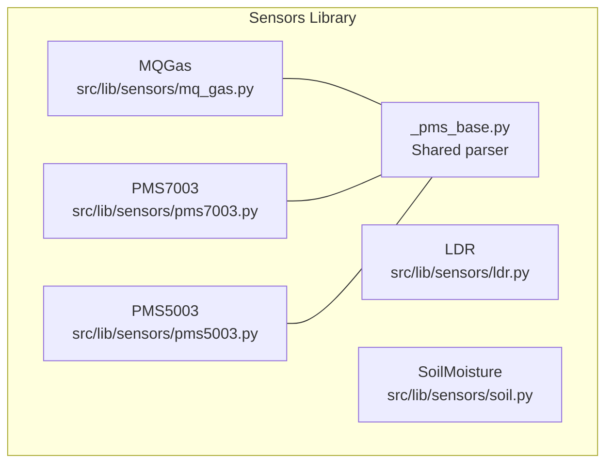
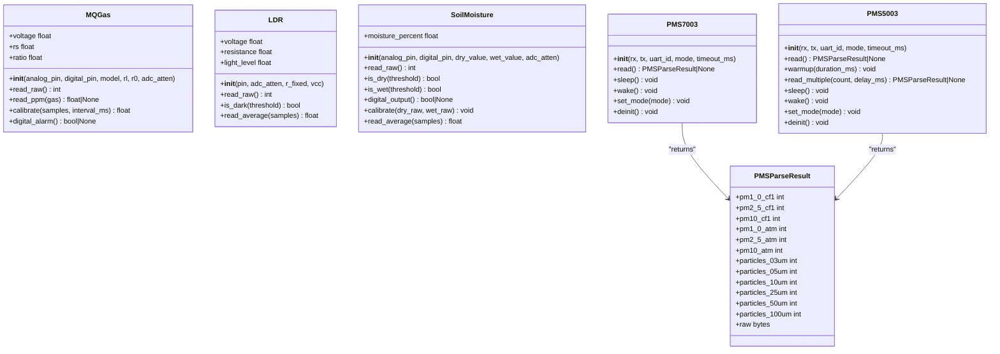
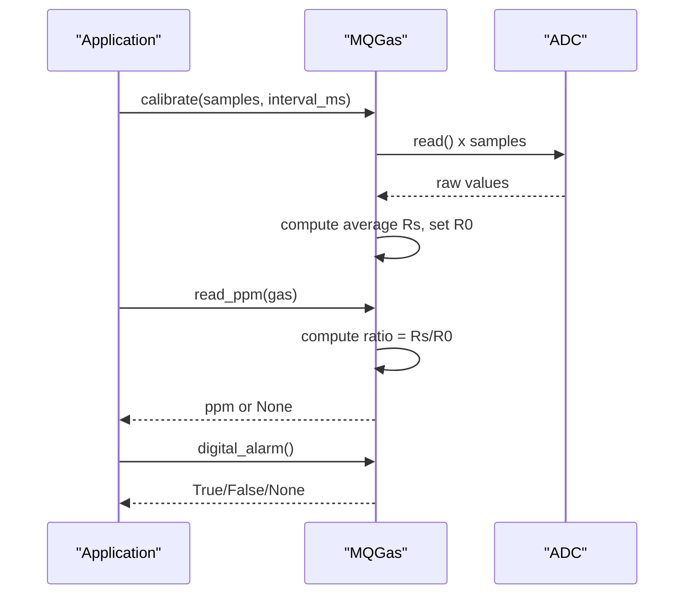
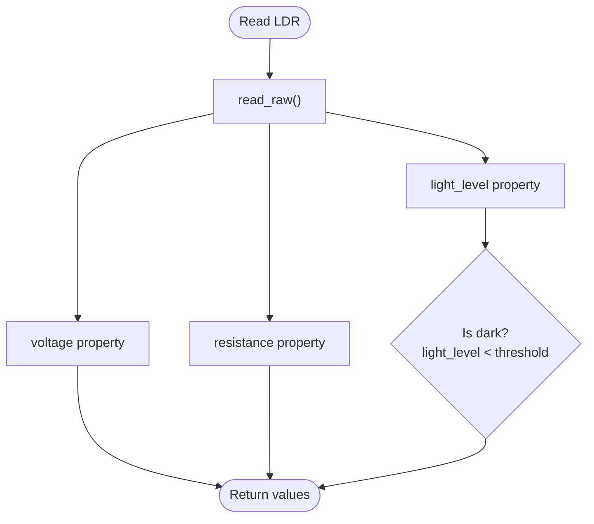
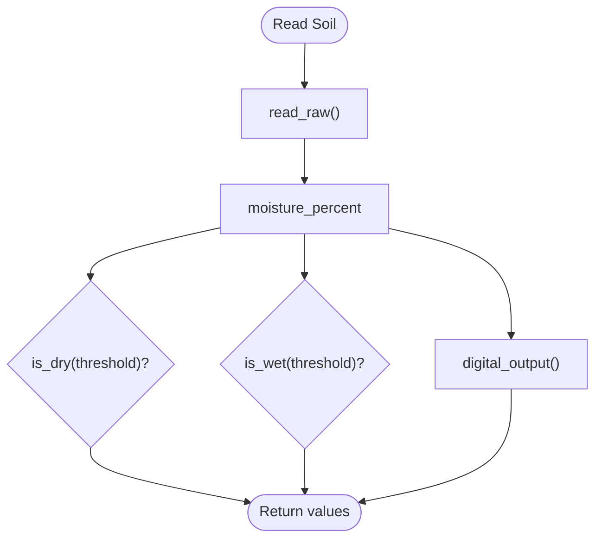
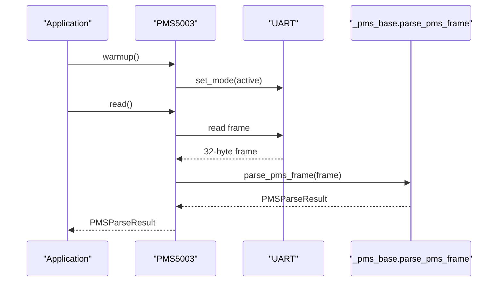
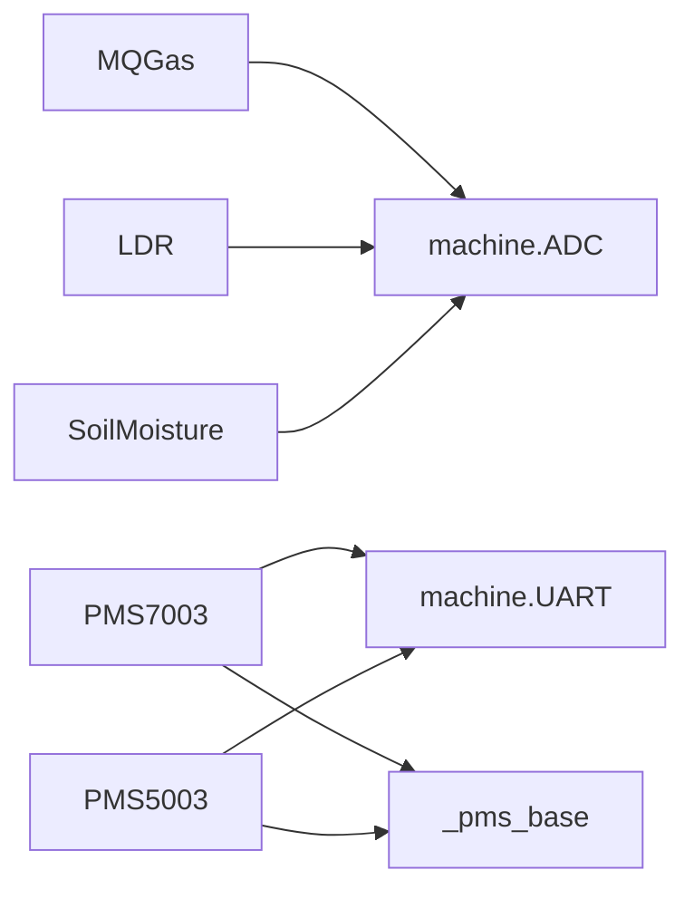

# Environmental Sensors

<cite>
**Referenced Files in This Document**
- [mq_gas.py](file://src/lib/sensors/mq_gas.py)
- [ldr.py](file://src/lib/sensors/ldr.py)
- [soil.py](file://src/lib/sensors/soil.py)
- [pms7003.py](file://src/lib/sensors/pms7003.py)
- [_pms_base.py](file://src/lib/sensors/_pms_base.py)
- [pms5003.py](file://src/lib/sensors/pms5003.py)
- [README.md](file://src/lib/sensors/README.md)
- [sensors_example.py](file://src/main/examples/sensors_example.py)
</cite>

## Table of Contents
1. [Introduction](#introduction)
2. [Project Structure](#project-structure)
3. [Core Components](#core-components)
4. [Architecture Overview](#architecture-overview)
5. [Detailed Component Analysis](#detailed-component-analysis)
6. [Dependency Analysis](#dependency-analysis)
7. [Performance Considerations](#performance-considerations)
8. [Troubleshooting Guide](#troubleshooting-guide)
9. [Conclusion](#conclusion)
10. [Appendices](#appendices)

## Introduction
This document provides comprehensive API documentation for environmental monitoring sensors implemented in the repository. It focuses on:
- MQ series gas sensors (MQ-2, MQ-135), including calibration, gas concentration calculations, and sensor warming considerations.
- Light-dependent resistor (LDR) sensors with analog-to-digital conversion and brightness estimation.
- Soil moisture sensors with calibration and moisture percentage mapping.
- PM2.5 air quality sensors (PMS7003, PMS5003), including particle counts, data frame parsing, and maintenance requirements.

For each sensor, we outline method signatures for raw readings, converted values, calibration constants, and threshold detection. We also provide practical examples for environmental monitoring stations, data logging, alert systems, and integration with weather monitoring applications.

## Project Structure
The sensor drivers are organized under src/lib/sensors/. The primary modules documented here are:
- MQ gas sensor driver
- LDR driver
- Soil moisture driver
- PM2.5 sensors (PMS7003 and PMS5003) with shared frame parser

**Diagram sources**
- [mq_gas.py:34-167](file://src/lib/sensors/mq_gas.py#L34-L167)
- [ldr.py:12-89](file://src/lib/sensors/ldr.py#L12-L89)
- [soil.py:12-120](file://src/lib/sensors/soil.py#L12-L120)
- [pms7003.py:35-200](file://src/lib/sensors/pms7003.py#L35-L200)
- [_pms_base.py:13-195](file://src/lib/sensors/_pms_base.py#L13-L195)
- [pms5003.py:43-244](file://src/lib/sensors/pms5003.py#L43-L244)

**Section sources**
- [README.md:1-800](file://src/lib/sensors/README.md#L1-L800)

## Core Components
This section summarizes the public APIs for each sensor driver, focusing on method signatures and properties.

- MQGas (MQ-2, MQ-7, MQ-135)
  - Constructor parameters: analog_pin, digital_pin, model, rl, r0, adc_atten
  - Methods and properties:
    - read_raw() -> int
    - voltage property -> float
    - rs property -> float
    - ratio property -> float
    - read_ppm(gas: str) -> float | None
    - calibrate(samples: int = 50, interval_ms: int = 50) -> float
    - digital_alarm() -> bool | None

- LDR
  - Constructor parameters: pin, adc_atten, r_fixed, vcc
  - Methods and properties:
    - read_raw() -> int
    - voltage property -> float
    - resistance property -> float
    - light_level property -> float
    - is_dark(threshold: float = 30.0) -> bool
    - read_average(samples: int = 10) -> float

- SoilMoisture
  - Constructor parameters: analog_pin, digital_pin, dry_value, wet_value, adc_atten
  - Methods and properties:
    - read_raw() -> int
    - moisture_percent property -> float
    - is_dry(threshold: float = 30.0) -> bool
    - is_wet(threshold: float = 70.0) -> bool
    - digital_output() -> bool | None
    - calibrate(dry_raw: int | None = None, wet_raw: int | None = None) -> None
    - read_average(samples: int = 10) -> float

- PMS7003
  - Constructor parameters: rx, tx, uart_id, mode, timeout_ms
  - Methods:
    - read() -> PMSParseResult | None
    - sleep() -> None
    - wake() -> None
    - set_mode(mode: str) -> None
    - deinit() -> None

- PMS5003
  - Constructor parameters: rx, tx, uart_id, mode, timeout_ms
  - Methods:
    - read() -> PMSParseResult | None
    - warmup(duration_ms: int = 30000) -> None
    - read_multiple(count: int = 5, delay_ms: int = 200) -> PMSParseResult | None
    - sleep() -> None
    - wake() -> None
    - set_mode(mode: str) -> None
    - deinit() -> None

- PMSParseResult (shared)
  - Fields: pm1_0_cf1, pm2_5_cf1, pm10_cf1, pm1_0_atm, pm2_5_atm, pm10_atm, particles_03um, particles_05um, particles_10um, particles_25um, particles_50um, particles_100um, raw

**Section sources**
- [mq_gas.py:55-167](file://src/lib/sensors/mq_gas.py#L55-L167)
- [ldr.py:27-89](file://src/lib/sensors/ldr.py#L27-L89)
- [soil.py:30-120](file://src/lib/sensors/soil.py#L30-L120)
- [pms7003.py:63-200](file://src/lib/sensors/pms7003.py#L63-L200)
- [_pms_base.py:13-125](file://src/lib/sensors/_pms_base.py#L13-L125)
- [pms5003.py:74-244](file://src/lib/sensors/pms5003.py#L74-L244)

## Architecture Overview
The PMS family shares a common frame parser and command interface. PMS7003 and PMS5003 differ mainly in warmup requirements and optional median filtering.

**Diagram sources**
- [mq_gas.py:34-167](file://src/lib/sensors/mq_gas.py#L34-L167)
- [ldr.py:12-89](file://src/lib/sensors/ldr.py#L12-L89)
- [soil.py:12-120](file://src/lib/sensors/soil.py#L12-L120)
- [pms7003.py:35-200](file://src/lib/sensors/pms7003.py#L35-L200)
- [_pms_base.py:13-125](file://src/lib/sensors/_pms_base.py#L13-L125)
- [pms5003.py:43-244](file://src/lib/sensors/pms5003.py#L43-L244)

## Detailed Component Analysis

### MQ Gas Sensors (MQ-2, MQ-7, MQ-135)
- Purpose: Measure gas concentrations (e.g., LPG, CO, NH3, benzene) via analog resistance changes and optionally detect thresholds via digital output.
- Calibration:
  - R0 (sensor resistance in clean air) can be calibrated in a clean environment using calibrate().
  - Default R0 values are provided per model.
- Gas concentration calculation:
  - Rs/R0 ratio is computed from measured Rs and stored R0.
  - read_ppm(gas) uses model-specific curves to convert ratio to parts per million.
- Threshold detection:
  - digital_alarm() reads the digital pin for threshold crossing (active LOW).

**Diagram sources**
- [mq_gas.py:140-167](file://src/lib/sensors/mq_gas.py#L140-L167)

**Section sources**
- [mq_gas.py:16-31](file://src/lib/sensors/mq_gas.py#L16-L31)
- [mq_gas.py:55-167](file://src/lib/sensors/mq_gas.py#L55-L167)
- [README.md:1065-1076](file://src/lib/sensors/README.md#L1065-L1076)

### Light-Dependent Resistor (LDR)
- Purpose: Estimate ambient brightness and voltage from a voltage divider circuit.
- Conversion:
  - read_raw() returns ADC value.
  - voltage property converts raw to volts.
  - light_level property maps raw to percentage.
  - resistance property estimates LDR resistance using the voltage divider equation.
- Threshold detection:
  - is_dark(threshold) determines if brightness falls below a threshold.

**Diagram sources**
- [ldr.py:43-89](file://src/lib/sensors/ldr.py#L43-L89)

**Section sources**
- [ldr.py:27-89](file://src/lib/sensors/ldr.py#L27-L89)
- [README.md:651-661](file://src/lib/sensors/README.md#L651-L661)

### Soil Moisture Sensor
- Purpose: Measure soil moisture percentage using capacitive/resistive sensing with optional digital comparator output.
- Calibration:
  - dry_value and wet_value define the calibration range.
  - calibrate(dry_raw, wet_raw) updates calibration.
- Conversion:
  - moisture_percent maps ADC raw to 0–100%.
  - is_dry()/is_wet() provide threshold checks.
- Threshold detection:
  - digital_output() reads comparator output (active LOW).

**Diagram sources**
- [soil.py:53-120](file://src/lib/sensors/soil.py#L53-L120)

**Section sources**
- [soil.py:30-120](file://src/lib/sensors/soil.py#L30-L120)
- [README.md:724-734](file://src/lib/sensors/README.md#L724-L734)

### PM2.5 Air Quality Sensors (PMS7003, PMS5003)
- Protocol: 32-byte frames at 9600 baud, 8N1, with checksum verification.
- PMS7003:
  - Compact form factor, ~8000 hours lifetime.
  - Active or passive modes; read() returns PMSParseResult.
- PMS5003:
  - Standard form factor, larger fan, longer lifetime.
  - Requires warmup() before reliable readings.
  - read_multiple() supports median filtering across multiple readings.
- Shared parser:
  - parse_pms_frame() extracts PM1.0, PM2.5, PM10 concentrations and particle counts.
  - Commands: sleep, wake, set_mode, passive_read.

**Diagram sources**
- [pms5003.py:155-187](file://src/lib/sensors/pms5003.py#L155-L187)
- [_pms_base.py:62-125](file://src/lib/sensors/_pms_base.py#L62-L125)

**Section sources**
- [pms7003.py:35-200](file://src/lib/sensors/pms7003.py#L35-L200)
- [pms5003.py:43-244](file://src/lib/sensors/pms5003.py#L43-L244)
- [_pms_base.py:13-195](file://src/lib/sensors/_pms_base.py#L13-L195)
- [README.md:1606-1712](file://src/lib/sensors/README.md#L1606-L1712)

## Dependency Analysis
- MQGas depends on machine ADC and math for resistance and ppm calculations.
- LDR and SoilMoisture depend on machine ADC for raw readings and derive converted values.
- PMS7003 and PMS5003 depend on machine UART and share a common parser module for frame decoding and commands.

**Diagram sources**
- [mq_gas.py:11-13](file://src/lib/sensors/mq_gas.py#L11-L13)
- [ldr.py](file://src/lib/sensors/ldr.py#L9)
- [soil.py](file://src/lib/sensors/soil.py#L9)
- [pms7003.py:17-26](file://src/lib/sensors/pms7003.py#L17-L26)
- [pms5003.py:25-34](file://src/lib/sensors/pms5003.py#L25-L34)
- [_pms_base.py:1-10](file://src/lib/sensors/_pms_base.py#L1-L10)

**Section sources**
- [mq_gas.py:11-13](file://src/lib/sensors/mq_gas.py#L11-L13)
- [pms7003.py:17-26](file://src/lib/sensors/pms7003.py#L17-L26)
- [pms5003.py:25-34](file://src/lib/sensors/pms5003.py#L25-L34)

## Performance Considerations
- ADC sampling:
  - Use read_average() methods to reduce noise and improve stability.
- PMS sensors:
  - PMS5003 requires warmup() before accurate readings; avoid reading immediately after power-on.
  - read_multiple() with median selection reduces outliers.
- I/O:
  - UART timeouts and mode switching should be considered when polling in tight loops.

[No sources needed since this section provides general guidance]

## Troubleshooting Guide
- MQ sensor:
  - Ensure preheating time before first use and R0 calibration in clean air.
  - If read_ppm() returns None, verify model support for the requested gas and that ratio is positive.
- LDR:
  - If resistance appears infinite or zero, check wiring and fixed resistor value.
  - Use read_average() for noisy environments.
- Soil moisture:
  - Recalibrate dry/wet values per sensor and medium.
  - Digital output indicates comparator state; verify external pull-ups if needed.
- PMS sensors:
  - PMS5003 needs warmup(); re-call warmup() after sleep/wake cycles.
  - If frames fail checksum, increase timeout or check wiring and logic levels.

**Section sources**
- [mq_gas.py:140-167](file://src/lib/sensors/mq_gas.py#L140-L167)
- [ldr.py:61-89](file://src/lib/sensors/ldr.py#L61-L89)
- [soil.py:96-120](file://src/lib/sensors/soil.py#L96-L120)
- [pms5003.py:155-170](file://src/lib/sensors/pms5003.py#L155-L170)

## Conclusion
The repository provides robust, modular drivers for common environmental sensors. MQGas enables gas monitoring with calibration and threshold detection; LDR and SoilMoisture offer straightforward ADC-based measurements with calibration and averaging; PMS7003 and PMS5003 deliver standardized PM2.5 and particle count reporting with shared parsing and command utilities. These components integrate cleanly into asynchronous monitoring workflows and can be combined for comprehensive environmental station deployments.

[No sources needed since this section summarizes without analyzing specific files]

## Appendices

### Example Workflows and Integrations
- Environmental monitoring station:
  - Combine MQGas for air quality, LDR for ambient light, SoilMoisture for soil conditions, and PMS5003 for PM2.5.
- Data logging:
  - Periodically read sensors and log values; use read_average() for stability.
- Alert systems:
  - Use digital_alarm() for MQGas thresholds, is_dark() for lighting control, is_dry()/is_wet() for irrigation.
- Weather monitoring integration:
  - Pair with BMP280/DS18B20 for temperature/pressure/humidity; align sampling intervals for efficient aggregation.

**Section sources**
- [sensors_example.py:265-286](file://src/main/examples/sensors_example.py#L265-L286)
- [sensors_example.py:157-169](file://src/main/examples/sensors_example.py#L157-L169)
- [sensors_example.py:171-183](file://src/main/examples/sensors_example.py#L171-L183)
- [README.md:1606-1712](file://src/lib/sensors/README.md#L1606-L1712)