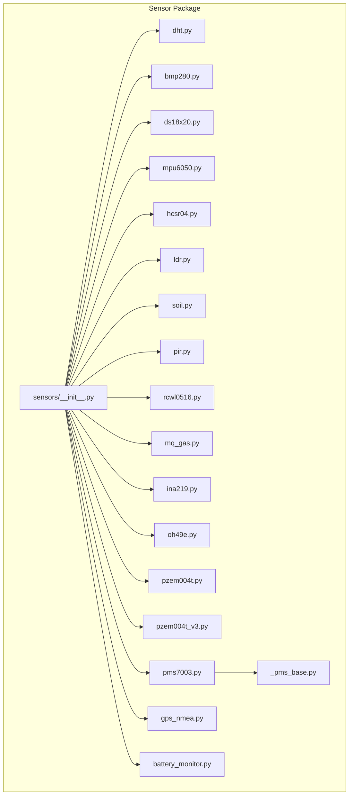
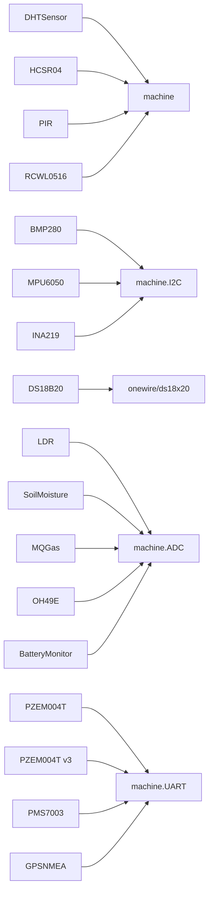

# Sensor API

<cite>
**Referenced Files in This Document**
- [sensors/__init__.py](file://src/lib/sensors/__init__.py)
- [sensors/dht.py](file://src/lib/sensors/dht.py)
- [sensors/bmp280.py](file://src/lib/sensors/bmp280.py)
- [sensors/ds18x20.py](file://src/lib/sensors/ds18x20.py)
- [sensors/mpu6050.py](file://src/lib/sensors/mpu6050.py)
- [sensors/hcsr04.py](file://src/lib/sensors/hcsr04.py)
- [sensors/ldr.py](file://src/lib/sensors/ldr.py)
- [sensors/soil.py](file://src/lib/sensors/soil.py)
- [sensors/pir.py](file://src/lib/sensors/pir.py)
- [sensors/rcwl0516.py](file://src/lib/sensors/rcwl0516.py)
- [sensors/mq_gas.py](file://src/lib/sensors/mq_gas.py)
- [sensors/ina219.py](file://src/lib/sensors/ina219.py)
- [sensors/oh49e.py](file://src/lib/sensors/oh49e.py)
- [sensors/pzem004t.py](file://src/lib/sensors/pzem004t.py)
- [sensors/pzem004t_v3.py](file://src/lib/sensors/pzem004t_v3.py)
- [sensors/pms7003.py](file://src/lib/sensors/pms7003.py)
- [sensors/_pms_base.py](file://src/lib/sensors/_pms_base.py)
- [sensors/gps_nmea.py](file://src/lib/sensors/gps_nmea.py)
- [sensors/battery_monitor.py](file://src/lib/sensors/battery_monitor.py)
- [main/examples/sensors_example.py](file://src/main/examples/sensors_example.py)
</cite>

## Table of Contents
1. [Introduction](#introduction)
2. [Project Structure](#project-structure)
3. [Core Components](#core-components)
4. [Architecture Overview](#architecture-overview)
5. [Detailed Component Analysis](#detailed-component-analysis)
6. [Dependency Analysis](#dependency-analysis)
7. [Performance Considerations](#performance-considerations)
8. [Troubleshooting Guide](#troubleshooting-guide)
9. [Conclusion](#conclusion)
10. [Appendices](#appendices)

## Introduction
This document provides comprehensive API documentation for the sensor driver modules included in the repository. It covers temperature/humidity sensors (DHT, BMP280, BME280), environmental sensors (MQ series, LDR, soil moisture), motion sensors (PIR, RCWL-0516), power monitoring (INA219, OH49E, PZEM variants), and specialized sensors (GPS, PMS7003). For each sensor class, we describe constructor parameters, public methods, return value formats, units, measurement ranges, calibration procedures, data filtering options, and usage patterns. We also include integration guidance for multi-sensor coordination, data fusion, and connections to display and storage modules.

## Project Structure
The sensor drivers live under src/lib/sensors/. The package exposes a consolidated import list for convenience. Example usage of most sensors is demonstrated in the main example script.

**Diagram sources**
- [sensors/__init__.py:1-26](file://src/lib/sensors/__init__.py#L1-L26)
- [sensors/dht.py:1-78](file://src/lib/sensors/dht.py#L1-L78)
- [sensors/bmp280.py:1-204](file://src/lib/sensors/bmp280.py#L1-L204)
- [sensors/ds18x20.py:1-107](file://src/lib/sensors/ds18x20.py#L1-L107)
- [sensors/mpu6050.py:1-167](file://src/lib/sensors/mpu6050.py#L1-L167)
- [sensors/hcsr04.py:1-115](file://src/lib/sensors/hcsr04.py#L1-L115)
- [sensors/ldr.py:1-89](file://src/lib/sensors/ldr.py#L1-L89)
- [sensors/soil.py:1-120](file://src/lib/sensors/soil.py#L1-L120)
- [sensors/pir.py:1-106](file://src/lib/sensors/pir.py#L1-L106)
- [sensors/rcwl0516.py:1-255](file://src/lib/sensors/rcwl0516.py#L1-L255)
- [sensors/mq_gas.py:1-167](file://src/lib/sensors/mq_gas.py#L1-L167)
- [sensors/ina219.py](file://src/lib/sensors/ina219.py)
- [sensors/oh49e.py](file://src/lib/sensors/oh49e.py)
- [sensors/pzem004t.py](file://src/lib/sensors/pzem004t.py)
- [sensors/pzem004t_v3.py](file://src/lib/sensors/pzem004t_v3.py)
- [sensors/pms7003.py:148-189](file://src/lib/sensors/pms7003.py#L148-L189)
- [sensors/_pms_base.py](file://src/lib/sensors/_pms_base.py)
- [sensors/gps_nmea.py](file://src/lib/sensors/gps_nmea.py)
- [sensors/battery_monitor.py](file://src/lib/sensors/battery_monitor.py)

**Section sources**
- [sensors/__init__.py:1-26](file://src/lib/sensors/__init__.py#L1-L26)

## Core Components
This section summarizes the primary sensor classes and their capabilities. See Detailed Component Analysis for per-class API specifications.

- DHTSensor: Digital 1-Wire temperature/humidity sensor (DHT11/DHT22)
- BMP280/BME280: I2C/SPI barometric sensor with optional humidity (BME280)
- DS18B20: 1-Wire temperature sensor supporting multiple devices
- MPU6050: I2C 6DoF IMU (accelerometer + gyroscope + temperature)
- HCSR04: Ultrasonic distance sensor (trigger + echo)
- LDR: Analog light-dependent resistor with percentage estimation
- SoilMoisture: Capacitive/resistive soil moisture with analog and digital thresholds
- PIR: Passive infrared motion detector
- RCWL0516: Microwave radar motion detector (Doppler)
- MQGas: Analog gas sensor with digital threshold and ppm estimation
- INA219: Current/shunt/power monitor
- OH49E: Hall-effect linear sensor with magnetic field estimation
- PZEM004T/PZEM004T v3: AC energy meter (UART and Modbus RTU variants)
- PMS7003: PM2.5 laser particle sensor with sleep/wake modes
- GPSNMEA: GPS receiver parsing NMEA sentences
- BatteryMonitor: Battery voltage/current monitoring abstraction

**Section sources**
- [sensors/__init__.py:5-26](file://src/lib/sensors/__init__.py#L5-L26)

## Architecture Overview
The sensor drivers follow a consistent pattern:
- Constructor accepts pin/I2C/SPI parameters and optional calibration values
- Methods return typed values or structured dictionaries
- Many drivers expose properties for quick access and synchronous read_all() for batch reads
- Some drivers support asynchronous monitoring/watch loops and callbacks
- Filtering helpers (e.g., median, average) are provided where appropriate

```mermaid
classDiagram
class DHTSensor {
+__init__(pin : int, model : str)
+read() tuple
+temperature float|None
+humidity float|None
+read_fahrenheit() tuple
}
class BMP280 {
+__init__(sda : int, scl : int, address : int, freq : int, i2c : I2C)
+read() dict
+temperature float|None
+pressure float|None
+humidity float|None
+altitude(sea_level_pa : float) float|None
}
class DS18B20 {
+__init__(pin : int)
+scan() list
+count int
+read_all() list
+read(index : int) float|None
+read_by_rom(rom : bytes) float|None
}
class MPU6050 {
+__init__(sda : int, scl : int, address : int, freq : int, i2c : I2C, accel_range : int, gyro_range : int)
+acceleration tuple
+gyroscope tuple
+temperature float|None
+read_all() dict
+sleep() void
+wake() void
}
class HCSR04 {
+__init__(trig_pin : int, echo_pin : int, timeout_us : int)
+distance_cm() float|None
+distance_mm() float|None
+distance_inch() float|None
+read_median(samples : int) float|None
}
class LDR {
+__init__(pin : int, adc_atten : int, r_fixed : float, vcc : float)
+read_raw() int
+voltage float
+light_level float
+resistance float
+is_dark(threshold : float) bool
+read_average(samples : int) float
}
class SoilMoisture {
+__init__(analog_pin : int, digital_pin : int, dry_value : int, wet_value : int, adc_atten : int)
+read_raw() int
+moisture_percent float
+is_dry(threshold : float) bool
+is_wet(threshold : float) bool
+digital_output() bool|None
+calibrate(dry_raw : int, wet_raw : int) void
+read_average(samples : int) float
}
class PIR {
+__init__(pin : int, warmup_ms : int)
+motion_detected bool
+on_motion(callback) void
+watch(interval_ms : int, on_motion, on_clear) void
+disable_irq() void
}
class RCWL0516 {
+__init__(pin : int, hold_time_ms : int, cds_pin : int)
+motion_detected bool
+last_motion_time int
+hold_time_ms int
+enable() void
+disable() void
+on_motion(callback) void
+watch(interval_ms : int, on_motion, on_clear) void
+wait_for_motion(timeout_ms : int) bool
+async_wait_for_motion(timeout_ms : int) bool
+count_pulses(duration_ms : int) int
+deinit() void
}
class MQGas {
+__init__(analog_pin : int, digital_pin : int, model : str, rl : float, r0 : float, adc_atten : int)
+read_raw() int
+voltage float
+rs float
+ratio float
+read_ppm(gas : str) float|None
+calibrate(samples : int, interval_ms : int) float
+digital_alarm() bool|None
}
class INA219 {
+__init__(sda : int, scl : int, address : int, shunt_ohms : float, max_current_a : float)
+read_all() dict
+overflow() bool
}
class OH49E {
+__init__(pin : int, null_zone_mv : float)
+voltage float
+deviation_mv float
+field_strength float
+polarity str
+is_magnet_near() bool
+calibrate_midpoint(samples : int) float
+read_average(samples : int) float
+watch(on_change, poll_ms : int) void
}
class PZEM004T {
+__init__(tx : int, rx : int)
+voltage float
+current float
+power float
+energy float
+power_factor float
+read_all() dict
+monitor(on_data, interval_s : int) void
}
class PZEM004Tv3 {
+__init__(tx : int, rx : int, slave_addr : int)
+read_all() dict
+set_alarm_threshold(value : float) void
+get_alarm_threshold() float
+alarm_status bool
+monitor(on_data, interval_s : int) void
}
class PMS7003 {
+__init__(rx : int, tx : int, mode : str)
+read() PMSParseResult|None
+sleep() void
+wake() void
+set_mode(mode : str) void
}
class GPSNMEA {
+__init__(uart_id : int, baudrate : int)
+read_sentence() str|None
+parse_gprmc() dict|None
+parse_gpgga() dict|None
}
class BatteryMonitor {
+__init__(...)
+read_voltage() float
+read_current() float
+read_power() float
+calibrate(offset : float, gain : float) void
}
```

**Diagram sources**
- [sensors/dht.py:11-78](file://src/lib/sensors/dht.py#L11-L78)
- [sensors/bmp280.py:36-204](file://src/lib/sensors/bmp280.py#L36-L204)
- [sensors/ds18x20.py:15-107](file://src/lib/sensors/ds18x20.py#L15-L107)
- [sensors/mpu6050.py:32-167](file://src/lib/sensors/mpu6050.py#L32-L167)
- [sensors/hcsr04.py:11-115](file://src/lib/sensors/hcsr04.py#L11-L115)
- [sensors/ldr.py:12-89](file://src/lib/sensors/ldr.py#L12-L89)
- [sensors/soil.py:12-120](file://src/lib/sensors/soil.py#L12-L120)
- [sensors/pir.py:14-106](file://src/lib/sensors/pir.py#L14-L106)
- [sensors/rcwl0516.py:15-255](file://src/lib/sensors/rcwl0516.py#L15-L255)
- [sensors/mq_gas.py:34-167](file://src/lib/sensors/mq_gas.py#L34-L167)
- [sensors/ina219.py](file://src/lib/sensors/ina219.py)
- [sensors/oh49e.py](file://src/lib/sensors/oh49e.py)
- [sensors/pzem004t.py](file://src/lib/sensors/pzem004t.py)
- [sensors/pzem004t_v3.py](file://src/lib/sensors/pzem004t_v3.py)
- [sensors/pms7003.py:148-189](file://src/lib/sensors/pms7003.py#L148-L189)
- [sensors/gps_nmea.py](file://src/lib/sensors/gps_nmea.py)
- [sensors/battery_monitor.py](file://src/lib/sensors/battery_monitor.py)

## Detailed Component Analysis

### DHTSensor
- Purpose: Read ambient temperature and relative humidity via DHT11/DHT22
- Constructor parameters:
  - pin: GPIO number for data line
  - model: 'DHT11' or 'DHT22'
- Methods and properties:
  - read(): returns (temperature_celsius, humidity_percent) or (None, None) on failure
  - temperature: property returning temperature or None
  - humidity: property returning humidity or None
  - read_fahrenheit(): returns (temperature_fahrenheit, humidity_percent)
- Units and ranges:
  - Temperature: Celsius (typical range per model)
  - Humidity: Percent (typical range per model)
- Notes:
  - Uses internal timing and exceptions for error handling
  - No oversampling configuration exposed

**Section sources**
- [sensors/dht.py:28-78](file://src/lib/sensors/dht.py#L28-L78)

### BMP280/BME280
- Purpose: Barometric pressure and temperature; optional humidity (BME280)
- Constructor parameters:
  - sda, scl: I2C pins
  - address: I2C address (0x76 or 0x77)
  - freq: I2C frequency
  - i2c: optional prebuilt I2C object
- Methods and properties:
  - read(): returns dict with keys 'temperature' (°C), 'pressure' (hPa), 'humidity' (percent or None)
  - temperature, pressure, humidity: properties
  - altitude(sea_level_pa=101325.0): calculates altitude in meters
- Units and ranges:
  - Temperature: Celsius
  - Pressure: hectoPascal
  - Humidity: percent (only BME280)
- Calibration and configuration:
  - Internal calibration loading and oversampling configured during init
- Error handling:
  - Returns None values on read errors

**Section sources**
- [sensors/bmp280.py:52-204](file://src/lib/sensors/bmp280.py#L52-L204)

### DS18B20
- Purpose: 1-Wire digital temperature sensor supporting multiple devices
- Constructor parameters:
  - pin: GPIO number for 1-Wire bus (requires external 4.7kΩ pull-up)
- Methods and properties:
  - scan(): returns list of ROM addresses
  - count: number of devices found
  - read_all(): returns [(rom_hex, temperature_celsius), ...]
  - read(index=0): returns temperature of nth device
  - read_by_rom(rom): returns temperature for specific ROM
- Units and ranges:
  - Temperature: Celsius
- Notes:
  - Requires 750ms delay after conversion requests
  - No oversampling exposed

**Section sources**
- [sensors/ds18x20.py:30-107](file://src/lib/sensors/ds18x20.py#L30-L107)

### MPU6050
- Purpose: 6 Degrees-of-Freedom IMU (accelerometer + gyroscope + temperature)
- Constructor parameters:
  - sda, scl: I2C pins
  - address: I2C address (0x68 or 0x69)
  - freq: I2C frequency
  - i2c: optional prebuilt I2C object
  - accel_range: 0=±2g, 1=±4g, 2=±8g, 3=±16g
  - gyro_range: 0=±250°/s, 1=±500°/s, 2=±1000°/s, 3=±2000°/s
- Methods and properties:
  - acceleration: (ax, ay, az) in g
  - gyroscope: (gx, gy, gz) in degrees/second
  - temperature: die temperature in Celsius
  - read_all(): dict with all values
  - sleep()/wake(): enter/exit sleep mode
- Units and ranges:
  - Acceleration: g
  - Angular velocity: degrees/second
  - Temperature: Celsius
- Notes:
  - Full-scale ranges set at construction

**Section sources**
- [sensors/mpu6050.py:50-167](file://src/lib/sensors/mpu6050.py#L50-L167)

### HCSR04
- Purpose: Ultrasonic distance measurement
- Constructor parameters:
  - trig_pin, echo_pin: GPIO numbers
  - timeout_us: echo wait timeout in microseconds
- Methods and properties:
  - distance_cm(): returns distance in centimeters or None
  - distance_mm(): returns millimeters
  - distance_inch(): returns inches
  - read_median(samples=5): returns median of multiple readings
- Units and ranges:
  - Distance: centimeters (typical 2–400 cm)
- Notes:
  - Includes timeout handling and out-of-range checks
  - Median reduces noise

**Section sources**
- [sensors/hcsr04.py:26-115](file://src/lib/sensors/hcsr04.py#L26-L115)

### LDR
- Purpose: Light-dependent resistor estimation
- Constructor parameters:
  - pin: ADC-capable GPIO
  - adc_atten: ADC attenuation
  - r_fixed: fixed resistor value in voltage divider (Ohms)
  - vcc: supply voltage (Volts)
- Methods and properties:
  - read_raw(): ADC raw value (0–4095)
  - voltage: measured voltage at ADC pin
  - light_level: estimated brightness percent (0–100)
  - resistance: estimated LDR resistance (Ohms)
  - is_dark(threshold=30.0): boolean check
  - read_average(samples=10): averaged brightness percent
- Units and ranges:
  - Voltage: Volts
  - Resistance: Ohms
  - Brightness: Percent
- Notes:
  - Assumes voltage divider configuration with fixed resistor

**Section sources**
- [sensors/ldr.py:27-89](file://src/lib/sensors/ldr.py#L27-L89)

### SoilMoisture
- Purpose: Capacitive/resistive soil moisture sensing
- Constructor parameters:
  - analog_pin: ADC-capable GPIO
  - digital_pin: optional digital threshold pin
  - dry_value, wet_value: ADC raw calibration values
  - adc_atten: ADC attenuation
- Methods and properties:
  - read_raw(): ADC raw value
  - moisture_percent: calculated percent (0–100)
  - is_dry(threshold=30.0), is_wet(threshold=70.0)
  - digital_output(): digital threshold state or None
  - calibrate(dry_raw=None, wet_raw=None): update calibration
  - read_average(samples=10): averaged percent
- Units and ranges:
  - Moisture: Percent
- Notes:
  - Calibration depends on sensor placement and medium

**Section sources**
- [sensors/soil.py:30-120](file://src/lib/sensors/soil.py#L30-L120)

### PIR
- Purpose: Passive infrared motion detection
- Constructor parameters:
  - pin: GPIO for output
  - warmup_ms: warm-up delay to stabilize sensor
- Methods and properties:
  - motion_detected: boolean
  - on_motion(callback): attach IRQ-based callback
  - watch(interval_ms=100, on_motion, on_clear): async polling loop
  - disable_irq(): detach IRQ
- Notes:
  - Debounce via internal interval
  - Warm-up recommended before use

**Section sources**
- [sensors/pir.py:38-106](file://src/lib/sensors/pir.py#L38-L106)

### RCWL0516
- Purpose: Microwave radar motion detection (Doppler)
- Constructor parameters:
  - pin: GPIO for output
  - hold_time_ms: debounce/cooldown period
  - cds_pin: optional pin to disable sensor
- Methods and properties:
  - motion_detected: boolean
  - last_motion_time: milliseconds since last detection
  - hold_time_ms: current hold time
  - enable()/disable(): control via CDS pin
  - on_motion(callback): IRQ-based callback
  - watch(...): async polling loop
  - wait_for_motion(timeout_ms): blocking wait
  - async_wait_for_motion(timeout_ms): async wait
  - count_pulses(duration_ms): count detections over time
  - deinit(): cleanup
- Notes:
  - No warm-up required
  - Higher current than PIR

**Section sources**
- [sensors/rcwl0516.py:54-255](file://src/lib/sensors/rcwl0516.py#L54-L255)

### MQGas
- Purpose: Analog gas sensing with digital threshold
- Constructor parameters:
  - analog_pin: ADC-capable GPIO
  - digital_pin: optional digital threshold pin
  - model: 'MQ2', 'MQ7', or 'MQ135'
  - rl: load resistance (Ohms)
  - r0: sensor resistance in clean air (Ohms); defaults applied
  - adc_atten: ADC attenuation
- Methods and properties:
  - read_raw(): ADC raw
  - voltage: output voltage
  - rs: sensor resistance (Ohms)
  - ratio: rs/r0
  - read_ppm(gas=None): estimated ppm for supported gases
  - calibrate(samples=50, interval_ms=50): compute and set R0
  - digital_alarm(): threshold alarm state or None
- Supported gases (per model):
  - MQ2: LPG, Propane, Hydrogen, Methane, Smoke
  - MQ7: Carbon Monoxide
  - MQ135: NH3, NOx, CO2, Alcohol, Benzene
- Notes:
  - Requires preheating and clean-air calibration

**Section sources**
- [sensors/mq_gas.py:55-167](file://src/lib/sensors/mq_gas.py#L55-L167)

### INA219
- Purpose: Current, shunt voltage, and power monitor
- Constructor parameters:
  - sda, scl: I2C pins
  - address: I2C address
  - shunt_ohms: shunt resistor value
  - max_current_a: expected maximum current
- Methods and properties:
  - read_all(): dict with 'bus_voltage' (V), 'shunt_voltage_mv' (mV), 'current_ma' (mA), 'power_mw' (mW)
  - overflow(): boolean indicating overflow condition
- Units and ranges:
  - Bus voltage: Volts
  - Shunt voltage: millivolts
  - Current: milliamps
  - Power: milliwatts

**Section sources**
- [sensors/ina219.py](file://src/lib/sensors/ina219.py)

### OH49E
- Purpose: Linear Hall-effect sensor for magnetic field and polarity
- Constructor parameters:
  - pin: ADC-capable GPIO
  - null_zone_mv: null detection zone in millivolts
- Methods and properties:
  - voltage: measured voltage
  - deviation_mv: deviation from midpoint in millivolts
  - field_strength: estimated magnetic field in millitesla
  - polarity: 'north', 'south', or 'none'
  - is_magnet_near(): boolean check
  - calibrate_midpoint(samples=50): estimate midpoint
  - read_average(samples=20): averaged deviation
  - watch(on_change, poll_ms): async watch loop
- Notes:
  - Requires midpoint calibration with no magnet nearby

**Section sources**
- [sensors/oh49e.py](file://src/lib/sensors/oh49e.py)

### PZEM004T (v1/v2)
- Purpose: AC electrical energy meter (UART)
- Constructor parameters:
  - tx, rx: UART pins
- Properties:
  - voltage, current, power, energy, power_factor
- Methods:
  - read_all(): dict with all values
  - monitor(on_data, interval_s): async periodic monitoring
- Notes:
  - Values are read from device registers via protocol

**Section sources**
- [sensors/pzem004t.py](file://src/lib/sensors/pzem004t.py)

### PZEM004T v3 (Modbus RTU)
- Purpose: Enhanced AC meter with frequency and alarm
- Constructor parameters:
  - tx, rx: UART pins
  - slave_addr: Modbus slave address
- Methods and properties:
  - read_all(): includes 'voltage', 'current', 'power', 'energy', 'frequency', 'power_factor', 'alarm'
  - set_alarm_threshold(watts): configure over-power alarm
  - get_alarm_threshold(): retrieve threshold
  - alarm_status: boolean
  - monitor(on_data, interval_s): async monitoring
- Notes:
  - Single request returns all values efficiently

**Section sources**
- [sensors/pzem004t_v3.py](file://src/lib/sensors/pzem004t_v3.py)

### PMS7003
- Purpose: PM2.5 laser particulate sensor
- Constructor parameters:
  - rx, tx: UART pins
  - mode: 'active' or 'passive'
- Methods:
  - read(): returns parsed result or None
  - sleep()/wake(): low-power modes
  - set_mode(mode): switch modes
- Notes:
  - Supports sleep/wake to reduce power consumption

**Section sources**
- [sensors/pms7003.py:148-189](file://src/lib/sensors/pms7003.py#L148-L189)

### GPSNMEA
- Purpose: Parse GPS NMEA sentences (e.g., GPRMC, GPGGA)
- Constructor parameters:
  - uart_id, baudrate: UART configuration
- Methods:
  - read_sentence(): returns raw NMEA sentence or None
  - parse_gprmc(): parses movement data
  - parse_gpgga(): parses fix data
- Notes:
  - Returns structured dicts for position and status

**Section sources**
- [sensors/gps_nmea.py](file://src/lib/sensors/gps_nmea.py)

### BatteryMonitor
- Purpose: Abstraction for battery voltage/current/power
- Constructor parameters:
  - Implementation-specific (see module)
- Methods and properties:
  - read_voltage(), read_current(), read_power()
  - calibrate(offset, gain): adjust calibration
- Notes:
  - Intended to wrap ADC-based or dedicated IC-based monitors

**Section sources**
- [sensors/battery_monitor.py](file://src/lib/sensors/battery_monitor.py)

## Dependency Analysis
- Inter-module dependencies:
  - All drivers depend on MicroPython machine and I/O primitives
  - I2C-based drivers depend on machine.I2C
  - UART-based drivers depend on machine.UART
  - ADC-based drivers depend on machine.ADC
  - 1-Wire and timing-sensitive drivers rely on time and IRQ facilities
- Coupling:
  - Low coupling via constructor parameters and minimal shared state
  - High cohesion within each driver class
- External integration points:
  - asyncio for async monitoring/watch loops
  - Optional display/storage modules for data presentation/logging

**Diagram sources**
- [sensors/dht.py:7-9](file://src/lib/sensors/dht.py#L7-L9)
- [sensors/bmp280.py:10-11](file://src/lib/sensors/bmp280.py#L10-L11)
- [sensors/ds18x20.py:10-12](file://src/lib/sensors/ds18x20.py#L10-L12)
- [sensors/mpu6050.py:9-11](file://src/lib/sensors/mpu6050.py#L9-L11)
- [sensors/hcsr04.py:7-9](file://src/lib/sensors/hcsr04.py#L7-L9)
- [sensors/ldr.py:9](file://src/lib/sensors/ldr.py#L9)
- [sensors/soil.py:9](file://src/lib/sensors/soil.py#L9)
- [sensors/pir.py:9-12](file://src/lib/sensors/pir.py#L9-L12)
- [sensors/rcwl0516.py:10-13](file://src/lib/sensors/rcwl0516.py#L10-L13)
- [sensors/mq_gas.py:11-13](file://src/lib/sensors/mq_gas.py#L11-L13)
- [sensors/ina219.py](file://src/lib/sensors/ina219.py)
- [sensors/oh49e.py](file://src/lib/sensors/oh49e.py)
- [sensors/pzem004t.py](file://src/lib/sensors/pzem004t.py)
- [sensors/pzem004t_v3.py](file://src/lib/sensors/pzem004t_v3.py)
- [sensors/pms7003.py:148-189](file://src/lib/sensors/pms7003.py#L148-L189)
- [sensors/gps_nmea.py](file://src/lib/sensors/gps_nmea.py)
- [sensors/battery_monitor.py](file://src/lib/sensors/battery_monitor.py)

**Section sources**
- [sensors/dht.py:7-9](file://src/lib/sensors/dht.py#L7-L9)
- [sensors/bmp280.py:10-11](file://src/lib/sensors/bmp280.py#L10-L11)
- [sensors/ds18x20.py:10-12](file://src/lib/sensors/ds18x20.py#L10-L12)
- [sensors/mpu6050.py:9-11](file://src/lib/sensors/mpu6050.py#L9-L11)
- [sensors/hcsr04.py:7-9](file://src/lib/sensors/hcsr04.py#L7-L9)
- [sensors/ldr.py:9](file://src/lib/sensors/ldr.py#L9)
- [sensors/soil.py:9](file://src/lib/sensors/soil.py#L9)
- [sensors/pir.py:9-12](file://src/lib/sensors/pir.py#L9-L12)
- [sensors/rcwl0516.py:10-13](file://src/lib/sensors/rcwl0516.py#L10-L13)
- [sensors/mq_gas.py:11-13](file://src/lib/sensors/mq_gas.py#L11-L13)
- [sensors/ina219.py](file://src/lib/sensors/ina219.py)
- [sensors/oh49e.py](file://src/lib/sensors/oh49e.py)
- [sensors/pzem004t.py](file://src/lib/sensors/pzem004t.py)
- [sensors/pzem004t_v3.py](file://src/lib/sensors/pzem004t_v3.py)
- [sensors/pms7003.py:148-189](file://src/lib/sensors/pms7003.py#L148-L189)
- [sensors/gps_nmea.py](file://src/lib/sensors/gps_nmea.py)
- [sensors/battery_monitor.py](file://src/lib/sensors/battery_monitor.py)

## Performance Considerations
- Sampling intervals:
  - Use appropriate delays between sensor conversions (e.g., DS18B20 requires ~750ms after convert)
  - For I2C sensors, avoid excessive polling; batch reads where possible (e.g., BMP280 read_all)
- Power optimization:
  - Enable sleep modes for IMU (MPU6050 sleep/wake), PMS7003 sleep/wake
  - Reduce ADC averaging samples for lower CPU usage
- Filtering:
  - Prefer median or moving average for noisy sensors (e.g., HCSR04 read_median, LDR/Soil read_average)
- Asynchronous monitoring:
  - Use monitor/watch loops sparingly; tune interval_ms and handle timeouts gracefully
- Multi-sensor coordination:
  - Coordinate I2C bus usage; avoid simultaneous high-frequency transactions
  - Use separate tasks for independent sensors to prevent blocking

[No sources needed since this section provides general guidance]

## Troubleshooting Guide
- Initialization failures:
  - Verify wiring and pull-up resistors (e.g., DS18B20 requires 4.7kΩ pull-up)
  - Confirm I2C address and frequency; check device ID detection
- Read failures:
  - DHT: retry after short delay; ensure quiet environment
  - BMP280/BME280: confirm chip presence and calibration loaded
  - MQGas: preheat sufficiently and calibrate in clean air
- Unexpected values:
  - LDR/Soil: recalibrate dry/wet values; verify voltage divider
  - OH49E: calibrate midpoint with no magnet present
- Power issues:
  - INA219: check shunt resistor and max_current setting; monitor overflow flag
  - PZEM: verify wiring and slave address; ensure UART framing is correct
- Motion sensors:
  - PIR: allow adequate warm-up; adjust hold time and debounce
  - RCWL-0516: ensure CDS pin floating or controlled as needed; account for higher current draw

**Section sources**
- [sensors/ds18x20.py:30-45](file://src/lib/sensors/ds18x20.py#L30-L45)
- [sensors/bmp280.py:69-72](file://src/lib/sensors/bmp280.py#L69-L72)
- [sensors/mq_gas.py:140-156](file://src/lib/sensors/mq_gas.py#L140-L156)
- [sensors/ldr.py:27-41](file://src/lib/sensors/ldr.py#L27-L41)
- [sensors/oh49e.py](file://src/lib/sensors/oh49e.py)
- [sensors/ina219.py](file://src/lib/sensors/ina219.py)
- [sensors/pzem004t.py](file://src/lib/sensors/pzem004t.py)
- [sensors/pir.py:38-50](file://src/lib/sensors/pir.py#L38-L50)
- [sensors/rcwl0516.py:54-76](file://src/lib/sensors/rcwl0516.py#L54-L76)

## Conclusion
The sensor library offers a cohesive set of drivers for common embedded sensing tasks. Each driver exposes a clear constructor, concise methods, and helpful properties. Use the provided examples as starting points, apply calibration where necessary, and leverage asynchronous monitoring and filtering to build robust applications. For multi-sensor systems, coordinate I2C/SPI buses, manage power modes, and integrate with display and storage modules as needed.

[No sources needed since this section summarizes without analyzing specific files]

## Appendices

### Usage Patterns and Examples
- Initialization and basic reads:
  - DHT: construct with pin and model; call read() or read_fahrenheit()
  - BMP280: construct with I2C pins and address; call read() or altitude()
  - DS18B20: construct with pin; call read_all() or read(index)
  - MPU6050: construct with I2C pins; access acceleration, gyroscope, temperature
  - HCSR04: construct with trig/echo pins; call distance_cm() or read_median()
  - LDR: construct with ADC pin and fixed resistor; use light_level or read_average()
  - SoilMoisture: construct with analog pin and calibration values; use moisture_percent or is_dry()
  - PIR: construct with pin and warmup; check motion_detected or use watch()
  - RCWL0516: construct with pin and hold time; use motion_detected or async wait/count
  - MQGas: construct with analog pin and model; calibrate(); read_ppm()
  - INA219: construct with I2C pins and shunt/max current; call read_all()
  - OH49E: construct with ADC pin and null zone; calibrate_midpoint(); watch()
  - PZEM: construct with UART pins; use properties or read_all(); monitor()
  - PMS7003: construct with UART pins and mode; read(); sleep()/wake()
  - GPS: construct with UART; read_sentence(); parse_gprmc()/parse_gpgga()
  - BatteryMonitor: construct; read_voltage()/read_current()/read_power()

- Periodic monitoring:
  - Use monitor() for PZEM devices
  - Use watch() for PIR/RCWL sensors
  - Use read_average() or read_median() for smoothing

- Threshold detection:
  - PIR/RCWL: use motion_detected or callbacks
  - MQGas: use digital_alarm() or read_ppm() with thresholds
  - LDR/Soil: compare light_level or moisture_percent against thresholds

- Data processing:
  - Convert units using provided properties (e.g., temperature in Celsius)
  - Apply calibration constants for accurate readings
  - Aggregate multiple samples for stability

**Section sources**
- [main/examples/sensors_example.py:30-529](file://src/main/examples/sensors_example.py#L30-L529)