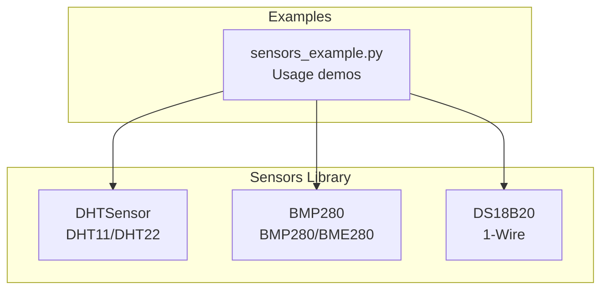
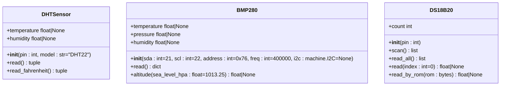
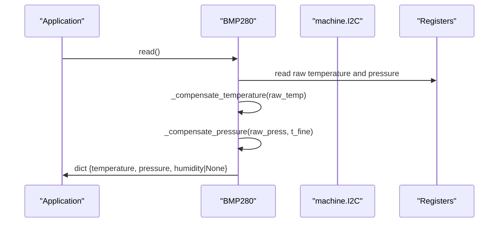
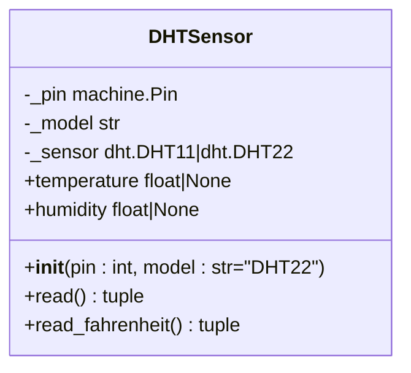
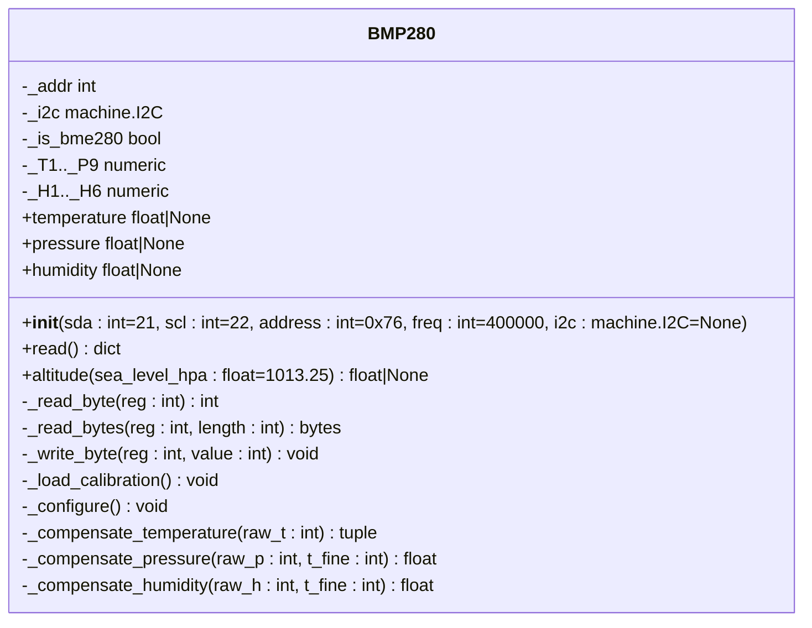
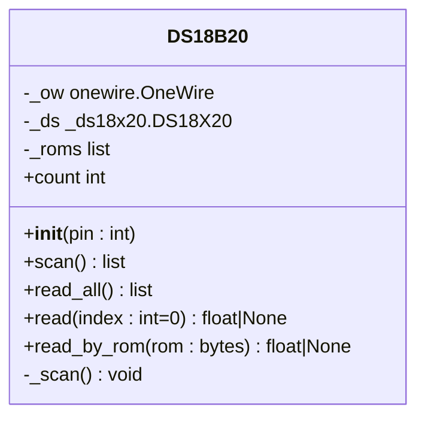
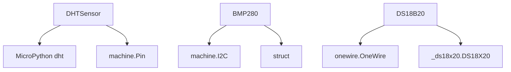

# Temperature & Humidity Sensors

<cite>
**Referenced Files in This Document**
- [dht.py](file://src/lib/sensors/dht.py)
- [bmp280.py](file://src/lib/sensors/bmp280.py)
- [ds18x20.py](file://src/lib/sensors/ds18x20.py)
- [README.md](file://src/lib/sensors/README.md)
- [sensors_example.py](file://src/main/examples/sensors_example.py)
</cite>

## Table of Contents
1. [Introduction](#introduction)
2. [Project Structure](#project-structure)
3. [Core Components](#core-components)
4. [Architecture Overview](#architecture-overview)
5. [Detailed Component Analysis](#detailed-component-analysis)
6. [Dependency Analysis](#dependency-analysis)
7. [Performance Considerations](#performance-considerations)
8. [Troubleshooting Guide](#troubleshooting-guide)
9. [Conclusion](#conclusion)

## Introduction
This document provides comprehensive API documentation for temperature and humidity sensor drivers in the repository, focusing on:
- DHT sensor classes (DHT11, DHT22) with initialization parameters, measurement timing, checksum validation, and error handling
- BMP280/BME280 sensor drivers with pressure compensation, altitude calculation, and weather station applications
- DS18B20 OneWire temperature sensors with parasite power mode and multi-device addressing

For each sensor family, we document method signatures for temperature/humidity readings, accuracy specifications, sampling intervals, and calibration procedures. We also include practical examples for single-shot measurements, continuous monitoring, threshold alerts, and data averaging, along with sensor-specific wiring requirements, pull-up resistor configurations, and power management considerations.

## Project Structure
The sensor drivers are organized under the sensors library with dedicated modules for each sensor family. The main example demonstrates usage patterns for DHT, BMP280/BME280, and DS18B20.

**Diagram sources**
- [dht.py:11-78](file://src/lib/sensors/dht.py#L11-L78)
- [bmp280.py:36-204](file://src/lib/sensors/bmp280.py#L36-L204)
- [ds18x20.py:15-107](file://src/lib/sensors/ds18x20.py#L15-L107)
- [sensors_example.py:30-86](file://src/main/examples/sensors_example.py#L30-L86)

**Section sources**
- [README.md:18-42](file://src/lib/sensors/README.md#L18-L42)
- [sensors_example.py:30-86](file://src/main/examples/sensors_example.py#L30-L86)

## Core Components
This section summarizes the primary sensor drivers and their capabilities.

- DHTSensor
  - Supports DHT11 and DHT22 models
  - Provides temperature and humidity readings
  - Includes Fahrenheit conversion
  - Handles exceptions during measurement

- BMP280
  - Supports BMP280 and BME280
  - Reads temperature, pressure, and optionally humidity (BME280)
  - Performs calibration and compensation calculations
  - Computes altitude using sea-level pressure

- DS18B20
  - 1-Wire temperature sensor
  - Scans and manages multiple devices on the same bus
  - Supports parasite power mode
  - Provides individual and batch temperature reads

**Section sources**
- [dht.py:11-78](file://src/lib/sensors/dht.py#L11-L78)
- [bmp280.py:36-204](file://src/lib/sensors/bmp280.py#L36-L204)
- [ds18x20.py:15-107](file://src/lib/sensors/ds18x20.py#L15-L107)

## Architecture Overview
The sensor drivers follow a straightforward object-oriented design:
- Each driver encapsulates initialization, configuration, and measurement routines
- Measurement methods return structured data or None on failure
- Compensation and calibration are handled internally for BMP280/BME280

**Diagram sources**
- [dht.py:28-78](file://src/lib/sensors/dht.py#L28-L78)
- [bmp280.py:52-204](file://src/lib/sensors/bmp280.py#L52-L204)
- [ds18x20.py:30-107](file://src/lib/sensors/ds18x20.py#L30-L107)

## Detailed Component Analysis

### DHT Sensor Classes (DHT11, DHT22)
- Purpose: Read ambient temperature and humidity using DHT11 or DHT22 sensors over a 1-Wire interface
- Wiring requirements:
  - VCC to 3.3V or 5V
  - GND to ground
  - DATA to GPIO with a pull-up resistor (typical 10kΩ)
- Initialization parameters:
  - pin: GPIO connected to the sensor’s DATA pin
  - model: 'DHT11' or 'DHT22' (default 'DHT22')
- Measurement timing:
  - Uses internal sensor.measure() and sensor.temperature()/sensor.humidity()
  - Exceptions are caught and None is returned on failure
- Checksum validation:
  - Delegated to the underlying MicroPython dht module
- Error handling:
  - Returns (None, None) on read() failures
  - Provides Fahrenheit conversion via read_fahrenheit()

Method signatures and behaviors:
- read() -> tuple: Returns (temperature_celsius, humidity_percent) or (None, None)
- temperature -> float | None: Property returning temperature
- humidity -> float | None: Property returning humidity
- read_fahrenheit() -> tuple: Returns (temperature_fahrenheit, humidity_percent)

Accuracy and sampling:
- Accuracy specifications and typical sampling intervals are provided in the library documentation

Calibration:
- Not applicable for DHT sensors; rely on manufacturer specifications

Examples:
- Single-shot measurement and Fahrenheit conversion demonstrated in the example script
- Continuous monitoring with retry logic shown in the library documentation

Wiring and power considerations:
- Pull-up resistor recommended between DATA and VCC
- Supply voltage compatible with sensor (3.3V or 5V)

**Section sources**
- [dht.py:11-78](file://src/lib/sensors/dht.py#L11-L78)
- [README.md:45-127](file://src/lib/sensors/README.md#L45-L127)
- [sensors_example.py:30-47](file://src/main/examples/sensors_example.py#L30-L47)

### BMP280/BME280 Sensor Drivers
- Purpose: Measure temperature, barometric pressure, and optionally humidity (BME280)
- Wiring requirements:
  - VCC to 3.3V
  - GND to ground
  - SDA to GPIO SDA
  - SCL to GPIO SCL
  - SDO to GND for address 0x76 or VCC for 0x77
- Initialization parameters:
  - sda: GPIO for I2C SDA
  - scl: GPIO for I2C SCL
  - address: I2C address (0x76 or 0x77)
  - freq: I2C speed in Hz
  - i2c: Optional pre-configured I2C object
- Measurement timing:
  - Reads raw sensor registers and performs compensation
  - Returns temperature in Celsius, pressure in hectopascals, and humidity in percent (BME280)
- Pressure compensation and altitude calculation:
  - Internal calibration data loaded from OTP memory
  - Compensation formulas compute true temperature and pressure
  - Altitude computed using sea-level pressure (default 101325 Pa)

Method signatures and behaviors:
- read() -> dict: Returns {'temperature': float, 'pressure': float, 'humidity': float | None}
- temperature -> float | None: Property wrapper around read()
- pressure -> float | None: Property wrapper around read()
- humidity -> float | None: Property wrapper around read() (BME280 only)
- altitude(sea_level_hpa: float = 1013.25) -> float | None: Computes altitude in meters

Accuracy and sampling:
- Oversampling and mode configured internally
- Typical accuracy and sampling intervals documented in the library

Calibration:
- Calibration coefficients loaded from sensor OTP memory
- No external calibration procedure required

Examples:
- Basic readout and altitude calculation demonstrated in the example script
- Sharing I2C bus with other sensors shown in the library documentation

Weather station applications:
- Ideal for barometric pressure logging, altitude estimation, and indoor/outdoor climate monitoring

**Section sources**
- [bmp280.py:36-204](file://src/lib/sensors/bmp280.py#L36-L204)
- [README.md:131-208](file://src/lib/sensors/README.md#L131-L208)
- [sensors_example.py:49-66](file://src/main/examples/sensors_example.py#L49-L66)

### DS18B20 OneWire Temperature Sensors
- Purpose: Measure temperature using DS18B20 sensors over a 1-Wire bus
- Wiring requirements:
  - VCC to 3.3V (or use parasite power by connecting to GND)
  - GND to ground
  - DATA to GPIO with a 4.7kΩ pull-up resistor to VCC
- Initialization parameters:
  - pin: GPIO connected to the 1-Wire bus
- Measurement timing:
  - Scans for ROM addresses on the bus
  - Converts temperature and reads values with appropriate delays
- Parasite power mode:
  - Supported; requires careful timing and power delivery
- Multi-device addressing:
  - Scans and stores ROM addresses
  - Allows reading by index or by specific ROM address

Method signatures and behaviors:
- __init__(pin: int): Initializes bus and scans for devices
- scan() -> list: Returns list of ROM addresses
- count -> int: Number of devices found
- read_all() -> list: Returns [(rom_hex, temperature_celsius), ...]
- read(index: int = 0) -> float | None: Reads temperature of device at index
- read_by_rom(rom: bytes) -> float | None: Reads temperature by ROM address

Accuracy and sampling:
- Accuracy and sampling intervals documented in the library

Calibration:
- Not applicable; DS18B20 provides calibrated outputs

Examples:
- Single-device and multi-device reads demonstrated in the example script
- ROM-based addressing for stable identification shown in the library documentation

Wiring and power considerations:
- Pull-up resistor required on the 1-Wire bus
- Parasite power mode reduces wiring but requires precise timing

**Section sources**
- [ds18x20.py:15-107](file://src/lib/sensors/ds18x20.py#L15-L107)
- [README.md:211-280](file://src/lib/sensors/README.md#L211-L280)
- [sensors_example.py:68-86](file://src/main/examples/sensors_example.py#L68-L86)

## Architecture Overview
The following sequence diagram illustrates a typical BMP280 read operation, including calibration and compensation steps.

**Diagram sources**
- [bmp280.py:147-172](file://src/lib/sensors/bmp280.py#L147-L172)
- [bmp280.py:112-143](file://src/lib/sensors/bmp280.py#L112-L143)

## Detailed Component Analysis

### DHT Sensor Class Diagram

**Diagram sources**
- [dht.py:28-78](file://src/lib/sensors/dht.py#L28-L78)

### BMP280 Class Diagram

**Diagram sources**
- [bmp280.py:52-204](file://src/lib/sensors/bmp280.py#L52-L204)

### DS18B20 Class Diagram

**Diagram sources**
- [ds18x20.py:30-107](file://src/lib/sensors/ds18x20.py#L30-L107)

## Dependency Analysis
- DHTSensor depends on the MicroPython dht module and machine.Pin
- BMP280 depends on machine.I2C and struct for register access and calibration data unpacking
- DS18B20 depends on onewire and ds18x20 libraries for 1-Wire communication and ROM addressing

**Diagram sources**
- [dht.py:7-8](file://src/lib/sensors/dht.py#L7-L8)
- [bmp280.py:10-11](file://src/lib/sensors/bmp280.py#L10-L11)
- [ds18x20.py:9-12](file://src/lib/sensors/ds18x20.py#L9-L12)

**Section sources**
- [dht.py:7-8](file://src/lib/sensors/dht.py#L7-L8)
- [bmp280.py:10-11](file://src/lib/sensors/bmp280.py#L10-L11)
- [ds18x20.py:9-12](file://src/lib/sensors/ds18x20.py#L9-L12)

## Performance Considerations
- DHT sensors:
  - Measurement timing is managed by the underlying dht module; handle retries and delays appropriately
  - Pull-up resistor selection affects signal integrity and timing margins
- BMP280/BME280:
  - Oversampling and mode are configured internally; adjust sampling rate based on power and latency requirements
  - Altitude computation involves floating-point arithmetic; cache results when possible
- DS18B20:
  - Conversion delay is handled internally; ensure adequate timing for multi-device scenarios
  - Parasite power mode reduces wiring complexity but requires precise timing control

[No sources needed since this section provides general guidance]

## Troubleshooting Guide
Common issues and resolutions:
- DHT sensor returns None:
  - Verify wiring and pull-up resistor
  - Check for sufficient delay between measurements
  - Confirm model parameter matches the physical sensor
- BMP280 read returns None:
  - Ensure correct I2C address and wiring
  - Confirm chip ID detection and calibration loading
  - Validate sea-level pressure input for altitude calculation
- DS18B20 returns empty list:
  - Check pull-up resistor and 1-Wire bus integrity
  - Verify ROM scanning and device presence
  - Confirm parasite power mode wiring if applicable

**Section sources**
- [dht.py:47-54](file://src/lib/sensors/dht.py#L47-L54)
- [bmp280.py:170-172](file://src/lib/sensors/bmp280.py#L170-L172)
- [ds18x20.py:40-44](file://src/lib/sensors/ds18x20.py#L40-L44)

## Conclusion
The repository provides robust, well-documented drivers for DHT, BMP280/BME280, and DS18B20 sensors. Each driver encapsulates initialization, measurement, and compensation logic, enabling straightforward integration into weather stations, environmental monitoring, and IoT applications. Follow the wiring guidelines, consider power and timing requirements, and leverage the provided examples for single-shot and continuous monitoring scenarios.