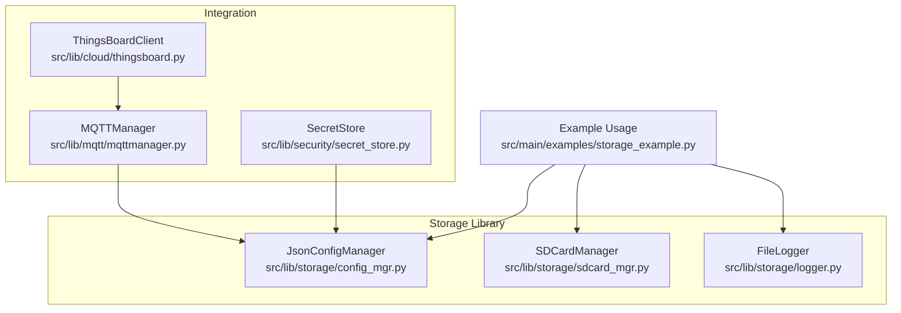
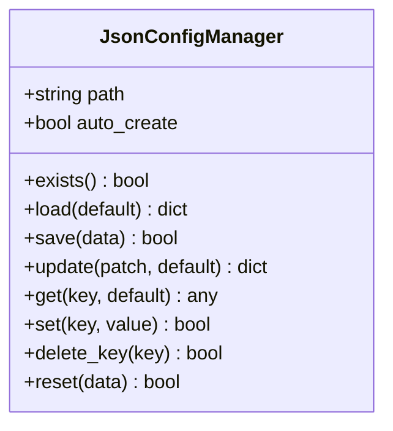
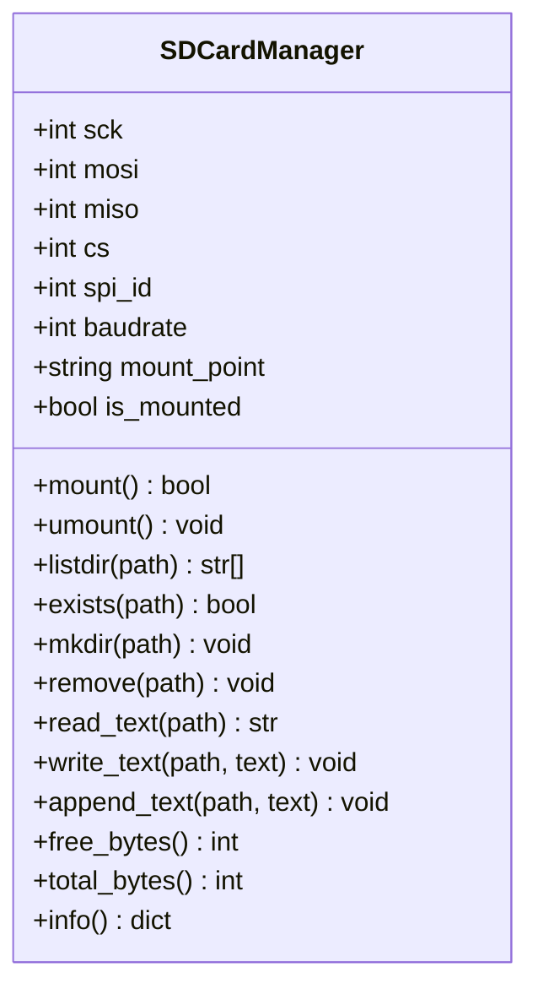
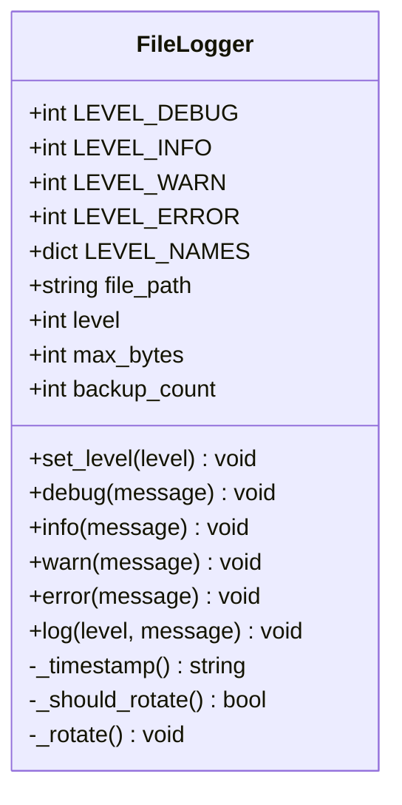
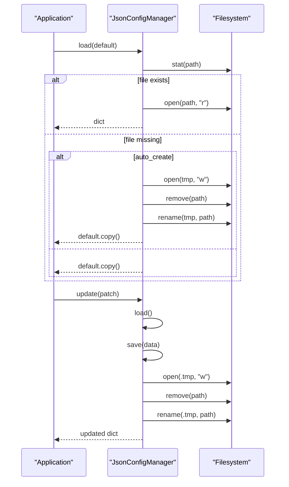
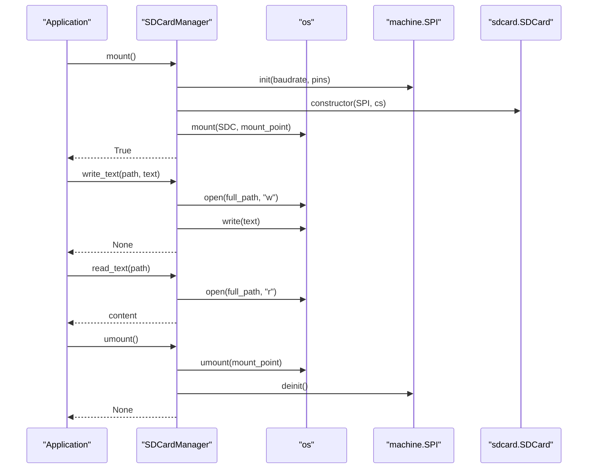
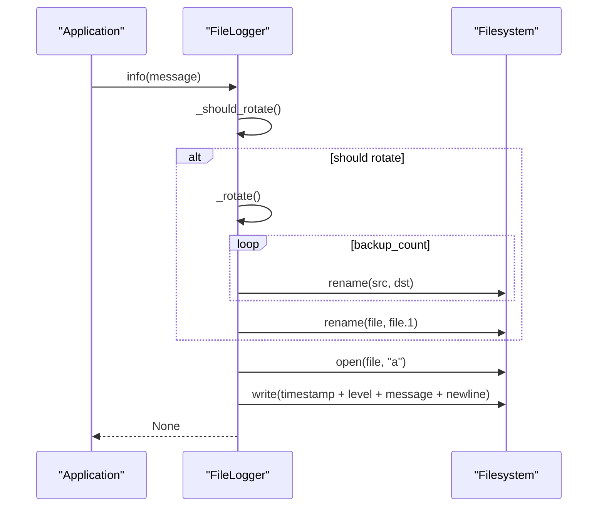
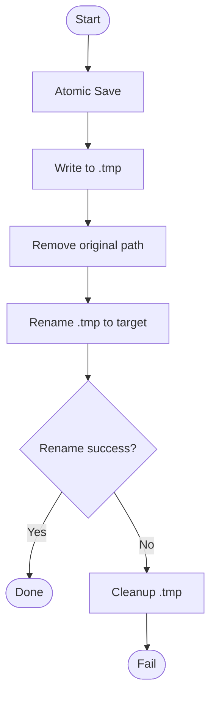
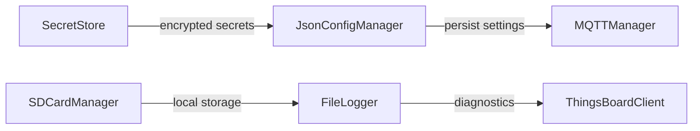

# Storage API

<cite>
**Referenced Files in This Document**
- [config_mgr.py](file://src/lib/storage/config_mgr.py)
- [sdcard_mgr.py](file://src/lib/storage/sdcard_mgr.py)
- [logger.py](file://src/lib/storage/logger.py)
- [__init__.py](file://src/lib/storage/__init__.py)
- [README.md](file://src/lib/storage/README.md)
- [storage_example.py](file://src/main/examples/storage_example.py)
- [secret_store.py](file://src/lib/security/secret_store.py)
- [mqttmanager.py](file://src/lib/mqtt/mqttmanager.py)
- [thingsboard.py](file://src/lib/cloud/thingsboard.py)
</cite>

## Table of Contents
1. [Introduction](#introduction)
2. [Project Structure](#project-structure)
3. [Core Components](#core-components)
4. [Architecture Overview](#architecture-overview)
5. [Detailed Component Analysis](#detailed-component-analysis)
6. [Dependency Analysis](#dependency-analysis)
7. [Performance Considerations](#performance-considerations)
8. [Troubleshooting Guide](#troubleshooting-guide)
9. [Conclusion](#conclusion)
10. [Appendices](#appendices)

## Introduction
This document provides comprehensive API documentation for the storage and file management modules in the ESP32-C3 project. It covers configuration management (JsonConfigManager), file system operations (SD card management via SDCardManager), logging systems (FileLogger), and data persistence mechanisms. It also documents return values for file operations, storage capacity, and data integrity verification, along with usage examples for configuration persistence, log file management, data backup procedures, and recovery operations. Additional guidance is included for storage-specific configurations, file system limitations, memory management, performance optimization, data encryption, backup strategies, and integration with network communication for remote data access.

## Project Structure
The storage library is organized under src/lib/storage with three primary modules:
- JsonConfigManager: Manages JSON-based configuration files with atomic save semantics.
- SDCardManager: Provides SD card mounting, directory and file operations, and capacity reporting.
- FileLogger: Implements file-based logging with rotation and backup support.



**Diagram sources**
- [__init__.py](file://src/lib/storage/__init__.py)
- [config_mgr.py](file://src/lib/storage/config_mgr.py)
- [sdcard_mgr.py](file://src/lib/storage/sdcard_mgr.py)
- [logger.py](file://src/lib/storage/logger.py)
- [storage_example.py](file://src/main/examples/storage_example.py)
- [mqttmanager.py](file://src/lib/mqtt/mqttmanager.py)
- [thingsboard.py](file://src/lib/cloud/thingsboard.py)
- [secret_store.py](file://src/lib/security/secret_store.py)

**Section sources**
- [__init__.py](file://src/lib/storage/__init__.py)
- [README.md](file://src/lib/storage/README.md)

## Core Components
This section documents the APIs for configuration management, SD card operations, and file logging, including method signatures, parameters, return values, and error handling behavior.

### JsonConfigManager
Purpose: Manage JSON configuration files with atomic updates and robust defaults.

Key methods and behavior:
- exists() -> bool
  - Returns True if the configuration file exists; False otherwise.
- load(default: dict = None) -> dict
  - Loads configuration from disk. Creates and saves default if missing and auto-create is enabled. Returns a copy of loaded data or default.
- save(data: dict) -> bool
  - Writes configuration atomically using a temporary file and rename to avoid corruption. Returns True on success, False on failure.
- update(patch: dict, default: dict = None) -> dict
  - Loads current config, merges patch, saves, and returns updated dictionary.
- get(key, default=None)
  - Retrieves a configuration value by key with optional default.
- set(key, value) -> bool
  - Sets a configuration key and persists immediately. Returns True on success.
- delete_key(key) -> bool
  - Removes a key from configuration and persists. Returns True on success.
- reset(data: dict = None) -> bool
  - Resets configuration to provided data or empty dict and persists.

Error handling:
- Exceptions during load/save are caught and logged; defaults are returned on failure.
- Atomic save ensures partial writes do not corrupt the file.

Return values:
- Boolean for existence checks and save/update operations.
- Dictionary for load/get operations.
- None for mutation methods (update/set/delete/reset).

Usage example path:
- [storage_example.py](file://src/main/examples/storage_example.py)

**Section sources**
- [config_mgr.py](file://src/lib/storage/config_mgr.py)
- [storage_example.py](file://src/main/examples/storage_example.py)

### SDCardManager
Purpose: Mount/unmount SD cards over SPI, manage directories and files, and report storage capacity.

Key methods and behavior:
- mount() -> bool
  - Initializes SPI and mounts SD card at configured mount point. Returns True on success.
- umount() -> None
  - Unmounts SD card, deinitializes SPI, clears internal references.
- listdir(path: str = "/") -> list[str]
  - Lists directory entries under the given path.
- exists(path: str) -> bool
  - Checks if a file or directory exists.
- mkdir(path: str) -> None
  - Creates a directory.
- remove(path: str) -> None
  - Deletes a file.
- read_text(path: str) -> str
  - Reads entire file as text.
- write_text(path: str, text: str) -> None
  - Writes text to file (overwrite).
- append_text(path: str, text: str) -> None
  - Appends text to file.
- free_bytes() -> int
  - Returns available bytes on mounted filesystem.
- total_bytes() -> int
  - Returns total bytes on mounted filesystem.
- info() -> dict
  - Returns mount status, mount point, total bytes, and free bytes.

Error handling:
- ImportError for missing sdcard module is handled gracefully.
- Exceptions during mount/umount are caught and logged; returns False/continues.
- OS errors during stat/listdir/remove are caught and handled.

Return values:
- Boolean for mount/exists.
- List of strings for listdir.
- Integer for capacity queries.
- Dictionary for info.

Usage example path:
- [storage_example.py](file://src/main/examples/storage_example.py)

**Section sources**
- [sdcard_mgr.py](file://src/lib/storage/sdcard_mgr.py)
- [storage_example.py](file://src/main/examples/storage_example.py)

### FileLogger
Purpose: Write structured logs to files with automatic rotation and backup retention.

Key methods and behavior:
- Constructor(file_path: str = "app.log", level: int = LEVEL_INFO, max_bytes: int = 128*1024, backup_count: int = 2)
  - Initializes logger with file path, minimum logging level, max file size, and number of backups.
- set_level(level: int) -> None
  - Changes minimum logging level dynamically.
- debug(message: str) -> None
- info(message: str) -> None
- warn(message: str) -> None
- error(message: str) -> None
- log(level: int, message: str) -> None
  - Writes timestamped, leveled log entries to file. Rotates when size threshold is reached.
- Internal helpers:
  - _timestamp() -> str
  - _should_rotate() -> bool
  - _rotate() -> None

Error handling:
- Rotation and file operations catch OS errors and continue logging.
- Backup rotation shifts files numerically and removes oldest beyond backup_count.

Return values:
- No return values for logging methods.

Usage example path:
- [storage_example.py](file://src/main/examples/storage_example.py)

**Section sources**
- [logger.py](file://src/lib/storage/logger.py)
- [storage_example.py](file://src/main/examples/storage_example.py)

## Architecture Overview
The storage subsystem integrates with higher-level modules for configuration persistence and remote data access. JsonConfigManager is used by MQTTManager to persist connection settings. FileLogger supports local diagnostics and can be combined with network clients for remote log forwarding. SecretStore provides encrypted storage for sensitive credentials, complementing configuration and logging workflows.

```mermaid
graph TB
subgraph "Local Storage"
CFG["JsonConfigManager"]
SDM["SDCardManager"]
LOG["FileLogger"]
end
subgraph "Security"
SEC["SecretStore"]
end
subgraph "Remote Access"
MQTT["MQTTManager"]
TB["ThingsBoardClient"]
end
CFG <- --> MQTT
SEC -.-> CFG
LOG -.-> TB
SDM -.-> LOG
```

**Diagram sources**
- [config_mgr.py](file://src/lib/storage/config_mgr.py)
- [sdcard_mgr.py](file://src/lib/storage/sdcard_mgr.py)
- [logger.py](file://src/lib/storage/logger.py)
- [secret_store.py](file://src/lib/security/secret_store.py)
- [mqttmanager.py](file://src/lib/mqtt/mqttmanager.py)
- [thingsboard.py](file://src/lib/cloud/thingsboard.py)

## Detailed Component Analysis

### JsonConfigManager Class


**Diagram sources**
- [config_mgr.py](file://src/lib/storage/config_mgr.py)

Processing logic highlights:
- Atomic save uses a temporary file followed by rename to prevent corruption.
- Defaults are applied when the configuration file does not exist and auto-create is enabled.
- Error handling during load returns defaults and logs warnings.

**Section sources**
- [config_mgr.py](file://src/lib/storage/config_mgr.py)

### SDCardManager Class


**Diagram sources**
- [sdcard_mgr.py](file://src/lib/storage/sdcard_mgr.py)

Processing logic highlights:
- SPI bus is initialized with configured pins and baudrate.
- Capacity reporting uses statvfs to compute total and free bytes.
- Path resolution prepends mount point for relative paths.

**Section sources**
- [sdcard_mgr.py](file://src/lib/storage/sdcard_mgr.py)

### FileLogger Class


**Diagram sources**
- [logger.py](file://src/lib/storage/logger.py)

Processing logic highlights:
- Log entries include a timestamp and level name.
- Rotation occurs when file size reaches max_bytes; backups are rotated numerically.

**Section sources**
- [logger.py](file://src/lib/storage/logger.py)

### API Workflows

#### Configuration Persistence Workflow


**Diagram sources**
- [config_mgr.py](file://src/lib/storage/config_mgr.py)

#### SD Card File Operations Workflow


**Diagram sources**
- [sdcard_mgr.py](file://src/lib/storage/sdcard_mgr.py)

#### File Logging with Rotation Workflow


**Diagram sources**
- [logger.py](file://src/lib/storage/logger.py)

#### Data Integrity Verification Flow


**Diagram sources**
- [config_mgr.py](file://src/lib/storage/config_mgr.py)

## Dependency Analysis
- JsonConfigManager depends on standard libraries (json, os) and is self-contained.
- SDCardManager depends on machine.SPI and os for mounting and file operations; requires sdcard module availability.
- FileLogger depends on time, os, and standard libraries for timestamping and file I/O.
- Integration points:
  - MQTTManager uses JsonConfigManager to persist MQTT settings.
  - SecretStore complements configuration and logging with encrypted credential storage.
  - Cloud clients (e.g., ThingsBoard) rely on MQTTManager for remote telemetry and RPC.



**Diagram sources**
- [config_mgr.py](file://src/lib/storage/config_mgr.py)
- [sdcard_mgr.py](file://src/lib/storage/sdcard_mgr.py)
- [logger.py](file://src/lib/storage/logger.py)
- [secret_store.py](file://src/lib/security/secret_store.py)
- [mqttmanager.py](file://src/lib/mqtt/mqttmanager.py)
- [thingsboard.py](file://src/lib/cloud/thingsboard.py)

**Section sources**
- [mqttmanager.py](file://src/lib/mqtt/mqttmanager.py)
- [secret_store.py](file://src/lib/security/secret_store.py)
- [thingsboard.py](file://src/lib/cloud/thingsboard.py)

## Performance Considerations
- Flash write cycles: ESP32 flash has limited endurance; avoid frequent writes. Use JsonConfigManager's batched updates (update) and minimize save frequency.
- SD card wear: FAT32 formatting is required; excessive small writes increase wear. Batch writes and use append_text for logging streams.
- Buffering and flushing: FileLogger buffers output; call flush before power-off to prevent corruption.
- Memory usage: Large JSON configs in MicroPython can be slow; keep configuration minimal and compact.
- SPI speed: SDCardManager uses a configurable baudrate; balance speed with reliability for your hardware.
- Rotation overhead: FileLogger rotation involves renames; keep backup_count reasonable to limit file system churn.

## Troubleshooting Guide
Common issues and resolutions:
- SD card not mounting:
  - Verify sdcard module is available and SPI pins match wiring.
  - Check that the SD card is formatted with FAT32.
  - Confirm mount_point is unused by other mounts.
- Permission errors:
  - Ensure sufficient privileges for file operations; avoid writing to protected paths.
- Excessive rotation:
  - Increase max_bytes or reduce backup_count to decrease rotation frequency.
- Configuration corruption:
  - Use JsonConfigManager.save() to rewrite safely; avoid concurrent writes.
- Power loss during write:
  - Use atomic save semantics; ensure no external interruptions during save/update.

**Section sources**
- [sdcard_mgr.py](file://src/lib/storage/sdcard_mgr.py)
- [logger.py](file://src/lib/storage/logger.py)
- [config_mgr.py](file://src/lib/storage/config_mgr.py)

## Conclusion
The storage API provides robust primitives for configuration persistence, SD card file operations, and file-based logging. JsonConfigManager ensures safe, atomic updates; SDCardManager offers reliable SD card integration with capacity reporting; FileLogger delivers efficient, rotated logging. Combined with SecretStore for encrypted credentials and MQTT-based cloud clients for remote access, the system supports secure, maintainable embedded applications.

## Appendices

### API Reference Tables

#### JsonConfigManager Methods
- exists() -> bool
- load(default: dict = None) -> dict
- save(data: dict) -> bool
- update(patch: dict, default: dict = None) -> dict
- get(key, default=None)
- set(key, value) -> bool
- delete_key(key) -> bool
- reset(data: dict = None) -> bool

#### SDCardManager Methods
- mount() -> bool
- umount() -> None
- listdir(path: str = "/") -> list[str]
- exists(path: str) -> bool
- mkdir(path: str) -> None
- remove(path: str) -> None
- read_text(path: str) -> str
- write_text(path: str, text: str) -> None
- append_text(path: str, text: str) -> None
- free_bytes() -> int
- total_bytes() -> int
- info() -> dict

#### FileLogger Methods
- set_level(level: int) -> None
- debug(message: str) -> None
- info(message: str) -> None
- warn(message: str) -> None
- error(message: str) -> None
- log(level: int, message: str) -> None

### Usage Examples Index
- Configuration persistence example:
  - [storage_example.py](file://src/main/examples/storage_example.py)
- File logging example:
  - [storage_example.py](file://src/main/examples/storage_example.py)
- SD card operations example:
  - [storage_example.py](file://src/main/examples/storage_example.py)

### Integration Notes
- Remote data access:
  - Persist MQTT settings with JsonConfigManager.
  - Forward logs to cloud via MQTT-based clients.
- Data encryption:
  - Store sensitive credentials with SecretStore to avoid plaintext exposure.
- Backup and recovery:
  - Use SD card for persistent logs and configuration backups.
  - Implement rotation and retention policies to manage storage growth.