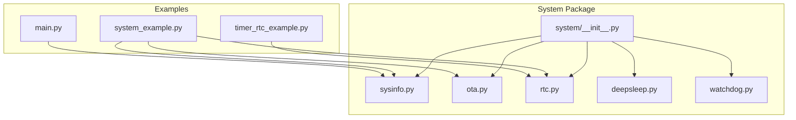
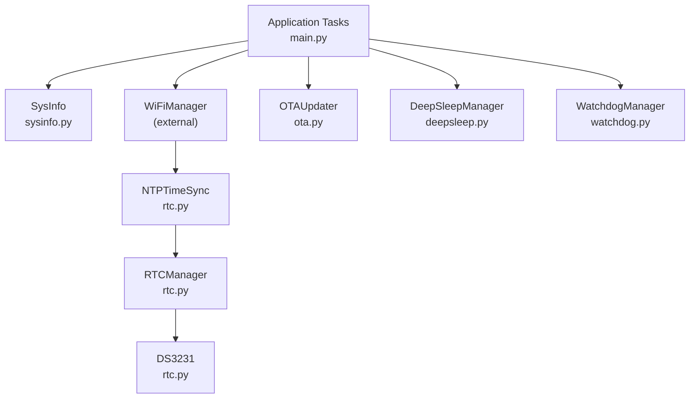
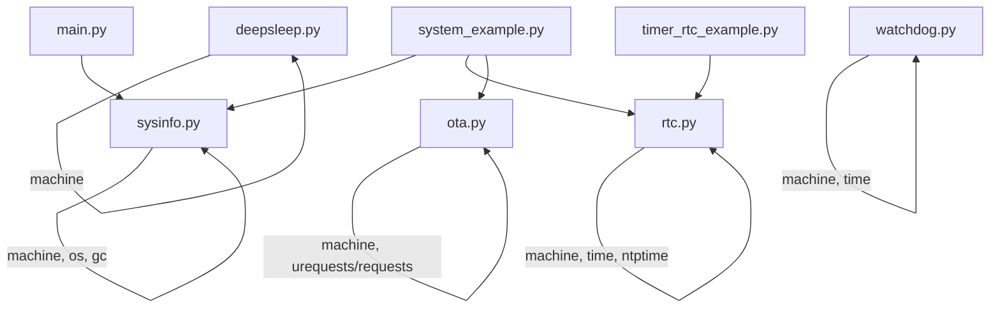

# System API

<cite>
**Referenced Files in This Document**
- [system/__init__.py](file://src/lib/system/__init__.py)
- [sysinfo.py](file://src/lib/system/sysinfo.py)
- [ota.py](file://src/lib/system/ota.py)
- [rtc.py](file://src/lib/system/rtc.py)
- [deepsleep.py](file://src/lib/system/deepsleep.py)
- [watchdog.py](file://src/lib/system/watchdog.py)
- [system_example.py](file://src/main/examples/system_example.py)
- [timer_rtc_example.py](file://src/main/examples/timer_rtc_example.py)
- [main.py](file://src/main/main.py)
</cite>

## Table of Contents
1. [Introduction](#introduction)
2. [Project Structure](#project-structure)
3. [Core Components](#core-components)
4. [Architecture Overview](#architecture-overview)
5. [Detailed Component Analysis](#detailed-component-analysis)
6. [Dependency Analysis](#dependency-analysis)
7. [Performance Considerations](#performance-considerations)
8. [Troubleshooting Guide](#troubleshooting-guide)
9. [Conclusion](#conclusion)
10. [Appendices](#appendices)

## Introduction
This document provides comprehensive API documentation for the system utility modules designed for embedded MicroPython environments on ESP32-C3 devices. It covers system information retrieval, over-the-air (OTA) firmware updates, real-time clock (RTC) management with NTP synchronization, deep sleep power optimization, watchdog protection, and system monitoring. For each module, we detail method signatures, parameters, operational constraints, return values, usage examples, and integration guidelines with other system components.

## Project Structure
The system utilities are organized under the system package and exposed via a consolidated import interface. Example scripts demonstrate usage patterns for system monitoring, RTC/NTP synchronization, and OTA update workflows.

**Diagram sources**
- [system/__init__.py:1-6](file://src/lib/system/__init__.py#L1-L6)
- [sysinfo.py:1-64](file://src/lib/system/sysinfo.py#L1-L64)
- [ota.py:1-67](file://src/lib/system/ota.py#L1-L67)
- [rtc.py:1-236](file://src/lib/system/rtc.py#L1-L236)
- [deepsleep.py:1-47](file://src/lib/system/deepsleep.py#L1-L47)
- [watchdog.py:1-38](file://src/lib/system/watchdog.py#L1-L38)
- [system_example.py:1-43](file://src/main/examples/system_example.py#L1-L43)
- [timer_rtc_example.py:1-284](file://src/main/examples/timer_rtc_example.py#L1-L284)
- [main.py:1-84](file://src/main/main.py#L1-L84)

**Section sources**
- [system/__init__.py:1-6](file://src/lib/system/__init__.py#L1-L6)
- [system_example.py:1-43](file://src/main/examples/system_example.py#L1-L43)
- [timer_rtc_example.py:1-284](file://src/main/examples/timer_rtc_example.py#L1-L284)
- [main.py:1-84](file://src/main/main.py#L1-L84)

## Core Components
This section summarizes the primary system modules and their responsibilities:
- SysInfo: Retrieves CPU frequency, chip identifier, reset cause, wake reason, memory statistics, and filesystem usage.
- OTAUpdater: Downloads firmware images from HTTP endpoints and prepares installation.
- RTCManager and RTCFactory: Manage built-in and external DS3231 RTCs, with NTP synchronization support.
- DeepSleepManager: Controls deep sleep modes and wake sources.
- WatchdogManager: Wraps hardware watchdog timers with manual and automatic feeding.

Key integration points:
- SysInfo is used by the main application for periodic system monitoring.
- RTCManager integrates with WiFi connectivity for NTP synchronization.
- OTAUpdater relies on HTTP transport and requires sufficient filesystem space for staged updates.
- DeepSleepManager coordinates power optimization with wake triggers.
- WatchdogManager safeguards long-running tasks and protects against hangs.

**Section sources**
- [sysinfo.py:10-64](file://src/lib/system/sysinfo.py#L10-L64)
- [ota.py:13-67](file://src/lib/system/ota.py#L13-L67)
- [rtc.py:62-236](file://src/lib/system/rtc.py#L62-L236)
- [deepsleep.py:8-47](file://src/lib/system/deepsleep.py#L8-L47)
- [watchdog.py:9-38](file://src/lib/system/watchdog.py#L9-L38)
- [main.py:38-44](file://src/main/main.py#L38-L44)

## Architecture Overview
The system utilities form a cohesive layer for device lifecycle and runtime management. The diagram below illustrates how modules interact and how examples integrate them into applications.

**Diagram sources**
- [main.py:38-44](file://src/main/main.py#L38-L44)
- [rtc.py:62-236](file://src/lib/system/rtc.py#L62-L236)
- [ota.py:13-67](file://src/lib/system/ota.py#L13-L67)
- [deepsleep.py:8-47](file://src/lib/system/deepsleep.py#L8-L47)
- [watchdog.py:9-38](file://src/lib/system/watchdog.py#L9-L38)

## Detailed Component Analysis

### SysInfo API
Purpose:
- Provide runtime diagnostics and system metrics for monitoring and diagnostics.

Methods and Signatures:
- cpu_freq_hz() -> int
  - Returns CPU frequency in Hertz.
- chip_id_hex() -> str
  - Returns the device’s unique chip identifier as a hexadecimal string.
- reset_cause() -> int
  - Returns the reason for the last reset.
- wake_reason() -> int | None
  - Returns the wake reason if supported; otherwise None.
- mem_free() -> int
  - Returns free heap memory in bytes after garbage collection.
- mem_alloc() -> int
  - Returns allocated heap memory in bytes after garbage collection.
- fs_usage(path="/") -> dict
  - Returns filesystem usage statistics: total, used, free bytes.
- all() -> dict
  - Aggregates all metrics into a single dictionary.

Operational Constraints:
- Memory and filesystem queries trigger garbage collection to ensure accurate readings.
- wake_reason() is platform-dependent and may return None if unsupported.

Usage Example:
- Periodic system monitoring task prints free memory and CPU frequency.

**Section sources**
- [sysinfo.py:10-64](file://src/lib/system/sysinfo.py#L10-L64)
- [main.py:38-44](file://src/main/main.py#L38-L44)

### OTAUpdater API
Purpose:
- Download firmware images over HTTP and prepare for installation.

Constructor and Methods:
- __init__(firmware_url: str = None, download_path: str = "/update.bin")
  - Initializes OTA updater with optional firmware URL and target download path.
- set_url(firmware_url: str) -> None
  - Updates the firmware URL.
- download(firmware_url: str = None, chunk_size: int = 1024) -> int
  - Streams firmware from HTTP endpoint to local file; returns total bytes written.
  - Raises RuntimeError if HTTP module is unavailable or download fails.
- verify_min_size(min_bytes: int = 64 * 1024) -> bool
  - Checks if downloaded image meets minimum size requirement.
- schedule_install_notice() -> None
  - Prints guidance for installing the staged firmware.
- reboot(delay_ms: int = 500) -> None
  - Resets the device after a short delay.

Operational Constraints:
- Requires HTTP transport module; raises error if unavailable.
- Firmware URL must be provided either at construction or during download.
- Minimum firmware size verification ensures robustness against truncated downloads.

Usage Example:
- Initialize OTAUpdater with a firmware URL and optionally download firmware.

**Section sources**
- [ota.py:13-67](file://src/lib/system/ota.py#L13-L67)
- [system_example.py:28-34](file://src/main/examples/system_example.py#L28-L34)

### RTCManager and RTCFactory API
Purpose:
- Manage internal and external RTC sources, synchronize time via NTP, and back up to external RTC.

Classes and Methods:
- DS3231
  - __init__(sda: int = 21, scl: int = 22, address: int = 0x68, i2c: machine.I2C = None)
  - datetime() -> tuple
  - set_datetime(dt: tuple) -> None
- RTCManager
  - __init__() -> None
  - set_external_rtc(ds: DS3231) -> None
  - get_datetime() -> tuple
  - set_datetime(dt: tuple) -> None
  - sync_ntp(timezone_offset_hours: int = 7) -> tuple
  - sync_to_ds3231(ds: DS3231) -> None
  - sync_from_ds3231(ds: DS3231) -> tuple
- RTCFactory
  - create(sda: int = 21, scl: int = 22, ds3231_addr: int = 0x68, i2c: machine.I2C = None) -> RTCManager
  - create_default() -> RTCManager
- NTPTimeSync
  - __init__(rtc_manager: RTCManager, timezone_offset: int = 7)
  - sync(retries: int = 3) -> bool
  - get_last_sync_time(rtc_manager: RTCManager = None) -> tuple

Operational Constraints:
- NTP synchronization requires network connectivity.
- External DS3231 detection validates presence via I2C read and sanity checks.
- Timezone offset is applied when syncing to local time.

Usage Examples:
- Factory pattern auto-detects DS3231 or falls back to internal RTC.
- NTP synchronization with retries and optional external RTC backup.
- Manual time setting and restoration from external RTC.

**Section sources**
- [rtc.py:10-236](file://src/lib/system/rtc.py#L10-L236)
- [system_example.py:20-26](file://src/main/examples/system_example.py#L20-L26)
- [timer_rtc_example.py:175-229](file://src/main/examples/timer_rtc_example.py#L175-L229)
- [timer_rtc_example.py:234-259](file://src/main/examples/timer_rtc_example.py#L234-L259)

### DeepSleepManager API
Purpose:
- Control deep sleep modes and configure wake sources for power optimization.

Methods and Signatures:
- sleep_ms(ms: int) -> None
  - Enters deep sleep for the specified duration.
- sleep_forever() -> None
  - Enters indefinite deep sleep.
- reset_cause() -> int
  - Returns the reason for the last reset.
- wake_reason() -> int | None
  - Returns the wake reason if supported; otherwise None.
- pin_wake(pin_num: int, trigger=None) -> None
  - Configures external wake from GPIO pin; raises if platform does not support.
- touch_wake(touchpad) -> None
  - Enables touch wake if supported; raises if platform does not support.

Operational Constraints:
- Pin wake configuration depends on platform capabilities.
- Touch wake availability varies by hardware.

Usage Example:
- Configure pin wake and enter deep sleep for periodic tasks.

**Section sources**
- [deepsleep.py:8-47](file://src/lib/system/deepsleep.py#L8-L47)

### WatchdogManager API
Purpose:
- Wrap hardware watchdog to prevent system hangs and ensure safe operation.

Methods and Signatures:
- __init__(timeout_ms: int = 8000, auto_feed: bool = False, feed_interval_ms: int = 1000)
- feed() -> None
  - Refreshes the watchdog timer.
- start_auto_feed() -> None
  - Starts a background loop that periodically feeds the watchdog until stopped.
- stop_auto_feed() -> None
  - Stops automatic feeding.
- run_guarded(func, *args, **kwargs) -> any
  - Executes a function and feeds the watchdog upon successful completion; re-raises exceptions without feeding.

Operational Constraints:
- Automatic feeding runs in a blocking loop; ensure proper stopping to avoid conflicts.
- Exception handling prevents feeding on failures for fail-safe resets.

Usage Example:
- Protect long-running operations with guarded execution.

**Section sources**
- [watchdog.py:9-38](file://src/lib/system/watchdog.py#L9-L38)

## Dependency Analysis
The system modules depend on MicroPython built-ins and optional external libraries. The diagram below shows import and usage relationships.

**Diagram sources**
- [sysinfo.py:5-7](file://src/lib/system/sysinfo.py#L5-L7)
- [ota.py:5-10](file://src/lib/system/ota.py#L5-L10)
- [rtc.py:6-8](file://src/lib/system/rtc.py#L6-L8)
- [deepsleep.py:5](file://src/lib/system/deepsleep.py#L5)
- [watchdog.py:5-6](file://src/lib/system/watchdog.py#L5-L6)
- [system_example.py:8-12](file://src/main/examples/system_example.py#L8-L12)
- [timer_rtc_example.py:175-229](file://src/main/examples/timer_rtc_example.py#L175-L229)
- [main.py:12](file://src/main/main.py#L12)

**Section sources**
- [sysinfo.py:5-7](file://src/lib/system/sysinfo.py#L5-L7)
- [ota.py:5-10](file://src/lib/system/ota.py#L5-L10)
- [rtc.py:6-8](file://src/lib/system/rtc.py#L6-L8)
- [deepsleep.py:5](file://src/lib/system/deepsleep.py#L5)
- [watchdog.py:5-6](file://src/lib/system/watchdog.py#L5-L6)
- [system_example.py:8-12](file://src/main/examples/system_example.py#L8-L12)
- [timer_rtc_example.py:175-229](file://src/main/examples/timer_rtc_example.py#L175-L229)
- [main.py:12](file://src/main/main.py#L12)

## Performance Considerations
- SysInfo memory queries trigger garbage collection; batch reads and avoid frequent polling to reduce overhead.
- OTA download streaming uses configurable chunk sizes; larger chunks improve throughput but increase memory usage during transfer.
- RTC NTP synchronization involves network operations; apply retries and ensure WiFi connectivity before attempting sync.
- Deep sleep reduces power consumption; configure appropriate wake sources to balance responsiveness and energy savings.
- Watchdog auto-feed loops block execution; use guarded execution for short tasks or manage lifecycles carefully to avoid contention.

[No sources needed since this section provides general guidance]

## Troubleshooting Guide
Common issues and resolutions:
- OTA download failures:
  - Ensure HTTP transport module is available and firmware URL is valid.
  - Verify filesystem capacity and use minimum size verification before installation.
- NTP synchronization errors:
  - Confirm WiFi connectivity before sync attempts.
  - Adjust timezone offsets and retry on failure.
- External DS3231 detection:
  - Validate I2C wiring and address; sanity-check returned timestamps.
- Deep sleep wake sources:
  - Confirm platform support for configured wake triggers.
- Watchdog behavior:
  - Use guarded execution to ensure feeding on success; disable auto-feed to prevent interference.

**Section sources**
- [ota.py:22-28](file://src/lib/system/ota.py#L22-L28)
- [rtc.py:190-225](file://src/lib/system/rtc.py#L190-L225)
- [rtc.py:128-150](file://src/lib/system/rtc.py#L128-L150)
- [deepsleep.py:33-46](file://src/lib/system/deepsleep.py#L33-L46)
- [watchdog.py:20-29](file://src/lib/system/watchdog.py#L20-L29)

## Conclusion
The system utility modules provide essential capabilities for monitoring, updating, synchronizing time, optimizing power, and safeguarding operations on ESP32-C3 devices. By integrating SysInfo for diagnostics, OTAUpdater for firmware updates, RTCManager/RTCFactory for timekeeping, DeepSleepManager for power optimization, and WatchdogManager for reliability, developers can build robust and maintainable embedded applications.

[No sources needed since this section summarizes without analyzing specific files]

## Appendices

### API Reference Tables

- SysInfo
  - Methods: cpu_freq_hz(), chip_id_hex(), reset_cause(), wake_reason(), mem_free(), mem_alloc(), fs_usage(path="/"), all()
  - Typical return types: int, str, dict
  - Notes: wake_reason() may return None on unsupported platforms

- OTAUpdater
  - Methods: __init__(), set_url(), download(), verify_min_size(), schedule_install_notice(), reboot()
  - Typical return types: int (bytes), bool, None
  - Notes: Requires HTTP transport; minimum firmware size verification recommended

- RTCManager / RTCFactory / NTPTimeSync
  - Methods: DS3231.datetime(), DS3231.set_datetime(), RTCManager.get_datetime(), RTCManager.set_datetime(), RTCManager.sync_ntp(), RTCManager.sync_to_ds3231(), RTCManager.sync_from_ds3231(), RTCFactory.create(), RTCFactory.create_default(), NTPTimeSync.sync(), NTPTimeSync.get_last_sync_time()
  - Typical return types: tuple (datetime), bool, dict
  - Notes: NTP requires WiFi; DS3231 detection uses sanity checks

- DeepSleepManager
  - Methods: sleep_ms(), sleep_forever(), reset_cause(), wake_reason(), pin_wake(), touch_wake()
  - Typical return types: None, int
  - Notes: Platform-dependent wake APIs

- WatchdogManager
  - Methods: __init__(), feed(), start_auto_feed(), stop_auto_feed(), run_guarded()
  - Typical return types: None, any
  - Notes: Exception handling controls feeding behavior

**Section sources**
- [sysinfo.py:10-64](file://src/lib/system/sysinfo.py#L10-L64)
- [ota.py:13-67](file://src/lib/system/ota.py#L13-L67)
- [rtc.py:62-236](file://src/lib/system/rtc.py#L62-L236)
- [deepsleep.py:8-47](file://src/lib/system/deepsleep.py#L8-L47)
- [watchdog.py:9-38](file://src/lib/system/watchdog.py#L9-L38)

### Usage Examples Index
- System monitoring:
  - Periodic reporting of free memory and CPU frequency.
- OTA firmware update:
  - Initialize OTAUpdater with firmware URL and download firmware.
- RTC and NTP:
  - Factory pattern selection of DS3231 or internal RTC.
  - NTP synchronization with timezone offset and external backup.
- Power optimization:
  - Configure pin wake and enter deep sleep for periodic tasks.
- Reliability:
  - Guarded execution with watchdog feeding for long operations.

**Section sources**
- [main.py:38-44](file://src/main/main.py#L38-L44)
- [system_example.py:28-34](file://src/main/examples/system_example.py#L28-L34)
- [timer_rtc_example.py:175-229](file://src/main/examples/timer_rtc_example.py#L175-L229)
- [timer_rtc_example.py:234-259](file://src/main/examples/timer_rtc_example.py#L234-L259)
- [deepsleep.py:12-19](file://src/lib/system/deepsleep.py#L12-L19)
- [watchdog.py:30-38](file://src/lib/system/watchdog.py#L30-L38)