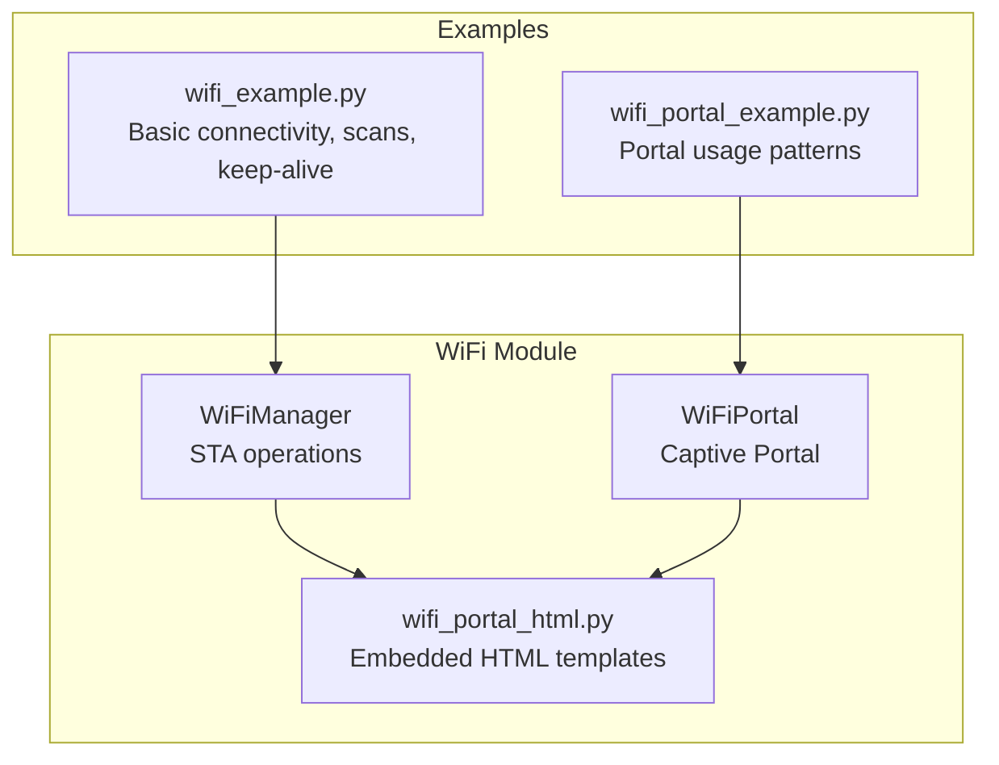
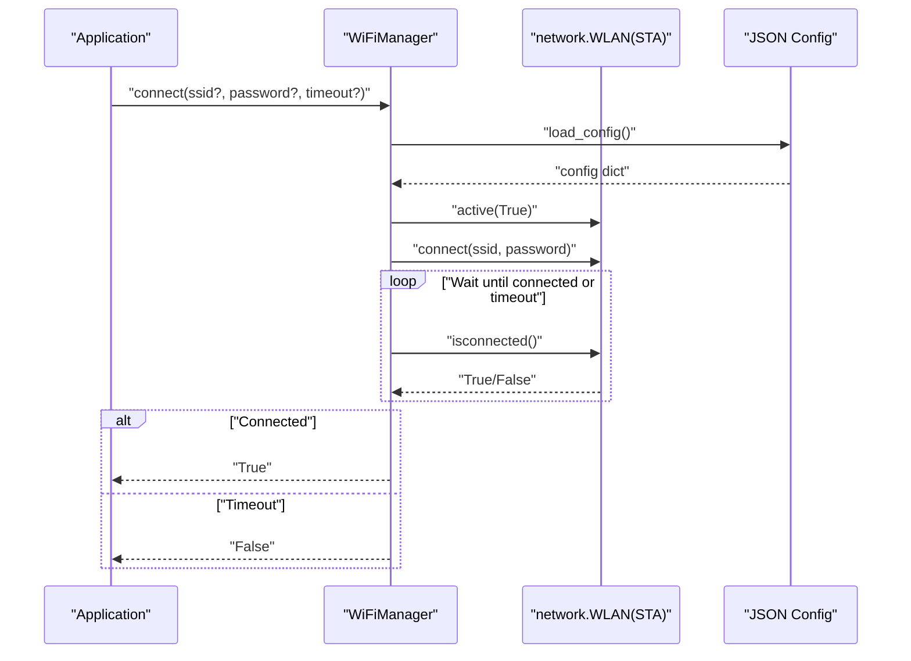
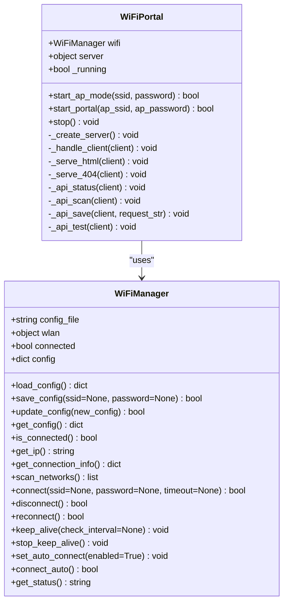
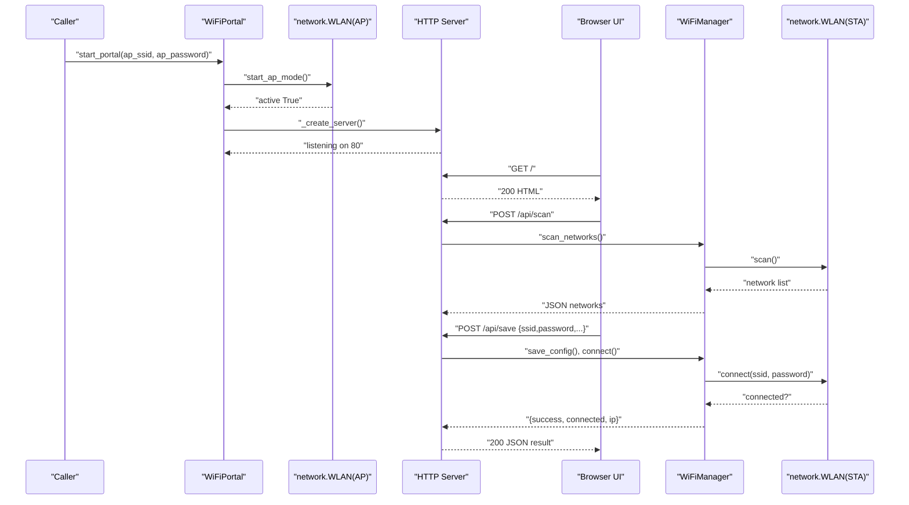
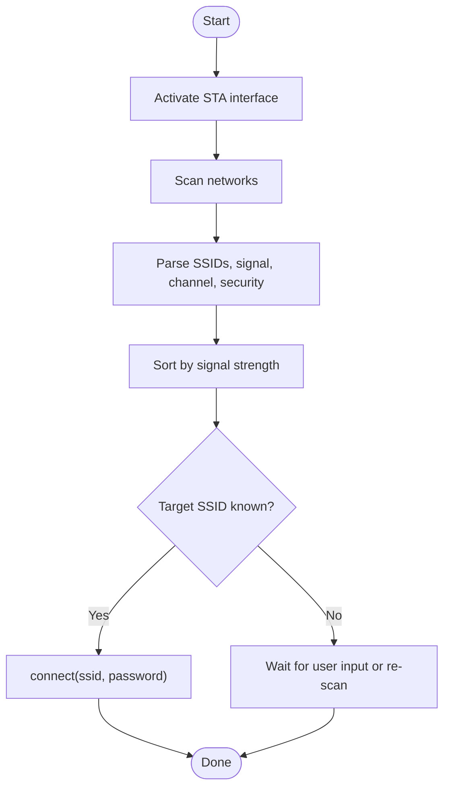
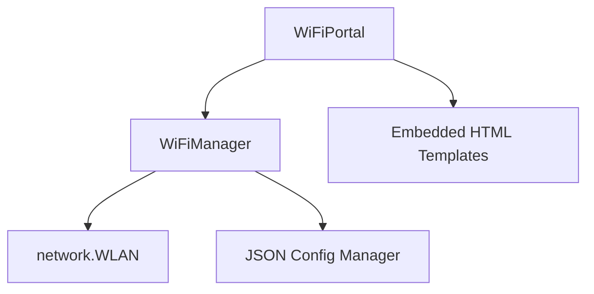

# WiFi API

<cite>
**Referenced Files in This Document**
- [wifimanager.py](file://src/lib/wifi/wifimanager.py)
- [wifi_example.py](file://src/main/examples/wifi_example.py)
- [wifi_portal_example.py](file://src/main/examples/wifi_portal_example.py)
- [README_WIFI_MODULE.md](file://src/main/README_WIFI_MODULE.md)
- [README.md](file://src/lib/wifi/README.md)
- [wifi_portal_html.py](file://src/lib/wifi/wifi_portal_html.py)
</cite>

## Table of Contents
1. [Introduction](#introduction)
2. [Project Structure](#project-structure)
3. [Core Components](#core-components)
4. [Architecture Overview](#architecture-overview)
5. [Detailed Component Analysis](#detailed-component-analysis)
6. [Dependency Analysis](#dependency-analysis)
7. [Performance Considerations](#performance-considerations)
8. [Troubleshooting Guide](#troubleshooting-guide)
9. [Conclusion](#conclusion)
10. [Appendices](#appendices)

## Introduction
This document provides comprehensive API documentation for the WiFi management modules targeting ESP32-C3 devices using MicroPython. It focuses on the WiFiManager class for station (STA) mode network configuration, connection handling, and keep-alive monitoring, as well as the WiFiPortal class for captive portal setup and web-based configuration. The documentation covers network scanning, credential management, AP mode configuration, STA mode operations, connection state monitoring, timeout/retry behavior, and practical usage examples.

## Project Structure
The WiFi module resides under src/lib/wifi and includes:
- wifimanager.py: Core WiFiManager and WiFiPortal classes, configuration persistence, and HTTP portal server
- wifi_portal_html.py: Embedded HTML/CSS/JS templates for the captive portal
- README.md: High-level library usage guide
- Examples under src/main/examples: wifi_example.py and wifi_portal_example.py demonstrate real-world usage patterns

**Diagram sources**
- [wifimanager.py:38-397](file://src/lib/wifi/wifimanager.py#L38-L397)
- [wifi_portal_html.py:6-534](file://src/lib/wifi/wifi_portal_html.py#L6-L534)
- [wifi_example.py:13-338](file://src/main/examples/wifi_example.py#L13-L338)
- [wifi_portal_example.py:13-350](file://src/main/examples/wifi_portal_example.py#L13-L350)

**Section sources**
- [wifimanager.py:1-800](file://src/lib/wifi/wifimanager.py#L1-L800)
- [README.md:1-226](file://src/lib/wifi/README.md#L1-L226)

## Core Components
- WiFiManager: Provides STA mode connectivity, configuration persistence, scanning, connection control, keep-alive monitoring, and status reporting.
- WiFiPortal: Creates an AP and serves a web UI to configure WiFi credentials and options, then connects automatically.

Key capabilities:
- Load/save/update configuration via JSON or a JSON config manager abstraction
- Scan nearby networks and present signal strength, channel, and security indicators
- Connect/disconnect/reconnect with configurable timeouts and retry intervals
- Keep-alive mode to monitor and restore connectivity
- Status and connection info retrieval
- AP mode creation for captive portal setup

**Section sources**
- [wifimanager.py:38-397](file://src/lib/wifi/wifimanager.py#L38-L397)
- [wifimanager.py:478-791](file://src/lib/wifi/wifimanager.py#L478-L791)

## Architecture Overview
The WiFi subsystem integrates MicroPython’s network.WLAN with asynchronous I/O and optional JSON configuration persistence. The WiFiPortal builds an embedded HTTP server to serve a responsive UI for configuration.

**Diagram sources**
- [wifimanager.py:226-291](file://src/lib/wifi/wifimanager.py#L226-L291)

**Section sources**
- [wifimanager.py:18-36](file://src/lib/wifi/wifimanager.py#L18-L36)

## Detailed Component Analysis

### WiFiManager API Reference
Constructor
- WiFiManager(config_file="wifi_config.json")

Methods
- load_config(): Loads configuration from JSON or JSON config manager. Returns current config dict.
- save_config(ssid=None, password=None): Saves configuration with defaults for auto_connect, timeout, reconnect, reconnect_interval. Returns bool.
- update_config(new_config): Updates current config and persists. Returns bool.
- get_config(): Returns a copy of current configuration.
- is_connected(): Returns bool indicating connection status.
- get_ip(): Returns current IP string or None.
- get_connection_info(): Returns dict with connection details (connected, ip, subnet, gateway, dns, mac, ssid).
- scan_networks(): Asynchronously scans and returns list of networks with ssid, signal (dBm), channel, secure flag.
- connect(ssid=None, password=None, timeout=None): Attempts connection with provided or stored credentials and timeout. Returns bool.
- disconnect(): Disconnects and returns bool.
- reconnect(): Disconnects then reconnects using current config. Returns bool.
- keep_alive(check_interval=None): Runs indefinitely checking connection and reconnecting if needed.
- stop_keep_alive(): Stops keep-alive loop.
- set_auto_connect(enabled=True): Enables/disables auto-connect and persists.
- connect_auto(): Connects if auto_connect is enabled. Returns bool.
- get_status(): Returns human-readable status string.

Return values summary
- Boolean returns indicate success/failure for operations that can fail.
- Connection info dict includes network interface details and identifiers.
- Scanning returns a list of dictionaries with network metadata.

Parameters and options
- SSID/password handling: Accepts per-call overrides or reads from persisted config.
- Security types: Scanning reports whether a network is secured; AP mode uses WPA/WPA2 PSK.
- Channel configuration: Exposed via scan results; selection can be manual or automated.
- IP assignment: Provided by wlan.ifconfig(); managed by router/DHCP.

Timeouts and retries
- connect() honors a per-call timeout or falls back to configured timeout.
- keep_alive() uses reconnect_interval from config; configurable per call.
- reconnect() performs a controlled disconnect followed by connect.

Error handling patterns
- Graceful fallbacks when configuration file is missing or unreadable.
- Robust exception handling during JSON save/load and network operations.
- Clear logging messages for operational feedback.

Usage examples
- Basic connectivity and IP retrieval
- Scanning networks and connecting to a chosen SSID
- Keep-alive mode for robust operation
- Multiple configuration files for different environments
- Integration with HTTP requests after successful connection

**Section sources**
- [wifimanager.py:57-397](file://src/lib/wifi/wifimanager.py#L57-L397)
- [README_WIFI_MODULE.md:163-270](file://src/main/README_WIFI_MODULE.md#L163-L270)
- [wifi_example.py:13-338](file://src/main/examples/wifi_example.py#L13-L338)

### WiFiPortal API Reference
Constructor
- WiFiPortal(config_file="wifi_config.json")

Methods
- start_ap_mode(ssid="ESP32-Setup", password="12345678"): Activates AP mode with WPA/WPA2 PSK and returns bool.
- start_portal(ap_ssid, ap_password): Starts AP mode, creates HTTP server, and serves the captive portal UI.
- stop(): Stops HTTP server and deactivates AP mode.
- Internal handlers: _create_server(), _handle_client(), _serve_html(), _serve_404(), _api_status(), _api_scan(), _api_save(), _api_test()

Captive portal features
- Responsive UI for selecting SSID, entering password, and advanced options
- Live scanning of nearby networks with signal strength visualization
- Real-time status updates and connection testing
- Automatic saving of configuration and immediate connection attempt

**Section sources**
- [wifimanager.py:478-791](file://src/lib/wifi/wifimanager.py#L478-L791)
- [wifi_portal_html.py:6-534](file://src/lib/wifi/wifi_portal_html.py#L6-L534)
- [wifi_portal_example.py:13-350](file://src/main/examples/wifi_portal_example.py#L13-L350)

### Class Relationship Diagram

**Diagram sources**
- [wifimanager.py:38-397](file://src/lib/wifi/wifimanager.py#L38-L397)
- [wifimanager.py:478-791](file://src/lib/wifi/wifimanager.py#L478-L791)

**Section sources**
- [wifimanager.py:38-397](file://src/lib/wifi/wifimanager.py#L38-L397)
- [wifimanager.py:478-791](file://src/lib/wifi/wifimanager.py#L478-L791)

### Connection Flow Sequence

**Diagram sources**
- [wifimanager.py:495-771](file://src/lib/wifi/wifimanager.py#L495-L771)
- [wifimanager.py:635-721](file://src/lib/wifi/wifimanager.py#L635-L721)
- [wifi_portal_html.py:6-534](file://src/lib/wifi/wifi_portal_html.py#L6-L534)

**Section sources**
- [wifimanager.py:495-771](file://src/lib/wifi/wifimanager.py#L495-L771)
- [wifimanager.py:635-721](file://src/lib/wifi/wifimanager.py#L635-L721)

### Scanning and Selection Flow

**Diagram sources**
- [wifimanager.py:192-224](file://src/lib/wifi/wifimanager.py#L192-L224)
- [wifimanager.py:226-291](file://src/lib/wifi/wifimanager.py#L226-L291)

**Section sources**
- [wifimanager.py:192-291](file://src/lib/wifi/wifimanager.py#L192-L291)

## Dependency Analysis
- WiFiManager depends on MicroPython’s network.WLAN for STA/AP operations and optionally on a JSON config manager abstraction for persistent storage.
- WiFiPortal depends on WiFiManager and serves an embedded HTML UI with JavaScript to communicate with internal HTTP endpoints.
- Examples demonstrate usage patterns and integration with asyncio tasks.

**Diagram sources**
- [wifimanager.py:18-36](file://src/lib/wifi/wifimanager.py#L18-L36)
- [wifimanager.py:478-791](file://src/lib/wifi/wifimanager.py#L478-L791)
- [wifi_portal_html.py:6-534](file://src/lib/wifi/wifi_portal_html.py#L6-L534)

**Section sources**
- [wifimanager.py:18-36](file://src/lib/wifi/wifimanager.py#L18-L36)
- [wifimanager.py:478-791](file://src/lib/wifi/wifimanager.py#L478-L791)

## Performance Considerations
- Keep-alive interval: Choose a balance between responsiveness and resource usage; typical values between 15–60 seconds.
- Scanning frequency: Limit scans to reduce power consumption; cache results and refresh periodically.
- AP mode: Serving a web UI consumes additional power; disable when not needed.
- Async I/O: Use asyncio tasks to avoid blocking and enable concurrent operations.
- Memory footprint: The portal UI requires additional RAM; ensure sufficient heap space.

[No sources needed since this section provides general guidance]

## Troubleshooting Guide
Common issues and resolutions
- Cannot connect to WiFi:
  - Verify SSID and password correctness.
  - Confirm router availability and signal strength.
  - Increase timeout via configuration.
- Configuration not saved:
  - Check filesystem permissions and available storage.
  - Ensure the JSON file path is writable.
- Keep-alive not functioning:
  - Confirm keep_alive() is running and not stopped.
  - Validate reconnect_interval and network stability.
- Portal not opening:
  - Ensure AP mode activation succeeds.
  - Confirm firmware supports AP mode and sufficient memory.
  - Reduce concurrent services to free memory.
- Cannot access the web UI:
  - Connect to the AP SSID and open http://192.168.4.1.
  - Restart the portal and refresh the browser.

**Section sources**
- [README_WIFI_MODULE.md:438-462](file://src/main/README_WIFI_MODULE.md#L438-L462)

## Conclusion
The WiFi module provides a robust, asynchronous solution for STA connectivity and captive portal configuration on ESP32-C3. WiFiManager encapsulates essential operations—configuration persistence, scanning, connection control, and keep-alive monitoring—while WiFiPortal delivers a user-friendly web interface for setup. Together, they support reliable network management with clear APIs, comprehensive examples, and practical troubleshooting guidance.

[No sources needed since this section summarizes without analyzing specific files]

## Appendices

### Configuration Options
- ssid: WiFi network name
- password: WiFi password
- auto_connect: Enable/disable automatic connection at startup
- timeout: Connection timeout in seconds
- reconnect: Enable/disable automatic reconnection on link loss
- reconnect_interval: Interval between reconnection attempts
- hostname: DHCP hostname for STA interface

**Section sources**
- [README_WIFI_MODULE.md:135-162](file://src/main/README_WIFI_MODULE.md#L135-L162)

### Usage Examples Index
- Basic connectivity and IP retrieval
- Direct connection without saving config
- Keep-alive mode with periodic checks
- Scanning networks and connecting
- Concurrent tasks with WiFi
- Multiple configuration files
- HTTP requests after connection
- Status monitoring
- Captive portal setup

**Section sources**
- [wifi_example.py:13-338](file://src/main/examples/wifi_example.py#L13-L338)
- [wifi_portal_example.py:13-350](file://src/main/examples/wifi_portal_example.py#L13-L350)