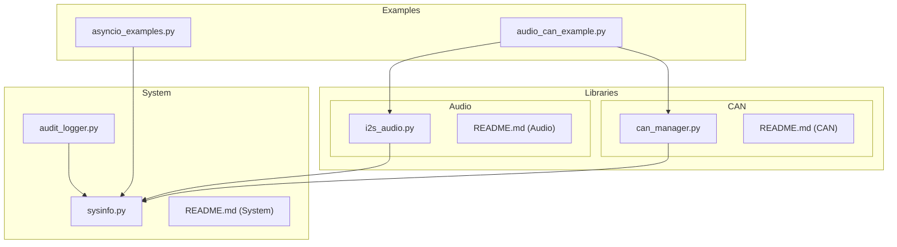
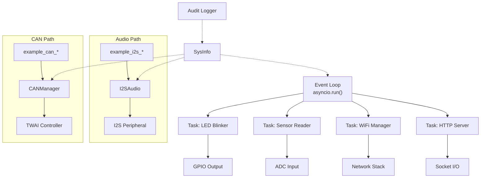
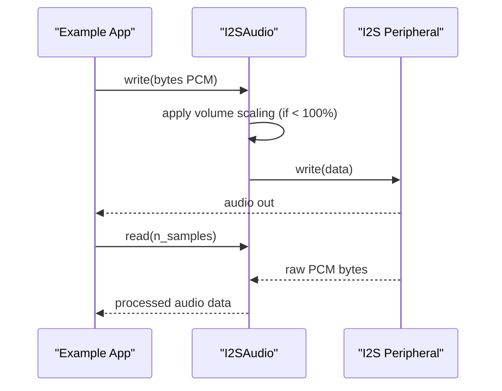
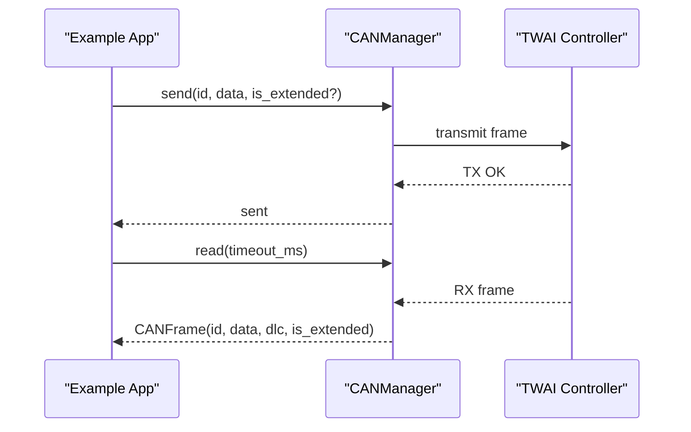
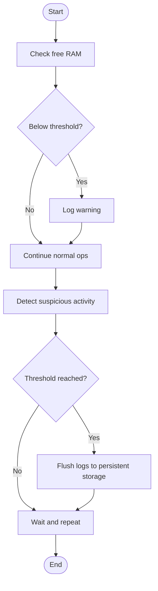
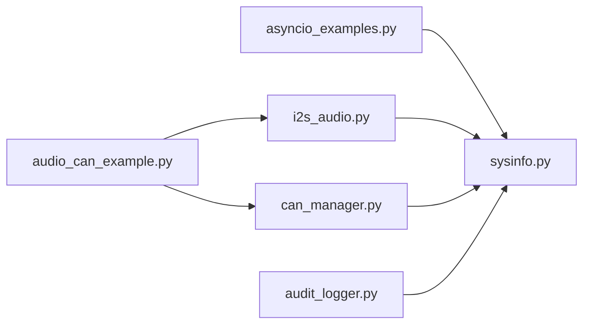

# Advanced Topics

<cite>
**Referenced Files in This Document**
- [asyncio_examples.py](file://src/main/examples/asyncio_examples.py)
- [audio_can_example.py](file://src/main/examples/audio_can_example.py)
- [README_ASYNCIO.md](file://src/main/README_ASYNCIO.md)
- [i2s_audio.py](file://src/lib/audio/i2s_audio.py)
- [README.md](file://src/lib/audio/README.md)
- [can_manager.py](file://src/lib/can/can_manager.py)
- [README.md](file://src/lib/can/README.md)
- [sysinfo.py](file://src/lib/system/sysinfo.py)
- [README.md](file://src/lib/system/README.md)
- [audit_logger.py](file://src/lib/security/audit_logger.py)
</cite>

## Table of Contents
1. [Introduction](#introduction)
2. [Project Structure](#project-structure)
3. [Core Components](#core-components)
4. [Architecture Overview](#architecture-overview)
5. [Detailed Component Analysis](#detailed-component-analysis)
6. [Dependency Analysis](#dependency-analysis)
7. [Performance Considerations](#performance-considerations)
8. [Troubleshooting Guide](#troubleshooting-guide)
9. [Conclusion](#conclusion)
10. [Appendices](#appendices)

## Introduction
This document provides advanced guidance for the ESP32-C3 framework focusing on:
- Asynchronous programming patterns with asyncio task creation, synchronization primitives, and concurrency management
- Error handling and recovery strategies for resilient operation
- Performance optimization for constrained environments (memory, CPU, power)
- Audio processing via I2SAudio with generation, playback, and control
- Industrial communication with CAN bus using TWAI-compatible APIs

It synthesizes practical patterns from the repository’s asyncio examples and audio/CAN demonstrations, and connects them to system-level utilities for monitoring and security.

## Project Structure
The repository organizes advanced topics across example scripts, library modules, and system utilities:
- Examples demonstrate real-world usage of asyncio and protocol modules
- Library modules encapsulate I2S audio and CAN bus functionality
- System utilities provide runtime diagnostics and security logging



**Diagram sources**
- [asyncio_examples.py](file://src/main/examples/asyncio_examples.py)
- [audio_can_example.py](file://src/main/examples/audio_can_example.py)
- [i2s_audio.py](file://src/lib/audio/i2s_audio.py)
- [README.md](file://src/lib/audio/README.md)
- [can_manager.py](file://src/lib/can/can_manager.py)
- [README.md](file://src/lib/can/README.md)
- [sysinfo.py](file://src/lib/system/sysinfo.py)
- [README.md](file://src/lib/system/README.md)
- [audit_logger.py](file://src/lib/security/audit_logger.py)

**Section sources**
- [asyncio_examples.py](file://src/main/examples/asyncio_examples.py)
- [audio_can_example.py](file://src/main/examples/audio_can_example.py)
- [README_ASYNCIO.md](file://src/main/README_ASYNCIO.md)

## Core Components
- Asyncio fundamentals and patterns: event loops, tasks, events, locks, queues, timeouts, stream I/O, and ISR-safe signaling
- I2SAudio: sine wave generation, WAV playback, volume/mute control, and recording
- CAN bus: loopback testing, filtering, OBD-II patterns, and bus state inspection
- System utilities: memory monitoring, CPU frequency, filesystem usage, and audit logging

Key capabilities:
- Concurrency with cooperative multitasking and structured task orchestration
- Robust I/O with non-blocking streams and bounded buffers
- Deterministic timing via sleep_ms and hardware timers
- Diagnostics and security-aware logging

**Section sources**
- [README_ASYNCIO.md](file://src/main/README_ASYNCIO.md)
- [i2s_audio.py](file://src/lib/audio/i2s_audio.py)
- [README.md](file://src/lib/audio/README.md)
- [can_manager.py](file://src/lib/can/can_manager.py)
- [README.md](file://src/lib/can/README.md)
- [sysinfo.py](file://src/lib/system/sysinfo.py)
- [audit_logger.py](file://src/lib/security/audit_logger.py)

## Architecture Overview
The advanced architecture integrates asynchronous control with protocol modules and system monitoring:



**Diagram sources**
- [asyncio_examples.py](file://src/main/examples/asyncio_examples.py)
- [audio_can_example.py](file://src/main/examples/audio_can_example.py)
- [i2s_audio.py](file://src/lib/audio/i2s_audio.py)
- [can_manager.py](file://src/lib/can/can_manager.py)
- [sysinfo.py](file://src/lib/system/sysinfo.py)
- [audit_logger.py](file://src/lib/security/audit_logger.py)

## Detailed Component Analysis

### Asyncio Patterns and Concurrency
- Task creation and lifecycle: create, run, cancel, and clean up tasks
- Synchronization: Event for cross-task signaling, Lock for shared resources, Queue for producer-consumer pipelines
- Timeouts and deadlines: wait_for for robust I/O
- Stream I/O: StreamReader/StreamWriter for UART/TCP
- ISR-safe signaling: ThreadSafeFlag bridges interrupts to async tasks
- Patterns: State Machine, Watchdog, Debounce

```mermaid
sequenceDiagram
participant Main as "Main"
participant Loop as "Event Loop"
participant Blink as "LED Blinker Task"
participant Sensor as "Sensor Reader Task"
participant WiFi as "WiFi Manager Task"
Main->>Loop : asyncio.run(main())
Loop->>Blink : create_task()
Loop->>Sensor : create_task()
Loop->>WiFi : create_task()
par Parallel Execution
Blink->>Loop : await sleep_ms()
Sensor->>Loop : await sleep()
WiFi->>Loop : await sleep()
end
WiFi-->>Main : Connected/IP
Note over Blink,Sensor : Cooperative yielding ensures fairness
```

**Diagram sources**
- [asyncio_examples.py](file://src/main/examples/asyncio_examples.py)
- [README_ASYNCIO.md](file://src/main/README_ASYNCIO.md)

Practical usage references:
- Task orchestration and cleanup in [asyncio_examples.py](file://src/main/examples/asyncio_examples.py)
- Event, Lock, Queue, and wait_for patterns in [README_ASYNCIO.md](file://src/main/README_ASYNCIO.md)

**Section sources**
- [asyncio_examples.py](file://src/main/examples/asyncio_examples.py)
- [README_ASYNCIO.md](file://src/main/README_ASYNCIO.md)

### Audio Processing with I2SAudio
I2SAudio enables:
- Generation of sine waves for tone synthesis
- Playback of WAV files with chunked streaming
- Runtime control of volume, mute, and sample rate
- Recording in RX mode with buffered reads



**Diagram sources**
- [audio_can_example.py](file://src/main/examples/audio_can_example.py)
- [i2s_audio.py](file://src/lib/audio/i2s_audio.py)

Implementation highlights:
- Volume scaling for 16-bit PCM samples
- Non-blocking playback with chunked streaming
- Mute/toggle and dynamic sample rate updates
- Read/read_into for capture modes

**Section sources**
- [audio_can_example.py](file://src/main/examples/audio_can_example.py)
- [i2s_audio.py](file://src/lib/audio/i2s_audio.py)
- [README.md](file://src/lib/audio/README.md)

### CAN Bus Communication with TWAI
CANManager wraps ESP32-C3 TWAI controller to support:
- Standard and extended frame IDs
- Loopback testing for internal verification
- Hardware filtering for selective reception
- OBD-II request/response patterns
- Bus state reporting and deinitialization



**Diagram sources**
- [audio_can_example.py](file://src/main/examples/audio_can_example.py)
- [can_manager.py](file://src/lib/can/can_manager.py)

Usage patterns:
- Loopback echo verification
- Filtered reception with masks
- OBD-II PID requests and simulated responses
- Continuous gateway forwarding between CAN buses

**Section sources**
- [audio_can_example.py](file://src/main/examples/audio_can_example.py)
- [can_manager.py](file://src/lib/can/can_manager.py)
- [README.md](file://src/lib/can/README.md)

### System Resilience and Monitoring
- Health monitoring: memory usage, CPU frequency, filesystem stats
- Audit logging: event buffering, periodic flush, anomaly detection
- Graceful degradation: timeouts, fallbacks, and cleanup on exceptions



**Diagram sources**
- [sysinfo.py](file://src/lib/system/sysinfo.py)
- [audit_logger.py](file://src/lib/security/audit_logger.py)

**Section sources**
- [sysinfo.py](file://src/lib/system/sysinfo.py)
- [README.md](file://src/lib/system/README.md)
- [audit_logger.py](file://src/lib/security/audit_logger.py)

## Dependency Analysis
Inter-module relationships and data/control flow:



**Diagram sources**
- [asyncio_examples.py](file://src/main/examples/asyncio_examples.py)
- [audio_can_example.py](file://src/main/examples/audio_can_example.py)
- [i2s_audio.py](file://src/lib/audio/i2s_audio.py)
- [can_manager.py](file://src/lib/can/can_manager.py)
- [sysinfo.py](file://src/lib/system/sysinfo.py)
- [audit_logger.py](file://src/lib/security/audit_logger.py)

**Section sources**
- [asyncio_examples.py](file://src/main/examples/asyncio_examples.py)
- [audio_can_example.py](file://src/main/examples/audio_can_example.py)
- [i2s_audio.py](file://src/lib/audio/i2s_audio.py)
- [can_manager.py](file://src/lib/can/can_manager.py)
- [sysinfo.py](file://src/lib/system/sysinfo.py)
- [audit_logger.py](file://src/lib/security/audit_logger.py)

## Performance Considerations
- Prefer asyncio.sleep_ms for short delays to reduce overhead
- Limit queue sizes to prevent memory pressure; drop late data if necessary
- Use __slots__ in frequently instantiated classes to reduce memory footprint
- Periodically invoke garbage collection in idle tasks
- Monitor free RAM and trigger mitigation strategies below thresholds
- Tune I2S DMA buffer sizes and chunk sizes for audio workloads
- Use hardware timers for deterministic periodic tasks

[No sources needed since this section provides general guidance]

## Troubleshooting Guide
Common issues and remedies:
- Blocking operations: replace time.sleep with asyncio.sleep or asyncio.sleep_ms
- Unhandled cancellation: always re-raise CancelledError in exception handlers
- Resource contention: protect shared peripherals with asyncio.Lock
- Memory leaks: monitor free RAM and trigger gc.collect() in idle loops
- ISR safety: use ThreadSafeFlag to signal from interrupts to async tasks
- CAN bus errors: verify wiring, termination resistors, and baudrate settings; inspect bus state

**Section sources**
- [README_ASYNCIO.md](file://src/main/README_ASYNCIO.md)
- [sysinfo.py](file://src/lib/system/sysinfo.py)
- [README.md](file://src/lib/can/README.md)

## Conclusion
The ESP32-C3 framework supports advanced embedded scenarios through:
- Structured asyncio concurrency with robust synchronization and timeouts
- Practical audio processing with I2SAudio for generation, playback, and capture
- Industrial-grade CAN communication with TWAI-compliant APIs
- System-level monitoring and security logging for reliable operation

Adopting the patterns and utilities outlined here yields resilient, efficient, and maintainable firmware for professional embedded applications.

[No sources needed since this section summarizes without analyzing specific files]

## Appendices

### Practical Example References
- Asyncio orchestration and cleanup: [asyncio_examples.py](file://src/main/examples/asyncio_examples.py)
- I2S sine generation and WAV playback: [audio_can_example.py](file://src/main/examples/audio_can_example.py)
- CAN loopback, filtering, and OBD-II: [audio_can_example.py](file://src/main/examples/audio_can_example.py)

**Section sources**
- [asyncio_examples.py](file://src/main/examples/asyncio_examples.py)
- [audio_can_example.py](file://src/main/examples/audio_can_example.py)