# Async Programming Patterns

<cite>
**Referenced Files in This Document**
- [asyncio_examples.py](file://src/main/examples/asyncio_examples.py)
- [README_ASYNCIO.md](file://src/main/README_ASYNCIO.md)
- [asyncio.pyi](file://src/stubs/asyncio.pyi)
- [button.py](file://src/lib/input/button.py)
- [battery_monitor.py](file://src/lib/sensors/battery_monitor.py)
- [tjc_hmi.py](file://src/lib/display/tjc_hmi.py)
- [websocket_server.py](file://src/lib/websocket/websocket_server.py)
- [tcp_repl.py](file://src/lib/repl/tcp_repl.py)
- [wifimanager.py](file://src/lib/wifi/wifimanager.py)
</cite>

## Table of Contents
1. [Introduction](#introduction)
2. [Project Structure](#project-structure)
3. [Core Components](#core-components)
4. [Architecture Overview](#architecture-overview)
5. [Detailed Component Analysis](#detailed-component-analysis)
6. [Dependency Analysis](#dependency-analysis)
7. [Performance Considerations](#performance-considerations)
8. [Troubleshooting Guide](#troubleshooting-guide)
9. [Conclusion](#conclusion)
10. [Appendices](#appendices)

## Introduction
This document provides comprehensive guidance for advanced asyncio programming patterns on the ESP32-C3 using MicroPython. It focuses on task creation and management, event synchronization primitives, concurrency patterns, exception handling, and practical examples drawn from the repository. It also covers memory and performance optimization for constrained microcontroller environments, plus debugging and monitoring strategies.

## Project Structure
The repository organizes asyncio-related materials across:
- Examples: runnable patterns and demonstrations
- Documentation: conceptual guides and best practices
- Stubs: type hints for MicroPython asyncio extensions
- Library modules: production-grade async patterns in real subsystems

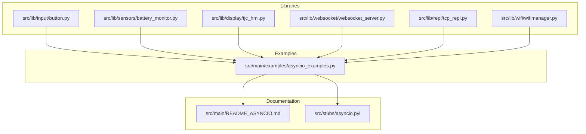

**Diagram sources**
- [asyncio_examples.py:1-234](file://src/main/examples/asyncio_examples.py#L1-L234)
- [README_ASYNCIO.md:1-840](file://src/main/README_ASYNCIO.md#L1-L840)
- [asyncio.pyi:1-28](file://src/stubs/asyncio.pyi#L1-L28)
- [button.py:280-425](file://src/lib/input/button.py#L280-L425)
- [battery_monitor.py:250-291](file://src/lib/sensors/battery_monitor.py#L250-L291)
- [tjc_hmi.py:800-917](file://src/lib/display/tjc_hmi.py#L800-L917)
- [websocket_server.py:235-318](file://src/lib/websocket/websocket_server.py#L235-L318)
- [tcp_repl.py:95-154](file://src/lib/repl/tcp_repl.py#L95-L154)
- [wifimanager.py:750-801](file://src/lib/wifi/wifimanager.py#L750-L801)

**Section sources**
- [asyncio_examples.py:1-234](file://src/main/examples/asyncio_examples.py#L1-L234)
- [README_ASYNCIO.md:1-840](file://src/main/README_ASYNCIO.md#L1-L840)
- [asyncio.pyi:1-28](file://src/stubs/asyncio.pyi#L1-L28)

## Core Components
- Task creation and management: creation via asyncio.create_task(), cancellation, and cleanup
- Parallel execution: asyncio.gather() for coordinated waits
- Timeouts: asyncio.wait_for() for bounded operations
- Synchronization: asyncio.Event, asyncio.Lock, asyncio.Semaphore, asyncio.Condition
- Streams: StreamReader/StreamWriter for async I/O
- Producer/consumer: queues and batching
- Real-world patterns: debouncing, watchdogs, state machines, ISR-safe signaling

**Section sources**
- [README_ASYNCIO.md:113-203](file://src/main/README_ASYNCIO.md#L113-L203)
- [README_ASYNCIO.md:206-271](file://src/main/README_ASYNCIO.md#L206-L271)
- [README_ASYNCIO.md:274-322](file://src/main/README_ASYNCIO.md#L274-L322)
- [README_ASYNCIO.md:325-360](file://src/main/README_ASYNCIO.md#L325-L360)
- [README_ASYNCIO.md:363-430](file://src/main/README_ASYNCIO.md#L363-L430)
- [README_ASYNCIO.md:468-511](file://src/main/README_ASYNCIO.md#L468-L511)
- [README_ASYNCIO.md:515-573](file://src/main/README_ASYNCIO.md#L515-L573)
- [README_ASYNCIO.md:577-620](file://src/main/README_ASYNCIO.md#L577-L620)
- [README_ASYNCIO.md:623-667](file://src/main/README_ASYNCIO.md#L623-L667)

## Architecture Overview
The ESP32-C3 runtime uses cooperative multitasking. Tasks must yield control explicitly via await points. The event loop schedules ready tasks. Libraries and examples demonstrate:
- Creating tasks for concurrent work
- Using gather to coordinate multiple coroutines
- Applying timeouts to prevent stalls
- Synchronizing with events and locks
- Streaming I/O with non-blocking sockets and UART
- Producer/consumer pipelines with queues
- Robust error handling and cancellation

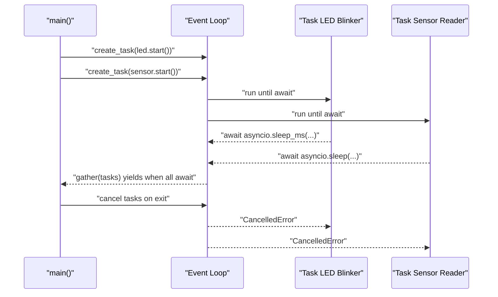

**Diagram sources**
- [asyncio_examples.py:147-193](file://src/main/examples/asyncio_examples.py#L147-L193)

## Detailed Component Analysis

### Task Creation and Management
- Creation: Use asyncio.create_task() to schedule coroutines concurrently without blocking the caller.
- Cancellation: Cancel tasks gracefully and handle CancelledError to perform cleanup.
- Cleanup: Cancel pending tasks and suppress CancelledError after awaiting cancellation.

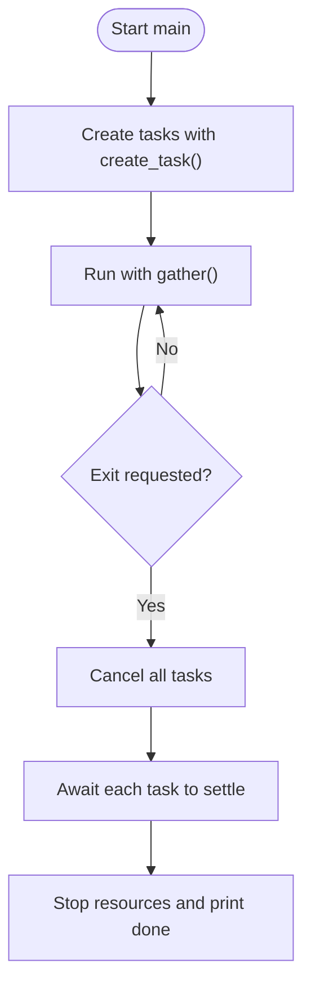

**Diagram sources**
- [asyncio_examples.py:147-193](file://src/main/examples/asyncio_examples.py#L147-L193)

**Section sources**
- [asyncio_examples.py:147-193](file://src/main/examples/asyncio_examples.py#L147-L193)
- [README_ASYNCIO.md:113-172](file://src/main/README_ASYNCIO.md#L113-L172)

### Parallel Execution with asyncio.gather()
- Run multiple coroutines concurrently and wait for all to complete.
- MicroPython’s gather may not support return_exceptions in some versions; validate behavior.

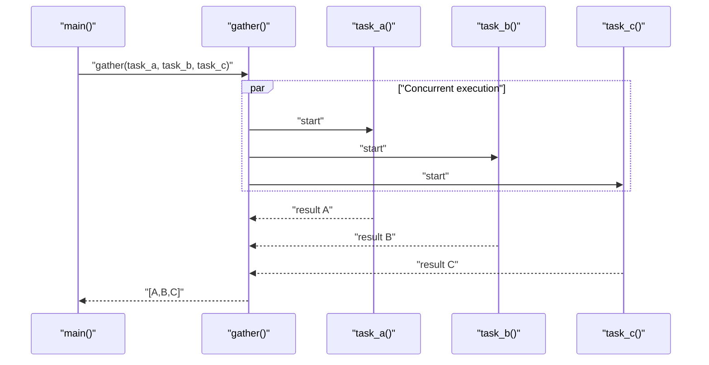

**Diagram sources**
- [README_ASYNCIO.md:175-203](file://src/main/README_ASYNCIO.md#L175-L203)

**Section sources**
- [README_ASYNCIO.md:175-203](file://src/main/README_ASYNCIO.md#L175-L203)

### Timeout Handling with asyncio.wait_for()
- Bound operations to avoid indefinite stalls.
- Handle TimeoutError and continue execution safely.

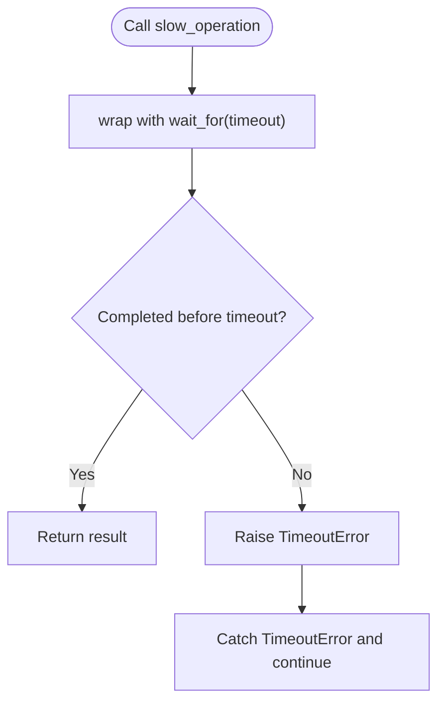

**Diagram sources**
- [README_ASYNCIO.md:325-360](file://src/main/README_ASYNCIO.md#L325-L360)

**Section sources**
- [README_ASYNCIO.md:325-360](file://src/main/README_ASYNCIO.md#L325-L360)
- [tcp_repl.py:100-125](file://src/lib/repl/tcp_repl.py#L100-L125)

### Event Synchronization with asyncio.Event
- Signal between tasks using Event.set() and Event.wait().
- Clear events between cycles to avoid missed signals.

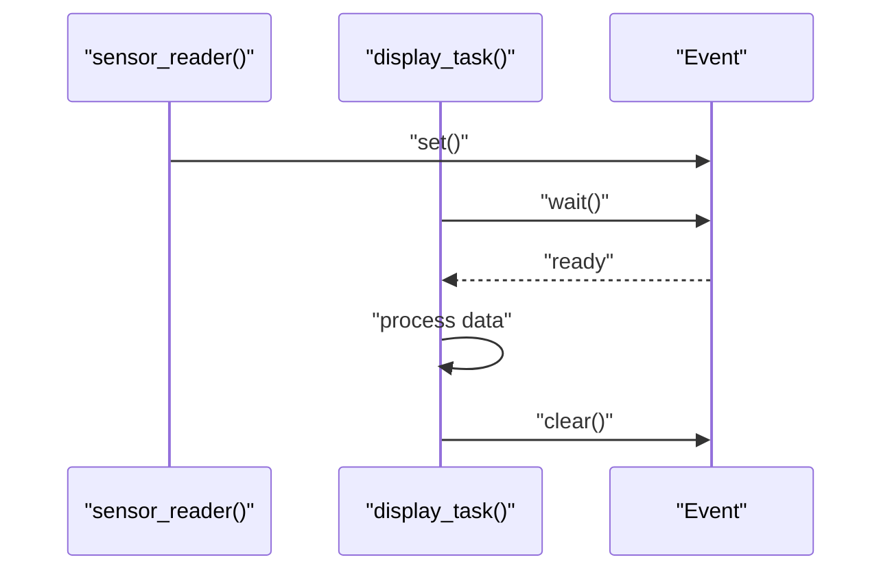

**Diagram sources**
- [README_ASYNCIO.md:206-238](file://src/main/README_ASYNCIO.md#L206-L238)

**Section sources**
- [README_ASYNCIO.md:206-238](file://src/main/README_ASYNCIO.md#L206-L238)

### Resource Protection with asyncio.Lock
- Serialize access to shared resources (e.g., I2C) using Lock.
- Use async with for automatic acquisition and release.

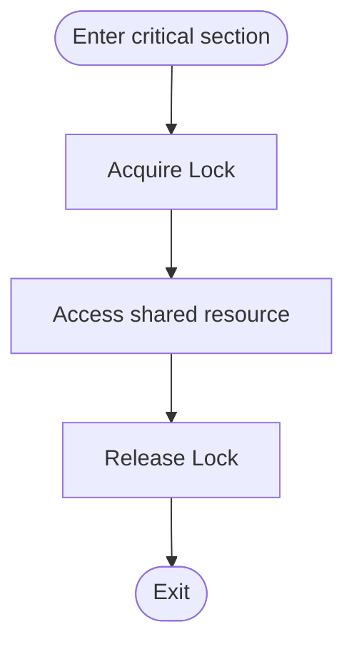

**Diagram sources**
- [README_ASYNCIO.md:241-271](file://src/main/README_ASYNCIO.md#L241-L271)

**Section sources**
- [README_ASYNCIO.md:241-271](file://src/main/README_ASYNCIO.md#L241-L271)

### Producer-Consumer with asyncio.Queue
- Decouple producers and consumers with a bounded queue.
- Use non-blocking put/get when appropriate to drop or skip data.

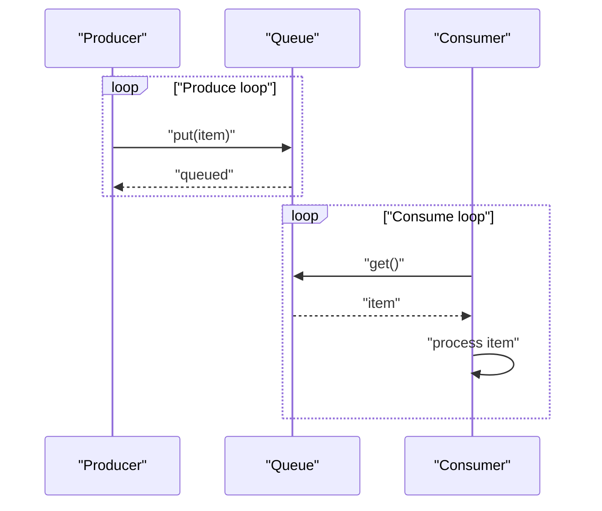

**Diagram sources**
- [README_ASYNCIO.md:274-322](file://src/main/README_ASYNCIO.md#L274-L322)

**Section sources**
- [README_ASYNCIO.md:274-322](file://src/main/README_ASYNCIO.md#L274-L322)

### Async I/O with StreamReader/StreamWriter
- Non-blocking UART/TCP I/O using streams.
- Use drain() to flush writes and apply timeouts for reads.

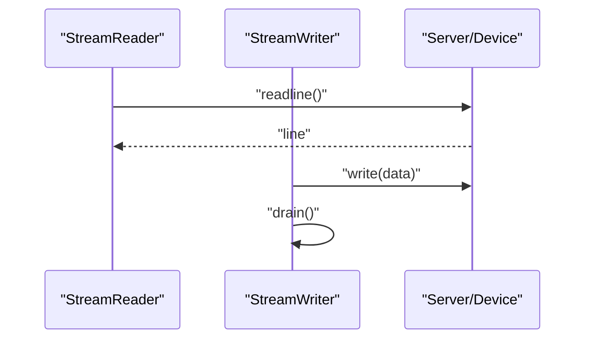

**Diagram sources**
- [README_ASYNCIO.md:363-430](file://src/main/README_ASYNCIO.md#L363-L430)

**Section sources**
- [README_ASYNCIO.md:363-430](file://src/main/README_ASYNCIO.md#L363-L430)

### ISR-Safe Signaling with ThreadSafeFlag
- Communicate from ISR/thread to async tasks safely.
- Use ThreadSafeFlag.set() from ISR and await flag.wait() in tasks.

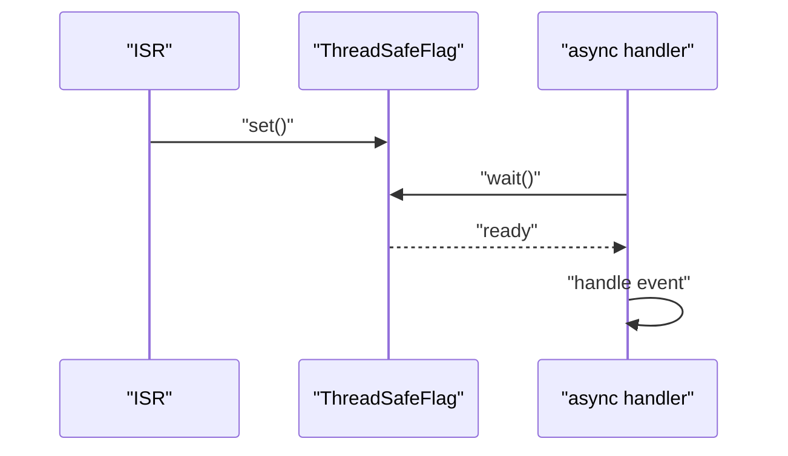

**Diagram sources**
- [README_ASYNCIO.md:434-466](file://src/main/README_ASYNCIO.md#L434-L466)

**Section sources**
- [README_ASYNCIO.md:434-466](file://src/main/README_ASYNCIO.md#L434-L466)

### Debounce Pattern with Cooperative Multitasking
- Debounce button presses without blocking the event loop.
- Use sleep_ms() and await points to yield control.

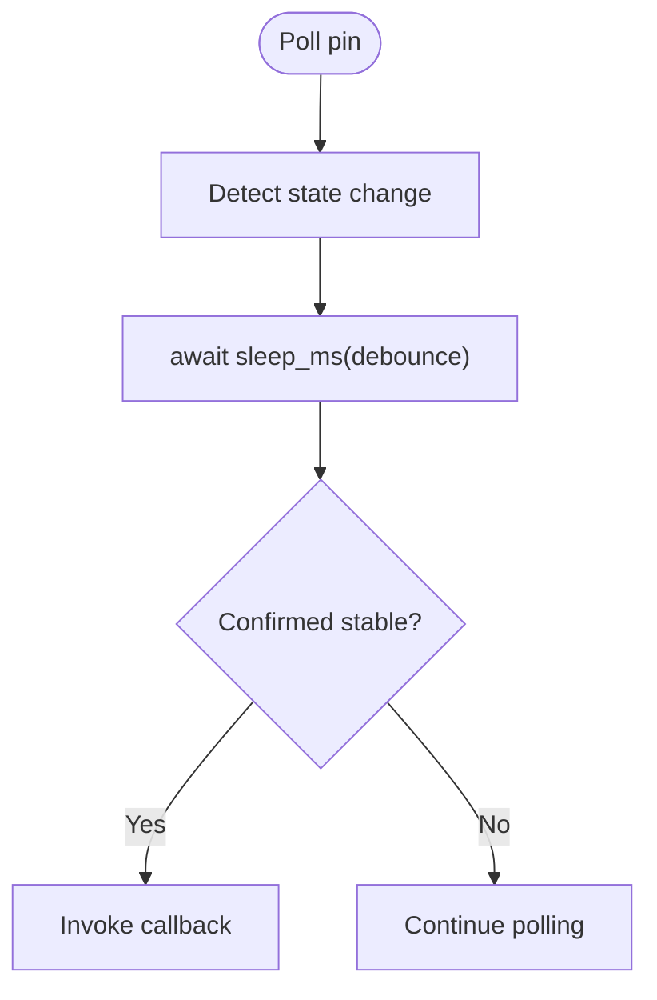

**Diagram sources**
- [README_ASYNCIO.md:623-667](file://src/main/README_ASYNCIO.md#L623-L667)

**Section sources**
- [README_ASYNCIO.md:623-667](file://src/main/README_ASYNCIO.md#L623-L667)

### Watchdog Pattern with Async Tasks
- Monitor liveness of main tasks and reset if overdue.
- Ping periodically and supervise from a dedicated task.

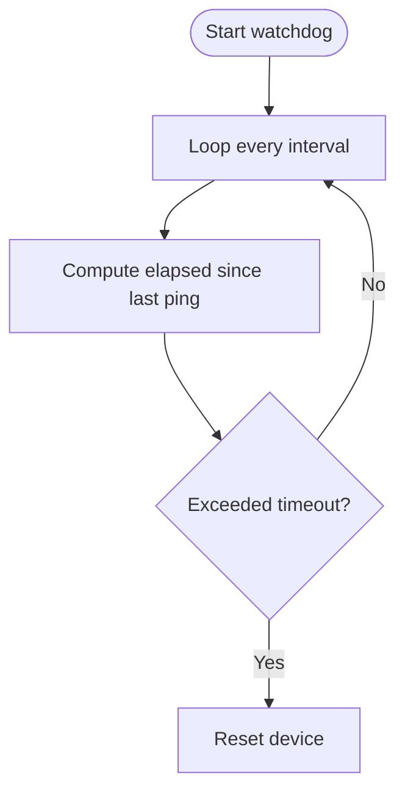

**Diagram sources**
- [README_ASYNCIO.md:577-620](file://src/main/README_ASYNCIO.md#L577-L620)

**Section sources**
- [README_ASYNCIO.md:577-620](file://src/main/README_ASYNCIO.md#L577-L620)

### State Machine with Events and Timeouts
- Drive state transitions using events and timeouts.
- Handle transitions from IDLE to CONNECTING, RUNNING, or ERROR.

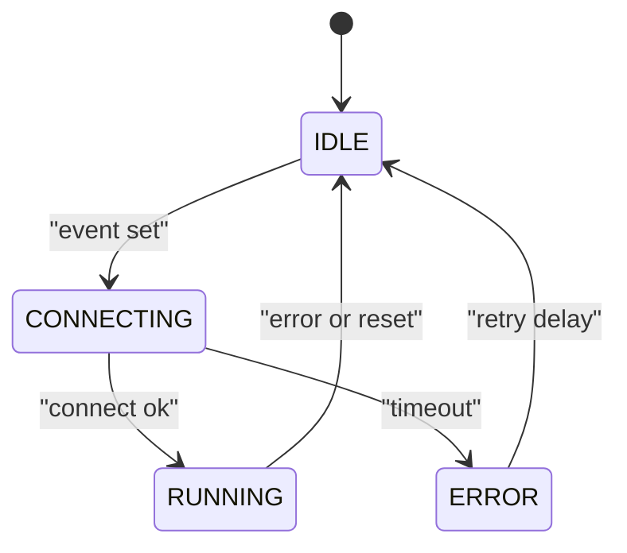

**Diagram sources**
- [README_ASYNCIO.md:515-573](file://src/main/README_ASYNCIO.md#L515-L573)

**Section sources**
- [README_ASYNCIO.md:515-573](file://src/main/README_ASYNCIO.md#L515-L573)

### Practical Example: Concurrent LED, Sensor, and WiFi Tasks
- Demonstrates creating tasks, running them concurrently, and graceful shutdown with cancellation and cleanup.

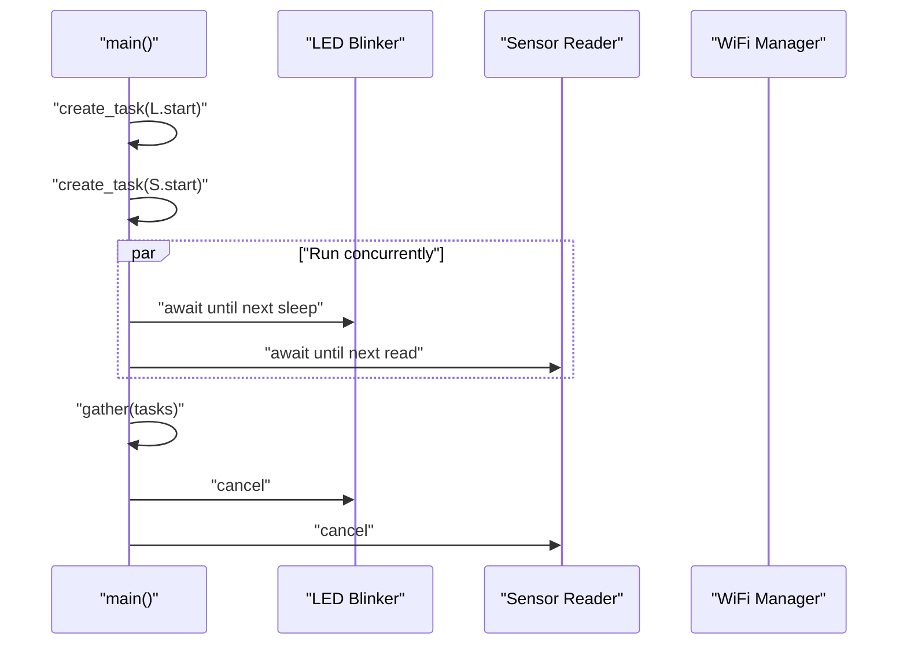

**Diagram sources**
- [asyncio_examples.py:147-193](file://src/main/examples/asyncio_examples.py#L147-L193)

**Section sources**
- [asyncio_examples.py:147-193](file://src/main/examples/asyncio_examples.py#L147-L193)

### Real-World Library Patterns
- Button module: creates tasks for click timers and invokes callbacks, handling both sync and async callbacks.
- Battery monitor: runs periodic monitoring loops with cancellation support.
- TJC HMI: starts RX and command worker tasks, manages lifecycle and cleanup.
- WebSocket server: accepts connections and spawns per-client handlers.
- TCP REPL: applies timeouts to read operations and handles client sessions.
- WiFi portal: accepts clients and delegates to handlers in tasks.

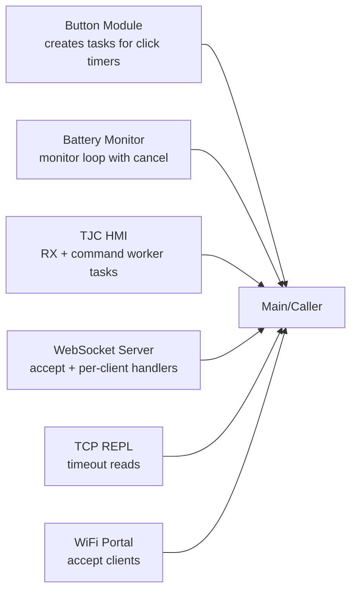

**Diagram sources**
- [button.py:322-367](file://src/lib/input/button.py#L322-L367)
- [battery_monitor.py:256-284](file://src/lib/sensors/battery_monitor.py#L256-L284)
- [tjc_hmi.py:808-834](file://src/lib/display/tjc_hmi.py#L808-L834)
- [websocket_server.py:244-314](file://src/lib/websocket/websocket_server.py#L244-L314)
- [tcp_repl.py:100-143](file://src/lib/repl/tcp_repl.py#L100-L143)
- [wifimanager.py:754-771](file://src/lib/wifi/wifimanager.py#L754-L771)

**Section sources**
- [button.py:280-425](file://src/lib/input/button.py#L280-L425)
- [battery_monitor.py:250-291](file://src/lib/sensors/battery_monitor.py#L250-L291)
- [tjc_hmi.py:800-917](file://src/lib/display/tjc_hmi.py#L800-L917)
- [websocket_server.py:235-318](file://src/lib/websocket/websocket_server.py#L235-L318)
- [tcp_repl.py:95-154](file://src/lib/repl/tcp_repl.py#L95-L154)
- [wifimanager.py:750-801](file://src/lib/wifi/wifimanager.py#L750-L801)

## Dependency Analysis
- The examples depend on the documentation for conceptual patterns and on the stubs for type hints.
- Library modules depend on asyncio primitives and integrate them into production systems.
- There are no circular dependencies among the analyzed files; each module composes asyncio primitives rather than importing each other.

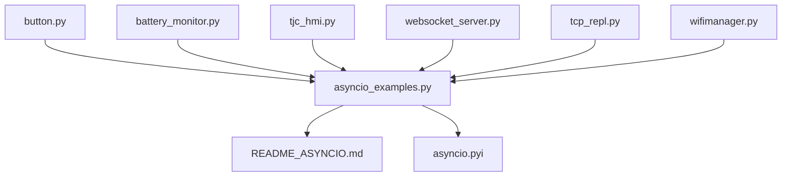

**Diagram sources**
- [asyncio_examples.py:1-234](file://src/main/examples/asyncio_examples.py#L1-L234)
- [README_ASYNCIO.md:1-840](file://src/main/README_ASYNCIO.md#L1-L840)
- [asyncio.pyi:1-28](file://src/stubs/asyncio.pyi#L1-L28)
- [button.py:280-425](file://src/lib/input/button.py#L280-L425)
- [battery_monitor.py:250-291](file://src/lib/sensors/battery_monitor.py#L250-L291)
- [tjc_hmi.py:800-917](file://src/lib/display/tjc_hmi.py#L800-L917)
- [websocket_server.py:235-318](file://src/lib/websocket/websocket_server.py#L235-L318)
- [tcp_repl.py:95-154](file://src/lib/repl/tcp_repl.py#L95-L154)
- [wifimanager.py:750-801](file://src/lib/wifi/wifimanager.py#L750-L801)

**Section sources**
- [asyncio_examples.py:1-234](file://src/main/examples/asyncio_examples.py#L1-L234)
- [README_ASYNCIO.md:1-840](file://src/main/README_ASYNCIO.md#L1-L840)
- [asyncio.pyi:1-28](file://src/stubs/asyncio.pyi#L1-L28)

## Performance Considerations
- Prefer asyncio.sleep_ms() for short delays to reduce overhead.
- Limit queue sizes to prevent memory pressure.
- Use gc.collect() periodically in idle tasks to manage heap fragmentation.
- Avoid closures in create_task(); pass bound methods or pre-created coroutines.
- Use __slots__ in frequently instantiated classes to reduce memory footprint.
- Minimize work inside tight loops; yield with await sleep(0) when doing compute.

**Section sources**
- [README_ASYNCIO.md:765-821](file://src/main/README_ASYNCIO.md#L765-L821)
- [asyncio.pyi:20-28](file://src/stubs/asyncio.pyi#L20-L28)

## Troubleshooting Guide
- Timeouts: wrap potentially blocking operations with wait_for() and handle TimeoutError.
- Cancellations: always handle CancelledError in tasks, perform cleanup, and re-raise to propagate.
- Exceptions in tasks: wrap task bodies to catch and log errors without swallowing exceptions.
- ISR safety: use ThreadSafeFlag to signal from ISR to async tasks.
- Logging and monitoring: print status updates during startup/shutdown and periodically check free memory.

Common patterns observed in the codebase:
- Cancellation and cleanup in examples
- Timeout handling in TCP REPL
- Graceful shutdown in WebSocket server and HMI modules

**Section sources**
- [asyncio_examples.py:172-193](file://src/main/examples/asyncio_examples.py#L172-L193)
- [tcp_repl.py:100-143](file://src/lib/repl/tcp_repl.py#L100-L143)
- [websocket_server.py:290-314](file://src/lib/websocket/websocket_server.py#L290-L314)
- [tjc_hmi.py:819-834](file://src/lib/display/tjc_hmi.py#L819-L834)

## Conclusion
The ESP32-C3 codebase demonstrates robust asyncio patterns for embedded environments. By combining cooperative multitasking, structured concurrency, and careful resource management, developers can build responsive, maintainable systems. The examples and libraries show how to create tasks, synchronize with events and locks, enforce timeouts, and manage lifecycles safely—key skills for advanced async development on constrained devices.

## Appendices

### API and Type Hints Reference
- MicroPython adds sleep_ms() and sleep_us() to asyncio for efficient short sleeps.

**Section sources**
- [asyncio.pyi:20-28](file://src/stubs/asyncio.pyi#L20-L28)