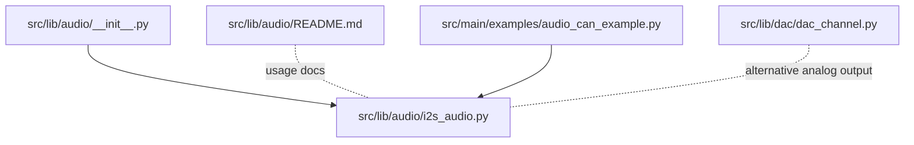
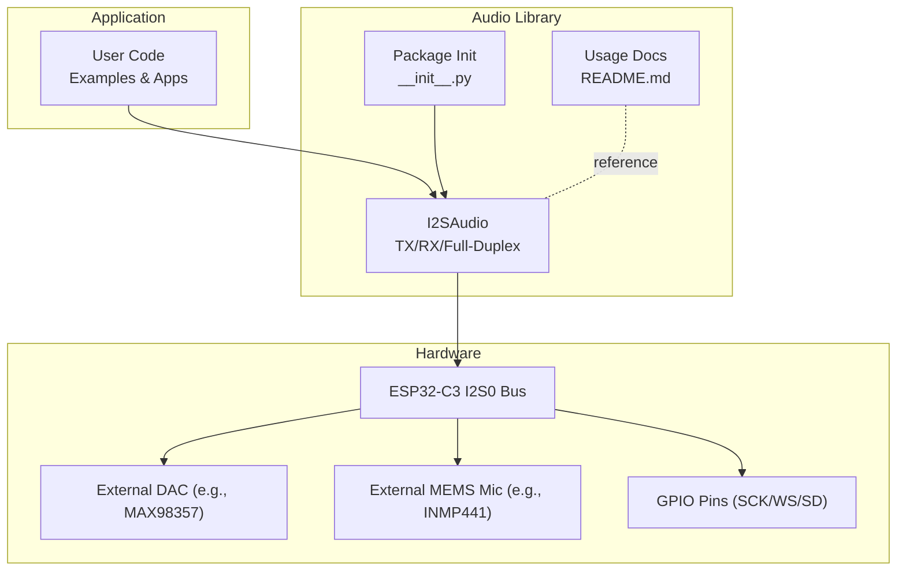
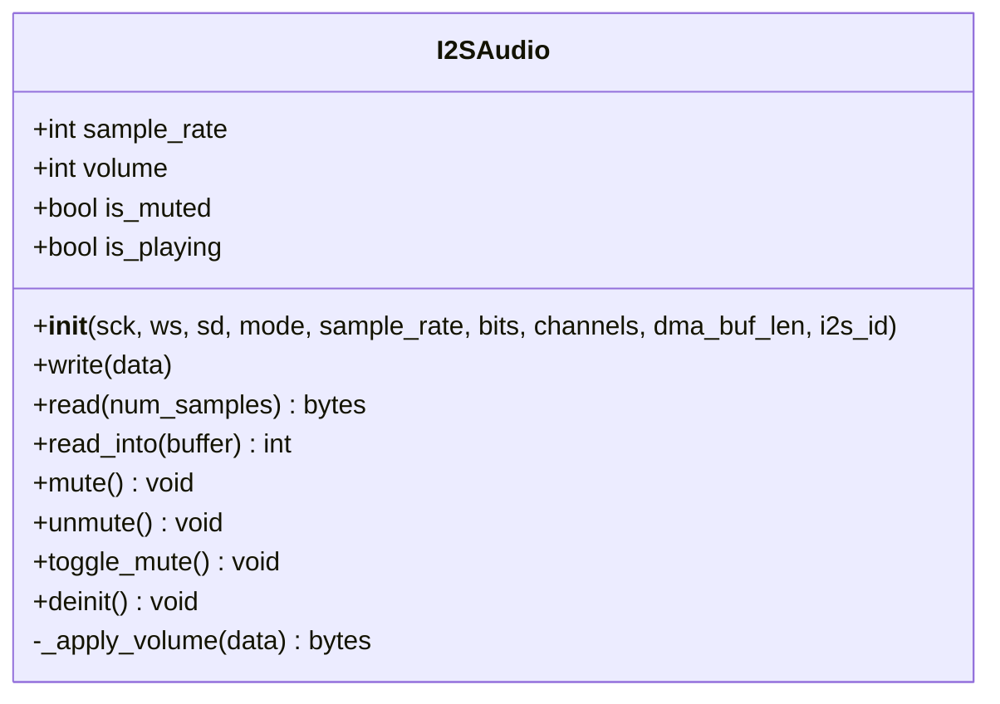
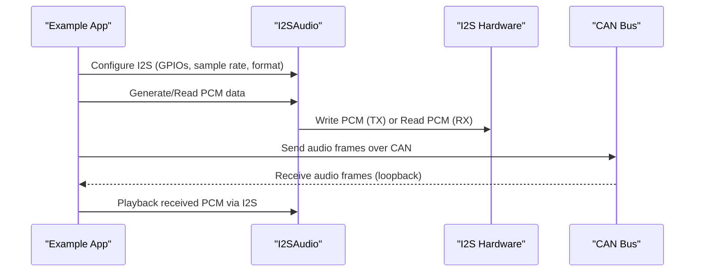
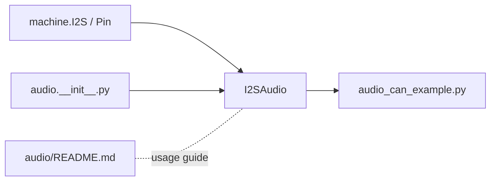

# Audio Processing

<cite>
**Referenced Files in This Document**
- [i2s_audio.py](file://src/lib/audio/i2s_audio.py)
- [README.md](file://src/lib/audio/README.md)
- [__init__.py](file://src/lib/audio/__init__.py)
- [audio_can_example.py](file://src/main/examples/audio_can_example.py)
- [dac_channel.py](file://src/lib/dac/dac_channel.py)
</cite>

## Table of Contents
1. [Introduction](#introduction)
2. [Project Structure](#project-structure)
3. [Core Components](#core-components)
4. [Architecture Overview](#architecture-overview)
5. [Detailed Component Analysis](#detailed-component-analysis)
6. [Dependency Analysis](#dependency-analysis)
7. [Performance Considerations](#performance-considerations)
8. [Troubleshooting Guide](#troubleshooting-guide)
9. [Conclusion](#conclusion)
10. [Appendices](#appendices)

## Introduction
This document provides advanced documentation for audio processing capabilities on the ESP32-C3 using the I2SAudio module. It covers I2S configuration, supported audio formats, sample rate management, buffer and DMA behavior, real-time processing patterns, codec integration considerations, and practical examples including audio-over-CAN demonstrations. Guidance is also provided for audio quality optimization, latency reduction, and hardware routing strategies tailored for embedded environments.

## Project Structure
The audio subsystem is organized under the audio library with a single primary module implementing I2SAudio, a concise package initializer, and a comprehensive README. Example usage is demonstrated in the main examples directory, including an integrated I2S + CAN demonstration.

**Diagram sources**
- [__init__.py:1-12](file://src/lib/audio/__init__.py#L1-L12)
- [i2s_audio.py:1-269](file://src/lib/audio/i2s_audio.py#L1-L269)
- [README.md:1-183](file://src/lib/audio/README.md#L1-L183)
- [audio_can_example.py:1-253](file://src/main/examples/audio_can_example.py#L1-L253)
- [dac_channel.py:46-248](file://src/lib/dac/dac_channel.py#L46-L248)

**Section sources**
- [__init__.py:1-12](file://src/lib/audio/__init__.py#L1-L12)
- [README.md:1-183](file://src/lib/audio/README.md#L1-L183)
- [audio_can_example.py:1-253](file://src/main/examples/audio_can_example.py#L1-L253)

## Core Components
- I2SAudio: A high-level driver wrapping machine.I2S for TX playback, RX capture, and optional TXRX full-duplex operation. It exposes properties for sample rate, volume, mute state, and play status, plus methods for writing PCM data, reading captured samples, and zero-copy reads into a preallocated buffer.
- Audio examples: Demonstrations of sine generation, WAV playback, volume/mute controls, and an integrated I2S + CAN example.

Key capabilities:
- I2S configuration via GPIO pins for SCK, WS/LRCK, and SD/DOUT/DIN.
- Support for 16-bit and 32-bit PCM with mono and stereo channel modes.
- Dynamic sample rate updates at runtime.
- Volume control via amplitude scaling (16-bit PCM only).
- DMA-backed buffers sized in samples with configurable length.
- Optional full-duplex operation.

**Section sources**
- [i2s_audio.py:61-130](file://src/lib/audio/i2s_audio.py#L61-L130)
- [i2s_audio.py:141-176](file://src/lib/audio/i2s_audio.py#L141-L176)
- [i2s_audio.py:179-247](file://src/lib/audio/i2s_audio.py#L179-L247)
- [README.md:171-183](file://src/lib/audio/README.md#L171-L183)

## Architecture Overview
The audio pipeline integrates user code with the I2SAudio abstraction, which configures and drives the underlying machine.I2S peripheral. For recording, captured data is returned as bytes or written into a caller-provided buffer. For playback, PCM data is optionally scaled for volume and sent to the I2S bus.

**Diagram sources**
- [i2s_audio.py:79-129](file://src/lib/audio/i2s_audio.py#L79-L129)
- [README.md:10-31](file://src/lib/audio/README.md#L10-L31)
- [__init__.py:1-12](file://src/lib/audio/__init__.py#L1-L12)

## Detailed Component Analysis

### I2SAudio Class
I2SAudio encapsulates I2S initialization, configuration, and runtime controls. It supports three operational modes and exposes properties and methods for real-time audio tasks.

**Diagram sources**
- [i2s_audio.py:61-130](file://src/lib/audio/i2s_audio.py#L61-L130)
- [i2s_audio.py:141-247](file://src/lib/audio/i2s_audio.py#L141-L247)

Implementation highlights:
- Modes: TX (speaker), RX (microphone), TXRX (full-duplex).
- Channel and bit-depth configuration mapped to I2S format.
- Runtime sample rate update via reinitialization of the underlying I2S instance.
- Volume control implemented by scaling 16-bit PCM samples.
- Read paths: blocking read by size and zero-copy readinto into a provided buffer.

Operational constraints and capabilities:
- ESP32-C3-specific: Single I2S bus (I2S0), supported sample rates include 8k, 11.025k, 16k, 22.05k, 44.1k, 48k Hz.
- Buffer sizing: DMA buffer length in samples with RAM footprint proportional to buffer size.
- Hardware connections: flexible GPIO assignment for SCK, WS, SD; common codecs include MAX98357 (speaker) and INMP441/SPH0645 (microphone).

**Section sources**
- [i2s_audio.py:61-130](file://src/lib/audio/i2s_audio.py#L61-L130)
- [i2s_audio.py:141-176](file://src/lib/audio/i2s_audio.py#L141-L176)
- [i2s_audio.py:179-247](file://src/lib/audio/i2s_audio.py#L179-L247)
- [README.md:171-183](file://src/lib/audio/README.md#L171-L183)

### Audio Formats and Streaming
Supported format:
- PCM: 16-bit and 32-bit, mono and stereo.
- Practical WAV playback: Skip WAV header and stream raw PCM frames to I2S.

Streaming characteristics:
- Playback: Stream chunks of PCM data; small chunk sizes reduce latency.
- Recording: Capture fixed-size sample blocks or use zero-copy readinto for efficient buffering.

Practical examples:
- Sine wave generator producing 16-bit PCM frames.
- WAV player skipping the 44-byte header and streaming in chunks.
- Volume and mute controls during playback.

Note: MP3/WAV decoding and encoding are not implemented in the I2SAudio module; PCM is the native format handled by the driver.

**Section sources**
- [README.md:35-92](file://src/lib/audio/README.md#L35-L92)
- [audio_can_example.py:20-80](file://src/main/examples/audio_can_example.py#L20-L80)
- [i2s_audio.py:179-247](file://src/lib/audio/i2s_audio.py#L179-L247)

### Real-Time Processing and Buffer Management
Real-time behavior:
- Playback writes PCM data to the I2S FIFO via DMA.
- Recording reads PCM data from the I2S FIFO via DMA.
- Volume scaling is applied per-write for TX mode.

Buffering and DMA:
- DMA buffer length is specified in number of samples.
- Larger buffers improve robustness against scheduling jitter but increase latency.
- Smaller buffers reduce latency but require careful scheduling to avoid underruns/overruns.

Zero-copy recording:
- read_into avoids extra copies by writing directly into a provided bytearray.

**Section sources**
- [i2s_audio.py:119-129](file://src/lib/audio/i2s_audio.py#L119-L129)
- [i2s_audio.py:237-247](file://src/lib/audio/i2s_audio.py#L237-L247)
- [README.md:171-183](file://src/lib/audio/README.md#L171-L183)

### Audio Codec Integration
Common codecs:
- Speaker: MAX98357 I2S DAC.
- Microphone: INMP441 and SPH0645 I2S MEMS mics.

Integration notes:
- I2SAudio connects to external codecs via SCK, WS/LRCK, and SD/DOUT/DIN.
- Ensure proper power and ground connections and level matching.
- For mics, configure left/right channel select as required by the microphone’s wiring.

**Section sources**
- [README.md:10-31](file://src/lib/audio/README.md#L10-L31)

### Digital Signal Processing and Effects
Current capabilities:
- Volume control via amplitude scaling (16-bit PCM).
- No built-in DSP filters or effects in I2SAudio.

Recommendations:
- Apply DSP (e.g., FIR/IIR filters, AGC, echo cancellation) in host-side Python code before writing PCM to I2S.
- For latency-sensitive designs, implement DSP in firmware using optimized libraries or dedicated DSP chips.

**Section sources**
- [i2s_audio.py:199-219](file://src/lib/audio/i2s_audio.py#L199-L219)

### Audio Streaming Protocols and Synchronization
The repository demonstrates an integrated example combining I2S audio with CAN bus. While the example focuses on loopback and filtering, it illustrates how audio data can be transmitted over CAN frames and processed in real time.

**Diagram sources**
- [audio_can_example.py:20-80](file://src/main/examples/audio_can_example.py#L20-L80)
- [audio_can_example.py:123-231](file://src/main/examples/audio_can_example.py#L123-L231)

Practical guidance:
- Use fixed-size CAN frames aligned to PCM frame boundaries for predictable timing.
- Implement framing and sequencing to handle multi-frame audio packets.
- For synchronization, align audio sample timestamps with CAN timestamps or use a shared clock domain.

**Section sources**
- [audio_can_example.py:1-253](file://src/main/examples/audio_can_example.py#L1-L253)

### Multi-Channel and Format Conversion
Multi-channel:
- Stereo interleaving is supported for 16-bit PCM playback and capture.

Format conversion:
- I2SAudio operates on raw PCM bytes; conversions (e.g., 16-bit ↔ 32-bit, mono ↔ stereo) must be performed by the caller before writing or after reading.

Resampling:
- The driver allows dynamic sample rate changes at runtime. For significant rate changes, pre-resample audio data in host code to minimize aliasing and computational load on the MCU.

Compression:
- No on-chip audio compression is implemented. Consider offloading compression to a host processor or using external codecs with onboard compression/decompression.

**Section sources**
- [i2s_audio.py:114-129](file://src/lib/audio/i2s_audio.py#L114-L129)
- [i2s_audio.py:146-151](file://src/lib/audio/i2s_audio.py#L146-L151)
- [README.md:171-183](file://src/lib/audio/README.md#L171-L183)

### Noise Suppression and Quality Optimization
Techniques:
- Use appropriate DMA buffer sizes to avoid underruns/overruns.
- Keep CPU busy with efficient scheduling; use asynchronous loops to maintain steady I/O.
- Apply anti-aliasing filtering before downsampling and reconstruction filtering after upsampling.
- Choose suitable sample rates to balance quality and memory bandwidth.

Hardware tips:
- Minimize cable lengths and use shielded cables for microphones.
- Ensure clean power supplies for codecs; decoupling capacitors recommended.
- Match impedances and use proper termination for digital buses.

[No sources needed since this section provides general guidance]

### Practical Examples from audio_can_example.py
- Sine wave generator: Creates 16-bit PCM frames and plays them via I2S.
- WAV player: Opens a WAV file, skips the header, and streams PCM chunks.
- Volume and mute controls: Adjusts playback volume and toggles mute state.
- CAN loopback and filtering: Demonstrates CAN bus operation (loopback mode) and hardware filtering.
- OBD-II pattern: Sends and receives standardized CAN messages for diagnostics.

These examples collectively demonstrate real-time audio generation, file-based playback, control surfaces, and integration with CAN for audio transport.

**Section sources**
- [audio_can_example.py:20-118](file://src/main/examples/audio_can_example.py#L20-L118)
- [audio_can_example.py:123-231](file://src/main/examples/audio_can_example.py#L123-L231)

## Dependency Analysis
Module-level dependencies:
- I2SAudio depends on machine.I2S and Pin for hardware abstraction.
- The package initializer exports I2SAudio for convenient import.
- Example scripts depend on I2SAudio for audio tasks and optionally on CAN modules for transport.

**Diagram sources**
- [i2s_audio.py:18-22](file://src/lib/audio/i2s_audio.py#L18-L22)
- [__init__.py:1-12](file://src/lib/audio/__init__.py#L1-L12)
- [audio_can_example.py:1-20](file://src/main/examples/audio_can_example.py#L1-L20)

**Section sources**
- [i2s_audio.py:18-22](file://src/lib/audio/i2s_audio.py#L18-L22)
- [__init__.py:1-12](file://src/lib/audio/__init__.py#L1-L12)

## Performance Considerations
- Latency vs. robustness: Tune DMA buffer length to balance latency and resilience to jitter.
- CPU utilization: Keep the event loop responsive; avoid long blocking operations between I2S transactions.
- Sample rate alignment: Prefer supported rates to minimize jitter and ensure stable timing.
- Memory footprint: Larger buffers consume more RAM; monitor heap usage in constrained environments.
- Power and thermal headroom: Ensure adequate cooling and power delivery for sustained audio throughput.

[No sources needed since this section provides general guidance]

## Troubleshooting Guide
Common issues and remedies:
- No audio output:
  - Verify I2S pin assignments and codec wiring.
  - Confirm sample rate and bit-depth settings match codec capabilities.
  - Check volume and mute state.
- Distorted or weak audio:
  - Ensure proper gain settings on the DAC and microphone.
  - Use appropriate supply voltages and decoupling.
- Buffer underruns/overruns:
  - Increase DMA buffer length or reduce chunk size.
  - Improve scheduling to prevent gaps in data delivery.
- Incorrect channel layout:
  - For stereo, ensure interleaved PCM data and correct channel configuration.
- Unsupported sample rate:
  - Use one of the supported rates exposed by the driver.

**Section sources**
- [i2s_audio.py:97-102](file://src/lib/audio/i2s_audio.py#L97-L102)
- [i2s_audio.py:146-151](file://src/lib/audio/i2s_audio.py#L146-L151)
- [README.md:171-183](file://src/lib/audio/README.md#L171-L183)

## Conclusion
The I2SAudio module provides a robust, high-level interface for PCM-based audio on ESP32-C3, supporting TX playback, RX capture, and full-duplex operation. It enables real-time audio processing with dynamic sample rate control, volume adjustment, and efficient zero-copy recording. The included examples demonstrate sine generation, WAV playback, and integration with CAN for audio transport. For advanced DSP, compression, and resampling, implement these features in host-side code or leverage external codecs. Proper hardware configuration, buffer tuning, and scheduling are essential for achieving low-latency, high-quality audio in embedded systems.

[No sources needed since this section summarizes without analyzing specific files]

## Appendices

### API Reference Summary
- I2SAudio constructor: Configure GPIOs, mode, sample rate, bit depth, channels, DMA buffer length, and I2S bus ID.
- Properties: sample_rate, volume, is_muted, is_playing.
- Methods: write(data), read(num_samples), read_into(buffer), mute(), unmute(), toggle_mute(), deinit().
- Notes: Volume scaling applies to 16-bit PCM only; supported sample rates and channel configurations are platform-specific.

**Section sources**
- [i2s_audio.py:79-129](file://src/lib/audio/i2s_audio.py#L79-L129)
- [i2s_audio.py:141-176](file://src/lib/audio/i2s_audio.py#L141-L176)
- [i2s_audio.py:179-247](file://src/lib/audio/i2s_audio.py#L179-L247)
- [README.md:146-183](file://src/lib/audio/README.md#L146-L183)