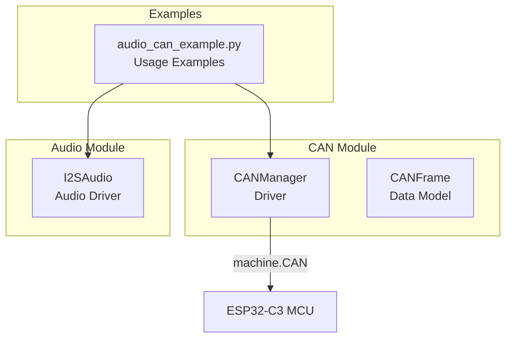
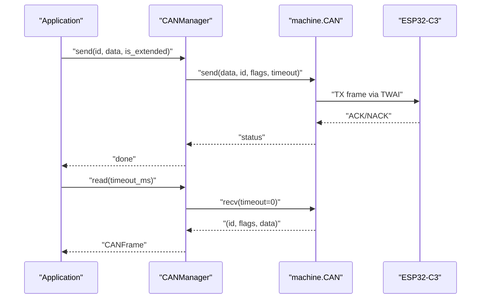
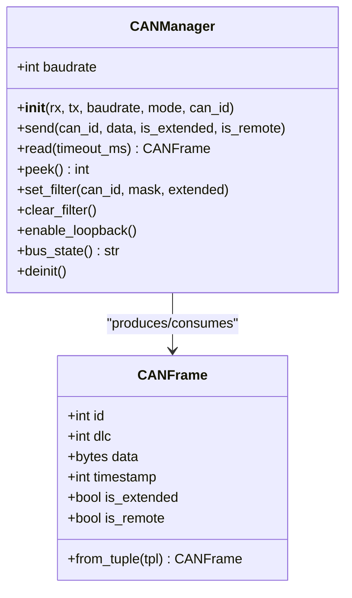
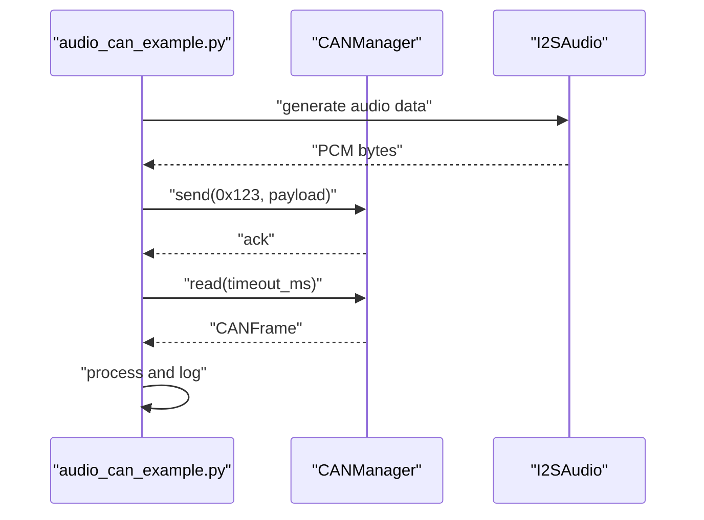
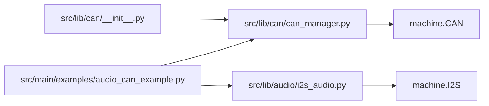

# CAN Bus Communication

<cite>
**Referenced Files in This Document**
- [can_manager.py](file://src/lib/can/can_manager.py)
- [__init__.py](file://src/lib/can/__init__.py)
- [README.md](file://src/lib/can/README.md)
- [audio_can_example.py](file://src/main/examples/audio_can_example.py)
- [i2s_audio.py](file://src/lib/audio/i2s_audio.py)
- [__init__.py](file://src/lib/audio/__init__.py)
</cite>

## Table of Contents
1. [Introduction](#introduction)
2. [Project Structure](#project-structure)
3. [Core Components](#core-components)
4. [Architecture Overview](#architecture-overview)
5. [Detailed Component Analysis](#detailed-component-analysis)
6. [Dependency Analysis](#dependency-analysis)
7. [Performance Considerations](#performance-considerations)
8. [Troubleshooting Guide](#troubleshooting-guide)
9. [Conclusion](#conclusion)
10. [Appendices](#appendices)

## Introduction
This document explains the CAN bus communication implementation for ESP32-C3 using the TWAI-compatible machine.CAN interface. It covers driver configuration, frame formats, filtering, loopback and listen-only modes, bus state monitoring, and practical examples demonstrating audio data transport over CAN. It also documents transceiver wiring, termination, and signal integrity considerations, along with guidance for real-time embedded applications.

## Project Structure
The CAN subsystem consists of:
- A public API module exposing CANManager and CANFrame
- A driver implementation wrapping machine.CAN
- Example usage demonstrating loopback, filtering, and OBD-II-like patterns
- Optional integration with I2S audio for audio data generation and playback

**Diagram sources**
- [can_manager.py:71-287](file://src/lib/can/can_manager.py#L71-L287)
- [audio_can_example.py:1-253](file://src/main/examples/audio_can_example.py#L1-L253)
- [i2s_audio.py:25-269](file://src/lib/audio/i2s_audio.py#L25-L269)

**Section sources**
- [__init__.py:1-12](file://src/lib/can/__init__.py#L1-L12)
- [README.md:1-179](file://src/lib/can/README.md#L1-L179)

## Core Components
- CANManager: Abstraction over machine.CAN providing initialization, sending/receiving frames, filtering, loopback/silent modes, and bus state checks.
- CANFrame: Data model representing a CAN frame with id, dlc, data, timestamp, and flags for extended and remote frames.
- Public API: Re-exports CANManager and CANFrame for user code.

Key capabilities:
- Standard (11-bit) and Extended (29-bit) frames
- Configurable baudrates (25 kbps to 1 Mbps)
- Hardware FIFO buffers (32 frames RX/TX)
- Loopback and listen-only modes
- Bus state reporting
- Basic filtering configuration

**Section sources**
- [can_manager.py:27-69](file://src/lib/can/can_manager.py#L27-L69)
- [can_manager.py:71-287](file://src/lib/can/can_manager.py#L71-L287)
- [README.md:167-179](file://src/lib/can/README.md#L167-L179)

## Architecture Overview
The CAN driver sits atop the MicroPython machine.CAN interface. On ESP32-C3, the CAN controller is TWAI-compatible and mapped to fixed pins. The driver exposes a simple API for sending and receiving frames, configuring filters, and checking bus health.

**Diagram sources**
- [can_manager.py:166-208](file://src/lib/can/can_manager.py#L166-L208)

## Detailed Component Analysis

### CANManager
Responsibilities:
- Initialize CAN controller with baudrate and mode
- Send frames with optional extended ID and RTR flag
- Receive frames with blocking or non-blocking semantics
- Peek pending frames
- Configure hardware filters and clear them
- Enable loopback mode for testing
- Report bus state

Important behaviors:
- Fixed pin mapping on ESP32-C3: TX=GPIO2, RX=GPIO1
- Baudrates supported: 25 kbps to 1 Mbps
- Extended frames use 29-bit IDs; standard frames use 11-bit IDs
- Filtering is configurable but actual hardware filter behavior depends on the underlying port
- Loopback mode mirrors TX to RX for local testing
- Bus state is reported via state() when available

**Diagram sources**
- [can_manager.py:27-69](file://src/lib/can/can_manager.py#L27-L69)
- [can_manager.py:71-287](file://src/lib/can/can_manager.py#L71-L287)

**Section sources**
- [can_manager.py:111-148](file://src/lib/can/can_manager.py#L111-L148)
- [can_manager.py:166-208](file://src/lib/can/can_manager.py#L166-L208)
- [can_manager.py:220-243](file://src/lib/can/can_manager.py#L220-L243)
- [can_manager.py:254-268](file://src/lib/can/can_manager.py#L254-L268)
- [README.md:167-179](file://src/lib/can/README.md#L167-L179)

### CANFrame
Represents a single CAN frame:
- id: 11-bit or 29-bit depending on is_extended
- dlc: number of payload bytes (0–8)
- data: up to 8 bytes
- timestamp: milliseconds since initialization
- is_extended: indicates 29-bit ID
- is_remote: indicates RTR frame

Construction:
- from_tuple interprets (id, flags, data) returned by machine.CAN.recv()

**Section sources**
- [can_manager.py:27-69](file://src/lib/can/can_manager.py#L27-L69)

### Practical Examples from audio_can_example.py
- I2S audio generation and playback
- Loopback tests for CAN (no external hardware)
- Hardware filtering demonstration
- OBD-II-like pattern simulation

Highlights:
- Loopback mode validates TX-to-RX echo without external transceiver
- Filtering demonstrates acceptance criteria for ID ranges
- OBD-II pattern simulates request/response IDs and payload parsing

**Diagram sources**
- [audio_can_example.py:120-156](file://src/main/examples/audio_can_example.py#L120-L156)
- [audio_can_example.py:161-190](file://src/main/examples/audio_can_example.py#L161-L190)
- [audio_can_example.py:195-231](file://src/main/examples/audio_can_example.py#L195-L231)

**Section sources**
- [audio_can_example.py:18-47](file://src/main/examples/audio_can_example.py#L18-L47)
- [audio_can_example.py:120-156](file://src/main/examples/audio_can_example.py#L120-L156)
- [audio_can_example.py:161-190](file://src/main/examples/audio_can_example.py#L161-L190)
- [audio_can_example.py:195-231](file://src/main/examples/audio_can_example.py#L195-L231)

### I2S Audio Integration
I2SAudio provides:
- TX (speaker), RX (microphone), and TXRX modes
- Configurable sample rates, bit depths, and channels
- Volume control and mute
- DMA buffer management

Integration with CAN:
- Audio data can be encapsulated into CAN frames for transport
- Real-time constraints require careful scheduling and buffer sizing

**Section sources**
- [i2s_audio.py:25-138](file://src/lib/audio/i2s_audio.py#L25-L138)
- [i2s_audio.py:179-236](file://src/lib/audio/i2s_audio.py#L179-L236)
- [i2s_audio.py:251-269](file://src/lib/audio/i2s_audio.py#L251-L269)
- [__init__.py:1-12](file://src/lib/audio/__init__.py#L1-L12)

## Dependency Analysis
- CANManager depends on machine.CAN for low-level bus operations
- CANFrame is a pure data container used by CANManager
- Public API re-exports CANManager and CANFrame
- Example scripts depend on both CAN and Audio modules

**Diagram sources**
- [__init__.py:1-12](file://src/lib/can/__init__.py#L1-L12)
- [can_manager.py:20-24](file://src/lib/can/can_manager.py#L20-L24)
- [audio_can_example.py:10-11](file://src/main/examples/audio_can_example.py#L10-L11)
- [i2s_audio.py:16-22](file://src/lib/audio/i2s_audio.py#L16-L22)

**Section sources**
- [__init__.py:1-12](file://src/lib/can/__init__.py#L1-L12)
- [can_manager.py:20-24](file://src/lib/can/can_manager.py#L20-L24)
- [audio_can_example.py:10-11](file://src/main/examples/audio_can_example.py#L10-L11)
- [i2s_audio.py:16-22](file://src/lib/audio/i2s_audio.py#L16-L22)

## Performance Considerations
- Baudrate selection affects throughput and noise immunity; choose appropriate rates for the environment
- Extended frames increase overhead; use standard frames when IDs fit within 11-bit range
- Hardware FIFO buffers are sized for bursty traffic; implement backpressure or scheduling to avoid overflow
- Loopback mode removes external bus latency and is useful for unit testing
- Filtering reduces CPU load by discarding unwanted frames early

[No sources needed since this section provides general guidance]

## Troubleshooting Guide
Common issues and remedies:
- No frames received:
  - Verify bus state and mode; ensure listen-only vs normal mode is correct
  - Confirm filtering settings are not too restrictive
- Incorrect pin mapping:
  - ESP32-C3 requires TX=GPIO2 and RX=GPIO1; warnings are printed if other pins are supplied
- Transceiver and termination:
  - Use a CAN transceiver and install 120 Ω terminators at both ends of the bus
- Loopback verification:
  - Use loopback mode to validate TX-to-RX path without external hardware

**Section sources**
- [can_manager.py:126-131](file://src/lib/can/can_manager.py#L126-L131)
- [README.md:24-25](file://src/lib/can/README.md#L24-L25)
- [README.md:171-178](file://src/lib/can/README.md#L171-L178)

## Conclusion
The ESP32-C3 CAN implementation provides a concise, TWAI-compatible driver with standard and extended frame support, configurable baudrates, filtering, and loopback testing. Combined with I2S audio, it enables practical demonstrations of audio data transport over CAN. Proper transceiver configuration, termination, and filtering are essential for reliable operation in industrial embedded environments.

[No sources needed since this section summarizes without analyzing specific files]

## Appendices

### CAN Frame Formats and Arbitration
- Standard frames: 11-bit identifier; suitable for general-purpose nodes
- Extended frames: 29-bit identifier; enables hierarchical addressing and vendor-specific IDs
- Data field: 0–8 bytes; DLC indicates effective payload length
- Arbitration: Dominant bits win; collisions trigger retransmission with randomized backoff
- RTR frames: Request-to-Receive frames are not commonly used in typical audio or sensor networks

**Section sources**
- [can_manager.py:171-174](file://src/lib/can/can_manager.py#L171-L174)
- [can_manager.py:40-48](file://src/lib/can/can_manager.py#L40-L48)

### CANopen and Device Profiles
- The repository does not include CANopen protocol support or device profile implementations
- Network management procedures and object dictionary handling are not present in the current codebase

[No sources needed since this section provides general guidance]

### Multi-Node Audio Systems and Distributed Processing
- Use filtering to isolate relevant message IDs per node
- Implement gateway patterns to forward frames between buses or domains
- Schedule audio sampling and CAN transmission to meet real-time constraints

**Section sources**
- [README.md:123-134](file://src/lib/can/README.md#L123-L134)
- [audio_can_example.py:161-190](file://src/main/examples/audio_can_example.py#L161-L190)

### CAN Transceiver Wiring and Signal Integrity
- ESP32-C3 wiring: GPIO1 (RX), GPIO2 (TX) to transceiver pins as documented
- Termination: Install 120 Ω resistors at both ends of the bus
- Layout: Keep traces short and matched; use differential pairs for CANH/CANL

**Section sources**
- [README.md:10-22](file://src/lib/can/README.md#L10-L22)
- [README.md:24-25](file://src/lib/can/README.md#L24-L25)
- [README.md:171-178](file://src/lib/can/README.md#L171-L178)

### Real-Time Communication Patterns
- Use loopback and filtering during development to validate timing and correctness
- Prefer standard frames for lower overhead when addressing fits 11-bit IDs
- Monitor bus state to detect fault conditions early

**Section sources**
- [README.md:63-74](file://src/lib/can/README.md#L63-L74)
- [README.md:171-179](file://src/lib/can/README.md#L171-L179)