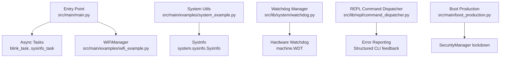
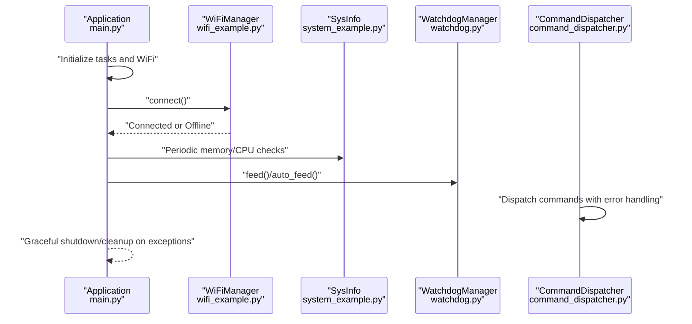
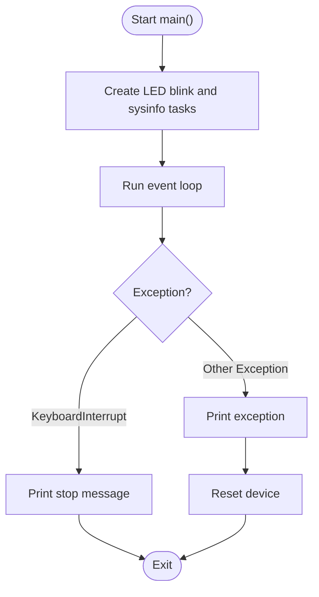
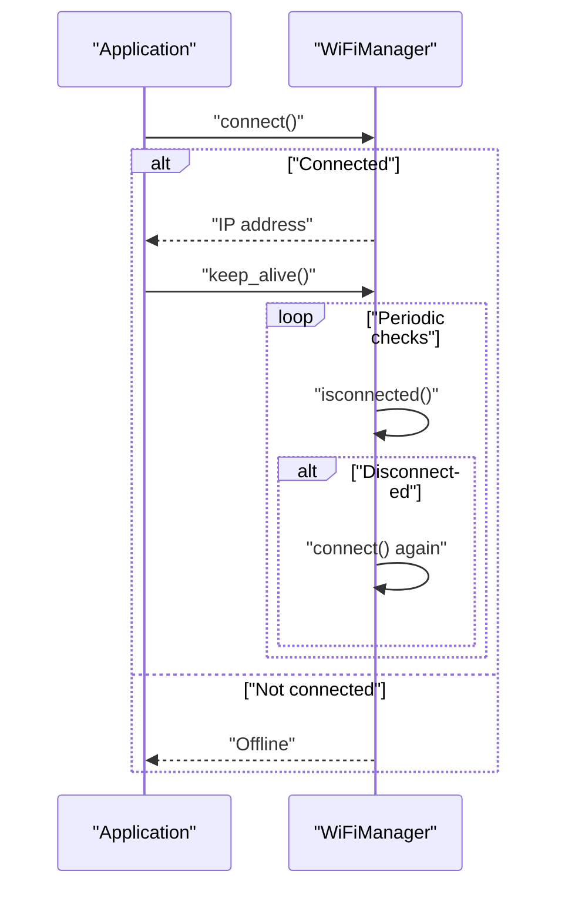
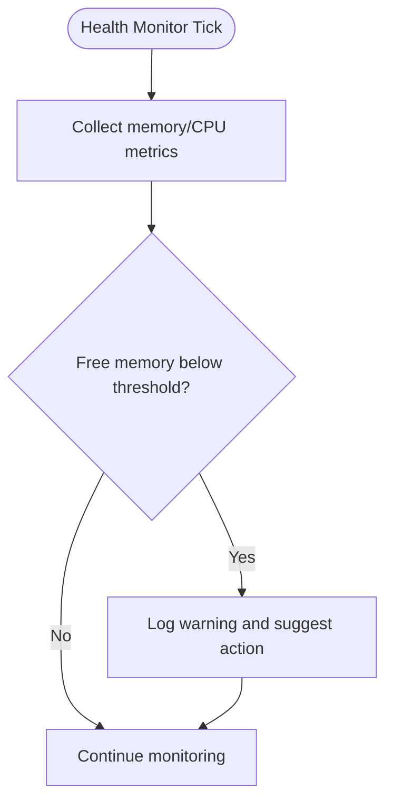
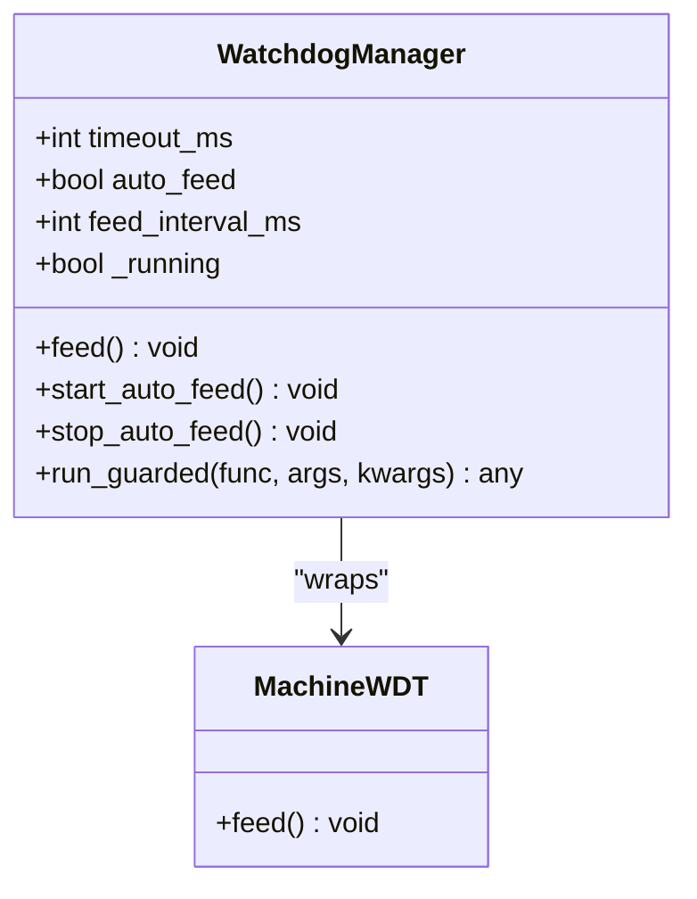
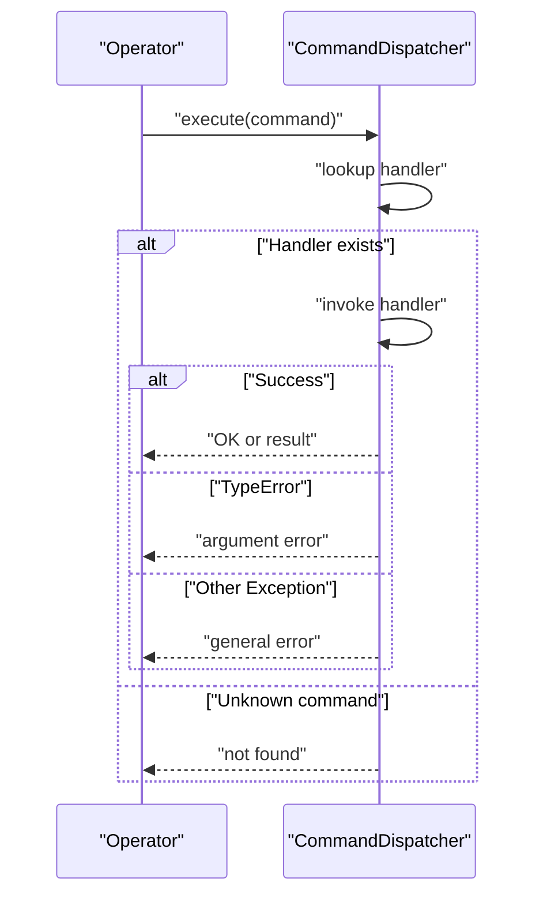
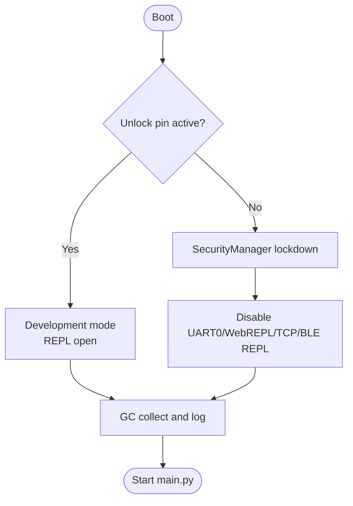
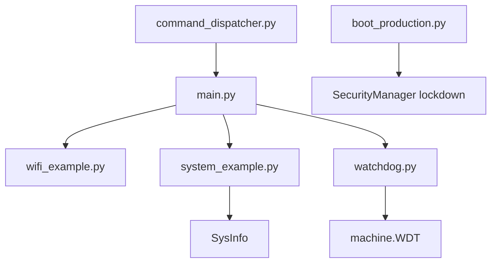

# Error Handling & Recovery

<cite>
**Referenced Files in This Document**
- [main.py](file://src/main/main.py)
- [boot_production.py](file://src/main/boot_production.py)
- [asyncio_examples.py](file://src/main/examples/asyncio_examples.py)
- [README_ASYNCIO.md](file://src/main/README_ASYNCIO.md)
- [system_example.py](file://src/main/examples/system_example.py)
- [wifi_example.py](file://src/main/examples/wifi_example.py)
- [secure_production_example.py](file://src/main/examples/secure_production_example.py)
- [watchdog.py](file://src/lib/system/watchdog.py)
- [command_dispatcher.py](file://src/lib/repl/command_dispatcher.py)
</cite>

## Table of Contents
1. [Introduction](#introduction)
2. [Project Structure](#project-structure)
3. [Core Components](#core-components)
4. [Architecture Overview](#architecture-overview)
5. [Detailed Component Analysis](#detailed-component-analysis)
6. [Dependency Analysis](#dependency-analysis)
7. [Performance Considerations](#performance-considerations)
8. [Troubleshooting Guide](#troubleshooting-guide)
9. [Conclusion](#conclusion)
10. [Appendices](#appendices)

## Introduction
This document provides robust error handling and system recovery strategies tailored for the ESP32-C3 MicroPython framework. It focuses on exception management in asynchronous environments, graceful degradation under hardware/network/resource constraints, resilience patterns such as circuit breakers and retries with exponential backoff, and recovery procedures for critical failures including memory leaks and hardware malfunctions. It also covers watchdog implementation, automatic restarts, safe shutdown sequences, and practical debugging techniques for production deployments.

## Project Structure
The repository organizes examples and modules to demonstrate error handling patterns across networking, storage, system utilities, and REPL command processing. Key areas relevant to error handling and recovery include:
- Async entry points and top-level exception handling
- WiFi connectivity with keep-alive and status monitoring
- System utilities for memory and health monitoring
- Watchdog manager for hardware-level protection
- REPL command dispatcher with structured error reporting
- Production boot lockdown and security integration

**Diagram sources**
- [main.py:49-84](file://src/main/main.py#L49-L84)
- [wifi_example.py:123-180](file://src/main/examples/wifi_example.py#L123-L180)
- [system_example.py:15-43](file://src/main/examples/system_example.py#L15-L43)
- [watchdog.py:9-37](file://src/lib/system/watchdog.py#L9-L37)
- [command_dispatcher.py:136-191](file://src/lib/repl/command_dispatcher.py#L136-L191)
- [boot_production.py:40-48](file://src/main/boot_production.py#L40-L48)

**Section sources**
- [main.py:1-84](file://src/main/main.py#L1-L84)
- [wifi_example.py:1-338](file://src/main/examples/wifi_example.py#L1-L338)
- [system_example.py:1-43](file://src/main/examples/system_example.py#L1-L43)
- [watchdog.py:1-37](file://src/lib/system/watchdog.py#L1-L37)
- [command_dispatcher.py:136-191](file://src/lib/repl/command_dispatcher.py#L136-L191)
- [boot_production.py:1-56](file://src/main/boot_production.py#L1-L56)

## Core Components
- Async entry point and top-level exception handling: Demonstrates structured try/except around the main event loop, printing exceptions and triggering a reset on unhandled errors.
- WiFiManager with keep-alive and status monitoring: Provides resilient connectivity with periodic checks and recovery actions.
- System utilities: SysInfo for memory and CPU metrics; health monitoring tasks to detect low memory conditions.
- WatchdogManager: Hardware watchdog wrapper with manual and auto-feed modes, plus guarded execution.
- REPL command dispatcher: Centralized command handling with explicit error reporting and graceful CLI responses.
- Boot lockdown: Production boot script integrating security lockdown prior to application startup.

**Section sources**
- [main.py:76-84](file://src/main/main.py#L76-L84)
- [wifi_example.py:86-90](file://src/main/examples/wifi_example.py#L86-L90)
- [system_example.py:15-43](file://src/main/examples/system_example.py#L15-L43)
- [watchdog.py:9-37](file://src/lib/system/watchdog.py#L9-L37)
- [command_dispatcher.py:136-191](file://src/lib/repl/command_dispatcher.py#L136-L191)
- [boot_production.py:40-48](file://src/main/boot_production.py#L40-L48)

## Architecture Overview
The system integrates asynchronous tasks, network connectivity, system health monitoring, and protective mechanisms. The architecture emphasizes:
- Non-blocking async operations with structured error handling
- Periodic health checks and resource monitoring
- Hardware watchdog for fail-safe resets
- Centralized command dispatch with explicit error messaging
- Production-grade lockdown to prevent unauthorized access

**Diagram sources**
- [main.py:49-84](file://src/main/main.py#L49-L84)
- [wifi_example.py:66-117](file://src/main/examples/wifi_example.py#L66-L117)
- [system_example.py:15-43](file://src/main/examples/system_example.py#L15-L43)
- [watchdog.py:9-37](file://src/lib/system/watchdog.py#L9-L37)
- [command_dispatcher.py:136-191](file://src/lib/repl/command_dispatcher.py#L136-L191)

## Detailed Component Analysis

### Async Entry Point and Top-Level Exception Handling
- Purpose: Ensures the application starts tasks concurrently, handles keyboard interrupts gracefully, and prints exceptions before resetting on unexpected errors.
- Patterns:
  - Try/except around the main event loop
  - Structured exception printing via sys.print_exception
  - Controlled reset on unhandled exceptions
- Practical implications:
  - Prevents silent crashes in production
  - Enables quick recovery via reset
  - Supports debugging by capturing stack traces

**Diagram sources**
- [main.py:49-84](file://src/main/main.py#L49-L84)

**Section sources**
- [main.py:76-84](file://src/main/main.py#L76-L84)

### WiFi Connectivity with Keep-Alive and Status Monitoring
- Purpose: Maintain network availability with periodic checks and recovery actions.
- Patterns:
  - Connection with timeout and status reporting
  - Keep-alive loop to re-establish connection if dropped
  - Status monitoring with periodic updates
- Practical implications:
  - Graceful degradation when offline
  - Reduced downtime via automatic reconnection
  - Observability through status and connection info

**Diagram sources**
- [wifi_example.py:66-117](file://src/main/examples/wifi_example.py#L66-L117)
- [wifi_example.py:287-302](file://src/main/examples/wifi_example.py#L287-L302)

**Section sources**
- [wifi_example.py:66-117](file://src/main/examples/wifi_example.py#L66-L117)
- [wifi_example.py:287-302](file://src/main/examples/wifi_example.py#L287-L302)

### System Health Monitoring and Memory Leak Detection
- Purpose: Detect low memory conditions and monitor CPU frequency to support proactive recovery.
- Patterns:
  - Periodic collection of free memory and CPU frequency
  - Threshold-based warnings for low memory
  - Integration with garbage collection for memory pressure relief
- Practical implications:
  - Early warning for potential memory leaks
  - Guidance for tuning task frequency and buffer sizes
  - Support for safe shutdown procedures when resources are critically low

**Diagram sources**
- [system_example.py:15-43](file://src/main/examples/system_example.py#L15-L43)
- [main.py:38-43](file://src/main/main.py#L38-L43)

**Section sources**
- [system_example.py:15-43](file://src/main/examples/system_example.py#L15-L43)
- [main.py:38-43](file://src/main/main.py#L38-L43)

### Watchdog Implementation and Automatic Restart
- Purpose: Protect against deadlocks and hangs by resetting the device when critical tasks stall.
- Patterns:
  - Hardware watchdog wrapper with configurable timeout
  - Manual feed and auto-feed modes
  - Guarded execution that avoids feeding on exceptions
- Practical implications:
  - Fail-safe reset on long-running operations
  - Reduced downtime in production environments
  - Safe operation under heavy load or blocking operations

**Diagram sources**
- [watchdog.py:9-37](file://src/lib/system/watchdog.py#L9-L37)

**Section sources**
- [watchdog.py:9-37](file://src/lib/system/watchdog.py#L9-L37)

### REPL Command Dispatcher Error Handling
- Purpose: Provide structured feedback and error reporting for REPL commands.
- Patterns:
  - Centralized command dispatch with try/except around handlers
  - Explicit error messages for invalid arguments and runtime errors
  - Consistent CLI response formatting
- Practical implications:
  - Improved debugging and diagnostics
  - Reduced operator confusion during troubleshooting
  - Safer interactive administration with controlled feedback

**Diagram sources**
- [command_dispatcher.py:136-191](file://src/lib/repl/command_dispatcher.py#L136-L191)

**Section sources**
- [command_dispatcher.py:136-191](file://src/lib/repl/command_dispatcher.py#L136-L191)

### Production Boot Lockdown and Security Integration
- Purpose: Enforce production-grade security by disabling REPL channels and enabling lockdown before application startup.
- Patterns:
  - Optional development unlock pin
  - SecurityManager lockdown to disable UART0, WebREPL, TCP, and BLE REPL
  - Pre-application cleanup and logging
- Practical implications:
  - Stronger defense-in-depth for field devices
  - Controlled access via token-based authentication
  - Forensic audit logging for security events

**Diagram sources**
- [boot_production.py:24-48](file://src/main/boot_production.py#L24-L48)

**Section sources**
- [boot_production.py:24-48](file://src/main/boot_production.py#L24-L48)

## Dependency Analysis
Key dependencies and relationships relevant to error handling and recovery:
- Async entry point depends on WiFiManager for connectivity and SysInfo for health monitoring.
- WatchdogManager wraps machine.WDT for hardware-level protection.
- REPL command dispatcher centralizes error reporting for interactive sessions.
- Boot lockdown integrates with SecurityManager to enforce production security policies.

**Diagram sources**
- [main.py:49-84](file://src/main/main.py#L49-L84)
- [wifi_example.py:66-117](file://src/main/examples/wifi_example.py#L66-L117)
- [system_example.py:15-43](file://src/main/examples/system_example.py#L15-L43)
- [watchdog.py:9-37](file://src/lib/system/watchdog.py#L9-L37)
- [command_dispatcher.py:136-191](file://src/lib/repl/command_dispatcher.py#L136-L191)
- [boot_production.py:40-48](file://src/main/boot_production.py#L40-L48)

**Section sources**
- [main.py:49-84](file://src/main/main.py#L49-L84)
- [wifi_example.py:66-117](file://src/main/examples/wifi_example.py#L66-L117)
- [system_example.py:15-43](file://src/main/examples/system_example.py#L15-L43)
- [watchdog.py:9-37](file://src/lib/system/watchdog.py#L9-L37)
- [command_dispatcher.py:136-191](file://src/lib/repl/command_dispatcher.py#L136-L191)
- [boot_production.py:40-48](file://src/main/boot_production.py#L40-L48)

## Performance Considerations
- Use non-blocking async sleep for task scheduling to avoid blocking the event loop.
- Limit queue sizes to prevent memory exhaustion under bursty loads.
- Prefer manual garbage collection in idle tasks to maintain steady memory usage.
- Monitor free RAM thresholds and trigger mitigation actions proactively.

Practical guidance is documented in the async README with examples for sleep variants, queue sizing, and memory monitoring.

**Section sources**
- [README_ASYNCIO.md:765-823](file://src/main/README_ASYNCIO.md#L765-L823)

## Troubleshooting Guide
Common issues and recommended actions:
- Network connectivity failures:
  - Verify WiFi credentials and AP availability
  - Enable keep-alive mode and monitor connection status
  - Implement retry with exponential backoff for transient failures
- Resource exhaustion:
  - Add periodic memory monitoring and GC triggers
  - Reduce task concurrency or buffer sizes
  - Use bounded queues and backpressure strategies
- Hardware watchdog timeouts:
  - Ensure regular feed calls or enable auto-feed
  - Guard critical sections to avoid feeding on exceptions
- REPL command errors:
  - Use centralized command dispatcher for consistent error reporting
  - Provide actionable messages for invalid arguments and runtime errors
- Production security breaches:
  - Enforce lockdown via boot script
  - Use token-based authentication and audit logging
  - Perform emergency wipe if compromise is suspected

**Section sources**
- [wifi_example.py:66-117](file://src/main/examples/wifi_example.py#L66-L117)
- [system_example.py:15-43](file://src/main/examples/system_example.py#L15-L43)
- [watchdog.py:9-37](file://src/lib/system/watchdog.py#L9-L37)
- [command_dispatcher.py:136-191](file://src/lib/repl/command_dispatcher.py#L136-L191)
- [boot_production.py:40-48](file://src/main/boot_production.py#L40-L48)

## Conclusion
Robust error handling and recovery in the ESP32-C3 environment require a layered approach combining structured async exception handling, resilient network connectivity, proactive system health monitoring, hardware watchdog protection, and strong security lockdown. By adopting the patterns and strategies outlined here—graceful degradation, circuit breaker and retry mechanisms, and comprehensive recovery procedures—deployments can achieve higher reliability and faster recovery from failures.

## Appendices

### Practical Examples and References
- Async entry point and exception handling: [main.py:76-84](file://src/main/main.py#L76-L84)
- WiFi keep-alive and status monitoring: [wifi_example.py:86-90](file://src/main/examples/wifi_example.py#L86-L90), [wifi_example.py:287-302](file://src/main/examples/wifi_example.py#L287-L302)
- System health monitoring: [system_example.py:15-43](file://src/main/examples/system_example.py#L15-L43), [main.py:38-43](file://src/main/main.py#L38-L43)
- Watchdog manager: [watchdog.py:9-37](file://src/lib/system/watchdog.py#L9-L37)
- REPL command dispatcher: [command_dispatcher.py:136-191](file://src/lib/repl/command_dispatcher.py#L136-L191)
- Boot lockdown and security: [boot_production.py:40-48](file://src/main/boot_production.py#L40-L48)
- Async patterns and performance tips: [README_ASYNCIO.md:325-344](file://src/main/README_ASYNCIO.md#L325-L344), [README_ASYNCIO.md:577-622](file://src/main/README_ASYNCIO.md#L577-L622), [README_ASYNCIO.md:765-823](file://src/main/README_ASYNCIO.md#L765-L823)