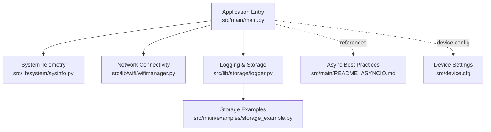
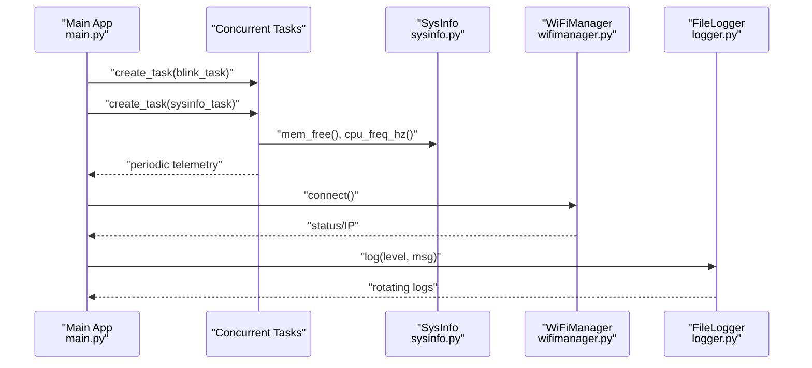
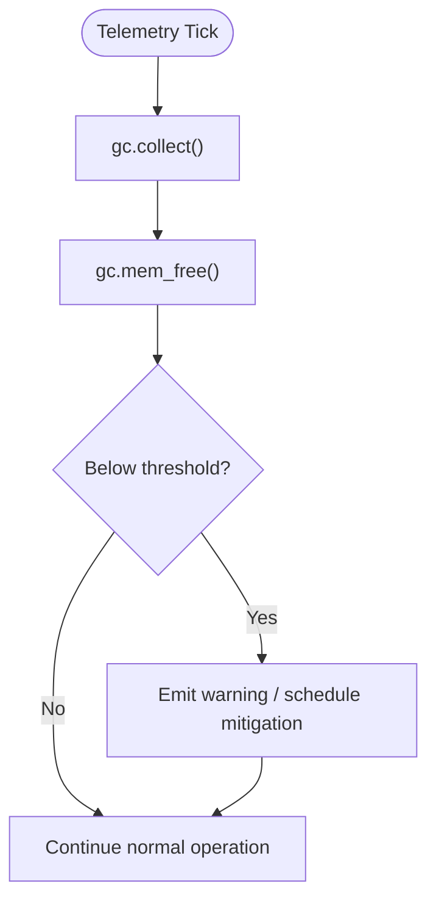
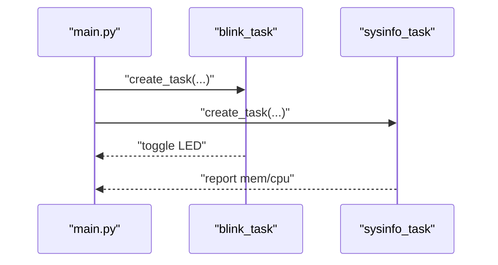
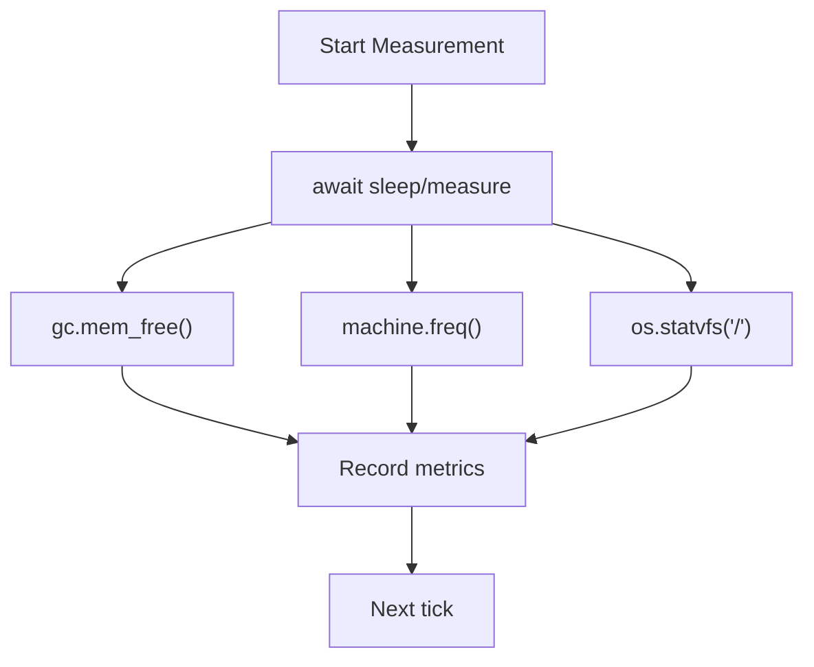
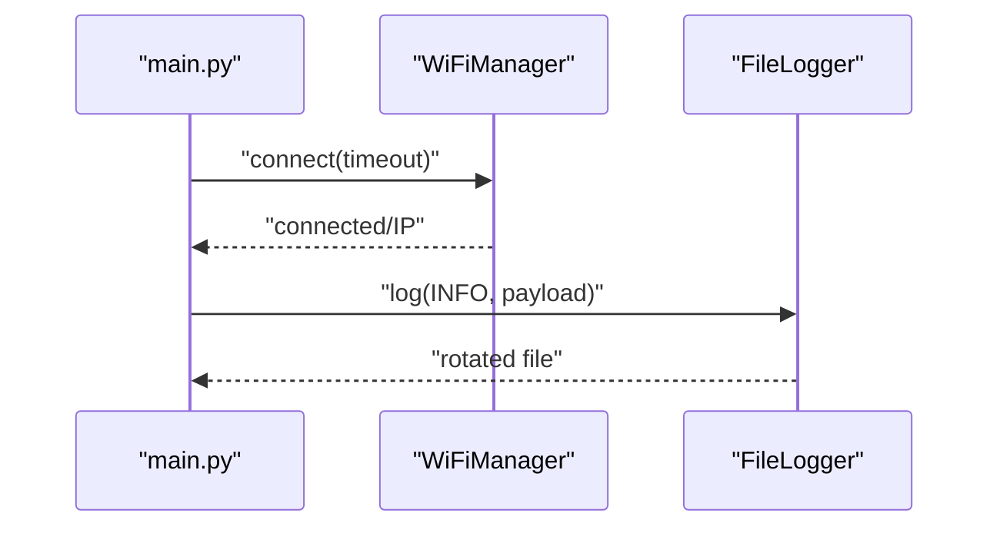
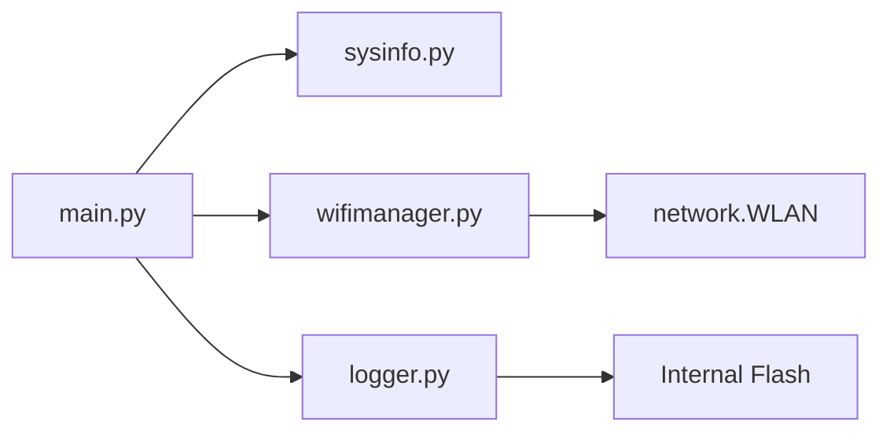

# Performance Optimization

<cite>
**Referenced Files in This Document**
- [main.py](file://src/main/main.py)
- [sysinfo.py](file://src/lib/system/sysinfo.py)
- [wifimanager.py](file://src/lib/wifi/wifimanager.py)
- [logger.py](file://src/lib/storage/logger.py)
- [storage_example.py](file://src/main/examples/storage_example.py)
- [README_ASYNCIO.md](file://src/main/README_ASYNCIO.md)
- [device.cfg](file://src/device.cfg)
</cite>

## Table of Contents
1. [Introduction](#introduction)
2. [Project Structure](#project-structure)
3. [Core Components](#core-components)
4. [Architecture Overview](#architecture-overview)
5. [Detailed Component Analysis](#detailed-component-analysis)
6. [Dependency Analysis](#dependency-analysis)
7. [Performance Considerations](#performance-considerations)
8. [Troubleshooting Guide](#troubleshooting-guide)
9. [Conclusion](#conclusion)
10. [Appendices](#appendices)

## Introduction
This document provides a comprehensive guide to performance optimization for the ESP32-C3 using the MicroPython framework present in this repository. It focuses on memory management, CPU scheduling, power-aware operation, and profiling techniques. It also covers optimization patterns for I/O, networking, and storage, along with benchmarking and continuous improvement workflows. Practical examples are referenced from the repository’s main application and supporting modules.

## Project Structure
The repository organizes performance-relevant code across:
- Application entry and tasks: [main.py](file://src/main/main.py)
- System telemetry and memory monitoring: [sysinfo.py](file://src/lib/system/sysinfo.py)
- Network connectivity and throughput: [wifimanager.py](file://src/lib/wifi/wifimanager.py)
- Logging and storage I/O: [logger.py](file://src/lib/storage/logger.py), [storage_example.py](file://src/main/examples/storage_example.py)
- Async programming best practices: [README_ASYNCIO.md](file://src/main/README_ASYNCIO.md)
- Device configuration: [device.cfg](file://src/device.cfg)

**Diagram sources**
- [main.py:1-84](file://src/main/main.py#L1-L84)
- [sysinfo.py:1-64](file://src/lib/system/sysinfo.py#L1-L64)
- [wifimanager.py:1-801](file://src/lib/wifi/wifimanager.py#L1-L801)
- [logger.py:1-90](file://src/lib/storage/logger.py#L1-L90)
- [storage_example.py:1-63](file://src/main/examples/storage_example.py#L1-L63)
- [README_ASYNCIO.md:782-823](file://src/main/README_ASYNCIO.md#L782-L823)
- [device.cfg:1-16](file://src/device.cfg#L1-L16)

**Section sources**
- [main.py:1-84](file://src/main/main.py#L1-L84)
- [sysinfo.py:1-64](file://src/lib/system/sysinfo.py#L1-L64)
- [wifimanager.py:1-801](file://src/lib/wifi/wifimanager.py#L1-L801)
- [logger.py:1-90](file://src/lib/storage/logger.py#L1-L90)
- [storage_example.py:1-63](file://src/main/examples/storage_example.py#L1-L63)
- [README_ASYNCIO.md:782-823](file://src/main/README_ASYNCIO.md#L782-L823)
- [device.cfg:1-16](file://src/device.cfg#L1-L16)

## Core Components
- Application entry and task orchestration:
  - Demonstrates concurrent tasks, periodic telemetry, and graceful shutdown via [main.py:28-71](file://src/main/main.py#L28-L71).
- System telemetry and memory monitoring:
  - Provides CPU frequency, memory statistics, filesystem usage, and reset/wake reasons via [sysinfo.py:10-64](file://src/lib/system/sysinfo.py#L10-L64).
- WiFi manager:
  - Handles STA connection, scanning, keep-alive, and portal server with async I/O patterns via [wifimanager.py:38-397](file://src/lib/wifi/wifimanager.py#L38-L397).
- Storage logger:
  - Implements rotating logs with configurable sizes and backup counts via [logger.py:10-90](file://src/lib/storage/logger.py#L10-L90).
- Async best practices:
  - Includes queue sizing, avoiding closures in tasks, and memory checks via [README_ASYNCIO.md:782-823](file://src/main/README_ASYNCIO.md#L782-L823).

**Section sources**
- [main.py:28-71](file://src/main/main.py#L28-L71)
- [sysinfo.py:10-64](file://src/lib/system/sysinfo.py#L10-L64)
- [wifimanager.py:38-397](file://src/lib/wifi/wifimanager.py#L38-L397)
- [logger.py:10-90](file://src/lib/storage/logger.py#L10-L90)
- [README_ASYNCIO.md:782-823](file://src/main/README_ASYNCIO.md#L782-L823)

## Architecture Overview
The runtime architecture centers on an asyncio-driven main loop that spawns lightweight tasks for blinking LEDs, reporting system stats, and managing WiFi connectivity. Telemetry uses the system module to query memory and CPU metrics, while logging writes to internal flash with rotation.

**Diagram sources**
- [main.py:28-71](file://src/main/main.py#L28-L71)
- [sysinfo.py:10-64](file://src/lib/system/sysinfo.py#L10-L64)
- [wifimanager.py:226-291](file://src/lib/wifi/wifimanager.py#L226-L291)
- [logger.py:68-89](file://src/lib/storage/logger.py#L68-L89)

## Detailed Component Analysis

### Memory Management Strategies
- Heap optimization and garbage collection:
  - Periodic collection and free memory reporting are demonstrated in the system info task via [main.py:38-43](file://src/main/main.py#L38-L43) and [sysinfo.py:31-38](file://src/lib/system/sysinfo.py#L31-L38).
  - Async best practices emphasize explicit collection and queue sizing to avoid fragmentation and runaway growth via [README_ASYNCIO.md:782-823](file://src/main/README_ASYNCIO.md#L782-L823).
- Memory pool allocation for constrained environments:
  - Prefer fixed-size buffers and reuse objects to reduce allocation churn; see queue sizing guidance in [README_ASYNCIO.md:782-786](file://src/main/README_ASYNCIO.md#L782-L786).
- Memory monitoring:
  - Use [sysinfo.py:31-38](file://src/lib/system/sysinfo.py#L31-L38) to measure free/allocated memory and trigger mitigation actions.

**Diagram sources**
- [main.py:38-43](file://src/main/main.py#L38-L43)
- [sysinfo.py:31-38](file://src/lib/system/sysinfo.py#L31-L38)
- [README_ASYNCIO.md:809-820](file://src/main/README_ASYNCIO.md#L809-L820)

**Section sources**
- [main.py:38-43](file://src/main/main.py#L38-L43)
- [sysinfo.py:31-38](file://src/lib/system/sysinfo.py#L31-L38)
- [README_ASYNCIO.md:782-823](file://src/main/README_ASYNCIO.md#L782-L823)

### CPU Optimization Techniques
- Task scheduling:
  - Use asyncio tasks for concurrency without threads; spawn tasks in [main.py:65-66](file://src/main/main.py#L65-L66).
  - Avoid closures in task creation per [README_ASYNCIO.md:788-796](file://src/main/README_ASYNCIO.md#L788-L796).
- Interrupt handling:
  - The repository does not expose dedicated ISR handlers; use cooperative scheduling and timeouts for latency-sensitive workloads.
- Processor frequency management:
  - Query current frequency via [sysinfo.py:12-13](file://src/lib/system/sysinfo.py#L12-L13); adjust frequency using platform APIs if applicable to your build.

**Diagram sources**
- [main.py:28-71](file://src/main/main.py#L28-L71)
- [sysinfo.py:12-13](file://src/lib/system/sysinfo.py#L12-L13)

**Section sources**
- [main.py:28-71](file://src/main/main.py#L28-L71)
- [sysinfo.py:12-13](file://src/lib/system/sysinfo.py#L12-L13)
- [README_ASYNCIO.md:788-796](file://src/main/README_ASYNCIO.md#L788-L796)

### Power Consumption Reduction Strategies
- Sleep modes and dynamic control:
  - The repository does not include explicit deep-sleep or light-sleep calls; implement idle loops and minimize active peripherals during inactivity.
- Dynamic voltage scaling:
  - Frequency can be queried via [sysinfo.py:12-13](file://src/lib/system/sysinfo.py#L12-L13); platform-specific APIs may control scaling.
- Efficient peripheral management:
  - Deactivate radios and I/O when not in use; leverage keep-alive patterns in [wifimanager.py:318-342](file://src/lib/wifi/wifimanager.py#L318-L342) to avoid constant polling.

**Section sources**
- [sysinfo.py:12-13](file://src/lib/system/sysinfo.py#L12-L13)
- [wifimanager.py:318-342](file://src/lib/wifi/wifimanager.py#L318-L342)

### Performance Profiling Methods
- Built-in timing functions:
  - Use monotonic time sources for delta measurements; integrate with telemetry loops in [main.py:38-43](file://src/main/main.py#L38-L43).
- Memory monitoring:
  - Periodically call [sysinfo.py:31-38](file://src/lib/system/sysinfo.py#L31-L38) to track free/allocated memory.
- System resource tracking:
  - Combine CPU frequency and filesystem usage via [sysinfo.py:41-51](file://src/lib/system/sysinfo.py#L41-L51).

**Diagram sources**
- [main.py:38-43](file://src/main/main.py#L38-L43)
- [sysinfo.py:31-51](file://src/lib/system/sysinfo.py#L31-L51)

**Section sources**
- [main.py:38-43](file://src/main/main.py#L38-L43)
- [sysinfo.py:31-51](file://src/lib/system/sysinfo.py#L31-L51)

### Optimization Patterns for I/O, Networking, and Storage
- I/O operations:
  - Use buffered writes and limit I/O frequency; see rotating log pattern in [logger.py:68-89](file://src/lib/storage/logger.py#L68-L89).
- Network communication:
  - Leverage async I/O and timeouts; see connection loop and keep-alive in [wifimanager.py:226-291](file://src/lib/wifi/wifimanager.py#L226-L291) and [wifimanager.py:318-342](file://src/lib/wifi/wifimanager.py#L318-L342).
- Sensor data processing:
  - Apply batching and throttling; prefer fixed-size buffers and avoid frequent allocations as guided in [README_ASYNCIO.md:782-807](file://src/main/README_ASYNCIO.md#L782-L807).

**Diagram sources**
- [main.py:49-66](file://src/main/main.py#L49-L66)
- [wifimanager.py:226-291](file://src/lib/wifi/wifimanager.py#L226-L291)
- [logger.py:68-89](file://src/lib/storage/logger.py#L68-L89)

**Section sources**
- [wifimanager.py:226-291](file://src/lib/wifi/wifimanager.py#L226-L291)
- [wifimanager.py:318-342](file://src/lib/wifi/wifimanager.py#L318-L342)
- [logger.py:68-89](file://src/lib/storage/logger.py#L68-L89)
- [README_ASYNCIO.md:782-807](file://src/main/README_ASYNCIO.md#L782-L807)

### Cache Management, Buffer Optimization, and Data Structure Efficiency
- Prefer compact data structures and slots for frequently instantiated objects as shown in [README_ASYNCIO.md:798-807](file://src/main/README_ASYNCIO.md#L798-L807).
- Limit queue sizes to cap memory usage via [README_ASYNCIO.md:782-786](file://src/main/README_ASYNCIO.md#L782-L786).
- Reuse buffers and avoid repeated allocations in hot paths.

**Section sources**
- [README_ASYNCIO.md:782-807](file://src/main/README_ASYNCIO.md#L782-L807)

### Benchmarking Methodologies, Regression Testing, and Continuous Optimization
- Benchmarking:
  - Measure deltas around critical sections using monotonic timestamps; aggregate metrics periodically as in [main.py:38-43](file://src/main/main.py#L38-L43).
- Regression testing:
  - Compare free memory and CPU frequency across builds using [sysinfo.py:12-13](file://src/lib/system/sysinfo.py#L12-L13) and [sysinfo.py:31-38](file://src/lib/system/sysinfo.py#L31-L38).
- Continuous optimization:
  - Integrate periodic telemetry into the main loop via [main.py:69-70](file://src/main/main.py#L69-L70) and adjust strategies based on observed trends.

**Section sources**
- [main.py:38-70](file://src/main/main.py#L38-L70)
- [sysinfo.py:12-38](file://src/lib/system/sysinfo.py#L12-L38)

## Dependency Analysis
The application depends on system telemetry for runtime metrics and on WiFi management for connectivity. Logging is decoupled and can be toggled for performance isolation.

**Diagram sources**
- [main.py:1-84](file://src/main/main.py#L1-L84)
- [sysinfo.py:1-64](file://src/lib/system/sysinfo.py#L1-L64)
- [wifimanager.py:1-801](file://src/lib/wifi/wifimanager.py#L1-L801)
- [logger.py:1-90](file://src/lib/storage/logger.py#L1-L90)

**Section sources**
- [main.py:1-84](file://src/main/main.py#L1-L84)
- [sysinfo.py:1-64](file://src/lib/system/sysinfo.py#L1-L64)
- [wifimanager.py:1-801](file://src/lib/wifi/wifimanager.py#L1-L801)
- [logger.py:1-90](file://src/lib/storage/logger.py#L1-L90)

## Performance Considerations
- Favor cooperative multitasking with asyncio; avoid blocking operations in the main loop as in [main.py:69-70](file://src/main/main.py#L69-L70).
- Keep queues bounded and avoid closures in task creation as in [README_ASYNCIO.md:782-796](file://src/main/README_ASYNCIO.md#L782-L796).
- Monitor memory regularly and trigger mitigation when thresholds are crossed via [sysinfo.py:31-38](file://src/lib/system/sysinfo.py#L31-L38).

[No sources needed since this section provides general guidance]

## Troubleshooting Guide
- Memory pressure:
  - Use periodic collection and reporting as in [main.py:38-43](file://src/main/main.py#L38-L43) and [sysinfo.py:31-38](file://src/lib/system/sysinfo.py#L31-L38).
- WiFi connectivity issues:
  - Inspect connection status and keep-alive behavior in [wifimanager.py:226-291](file://src/lib/wifi/wifimanager.py#L226-L291) and [wifimanager.py:318-342](file://src/lib/wifi/wifimanager.py#L318-L342).
- Logging performance:
  - Adjust max_bytes and backup_count in [logger.py:23-28](file://src/lib/storage/logger.py#L23-L28) to balance verbosity and I/O overhead.

**Section sources**
- [main.py:38-43](file://src/main/main.py#L38-L43)
- [sysinfo.py:31-38](file://src/lib/system/sysinfo.py#L31-L38)
- [wifimanager.py:226-291](file://src/lib/wifi/wifimanager.py#L226-L291)
- [wifimanager.py:318-342](file://src/lib/wifi/wifimanager.py#L318-L342)
- [logger.py:23-28](file://src/lib/storage/logger.py#L23-L28)

## Conclusion
By combining periodic telemetry, bounded async tasks, and disciplined I/O practices, applications on ESP32-C3 can achieve predictable performance under memory constraints. Use the provided modules to monitor memory and CPU, manage WiFi efficiently, and write logs with minimal overhead. Iterate with benchmarking and regression tests to sustain long-term performance.

[No sources needed since this section summarizes without analyzing specific files]

## Appendices
- Practical examples:
  - Application entry and tasks: [main.py:28-71](file://src/main/main.py#L28-L71)
  - Storage logging: [storage_example.py:21-29](file://src/main/examples/storage_example.py#L21-L29)
- Device configuration:
  - Target and sync settings: [device.cfg:1-16](file://src/device.cfg#L1-L16)

**Section sources**
- [main.py:28-71](file://src/main/main.py#L28-L71)
- [storage_example.py:21-29](file://src/main/examples/storage_example.py#L21-L29)
- [device.cfg:1-16](file://src/device.cfg#L1-L16)