# Async Programming Patterns

<cite>
**Referenced Files in This Document**
- [README_ASYNCIO.md](file://src/main/README_ASYNCIO.md)
- [asyncio_examples.py](file://src/main/examples/asyncio_examples.py)
- [asyncio.pyi](file://src/stubs/asyncio.pyi)
- [main.py](file://src/main/main.py)
- [boot_production.py](file://src/main/boot_production.py)
- [sysinfo.py](file://src/lib/system/sysinfo.py)
- [wifimanager.py](file://src/lib/wifi/wifimanager.py)
- [tjc_hmi.py](file://src/lib/display/tjc_hmi.py)
</cite>

## Table of Contents
1. [Introduction](#introduction)
2. [Project Structure](#project-structure)
3. [Core Components](#core-components)
4. [Architecture Overview](#architecture-overview)
5. [Detailed Component Analysis](#detailed-component-analysis)
6. [Dependency Analysis](#dependency-analysis)
7. [Performance Considerations](#performance-considerations)
8. [Troubleshooting Guide](#troubleshooting-guide)
9. [Conclusion](#conclusion)

## Introduction
This document explains async-first programming on the ESP32-C3 using MicroPython’s cooperative multitasking model. It covers event loops, task creation and lifecycle, concurrency patterns, and event-driven designs. Practical examples from the repository demonstrate async/await usage, coroutine management, task scheduling, resource sharing, timeouts, stream I/O, ISR-safe signaling, and structured shutdown. Guidance is included for memory-conscious embedded async, debugging, and building robust async applications.

## Project Structure
The repository organizes async-related materials across:
- A comprehensive guide to MicroPython asyncio patterns
- Example applications showcasing concurrent tasks and device drivers
- Type stubs extending asyncio with MicroPython-specific helpers
- A starter application demonstrating async tasks and graceful shutdown
- Libraries implementing async-aware subsystems (WiFi, display, system info)

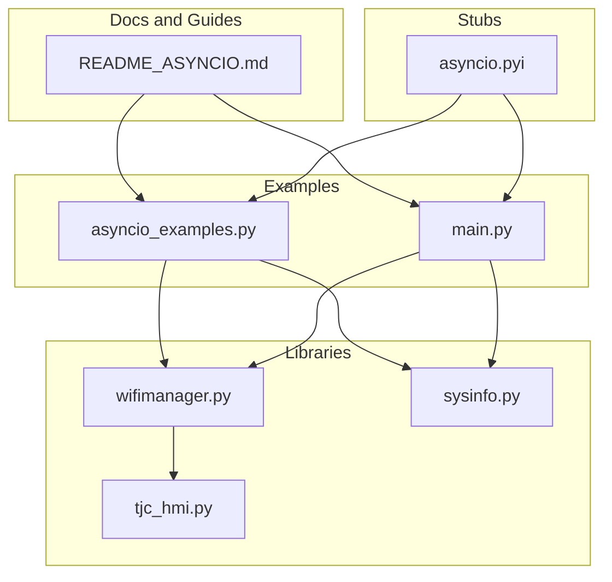

**Diagram sources**
- [README_ASYNCIO.md:1-840](file://src/main/README_ASYNCIO.md#L1-L840)
- [asyncio_examples.py:1-234](file://src/main/examples/asyncio_examples.py#L1-L234)
- [asyncio.pyi:1-28](file://src/stubs/asyncio.pyi#L1-L28)
- [main.py:1-84](file://src/main/main.py#L1-L84)
- [wifimanager.py:1-801](file://src/lib/wifi/wifimanager.py#L1-L801)
- [sysinfo.py:1-64](file://src/lib/system/sysinfo.py#L1-L64)
- [tjc_hmi.py:225-424](file://src/lib/display/tjc_hmi.py#L225-L424)

**Section sources**
- [README_ASYNCIO.md:1-840](file://src/main/README_ASYNCIO.md#L1-L840)
- [asyncio_examples.py:1-234](file://src/main/examples/asyncio_examples.py#L1-L234)
- [asyncio.pyi:1-28](file://src/stubs/asyncio.pyi#L1-L28)
- [main.py:1-84](file://src/main/main.py#L1-L84)

## Core Components
- Event loop and cooperative multitasking: Tasks must yield via await to let others run.
- Task creation and lifecycle: create_task, cancellation, done checks, and proper cleanup.
- Concurrency primitives: gather, Event, Lock, Queue, wait_for, ThreadSafeFlag.
- Streams: StreamReader/StreamWriter for UART/TCP.
- Embedded patterns: Producer/Consumer, State Machine, Watchdog, Debounce.
- Anti-patterns and best practices: avoid blocking sleeps, compute yields, proper cancel propagation, shared resource locking, ISR-safe signaling.

**Section sources**
- [README_ASYNCIO.md:31-800](file://src/main/README_ASYNCIO.md#L31-L800)
- [asyncio_examples.py:147-193](file://src/main/examples/asyncio_examples.py#L147-L193)

## Architecture Overview
The ESP32-C3 application follows an async-first architecture:
- An event loop runs concurrently scheduled tasks.
- Long-running operations use await sleep variants to remain responsive.
- Shared hardware and resources are protected with locks and queues.
- Streams enable non-blocking I/O for networking and serial peripherals.
- Graceful shutdown cancels tasks and cleans up resources.

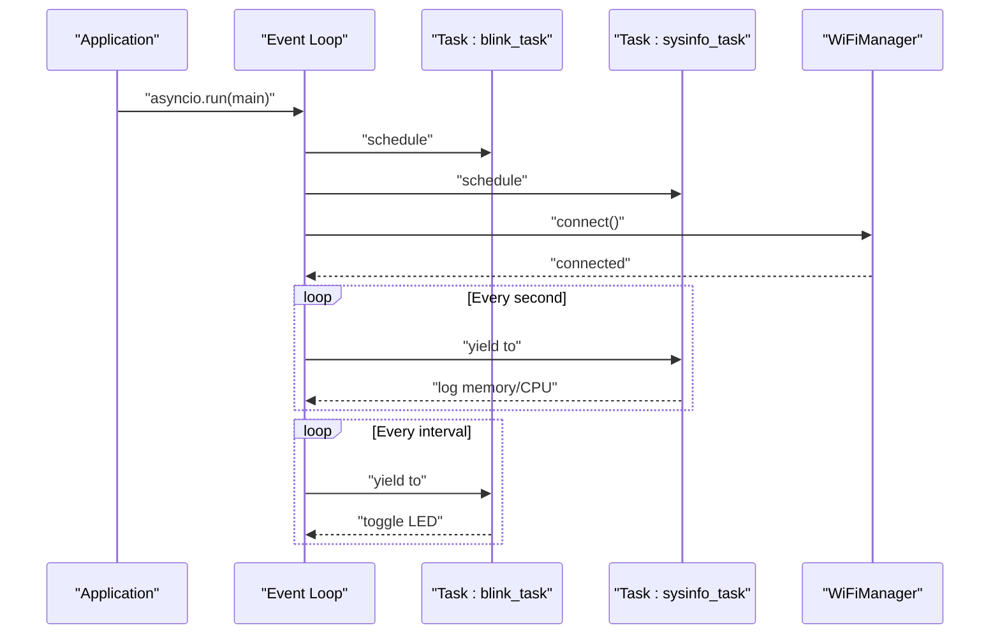

**Diagram sources**
- [main.py:49-71](file://src/main/main.py#L49-L71)
- [wifimanager.py:226-291](file://src/lib/wifi/wifimanager.py#L226-L291)

**Section sources**
- [main.py:28-71](file://src/main/main.py#L28-L71)
- [wifimanager.py:226-291](file://src/lib/wifi/wifimanager.py#L226-L291)

## Detailed Component Analysis

### Event Loop and Cooperative Multitasking
- MicroPython uses cooperative multitasking; tasks must await to yield control.
- Blocking sleeps will stall all tasks; use await sleep variants.

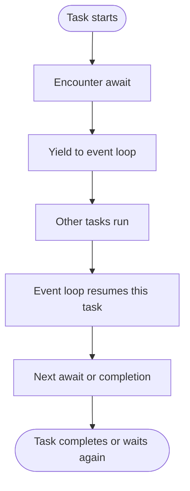

**Section sources**
- [README_ASYNCIO.md:31-49](file://src/main/README_ASYNCIO.md#L31-L49)

### Task Creation and Lifecycle
- Create tasks to run concurrently without blocking the main coroutine.
- Cancel tasks gracefully and handle CancelledError properly.
- Use gather to run multiple coroutines concurrently and wait for all.

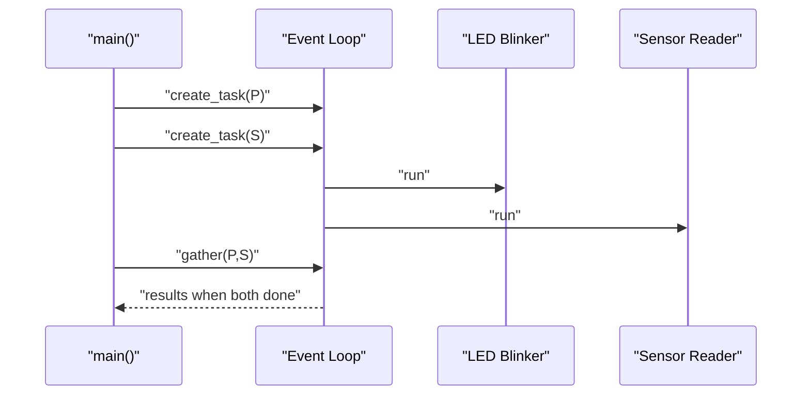

**Diagram sources**
- [asyncio_examples.py:147-174](file://src/main/examples/asyncio_examples.py#L147-L174)

**Section sources**
- [asyncio_examples.py:147-193](file://src/main/examples/asyncio_examples.py#L147-L193)

### Concurrency Primitives: Event, Lock, Queue
- Event: signal between tasks without shared mutable state.
- Lock: protect shared hardware or buffers (e.g., I2C).
- Queue: decouple producers and consumers with backpressure.

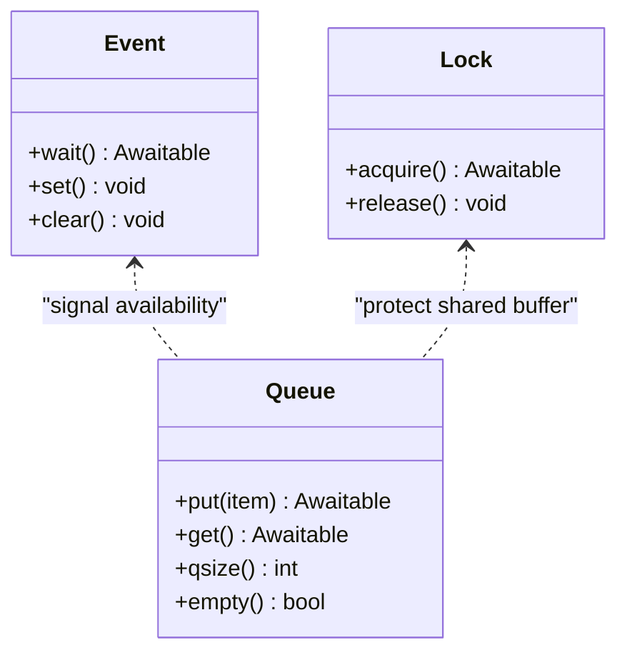

**Diagram sources**
- [README_ASYNCIO.md:206-321](file://src/main/README_ASYNCIO.md#L206-L321)

**Section sources**
- [README_ASYNCIO.md:206-321](file://src/main/README_ASYNCIO.md#L206-L321)

### Timeouts and wait_for
- Use wait_for to bound long operations and prevent stalls.
- Handle TimeoutError and continue operation.

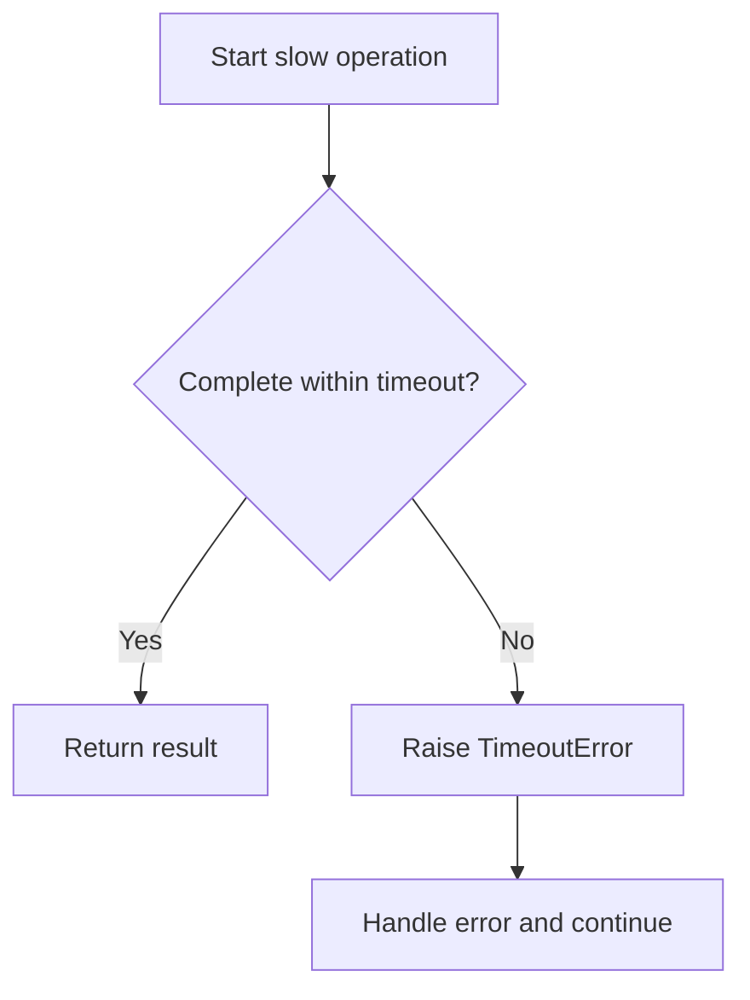

**Diagram sources**
- [README_ASYNCIO.md:325-360](file://src/main/README_ASYNCIO.md#L325-L360)

**Section sources**
- [README_ASYNCIO.md:325-360](file://src/main/README_ASYNCIO.md#L325-L360)

### Stream I/O: UART and TCP
- Use StreamReader/StreamWriter for non-blocking UART/TCP.
- Drain writes and handle client timeouts.

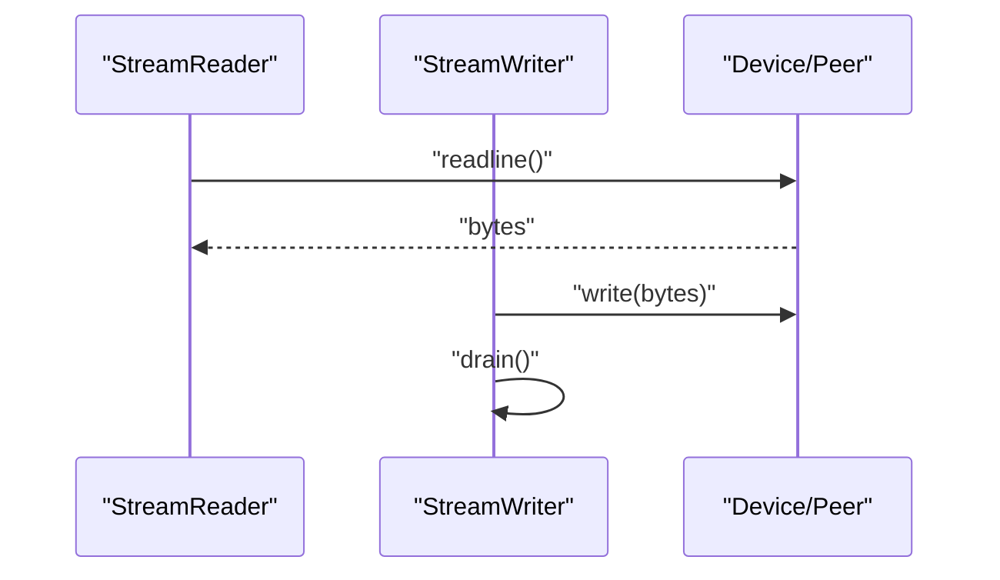

**Diagram sources**
- [README_ASYNCIO.md:363-430](file://src/main/README_ASYNCIO.md#L363-L430)

**Section sources**
- [README_ASYNCIO.md:363-430](file://src/main/README_ASYNCIO.md#L363-L430)

### ISR-Safe Signaling with ThreadSafeFlag
- Use ThreadSafeFlag to safely wake async tasks from ISR or threads.

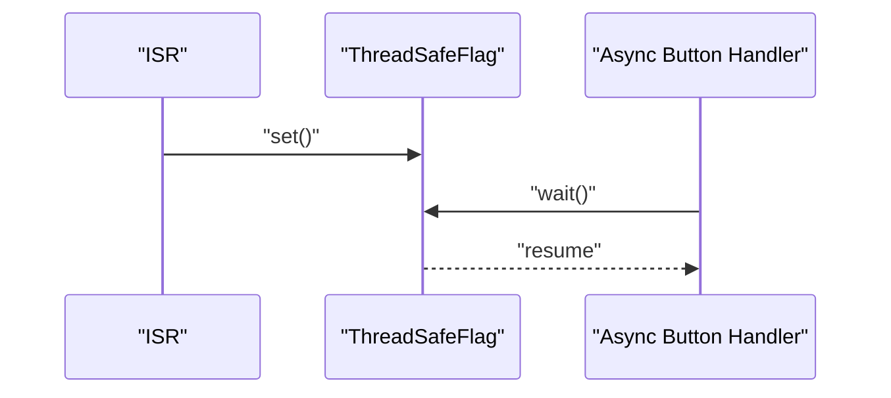

**Diagram sources**
- [README_ASYNCIO.md:434-462](file://src/main/README_ASYNCIO.md#L434-L462)

**Section sources**
- [README_ASYNCIO.md:434-462](file://src/main/README_ASYNCIO.md#L434-L462)

### Patterns: Producer/Consumer, State Machine, Watchdog, Debounce
- Producer/Consumer: decouple data acquisition and processing with a bounded queue.
- State Machine: drive finite modes with events and timeouts.
- Watchdog: ensure main task responsiveness; reset on timeout.
- Debounce: poll pin edges with await sleep to avoid blocking.

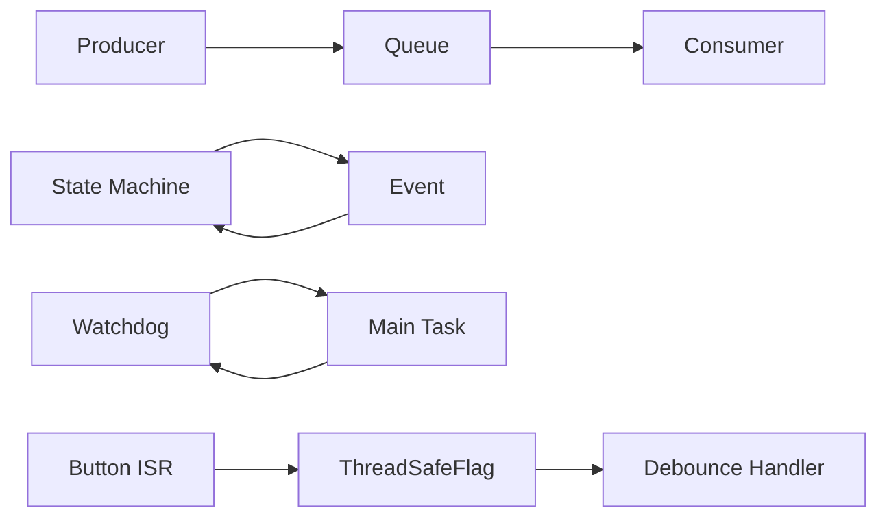

**Diagram sources**
- [README_ASYNCIO.md:468-666](file://src/main/README_ASYNCIO.md#L468-L666)

**Section sources**
- [README_ASYNCIO.md:468-666](file://src/main/README_ASYNCIO.md#L468-L666)

### Async/Await in Examples
- LED blinking and sensor reading tasks demonstrate periodic work with await sleep.
- WiFiManager exposes async connect/keep_alive routines suitable for concurrent use.
- The main example creates tasks and gathers them, with cleanup on exit.

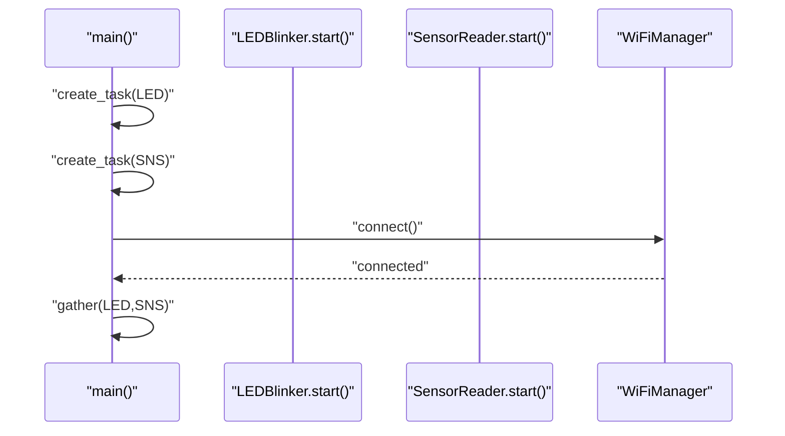

**Diagram sources**
- [asyncio_examples.py:147-193](file://src/main/examples/asyncio_examples.py#L147-L193)
- [wifimanager.py:226-291](file://src/lib/wifi/wifimanager.py#L226-L291)

**Section sources**
- [asyncio_examples.py:11-234](file://src/main/examples/asyncio_examples.py#L11-L234)
- [wifimanager.py:226-291](file://src/lib/wifi/wifimanager.py#L226-L291)

### MicroPython asyncio Extensions
- The stubs add sleep_ms and sleep_us to the asyncio interface for precise, lightweight delays.

**Section sources**
- [asyncio.pyi:20-27](file://src/stubs/asyncio.pyi#L20-L27)

### Structured Startup and Shutdown
- The main entry uses asyncio.run to bootstrap the event loop and handles exceptions and reset.
- Tasks are created early; main loop remains responsive with await sleep.
- Graceful shutdown cancels tasks and cleans up resources.

**Section sources**
- [main.py:49-83](file://src/main/main.py#L49-L83)

### Resource Sharing and Hardware Coordination
- Display driver coordinates UART traffic with a command queue and lock to serialize access.
- WiFi manager keeps connections alive and reconnects on failure.

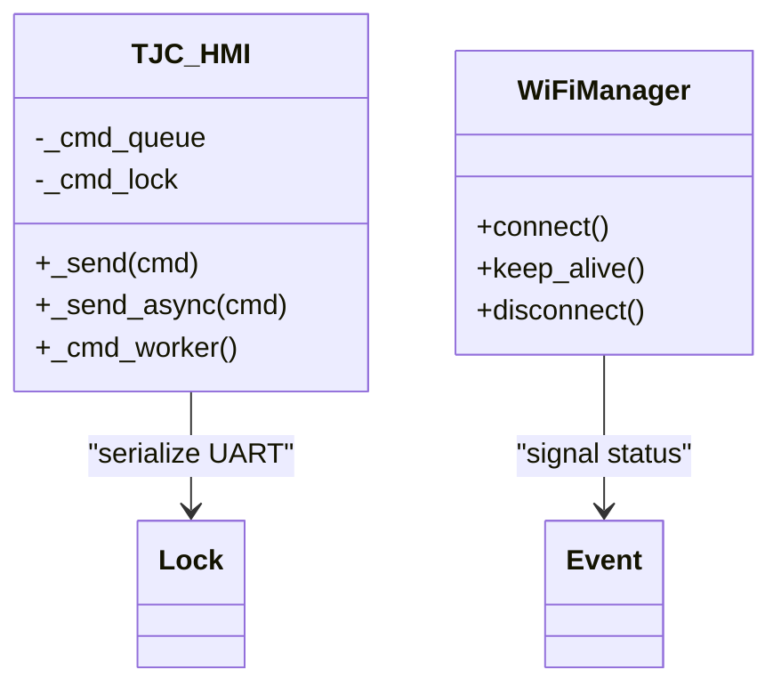

**Diagram sources**
- [tjc_hmi.py:231-294](file://src/lib/display/tjc_hmi.py#L231-L294)
- [wifimanager.py:318-342](file://src/lib/wifi/wifimanager.py#L318-L342)

**Section sources**
- [tjc_hmi.py:278-294](file://src/lib/display/tjc_hmi.py#L278-L294)
- [wifimanager.py:318-342](file://src/lib/wifi/wifimanager.py#L318-L342)

## Dependency Analysis
- The examples depend on asyncio primitives and device abstractions (machine, network).
- The main application depends on WiFiManager and SysInfo for runtime diagnostics.
- The display module encapsulates async serialization for UART devices.

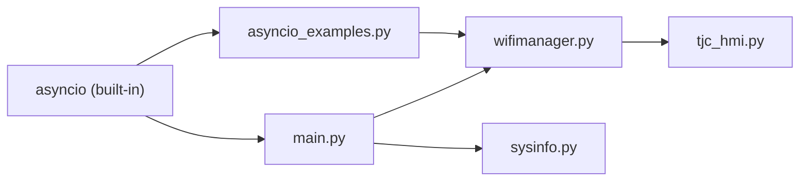

**Diagram sources**
- [asyncio_examples.py:1-234](file://src/main/examples/asyncio_examples.py#L1-L234)
- [main.py:1-84](file://src/main/main.py#L1-L84)
- [wifimanager.py:1-801](file://src/lib/wifi/wifimanager.py#L1-L801)
- [sysinfo.py:1-64](file://src/lib/system/sysinfo.py#L1-L64)
- [tjc_hmi.py:225-424](file://src/lib/display/tjc_hmi.py#L225-L424)

**Section sources**
- [asyncio_examples.py:1-234](file://src/main/examples/asyncio_examples.py#L1-L234)
- [main.py:1-84](file://src/main/main.py#L1-L84)
- [wifimanager.py:1-801](file://src/lib/wifi/wifimanager.py#L1-L801)
- [sysinfo.py:1-64](file://src/lib/system/sysinfo.py#L1-L64)
- [tjc_hmi.py:225-424](file://src/lib/display/tjc_hmi.py#L225-L424)

## Performance Considerations
- Prefer await sleep_ms for short delays to avoid float conversion overhead.
- Use bounded queues to cap memory growth.
- Periodically call garbage collection in idle tasks.
- Avoid lambda closures in create_task; pass pre-bound coroutines to reduce allocations.
- Use __slots__ in frequently instantiated classes to reduce memory footprint.

**Section sources**
- [README_ASYNCIO.md:765-800](file://src/main/README_ASYNCIO.md#L765-L800)

## Troubleshooting Guide
Common pitfalls and remedies:
- Blocking sleeps in async: Replace time.sleep with await asyncio.sleep variants.
- Heavy computation without yielding: Insert periodic await sleep(0) or await sleep_ms to yield.
- Forgetting to await or schedule coroutines: Use create_task or await directly.
- Race conditions on shared mutable state: Protect with asyncio.Lock.
- Swallowing CancelledError: Always re-raise after cleanup in exception handlers.
- ISR safety: Use ThreadSafeFlag to wake async tasks from ISR.

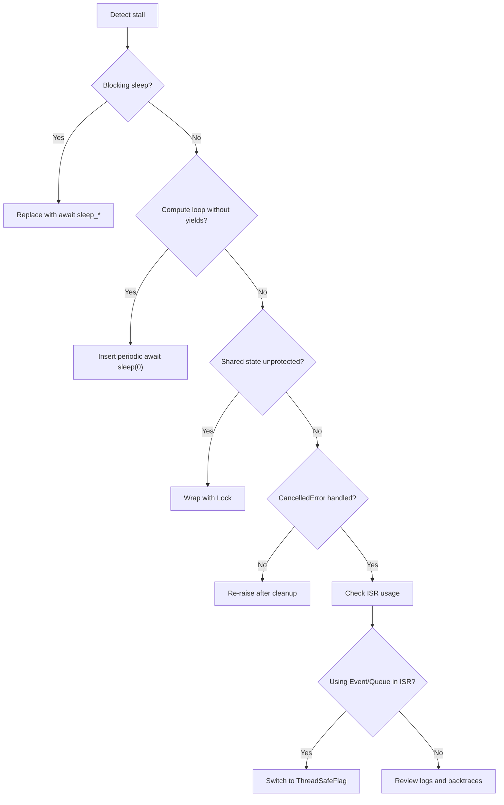

**Diagram sources**
- [README_ASYNCIO.md:670-749](file://src/main/README_ASYNCIO.md#L670-L749)

**Section sources**
- [README_ASYNCIO.md:670-749](file://src/main/README_ASYNCIO.md#L670-L749)

## Conclusion
The ESP32-C3 MicroPython codebase demonstrates a coherent async-first approach: cooperative multitasking, structured task orchestration, and safe resource sharing. By leveraging asyncio primitives, streams, and ISR-safe signaling, applications remain responsive and maintainable. The included examples and libraries provide reusable patterns for concurrency, I/O, and device coordination in embedded environments.