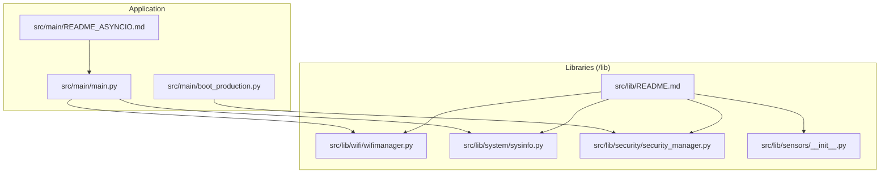
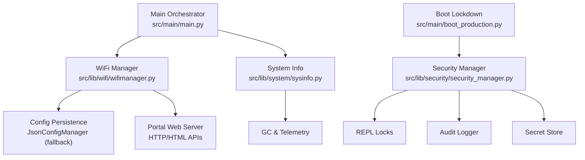
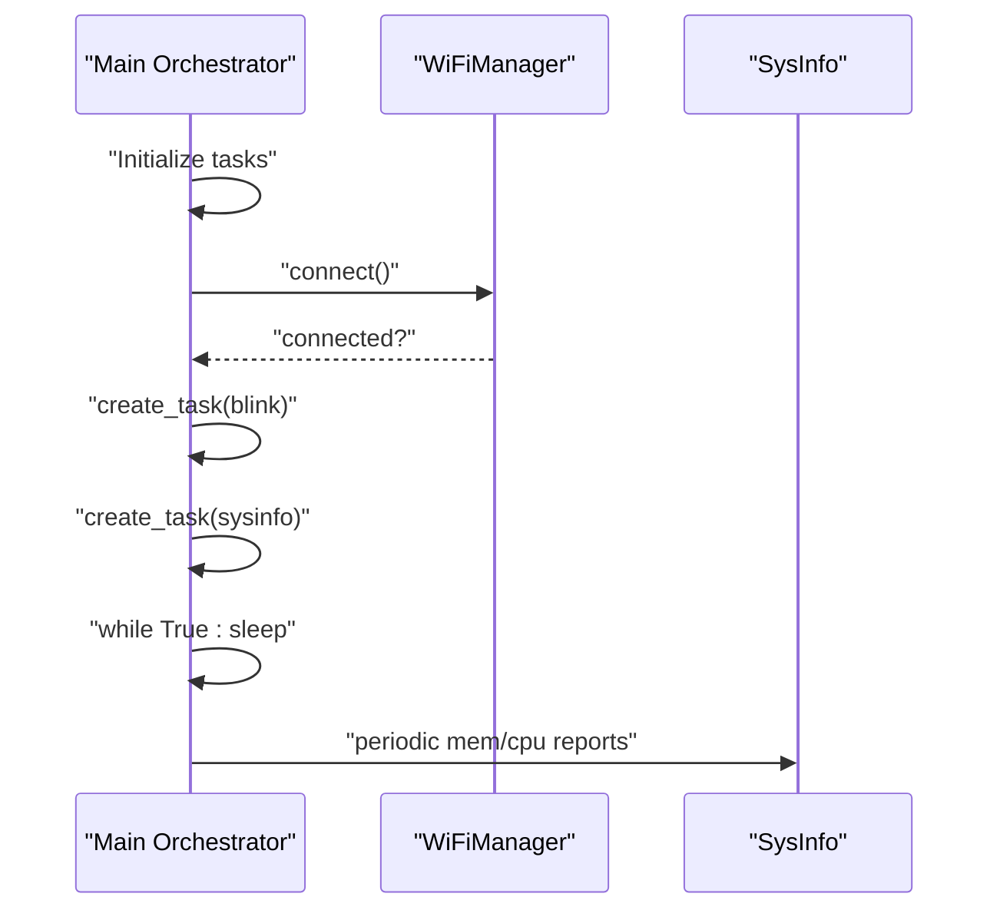
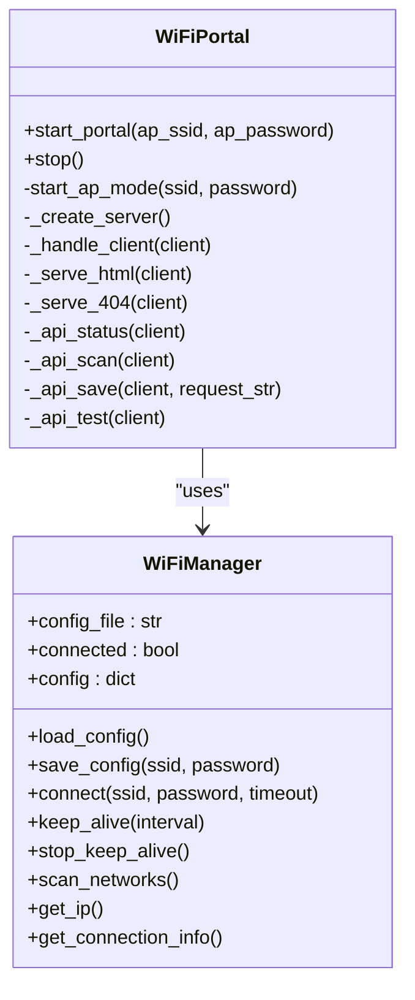
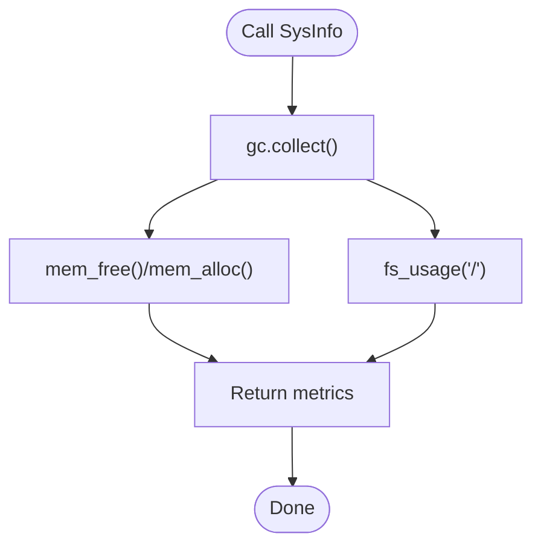
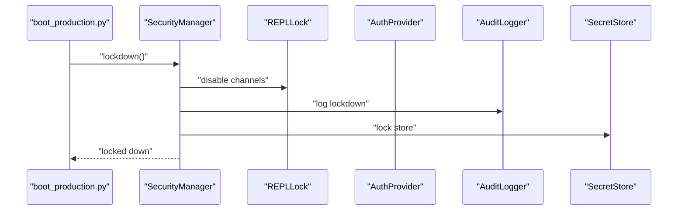
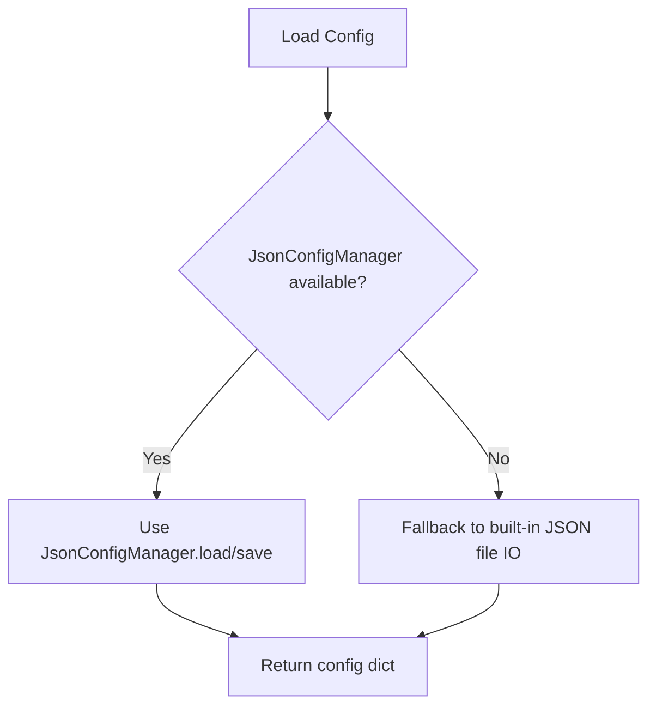
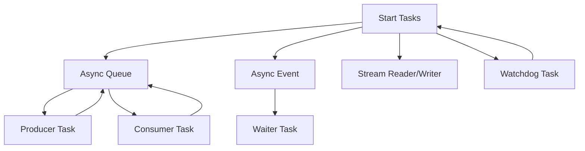
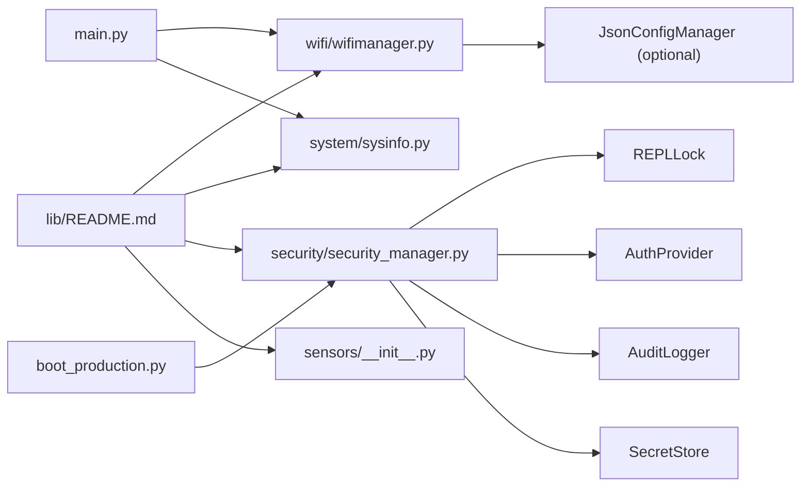

# Core Architecture

<cite>
**Referenced Files in This Document**
- [main.py](file://src/main/main.py)
- [boot_production.py](file://src/main/boot_production.py)
- [README.md](file://src/lib/README.md)
- [wifimanager.py](file://src/lib/wifi/wifimanager.py)
- [sysinfo.py](file://src/lib/system/sysinfo.py)
- [security_manager.py](file://src/lib/security/security_manager.py)
- [__init__.py (sensors)](file://src/lib/sensors/__init__.py)
- [README_ASYNCIO.md](file://src/main/README_ASYNCIO.md)
- [device.cfg](file://src/device.cfg)
</cite>

## Table of Contents
1. [Introduction](#introduction)
2. [Project Structure](#project-structure)
3. [Core Components](#core-components)
4. [Architecture Overview](#architecture-overview)
5. [Detailed Component Analysis](#detailed-component-analysis)
6. [Dependency Analysis](#dependency-analysis)
7. [Performance Considerations](#performance-considerations)
8. [Troubleshooting Guide](#troubleshooting-guide)
9. [Conclusion](#conclusion)
10. [Appendices](#appendices)

## Introduction
This document describes the core architecture of the ESP32-C3 MicroPython Library Framework. The system follows an async-first design using cooperative multitasking via asyncio, with a modular library structure that separates concerns across networking, sensors, storage, security, and system utilities. It documents key design patterns present in the codebase (factory pattern for WiFi portal creation, observer pattern for system monitoring, strategy pattern for sensor drivers, and singleton pattern for configuration management) and explains component interactions among the main application orchestration, WiFi manager coordination, system utilities, security manager, and storage manager. Cross-cutting concerns such as lazy hardware initialization, graceful degradation for optional dependencies, emoji-prefixed logging, memory management in constrained environments, and deployment topology are also covered.

## Project Structure
The project is organized into:
- src/main: Application entry points and examples demonstrating async patterns and module usage
- src/lib: Modular libraries grouped by domain (wifi, sensors, storage, security, system, etc.)
- src/stubs: Type stubs for static analysis
- Root configs and documentation

**Diagram sources**
- [main.py:1-84](file://src/main/main.py#L1-L84)
- [boot_production.py:1-56](file://src/main/boot_production.py#L1-L56)
- [README.md:1-72](file://src/lib/README.md#L1-L72)
- [wifimanager.py:1-801](file://src/lib/wifi/wifimanager.py#L1-L801)
- [sysinfo.py:1-64](file://src/lib/system/sysinfo.py#L1-L64)
- [security_manager.py:1-323](file://src/lib/security/security_manager.py#L1-L323)
- [__init__.py (sensors):1-27](file://src/lib/sensors/__init__.py#L1-L27)
- [README_ASYNCIO.md:1-840](file://src/main/README_ASYNCIO.md#L1-L840)

**Section sources**
- [README.md:1-72](file://src/lib/README.md#L1-L72)
- [device.cfg:1-16](file://src/device.cfg#L1-L16)

## Core Components
- Main application orchestration: Initializes async tasks, prints system info, and coordinates WiFi connectivity.
- WiFi manager: Handles STA/AP modes, persistent configuration, portal web server, and keep-alive connectivity.
- System utilities: Provides system information, memory usage, filesystem stats, and reset/wake reasons.
- Security manager: Central orchestrator for REPL lockdown, authentication, audit logging, and secret storage.
- Sensors: Exposes a catalog of sensor driver modules for heterogeneous sensor ecosystems.
- Storage manager: Manages configuration persistence and file logging (via JsonConfigManager fallback).
- Async runtime: Demonstrates cooperative multitasking patterns and best practices.

Key design patterns evidenced in the codebase:
- Factory pattern: WiFi portal creation via a dedicated inner class that encapsulates AP mode and HTTP server instantiation.
- Observer pattern: System monitoring through periodic tasks that poll and report system metrics.
- Strategy pattern: Sensor drivers as interchangeable modules implementing common interfaces.
- Singleton pattern: Configuration management centralized through JsonConfigManager instances per module.

**Section sources**
- [main.py:28-84](file://src/main/main.py#L28-L84)
- [wifimanager.py:477-791](file://src/lib/wifi/wifimanager.py#L477-L791)
- [sysinfo.py:10-64](file://src/lib/system/sysinfo.py#L10-L64)
- [security_manager.py:25-82](file://src/lib/security/security_manager.py#L25-L82)
- [__init__.py (sensors):1-27](file://src/lib/sensors/__init__.py#L1-L27)

## Architecture Overview
The system architecture is event-loop driven with clear separation of concerns:
- Application layer: main.py orchestrates tasks and integrates WiFi connectivity.
- Coordination layer: WiFiManager manages network state, configuration, and portal services.
- Monitoring layer: SysInfo provides system telemetry for periodic reporting.
- Security layer: SecurityManager enforces production lockdown and audits activity.
- Persistence layer: Storage manager persists configuration and logs.
- Concurrency primitives: asyncio tasks, queues, events, and stream readers/writers coordinate asynchronous operations.

**Diagram sources**
- [main.py:49-84](file://src/main/main.py#L49-L84)
- [wifimanager.py:44-126](file://src/lib/wifi/wifimanager.py#L44-L126)
- [sysinfo.py:10-64](file://src/lib/system/sysinfo.py#L10-L64)
- [boot_production.py:22-56](file://src/main/boot_production.py#L22-L56)
- [security_manager.py:25-82](file://src/lib/security/security_manager.py#L25-L82)

## Detailed Component Analysis

### Main Application Orchestration
The main application initializes async tasks, prints system diagnostics, connects to WiFi, and runs a long-lived loop. It demonstrates:
- Cooperative multitasking with asyncio.create_task
- Periodic telemetry via an idle task
- Graceful shutdown handling

**Diagram sources**
- [main.py:49-84](file://src/main/main.py#L49-L84)
- [sysinfo.py:30-41](file://src/lib/system/sysinfo.py#L30-L41)

**Section sources**
- [main.py:28-84](file://src/main/main.py#L28-L84)
- [README_ASYNCIO.md:113-172](file://src/main/README_ASYNCIO.md#L113-L172)

### WiFi Manager and Portal
The WiFiManager encapsulates:
- Configuration loading/saving with graceful fallback
- STA connection with timeouts and keep-alive
- AP portal with embedded HTTP server and JSON APIs
- Network scanning and connection info retrieval

**Diagram sources**
- [wifimanager.py:38-397](file://src/lib/wifi/wifimanager.py#L38-L397)
- [wifimanager.py:477-791](file://src/lib/wifi/wifimanager.py#L477-L791)

Factory pattern evidence:
- WiFiPortal is an inner class that creates and manages AP mode and HTTP server resources, acting as a factory for the portal service.

Observer pattern evidence:
- Periodic sysinfo_task observes and reports system metrics.

Strategy pattern evidence:
- Sensors module exposes multiple driver modules; each driver implements a consistent interface for reading and configuration.

Singleton pattern evidence:
- JsonConfigManager instances act as singletons per module scope for configuration persistence.

**Section sources**
- [wifimanager.py:44-126](file://src/lib/wifi/wifimanager.py#L44-L126)
- [wifimanager.py:192-291](file://src/lib/wifi/wifimanager.py#L192-L291)
- [wifimanager.py:477-791](file://src/lib/wifi/wifimanager.py#L477-L791)
- [__init__.py (sensors):5-26](file://src/lib/sensors/__init__.py#L5-L26)

### System Utilities (Monitoring)
SysInfo provides:
- CPU frequency and chip ID
- Reset and wake reasons
- Memory statistics
- Filesystem usage

**Diagram sources**
- [sysinfo.py:30-63](file://src/lib/system/sysinfo.py#L30-L63)

**Section sources**
- [sysinfo.py:10-64](file://src/lib/system/sysinfo.py#L10-L64)

### Security Manager (Production Lockdown)
SecurityManager orchestrates:
- REPL lockdown across UART0/WebREPL/TCP/BLE
- Authentication provider with token expiry and lockout
- Audit logging with suspicious event detection
- Secret store encryption and locking

**Diagram sources**
- [boot_production.py:40-48](file://src/main/boot_production.py#L40-L48)
- [security_manager.py:125-178](file://src/lib/security/security_manager.py#L125-L178)

**Section sources**
- [boot_production.py:22-56](file://src/main/boot_production.py#L22-L56)
- [security_manager.py:25-82](file://src/lib/security/security_manager.py#L25-L82)
- [security_manager.py:125-178](file://src/lib/security/security_manager.py#L125-L178)

### Storage Manager (Configuration Persistence)
Storage manager responsibilities include:
- Loading and saving JSON configuration with graceful fallback
- Optional integration with JsonConfigManager for robustness
- Supporting file logging and SD card operations (as indicated by library overview)

**Diagram sources**
- [wifimanager.py:57-126](file://src/lib/wifi/wifimanager.py#L57-L126)

**Section sources**
- [wifimanager.py:24-36](file://src/lib/wifi/wifimanager.py#L24-L36)
- [wifimanager.py:57-126](file://src/lib/wifi/wifimanager.py#L57-L126)

### Async Concurrency Patterns
The framework demonstrates:
- Task creation and cancellation
- Event signaling between tasks
- Queues for producer-consumer patterns
- Stream readers/writers for non-blocking I/O
- Watchdog and debounce patterns

**Diagram sources**
- [README_ASYNCIO.md:175-203](file://src/main/README_ASYNCIO.md#L175-L203)
- [README_ASYNCIO.md:206-238](file://src/main/README_ASYNCIO.md#L206-L238)
- [README_ASYNCIO.md:274-322](file://src/main/README_ASYNCIO.md#L274-L322)
- [README_ASYNCIO.md:363-431](file://src/main/README_ASYNCIO.md#L363-L431)
- [README_ASYNCIO.md:577-620](file://src/main/README_ASYNCIO.md#L577-L620)
- [README_ASYNCIO.md:623-667](file://src/main/README_ASYNCIO.md#L623-L667)

**Section sources**
- [README_ASYNCIO.md:1-840](file://src/main/README_ASYNCIO.md#L1-L840)

## Dependency Analysis
High-level dependencies:
- main.py depends on WiFiManager and SysInfo
- boot_production.py depends on SecurityManager
- WiFiManager optionally depends on JsonConfigManager and HTML templates
- SecurityManager composes REPLLock, AuthProvider, AuditLogger, and SecretStore
- Sensors module exposes a catalog of drivers

**Diagram sources**
- [main.py:12-13](file://src/main/main.py#L12-L13)
- [boot_production.py:22-43](file://src/main/boot_production.py#L22-L43)
- [wifimanager.py:24-36](file://src/lib/wifi/wifimanager.py#L24-L36)
- [security_manager.py:19-22](file://src/lib/security/security_manager.py#L19-L22)
- [README.md:1-72](file://src/lib/README.md#L1-L72)

**Section sources**
- [main.py:12-13](file://src/main/main.py#L12-L13)
- [boot_production.py:22-43](file://src/main/boot_production.py#L22-L43)
- [wifimanager.py:24-36](file://src/lib/wifi/wifimanager.py#L24-L36)
- [security_manager.py:19-22](file://src/lib/security/security_manager.py#L19-L22)
- [README.md:1-72](file://src/lib/README.md#L1-L72)

## Performance Considerations
- Use asyncio.sleep_ms for short delays to reduce overhead.
- Yield CPU periodically in compute-heavy loops using await asyncio.sleep(0).
- Limit queue sizes to prevent memory exhaustion.
- Run garbage collection in idle tasks to maintain responsiveness.
- Prefer non-blocking I/O with streams and queues.
- Keep optional dependencies lazy-initialized to minimize startup cost.

[No sources needed since this section provides general guidance]

## Troubleshooting Guide
Common issues and remedies:
- WiFi connection failures: Verify configuration file presence and credentials; use scan_networks to validate environment; enable keep-alive mode for resilience.
- Portal not responding: Confirm AP mode activation and HTTP server binding; check client handling exceptions.
- Memory pressure: Add periodic gc.collect() in idle tasks; monitor free memory via SysInfo; cap queue sizes.
- Security lockdown: Ensure boot.py executes before main.py; confirm REPL channels are disabled; review audit logs.
- Sensor driver problems: Confirm driver availability in sensors catalog; ensure proper I2C/SPI bus locking.

**Section sources**
- [wifimanager.py:192-291](file://src/lib/wifi/wifimanager.py#L192-L291)
- [wifimanager.py:546-607](file://src/lib/wifi/wifimanager.py#L546-L607)
- [sysinfo.py:30-41](file://src/lib/system/sysinfo.py#L30-L41)
- [boot_production.py:40-48](file://src/main/boot_production.py#L40-L48)
- [README_ASYNCIO.md:670-750](file://src/main/README_ASYNCIO.md#L670-L750)

## Conclusion
The ESP32-C3 MicroPython Library Framework employs an async-first architecture with modular separation of concerns. Design patterns such as factory, observer, strategy, and singleton are evident across WiFi portal creation, system monitoring, sensor drivers, and configuration management. The framework balances reliability and security through lazy hardware initialization, graceful degradation, and production lockdown. By adhering to asyncio best practices and mindful memory management, applications remain responsive and robust in constrained environments.

[No sources needed since this section summarizes without analyzing specific files]

## Appendices

### Emoji-Prefixed Logging
The codebase uses emoji prefixes to clearly indicate status and severity during runtime, aiding quick situational awareness.

**Section sources**
- [wifimanager.py:247-291](file://src/lib/wifi/wifimanager.py#L247-L291)
- [wifimanager.py:518-524](file://src/lib/wifi/wifimanager.py#L518-L524)
- [boot_production.py:41-48](file://src/main/boot_production.py#L41-L48)

### Infrastructure Requirements
- Deploy lib modules to the device’s flash under /lib for import resolution.
- Ensure device.cfg reflects correct project paths and device identifiers.
- Use boot.py to enforce production lockdown prior to main application execution.

**Section sources**
- [README.md:71-72](file://src/lib/README.md#L71-L72)
- [device.cfg:1-16](file://src/device.cfg#L1-L16)
- [boot_production.py:8-17](file://src/main/boot_production.py#L8-L17)