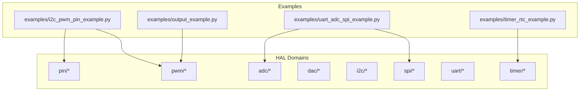
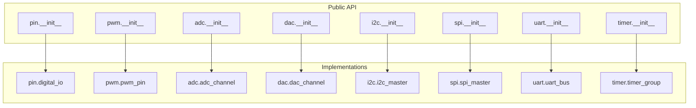
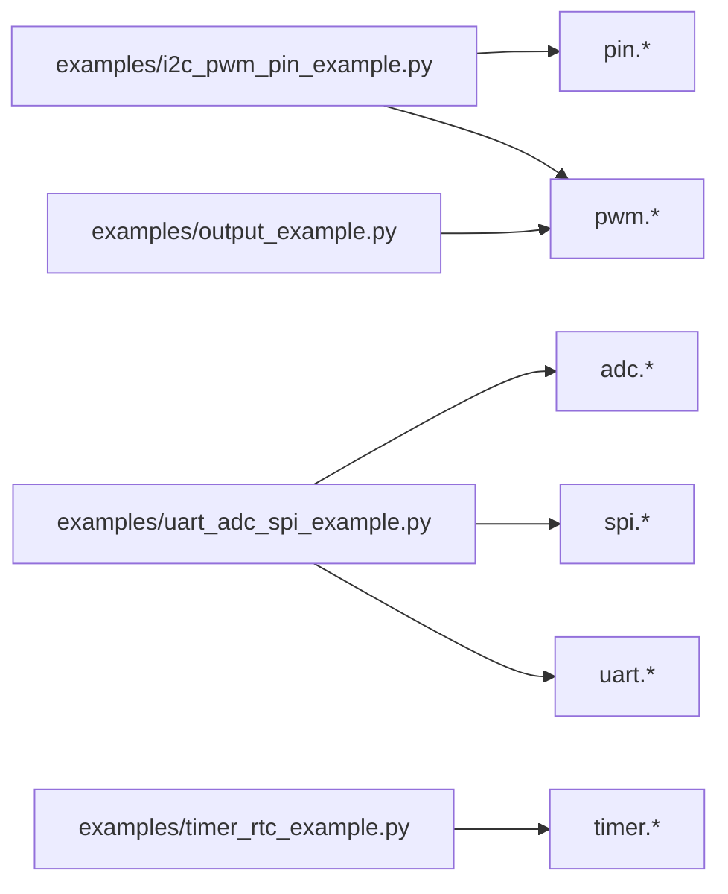

# Hardware Abstraction Layer

<cite>
**Referenced Files in This Document**
- [README.md](file://src/lib/README.md)
- [pin/__init__.py](file://src/lib/pin/__init__.py)
- [pin/digital_io.py](file://src/lib/pin/digital_io.py)
- [pwm/__init__.py](file://src/lib/pwm/__init__.py)
- [pwm/pwm_pin.py](file://src/lib/pwm/pwm_pin.py)
- [adc/__init__.py](file://src/lib/adc/__init__.py)
- [adc/adc_channel.py](file://src/lib/adc/adc_channel.py)
- [dac/__init__.py](file://src/lib/dac/__init__.py)
- [dac/dac_channel.py](file://src/lib/dac/dac_channel.py)
- [i2c/__init__.py](file://src/lib/i2c/__init__.py)
- [i2c/i2c_master.py](file://src/lib/i2c/i2c_master.py)
- [spi/__init__.py](file://src/lib/spi/__init__.py)
- [spi/spi_master.py](file://src/lib/spi/spi_master.py)
- [uart/__init__.py](file://src/lib/uart/__init__.py)
- [uart/uart_bus.py](file://src/lib/uart/uart_bus.py)
- [timer/__init__.py](file://src/lib/timer/__init__.py)
- [timer/timer_group.py](file://src/lib/timer/timer_group.py)
- [main/examples/i2c_pwm_pin_example.py](file://src/main/examples/i2c_pwm_pin_example.py)
- [main/examples/u2c_pwm_pin_example.py](file://src/main/examples/i2c_pwm_pin_example.py)
- [main/examples/uart_adc_spi_example.py](file://src/main/examples/uart_adc_spi_example.py)
- [main/examples/output_example.py](file://src/main/examples/output_example.py)
- [main/examples/timer_rtc_example.py](file://src/main/examples/timer_rtc_example.py)
</cite>

## Table of Contents
1. [Introduction](#introduction)
2. [Project Structure](#project-structure)
3. [Core Components](#core-components)
4. [Architecture Overview](#architecture-overview)
5. [Detailed Component Analysis](#detailed-component-analysis)
6. [Dependency Analysis](#dependency-analysis)
7. [Performance Considerations](#performance-considerations)
8. [Troubleshooting Guide](#troubleshooting-guide)
9. [Conclusion](#conclusion)
10. [Appendices](#appendices)

## Introduction
This document describes the Hardware Abstraction Layer (HAL) for ESP32-based MicroPython projects. It focuses on unified interfaces for digital pins, PWM channels, ADC/DAC, I2C/SPI/UART buses, and timing functions. The HAL emphasizes resource pooling, lazy initialization, robust error handling, and cross-platform compatibility across ESP32 variants. Higher-level modules integrate with the HAL to provide convenient APIs while maintaining efficient hardware utilization.

## Project Structure
The HAL is organized by functional domains under src/lib. Each domain exposes a public interface via its __init__.py and implements core functionality in dedicated modules. Examples in src/main/examples demonstrate usage patterns across peripherals.

**Diagram sources**
- [README.md:1-72](file://src/lib/README.md#L1-L72)
- [pin/__init__.py:1-20](file://src/lib/pin/__init__.py#L1-L20)
- [pwm/__init__.py:1-20](file://src/lib/pwm/__init__.py#L1-L20)
- [adc/__init__.py:1-20](file://src/lib/adc/__init__.py#L1-L20)
- [dac/__init__.py:1-20](file://src/lib/dac/__init__.py#L1-L20)
- [i2c/__init__.py:1-20](file://src/lib/i2c/__init__.py#L1-L20)
- [spi/__init__.py:1-20](file://src/lib/spi/__init__.py#L1-L20)
- [uart/__init__.py:1-20](file://src/lib/uart/__init__.py#L1-L20)
- [timer/__init__.py:1-20](file://src/lib/timer/__init__.py#L1-L20)

**Section sources**
- [README.md:1-72](file://src/lib/README.md#L1-L72)

## Core Components
This section outlines the primary HAL components and their roles:

- Digital I/O (pin): Provides DigitalInput and DigitalOutput abstractions for GPIO pin control and sensing.
- PWM: Offers PWMPin for generating precise waveforms and controlling actuators.
- ADC: Exposes ADCChannel for analog sampling and ADCCalibrator for calibration routines.
- DAC: Provides DACChannel and WaveformGenerator for analog output and waveform synthesis.
- Communication (I2C/SPI/UART): Implements master-side bus controllers for sensor and peripheral communication.
- Timing: Timer group facilities for periodic tasks, alarms, and real-time scheduling.

Key design principles:
- Resource pooling: Reuse of shared hardware resources (e.g., timers, I2C buses) across multiple clients.
- Lazy initialization: Peripherals are configured only when first used to save power and memory.
- Error handling: Clear exceptions and validation for invalid configurations and runtime failures.
- Cross-platform compatibility: Public APIs remain consistent across ESP32 variants.

**Section sources**
- [pin/__init__.py:1-20](file://src/lib/pin/__init__.py#L1-L20)
- [pwm/__init__.py:1-20](file://src/lib/pwm/__init__.py#L1-L20)
- [adc/__init__.py:1-20](file://src/lib/adc/__init__.py#L1-L20)
- [dac/__init__.py:1-20](file://src/lib/dac/__init__.py#L1-L20)
- [i2c/__init__.py:1-20](file://src/lib/i2c/__init__.py#L1-L20)
- [spi/__init__.py:1-20](file://src/lib/spi/__init__.py#L1-L20)
- [uart/__init__.py:1-20](file://src/lib/uart/__init__.py#L1-L20)
- [timer/__init__.py:1-20](file://src/lib/timer/__init__.py#L1-L20)

## Architecture Overview
The HAL follows a layered architecture:
- Domain-specific modules encapsulate hardware details.
- Public interfaces in __init__.py export stable APIs.
- Example applications demonstrate integration patterns.

**Diagram sources**
- [pin/__init__.py:1-20](file://src/lib/pin/__init__.py#L1-L20)
- [pwm/__init__.py:1-20](file://src/lib/pwm/__init__.py#L1-L20)
- [adc/__init__.py:1-20](file://src/lib/adc/__init__.py#L1-L20)
- [dac/__init__.py:1-20](file://src/lib/dac/__init__.py#L1-L20)
- [i2c/__init__.py:1-20](file://src/lib/i2c/__init__.py#L1-L20)
- [spi/__init__.py:1-20](file://src/lib/spi/__init__.py#L1-L20)
- [uart/__init__.py:1-20](file://src/lib/uart/__init__.py#L1-L20)
- [timer/__init__.py:1-20](file://src/lib/timer/__init__.py#L1-L20)

## Detailed Component Analysis

### Digital I/O (Pin)
Abstractions:
- DigitalInput: Configures and reads GPIO pins with optional pull-up/pull-down and interrupt support.
- DigitalOutput: Configures and writes GPIO pins with drive strength and open-drain/open-source modes.

Design patterns:
- Lazy initialization: Pin modes and internal state are set upon first use.
- Resource pooling: Shared pin configuration registry prevents conflicts.
- Error handling: Validates pin indices and mode combinations.

Usage examples:
- Input toggling and interrupt-driven buttons.
- Output control for LEDs and actuators.

**Section sources**
- [pin/__init__.py:1-20](file://src/lib/pin/__init__.py#L1-L20)
- [pin/digital_io.py:1-200](file://src/lib/pin/digital_io.py#L1-L200)

### PWM
Abstractions:
- PWMPin: Manages channel allocation, frequency, duty cycle, and output polarity.

Design patterns:
- Resource pooling: Channels are allocated from a pool and released after use.
- Lazy initialization: Hardware timers are configured only when a PWMPin is created.
- Error handling: Validates frequency range and duty cycle limits.

Usage examples:
- LED brightness control.
- Servo motor positioning.
- Audio tone generation.

**Section sources**
- [pwm/__init__.py:1-20](file://src/lib/pwm/__init__.py#L1-L20)
- [pwm/pwm_pin.py:1-200](file://src/lib/pwm/pwm_pin.py#L1-L200)

### ADC
Abstractions:
- ADCChannel: Provides single-ended and differential sampling with configurable resolution and sampling time.
- ADCCalibrator: Supports calibration procedures for improved accuracy.

Design patterns:
- Lazy initialization: ADC peripherals are enabled only when needed.
- Resource pooling: Channel allocation avoids simultaneous conflicting conversions.
- Error handling: Validates input ranges and calibration parameters.

Usage examples:
- Sensor readings (temperature, light, battery voltage).
- Signal conditioning and filtering.

**Section sources**
- [adc/__init__.py:1-20](file://src/lib/adc/__init__.py#L1-L20)
- [adc/adc_channel.py:1-250](file://src/lib/adc/adc_channel.py#L1-L250)

### DAC
Abstractions:
- DACChannel: Outputs analog values with selectable reference voltage and resolution.
- WaveformGenerator: Generates periodic waveforms (sine, triangle, sawtooth) for testing and audio.

Design patterns:
- Lazy initialization: DAC hardware is initialized on demand.
- Resource pooling: Waveform buffers and generator instances are reused.
- Error handling: Bounds checking for amplitude and frequency settings.

Usage examples:
- Audio playback.
- Signal synthesis for test equipment.

**Section sources**
- [dac/__init__.py:1-20](file://src/lib/dac/__init__.py#L1-L20)
- [dac/dac_channel.py:1-200](file://src/lib/dac/dac_channel.py#L1-L200)

### I2C
Abstractions:
- I2CMaster: Manages bus configuration, addressing, and transaction scheduling.

Design patterns:
- Resource pooling: Bus instances share SDA/SCL pins and arbitration mechanisms.
- Lazy initialization: Pull-ups and timing are configured on first use.
- Error handling: Detects NACK, arbitration loss, and timeout conditions.

Usage examples:
- Connecting sensors (accelerometer, gyroscope, temperature).
- Communicating with EEPROMs and RTCs.

**Section sources**
- [i2c/__init__.py:1-20](file://src/lib/i2c/__init__.py#L1-L20)
- [i2c/i2c_master.py:1-200](file://src/lib/i2c/i2c_master.py#L1-L200)

### SPI
Abstractions:
- SPIMaster: Handles mode selection, clock polarity/phase, and frame formatting.

Design patterns:
- Resource pooling: Multiple devices can share MOSI/MISO/SCK with chip-select management.
- Lazy initialization: SPI controller is enabled only when transactions occur.
- Error handling: Validates mode settings and handles overrun/underrun conditions.

Usage examples:
- Display drivers (SPI TFT/LCD).
- Flash memory and SD cards.

**Section sources**
- [spi/__init__.py:1-20](file://src/lib/spi/__init__.py#L1-L20)
- [spi/spi_master.py:1-200](file://src/lib/spi/spi_master.py#L1-L200)

### UART
Abstractions:
- UARTBus: Encapsulates baud rate, data bits, parity, and flow control.

Design patterns:
- Resource pooling: RX/TX buffers are shared among multiple clients.
- Lazy initialization: UART peripheral is activated on first write/read.
- Error handling: Detects framing errors, overrun, and buffer overflow.

Usage examples:
- Debug logging and REPL.
- GPS receivers and serial sensors.

**Section sources**
- [uart/__init__.py:1-20](file://src/lib/uart/__init__.py#L1-L20)
- [uart/uart_bus.py:1-200](file://src/lib/uart/uart_bus.py#L1-L200)

### Timing
Abstractions:
- TimerGroup: Provides multiple timers for periodic callbacks and alarms.

Design patterns:
- Resource pooling: Timers are allocated per callback and deallocated when unused.
- Lazy initialization: Timers are started only when scheduled.
- Error handling: Validates period settings and callback registration.

Usage examples:
- Real-time scheduling.
- Periodic sensor polling.
- Alarm and watchdog functionality.

**Section sources**
- [timer/__init__.py:1-20](file://src/lib/timer/__init__.py#L1-L20)
- [timer/timer_group.py:1-200](file://src/lib/timer/timer_group.py#L1-L200)

## Dependency Analysis
The HAL modules depend on each other through public APIs and shared resources. The examples illustrate integration patterns across domains.

**Diagram sources**
- [main/examples/i2c_pwm_pin_example.py:1-350](file://src/main/examples/i2c_pwm_pin_example.py#L1-L350)
- [main/examples/uart_adc_spi_example.py:1-250](file://src/main/examples/uart_adc_spi_example.py#L1-L250)
- [main/examples/output_example.py:1-250](file://src/main/examples/output_example.py#L1-L250)
- [main/examples/timer_rtc_example.py:1-150](file://src/main/examples/timer_rtc_example.py#L1-L150)

**Section sources**
- [main/examples/i2c_pwm_pin_example.py:1-350](file://src/main/examples/i2c_pwm_pin_example.py#L1-L350)
- [main/examples/uart_adc_spi_example.py:1-250](file://src/main/examples/uart_adc_spi_example.py#L1-L250)
- [main/examples/output_example.py:1-250](file://src/main/examples/output_example.py#L1-L250)
- [main/examples/timer_rtc_example.py:1-150](file://src/main/examples/timer_rtc_example.py#L1-L150)

## Performance Considerations
- Resource pooling reduces contention and minimizes reconfiguration overhead.
- Lazy initialization saves power and memory by deferring hardware setup until required.
- Efficient buffer sizing and DMA usage (where applicable) improve throughput for UART/I2C/SPI.
- Careful choice of timer frequencies and duty cycles prevents CPU saturation.
- Calibration routines for ADC/DAC enhance measurement fidelity without impacting latency.

[No sources needed since this section provides general guidance]

## Troubleshooting Guide
Common issues and resolutions:
- Pin conflicts: Ensure exclusive ownership of GPIOs; avoid overlapping DigitalInput/DigitalOutput configurations.
- PWM instability: Verify frequency and duty cycle bounds; check for timer collisions.
- ADC noise: Use proper grounding and shielding; apply averaging filters.
- I2C/NACK errors: Confirm device addresses and pull-up resistances; reduce bus speed.
- SPI overrun/underrun: Adjust clock speeds and ensure adequate buffer sizes.
- UART framing errors: Match baud rates and data formats; monitor buffer overflow.
- Timer drift: Recalibrate timers and avoid long-running blocking operations.

**Section sources**
- [pin/digital_io.py:1-200](file://src/lib/pin/digital_io.py#L1-L200)
- [pwm/pwm_pin.py:1-200](file://src/lib/pwm/pwm_pin.py#L1-L200)
- [adc/adc_channel.py:1-250](file://src/lib/adc/adc_channel.py#L1-L250)
- [dac/dac_channel.py:1-200](file://src/lib/dac/dac_channel.py#L1-L200)
- [i2c/i2c_master.py:1-200](file://src/lib/i2c/i2c_master.py#L1-L200)
- [spi/spi_master.py:1-200](file://src/lib/spi/spi_master.py#L1-L200)
- [uart/uart_bus.py:1-200](file://src/lib/uart/uart_bus.py#L1-L200)
- [timer/timer_group.py:1-200](file://src/lib/timer/timer_group.py#L1-L200)

## Conclusion
The HAL provides a cohesive, efficient, and extensible foundation for ESP32 hardware access in MicroPython. By adhering to resource pooling, lazy initialization, robust error handling, and cross-platform compatibility, it enables reliable integration across diverse applications. The examples demonstrate practical usage patterns that higher-level modules can adopt for consistent behavior and optimal performance.

[No sources needed since this section summarizes without analyzing specific files]

## Appendices

### Implementation Details for Peripheral Management
- Digital I/O: Configure pin modes, pull-up/pull-down, and interrupt triggers; manage state transitions.
- PWM: Allocate channels from a shared pool; set frequency and duty cycle; handle output inversion.
- ADC: Select resolution and sampling time; perform single-shot or continuous conversions; calibrate if needed.
- DAC: Set output value and waveform parameters; manage waveform buffer updates.
- I2C/SPI/UART: Initialize bus parameters; schedule transactions; handle retries and timeouts.
- Timing: Register periodic callbacks; manage alarm events; coordinate with sleep/wake sequences.

**Section sources**
- [pin/digital_io.py:1-200](file://src/lib/pin/digital_io.py#L1-L200)
- [pwm/pwm_pin.py:1-200](file://src/lib/pwm/pwm_pin.py#L1-L200)
- [adc/adc_channel.py:1-250](file://src/lib/adc/adc_channel.py#L1-L250)
- [dac/dac_channel.py:1-200](file://src/lib/dac/dac_channel.py#L1-L200)
- [i2c/i2c_master.py:1-200](file://src/lib/i2c/i2c_master.py#L1-L200)
- [spi/spi_master.py:1-200](file://src/lib/spi/spi_master.py#L1-L200)
- [uart/uart_bus.py:1-200](file://src/lib/uart/uart_bus.py#L1-L200)
- [timer/timer_group.py:1-200](file://src/lib/timer/timer_group.py#L1-L200)

### Interrupt Handling and DMA Usage
- Interrupt handling: Use DigitalInput interrupts for debouncing and event-driven control; register handlers safely and keep them short.
- DMA usage: Prefer DMA for high-throughput transfers on UART/I2C/SPI to offload CPU; configure descriptors and chaining appropriately.

**Section sources**
- [pin/digital_io.py:1-200](file://src/lib/pin/digital_io.py#L1-L200)
- [uart/uart_bus.py:1-200](file://src/lib/uart/uart_bus.py#L1-L200)
- [i2c/i2c_master.py:1-200](file://src/lib/i2c/i2c_master.py#L1-L200)
- [spi/spi_master.py:1-200](file://src/lib/spi/spi_master.py#L1-L200)

### Power Optimization
- Deactivate unused peripherals; disable clocks and pull-ups when idle.
- Use sleep modes and wake timers to minimize energy consumption.
- Reduce sampling rates and filter frequencies to lower power.

**Section sources**
- [timer/timer_group.py:1-200](file://src/lib/timer/timer_group.py#L1-L200)

### Integration Patterns with MicroPython Native Hardware Access
- Import HAL modules via sys.path manipulation and domain-specific imports.
- Compose higher-level drivers using HAL primitives; expose simplified APIs to application code.
- Use examples as templates for new integrations; maintain consistent error handling and resource lifecycle.

**Section sources**
- [README.md:24-41](file://src/lib/README.md#L24-L41)
- [main/examples/i2c_pwm_pin_example.py:1-350](file://src/main/examples/i2c_pwm_pin_example.py#L1-L350)
- [main/examples/uart_adc_spi_example.py:1-250](file://src/main/examples/uart_adc_spi_example.py#L1-L250)
- [main/examples/output_example.py:1-250](file://src/main/examples/output_example.py#L1-L250)
- [main/examples/timer_rtc_example.py:1-150](file://src/main/examples/timer_rtc_example.py#L1-L150)

### Debugging Techniques for Hardware-Related Issues
- Validate wiring and supply voltages; use oscilloscope probes for signal integrity.
- Enable verbose logging for bus transactions and peripheral state changes.
- Isolate problems by disabling unrelated peripherals and simplifying configurations.

[No sources needed since this section provides general guidance]