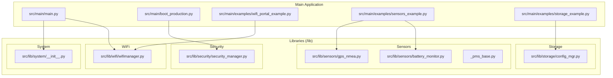
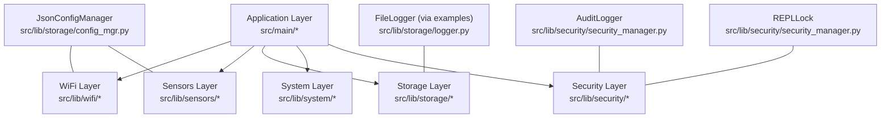
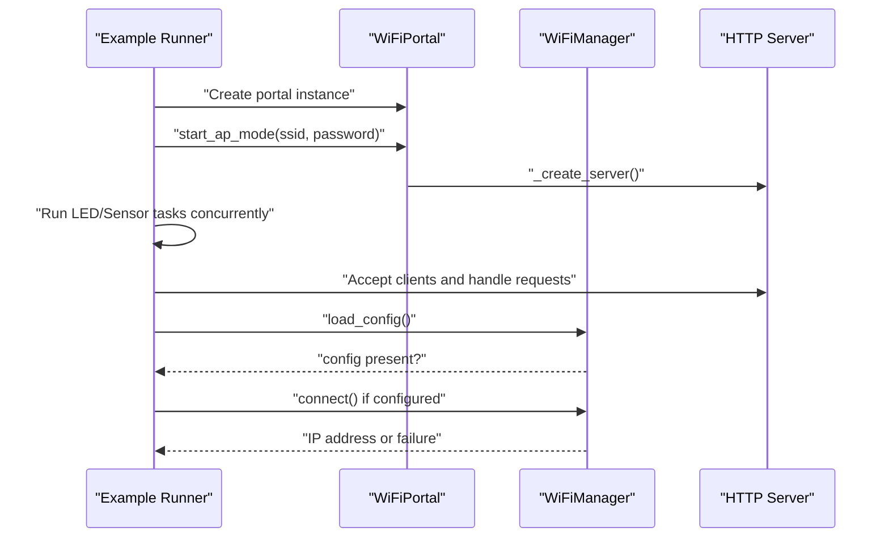
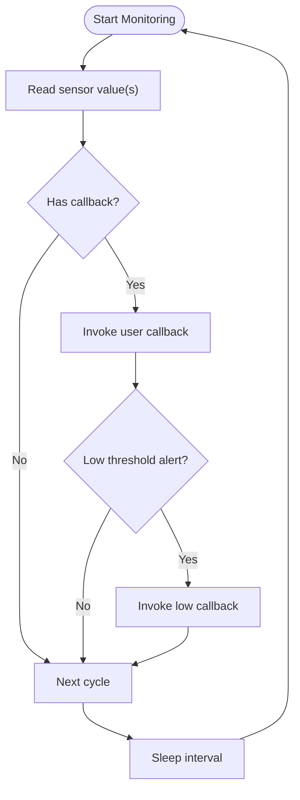
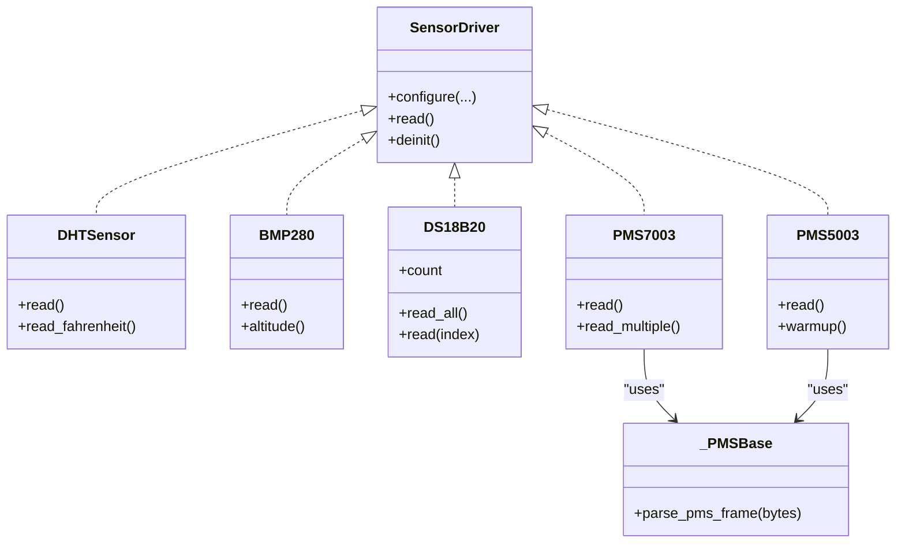
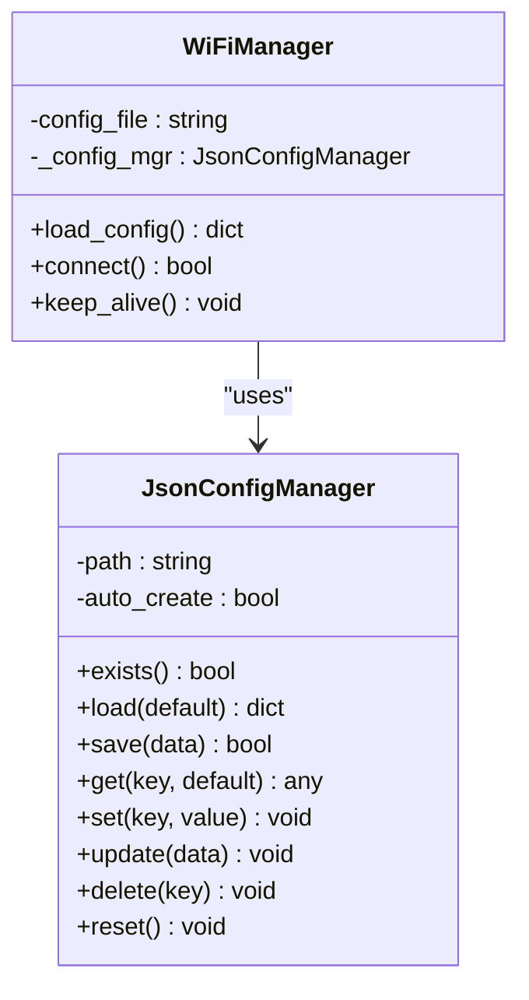
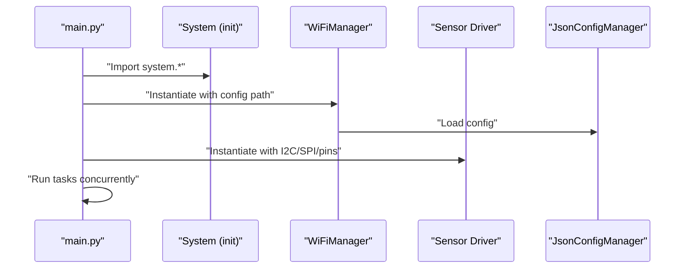
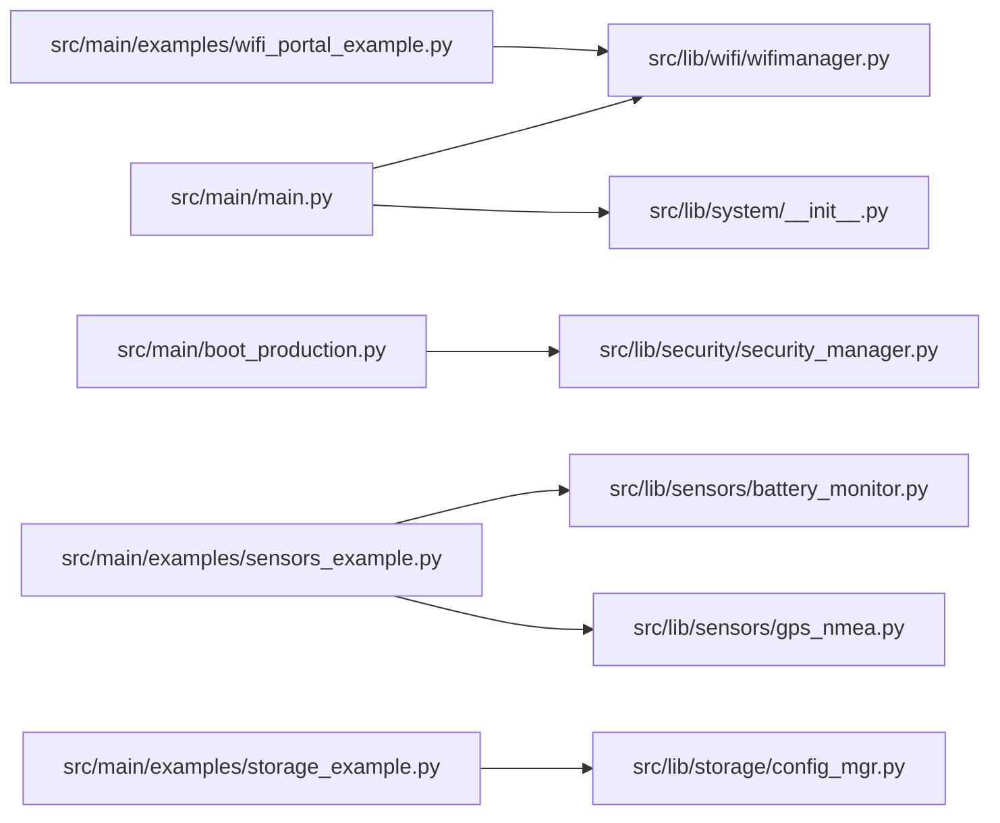

# Module Organization & Design Patterns

<cite>
**Referenced Files in This Document**
- [README.md](file://src/lib/README.md)
- [main.py](file://src/main/main.py)
- [boot_production.py](file://src/main/boot_production.py)
- [wifi_portal_example.py](file://src/main/examples/wifi_portal_example.py)
- [sensors_example.py](file://src/main/examples/sensors_example.py)
- [storage_example.py](file://src/main/examples/storage_example.py)
- [wifimanager.py](file://src/lib/wifi/wifimanager.py)
- [config_mgr.py](file://src/lib/storage/config_mgr.py)
- [battery_monitor.py](file://src/lib/sensors/battery_monitor.py)
- [gps_nmea.py](file://src/lib/sensors/gps_nmea.py)
- [security_manager.py](file://src/lib/security/security_manager.py)
- [__init__.py (system)](file://src/lib/system/__init__.py)
- [README.md (system)](file://src/lib/system/README.md)
- [README.md (sensors)](file://src/lib/sensors/README.md)
- [_pms_base.py](file://src/lib/sensors/_pms_base.py)
- [uart_adc_spi_example.py](file://src/main/examples/uart_adc_spi_example.py)
</cite>

## Table of Contents
1. [Introduction](#introduction)
2. [Project Structure](#project-structure)
3. [Core Components](#core-components)
4. [Architecture Overview](#architecture-overview)
5. [Detailed Component Analysis](#detailed-component-analysis)
6. [Dependency Analysis](#dependency-analysis)
7. [Performance Considerations](#performance-considerations)
8. [Troubleshooting Guide](#troubleshooting-guide)
9. [Conclusion](#conclusion)
10. [Appendices](#appendices)

## Introduction
This document explains the module organization and design patterns used across the ESP32-C3 framework. It focuses on how the codebase is structured into functional categories, how design patterns such as factory, observer, strategy, and singleton are applied, and how modularity, dependency injection, lazy initialization, and plugin-style extension support both beginner accessibility and advanced extensibility. The goal is to help users understand the rationale behind architectural choices, trade-offs, and practical usage across modules like WiFi, sensors, storage, system, and security.

## Project Structure
The repository organizes functionality into clearly separated modules under src/lib, grouped by domain (e.g., wifi, sensors, storage, system). Each domain encapsulates related capabilities and exposes a focused public API. The examples under src/main demonstrate typical usage patterns and cross-module integration.

**Diagram sources**
- [main.py:1-84](file://src/main/main.py#L1-L84)
- [boot_production.py:1-56](file://src/main/boot_production.py#L1-L56)
- [wifi_portal_example.py:1-350](file://src/main/examples/wifi_portal_example.py#L1-L350)
- [sensors_example.py:1-529](file://src/main/examples/sensors_example.py#L1-L529)
- [storage_example.py:1-63](file://src/main/examples/storage_example.py#L1-L63)
- [wifimanager.py:38-120](file://src/lib/wifi/wifimanager.py#L38-L120)
- [config_mgr.py:10-52](file://src/lib/storage/config_mgr.py#L10-L52)
- [battery_monitor.py:254-290](file://src/lib/sensors/battery_monitor.py#L254-L290)
- [gps_nmea.py:317-356](file://src/lib/sensors/gps_nmea.py#L317-L356)
- [security_manager.py:39-72](file://src/lib/security/security_manager.py#L39-L72)
- [__init__.py (system):1-5](file://src/lib/system/__init__.py#L1-L5)

**Section sources**
- [README.md:1-72](file://src/lib/README.md#L1-L72)
- [main.py:12-84](file://src/main/main.py#L12-L84)
- [boot_production.py:19-56](file://src/main/boot_production.py#L19-L56)

## Core Components
- WiFi module: Provides WiFiManager for STA connection and integrates with JsonConfigManager for persistent configuration.
- Sensors module: Offers diverse sensor drivers (e.g., battery monitor, GPS NMEA) with asynchronous monitoring and event-driven callbacks.
- Storage module: Provides JsonConfigManager for configuration persistence and FileLogger for diagnostics.
- System module: Exposes system utilities via a consolidated init interface.
- Security module: Implements SecurityManager for lockdown and audit logging.

Key design pattern highlights:
- Factory pattern for dynamic WiFi portal creation (see WiFi Portal examples).
- Observer pattern for sensor monitoring and callback-driven updates.
- Strategy pattern for sensor driver implementations (various protocols and devices).
- Singleton-like configuration management via JsonConfigManager.

**Section sources**
- [wifimanager.py:38-120](file://src/lib/wifi/wifimanager.py#L38-L120)
- [config_mgr.py:10-52](file://src/lib/storage/config_mgr.py#L10-L52)
- [battery_monitor.py:254-290](file://src/lib/sensors/battery_monitor.py#L254-L290)
- [gps_nmea.py:317-356](file://src/lib/sensors/gps_nmea.py#L317-L356)
- [__init__.py (system):1-5](file://src/lib/system/__init__.py#L1-L5)

## Architecture Overview
The framework follows a layered, modular design:
- Domain modules encapsulate functionality (WiFi, sensors, storage, system, security).
- Cross-cutting concerns (configuration, logging, security) are centralized and reused.
- Examples orchestrate modules to demonstrate real-world usage.

**Diagram sources**
- [main.py:12-84](file://src/main/main.py#L12-L84)
- [wifimanager.py:38-120](file://src/lib/wifi/wifimanager.py#L38-L120)
- [config_mgr.py:10-52](file://src/lib/storage/config_mgr.py#L10-L52)
- [security_manager.py:39-72](file://src/lib/security/security_manager.py#L39-L72)

## Detailed Component Analysis

### WiFi Portal Factory Pattern
The WiFi Portal examples demonstrate a factory-style approach to creating and configuring a WiFi configuration portal dynamically. The examples show:
- Creating a portal instance with default or custom configuration.
- Starting AP mode and HTTP server concurrently with other tasks.
- Transitioning from portal mode to STA mode after configuration is saved.

**Diagram sources**
- [wifi_portal_example.py:13-280](file://src/main/examples/wifi_portal_example.py#L13-L280)
- [wifimanager.py:38-120](file://src/lib/wifi/wifimanager.py#L38-L120)

**Section sources**
- [wifi_portal_example.py:13-280](file://src/main/examples/wifi_portal_example.py#L13-L280)

### Observer Pattern in Sensor Monitoring
Sensor modules implement observer-like behavior through:
- Asynchronous monitoring loops that periodically invoke callbacks.
- Event-driven APIs (e.g., GPS NMEA sentence callbacks) and optional low-threshold alerts.

**Diagram sources**
- [battery_monitor.py:254-290](file://src/lib/sensors/battery_monitor.py#L254-L290)
- [gps_nmea.py:317-356](file://src/lib/sensors/gps_nmea.py#L317-L356)

**Section sources**
- [battery_monitor.py:254-290](file://src/lib/sensors/battery_monitor.py#L254-L290)
- [gps_nmea.py:317-356](file://src/lib/sensors/gps_nmea.py#L317-L356)

### Strategy Pattern in Sensor Driver Implementations
Sensor drivers follow a strategy-like interface:
- Uniform constructor parameters (e.g., pins, addresses, gain) enable interchangeable drivers.
- Each driver encapsulates protocol-specific logic (e.g., I2C, UART, analog sampling).
- Shared base utilities (e.g., PMS frame parsing) reduce duplication.

**Diagram sources**
- [sensors_example.py:10-27](file://src/main/examples/sensors_example.py#L10-L27)
- [_pms_base.py:155-194](file://src/lib/sensors/_pms_base.py#L155-L194)

**Section sources**
- [sensors_example.py:10-27](file://src/main/examples/sensors_example.py#L10-L27)
- [_pms_base.py:155-194](file://src/lib/sensors/_pms_base.py#L155-L194)

### Singleton Pattern for Configuration Management
JsonConfigManager centralizes configuration loading and saving, acting as a singleton-like service:
- One instance per configuration file path.
- Lazy initialization of default values and atomic save semantics.
- Used by WiFiManager and other modules to persist settings.

**Diagram sources**
- [config_mgr.py:10-52](file://src/lib/storage/config_mgr.py#L10-L52)
- [wifimanager.py:38-120](file://src/lib/wifi/wifimanager.py#L38-L120)

**Section sources**
- [config_mgr.py:10-52](file://src/lib/storage/config_mgr.py#L10-L52)
- [wifimanager.py:38-120](file://src/lib/wifi/wifimanager.py#L38-L120)

### Dependency Injection and Plugin Architecture
- Modules expose clean constructors and methods, enabling dependency injection of pins, addresses, and callbacks.
- The system module’s init consolidates imports, supporting a plugin-style discovery of system features.
- Examples demonstrate composing modules asynchronously, allowing new modules to be injected without changing core logic.

**Diagram sources**
- [main.py:12-84](file://src/main/main.py#L12-L84)
- [__init__.py (system):1-5](file://src/lib/system/__init__.py#L1-L5)
- [wifimanager.py:38-120](file://src/lib/wifi/wifimanager.py#L38-L120)
- [config_mgr.py:10-52](file://src/lib/storage/config_mgr.py#L10-L52)

**Section sources**
- [main.py:12-84](file://src/main/main.py#L12-L84)
- [__init__.py (system):1-5](file://src/lib/system/__init__.py#L1-L5)

### Lazy Initialization Strategies
- WiFiManager lazily loads configuration from disk only when requested.
- Sensor drivers initialize hardware resources on demand (e.g., ADC, I2C) and expose async monitoring routines.
- Storage managers defer file operations until explicit load/save/update calls.

**Section sources**
- [wifimanager.py:57-120](file://src/lib/wifi/wifimanager.py#L57-L120)
- [config_mgr.py:26-52](file://src/lib/storage/config_mgr.py#L26-L52)

### Modular Design Philosophy and Extensibility
- Functional grouping: Each domain (wifi, sensors, storage, system, security) is self-contained with its own init and README.
- Cross-domain reuse: JsonConfigManager and logging utilities are shared across modules.
- Extensibility: New sensor drivers can follow the same constructor and method patterns; new system features can be added to the system init.

**Section sources**
- [README.md:1-72](file://src/lib/README.md#L1-L72)
- [README.md (sensors):1-200](file://src/lib/sensors/README.md#L1-L200)
- [README.md (system):263-321](file://src/lib/system/README.md#L263-L321)

## Dependency Analysis
The following diagram shows key dependencies among modules and examples:

**Diagram sources**
- [main.py:12-84](file://src/main/main.py#L12-L84)
- [boot_production.py:19-56](file://src/main/boot_production.py#L19-L56)
- [wifi_portal_example.py:10-10](file://src/main/examples/wifi_portal_example.py#L10-L10)
- [sensors_example.py:10-27](file://src/main/examples/sensors_example.py#L10-L27)
- [storage_example.py:11-11](file://src/main/examples/storage_example.py#L11-L11)
- [wifimanager.py:38-120](file://src/lib/wifi/wifimanager.py#L38-L120)
- [config_mgr.py:10-52](file://src/lib/storage/config_mgr.py#L10-L52)
- [battery_monitor.py:254-290](file://src/lib/sensors/battery_monitor.py#L254-L290)
- [gps_nmea.py:317-356](file://src/lib/sensors/gps_nmea.py#L317-L356)
- [security_manager.py:39-72](file://src/lib/security/security_manager.py#L39-L72)

**Section sources**
- [main.py:12-84](file://src/main/main.py#L12-L84)
- [boot_production.py:19-56](file://src/main/boot_production.py#L19-L56)
- [wifi_portal_example.py:10-10](file://src/main/examples/wifi_portal_example.py#L10-L10)
- [sensors_example.py:10-27](file://src/main/examples/sensors_example.py#L10-L27)
- [storage_example.py:11-11](file://src/main/examples/storage_example.py#L11-L11)

## Performance Considerations
- Asynchronous concurrency: The examples use asyncio to run multiple tasks concurrently, improving responsiveness and throughput.
- Minimal blocking: Sensor drivers and WiFi operations are designed to minimize blocking, leveraging async patterns and callbacks.
- Resource pooling: JsonConfigManager avoids frequent disk writes by batching updates and using temporary files during save.

[No sources needed since this section provides general guidance]

## Troubleshooting Guide
- WiFi connectivity: Use WiFiManager.load_config and connect methods to diagnose missing or invalid credentials.
- Sensor callbacks: Ensure callbacks are safe and handle exceptions to avoid breaking monitoring loops.
- Storage persistence: Verify file paths and permissions; JsonConfigManager logs errors during load/save failures.
- Security lockdown: Confirm SecurityManager lockdown behavior and development mode unlock pin configuration.

**Section sources**
- [wifimanager.py:57-120](file://src/lib/wifi/wifimanager.py#L57-L120)
- [battery_monitor.py:254-290](file://src/lib/sensors/battery_monitor.py#L254-L290)
- [config_mgr.py:26-52](file://src/lib/storage/config_mgr.py#L26-L52)
- [security_manager.py:39-72](file://src/lib/security/security_manager.py#L39-L72)

## Conclusion
The ESP32-C3 framework employs a modular, layered architecture that cleanly separates concerns across domains. Design patterns like factory (WiFi portal), observer (sensor monitoring), strategy (sensor drivers), and singleton-like configuration management enable both simplicity for beginners and flexibility for advanced users. Dependency injection and lazy initialization further improve maintainability and performance, while plugin-style composition allows easy extension with new modules.

[No sources needed since this section summarizes without analyzing specific files]

## Appendices
- Example references:
  - WiFi portal examples: [wifi_portal_example.py:13-280](file://src/main/examples/wifi_portal_example.py#L13-L280)
  - Sensor examples: [sensors_example.py:10-27](file://src/main/examples/sensors_example.py#L10-L27)
  - Storage examples: [storage_example.py:10-59](file://src/main/examples/storage_example.py#L10-L59)
  - Foundation wrappers (UART/ADC/SPI): [uart_adc_spi_example.py:249-263](file://src/main/examples/uart_adc_spi_example.py#L249-L263)