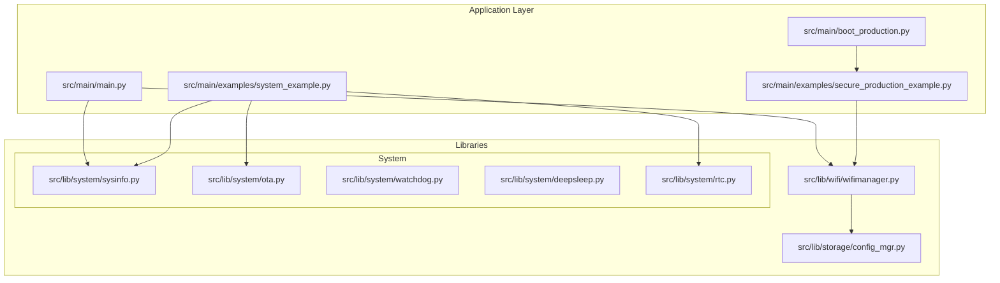
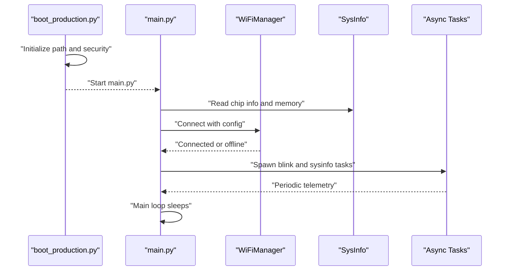
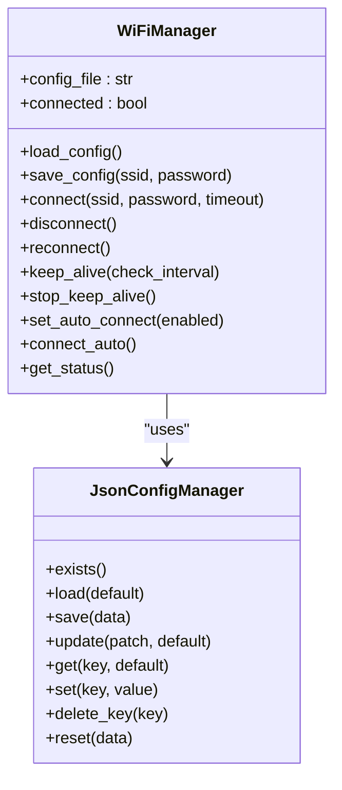
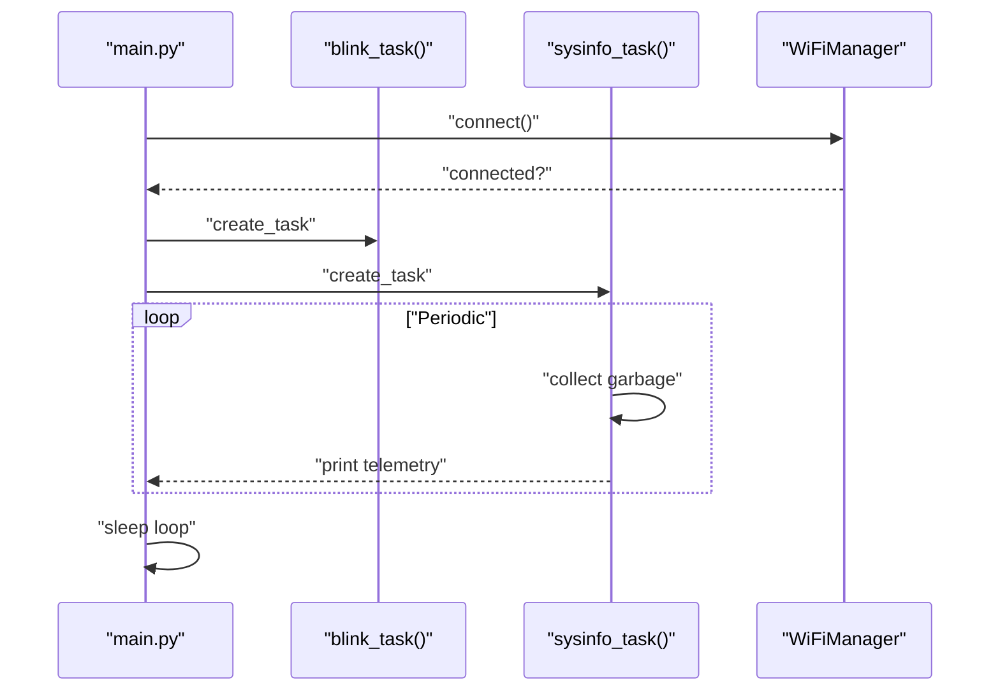
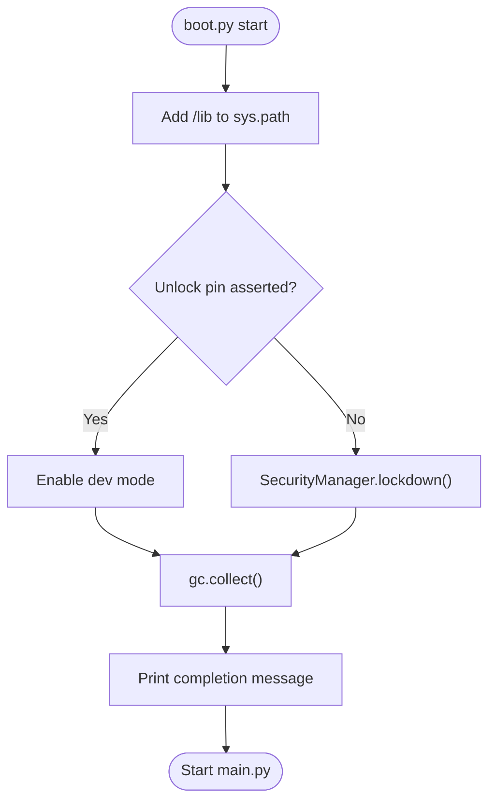
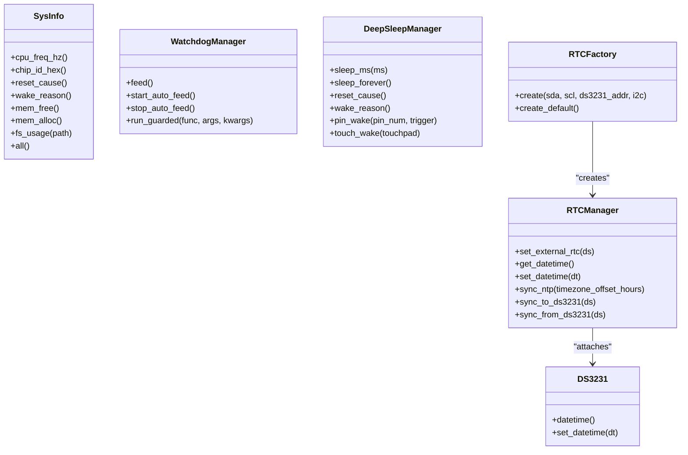
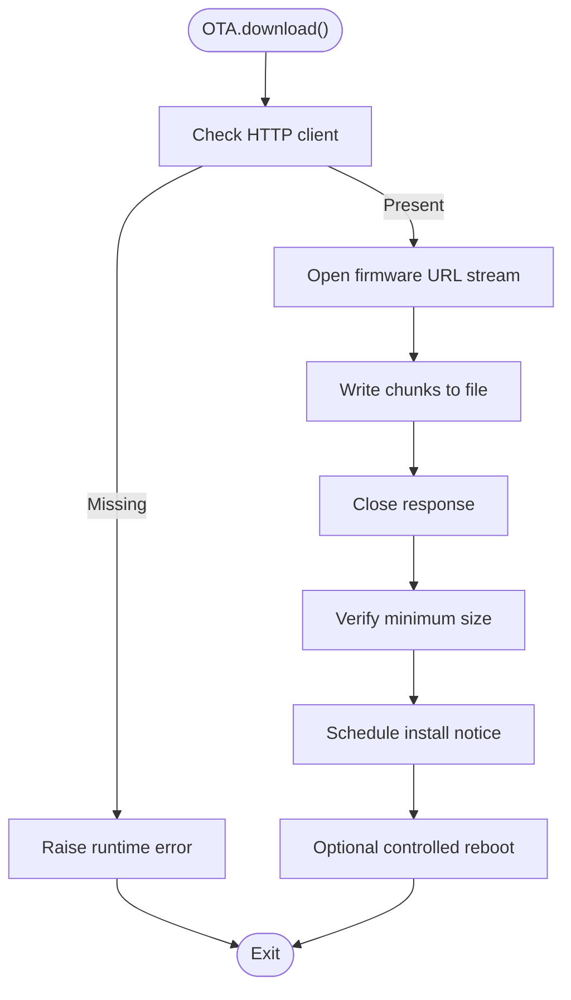
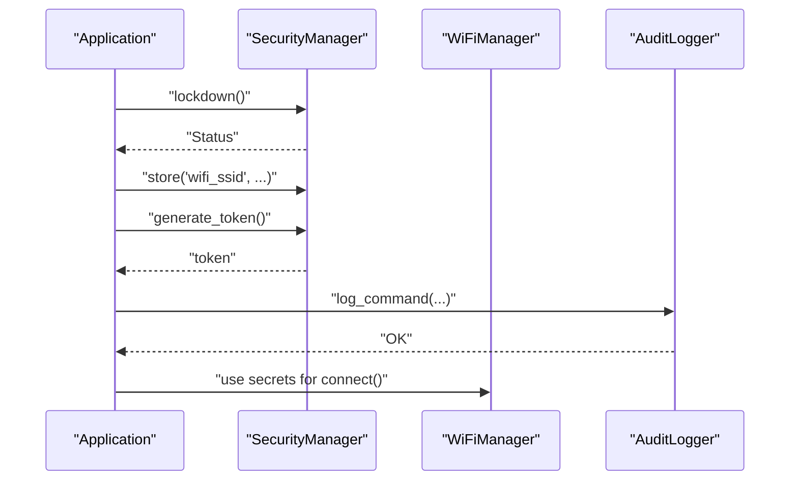
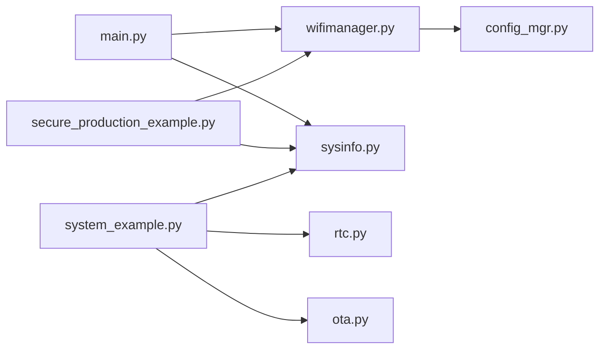

# System Integration Patterns

<cite>
**Referenced Files in This Document**
- [main.py](file://src/main/main.py)
- [boot_production.py](file://src/main/boot_production.py)
- [wifimanager.py](file://src/lib/wifi/wifimanager.py)
- [sysinfo.py](file://src/lib/system/sysinfo.py)
- [ota.py](file://src/lib/system/ota.py)
- [watchdog.py](file://src/lib/system/watchdog.py)
- [deepsleep.py](file://src/lib/system/deepsleep.py)
- [rtc.py](file://src/lib/system/rtc.py)
- [config_mgr.py](file://src/lib/storage/config_mgr.py)
- [system_example.py](file://src/main/examples/system_example.py)
- [secure_production_example.py](file://src/main/examples/secure_production_example.py)
- [device.cfg](file://src/device.cfg)
</cite>

## Table of Contents
1. [Introduction](#introduction)
2. [Project Structure](#project-structure)
3. [Core Components](#core-components)
4. [Architecture Overview](#architecture-overview)
5. [Detailed Component Analysis](#detailed-component-analysis)
6. [Dependency Analysis](#dependency-analysis)
7. [Performance Considerations](#performance-considerations)
8. [Troubleshooting Guide](#troubleshooting-guide)
9. [Conclusion](#conclusion)
10. [Appendices](#appendices)

## Introduction
This document describes system integration patterns for coordinating interactions among framework components in a MicroPython-based embedded environment targeting ESP32-C3. It focuses on application orchestration, component lifecycle management, inter-module communication, and resource coordination strategies. It documents the boot sequence, initialization order, dependency resolution, and graceful degradation mechanisms. It also covers configuration management, logging coordination, error propagation, and system state management, with practical guidance for memory constraints, timing requirements, and power management. The goal is to provide a consistent foundation for extending the framework while preserving integration stability.

## Project Structure
The repository organizes code by functional domains:
- src/main: Application entry points, boot protection, and example integrations
- src/lib: Feature modules (system utilities, networking, storage, security)
- src/main/examples: Usage demonstrations for system components and security
- src/device.cfg: Device configuration metadata

**Diagram sources**
- [main.py:1-84](file://src/main/main.py#L1-L84)
- [boot_production.py:1-56](file://src/main/boot_production.py#L1-L56)
- [wifimanager.py:1-801](file://src/lib/wifi/wifimanager.py#L1-L801)
- [sysinfo.py:1-64](file://src/lib/system/sysinfo.py#L1-L64)
- [ota.py:1-67](file://src/lib/system/ota.py#L1-L67)
- [watchdog.py:1-38](file://src/lib/system/watchdog.py#L1-L38)
- [deepsleep.py:1-47](file://src/lib/system/deepsleep.py#L1-L47)
- [rtc.py:1-236](file://src/lib/system/rtc.py#L1-L236)
- [config_mgr.py:1-85](file://src/lib/storage/config_mgr.py#L1-L85)
- [system_example.py:1-43](file://src/main/examples/system_example.py#L1-L43)
- [secure_production_example.py:1-268](file://src/main/examples/secure_production_example.py#L1-L268)

**Section sources**
- [main.py:1-84](file://src/main/main.py#L1-L84)
- [boot_production.py:1-56](file://src/main/boot_production.py#L1-L56)
- [device.cfg:1-16](file://src/device.cfg#L1-L16)

## Core Components
- WiFiManager: Asynchronous STA connection, configuration persistence, portal web server, and keep-alive reconnection
- System utilities: SysInfo for runtime diagnostics, OTA updater for firmware downloads, watchdog and deep sleep managers, RTC factory and NTP synchronization
- Storage: JsonConfigManager for robust JSON configuration persistence
- Security: SecurityManager with REPL lockdown, secrets storage, audit logging, and token authentication
- Orchestration: main.py entry point and boot_production.py lockdown

Key integration patterns:
- Asynchronous task orchestration with asyncio.create_task and event loops
- Configuration-driven behavior via JsonConfigManager and module-specific config files
- Graceful degradation when connectivity is unavailable
- Resource-aware operations with explicit GC and memory reporting

**Section sources**
- [wifimanager.py:38-397](file://src/lib/wifi/wifimanager.py#L38-L397)
- [sysinfo.py:10-64](file://src/lib/system/sysinfo.py#L10-L64)
- [ota.py:13-67](file://src/lib/system/ota.py#L13-L67)
- [watchdog.py:9-38](file://src/lib/system/watchdog.py#L9-L38)
- [deepsleep.py:8-47](file://src/lib/system/deepsleep.py#L8-L47)
- [rtc.py:62-236](file://src/lib/system/rtc.py#L62-L236)
- [config_mgr.py:10-85](file://src/lib/storage/config_mgr.py#L10-L85)
- [main.py:49-84](file://src/main/main.py#L49-L84)
- [boot_production.py:22-56](file://src/main/boot_production.py#L22-L56)

## Architecture Overview
The system follows a layered integration model:
- Boot layer: boot_production.py enforces lockdown and prepares the runtime
- Application layer: main orchestrates tasks and integrates network connectivity
- Feature modules: WiFiManager, system utilities, storage, and security modules
- Inter-module communication: asynchronous APIs, shared configuration, and event-driven keep-alive

**Diagram sources**
- [boot_production.py:22-56](file://src/main/boot_production.py#L22-L56)
- [main.py:49-84](file://src/main/main.py#L49-L84)
- [wifimanager.py:226-291](file://src/lib/wifi/wifimanager.py#L226-L291)
- [sysinfo.py:10-64](file://src/lib/system/sysinfo.py#L10-L64)

## Detailed Component Analysis

### WiFiManager Integration Pattern
WiFiManager encapsulates STA connection, configuration persistence, scanning, and keep-alive reconnection. It demonstrates:
- Configuration management via JsonConfigManager or fallback JSON file I/O
- Asynchronous connect with timeout and periodic checks
- Optional portal web server for configuration
- Keep-alive loop to recover from disconnections

**Diagram sources**
- [wifimanager.py:38-397](file://src/lib/wifi/wifimanager.py#L38-L397)
- [config_mgr.py:10-85](file://src/lib/storage/config_mgr.py#L10-L85)

**Section sources**
- [wifimanager.py:57-139](file://src/lib/wifi/wifimanager.py#L57-L139)
- [wifimanager.py:226-291](file://src/lib/wifi/wifimanager.py#L226-L291)
- [wifimanager.py:318-350](file://src/lib/wifi/wifimanager.py#L318-L350)
- [config_mgr.py:10-85](file://src/lib/storage/config_mgr.py#L10-L85)

### System Orchestration and Telemetry
The main application orchestrates concurrent tasks and telemetry:
- Blink task toggles a GPIO periodically
- SysInfo task reports memory and CPU metrics
- WiFiManager connects and reports status
- Main loop remains idle but responsive

**Diagram sources**
- [main.py:49-84](file://src/main/main.py#L49-L84)
- [sysinfo.py:30-38](file://src/lib/system/sysinfo.py#L30-L38)

**Section sources**
- [main.py:28-44](file://src/main/main.py#L28-L44)
- [main.py:49-84](file://src/main/main.py#L49-L84)

### Boot Sequence and Production Lockdown
boot_production.py establishes a secure baseline:
- Adds library path
- Detects development unlock pin
- Enforces lockdown via SecurityManager unless dev mode
- Performs garbage collection and prints completion

**Diagram sources**
- [boot_production.py:19-56](file://src/main/boot_production.py#L19-L56)

**Section sources**
- [boot_production.py:22-48](file://src/main/boot_production.py#L22-L48)
- [boot_production.py:50-56](file://src/main/boot_production.py#L50-L56)

### System Utilities and Power Management
System utilities coordinate runtime state and power:
- SysInfo: CPU frequency, chip ID, reset/wake reasons, memory, filesystem usage
- WatchdogManager: manual and automatic feeding, guarded execution
- DeepSleepManager: sleep modes, wake sources, reset/wake reason introspection
- RTCFactory/NTP: auto-detect external RTC, NTP synchronization, timezone handling

**Diagram sources**
- [sysinfo.py:10-64](file://src/lib/system/sysinfo.py#L10-L64)
- [watchdog.py:9-38](file://src/lib/system/watchdog.py#L9-L38)
- [deepsleep.py:8-47](file://src/lib/system/deepsleep.py#L8-L47)
- [rtc.py:62-236](file://src/lib/system/rtc.py#L62-L236)

**Section sources**
- [sysinfo.py:10-64](file://src/lib/system/sysinfo.py#L10-L64)
- [watchdog.py:9-38](file://src/lib/system/watchdog.py#L9-L38)
- [deepsleep.py:8-47](file://src/lib/system/deepsleep.py#L8-L47)
- [rtc.py:62-236](file://src/lib/system/rtc.py#L62-L236)

### OTA Firmware Update Coordination
OTAUpdater coordinates firmware downloads and scheduling:
- Validates availability of HTTP client
- Streams firmware binary to a file path
- Verifies minimum size and schedules installation notice
- Provides controlled reboot

**Diagram sources**
- [ota.py:13-67](file://src/lib/system/ota.py#L13-L67)

**Section sources**
- [ota.py:13-67](file://src/lib/system/ota.py#L13-L67)

### Security Integration Patterns
SecurityManager integrates with REPL lockdown, secrets storage, audit logging, and token authentication:
- Basic lockdown disables REPL channels and restricts remote access
- Secrets stored securely and retrieved with integrity
- Audit logger records commands and security events
- Token-based authentication with rate limiting and revocation
- Emergency wipe for compromised devices
- Optional per-channel REPL locks

**Diagram sources**
- [secure_production_example.py:20-110](file://src/main/examples/secure_production_example.py#L20-L110)
- [wifimanager.py:226-291](file://src/lib/wifi/wifimanager.py#L226-L291)

**Section sources**
- [secure_production_example.py:20-110](file://src/main/examples/secure_production_example.py#L20-L110)
- [secure_production_example.py:115-178](file://src/main/examples/secure_production_example.py#L115-L178)
- [secure_production_example.py:183-244](file://src/main/examples/secure_production_example.py#L183-L244)

## Dependency Analysis
Inter-module dependencies and coupling:
- main.py depends on WiFiManager and SysInfo for runtime telemetry and connectivity
- WiFiManager depends on JsonConfigManager for configuration persistence and optionally on HTML templates for the portal
- System utilities are cohesive and low-coupling, enabling reuse across modules
- SecurityManager integrates with WiFiManager for credential storage and with audit logging for forensics
- OTAUpdater depends on HTTP client availability and filesystem for staged updates

**Diagram sources**
- [main.py:12-13](file://src/main/main.py#L12-L13)
- [wifimanager.py:24-35](file://src/lib/wifi/wifimanager.py#L24-L35)
- [config_mgr.py:10-85](file://src/lib/storage/config_mgr.py#L10-L85)
- [system_example.py:8-12](file://src/main/examples/system_example.py#L8-L12)
- [secure_production_example.py:26-27](file://src/main/examples/secure_production_example.py#L26-L27)

**Section sources**
- [main.py:12-13](file://src/main/main.py#L12-L13)
- [wifimanager.py:24-35](file://src/lib/wifi/wifimanager.py#L24-L35)
- [config_mgr.py:10-85](file://src/lib/storage/config_mgr.py#L10-L85)
- [system_example.py:8-12](file://src/main/examples/system_example.py#L8-L12)
- [secure_production_example.py:26-27](file://src/main/examples/secure_production_example.py#L26-L27)

## Performance Considerations
- Memory management: Explicit garbage collection and memory reporting enable proactive monitoring and recovery
- Timing: Async I/O and timeouts prevent blocking; keep-alive intervals balance resilience and power usage
- Power: Deep sleep and wake sources support low-power operation; watchdog ensures safe recovery
- Network: Retryable NTP synchronization and configurable reconnect intervals improve reliability under variable connectivity
- Storage: Atomic write pattern for configuration files reduces corruption risk

[No sources needed since this section provides general guidance]

## Troubleshooting Guide
Common integration issues and resolutions:
- WiFi connection failures: Validate configuration file presence and correctness; use scan and status APIs; enable keep-alive mode
- Configuration persistence errors: Verify JsonConfigManager existence and permissions; check atomic write behavior
- Boot lockdown preventing development: Use unlock pin to enter dev mode; otherwise use OTA or serial flashing
- Memory pressure: Monitor free memory via SysInfo; reduce task concurrency; trigger GC before heavy operations
- Watchdog resets: Ensure regular feeding or guarded execution; avoid long synchronous operations without feeding
- RTC synchronization: Confirm NTP availability and timezone offset; fall back to external DS3231 when present

**Section sources**
- [wifimanager.py:57-84](file://src/lib/wifi/wifimanager.py#L57-L84)
- [wifimanager.py:226-291](file://src/lib/wifi/wifimanager.py#L226-L291)
- [boot_production.py:24-48](file://src/main/boot_production.py#L24-L48)
- [sysinfo.py:30-38](file://src/lib/system/sysinfo.py#L30-L38)
- [watchdog.py:17-38](file://src/lib/system/watchdog.py#L17-L38)
- [rtc.py:183-225](file://src/lib/system/rtc.py#L183-L225)

## Conclusion
The framework employs a modular, configuration-driven, and resilient integration model. Asynchronous orchestration, robust configuration management, and security-first boot protection form the backbone of reliable operation. System utilities provide essential telemetry and power controls, while WiFiManager and security modules deliver practical, real-world capabilities. By adhering to these patterns—explicit initialization, graceful degradation, and disciplined resource management—developers can extend the framework consistently and safely.

[No sources needed since this section summarizes without analyzing specific files]

## Appendices

### Best Practices for Extending the Framework
- Encapsulate new features behind well-defined interfaces mirroring WiFiManager’s async API
- Persist configuration via JsonConfigManager or equivalent to ensure reproducible deployments
- Integrate with SysInfo for observability and with WatchdogManager for safety
- Respect memory constraints by collecting garbage before heavy operations and minimizing allocations
- Support graceful degradation when network or peripherals are unavailable
- Use SecurityManager for secrets and audit logging in production environments
- Align timing and power strategies with DeepSleepManager and RTCFactory for predictable behavior

[No sources needed since this section provides general guidance]