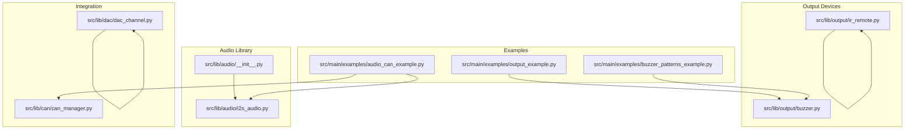
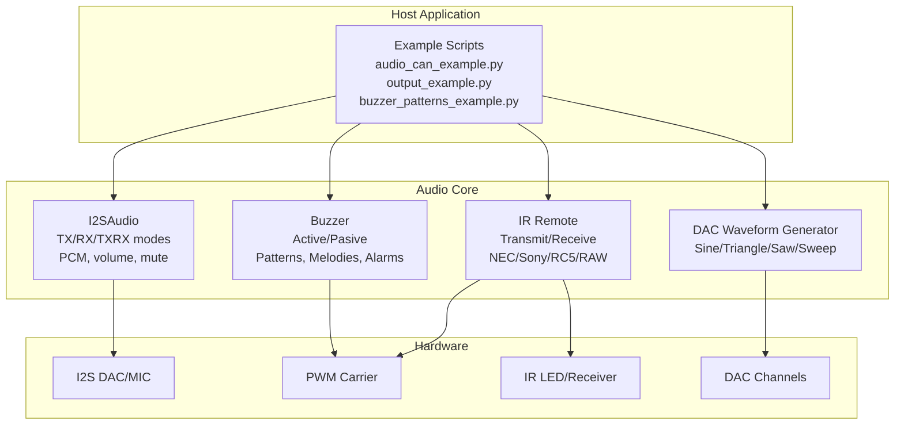
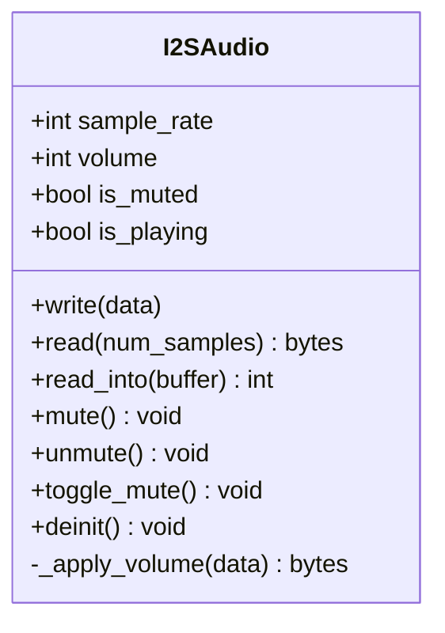
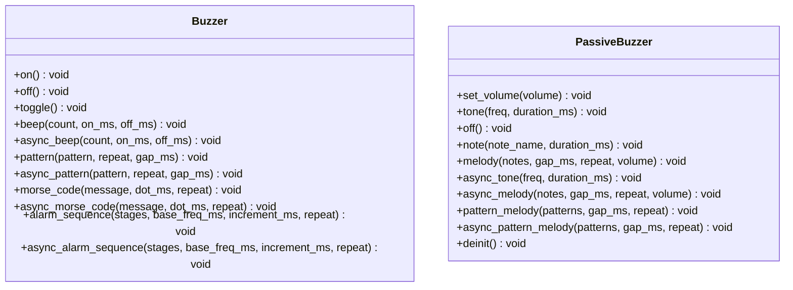
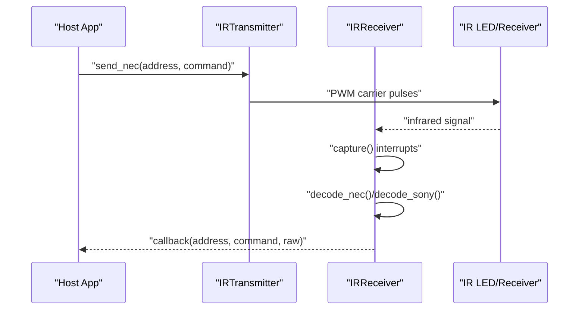
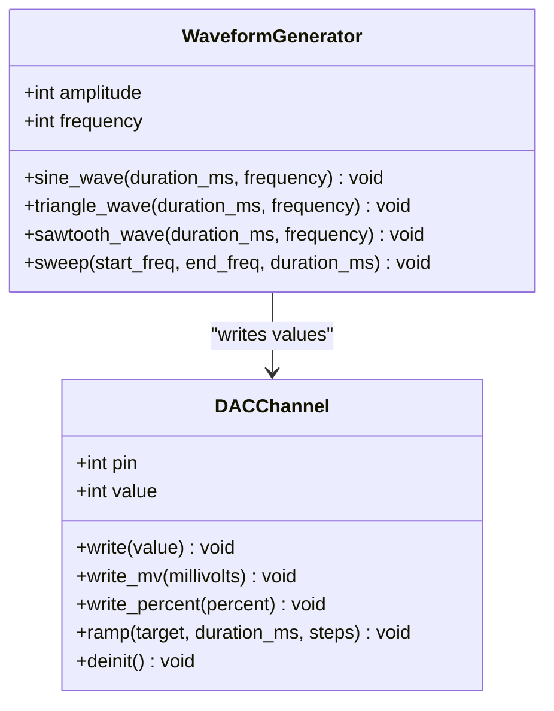
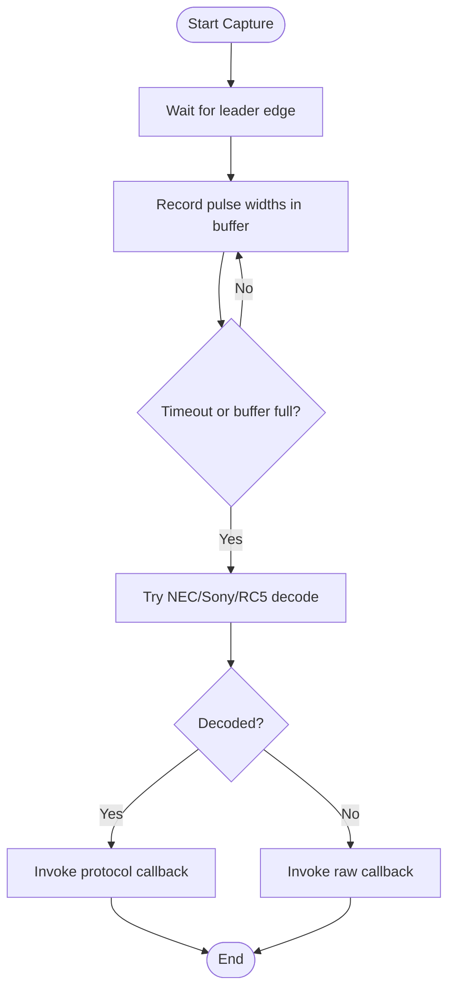
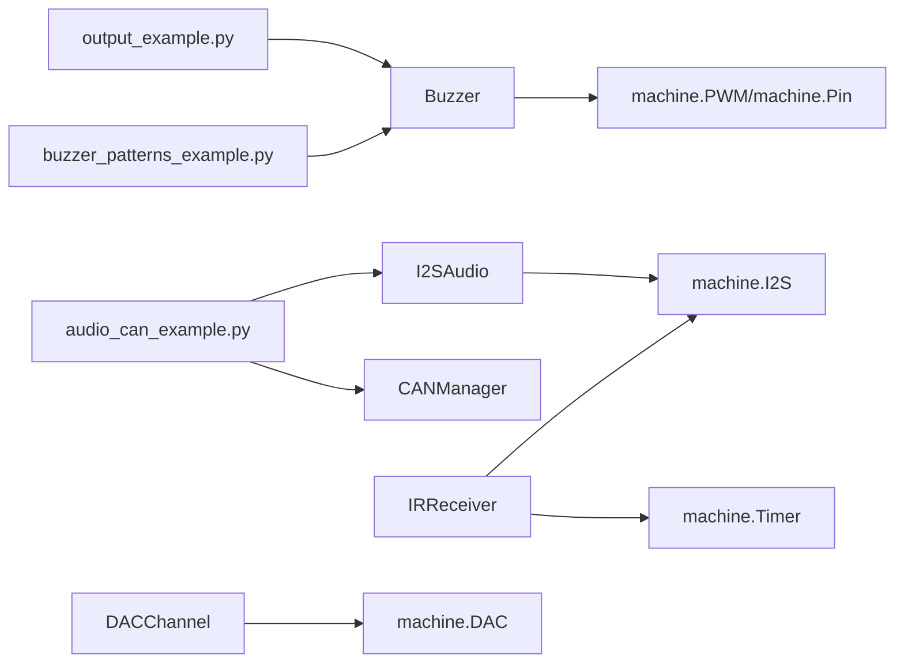

# Audio Systems

<cite>
**Referenced Files in This Document**
- [i2s_audio.py](file://src/lib/audio/i2s_audio.py)
- [__init__.py](file://src/lib/audio/__init__.py)
- [audio_can_example.py](file://src/main/examples/audio_can_example.py)
- [buzzer.py](file://src/lib/output/buzzer.py)
- [output_example.py](file://src/main/examples/output_example.py)
- [ir_remote.py](file://src/lib/output/ir_remote.py)
- [can_manager.py](file://src/lib/can/can_manager.py)
- [dac_channel.py](file://src/lib/dac/dac_channel.py)
- [buzzer_patterns_example.py](file://src/main/examples/buzzer_patterns_example.py)
</cite>

## Table of Contents
1. [Introduction](#introduction)
2. [Project Structure](#project-structure)
3. [Core Components](#core-components)
4. [Architecture Overview](#architecture-overview)
5. [Detailed Component Analysis](#detailed-component-analysis)
6. [Dependency Analysis](#dependency-analysis)
7. [Performance Considerations](#performance-considerations)
8. [Troubleshooting Guide](#troubleshooting-guide)
9. [Conclusion](#conclusion)
10. [Appendices](#appendices)

## Introduction
This document describes the audio processing and sound generation systems implemented for ESP32-C3 using MicroPython. It covers:
- I2SAudio for high-quality audio playback and recording with PCM support, configurable sample rates, and volume control
- Buzzer control for active and passive buzzers, including tone generation, melodies, patterns, and alarm sequences
- IR remote control for infrared signal reception and decoding of NEC, Sony SIRC, and RC5 protocols
- Audio format support, buffer management, and interrupt-driven capture
- Practical examples demonstrating audio playback, tone generation, and remote control integration
- Guidance on audio quality optimization, latency considerations, and power-efficient processing in embedded environments

## Project Structure
The audio-related modules are organized under the library and example directories:
- Audio I2S driver and public interface
- Output devices (buzzer, IR remote)
- CAN bus integration examples
- DAC waveform generation for analog audio synthesis

**Diagram sources**
- [i2s_audio.py](file://src/lib/audio/i2s_audio.py)
- [__init__.py](file://src/lib/audio/__init__.py)
- [audio_can_example.py](file://src/main/examples/audio_can_example.py)
- [output_example.py](file://src/main/examples/output_example.py)
- [buzzer.py](file://src/lib/output/buzzer.py)
- [buzzer_patterns_example.py](file://src/main/examples/buzzer_patterns_example.py)
- [ir_remote.py](file://src/lib/output/ir_remote.py)
- [can_manager.py](file://src/lib/can/can_manager.py)
- [dac_channel.py](file://src/lib/dac/dac_channel.py)

**Section sources**
- [i2s_audio.py](file://src/lib/audio/i2s_audio.py)
- [__init__.py](file://src/lib/audio/__init__.py)
- [audio_can_example.py](file://src/main/examples/audio_can_example.py)
- [output_example.py](file://src/main/examples/output_example.py)
- [buzzer.py](file://src/lib/output/buzzer.py)
- [buzzer_patterns_example.py](file://src/main/examples/buzzer_patterns_example.py)
- [ir_remote.py](file://src/lib/output/ir_remote.py)
- [can_manager.py](file://src/lib/can/can_manager.py)
- [dac_channel.py](file://src/lib/dac/dac_channel.py)

## Core Components
- I2SAudio: I2S audio driver supporting TX playback, RX recording, and TXRX duplex modes with configurable sample rate, bit depth, channels, and DMA buffer length. Provides volume scaling and mute control for PCM audio streams.
- Buzzer: Dual-mode driver supporting active buzzer (digital on/off) and passive buzzer (PWM tone generation). Includes pattern playback, Morse code, alarm sequences, and melody composition.
- IR Remote: IR transmitter and receiver supporting NEC, Sony SIRC, RC5, and RAW protocols. Uses PWM for carrier transmission and interrupt-based timing capture for decoding.
- DAC Waveform Generator: Optional waveform generation using ESP32-C3 DAC channels for sine, triangle, sawtooth, and sweep signals.

**Section sources**
- [i2s_audio.py](file://src/lib/audio/i2s_audio.py)
- [buzzer.py](file://src/lib/output/buzzer.py)
- [ir_remote.py](file://src/lib/output/ir_remote.py)
- [dac_channel.py](file://src/lib/dac/dac_channel.py)

## Architecture Overview
The audio systems integrate hardware peripherals (I2S, PWM, DAC) with MicroPython abstractions to deliver real-time audio processing and control.

**Diagram sources**
- [i2s_audio.py](file://src/lib/audio/i2s_audio.py)
- [buzzer.py](file://src/lib/output/buzzer.py)
- [ir_remote.py](file://src/lib/output/ir_remote.py)
- [dac_channel.py](file://src/lib/dac/dac_channel.py)
- [audio_can_example.py](file://src/main/examples/audio_can_example.py)
- [output_example.py](file://src/main/examples/output_example.py)
- [buzzer_patterns_example.py](file://src/main/examples/buzzer_patterns_example.py)

## Detailed Component Analysis

### I2SAudio: High-Quality PCM Playback and Recording
I2SAudio provides a unified interface for I2S audio operations:
- Modes: TX (playback), RX (recording), TXRX (full-duplex)
- Configuration: sample rate, bit depth (16 or 32), channels (mono/stereo), DMA buffer length
- Playback: writes PCM bytes to I2S with optional volume scaling
- Recording: reads PCM bytes with flexible buffer options
- Control: volume percentage, mute/unmute/toggle, sample rate change, deinitialization

**Diagram sources**
- [i2s_audio.py](file://src/lib/audio/i2s_audio.py)

Key capabilities demonstrated in examples:
- Sine wave generation and playback via I2S
- WAV file streaming with chunked reads and async delays
- Volume control and mute toggles
- Dynamic sample rate updates

Practical example references:
- Sine playback: [audio_can_example.py](file://src/main/examples/audio_can_example.py)
- WAV player: [audio_can_example.py](file://src/main/examples/audio_can_example.py)
- Volume/mute controls: [audio_can_example.py](file://src/main/examples/audio_can_example.py)

**Section sources**
- [i2s_audio.py](file://src/lib/audio/i2s_audio.py)
- [audio_can_example.py](file://src/main/examples/audio_can_example.py)

### Buzzer: Tone Generation and Notification Patterns
The buzzer subsystem supports both active and passive modes:
- Active buzzer: digital on/off control for simple beeps and patterns
- Passive buzzer: PWM-based tone generation with note names and melodies
- Advanced features: pattern playback, Morse code, alarm sequences, and complex melodic patterns
- Volume control for passive buzzer

**Diagram sources**
- [buzzer.py](file://src/lib/output/buzzer.py)

Example usage:
- Active buzzer patterns and Morse code: [output_example.py](file://src/main/examples/output_example.py)
- Advanced buzzer features and practical scenarios: [buzzer_patterns_example.py](file://src/main/examples/buzzer_patterns_example.py)

**Section sources**
- [buzzer.py](file://src/lib/output/buzzer.py)
- [output_example.py](file://src/main/examples/output_example.py)
- [buzzer_patterns_example.py](file://src/main/examples/buzzer_patterns_example.py)

### IR Remote: Infrared Signal Reception and Decoding
IR remote control supports:
- Transmission: NEC, Sony SIRC, RC5, and RAW modes using PWM carrier
- Reception: interrupt-driven pulse capture with tolerance-based decoding
- Callbacks: per-protocol callbacks and raw pulse reporting

**Diagram sources**
- [ir_remote.py](file://src/lib/output/ir_remote.py)

Supported protocols and timing constants:
- NEC: 38 kHz carrier, leader and bit timings
- Sony SIRC: 40 kHz carrier, 12/15/20-bit variants
- RC5: Manchester-encoded bi-phase at 36 kHz
- RAW: arbitrary pulse trains

Note: RC5 decoding is noted as partially implemented in the receiver.

**Section sources**
- [ir_remote.py](file://src/lib/output/ir_remote.py)

### DAC Waveform Generator: Analog Audio Synthesis
The DAC channel driver enables analog output and optional waveform generation:
- DACChannel: 8-bit output with value, millivolt, and percentage APIs
- WaveformGenerator: sine, triangle, sawtooth, and sweep generation synchronized to sample rate

**Diagram sources**
- [dac_channel.py](file://src/lib/dac/dac_channel.py)

**Section sources**
- [dac_channel.py](file://src/lib/dac/dac_channel.py)

### Audio Format Support, Buffer Management, and Interrupt-Driven Playback
- PCM format: 16-bit and 32-bit depths supported for I2SAudio playback and recording; volume scaling applied to 16-bit PCM only
- Buffer management: DMA buffer length parameter controls I2S buffer size; examples demonstrate chunked streaming for WAV playback
- Interrupt-driven capture: IR receiver captures pulse widths using microsecond timing interrupts and decodes against tolerance-matched timings

**Diagram sources**
- [ir_remote.py](file://src/lib/output/ir_remote.py)

**Section sources**
- [i2s_audio.py](file://src/lib/audio/i2s_audio.py)
- [ir_remote.py](file://src/lib/output/ir_remote.py)

### Practical Examples and Integration Scenarios
- I2S audio examples: sine wave generation, WAV streaming, volume/mute controls, and dynamic sample rate changes
- Output device examples: buzzer patterns, passive buzzer melodies, and PWM LED effects
- IR remote examples: transmitter and receiver usage with callbacks
- CAN bus integration: loopback tests, filtering, and OBD-II patterns (I2S and CAN coexist in the same example)

References:
- I2S examples: [audio_can_example.py](file://src/main/examples/audio_can_example.py)
- Output examples: [output_example.py](file://src/main/examples/output_example.py)
- IR examples: [ir_remote.py](file://src/lib/output/ir_remote.py)
- CAN integration: [audio_can_example.py](file://src/main/examples/audio_can_example.py), [can_manager.py](file://src/lib/can/can_manager.py)

**Section sources**
- [audio_can_example.py](file://src/main/examples/audio_can_example.py)
- [output_example.py](file://src/main/examples/output_example.py)
- [ir_remote.py](file://src/lib/output/ir_remote.py)
- [can_manager.py](file://src/lib/can/can_manager.py)

## Dependency Analysis
The audio systems rely on MicroPython hardware abstractions and integrate with example scripts and other peripheral modules.

**Diagram sources**
- [audio_can_example.py](file://src/main/examples/audio_can_example.py)
- [output_example.py](file://src/main/examples/output_example.py)
- [buzzer_patterns_example.py](file://src/main/examples/buzzer_patterns_example.py)
- [i2s_audio.py](file://src/lib/audio/i2s_audio.py)
- [buzzer.py](file://src/lib/output/buzzer.py)
- [ir_remote.py](file://src/lib/output/ir_remote.py)
- [can_manager.py](file://src/lib/can/can_manager.py)
- [dac_channel.py](file://src/lib/dac/dac_channel.py)

**Section sources**
- [audio_can_example.py](file://src/main/examples/audio_can_example.py)
- [output_example.py](file://src/main/examples/output_example.py)
- [buzzer_patterns_example.py](file://src/main/examples/buzzer_patterns_example.py)
- [i2s_audio.py](file://src/lib/audio/i2s_audio.py)
- [buzzer.py](file://src/lib/output/buzzer.py)
- [ir_remote.py](file://src/lib/output/ir_remote.py)
- [can_manager.py](file://src/lib/can/can_manager.py)
- [dac_channel.py](file://src/lib/dac/dac_channel.py)

## Performance Considerations
- Latency and throughput: I2S DMA buffers impact latency; smaller buffers reduce latency but increase CPU overhead. Choose buffer sizes based on application needs.
- Power efficiency: Use mute and reduced volume to minimize power consumption during idle periods. Disable unused peripherals (e.g., IR PWM) when not in use.
- Quality optimization: Prefer 16-bit PCM for balanced quality and memory usage; adjust sample rates to match content (e.g., 16 kHz for speech, 44.1/48 kHz for music).
- Streaming: Chunked reads/writes prevent blocking and allow cooperative multitasking with async delays.
- Interrupt handling: IR capture uses tight loops with sleep calls; keep capture windows minimal to avoid missed edges.

[No sources needed since this section provides general guidance]

## Troubleshooting Guide
Common issues and resolutions:
- I2S initialization failures: Ensure correct GPIO assignments and that I2S is available on the platform.
- No audio output: Verify wiring to DAC/MIC, correct I2S mode selection, and non-zero volume.
- Buzzer not working: Confirm pin configuration and whether active or passive mode is selected; check PWM availability for passive buzzer.
- IR receiver not detecting codes: Adjust timing tolerances, ensure proper pull-up/pull-down resistors, and confirm protocol compatibility.
- CAN bus errors: Validate transceiver connections, termination resistors, and baudrate settings.

**Section sources**
- [i2s_audio.py](file://src/lib/audio/i2s_audio.py)
- [buzzer.py](file://src/lib/output/buzzer.py)
- [ir_remote.py](file://src/lib/output/ir_remote.py)
- [can_manager.py](file://src/lib/can/can_manager.py)

## Conclusion
The audio systems provide a robust foundation for real-time audio playback, recording, and control on ESP32-C3:
- I2SAudio delivers configurable PCM playback/recording with volume control and mute
- Buzzer offers flexible tone generation and expressive patterns for notifications
- IR remote control integrates carrier transmission and tolerant decoding
- DAC waveform generation enables analog synthesis for simple audio tasks
- Practical examples demonstrate seamless integration with CAN and other peripherals

[No sources needed since this section summarizes without analyzing specific files]

## Appendices
- Public I2SAudio export: [__init__.py](file://src/lib/audio/__init__.py)
- Example references:
  - I2S playback and volume: [audio_can_example.py](file://src/main/examples/audio_can_example.py)
  - Buzzer patterns and melodies: [output_example.py](file://src/main/examples/output_example.py), [buzzer_patterns_example.py](file://src/main/examples/buzzer_patterns_example.py)
  - IR transmitter/receiver: [ir_remote.py](file://src/lib/output/ir_remote.py)
  - CAN integration: [audio_can_example.py](file://src/main/examples/audio_can_example.py), [can_manager.py](file://src/lib/can/can_manager.py)
  - DAC waveform generation: [dac_channel.py](file://src/lib/dac/dac_channel.py)

[No sources needed since this section lists references without analyzing specific files]