# Display & Output Systems

<cite>
**Referenced Files in This Document**
- [display_example.py](file://src/main/examples/display_example.py)
- [output_example.py](file://src/main/examples/output_example.py)
- [lib README](file://src/lib/README.md)
- [display __init__](file://src/lib/display/__init__.py)
- [E-Paper driver](file://src/lib/display/epaper.py)
</cite>

## Table of Contents
1. [Introduction](#introduction)
2. [Project Structure](#project-structure)
3. [Core Components](#core-components)
4. [Architecture Overview](#architecture-overview)
5. [Detailed Component Analysis](#detailed-component-analysis)
6. [Dependency Analysis](#dependency-analysis)
7. [Performance Considerations](#performance-considerations)
8. [Troubleshooting Guide](#troubleshooting-guide)
9. [Conclusion](#conclusion)
10. [Appendices](#appendices)

## Introduction
This document explains the display and output control systems available in the ESP32-C3 framework. It covers display drivers for OLED (SSD1306), TFT (ILI9341, ST7789), LCD via I2C, LED matrices (MAX7219), e-paper (EPD), TJC HMI touch displays, and P10 LED panels (monochrome and RGB). It also documents lighting control (Neopixel and PWM LEDs), motor control (servo, steppers via ULN2003 and several stepper drivers), DC motor control, audio systems (I2S playback and buzzer), and IR remote control. Practical examples are drawn from display_example.py and output_example.py, with guidance for performance optimization in constrained environments.

## Project Structure
The library is organized by functional categories under src/lib. The display and output subsystems are documented here, along with usage patterns shown in the examples.

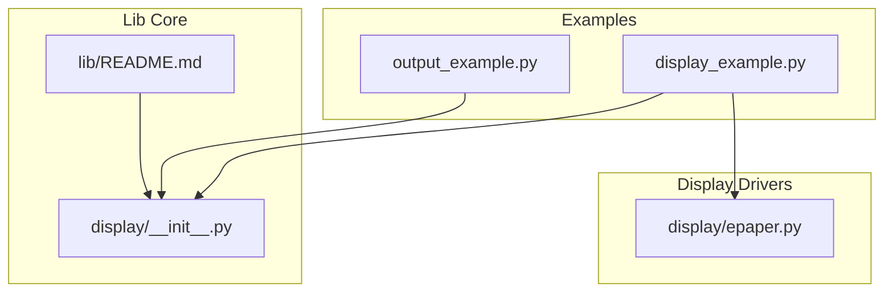
```mermaid
graph TB
subgraph "Examples"
DX["display_example.py"]
OX["output_example.py"]
end
subgraph "Lib Core"
LREAD["lib/README.md"]
DINIT["display/__init__.py"]
end
subgraph "Display Drivers"
EPD["display/epaper.py"]
end
DX --> DINIT
DX --> EPD
OX --> DINIT
LREAD --> DINIT
```

**Diagram sources**
- [display_example.py:1-240](file://src/main/examples/display_example.py#L1-L240)
- [output_example.py:1-251](file://src/main/examples/output_example.py#L1-L251)
- [lib README:1-72](file://src/lib/README.md#L1-L72)
- [display __init__:1-14](file://src/lib/display/__init__.py#L1-L14)
- [E-Paper driver:1-207](file://src/lib/display/epaper.py#L1-L207)

**Section sources**
- [lib README:1-72](file://src/lib/README.md#L1-L72)
- [display __init__:1-14](file://src/lib/display/__init__.py#L1-L14)

## Core Components
This section outlines the primary display and output components available in the framework and how they are used in the examples.

- Display drivers
  - SSD1306 OLED via I2C
  - ILI9341 TFT via SPI
  - ST7789 TFT via SPI
  - LCD 16x2 via I2C
  - MAX7219 LED matrix via SPI
  - E-paper (EPD) via SPI
  - TJC HMI touch display via UART
  - P10 LED panels (monochrome and RGB) via HUB75-like protocol

- Lighting control
  - Neopixel (WS2812B) via NeoPixelController
  - PWM LEDs and RGB LEDs

- Motor control
  - Servo motors
  - Stepper motors via ULN2003 and advanced drivers (A4988, DRV8825, TMC2208/2209, TMC5160)
  - DC motors (L298N bridge)

- Audio
  - I2S audio playback
  - Buzzer control (active and passive)

- IR remote
  - IR transmitter and receiver modules

These capabilities are demonstrated in the example scripts and the display/output module index.

**Section sources**
- [display_example.py:1-240](file://src/main/examples/display_example.py#L1-L240)
- [output_example.py:1-251](file://src/main/examples/output_example.py#L1-L251)
- [display __init__:1-14](file://src/lib/display/__init__.py#L1-L14)

## Architecture Overview
The system follows a layered architecture:
- Application layer: example scripts demonstrate usage patterns for displays and actuators.
- Library layer: modular drivers under src/lib handle hardware-specific protocols (SPI/I2C/UART/SPI for EPD).
- Hardware abstraction: drivers use MicroPython’s machine and framebuf modules to communicate with peripherals.

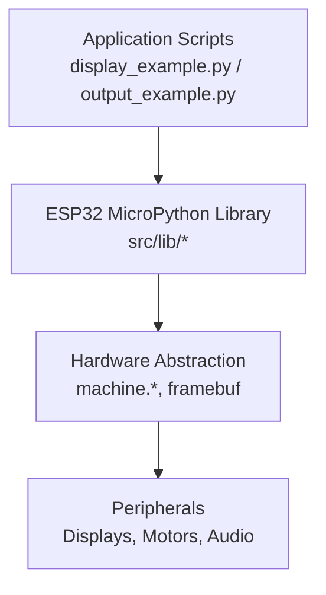
```mermaid
graph TB
APP["Application Scripts<br/>display_example.py / output_example.py"]
LIB["ESP32 MicroPython Library<br/>src/lib/*"]
HAL["Hardware Abstraction<br/>machine.*, framebuf"]
HW["Peripherals<br/>Displays, Motors, Audio"]
APP --> LIB
LIB --> HAL
HAL --> HW
```

[No sources needed since this diagram shows conceptual workflow, not actual code structure]

## Detailed Component Analysis

### Display Drivers Overview
The display subsystem exposes a set of drivers for common display types. The index lists supported modules and their families.

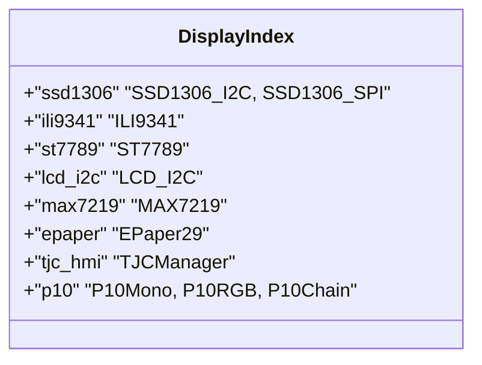
```mermaid
classDiagram
class DisplayIndex {
+"ssd1306" "SSD1306_I2C, SSD1306_SPI"
+"ili9341" "ILI9341"
+"st7789" "ST7789"
+"lcd_i2c" "LCD_I2C"
+"max7219" "MAX7219"
+"epaper" "EPaper29"
+"tjc_hmi" "TJCManager"
+"p10" "P10Mono, P10RGB, P10Chain"
}
```

**Diagram sources**
- [display __init__:1-14](file://src/lib/display/__init__.py#L1-L14)

**Section sources**
- [display __init__:1-14](file://src/lib/display/__init__.py#L1-L14)

### E-Paper (EPD) Driver
The E-paper driver provides a complete interface for 2.9" EPD modules over SPI, including initialization sequences, LUT programming, partial/full updates, and power-saving sleep mode.

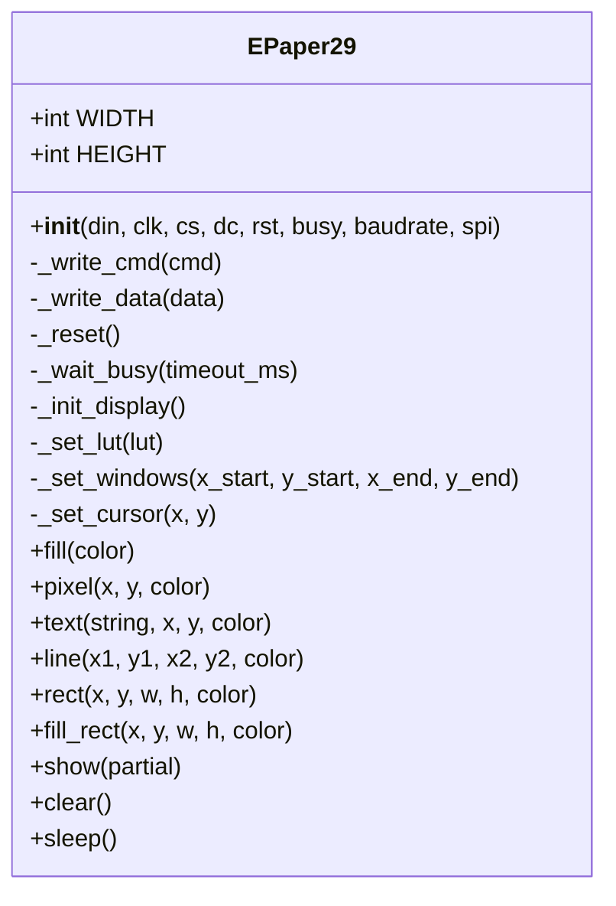
```mermaid
classDiagram
class EPaper29 {
+int WIDTH
+int HEIGHT
+__init__(din, clk, cs, dc, rst, busy, baudrate, spi)
-_write_cmd(cmd)
-_write_data(data)
-_reset()
-_wait_busy(timeout_ms)
-_init_display()
-_set_lut(lut)
-_set_windows(x_start, y_start, x_end, y_end)
-_set_cursor(x, y)
+fill(color)
+pixel(x, y, color)
+text(string, x, y, color)
+line(x1, y1, x2, y2, color)
+rect(x, y, w, h, color)
+fill_rect(x, y, w, h, color)
+show(partial)
+clear()
+sleep()
}
```

**Diagram sources**
- [E-Paper driver:34-207](file://src/lib/display/epaper.py#L34-L207)

Key behaviors:
- SPI communication with explicit DC/RST/CS control
- Framebuffer-based drawing primitives
- Command sequences for initialization and updating
- Support for partial/full waveform tables (LUT)
- Busy-wait synchronization and sleep mode

**Section sources**
- [E-Paper driver:1-207](file://src/lib/display/epaper.py#L1-L207)

### Example Workflows

#### SSD1306 OLED Example
- Initializes an SSD1306 over I2C
- Draws text, rectangles, and centers text
- Updates the display and powers down

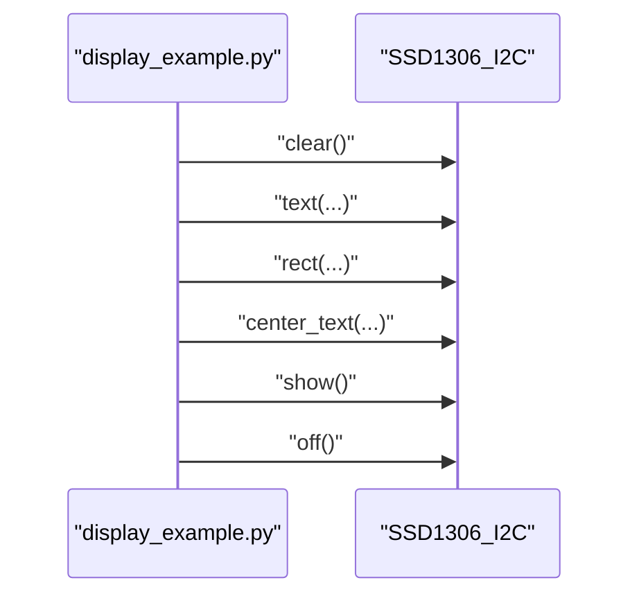
```mermaid
sequenceDiagram
participant App as "display_example.py"
participant SSD as "SSD1306_I2C"
App->>SSD : "clear()"
App->>SSD : "text(...)"
App->>SSD : "rect(...)"
App->>SSD : "center_text(...)"
App->>SSD : "show()"
App->>SSD : "off()"
```

**Diagram sources**
- [display_example.py:14-26](file://src/main/examples/display_example.py#L14-L26)

**Section sources**
- [display_example.py:14-26](file://src/main/examples/display_example.py#L14-L26)

#### ILI9341 TFT Example
- Initializes ILI9341 over SPI
- Fills screen, draws shapes, and renders text
- Powers down after delay

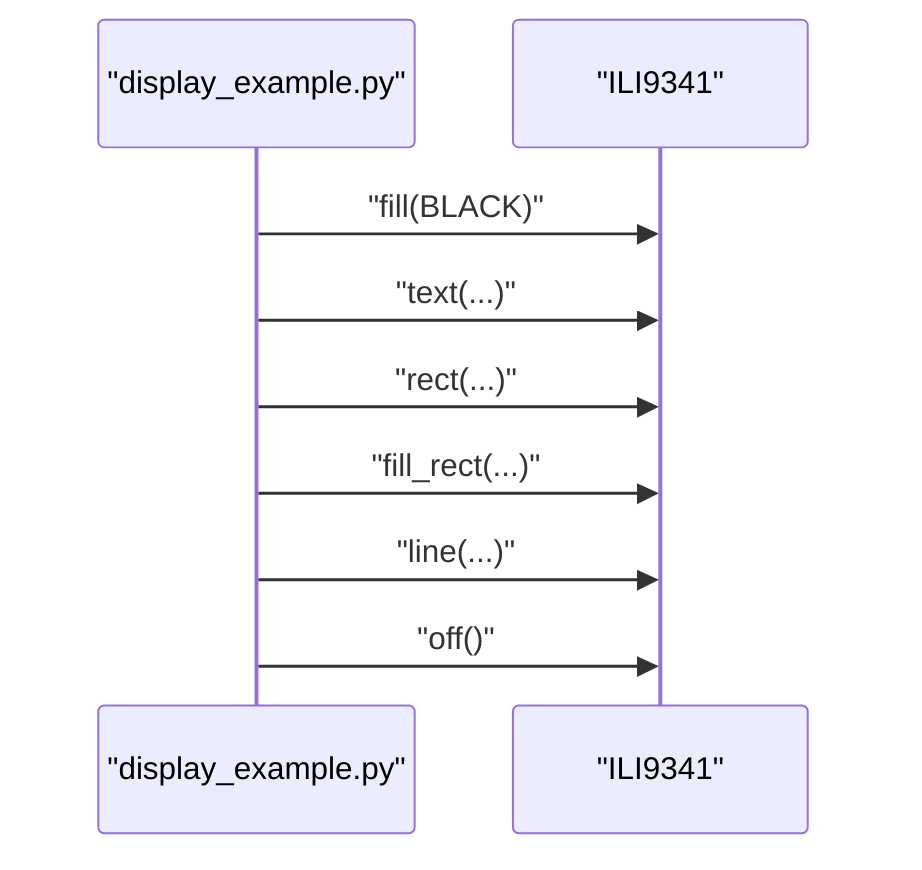
```mermaid
sequenceDiagram
participant App as "display_example.py"
participant TFT as "ILI9341"
App->>TFT : "fill(BLACK)"
App->>TFT : "text(...)"
App->>TFT : "rect(...)"
App->>TFT : "fill_rect(...)"
App->>TFT : "line(...)"
App->>TFT : "off()"
```

**Diagram sources**
- [display_example.py:32-43](file://src/main/examples/display_example.py#L32-L43)

**Section sources**
- [display_example.py:32-43](file://src/main/examples/display_example.py#L32-L43)

#### ST7789 TFT Example
- Initializes ST7789 with orientation offsets
- Renders text and rectangles
- Demonstrates small-screen usage patterns

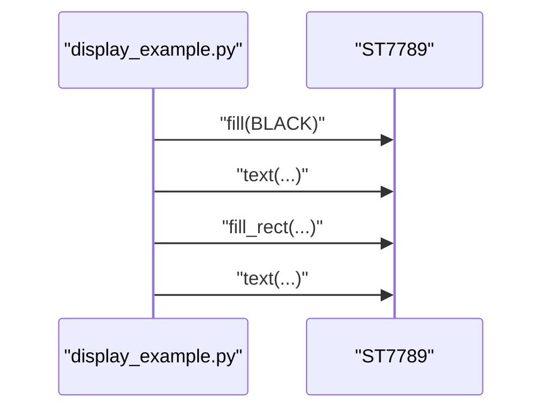
```mermaid
sequenceDiagram
participant App as "display_example.py"
participant ST7789 as "ST7789"
App->>ST7789 : "fill(BLACK)"
App->>ST7789 : "text(...)"
App->>ST7789 : "fill_rect(...)"
App->>ST7789 : "text(...)"
```

**Diagram sources**
- [display_example.py:49-60](file://src/main/examples/display_example.py#L49-L60)

**Section sources**
- [display_example.py:49-60](file://src/main/examples/display_example.py#L49-L60)

#### LCD 16x2 I2C Example
- Initializes an LCD via I2C
- Prints lines and scrolls text
- Controls backlight

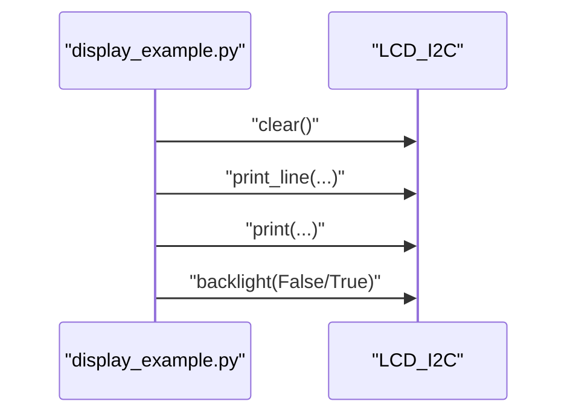
```mermaid
sequenceDiagram
participant App as "display_example.py"
participant LCD as "LCD_I2C"
App->>LCD : "clear()"
App->>LCD : "print_line(...)"
App->>LCD : "print(...)"
App->>LCD : "backlight(False/True)"
```

**Diagram sources**
- [display_example.py:66-82](file://src/main/examples/display_example.py#L66-L82)

**Section sources**
- [display_example.py:66-82](file://src/main/examples/display_example.py#L66-L82)

#### MAX7219 LED Matrix Example
- Initializes MAX7219 via SPI
- Sets brightness, clears, shows character, scrolls text

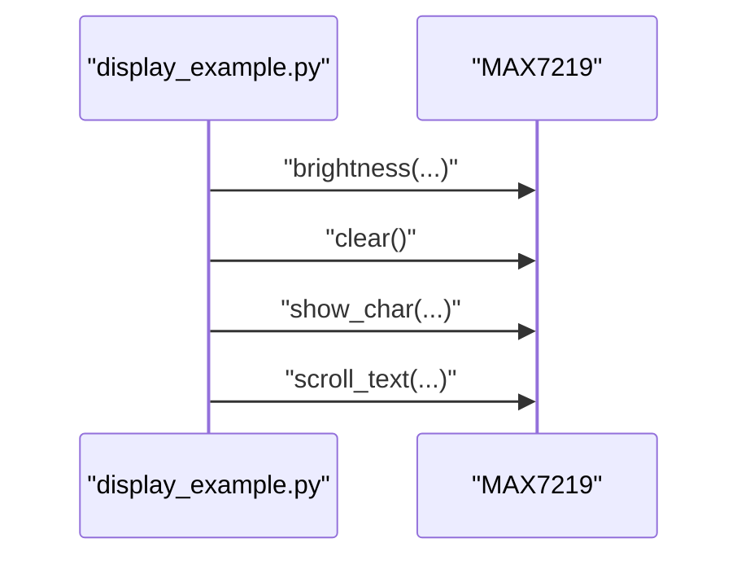
```mermaid
sequenceDiagram
participant App as "display_example.py"
participant MX as "MAX7219"
App->>MX : "brightness(...)"
App->>MX : "clear()"
App->>MX : "show_char(...)"
App->>MX : "scroll_text(...)"
```

**Diagram sources**
- [display_example.py:88-98](file://src/main/examples/display_example.py#L88-L98)

**Section sources**
- [display_example.py:88-98](file://src/main/examples/display_example.py#L88-L98)

#### E-Paper Example
- Initializes EPD over SPI
- Draws text and rectangle, updates display, enters sleep

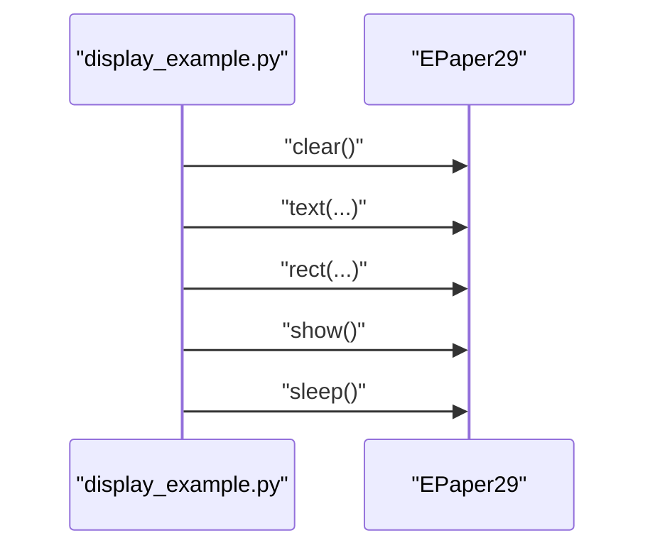
```mermaid
sequenceDiagram
participant App as "display_example.py"
participant EPD as "EPaper29"
App->>EPD : "clear()"
App->>EPD : "text(...)"
App->>EPD : "rect(...)"
App->>EPD : "show()"
App->>EPD : "sleep()"
```

**Diagram sources**
- [display_example.py:104-115](file://src/main/examples/display_example.py#L104-L115)
- [E-Paper driver:177-207](file://src/lib/display/epaper.py#L177-L207)

**Section sources**
- [display_example.py:104-115](file://src/main/examples/display_example.py#L104-L115)
- [E-Paper driver:177-207](file://src/lib/display/epaper.py#L177-L207)

#### TJC HMI Touch Display Example
- Initializes TJC HMI manager over UART
- Navigates pages and writes numeric/text widgets

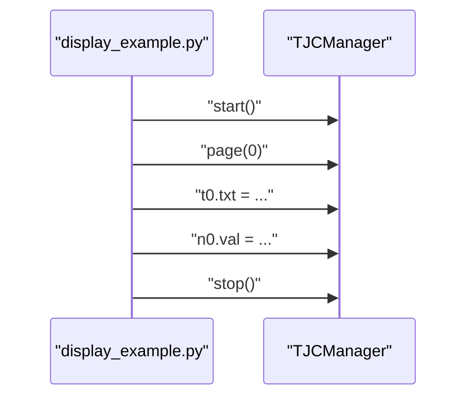
```mermaid
sequenceDiagram
participant App as "display_example.py"
participant TJC as "TJCManager"
App->>TJC : "start()"
App->>TJC : "page(0)"
App->>TJC : "t0.txt = ..."
App->>TJC : "n0.val = ..."
App->>TJC : "stop()"
```

**Diagram sources**
- [display_example.py:124-141](file://src/main/examples/display_example.py#L124-L141)

**Section sources**
- [display_example.py:124-141](file://src/main/examples/display_example.py#L124-L141)

#### P10 LED Panels (Mono, RGB, Scroll)
- Demonstrates monochrome and RGB variants
- Shows text, rectangles, and scrolling text

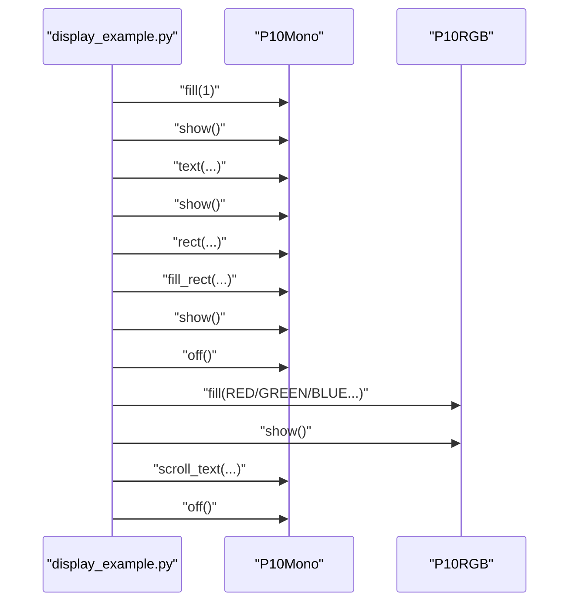
```mermaid
sequenceDiagram
participant App as "display_example.py"
participant P10M as "P10Mono"
participant P10R as "P10RGB"
App->>P10M : "fill(1)"
App->>P10M : "show()"
App->>P10M : "text(...)"
App->>P10M : "show()"
App->>P10M : "rect(...)"
App->>P10M : "fill_rect(...)"
App->>P10M : "show()"
App->>P10M : "off()"
App->>P10R : "fill(RED/GREEN/BLUE...)"
App->>P10R : "show()"
App->>P10M : "scroll_text(...)"
App->>P10M : "off()"
```

**Diagram sources**
- [display_example.py:149-215](file://src/main/examples/display_example.py#L149-L215)

**Section sources**
- [display_example.py:149-215](file://src/main/examples/display_example.py#L149-L215)

### Output Control Components

#### Neopixel (WS2812B)
- Uses NeoPixelController to set whole-strip colors, wipe effects, rainbow cycles, and HSV-to-RGB conversion

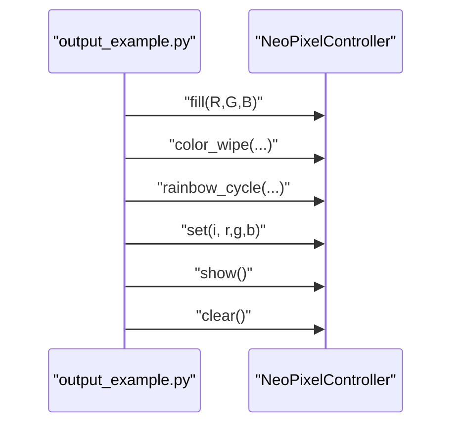
```mermaid
sequenceDiagram
participant App as "output_example.py"
participant NP as "NeoPixelController"
App->>NP : "fill(R,G,B)"
App->>NP : "color_wipe(...)"
App->>NP : "rainbow_cycle(...)"
App->>NP : "set(i, r,g,b)"
App->>NP : "show()"
App->>NP : "clear()"
```

**Diagram sources**
- [output_example.py:14-37](file://src/main/examples/output_example.py#L14-L37)

**Section sources**
- [output_example.py:14-37](file://src/main/examples/output_example.py#L14-L37)

#### Servo Motor
- Moves servo to angles, sweeps, centers, and powers down

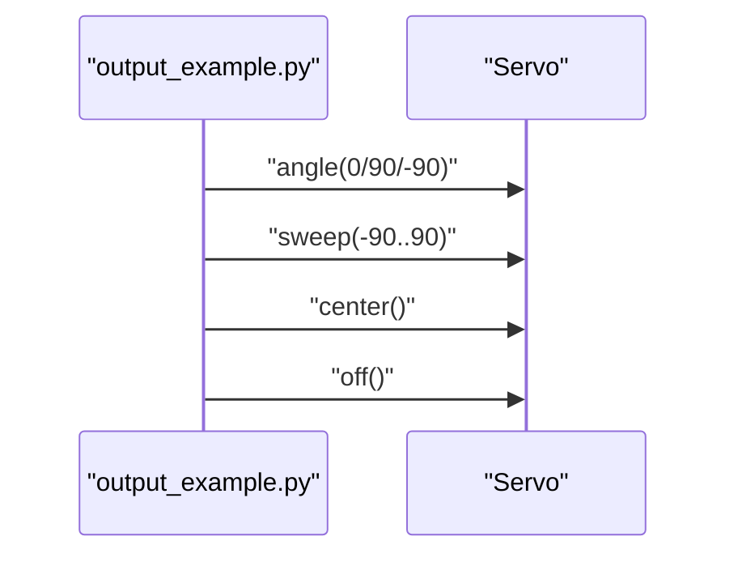
```mermaid
sequenceDiagram
participant App as "output_example.py"
participant SV as "Servo"
App->>SV : "angle(0/90/-90)"
App->>SV : "sweep(-90..90)"
App->>SV : "center()"
App->>SV : "off()"
```

**Diagram sources**
- [output_example.py:43-56](file://src/main/examples/output_example.py#L43-L56)

**Section sources**
- [output_example.py:43-56](file://src/main/examples/output_example.py#L43-L56)

#### DC Motor (L298N Bridge)
- Drives forward/backward, stops, brakes, and deinitializes

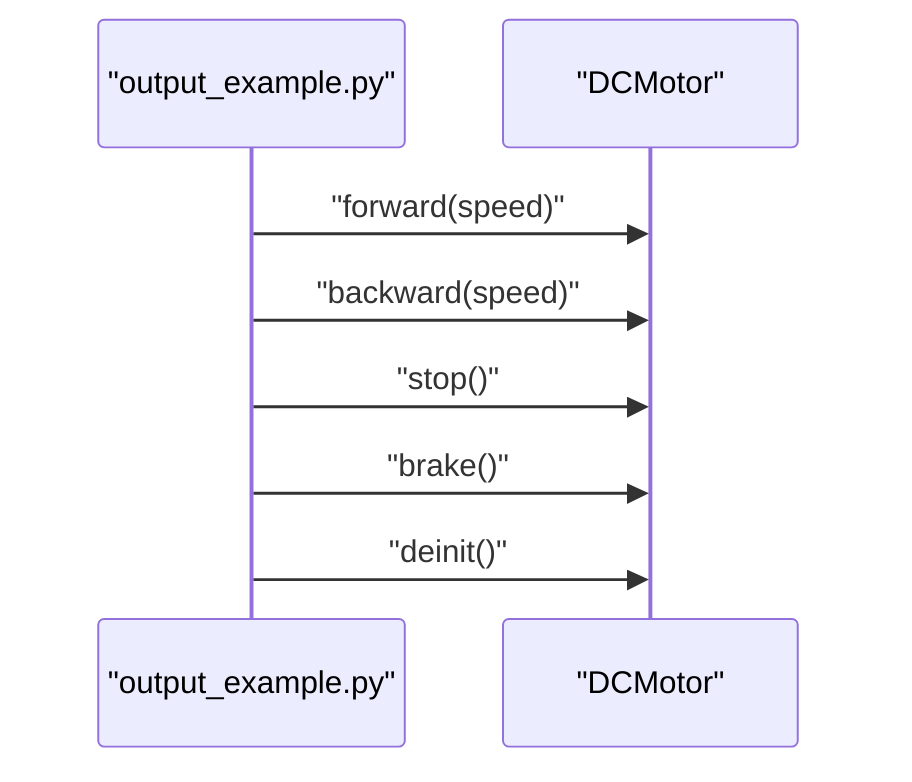
```mermaid
sequenceDiagram
participant App as "output_example.py"
participant DC as "DCMotor"
App->>DC : "forward(speed)"
App->>DC : "backward(speed)"
App->>DC : "stop()"
App->>DC : "brake()"
App->>DC : "deinit()"
```

**Diagram sources**
- [output_example.py:62-74](file://src/main/examples/output_example.py#L62-L74)

**Section sources**
- [output_example.py:62-74](file://src/main/examples/output_example.py#L62-L74)

#### Stepper Motors (ULN2003 and Advanced Drivers)
- Demonstrates ULN2003 stepping; advanced drivers (A4988, DRV8825, TMC2xx, TMC5160) are available but commented out in the example

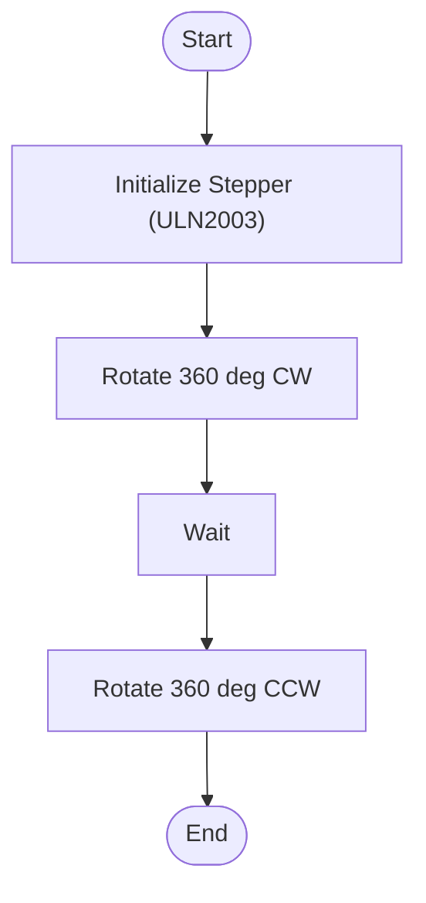
```mermaid
flowchart TD
Start(["Start"]) --> Init["Initialize Stepper (ULN2003)"]
Init --> RotateCW["Rotate 360 deg CW"]
RotateCW --> Delay1["Wait"]
Delay1 --> RotateCCW["Rotate 360 deg CCW"]
RotateCCW --> End(["End"])
```

**Diagram sources**
- [output_example.py:80-87](file://src/main/examples/output_example.py#L80-L87)

**Section sources**
- [output_example.py:80-87](file://src/main/examples/output_example.py#L80-L87)

#### Relays and Relay Boards
- Single relay on/off and timed operation
- Multi-channel relay board mask control

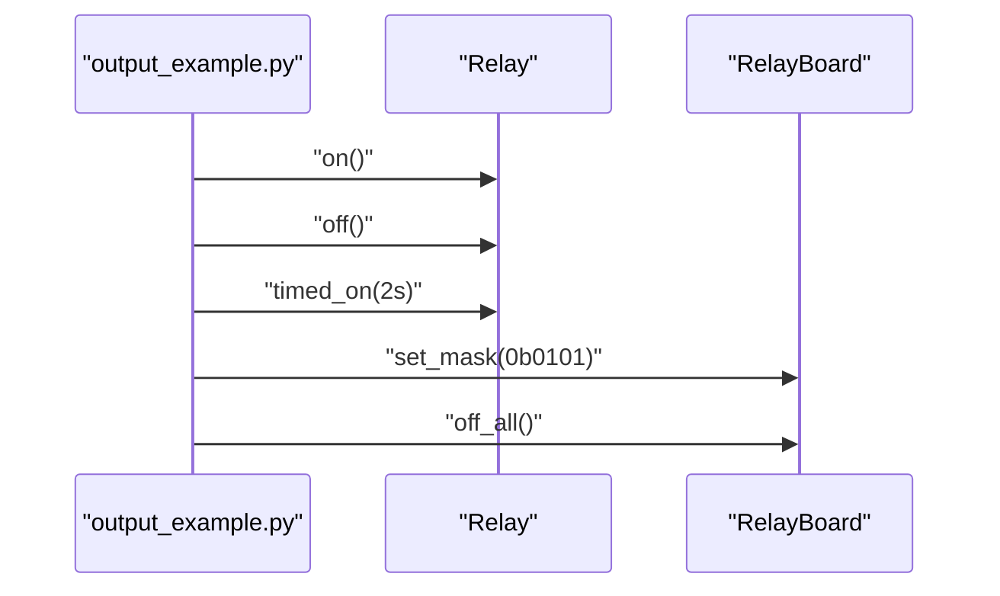
```mermaid
sequenceDiagram
participant App as "output_example.py"
participant RL as "Relay"
participant RB as "RelayBoard"
App->>RL : "on()"
App->>RL : "off()"
App->>RL : "timed_on(2s)"
App->>RB : "set_mask(0b0101)"
App->>RB : "off_all()"
```

**Diagram sources**
- [output_example.py:162-179](file://src/main/examples/output_example.py#L162-L179)

**Section sources**
- [output_example.py:162-179](file://src/main/examples/output_example.py#L162-L179)

#### Buzzer Control
- Active buzzer beep pattern
- Passive buzzer plays a melody

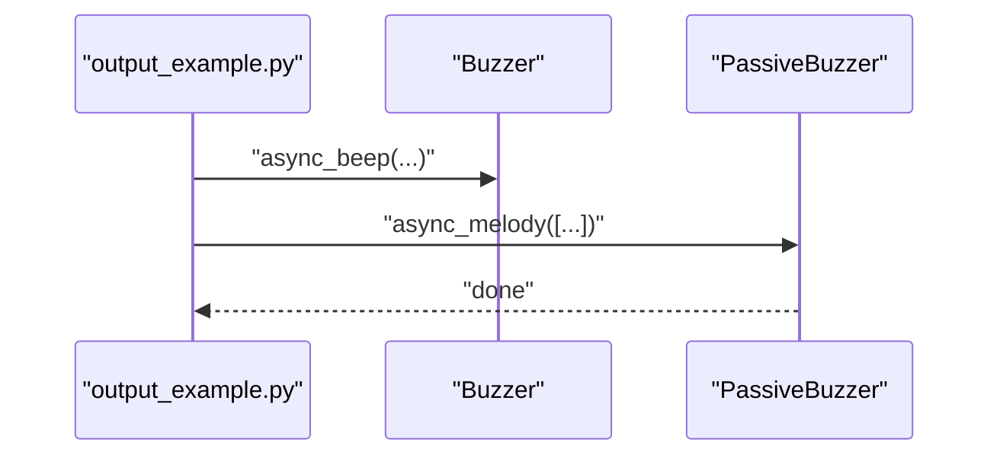
```mermaid
sequenceDiagram
participant App as "output_example.py"
participant AB as "Buzzer"
participant PB as "PassiveBuzzer"
App->>AB : "async_beep(...)"
App->>PB : "async_melody([...])"
PB-->>App : "done"
```

**Diagram sources**
- [output_example.py:185-200](file://src/main/examples/output_example.py#L185-L200)

**Section sources**
- [output_example.py:185-200](file://src/main/examples/output_example.py#L185-L200)

#### PWM LEDs and RGB LEDs
- Single PWM LED fade-in/out and blink
- RGB LED color transitions

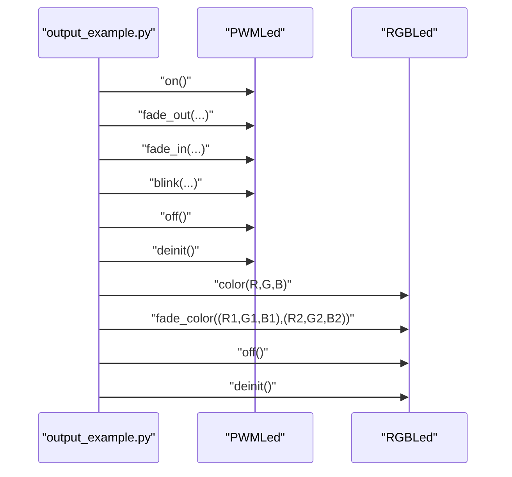
```mermaid
sequenceDiagram
participant App as "output_example.py"
participant PL as "PWMLed"
participant RL as "RGBLed"
App->>PL : "on()"
App->>PL : "fade_out(...)"
App->>PL : "fade_in(...)"
App->>PL : "blink(...)"
App->>PL : "off()"
App->>PL : "deinit()"
App->>RL : "color(R,G,B)"
App->>RL : "fade_color((R1,G1,B1),(R2,G2,B2))"
App->>RL : "off()"
App->>RL : "deinit()"
```

**Diagram sources**
- [output_example.py:206-227](file://src/main/examples/output_example.py#L206-L227)

**Section sources**
- [output_example.py:206-227](file://src/main/examples/output_example.py#L206-L227)

## Dependency Analysis
The examples depend on the library modules located under src/lib. The display module index enumerates supported drivers, and the examples import from these modules to exercise their APIs.

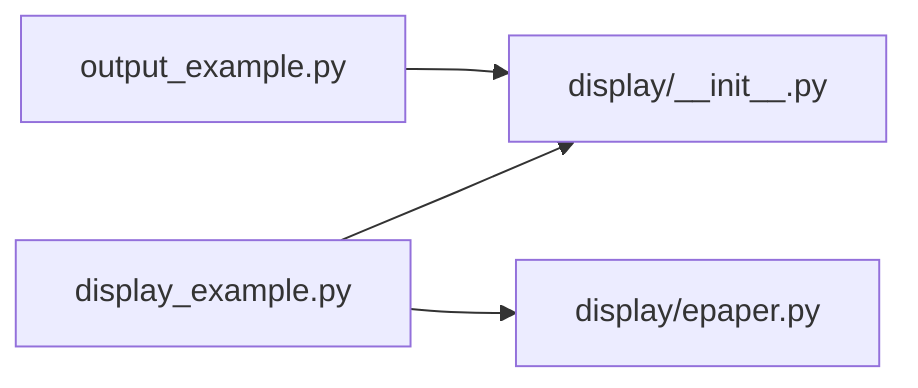
```mermaid
graph LR
EX1["display_example.py"] --> IDX["display/__init__.py"]
EX1 --> EPD["display/epaper.py"]
EX2["output_example.py"] --> IDX
```

**Diagram sources**
- [display_example.py:1-240](file://src/main/examples/display_example.py#L1-L240)
- [output_example.py:1-251](file://src/main/examples/output_example.py#L1-L251)
- [display __init__:1-14](file://src/lib/display/__init__.py#L1-L14)

**Section sources**
- [display_example.py:1-240](file://src/main/examples/display_example.py#L1-L240)
- [output_example.py:1-251](file://src/main/examples/output_example.py#L1-L251)
- [display __init__:1-14](file://src/lib/display/__init__.py#L1-L14)

## Performance Considerations
Graphics rendering and audio processing on constrained devices require careful resource management:

- Graphics
  - Prefer batched updates: accumulate drawing operations then call show once per frame.
  - Use partial updates where supported (e.g., E-paper partial LUT) to reduce refresh time and power.
  - Minimize SPI transactions by grouping commands and avoiding unnecessary resets.
  - Choose appropriate framebuffer formats and sizes to fit available RAM.

- Audio
  - For I2S playback, configure DMA buffers to avoid underruns; tune buffer sizes and sample rates to match memory constraints.
  - For buzzer melodies, precompute note durations and minimize context switches during playback.
  - Deinitialize unused peripherals to free up CPU and memory.

- Motor control
  - Use non-blocking routines (async) to keep UI responsive while driving motors.
  - Limit acceleration/deceleration profiles to reduce peak current draw.

[No sources needed since this section provides general guidance]

## Troubleshooting Guide
Common issues and remedies:

- Display not initializing
  - Verify wiring matches driver constructor parameters (pins, SPI bus).
  - Ensure busy pin handling is correct for EPD; confirm pull-ups and signal timing.

- E-paper ghosting or slow updates
  - Use full update LUT for first-time setup; switch to partial LUT for subsequent updates.
  - Ensure show completes before issuing another update; respect busy-wait timeouts.

- Audio artifacts
  - Increase I2S buffer size or lower sample rate to prevent underruns.
  - Avoid long blocking operations during audio callbacks.

- Motor jitter or stalls
  - Reduce microstep rate or increase current limit (where safe).
  - Ensure adequate power supply and decoupling capacitors.

**Section sources**
- [E-Paper driver:111-118](file://src/lib/display/epaper.py#L111-L118)
- [E-Paper driver:183-195](file://src/lib/display/epaper.py#L183-L195)

## Conclusion
The ESP32-C3 framework provides a comprehensive set of display and output drivers suitable for embedded applications. The examples demonstrate practical integration patterns for OLEDs, TFTs, LCDs, LED matrices, e-paper, HMI touch displays, and P10 panels. Output control includes lighting (Neopixel/PWM), servos, steppers, relays, buzzers, and audio. By following the usage patterns shown and applying the performance and troubleshooting guidance, developers can build efficient and reliable user interfaces and actuator control systems.

## Appendices

### Quick Reference: Example Entry Points
- Display examples: [display_example.py:221-236](file://src/main/examples/display_example.py#L221-L236)
- Output examples: [output_example.py:233-247](file://src/main/examples/output_example.py#L233-L247)

### Module Index Reference
- Display modules: [display __init__:1-14](file://src/lib/display/__init__.py#L1-L14)
- Library overview: [lib README:1-72](file://src/lib/README.md#L1-L72)