# Display Drivers

<cite>
**Referenced Files in This Document**
- [display/__init__.py](file://src/lib/display/__init__.py)
- [ssd1306.py](file://src/lib/display/ssd1306.py)
- [ili9341.py](file://src/lib/display/ili9341.py)
- [st7789.py](file://src/lib/display/st7789.py)
- [lcd_i2c.py](file://src/lib/display/lcd_i2c.py)
- [max7219.py](file://src/lib/display/max7219.py)
- [epaper.py](file://src/lib/display/epaper.py)
- [tjc_hmi.py](file://src/lib/display/tjc_hmi.py)
- [p10_display.py](file://src/lib/p10/p10_display.py)
- [display_example.py](file://src/main/examples/display_example.py)
</cite>

## Table of Contents
1. [Introduction](#introduction)
2. [Project Structure](#project-structure)
3. [Core Components](#core-components)
4. [Architecture Overview](#architecture-overview)
5. [Detailed Component Analysis](#detailed-component-analysis)
6. [Dependency Analysis](#dependency-analysis)
7. [Performance Considerations](#performance-considerations)
8. [Troubleshooting Guide](#troubleshooting-guide)
9. [Conclusion](#conclusion)
10. [Appendices](#appendices)

## Introduction
This document explains the display driver implementations available in the ESP32-C3 framework. It covers OLED (SSD1306), TFT (ILI9341, ST7789), LCD (I2C via PCF8574), LED matrix (MAX7219), e-paper (EPD), TJC HMI touch displays, and P10 LED panels. For each driver, we describe initialization, rendering primitives, text and graphics operations, buffer management, and performance characteristics. Practical usage patterns are illustrated using examples from display_example.py.

## Project Structure
The display ecosystem is organized under src/lib/display and src/lib/p10. Each driver exposes a class tailored to a specific controller or panel. The example script demonstrates initialization and common drawing operations for supported displays.

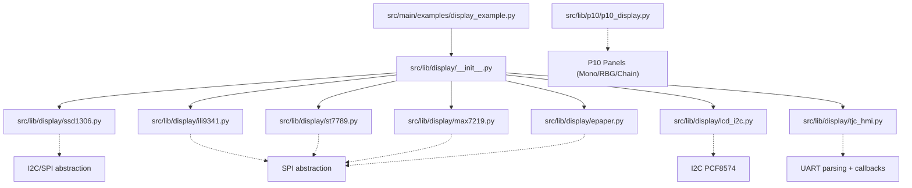

**Diagram sources**
- [display_example.py:1-240](file://src/main/examples/display_example.py#L1-L240)
- [display/__init__.py:1-14](file://src/lib/display/__init__.py#L1-L14)
- [ssd1306.py:1-247](file://src/lib/display/ssd1306.py#L1-L247)
- [ili9341.py:1-261](file://src/lib/display/ili9341.py#L1-L261)
- [st7789.py:1-241](file://src/lib/display/st7789.py#L1-L241)
- [lcd_i2c.py:1-214](file://src/lib/display/lcd_i2c.py#L1-L214)
- [max7219.py:1-229](file://src/lib/display/max7219.py#L1-L229)
- [epaper.py:1-207](file://src/lib/display/epaper.py#L1-L207)
- [tjc_hmi.py:1-917](file://src/lib/display/tjc_hmi.py#L1-L917)
- [p10_display.py:1-548](file://src/lib/p10/p10_display.py#L1-L548)

**Section sources**
- [display_example.py:1-240](file://src/main/examples/display_example.py#L1-L240)
- [display/__init__.py:1-14](file://src/lib/display/__init__.py#L1-L14)

## Core Components
- SSD1306: I2C/SPI monochrome OLED driver with framebuffer-backed primitives, text, and inversion control.
- ILI9341: SPI TFT with RGB565 color, windowed writes, Bresenham line, and scalable text rendering.
- ST7789: SPI TFT supporting multiple sizes and offsets, windowed updates, and character rendering.
- LCD I2C: Character LCD via PCF8574 I2C backpack with 4-bit mode, cursor positioning, and backlight control.
- MAX7219: 8x8 LED matrix via SPI with built-in font, brightness, and scrolling text.
- EPaper: E-Ink driver with full/partial LUT updates, busy-wait synchronization, and sleep mode.
- TJC HMI: UART-driven HMI with widget proxy access, async RX parser, and extensive command set.
- P10 LED Panels: High-level drivers for monochrome and RGB panels using HUB75 timing and buffers.

**Section sources**
- [ssd1306.py:34-149](file://src/lib/display/ssd1306.py#L34-L149)
- [ili9341.py:56-261](file://src/lib/display/ili9341.py#L56-L261)
- [st7789.py:56-241](file://src/lib/display/st7789.py#L56-L241)
- [lcd_i2c.py:45-214](file://src/lib/display/lcd_i2c.py#L45-L214)
- [max7219.py:55-229](file://src/lib/display/max7219.py#L55-L229)
- [epaper.py:34-207](file://src/lib/display/epaper.py#L34-L207)
- [tjc_hmi.py:152-917](file://src/lib/display/tjc_hmi.py#L152-L917)
- [p10_display.py:23-548](file://src/lib/p10/p10_display.py#L23-L548)

## Architecture Overview
The drivers share a consistent pattern:
- Hardware abstraction: SPI/I2C/PWM pins configured per device.
- Initialization sequences: Reset and controller-specific init commands.
- Buffering: Framebuffer for monochrome or dedicated RGB buffers for color panels.
- Rendering: Primitive drawing delegates to buffer operations, followed by hardware updates.
- Optional: Auto-refresh timers for LED panels; async RX for HMI.

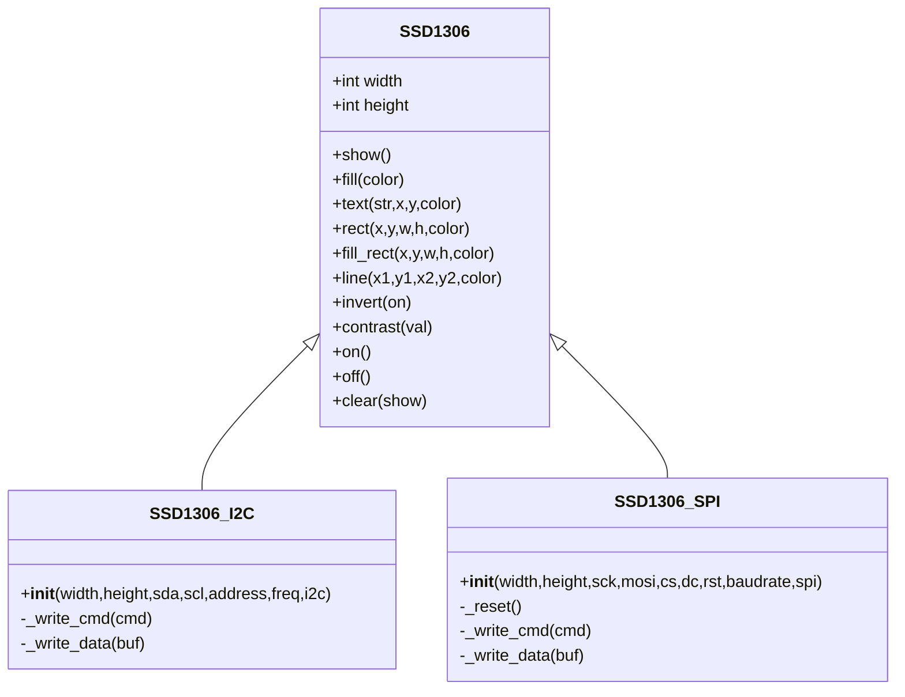

**Diagram sources**
- [ssd1306.py:34-247](file://src/lib/display/ssd1306.py#L34-L247)

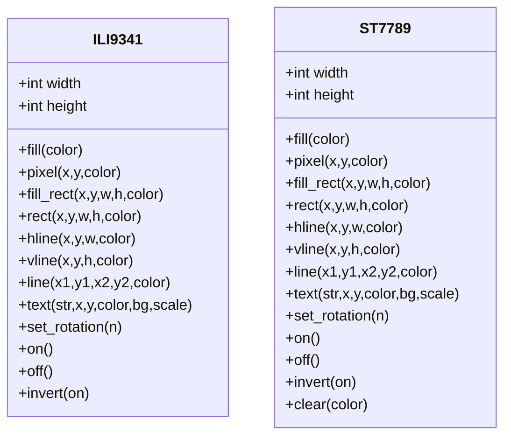

**Diagram sources**
- [ili9341.py:56-261](file://src/lib/display/ili9341.py#L56-L261)
- [st7789.py:56-241](file://src/lib/display/st7789.py#L56-L241)

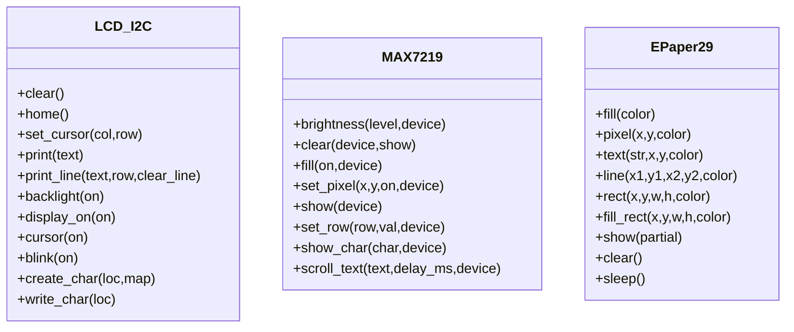

**Diagram sources**
- [lcd_i2c.py:45-214](file://src/lib/display/lcd_i2c.py#L45-L214)
- [max7219.py:55-229](file://src/lib/display/max7219.py#L55-L229)
- [epaper.py:34-207](file://src/lib/display/epaper.py#L34-L207)

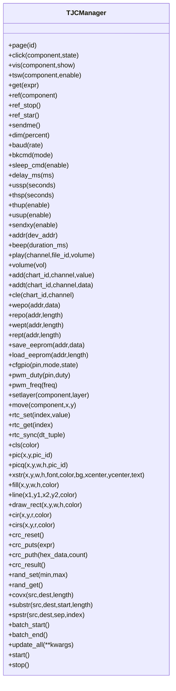

**Diagram sources**
- [tjc_hmi.py:152-917](file://src/lib/display/tjc_hmi.py#L152-L917)

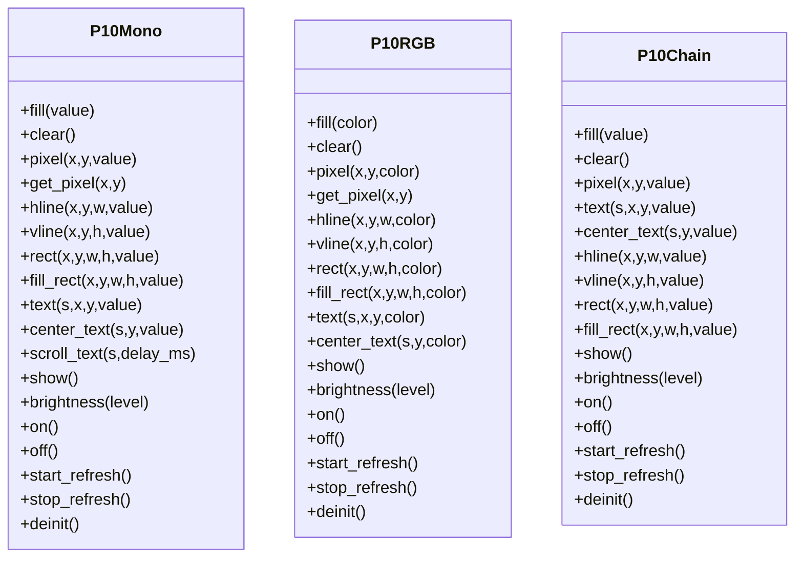

**Diagram sources**
- [p10_display.py:23-548](file://src/lib/p10/p10_display.py#L23-L548)

## Detailed Component Analysis

### SSD1306 OLED (I2C/SPI)
- Initialization: Device reset and a sequence of SSD1306 commands configure display geometry, addressing, and charge pump.
- Buffering: A framebuffer is created with MONO_VLSB layout sized to width × pages.
- Rendering: Primitives (pixel, line, rect, fill_rect, hline, vline) operate on the framebuffer; show flushes the entire buffer region.
- Text: Uses the built-in 8x8 bitmap font; center_text computes centered x-position.
- Controls: on/off, invert, contrast, clear.

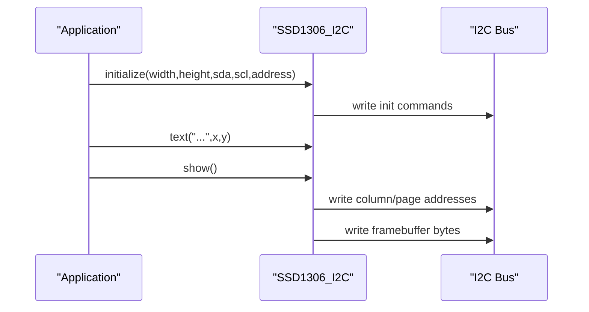

**Diagram sources**
- [ssd1306.py:47-89](file://src/lib/display/ssd1306.py#L47-L89)
- [display_example.py:14-26](file://src/main/examples/display_example.py#L14-L26)

**Section sources**
- [ssd1306.py:34-149](file://src/lib/display/ssd1306.py#L34-L149)
- [display_example.py:14-26](file://src/main/examples/display_example.py#L14-L26)

### ILI9341 TFT
- Initialization: Reset and a series of ILI9341 commands configure power, timing, orientation, and color mode.
- Windowed writes: _set_window defines the dirty rectangle; fill_rect streams RGB565 chunks for speed.
- Primitives: line uses Bresenham; text renders characters via a temporary framebuffer and scales by repeated pixels.
- Rotation: MADCTL values rotate portrait/landscape modes and swap width/height accordingly.

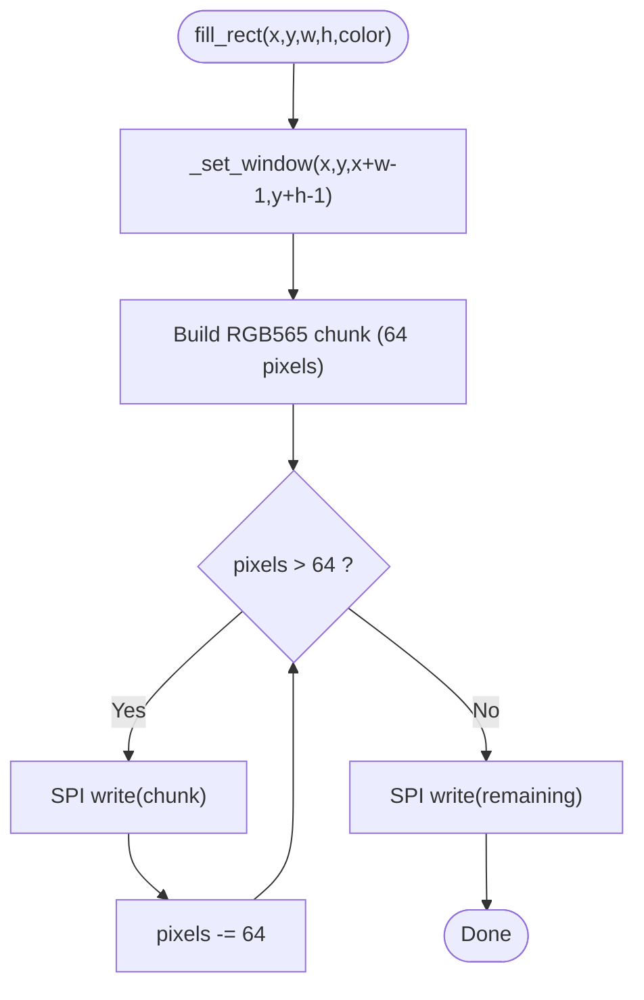

**Diagram sources**
- [ili9341.py:150-196](file://src/lib/display/ili9341.py#L150-L196)

**Section sources**
- [ili9341.py:56-261](file://src/lib/display/ili9341.py#L56-L261)
- [display_example.py:32-43](file://src/main/examples/display_example.py#L32-L43)

### ST7789 TFT
- Initialization: Reset and a tuned sequence of ST7789 commands; COLMOD sets RGB565.
- Offsets: x_offset/y_offset adjust visible window for panels with cutouts.
- Windowed writes: _set_window adds offsets before sending CASET/RASET; fill_rect streams RGB565 chunks.
- Primitives: line uses Bresenham; text renders scaled characters via a temporary framebuffer.

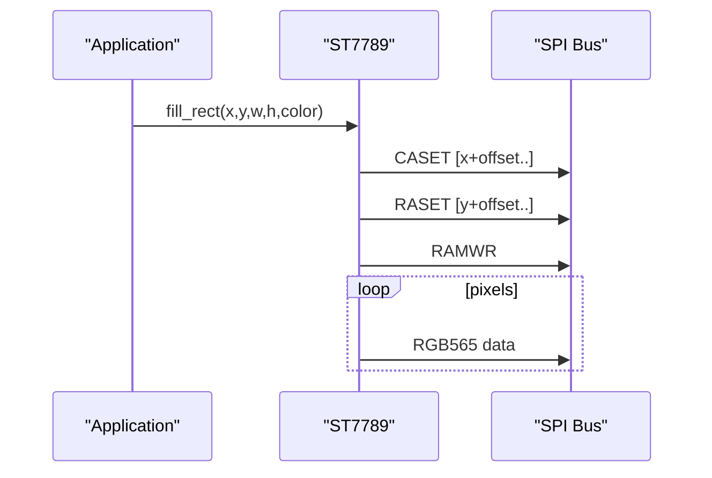

**Diagram sources**
- [st7789.py:154-194](file://src/lib/display/st7789.py#L154-L194)

**Section sources**
- [st7789.py:56-241](file://src/lib/display/st7789.py#L56-L241)
- [display_example.py:49-60](file://src/main/examples/display_example.py#L49-L60)

### LCD I2C (PCF8574)
- Interface: 4-bit mode over I2C using PCF8574; commands/data are sent as two nibbles.
- Initialization: Resets controller into 4-bit mode, enables display, clears screen.
- Operations: Cursor positioning, printing line or character by character, backlight toggle, and custom character creation.

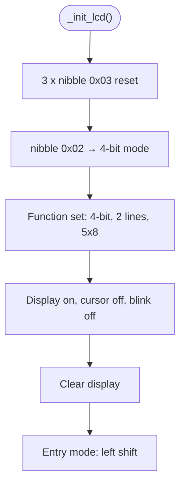

**Diagram sources**
- [lcd_i2c.py:119-133](file://src/lib/display/lcd_i2c.py#L119-L133)

**Section sources**
- [lcd_i2c.py:45-214](file://src/lib/display/lcd_i2c.py#L45-L214)
- [display_example.py:66-82](file://src/main/examples/display_example.py#L66-L82)

### MAX7219 LED Matrix
- Interface: SPI with daisy-chain support; registers mapped per device.
- Buffering: Per-device row arrays store 8-bit columns.
- Rendering: show flushes rows to devices; brightness adjusts global intensity.
- Text: Built-in 5x7 font subset expanded into 8x8; scroll_text shifts a generated bitmap across the display.

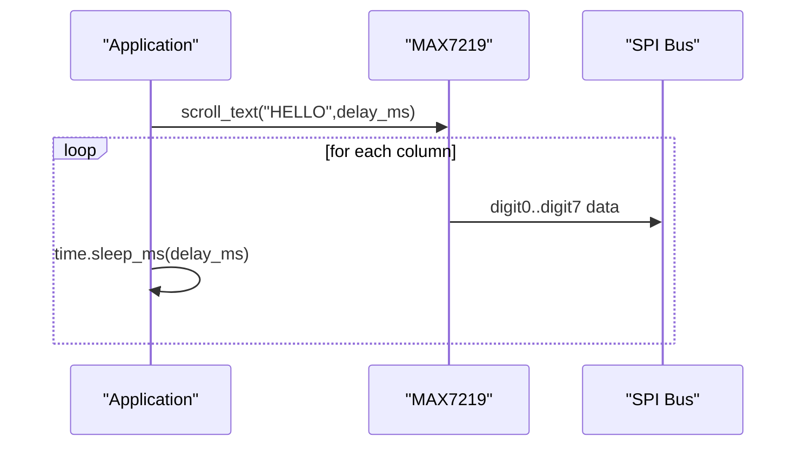

**Diagram sources**
- [max7219.py:197-229](file://src/lib/display/max7219.py#L197-L229)

**Section sources**
- [max7219.py:55-229](file://src/lib/display/max7219.py#L55-L229)
- [display_example.py:88-98](file://src/main/examples/display_example.py#L88-L98)

### E-Paper (EPD)
- Interface: SPI with DC, CS, RST, and BUSY pins; 1-bit framebuffer.
- Updates: show applies either full or partial LUT; BUSY pin is polled until low.
- Power: sleep enters deep sleep after update to minimize power consumption.

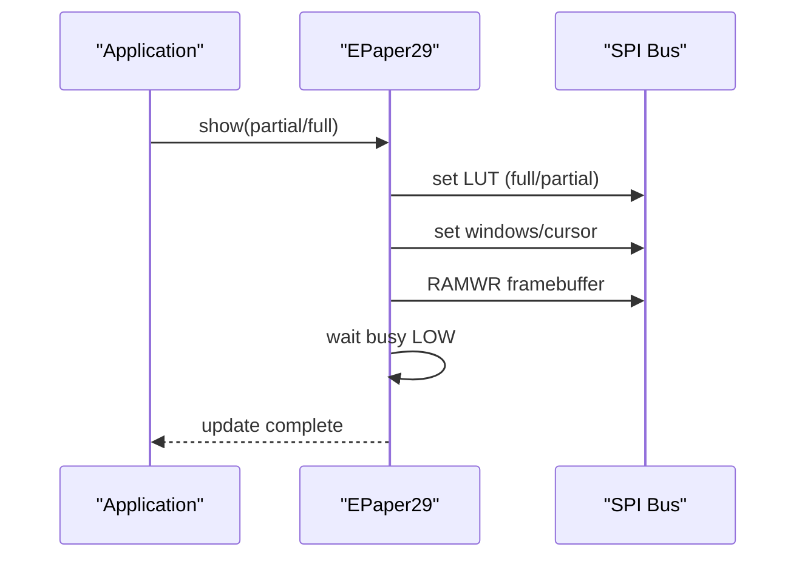

**Diagram sources**
- [epaper.py:177-196](file://src/lib/display/epaper.py#L177-L196)

**Section sources**
- [epaper.py:34-207](file://src/lib/display/epaper.py#L34-L207)
- [display_example.py:104-115](file://src/main/examples/display_example.py#L104-L115)

### TJC HMI Touch Display (UART)
- Protocol: ASCII-like commands terminated with 0xFF 0xFF 0xFF; async RX parses responses.
- Widget access: Proxy objects enable natural attribute access (e.g., tjc.t0.txt = "Hello").
- Commands: Page switching, component visibility, touch enable, numeric/string getters, audio playback, RTC sync, drawing primitives, EEPROM access, GPIO control, and more.
- Callbacks: Touch coordinates, page changes, numeric/string responses, system events, and errors.

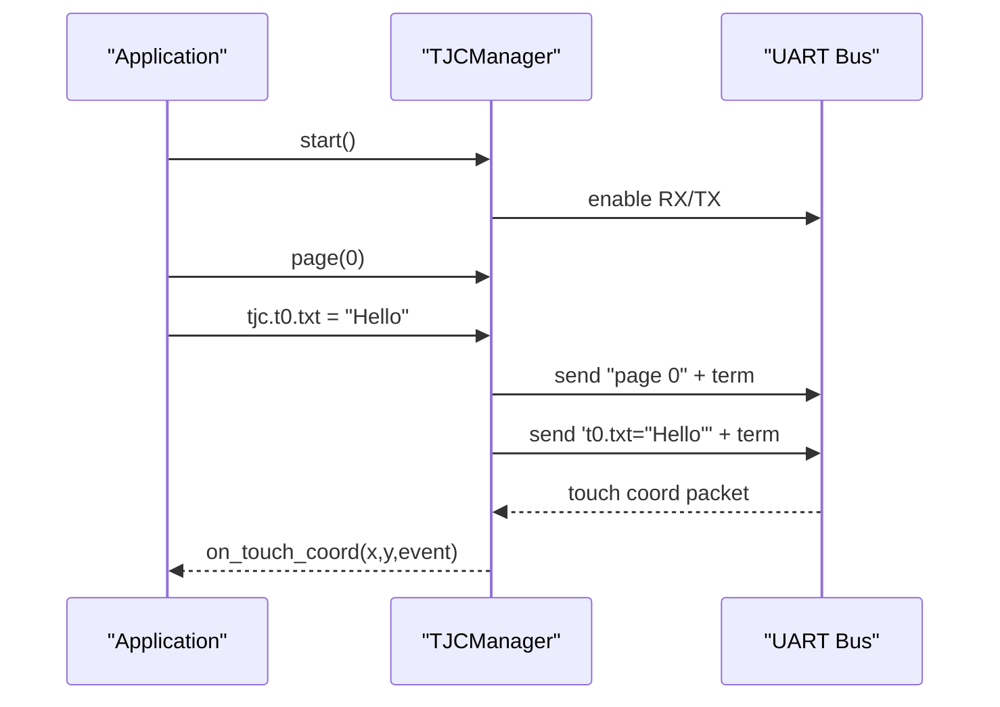

**Diagram sources**
- [tjc_hmi.py:799-800](file://src/lib/display/tjc_hmi.py#L799-L800)
- [tjc_hmi.py:271-302](file://src/lib/display/tjc_hmi.py#L271-L302)
- [tjc_hmi.py:637-797](file://src/lib/display/tjc_hmi.py#L637-L797)

**Section sources**
- [tjc_hmi.py:152-917](file://src/lib/display/tjc_hmi.py#L152-L917)
- [display_example.py:124-141](file://src/main/examples/display_example.py#L124-L141)

### P10 LED Panels
- P10Mono: Monochrome buffer with SSD1306-style primitives; auto-refresh via timer; brightness control; scrolling text demo.
- P10RGB: RGB buffer with color constants; optional BCM vs fast mode; auto-refresh; text rendering by mapping mono font to color.
- P10Chain: Virtual canvas for chained panels; maps logical coordinates to physical panels.

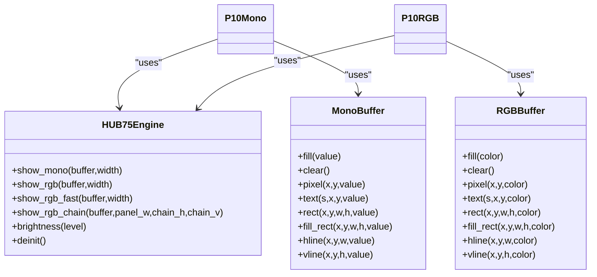

**Diagram sources**
- [p10_display.py:23-548](file://src/lib/p10/p10_display.py#L23-L548)

**Section sources**
- [p10_display.py:23-548](file://src/lib/p10/p10_display.py#L23-L548)
- [display_example.py:149-215](file://src/main/examples/display_example.py#L149-L215)

## Dependency Analysis
- Inter-driver dependencies: None; each driver encapsulates its own hardware interface.
- Example-to-driver mapping:
  - SSD1306: display_example.py calls SSD1306_I2C and uses text, rect, center_text, show, off.
  - ILI9341: display_example.py calls ILI9341 and uses fill, text, rect, fill_rect, line.
  - ST7789: display_example.py calls ST7789 and uses fill, text, fill_rect.
  - LCD I2C: display_example.py calls LCD_I2C and uses print_line, backlight toggling.
  - MAX7219: display_example.py calls MAX7219 and uses brightness, show_char, scroll_text.
  - EPaper: display_example.py calls EPaper29 and uses text, rect, show, sleep.
  - TJC HMI: display_example.py calls TJCManager and uses page, widget attributes, stop.
  - P10: display_example.py calls P10Mono/P10RGB and uses fill, text, rect, fill_rect, scroll_text.

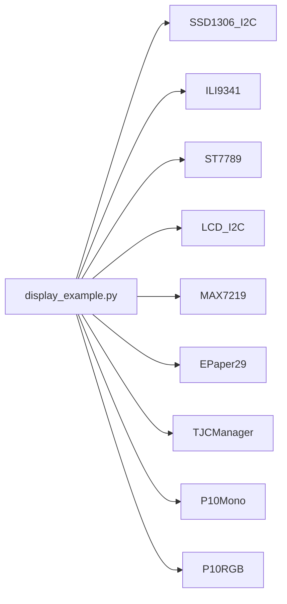

**Diagram sources**
- [display_example.py:14-239](file://src/main/examples/display_example.py#L14-L239)

**Section sources**
- [display_example.py:14-239](file://src/main/examples/display_example.py#L14-L239)

## Performance Considerations
- SPI throughput: ILI9341 and ST7789 use chunked RGB565 writes to reduce overhead; choose appropriate baudrate for your controller.
- Refresh rates: P10 drivers expose refresh_hz and timer-based auto-refresh; tune for smoothness vs CPU usage.
- Buffering: SSD1306 and EPD use framebuffers; minimize updates by drawing only changed regions when possible.
- Power: EPD sleep mode is mandatory after updates; MAX7219 brightness reduces power; TJC sleep and dim controls reduce energy.
- Text scaling: ILI9341/ST7789 scale characters by repeated pixels; prefer smaller scales for higher FPS.

## Troubleshooting Guide
- No display output:
  - Verify wiring and supply voltage; confirm correct pin assignments.
  - For SSD1306, ensure I2C address matches hardware or pass address parameter.
  - For EPD, confirm BUSY pin is connected and not stuck high.
- Garbled text/LCD not responding:
  - Confirm PCF8574 address and frequency; ensure proper enable strobe timing.
- TJC not responding:
  - Check UART wiring (TX→RX, RX→TX), correct baudrate, and terminator detection.
- Slow updates:
  - Use windowed writes (ILI9341/ST7789), reduce text scale, or disable auto-refresh for P10.

**Section sources**
- [ssd1306.py:151-191](file://src/lib/display/ssd1306.py#L151-L191)
- [ili9341.py:150-196](file://src/lib/display/ili9341.py#L150-L196)
- [st7789.py:154-194](file://src/lib/display/st7789.py#L154-L194)
- [lcd_i2c.py:119-133](file://src/lib/display/lcd_i2c.py#L119-L133)
- [epaper.py:111-119](file://src/lib/display/epaper.py#L111-L119)
- [tjc_hmi.py:799-800](file://src/lib/display/tjc_hmi.py#L799-L800)

## Conclusion
The ESP32-C3 display stack provides robust drivers for a wide range of panels and modules. By leveraging framebuffer-backed primitives, windowed updates, and asynchronous protocols where applicable, applications can achieve efficient and responsive visuals across OLED, TFT, LCD, LED matrix, e-paper, and HMI solutions. The example script offers practical patterns for initialization and common operations across all supported drivers.

## Appendices
- Practical usage patterns are demonstrated in display_example.py for each driver category, including initialization, drawing operations, and UI patterns.

**Section sources**
- [display_example.py:14-239](file://src/main/examples/display_example.py#L14-L239)