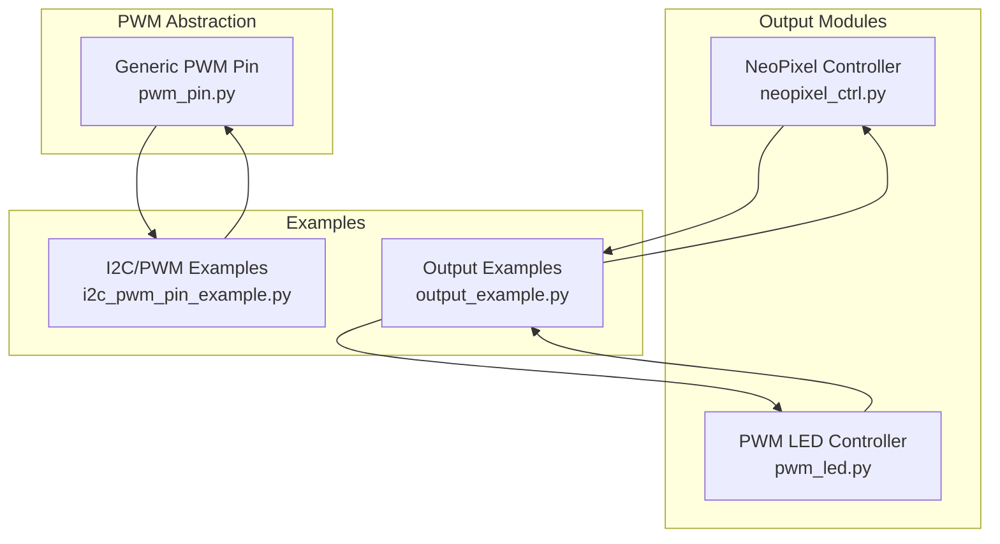
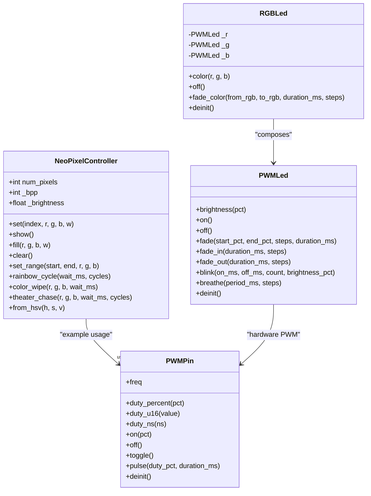
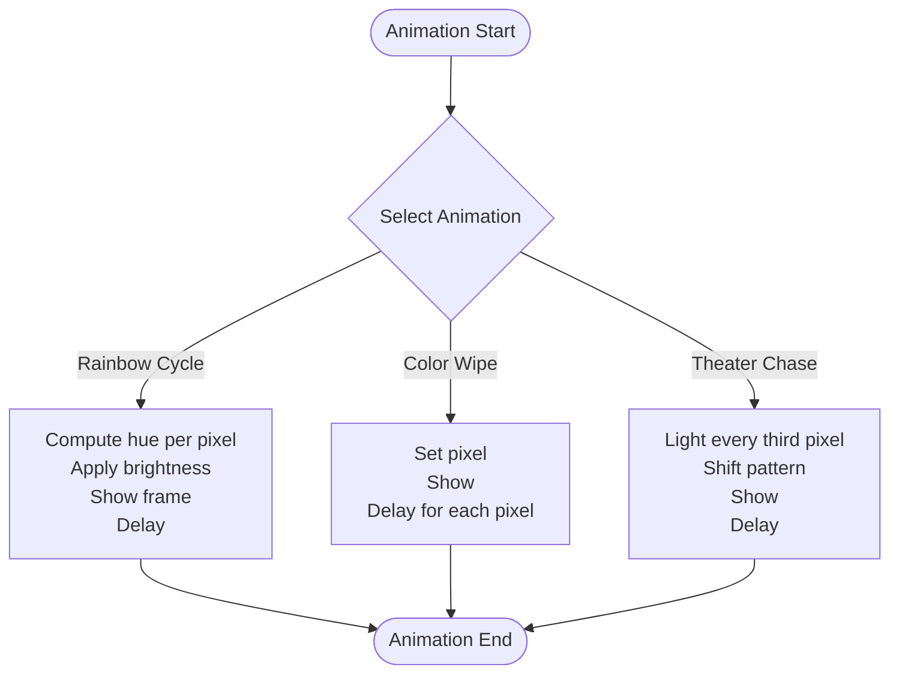
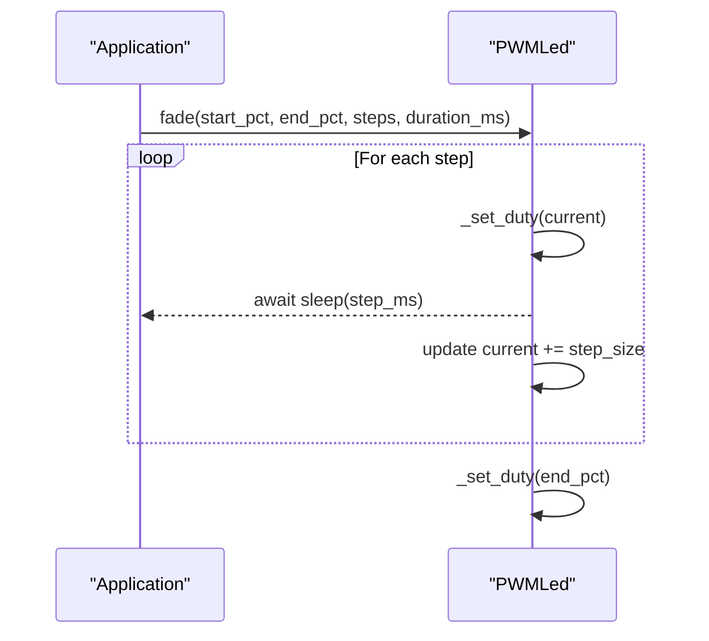
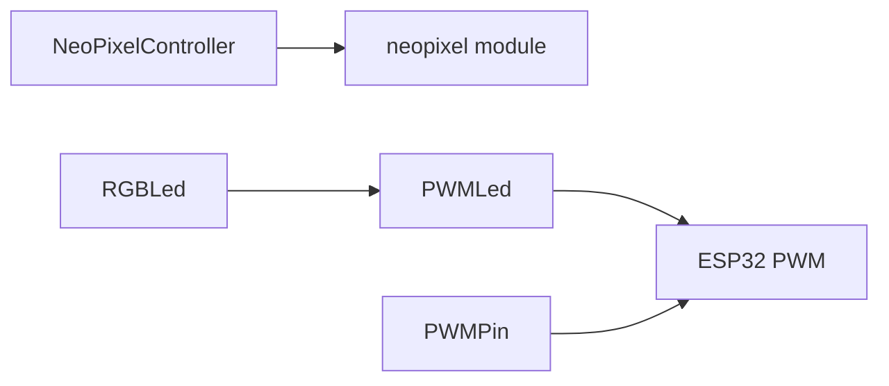

# Lighting Control

<cite>
**Referenced Files in This Document**
- [neopixel_ctrl.py](file://src/lib/output/neopixel_ctrl.py)
- [pwm_led.py](file://src/lib/output/pwm_led.py)
- [pwm_pin.py](file://src/lib/pwm/pwm_pin.py)
- [output_example.py](file://src/main/examples/output_example.py)
- [i2c_pwm_pin_example.py](file://src/main/examples/i2c_pwm_pin_example.py)
- [device.cfg](file://src/device.cfg)
</cite>

## Table of Contents
1. [Introduction](#introduction)
2. [Project Structure](#project-structure)
3. [Core Components](#core-components)
4. [Architecture Overview](#architecture-overview)
5. [Detailed Component Analysis](#detailed-component-analysis)
6. [Dependency Analysis](#dependency-analysis)
7. [Performance Considerations](#performance-considerations)
8. [Troubleshooting Guide](#troubleshooting-guide)
9. [Conclusion](#conclusion)
10. [Appendices](#appendices)

## Introduction
This document provides comprehensive documentation for lighting control systems implemented in the repository, focusing on:
- Addressable LED strip control using the NeoPixel controller
- PWM-based LED dimming for continuous brightness control
- Color space conversions and animation sequences
- Practical examples demonstrating animations, color cycling, and interactive effects
- Performance optimization and power management considerations

The repository targets ESP32 microcontrollers and uses MicroPython’s built-in libraries for hardware control.

## Project Structure
The lighting control functionality is organized under the output and pwm modules, with example scripts demonstrating usage patterns.

**Diagram sources**
- [neopixel_ctrl.py](file://src/lib/output/neopixel_ctrl.py)
- [pwm_led.py](file://src/lib/output/pwm_led.py)
- [pwm_pin.py](file://src/lib/pwm/pwm_pin.py)
- [output_example.py](file://src/main/examples/output_example.py)
- [i2c_pwm_pin_example.py](file://src/main/examples/i2c_pwm_pin_example.py)

**Section sources**
- [device.cfg:1-16](file://src/device.cfg#L1-L16)

## Core Components
- NeoPixelController: Manages addressable LED strips with individual pixel control, color management, and built-in animations.
- PWMLed: Controls a single LED or LED strip using hardware PWM for continuous brightness.
- RGBLed: Provides RGB color mixing using three PWMLed channels.
- PWMPin: Generic PWM abstraction for flexible duty control and frequency management.

Key capabilities:
- Brightness scaling for both NeoPixels and PWM LEDs
- Built-in animations (color wipe, rainbow cycle, theater chase)
- Smooth fading and blinking routines
- HSV-to-RGB conversion for color cycling
- PWM duty control in percentage and raw units

**Section sources**
- [neopixel_ctrl.py:14-147](file://src/lib/output/neopixel_ctrl.py#L14-L147)
- [pwm_led.py:14-215](file://src/lib/output/pwm_led.py#L14-L215)
- [pwm_pin.py:19-151](file://src/lib/pwm/pwm_pin.py#L19-L151)

## Architecture Overview
The lighting stack integrates high-level controllers with low-level hardware abstractions. NeoPixelController uses MicroPython’s neopixel module for pixel updates, while PWMLed and RGBLed leverage ESP32 hardware PWM. PWMPin offers a reusable PWM interface used in examples and can be adopted by other drivers.

**Diagram sources**
- [neopixel_ctrl.py:14-147](file://src/lib/output/neopixel_ctrl.py#L14-L147)
- [pwm_led.py:14-215](file://src/lib/output/pwm_led.py#L14-L215)
- [pwm_pin.py:19-151](file://src/lib/pwm/pwm_pin.py#L19-L151)

## Detailed Component Analysis

### NeoPixelController
NeoPixelController encapsulates control of WS2812B/SK6812 strips:
- Pixel manipulation: set, fill, clear, set_range
- Animation primitives: rainbow_cycle, color_wipe, theater_chase
- Color conversion: HSV-to-RGB via static method
- Brightness scaling applied before writing to the strip

Timing and protocol considerations:
- Uses MicroPython’s neopixel module for pixel updates.
- The underlying implementation relies on precise timing; the example demonstrates smooth animations by updating pixels and calling show() periodically.
- For long strips, consider using level shifters and ensuring stable power supplies.

Brightness and color management:
- Internal brightness scaling multiplies RGB values before setting pixels.
- HSV color conversion enables smooth color transitions and rainbow effects.

Practical usage patterns:
- Fill entire strips, set individual pixels, and animate with waits between frames.
- Rainbow cycle and color wipe demonstrate real-time updates.

**Section sources**
- [neopixel_ctrl.py:14-147](file://src/lib/output/neopixel_ctrl.py#L14-L147)
- [output_example.py:14-38](file://src/main/examples/output_example.py#L14-L38)

#### NeoPixelController Animation Flow

**Diagram sources**
- [neopixel_ctrl.py:82-113](file://src/lib/output/neopixel_ctrl.py#L82-L113)

### PWM LED Dimming (PWMLed)
PWMLed provides continuous brightness control using ESP32 hardware PWM:
- Duty cycle control in percentage and raw u16 units
- On/off states and current brightness property
- Smooth fading routines with configurable steps and duration
- Blinking and breathing effects for interactive lighting

Hardware PWM characteristics:
- Uses machine.PWM with configurable frequency.
- Supports inverted logic for common anode configurations.
- Duty cycle mapped to 0–65535 for precise control.

Practical usage patterns:
- Fade in/out for ambient lighting
- Blinking for alerts or status indicators
- Breathing effect for relaxing ambiance

**Section sources**
- [pwm_led.py:14-215](file://src/lib/output/pwm_led.py#L14-L215)
- [output_example.py:206-227](file://src/main/examples/output_example.py#L206-L227)

#### PWMLed Fade Sequence

**Diagram sources**
- [pwm_led.py:74-91](file://src/lib/output/pwm_led.py#L74-L91)

### RGB LED Control (RGBLed)
RGBLed composes three PWMLed instances to manage red, green, and blue channels:
- Single color assignment via brightness percentages
- Smooth color transitions using multi-channel interpolation
- Off state clears all channels

Integration with PWMLed:
- Each channel controlled independently for fine-grained color mixing.
- Frequency and inversion settings applied consistently across channels.

**Section sources**
- [pwm_led.py:141-215](file://src/lib/output/pwm_led.py#L141-L215)
- [output_example.py:219-226](file://src/main/examples/output_example.py#L219-L226)

### Generic PWM Pin (PWMPin)
PWMPin provides a reusable abstraction over machine.PWM:
- Frequency management and duty control in percentage, u16, and nanoseconds
- Convenience methods for on/off/toggle/pulse
- Resource cleanup via deinit

Usage in examples:
- Demonstrates PWM LED brightness control and servo angle mapping.
- Highlights frequency changes and duty cycle helpers.

**Section sources**
- [pwm_pin.py:19-151](file://src/lib/pwm/pwm_pin.py#L19-L151)
- [i2c_pwm_pin_example.py:153-227](file://src/main/examples/i2c_pwm_pin_example.py#L153-L227)

## Dependency Analysis
- NeoPixelController depends on MicroPython’s neopixel module for pixel updates.
- PWMLed depends on machine.PWM for hardware PWM control.
- RGBLed composes PWMLed instances for channel control.
- PWMPin wraps machine.PWM for generic duty/frequency control.

**Diagram sources**
- [neopixel_ctrl.py:9-11](file://src/lib/output/neopixel_ctrl.py#L9-L11)
- [pwm_led.py:10-11](file://src/lib/output/pwm_led.py#L10-L11)
- [pwm_pin.py:12-16](file://src/lib/pwm/pwm_pin.py#L12-L16)

**Section sources**
- [neopixel_ctrl.py:9-11](file://src/lib/output/neopixel_ctrl.py#L9-L11)
- [pwm_led.py:10-11](file://src/lib/output/pwm_led.py#L10-L11)
- [pwm_pin.py:12-16](file://src/lib/pwm/pwm_pin.py#L12-L16)

## Performance Considerations
- NeoPixel updates:
  - Use show() sparingly to batch pixel updates and reduce overhead.
  - For high-frequency animations, minimize per-frame delays and optimize loops.
  - Long strips benefit from level shifters and adequate power supply to prevent voltage drops affecting timing.
- PWM dimming:
  - Prefer hardware PWM for smooth, precise control; avoid software bit-banging.
  - Choose appropriate PWM frequencies to balance audible noise and flicker perception.
  - Use duty_u16 for minimal conversion overhead when exact values are known.
- Memory efficiency:
  - Store animation frames as compact arrays or precomputed color tables where possible.
  - Reuse buffers and avoid frequent allocations during animations.
- Power management:
  - Limit total current draw by reducing brightness and limiting the number of LEDs lit simultaneously.
  - Use external power supplies for high-density LED strips to avoid brownouts.

[No sources needed since this section provides general guidance]

## Troubleshooting Guide
- NeoPixel not updating:
  - Verify wiring and level shifting for 5V strips.
  - Ensure show() is called after pixel updates.
  - Check brightness scaling and pixel indices.
- PWM flicker or audible noise:
  - Increase PWM frequency to above 20 kHz.
  - Confirm duty cycle values are within 0–100% or 0–65535.
- RGB color imbalance:
  - Calibrate channel brightness manually or use calibration routines.
  - Consider common anode vs. common cathode wiring and invert settings.
- Resource cleanup:
  - Call deinit() on PWM devices to free hardware resources.

**Section sources**
- [neopixel_ctrl.py:61-74](file://src/lib/output/neopixel_ctrl.py#L61-L74)
- [pwm_led.py:136-138](file://src/lib/output/pwm_led.py#L136-L138)
- [pwm_pin.py:144-150](file://src/lib/pwm/pwm_pin.py#L144-L150)

## Conclusion
The lighting control system provides robust, hardware-accelerated solutions for both addressable LEDs and PWM-controlled lighting. NeoPixelController delivers flexible pixel-level control with built-in animations, while PWMLed and RGBLed offer precise brightness and color management. The examples demonstrate practical usage patterns for animations, color cycling, and interactive effects, enabling developers to build responsive and visually appealing lighting applications on ESP32 platforms.

[No sources needed since this section summarizes without analyzing specific files]

## Appendices

### Practical Examples Index
- NeoPixel animations: rainbow cycle, color wipe, theater chase
- PWM LED effects: fade in/out, blink, breathe
- RGB color transitions and off state

**Section sources**
- [output_example.py:14-38](file://src/main/examples/output_example.py#L14-L38)
- [output_example.py:206-227](file://src/main/examples/output_example.py#L206-L227)