# Motor Control

<cite>
**Referenced Files in This Document**
- [__init__.py](file://src/lib/output/__init__.py)
- [output_example.py](file://src/main/examples/output_example.py)
- [servo.py](file://src/lib/output/servo.py)
- [dc_motor.py](file://src/lib/output/dc_motor.py)
- [stepper.py](file://src/lib/output/stepper.py)
- [stepper_a4988.py](file://src/lib/output/stepper_a4988.py)
- [stepper_drv8825.py](file://src/lib/output/stepper_drv8825.py)
- [stepper_tmc2208.py](file://src/lib/output/stepper_tmc2208.py)
- [stepper_tmc5160.py](file://src/lib/output/stepper_tmc5160.py)
- [relay.py](file://src/lib/output/relay.py)
</cite>

## Table of Contents
1. [Introduction](#introduction)
2. [Project Structure](#project-structure)
3. [Core Components](#core-components)
4. [Architecture Overview](#architecture-overview)
5. [Detailed Component Analysis](#detailed-component-analysis)
6. [Dependency Analysis](#dependency-analysis)
7. [Performance Considerations](#performance-considerations)
8. [Troubleshooting Guide](#troubleshooting-guide)
9. [Conclusion](#conclusion)
10. [Appendices](#appendices)

## Introduction
This document provides comprehensive documentation for motor control systems implemented in the repository, covering servo motors, DC motors, stepper motors, and relay control. It explains angle positioning and pulse width modulation for servos, variable speed and direction control for DC motors, and stepper motor drivers including generic unipolar stepping, A4988, DRV8825, TMC2208/2209 serial drivers, and TMC5160 high-performance drivers. It also documents step modes (full, half, microstepping), acceleration profiles, position tracking, and relay control for high-power load switching with safety considerations. Practical examples from output_example.py demonstrate initialization, control loops, and coordinated multi-motor systems. Power management, thermal protection, and driver configuration guidance are included for different load requirements.

## Project Structure
The motor control library is organized under src/lib/output with individual modules for each actuator type. The examples in src/main/examples show how to initialize and operate actuators, including coordinated control patterns.

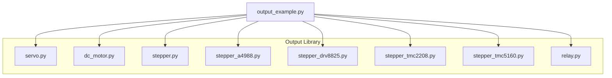

**Diagram sources**
- [__init__.py](file://src/lib/output/__init__.py)
- [output_example.py](file://src/main/examples/output_example.py)

**Section sources**
- [__init__.py](file://src/lib/output/__init__.py)
- [output_example.py](file://src/main/examples/output_example.py)

## Core Components
- Servo motor control with PWM-based angle positioning, pulse width mapping, and sweep functionality.
- DC motor control supporting forward/backward motion, coast/brake stopping, and speed regulation.
- Stepper motor drivers for unipolar (ULN2003) and various stepper drivers (A4988, DRV8825, TMC2208/2209, TMC5160) with step/direction control and microstepping.
- Relay control for high-power switching with single relay and multi-channel boards, including timed operations.

**Section sources**
- [servo.py](file://src/lib/output/servo.py)
- [dc_motor.py](file://src/lib/output/dc_motor.py)
- [stepper.py](file://src/lib/output/stepper.py)
- [stepper_a4988.py](file://src/lib/output/stepper_a4988.py)
- [stepper_drv8825.py](file://src/lib/output/stepper_drv8825.py)
- [stepper_tmc2208.py](file://src/lib/output/stepper_tmc2208.py)
- [stepper_tmc5160.py](file://src/lib/output/stepper_tmc5160.py)
- [relay.py](file://src/lib/output/relay.py)

## Architecture Overview
The system architecture centers around a unified output library with clear separation of concerns:
- Servo: PWM-based angle control with configurable pulse width and angle limits.
- DC Motor: H-bridge control with PWM speed and direction, plus brake/coast modes.
- Stepper Motors: Generic unipolar stepping for 28BYJ-48 and dedicated drivers for higher torque and precision (A4988, DRV8825, TMC2208/2209, TMC5160).
- Relay: GPIO-driven switching with support for single relays and multi-channel boards.

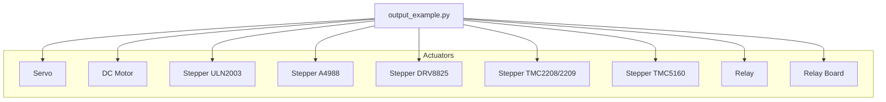

**Diagram sources**
- [output_example.py](file://src/main/examples/output_example.py)
- [servo.py](file://src/lib/output/servo.py)
- [dc_motor.py](file://src/lib/output/dc_motor.py)
- [stepper.py](file://src/lib/output/stepper.py)
- [stepper_a4988.py](file://src/lib/output/stepper_a4988.py)
- [stepper_drv8825.py](file://src/lib/output/stepper_drv8825.py)
- [stepper_tmc2208.py](file://src/lib/output/stepper_tmc2208.py)
- [stepper_tmc5160.py](file://src/lib/output/stepper_tmc5160.py)
- [relay.py](file://src/lib/output/relay.py)

## Detailed Component Analysis

### Servo Motor Control
Servo control uses PWM to set pulse width for precise angle positioning. The class supports:
- Angle setting within configured limits.
- Direct pulse width control.
- Centering and sweeping motions.
- Off/deinit for power saving.

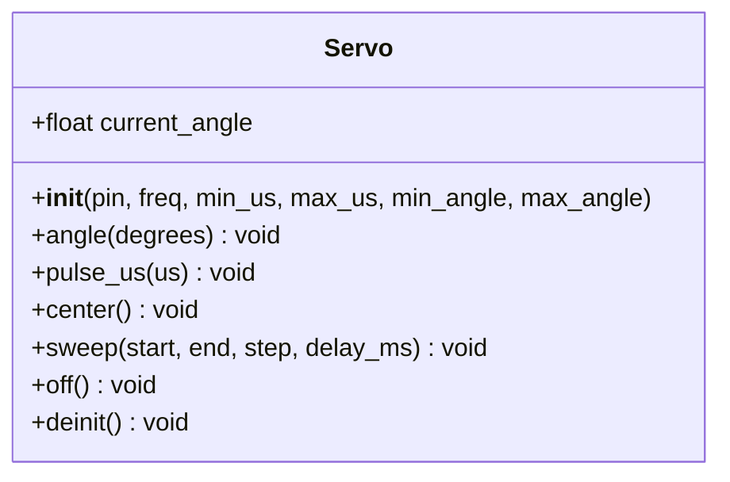

**Diagram sources**
- [servo.py](file://src/lib/output/servo.py)

**Section sources**
- [servo.py](file://src/lib/output/servo.py)

### DC Motor Control
DC motor control supports:
- Forward and backward rotation with configurable speed.
- Coast stop and brake modes.
- Speed adjustment without changing direction.
- L298N-style H-bridge and L9110-specific dual-PWM control.

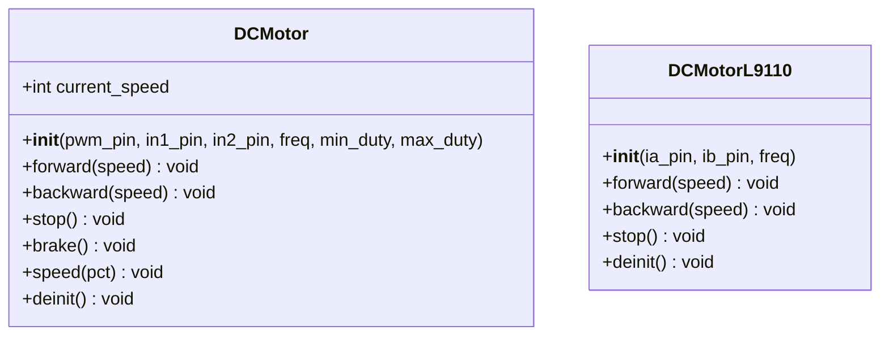

**Diagram sources**
- [dc_motor.py](file://src/lib/output/dc_motor.py)

**Section sources**
- [dc_motor.py](file://src/lib/output/dc_motor.py)

### Stepper Motor Drivers

#### Generic Unipolar Stepping (ULN2003)
Supports full and half step modes for 28BYJ-48 motors with configurable step delays and GPIO sequencing.

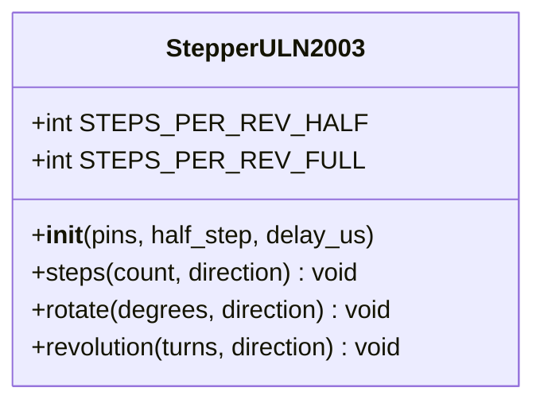

**Diagram sources**
- [stepper.py](file://src/lib/output/stepper.py)

**Section sources**
- [stepper.py](file://src/lib/output/stepper.py)

#### A4988 Driver
Configurable microstepping (full to 1/16) via MS1/MS2/MS3 pins, step/dir control, and enable/sleep management.

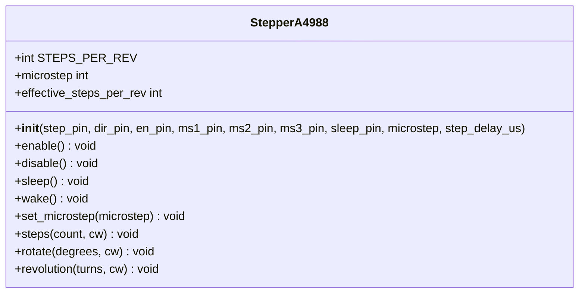

**Diagram sources**
- [stepper_a4988.py](file://src/lib/output/stepper_a4988.py)

**Section sources**
- [stepper_a4988.py](file://src/lib/output/stepper_a4988.py)

#### DRV8825 Driver
Enhanced microstepping up to 1/32, M0/M1/M2 configuration, fault pin monitoring, and extended control features.

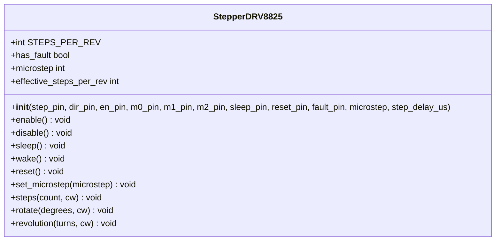

**Diagram sources**
- [stepper_drv8825.py](file://src/lib/output/stepper_drv8825.py)

**Section sources**
- [stepper_drv8825.py](file://src/lib/output/stepper_drv8825.py)

#### TMC2208/2209 Serial Drivers
UART-based configuration for current, stealth/chop modes, and microstepping. TMC2209 adds StallGuard4, CoolStep, and DIAG pin diagnostics.

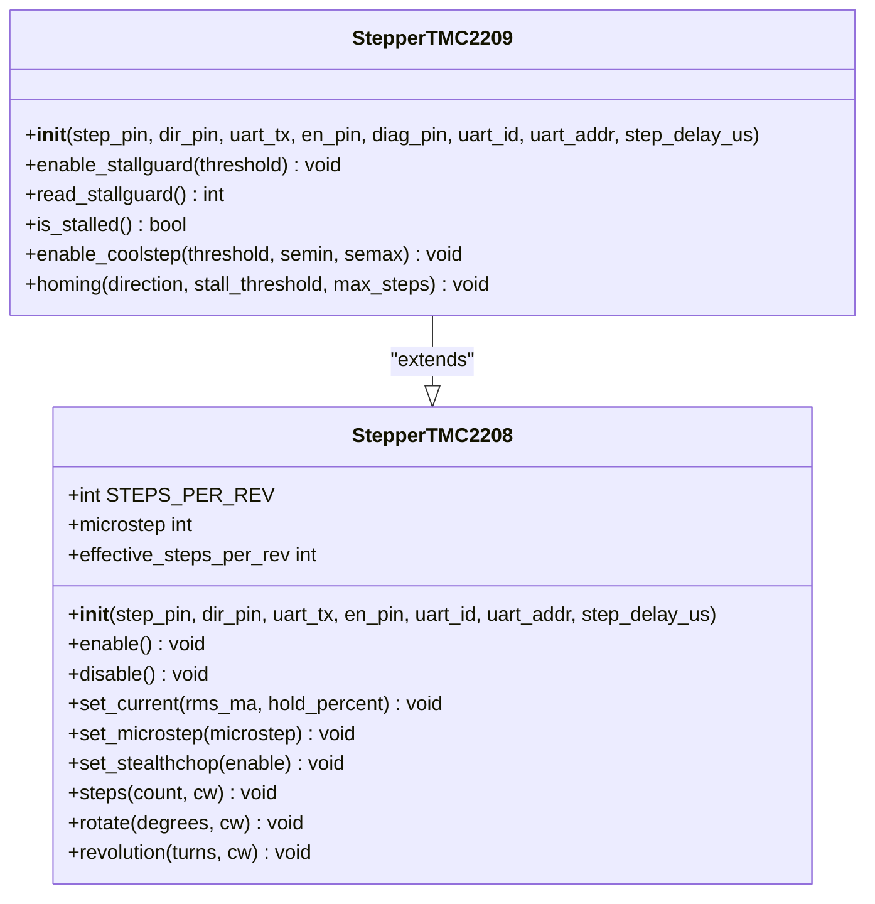

**Diagram sources**
- [stepper_tmc2208.py](file://src/lib/output/stepper_tmc2208.py)

**Section sources**
- [stepper_tmc2208.py](file://src/lib/output/stepper_tmc2208.py)

#### TMC5160 High-Performance Driver
SPI-based configuration with advanced motion control, ramp generators, StallGuard2, and position/velocity control.

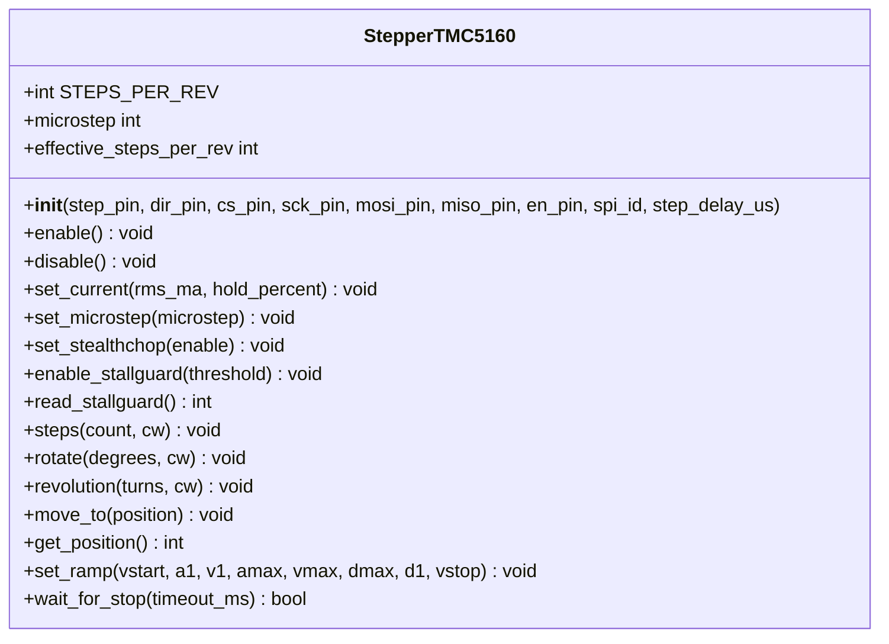

**Diagram sources**
- [stepper_tmc5160.py](file://src/lib/output/stepper_tmc5160.py)

**Section sources**
- [stepper_tmc5160.py](file://src/lib/output/stepper_tmc5160.py)

### Relay Control
Single relay and multi-channel relay board control with active-high/active-low support, timed operations, and bitmask control.

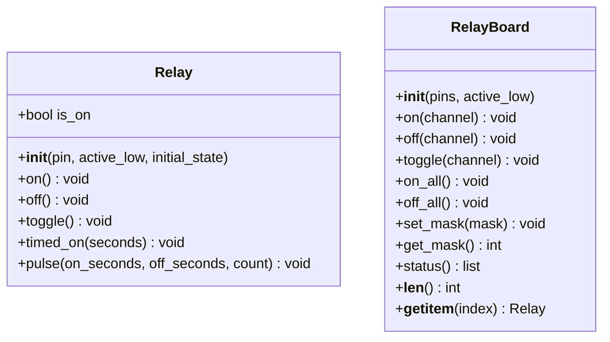

**Diagram sources**
- [relay.py](file://src/lib/output/relay.py)

**Section sources**
- [relay.py](file://src/lib/output/relay.py)

### Practical Examples from output_example.py
The examples demonstrate initialization and control patterns for each actuator type, including coordinated multi-motor systems and timing control.

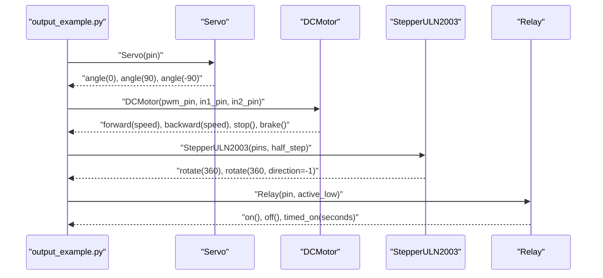

**Diagram sources**
- [output_example.py](file://src/main/examples/output_example.py)
- [servo.py](file://src/lib/output/servo.py)
- [dc_motor.py](file://src/lib/output/dc_motor.py)
- [stepper.py](file://src/lib/output/stepper.py)
- [relay.py](file://src/lib/output/relay.py)

**Section sources**
- [output_example.py](file://src/main/examples/output_example.py)

## Dependency Analysis
The output_example demonstrates runtime dependencies among modules. Each actuator module is independent and controlled via its own class interface.

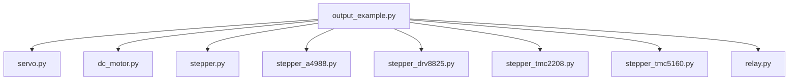

**Diagram sources**
- [output_example.py](file://src/main/examples/output_example.py)
- [servo.py](file://src/lib/output/servo.py)
- [dc_motor.py](file://src/lib/output/dc_motor.py)
- [stepper.py](file://src/lib/output/stepper.py)
- [stepper_a4988.py](file://src/lib/output/stepper_a4988.py)
- [stepper_drv8825.py](file://src/lib/output/stepper_drv8825.py)
- [stepper_tmc2208.py](file://src/lib/output/stepper_tmc2208.py)
- [stepper_tmc5160.py](file://src/lib/output/stepper_tmc5160.py)
- [relay.py](file://src/lib/output/relay.py)

**Section sources**
- [output_example.py](file://src/main/examples/output_example.py)

## Performance Considerations
- Servo control: Use appropriate PWM frequency and pulse width mapping to avoid jitter and ensure accurate angle positioning.
- DC motor control: Adjust dead-band minimum duty to prevent stiction and ensure smooth speed transitions; use brake mode judiciously to avoid excessive heat.
- Stepper motors:
  - Select microstepping appropriate for resolution vs torque trade-offs.
  - Configure step delays to match motor inductance and driver capabilities.
  - For TMC drivers, tune StealthChop/CoolStep/StallGuard for quiet operation and load sensing.
- Relay switching: Ensure adequate drive current/voltage for the relay coil; use flyback protection for inductive loads.

[No sources needed since this section provides general guidance]

## Troubleshooting Guide
- Servo does not move: Verify PWM pin availability and correct angle limits; confirm pulse width mapping aligns with servo specifications.
- DC motor does not stop cleanly: Use brake mode for quick stops; verify H-bridge wiring and duty cycle limits.
- Stepper missed steps: Reduce speed, increase current (where safe), or adjust microstepping; check for StallGuard thresholds (TMC2209/5160).
- TMC driver communication errors: Confirm UART/SPI wiring, correct addressing, and sufficient timing margins; verify MISO connectivity for read-back registers.
- Relay does not switch: Check active-high/active-low configuration and GPIO level compatibility; verify load rating and supply voltage.

**Section sources**
- [servo.py](file://src/lib/output/servo.py)
- [dc_motor.py](file://src/lib/output/dc_motor.py)
- [stepper_tmc2208.py](file://src/lib/output/stepper_tmc2208.py)
- [stepper_tmc5160.py](file://src/lib/output/stepper_tmc5160.py)
- [relay.py](file://src/lib/output/relay.py)

## Conclusion
The motor control system provides a robust, modular foundation for servo, DC motor, and stepper motor applications, along with reliable relay control. The implementations emphasize configurability, safety, and performance across a range of drivers and use cases. The examples illustrate practical initialization and control patterns suitable for real-world deployments.

[No sources needed since this section summarizes without analyzing specific files]

## Appendices

### Step Modes and Effective Steps
- ULN2003: Half step (4096 steps/rev) and full step (2048 steps/rev) configurations.
- A4988: Full to 1/16 microstepping via MS1/MS2/MS3.
- DRV8825: Full to 1/32 microstepping via M0/M1/M2.
- TMC2208/2209: Up to 1/256 microstepping via CHOPCONF MRES.
- TMC5160: Up to 1/256 microstepping via CHOPCONF MRES.

**Section sources**
- [stepper.py](file://src/lib/output/stepper.py)
- [stepper_a4988.py](file://src/lib/output/stepper_a4988.py)
- [stepper_drv8825.py](file://src/lib/output/stepper_drv8825.py)
- [stepper_tmc2208.py](file://src/lib/output/stepper_tmc2208.py)
- [stepper_tmc5160.py](file://src/lib/output/stepper_tmc5160.py)

### Acceleration Profiles and Position Tracking
- TMC5160 supports a 6-point ramp generator with configurable start/acceleration/velocity/deceleration parameters and position tracking via XACTUAL/XTARGET registers.
- TMC2209/5160 provide StallGuard and CoolStep for adaptive current and load detection.

**Section sources**
- [stepper_tmc5160.py](file://src/lib/output/stepper_tmc5160.py)
- [stepper_tmc2208.py](file://src/lib/output/stepper_tmc2208.py)

### Power Management and Thermal Protection
- Use driver-specific current registers and hold percentages to manage power and heat.
- Enable StealthChop for quieter operation and reduce audible noise.
- Monitor fault pins (DRV8825) and driver status (TMC5160) to detect over-current/over-temperature conditions.

**Section sources**
- [stepper_drv8825.py](file://src/lib/output/stepper_drv8825.py)
- [stepper_tmc5160.py](file://src/lib/output/stepper_tmc5160.py)
- [stepper_tmc2208.py](file://src/lib/output/stepper_tmc2208.py)