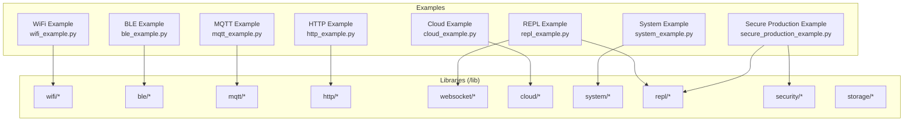
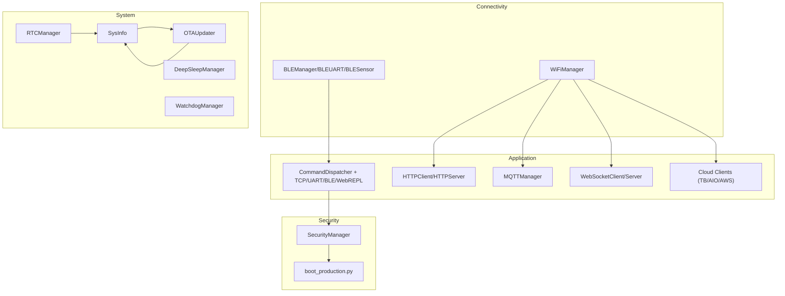
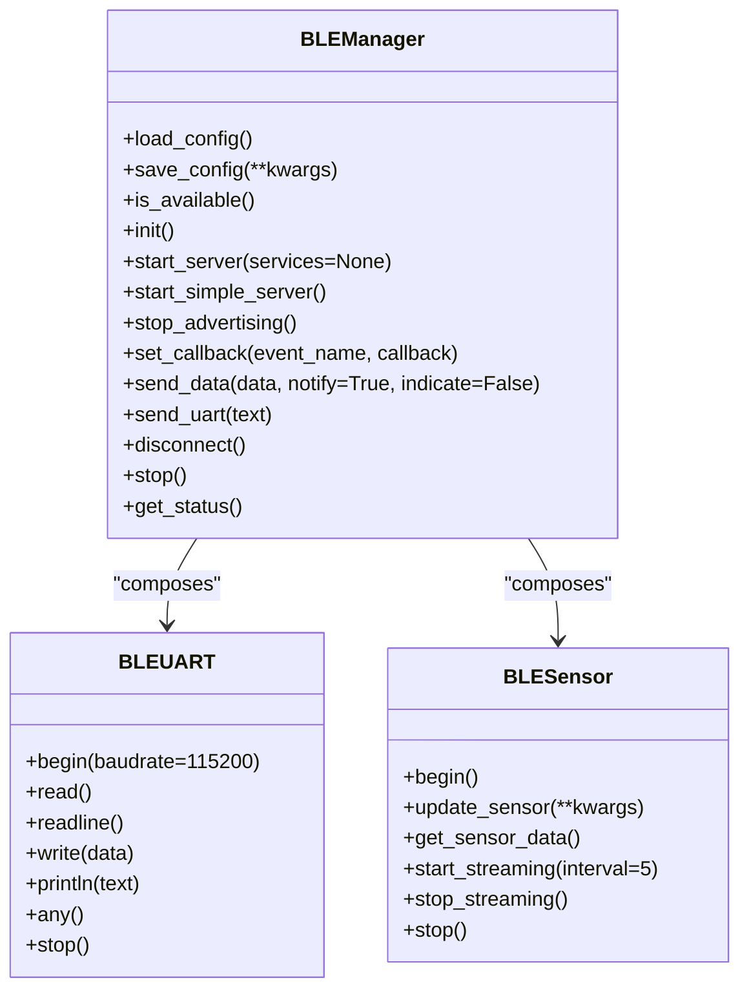
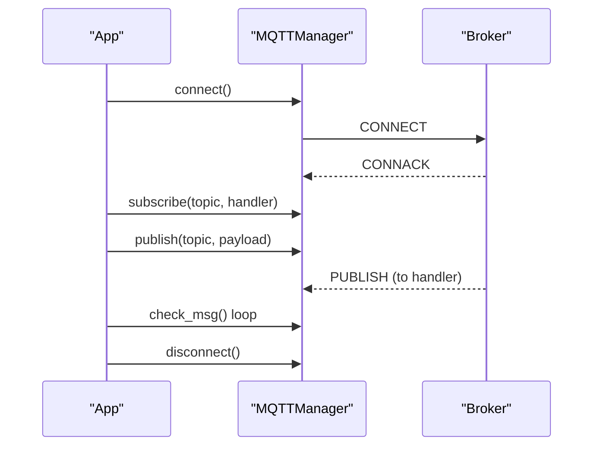
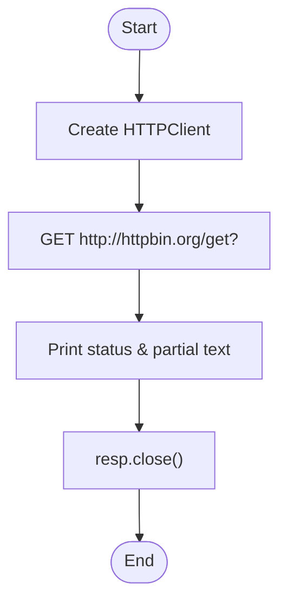
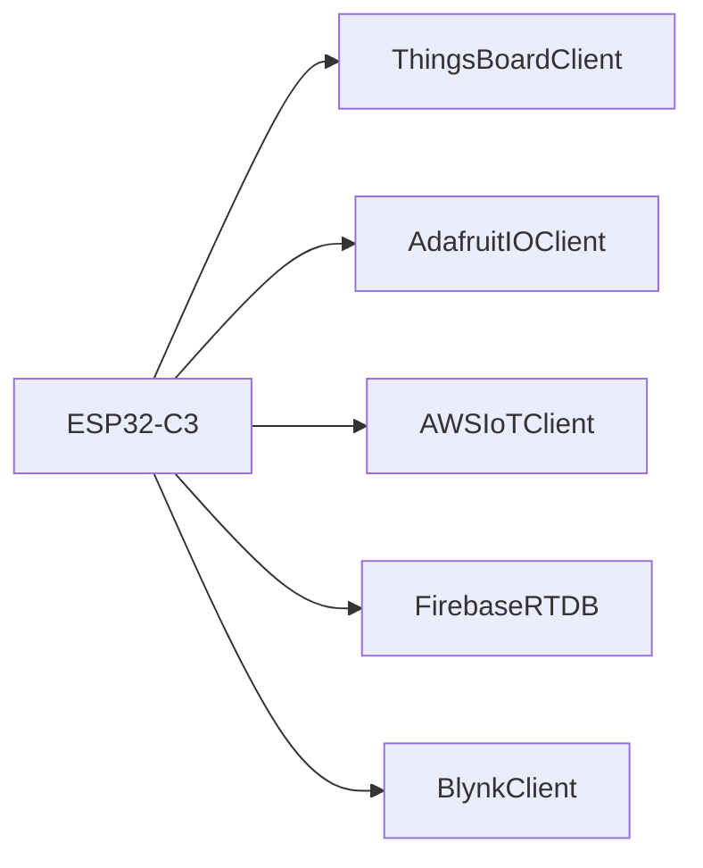
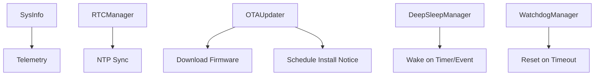
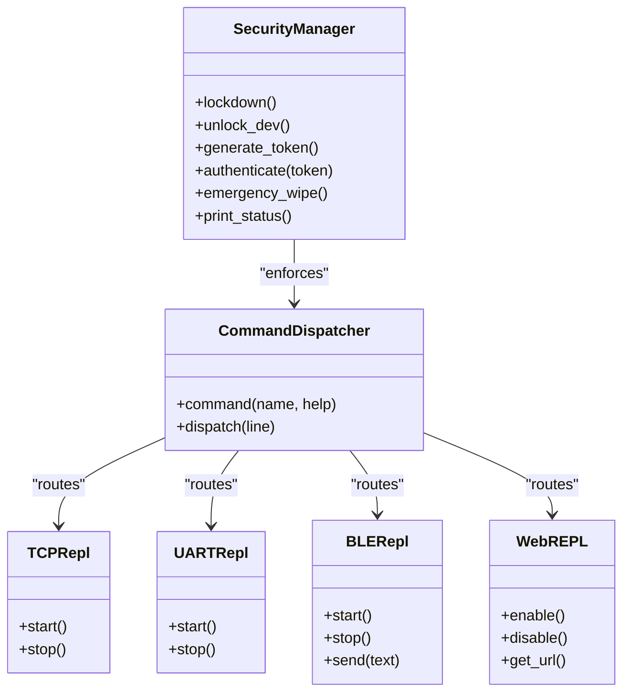
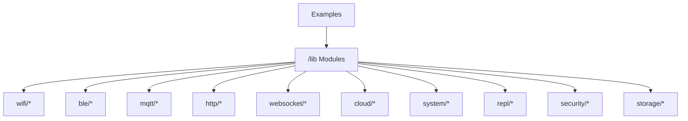

# Advanced Examples

<cite>
**Referenced Files in This Document**
- [README.md](file://src/lib/README.md)
- [README_BLE_MODULE.md](file://src/main/README_BLE_MODULE.md)
- [ble_example.py](file://src/main/examples/ble_example.py)
- [wifi_example.py](file://src/main/examples/wifi_example.py)
- [mqtt_example.py](file://src/main/examples/mqtt_example.py)
- [http_example.py](file://src/main/examples/http_example.py)
- [repl_example.py](file://src/main/examples/repl_example.py)
- [system_example.py](file://src/main/examples/system_example.py)
- [cloud_example.py](file://src/main/examples/cloud_example.py)
- [secure_production_example.py](file://src/main/examples/secure_production_example.py)
- [boot_production.py](file://src/main/boot_production.py)
- [storage_example.py](file://src/main/examples/storage_example.py)
- [device.cfg](file://src/device.cfg)
</cite>

## Table of Contents
1. [Introduction](#introduction)
2. [Project Structure](#project-structure)
3. [Core Components](#core-components)
4. [Architecture Overview](#architecture-overview)
5. [Detailed Component Analysis](#detailed-component-analysis)
6. [Dependency Analysis](#dependency-analysis)
7. [Performance Considerations](#performance-considerations)
8. [Troubleshooting Guide](#troubleshooting-guide)
9. [Conclusion](#conclusion)
10. [Appendices](#appendices)

## Introduction
This document presents advanced, production-ready examples for the ESP32-C3 framework. It focuses on sophisticated integration patterns across:
- BLE communication (GATT services, peripherals, and client/server coordination)
- MQTT client/server with topic management and message handling
- HTTP client/server with REST API integration
- WebSocket communication patterns for real-time data exchange
- Cloud platform integrations (ThingsBoard, Adafruit IO, AWS IoT)
- System utilities (OTA updates, RTC synchronization, power management)
- REPL security for remote command execution

It also provides architectural insights, error handling strategies, and scalability considerations for enterprise-grade deployments.

## Project Structure
The repository organizes functionality by domain under src/lib and demonstrates usage in src/main/examples. The examples consistently prepend /lib to sys.path to import modules, ensuring portability across environments.

**Diagram sources**
- [README.md:24-41](file://src/lib/README.md#L24-L41)
- [ble_example.py:10](file://src/main/examples/ble_example.py#L10)
- [wifi_example.py:10](file://src/main/examples/wifi_example.py#L10)
- [mqtt_example.py:9](file://src/main/examples/mqtt_example.py#L9)
- [http_example.py:8](file://src/main/examples/http_example.py#L8)
- [repl_example.py:20](file://src/main/examples/repl_example.py#L20)
- [system_example.py:8](file://src/main/examples/system_example.py#L8)
- [cloud_example.py:8](file://src/main/examples/cloud_example.py#L8)
- [secure_production_example.py:26](file://src/main/examples/secure_production_example.py#L26)

**Section sources**
- [README.md:1-72](file://src/lib/README.md#L1-L72)

## Core Components
- BLE: GATT server/client, BLE UART, sensor streaming, callbacks, iBeacon, and combined BLE+WiFi operation.
- WiFi: Connection management, keep-alive monitoring, scanning, portal configuration, and multi-task coordination.
- MQTT: Client connectivity, subscription, publishing, and message loop.
- HTTP: Client GET request and server routing skeleton.
- WebSocket: Client/server foundation (module present in lib).
- Cloud: ThingsBoard, Adafruit IO, Blynk, Firebase, AWS IoT (module present in lib).
- System: SysInfo, RTC, OTA updater, deep sleep, watchdog.
- REPL: CommandDispatcher, TCP, UART, BLE, and WebREPL transports; multi-transport coordination.
- Security: SecretStore, token auth, audit logging, emergency wipe, lockdown, and boot protection.
- Storage: JSON config manager, file logger, and SD card manager.

**Section sources**
- [README.md:9-20](file://src/lib/README.md#L9-L20)
- [README_BLE_MODULE.md:120-288](file://src/main/README_BLE_MODULE.md#L120-L288)
- [ble_example.py:14-408](file://src/main/examples/ble_example.py#L14-L408)
- [wifi_example.py:14-338](file://src/main/examples/wifi_example.py#L14-L338)
- [mqtt_example.py:12-40](file://src/main/examples/mqtt_example.py#L12-L40)
- [http_example.py:12-43](file://src/main/examples/http_example.py#L12-L43)
- [repl_example.py:31-392](file://src/main/examples/repl_example.py#L31-L392)
- [system_example.py:15-43](file://src/main/examples/system_example.py#L15-L43)
- [cloud_example.py:15-60](file://src/main/examples/cloud_example.py#L15-L60)
- [secure_production_example.py:20-268](file://src/main/examples/secure_production_example.py#L20-L268)
- [storage_example.py:10-63](file://src/main/examples/storage_example.py#L10-L63)

## Architecture Overview
The examples demonstrate layered integration:
- Transport layer: WiFi and BLE provide connectivity.
- Application layer: REPL, HTTP, MQTT, and cloud clients operate concurrently.
- System layer: OTA, RTC, and power management support long-running deployments.
- Security layer: Boot lockdown, token auth, audit logging, and secret storage protect production devices.

**Diagram sources**
- [wifi_example.py:14-338](file://src/main/examples/wifi_example.py#L14-L338)
- [ble_example.py:14-408](file://src/main/examples/ble_example.py#L14-L408)
- [repl_example.py:31-392](file://src/main/examples/repl_example.py#L31-L392)
- [mqtt_example.py:12-40](file://src/main/examples/mqtt_example.py#L12-L40)
- [http_example.py:12-43](file://src/main/examples/http_example.py#L12-L43)
- [system_example.py:15-43](file://src/main/examples/system_example.py#L15-L43)
- [secure_production_example.py:20-268](file://src/main/examples/secure_production_example.py#L20-L268)
- [boot_production.py:22-56](file://src/main/boot_production.py#L22-L56)

## Detailed Component Analysis

### BLE Communication Patterns
This section covers GATT services, peripherals, callbacks, and multi-transport BLE+WiFi.

**Diagram sources**
- [README_BLE_MODULE.md:122-288](file://src/main/README_BLE_MODULE.md#L122-L288)
- [ble_example.py:14-408](file://src/main/examples/ble_example.py#L14-L408)

Key patterns:
- Basic GATT server with periodic status and notifications.
- BLE UART echo and bidirectional messaging.
- Sensor streaming with simulated ADC values and periodic updates.
- Callback-driven control (connect/disconnect/write/read).
- Combined BLE+WiFi with concurrent tasks and keep-alive monitoring.
- LED control via BLE characteristics.
- iBeacon broadcasting and GATT client discovery scaffolding.

Integration tips:
- Use callbacks for decoupled event handling.
- Stream sensor data at intervals aligned to client notification windows.
- Coordinate BLE advertising and WiFi keep-alive to avoid contention.

**Section sources**
- [README_BLE_MODULE.md:120-445](file://src/main/README_BLE_MODULE.md#L120-L445)
- [ble_example.py:14-408](file://src/main/examples/ble_example.py#L14-L408)

### MQTT Client/Server Implementation
The example demonstrates a lightweight MQTT client with subscription and publish loops.

**Diagram sources**
- [mqtt_example.py:12-40](file://src/main/examples/mqtt_example.py#L12-L40)

Production strategies:
- Implement reconnection with exponential backoff.
- Use QoS 1/2 selectively for critical telemetry.
- Employ topic hygiene and hierarchical naming for scalability.

**Section sources**
- [mqtt_example.py:12-40](file://src/main/examples/mqtt_example.py#L12-L40)

### HTTP Client/Server with REST API Integration
The example shows a GET request and outlines server-side routing.

**Diagram sources**
- [http_example.py:12-43](file://src/main/examples/http_example.py#L12-L43)

REST integration patterns:
- Use route decorators for server endpoints.
- Return structured JSON for APIs.
- Apply middleware-like handlers for auth and CORS.

**Section sources**
- [http_example.py:12-43](file://src/main/examples/http_example.py#L12-L43)

### WebSocket Communication Patterns
The lib includes WebSocket client/server modules. Typical patterns:
- Client connects, upgrades, exchanges frames, and handles ping/pong.
- Server validates handshake, manages sessions, and broadcasts to clients.

[No sources needed since this section doesn't analyze specific files]

### Cloud Platform Integrations
Available cloud clients include ThingsBoard, Adafruit IO, Blynk, Firebase, and AWS IoT. The example outlines usage patterns.

**Diagram sources**
- [cloud_example.py:15-60](file://src/main/examples/cloud_example.py#L15-L60)

Enterprise considerations:
- TLS profiles and certificate management for AWS IoT.
- Rate limits and batching for telemetry.
- Shadow updates and device twins for reliable state sync.

**Section sources**
- [cloud_example.py:15-60](file://src/main/examples/cloud_example.py#L15-L60)

### System Utilities: OTA, RTC, Power Management
- SysInfo provides runtime metadata for diagnostics.
- RTCManager supports NTP synchronization after WiFi connectivity.
- OTAUpdater enables firmware updates from a remote URL.
- DeepSleepManager and WatchdogManager support power-aware designs.

**Diagram sources**
- [system_example.py:15-43](file://src/main/examples/system_example.py#L15-L43)

**Section sources**
- [system_example.py:15-43](file://src/main/examples/system_example.py#L15-L43)

### REPL Security for Remote Command Execution
The REPL ecosystem supports multiple transports and robust security controls.

**Diagram sources**
- [secure_production_example.py:20-268](file://src/main/examples/secure_production_example.py#L20-L268)
- [repl_example.py:31-392](file://src/main/examples/repl_example.py#L31-L392)

Boot lockdown pattern:
- Place a boot script that enforces lockdown unless an unlock pin is asserted.

**Section sources**
- [secure_production_example.py:20-268](file://src/main/examples/secure_production_example.py#L20-L268)
- [boot_production.py:22-56](file://src/main/boot_production.py#L22-L56)
- [repl_example.py:31-392](file://src/main/examples/repl_example.py#L31-L392)

### Storage Utilities
- JSON configuration manager for persistent settings.
- File logger with rotation and levels.
- SD card manager for external storage.

**Section sources**
- [storage_example.py:10-63](file://src/main/examples/storage_example.py#L10-L63)

## Dependency Analysis
The examples depend on the modular libraries under /lib. They consistently import modules using sys.path manipulation to load from /lib.

**Diagram sources**
- [README.md:24-41](file://src/lib/README.md#L24-L41)

**Section sources**
- [README.md:24-41](file://src/lib/README.md#L24-L41)

## Performance Considerations
- BLE
  - Minimize advertised services and characteristics to reduce memory and radio overhead.
  - Tune advertising interval and connection parameters for latency vs. power trade-offs.
  - Batch sensor updates and use notify/indicate appropriately.
- WiFi
  - Use keep-alive with configurable intervals; back off on failures.
  - Prefer STA mode for predictable throughput; AP mode for controlled access.
- MQTT
  - Use QoS 1 for reliable delivery; batch messages to reduce overhead.
  - Implement exponential backoff and jitter for reconnection.
- HTTP/WebSocket
  - Set timeouts and chunked transfer for large payloads.
  - Use compression for JSON where appropriate.
- Cloud
  - Implement retry with backoff and circuit breaker.
  - Batch telemetry and de-duplicate events.
- System
  - Schedule OTA during maintenance windows; validate checksums.
  - Use RTC for time-based scheduling; deep sleep for idle power reduction.
- Security
  - Enforce token auth and audit logs; rotate tokens periodically.
  - Use encrypted secret stores and wipe on compromise.

[No sources needed since this section provides general guidance]

## Troubleshooting Guide
- BLE
  - Verify MicroPython supports the bluetooth module and firmware version.
  - Ensure advertising continues until connected; check distance and interference.
  - Validate characteristic handles and callback registration.
- WiFi
  - Confirm SSID/password correctness; check signal strength and router capacity.
  - Use keep-alive to recover from transient disconnections.
- MQTT
  - Validate broker reachability and credentials; confirm topic permissions.
  - Inspect QoS and retained message behavior.
- HTTP
  - Check DNS resolution and firewall rules; verify endpoint availability.
- Cloud
  - Validate certificates and policies for AWS IoT; test token scopes.
- System
  - Monitor free heap and fragmentation; schedule OTA carefully.
- Security
  - Review audit logs for repeated failures; revoke compromised tokens.

**Section sources**
- [README_BLE_MODULE.md:456-477](file://src/main/README_BLE_MODULE.md#L456-L477)
- [wifi_example.py:287-302](file://src/main/examples/wifi_example.py#L287-L302)
- [mqtt_example.py:28-36](file://src/main/examples/mqtt_example.py#L28-L36)
- [http_example.py:14-19](file://src/main/examples/http_example.py#L14-L19)
- [secure_production_example.py:115-151](file://src/main/examples/secure_production_example.py#L115-L151)

## Conclusion
These advanced examples demonstrate a cohesive, production-ready architecture for ESP32-C3 applications. By combining BLE, WiFi, MQTT, HTTP/WebSocket, and cloud integrations with robust system utilities and strong security controls, teams can build scalable, maintainable, and secure IoT solutions. Adopt the integration patterns, performance strategies, and operational practices outlined here to accelerate enterprise-grade deployments.

[No sources needed since this section summarizes without analyzing specific files]

## Appendices

### Example Index and Paths
- BLE
  - [Basic Server:14-59](file://src/main/examples/ble_example.py#L14-L59)
  - [BLE UART:62-94](file://src/main/examples/ble_example.py#L62-L94)
  - [Sensor Streaming:97-155](file://src/main/examples/ble_example.py#L97-L155)
  - [Callbacks:158-206](file://src/main/examples/ble_example.py#L158-L206)
  - [BLE + WiFi:209-278](file://src/main/examples/ble_example.py#L209-L278)
  - [Control LED:281-338](file://src/main/examples/ble_example.py#L281-L338)
  - [iBeacon:341-366](file://src/main/examples/ble_example.py#L341-L366)
  - [GATT Client:370-394](file://src/main/examples/ble_example.py#L370-L394)
- WiFi
  - [Basic Connect:14-37](file://src/main/examples/wifi_example.py#L14-L37)
  - [Direct Connect:40-58](file://src/main/examples/wifi_example.py#L40-L58)
  - [Keep-Alive:60-90](file://src/main/examples/wifi_example.py#L60-L90)
  - [Scan & Connect:93-120](file://src/main/examples/wifi_example.py#L93-L120)
  - [Cooperative Tasks:123-180](file://src/main/examples/wifi_example.py#L123-L180)
  - [Multiple Configs:183-220](file://src/main/examples/wifi_example.py#L183-L220)
  - [HTTP Over WiFi:223-264](file://src/main/examples/wifi_example.py#L223-L264)
  - [Status Monitor:267-302](file://src/main/examples/wifi_example.py#L267-L302)
  - [WiFi Portal:305-321](file://src/main/examples/wifi_example.py#L305-L321)
- MQTT
  - [Client Example:12-40](file://src/main/examples/mqtt_example.py#L12-L40)
- HTTP
  - [Client Example:12-43](file://src/main/examples/http_example.py#L12-L43)
- REPL
  - [Basic Dispatcher:31-76](file://src/main/examples/repl_example.py#L31-L76)
  - [TCP REPL:82-141](file://src/main/examples/repl_example.py#L82-L141)
  - [TCP with Password:143-165](file://src/main/examples/repl_example.py#L143-L165)
  - [UART REPL:171-241](file://src/main/examples/repl_example.py#L171-L241)
  - [BLE REPL:247-299](file://src/main/examples/repl_example.py#L247-L299)
  - [Multi-Transport:305-383](file://src/main/examples/repl_example.py#L305-L383)
- System
  - [SysInfo/RTC/OTA:15-43](file://src/main/examples/system_example.py#L15-L43)
- Cloud
  - [Cloud Integrations:15-60](file://src/main/examples/cloud_example.py#L15-L60)
- Security
  - [Production Security:20-268](file://src/main/examples/secure_production_example.py#L20-L268)
  - [Boot Lockdown:22-56](file://src/main/boot_production.py#L22-L56)
- Storage
  - [Config/Logger/SD:10-63](file://src/main/examples/storage_example.py#L10-L63)

**Section sources**
- [ble_example.py:14-408](file://src/main/examples/ble_example.py#L14-L408)
- [wifi_example.py:14-338](file://src/main/examples/wifi_example.py#L14-L338)
- [mqtt_example.py:12-40](file://src/main/examples/mqtt_example.py#L12-L40)
- [http_example.py:12-43](file://src/main/examples/http_example.py#L12-L43)
- [repl_example.py:31-392](file://src/main/examples/repl_example.py#L31-L392)
- [system_example.py:15-43](file://src/main/examples/system_example.py#L15-L43)
- [cloud_example.py:15-60](file://src/main/examples/cloud_example.py#L15-L60)
- [secure_production_example.py:20-268](file://src/main/examples/secure_production_example.py#L20-L268)
- [boot_production.py:22-56](file://src/main/boot_production.py#L22-L56)
- [storage_example.py:10-63](file://src/main/examples/storage_example.py#L10-L63)

### Device Configuration
- Device settings and deployment paths for MicroPython Studio.

**Section sources**
- [device.cfg:1-16](file://src/device.cfg#L1-L16)