# Basic Examples

<cite>
**Referenced Files in This Document**
- [README.md](file://src/main/examples/README.md)
- [wifi_example.py](file://src/main/examples/wifi_example.py)
- [sensors_example.py](file://src/main/examples/sensors_example.py)
- [display_example.py](file://src/main/examples/display_example.py)
- [input_example.py](file://src/main/examples/input_example.py)
- [output_example.py](file://src/main/examples/output_example.py)
- [storage_example.py](file://src/main/examples/storage_example.py)
- [button_advanced_example.py](file://src/main/examples/button_advanced_example.py)
- [buzzer_patterns_example.py](file://src/main/examples/buzzer_patterns_example.py)
- [i2c_pwm_pin_example.py](file://src/main/examples/i2c_pwm_pin_example.py)
- [uart_adc_spi_example.py](file://src/main/examples/uart_adc_spi_example.py)
- [lib/README.md](file://src/lib/README.md)
- [display/README.md](file://src/lib/display/README.md)
- [input/README.md](file://src/lib/input/README.md)
- [List_module.md](file://src/List_module.md)
- [device.cfg](file://src/device.cfg)
</cite>

## Table of Contents
1. [Introduction](#introduction)
2. [Project Structure](#project-structure)
3. [Core Components](#core-components)
4. [Architecture Overview](#architecture-overview)
5. [Detailed Component Analysis](#detailed-component-analysis)
6. [Dependency Analysis](#dependency-analysis)
7. [Performance Considerations](#performance-considerations)
8. [Troubleshooting Guide](#troubleshooting-guide)
9. [Conclusion](#conclusion)
10. [Appendices](#appendices)

## Introduction
This document presents a comprehensive, beginner-friendly guide to the ESP32-C3 MicroPython framework’s basic examples. It organizes practical usage patterns by increasing complexity, covering:
- WiFi connectivity (STA/AP modes, captive portal)
- Sensor reading (DHT, BMP280, DS18B20, MPU6050, HC-SR04, ADS1115, MAX30102, LDR, soil, PIR, RCWL-0516, MQ gas, INA219, OH49E, PZEM, GPS, battery monitor)
- Display output (OLED SSD1306, TFT ILI9341/ST7789, LCD I2C, LED matrix MAX7219, E-paper, P10 panels, TJC HMI)
- Input handling (buttons, rotary encoders, keypads, joysticks; plus advanced features like long press, multi-click, pattern recognition)
- Output control (NeoPixels, servo, DC motors, steppers, relays, buzzers, PWM LEDs)
- Storage (JSON configuration, file logging, SD card)
- Foundation wrappers (UART, ADC, SPI) and core peripherals (I2C, PWM, digital pin)

Each example includes step-by-step instructions, expected outputs, wiring guidance, and troubleshooting tips to help you build confidence progressively.

## Project Structure
The examples are organized under the main examples directory and grouped by functional categories. The library documentation describes supported modules and recommended usage order.

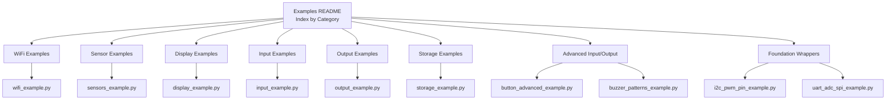

**Diagram sources**
- [README.md:10-42](file://src/main/examples/README.md#L10-L42)
- [wifi_example.py:1-338](file://src/main/examples/wifi_example.py#L1-L338)
- [sensors_example.py:1-529](file://src/main/examples/sensors_example.py#L1-L529)
- [display_example.py:1-240](file://src/main/examples/display_example.py#L1-L240)
- [input_example.py:1-88](file://src/main/examples/input_example.py#L1-L88)
- [output_example.py:1-251](file://src/main/examples/output_example.py#L1-L251)
- [storage_example.py:1-63](file://src/main/examples/storage_example.py#L1-L63)
- [button_advanced_example.py:1-321](file://src/main/examples/button_advanced_example.py#L1-L321)
- [buzzer_patterns_example.py:1-180](file://src/main/examples/buzzer_patterns_example.py#L1-L180)
- [i2c_pwm_pin_example.py:1-364](file://src/main/examples/i2c_pwm_pin_example.py#L1-L364)
- [uart_adc_spi_example.py:1-264](file://src/main/examples/uart_adc_spi_example.py#L1-L264)

**Section sources**
- [README.md:10-42](file://src/main/examples/README.md#L10-L42)
- [lib/README.md:22-51](file://src/lib/README.md#L22-L51)

## Core Components
This section highlights the foundational building blocks demonstrated across the examples.

- WiFi connectivity: WiFiManager supports saving/loading credentials, connecting with timeouts, keep-alive monitoring, scanning networks, concurrent tasks, multiple configurations, HTTP requests, status monitoring, and captive portal mode.
- Sensors: DHT, BMP280/BME280, DS18B20, MPU6050, HC-SR04, ADS1115, MAX30102, LDR, soil moisture, PIR, RCWL-0516, MQ gas, INA219, OH49E, PZEM004T(v1/v2/v3), GPS, and battery monitor drivers.
- Displays: SSD1306 OLED (I2C/SPI), ILI9341 TFT (SPI), ST7789 TFT (SPI), LCD I2C (via PCF8574), MAX7219 LED matrix (SPI), E-paper (SPI), P10 LED panels, and TJC HMI (UART).
- Inputs: Push buttons, rotary encoders, matrix keypads, analog joysticks; plus advanced features like long press, multi-click detection, pattern recognition, and async watching.
- Outputs: NeoPixels (WS2812B), servo, DC motors, steppers, relays, buzzers (active/passive), and PWM-controlled LEDs.
- Storage: JSON configuration manager, file logger, and SD card manager for mounting, listing, reading/writing text, and unmounting.
- Foundation wrappers: UART driver with framing and CRC utilities, ADC channel with averaging/smoothing/calibration, SPI driver and device abstraction, plus I2C bus scanning/register ops and shared-bus usage.

**Section sources**
- [wifi_example.py:14-338](file://src/main/examples/wifi_example.py#L14-L338)
- [sensors_example.py:31-529](file://src/main/examples/sensors_example.py#L31-L529)
- [display_example.py:14-240](file://src/main/examples/display_example.py#L14-L240)
- [input_example.py:12-88](file://src/main/examples/input_example.py#L12-L88)
- [output_example.py:14-251](file://src/main/examples/output_example.py#L14-L251)
- [storage_example.py:10-63](file://src/main/examples/storage_example.py#L10-L63)
- [i2c_pwm_pin_example.py:20-364](file://src/main/examples/i2c_pwm_pin_example.py#L20-L364)
- [uart_adc_spi_example.py:20-264](file://src/main/examples/uart_adc_spi_example.py#L20-L264)

## Architecture Overview
The examples demonstrate a layered approach:
- Application layer: example scripts orchestrate modules and tasks.
- Library layer: modules under lib/ provide device drivers and utilities.
- Hardware layer: sensors, displays, actuators, and communication peripherals.

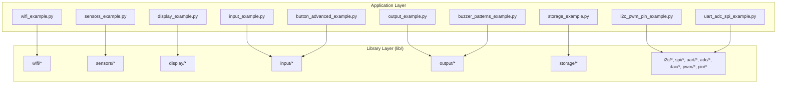

**Diagram sources**
- [lib/README.md:9-21](file://src/lib/README.md#L9-L21)
- [wifi_example.py:10](file://src/main/examples/wifi_example.py#L10)
- [sensors_example.py:10-27](file://src/main/examples/sensors_example.py#L10-L27)
- [display_example.py:15-131](file://src/main/examples/display_example.py#L15-L141)
- [input_example.py:13-69](file://src/main/examples/input_example.py#L13-L74)
- [output_example.py:15-227](file://src/main/examples/output_example.py#L15-L227)
- [storage_example.py:11-52](file://src/main/examples/storage_example.py#L11-L52)
- [i2c_pwm_pin_example.py:26-144](file://src/main/examples/i2c_pwm_pin_example.py#L26-L144)
- [uart_adc_spi_example.py:26-144](file://src/main/examples/uart_adc_spi_example.py#L26-L144)

## Detailed Component Analysis

### WiFi Connectivity Examples
This section covers STA and AP scenarios, keep-alive monitoring, scanning, concurrent tasks, multiple configs, HTTP requests, status monitoring, and captive portal.

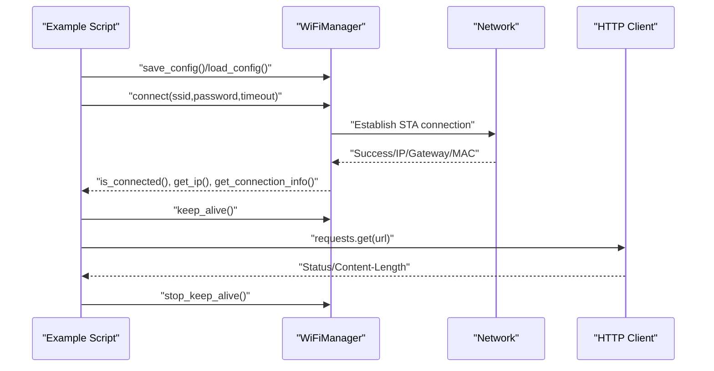

**Diagram sources**
- [wifi_example.py:14-338](file://src/main/examples/wifi_example.py#L14-L338)

Key steps:
- Save credentials once, then connect silently or connect directly with provided SSID/password.
- Enable keep-alive to monitor and auto-recover connection drops.
- Scan networks and select the strongest; optionally integrate with HTTP requests.
- Run WiFi alongside other asyncio tasks and switch between multiple profiles.
- Monitor status periodically and open a captive portal for initial setup.

Expected outputs:
- Successful IP acquisition and connection info.
- Continuous keep-alive status updates.
- HTTP response status and content length.
- Captive portal web interface for configuration.

Wiring and setup:
- No external hardware required for WiFi; ensure correct SSID/password and antenna connectivity.

Troubleshooting:
- If connection fails, verify credentials and network availability.
- Use status monitor to inspect RSSI, gateway, and MAC.
- For portal mode, ensure AP SSID/password are set and reachable.

**Section sources**
- [wifi_example.py:14-338](file://src/main/examples/wifi_example.py#L14-L338)

### Sensor Reading Demonstrations
This section showcases reading from multiple sensors via I2C, SPI, UART, and ADC.

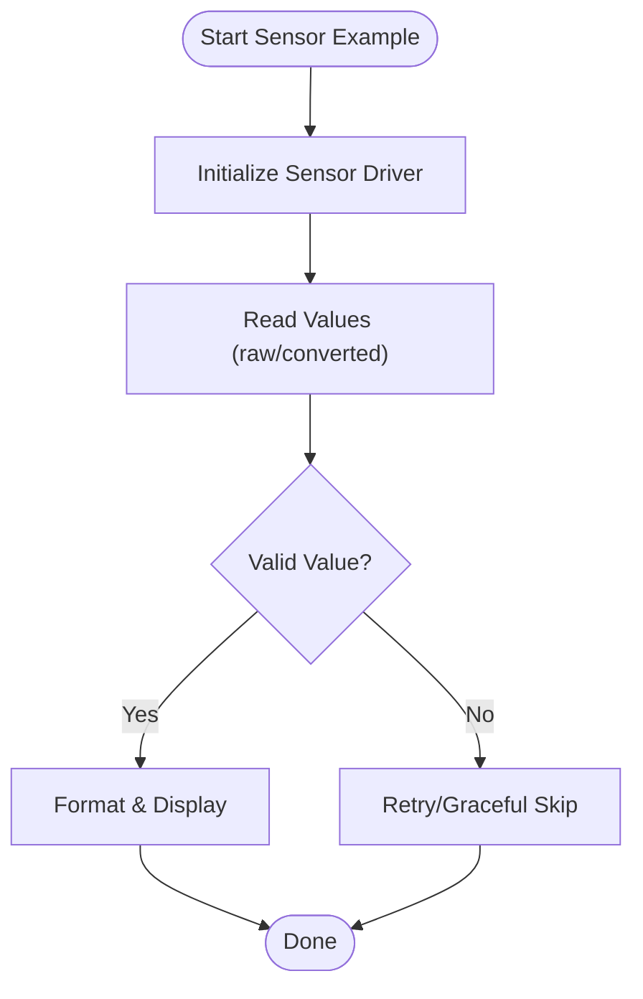

**Diagram sources**
- [sensors_example.py:31-529](file://src/main/examples/sensors_example.py#L31-L529)

Examples covered:
- DHT22 temperature/humidity
- BMP280/BME280 temperature/pressure/humidity
- DS18B20 1-Wire temperature
- MPU-6050 accelerometer/gyroscope
- HC-SR04 ultrasonic distance
- ADS1115 16-bit ADC channels
- MAX30102 heart rate/spO2
- LDR light sensor
- Soil moisture sensor
- PIR and RCWL-0516 motion detection
- MQ gas sensors (LPG/CO ratios)
- INA219 power/current/voltage monitor
- OH49E Hall effect sensor
- PZEM-004T v1/v2/v3 AC measurements
- GPS NMEA and battery monitor

Expected outputs:
- Human-readable values with units.
- Optional async monitoring and callbacks for continuous data.

Wiring and setup:
- Use appropriate I2C addresses, pull-ups, and voltage levels.
- For ADC sensors, ensure proper calibration and range mapping.

Troubleshooting:
- If values are invalid, check wiring, pull-ups, and device presence.
- For I2C devices, use bus scanning to confirm addresses.

**Section sources**
- [sensors_example.py:31-529](file://src/main/examples/sensors_example.py#L31-L529)

### Display Output Tutorials
This section demonstrates outputting data to various displays using I2C, SPI, or UART.

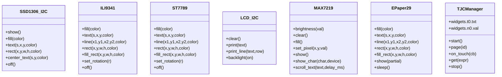

**Diagram sources**
- [display_example.py:14-240](file://src/main/examples/display_example.py#L14-L240)
- [display/README.md:32-800](file://src/lib/display/README.md#L32-L800)

Examples covered:
- SSD1306 OLED (I2C/SPI) with text, shapes, and centering.
- ILI9341 TFT (SPI) with color and graphics primitives.
- ST7789 TFT (SPI) with rotation and scaling.
- LCD I2C (PCF8574) with backlight control and scrolling.
- MAX7219 LED matrix with brightness, characters, and scrolling text.
- E-paper 2.9" with partial/full updates and sleep.
- TJC HMI (UART) with page control, widget attributes, and callbacks.
- P10 LED panels (monochrome and RGB) with text and graphics.

Expected outputs:
- Visual feedback on each display type with formatted data.
- Smooth animations and real-time updates where applicable.

Wiring and setup:
- Follow pin assignments for each interface (I2C, SPI, UART).
- Ensure correct voltage levels and pull-ups where required.

Troubleshooting:
- If display does not show anything, verify constructor parameters and wiring.
- For SPI devices, confirm CS/DC/RST pins and SPI speed.

**Section sources**
- [display_example.py:14-240](file://src/main/examples/display_example.py#L14-L240)
- [display/README.md:32-800](file://src/lib/display/README.md#L32-L800)

### Input Handling Examples
This section covers push buttons, rotary encoders, keypads, joysticks, and advanced features.

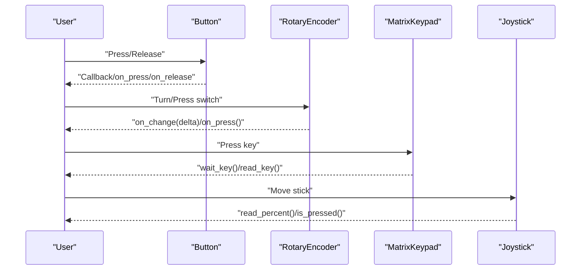

**Diagram sources**
- [input_example.py:12-88](file://src/main/examples/input_example.py#L12-L88)
- [input/README.md:33-553](file://src/lib/input/README.md#L33-L553)

Examples covered:
- Basic button press/release with debounce.
- Rotary encoder position tracking and switch handling.
- Matrix keypad key scanning and async waiting.
- Joystick analog axes and switch detection.
- Advanced button features: long press, multi-click, duration tracking, pattern recognition, and async watch.

Expected outputs:
- Immediate callbacks for press/release and encoder changes.
- Keypad key events and joystick normalized values.
- Advanced button patterns recognized and timed durations reported.

Wiring and setup:
- Use pull-up/pull-down resistors as configured.
- Ensure proper grounding and avoid noisy environments.

Troubleshooting:
- If buttons bounce, adjust debounce_ms.
- For touch, note that ESP32-C3/C6 lacks capacitive touch pads.

**Section sources**
- [input_example.py:12-88](file://src/main/examples/input_example.py#L12-L88)
- [input/README.md:33-553](file://src/lib/input/README.md#L33-L553)

### Output Control Examples
This section demonstrates controlling LEDs, motors, and audio.

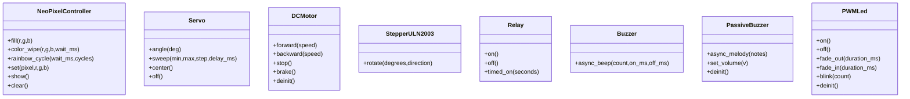

**Diagram sources**
- [output_example.py:14-251](file://src/main/examples/output_example.py#L14-L251)

Examples covered:
- NeoPixels with wipes, rainbow cycles, and HSV mapping.
- Servo angle control and sweeping.
- DC motor forward/backward/stop/brake.
- Stepper motor rotation with half/full stepping.
- Relay on/off and timed operations.
- Active and passive buzzer patterns and melodies.
- PWM LEDs with fade and blink.

Expected outputs:
- Smooth LED fades, colorful NeoPixel effects, precise servo positioning, controlled motor movement, rhythmic buzzer patterns, and steady relay switching.

Wiring and setup:
- Use appropriate current-limiting resistors for LEDs.
- Ensure motor supply matches driver ratings.
- For buzzers, choose active/passive based on waveform needs.

Troubleshooting:
- If servo jitter occurs, verify power and signal quality.
- For steppers, confirm step/direction wiring and microstepping settings.

**Section sources**
- [output_example.py:14-251](file://src/main/examples/output_example.py#L14-L251)

### Storage Examples
This section covers configuration management, logging, and SD card operations.

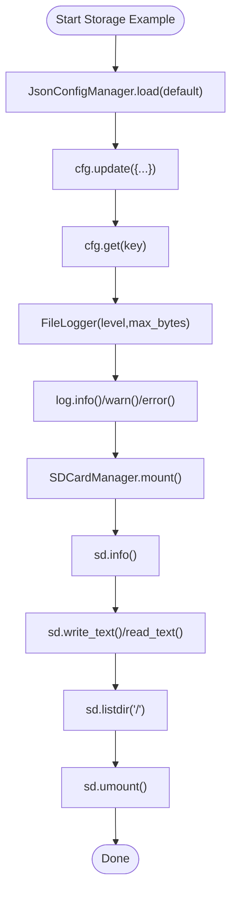

**Diagram sources**
- [storage_example.py:10-63](file://src/main/examples/storage_example.py#L10-L63)

Examples covered:
- JSON configuration manager for persistent settings.
- File logger with rotation and multiple levels.
- SD card manager for filesystem operations.

Expected outputs:
- Configuration loaded and updated.
- Log files written with timestamps and levels.
- SD card mounted, files listed, and text read/written.

Wiring and setup:
- SD card requires SPI pins and CS; ensure correct wiring.
- Mount point and permissions are handled by the manager.

Troubleshooting:
- If SD mount fails, verify SPI pins and card presence.
- For logs, check file sizes and rotation thresholds.

**Section sources**
- [storage_example.py:10-63](file://src/main/examples/storage_example.py#L10-L63)

### Foundation Wrappers: UART, ADC, SPI
These examples demonstrate generic drivers and advanced usage patterns.

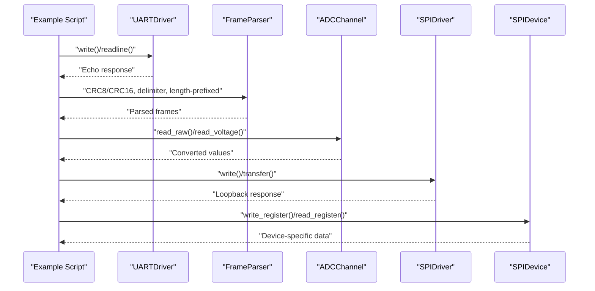

**Diagram sources**
- [uart_adc_spi_example.py:20-264](file://src/main/examples/uart_adc_spi_example.py#L20-L264)
- [i2c_pwm_pin_example.py:20-364](file://src/main/examples/i2c_pwm_pin_example.py#L20-L364)

Topics covered:
- UART echo test, frame parsing with CRC and delimiters, length-prefixed frames.
- ADC averaging, smoothing, threshold checks, and calibration.
- SPI basic transfers and per-device CS management with register operations.
- I2C bus scanning, register-level operations, and shared-bus usage.

Expected outputs:
- Verified frame integrity, averaged/smoothed ADC readings, and device register reads.

Wiring and setup:
- Use loopback jumpers for UART/SPI tests.
- For I2C, confirm addresses and pull-ups.

Troubleshooting:
- If CRC verification fails, recheck framing and byte order.
- For ADC, ensure correct calibration endpoints.

**Section sources**
- [uart_adc_spi_example.py:20-264](file://src/main/examples/uart_adc_spi_example.py#L20-L264)
- [i2c_pwm_pin_example.py:20-364](file://src/main/examples/i2c_pwm_pin_example.py#L20-L364)

### Advanced Input and Output Features
- Advanced button features: long press detection, multi-click recognition, duration tracking, pattern recognition, and async watch.
- Advanced buzzer features: pattern playback, Morse code, alarm sequences, melody repetition, and volume control.

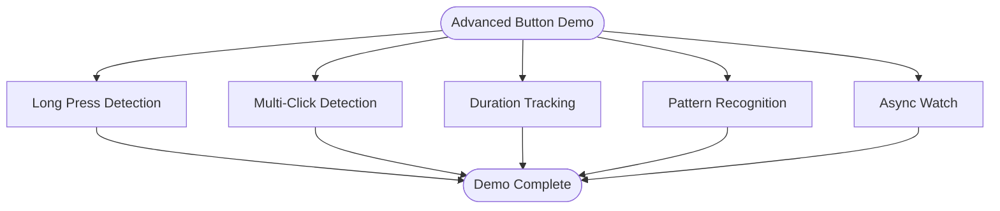

**Diagram sources**
- [button_advanced_example.py:19-321](file://src/main/examples/button_advanced_example.py#L19-L321)
- [buzzer_patterns_example.py:18-180](file://src/main/examples/buzzer_patterns_example.py#L18-L180)

Expected outputs:
- Recognized long presses, multi-click counts, measured durations, detected patterns, and async event handling.
- Buzzer patterns, Morse code, and melodies with configurable volumes.

Wiring and setup:
- Buttons require pull-up/pull-down resistors; encoders need pull-ups on CLK/DT.
- Buzzer wiring depends on active or passive type.

Troubleshooting:
- Adjust thresholds for long press and click windows.
- For buzzer, verify volume levels and note sequences.

**Section sources**
- [button_advanced_example.py:19-321](file://src/main/examples/button_advanced_example.py#L19-L321)
- [buzzer_patterns_example.py:18-180](file://src/main/examples/buzzer_patterns_example.py#L18-L180)

## Dependency Analysis
The examples depend on the library modules documented in the library overview and module list.

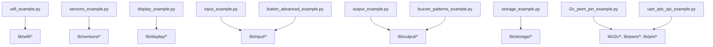

**Diagram sources**
- [lib/README.md:9-21](file://src/lib/README.md#L9-L21)
- [List_module.md:9-29](file://src/List_module.md#L9-L29)

**Section sources**
- [lib/README.md:9-21](file://src/lib/README.md#L9-L21)
- [List_module.md:9-29](file://src/List_module.md#L9-L29)

## Performance Considerations
- Prefer async patterns for concurrent tasks to avoid blocking the event loop.
- Use averaging/smoothing filters for noisy ADC readings.
- Optimize SPI/I2C speeds and CS management to reduce contention.
- Minimize display refresh rates for battery-powered projects.
- Use deep sleep and low-power modes for sensors and E-paper displays.

## Troubleshooting Guide
Common issues and resolutions:
- WiFi connection failures: verify credentials, check signal strength, and use status monitor to inspect IP and gateway.
- Sensor read errors: confirm I2C addresses, pull-ups, and device presence; retry after device warm-up.
- Display not updating: ensure show() is called after drawing; verify constructor parameters and wiring.
- Button bounce: increase debounce_ms; use IRQ-based callbacks for responsiveness.
- Motor jitter or servo instability: check power supply and signal integrity; verify load capacity.
- SD card mount failure: verify SPI pins and card orientation; check filesystem compatibility.
- UART/SPI loopback tests: use appropriate jumpers and confirm baudrates/spi speeds.

**Section sources**
- [wifi_example.py:266-302](file://src/main/examples/wifi_example.py#L266-L302)
- [sensors_example.py:31-529](file://src/main/examples/sensors_example.py#L31-L529)
- [display_example.py:14-240](file://src/main/examples/display_example.py#L14-L240)
- [input/README.md:544-553](file://src/lib/input/README.md#L544-L553)
- [storage_example.py:32-53](file://src/main/examples/storage_example.py#L32-L53)

## Conclusion
By progressing through the examples in this document—from WiFi connectivity and sensor reading to display output, input handling, output control, and storage—you will build a solid foundation in ESP32-C3 MicroPython. The examples emphasize practical usage, clear wiring guidance, and robust troubleshooting, enabling you to confidently develop IoT and embedded projects.

## Appendices

### Setup Instructions
- Install the ESP32-C3 MicroPython firmware and deploy the lib folder to the device flash.
- Upload example scripts to the device and run them via REPL or import in your project.
- Use the provided wiring diagrams and pin assignments for each peripheral.

**Section sources**
- [device.cfg:1-16](file://src/device.cfg#L1-L16)

### Wiring Diagrams
- SSD1306 OLED (I2C/SPI), ILI9341/ST7789 TFT, LCD I2C (PCF8574), MAX7219 LED matrix, E-paper, TJC HMI, P10 panels, and sensor breakout boards require specific pin mappings and voltage considerations.

**Section sources**
- [display/README.md:36-551](file://src/lib/display/README.md#L36-L551)
- [input/README.md:37-481](file://src/lib/input/README.md#L37-L481)