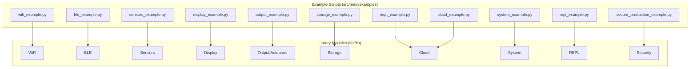
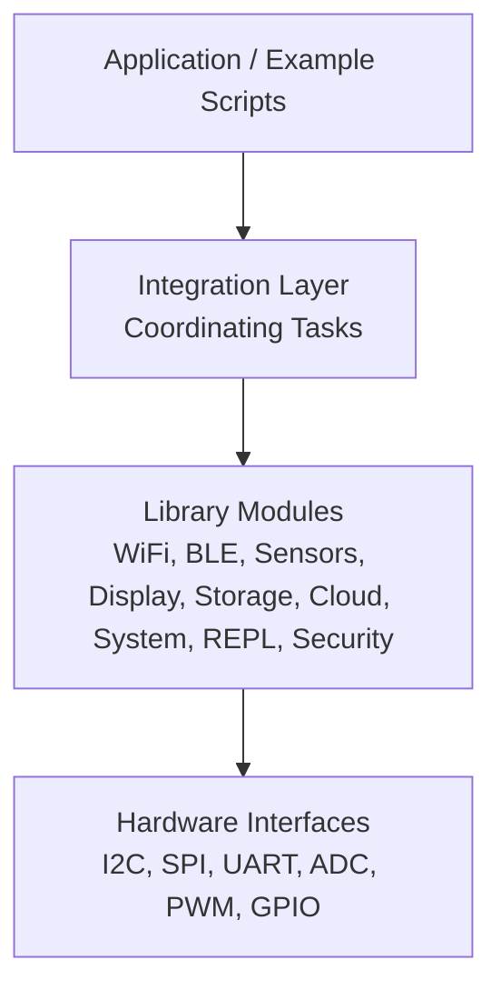
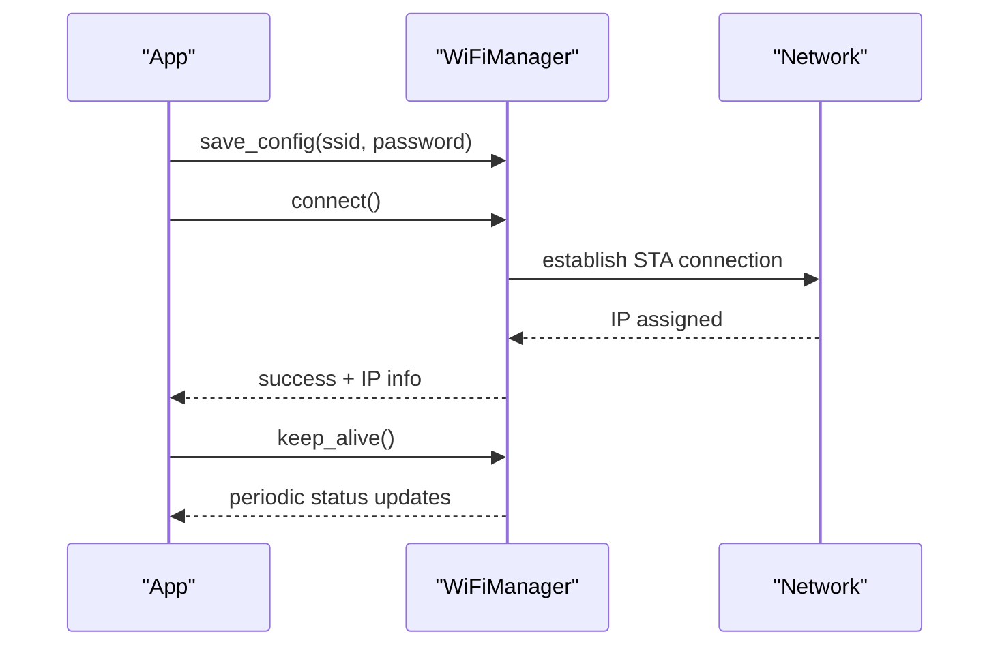
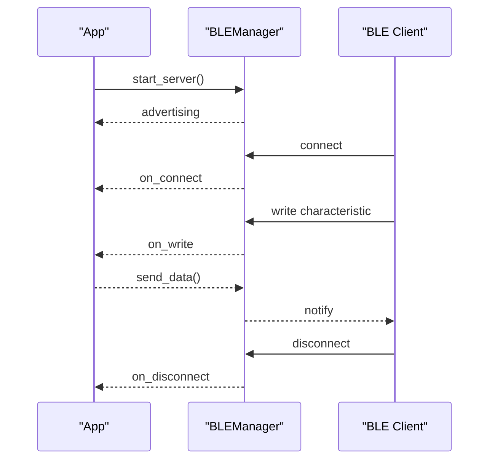
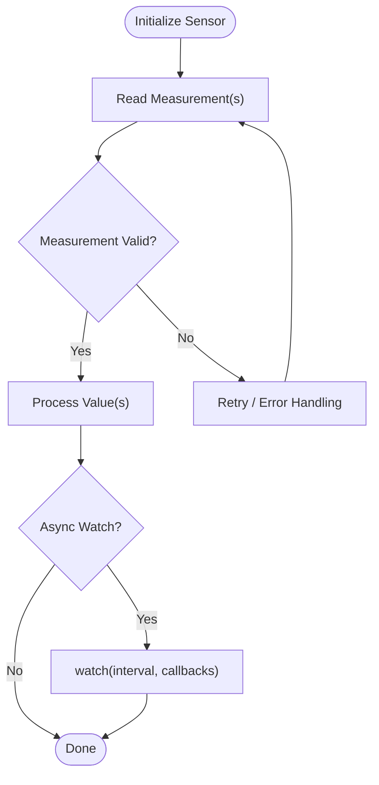
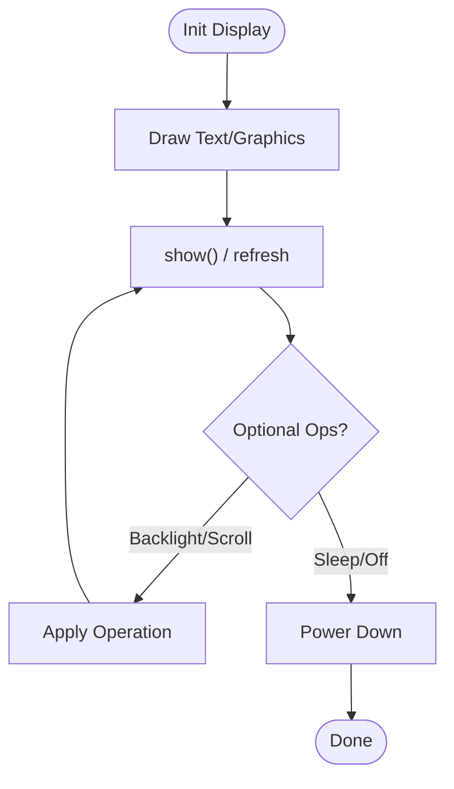
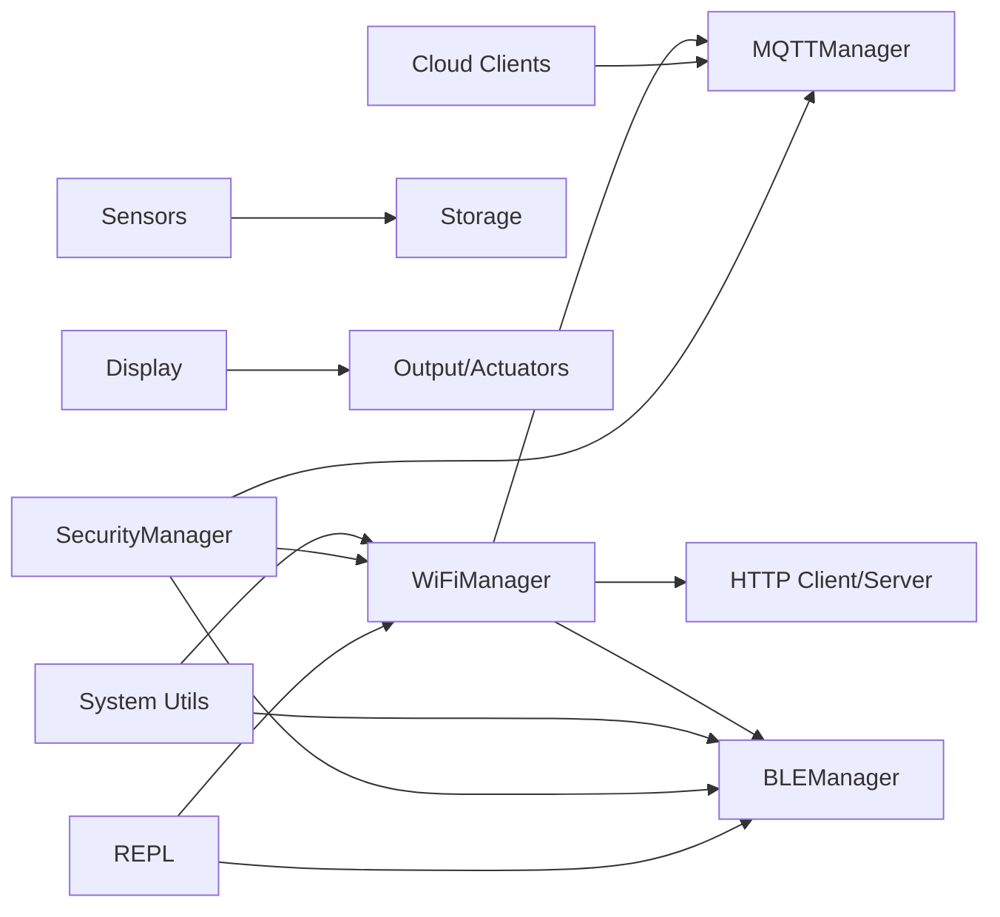

# Examples & Tutorials

<cite>
**Referenced Files in This Document**
- [README.md](file://src/main/examples/README.md)
- [README_WIFI_MODULE.md](file://src/main/README_WIFI_MODULE.md)
- [README_BLE_MODULE.md](file://src/main/README_BLE_MODULE.md)
- [README_ASYNCIO.md](file://src/main/README_ASYNCIO.md)
- [wifi_example.py](file://src/main/examples/wifi_example.py)
- [sensors_example.py](file://src/main/examples/sensors_example.py)
- [display_example.py](file://src/main/examples/display_example.py)
- [output_example.py](file://src/main/examples/output_example.py)
- [mqtt_example.py](file://src/main/examples/mqtt_example.py)
- [cloud_example.py](file://src/main/examples/cloud_example.py)
- [storage_example.py](file://src/main/examples/storage_example.py)
- [system_example.py](file://src/main/examples/system_example.py)
- [repl_example.py](file://src/main/examples/repl_example.py)
- [secure_production_example.py](file://src/main/examples/secure_production_example.py)
- [lib README.md](file://src/lib/README.md)
</cite>

## Table of Contents
1. [Introduction](#introduction)
2. [Project Structure](#project-structure)
3. [Core Components](#core-components)
4. [Architecture Overview](#architecture-overview)
5. [Detailed Component Analysis](#detailed-component-analysis)
6. [Dependency Analysis](#dependency-analysis)
7. [Performance Considerations](#performance-considerations)
8. [Troubleshooting Guide](#troubleshooting-guide)
9. [Conclusion](#conclusion)
10. [Appendices](#appendices)

## Introduction
This document provides comprehensive examples and tutorials for the ESP32-C3 MicroPython framework. It organizes learning paths from beginner-friendly introductions to expert-level integrations, covering:
- Basic examples: WiFi connectivity, sensor reading, and display output
- Advanced examples: multi-module integration and production deployment patterns
- Real-world scenarios: IoT gateways, weather stations, and home automation
Each tutorial includes step-by-step guidance, expected outcomes, and troubleshooting tips. Practical example projects are available under the examples directory, with detailed explanations of implementation choices and technical decisions.

## Project Structure
The repository is organized around a modular library and a rich set of examples:
- src/lib: reusable modules for WiFi, BLE, sensors, displays, outputs, storage, cloud, system utilities, and more
- src/main/examples: runnable example scripts demonstrating each module and cross-module workflows
- Additional documentation: module-specific READMEs for WiFi, BLE, and asyncio patterns

**Diagram sources**
- [README.md:1-403](file://src/main/examples/README.md#L1-L403)
- [lib README.md:1-72](file://src/lib/README.md#L1-L72)

**Section sources**
- [README.md:1-403](file://src/main/examples/README.md#L1-L403)
- [lib README.md:1-72](file://src/lib/README.md#L1-L72)

## Core Components
This section highlights the foundational building blocks and their roles in the framework:
- WiFi: connection management, keep-alive, scanning, and captive portal setup
- BLE: GATT server/client, UART service, sensor streaming, and concurrent operation with WiFi
- Sensors: 19+ drivers for environmental, structural, power, and safety monitoring
- Display: OLED, TFT, LCD, LED matrix, e-paper, and TJC HMI
- Output/Actuators: NeoPixels, servos, DC motors, steppers, relays, buzzers, PWM LEDs
- Storage: JSON config, file logging, and SD card management
- Cloud: MQTT and REST integrations with popular platforms
- System: system info, RTC, OTA updates
- REPL: command dispatchers and transports (TCP, UART, BLE, WebREPL)
- Security: lockdown, secrets storage, token auth, audit logging, emergency wipe

**Section sources**
- [lib README.md:1-72](file://src/lib/README.md#L1-L72)
- [README.md:1-403](file://src/main/examples/README.md#L1-L403)

## Architecture Overview
The framework follows a layered architecture:
- Application layer: example scripts and production applications
- Integration layer: orchestrating multiple modules (WiFi, BLE, sensors, display, storage)
- Library layer: reusable modules encapsulating hardware interfaces and protocols
- Hardware layer: peripherals and external devices

[No sources needed since this diagram shows conceptual architecture, not a direct code mapping]

## Detailed Component Analysis

### WiFi Connectivity Tutorial
Learn to connect ESP32-C3 to WiFi, manage connections, and integrate with other tasks.

- Prerequisites
  - MicroPython with asyncio support
  - WiFi credentials ready
- Steps
  - Initialize WiFiManager and save credentials once
  - Connect to WiFi and verify IP
  - Enable keep-alive to maintain connection
  - Combine with other tasks using asyncio.gather
  - Optional: use a captive portal for offline configuration
- Expected outputs
  - Successful IP acquisition and connection info
  - Continuous keep-alive monitoring
  - Coordinated task execution without blocking
- Troubleshooting
  - Incorrect SSID/password
  - Router unreachable or timeouts
  - Insufficient memory for concurrent tasks

**Diagram sources**
- [README_WIFI_MODULE.md:1-470](file://src/main/README_WIFI_MODULE.md#L1-L470)
- [wifi_example.py:1-338](file://src/main/examples/wifi_example.py#L1-L338)

**Section sources**
- [README_WIFI_MODULE.md:1-470](file://src/main/README_WIFI_MODULE.md#L1-L470)
- [wifi_example.py:1-338](file://src/main/examples/wifi_example.py#L1-L338)

### BLE Integration Tutorial
Explore BLE server, UART, sensor streaming, and concurrent operation with WiFi.

- Prerequisites
  - MicroPython with bluetooth module
  - BLE-capable device for testing
- Steps
  - Initialize BLEManager and start server
  - Register callbacks for connect/disconnect/write events
  - Use BLEUART for serial REPL over BLE
  - Stream sensor data via BLESensor
  - Run BLE alongside WiFi using asyncio.gather
- Expected outputs
  - Advertising and connected clients
  - UART echo and command responses
  - Sensor data notifications
  - Stable concurrent operation
- Troubleshooting
  - BLE module missing or firmware incompatible
  - Connection limits exceeded
  - Characteristic handles incorrect

**Diagram sources**
- [README_BLE_MODULE.md:1-526](file://src/main/README_BLE_MODULE.md#L1-L526)

**Section sources**
- [README_BLE_MODULE.md:1-526](file://src/main/README_BLE_MODULE.md#L1-L526)

### Sensor Reading Tutorial
Read from multiple sensors using dedicated drivers and combine measurements.

- Prerequisites
  - Proper wiring per sensor interface (I2C, SPI, GPIO, UART, ADC)
- Steps
  - Import specific sensor drivers
  - Initialize sensors with correct pins/address
  - Read single values or averaged/multiple samples
  - Use async watch patterns for continuous monitoring
- Expected outputs
  - Valid measurements (e.g., temperature, pressure, acceleration)
  - Median filtering for improved accuracy
  - Async callbacks for motion detection and alarms
- Troubleshooting
  - Wrong I2C address or pull-ups
  - ADC calibration for analog sensors
  - UART framing errors for Modbus-based sensors

**Diagram sources**
- [sensors_example.py:1-529](file://src/main/examples/sensors_example.py#L1-L529)

**Section sources**
- [sensors_example.py:1-529](file://src/main/examples/sensors_example.py#L1-L529)

### Display Output Tutorial
Render text, graphics, and interactive content on various display types.

- Prerequisites
  - Correct wiring for I2C/SPI interfaces
- Steps
  - Initialize display driver with appropriate pins
  - Draw text, shapes, and scroll content
  - For TJC HMI, configure pages and widgets via UART
- Expected outputs
  - Clear text and shapes on OLED/TFT/LCD
  - LED matrix scrolling and color fills
  - E-paper updates and sleep modes
- Troubleshooting
  - Incorrect pin assignments
  - SPI/I2C conflicts with other peripherals
  - TJC HMI protocol mismatches

**Diagram sources**
- [display_example.py:1-240](file://src/main/examples/display_example.py#L1-L240)

**Section sources**
- [display_example.py:1-240](file://src/main/examples/display_example.py#L1-L240)

### Output and Actuation Tutorial
Control LEDs, servos, motors, relays, buzzers, and steppers.

- Prerequisites
  - Proper load wiring and protection (current limiting, flyback diodes)
- Steps
  - Initialize actuators with correct pins
  - Drive animations (NeoPixel rainbow), sweeps (servo), and timed actions (relays)
  - Use PWM for dimming and precise control
- Expected outputs
  - Smooth fading and color transitions
  - Precise servo positioning and sweeping
  - Stepper rotation with direction control
- Troubleshooting
  - Servo power supply issues
  - Motor driver wiring mistakes
  - PWM frequency compatibility

**Section sources**
- [output_example.py:1-251](file://src/main/examples/output_example.py#L1-L251)

### MQTT and Cloud Integration Tutorial
Publish telemetry and subscribe to topics; integrate with cloud platforms.

- Steps
  - Initialize MQTTManager with broker details
  - Connect, subscribe to topics, publish messages
  - Use platform-specific clients for cloud services
- Expected outputs
  - Published messages received by subscribers
  - Telemetry ingestion by cloud dashboards
- Troubleshooting
  - Broker connectivity and credentials
  - Topic permissions and QoS settings

**Section sources**
- [mqtt_example.py:1-40](file://src/main/examples/mqtt_example.py#L1-L40)
- [cloud_example.py:1-60](file://src/main/examples/cloud_example.py#L1-L60)

### Storage and System Utilities Tutorial
Persist configuration, log events, and manage firmware updates.

- Steps
  - Use JsonConfigManager for settings
  - Employ FileLogger for structured logs
  - Mount SD card and read/write files
  - Retrieve system info and synchronize RTC via NTP
  - Perform OTA firmware updates
- Expected outputs
  - Persisted configuration and logs
  - SD card mounted and accessible
  - System metrics and synchronized time
- Troubleshooting
  - SD card filesystem corruption
  - OTA download failures

**Section sources**
- [storage_example.py:1-63](file://src/main/examples/storage_example.py#L1-L63)
- [system_example.py:1-43](file://src/main/examples/system_example.py#L1-L43)

### REPL and Remote Administration Tutorial
Enable secure remote administration via multiple transports.

- Steps
  - Use CommandDispatcher to register commands
  - Start TCP REPL over WiFi (optionally with password)
  - Enable UART REPL for wired access
  - Enable BLE REPL for wireless terminal
  - Combine transports with a shared dispatcher
- Expected outputs
  - Interactive command sessions over multiple transports
  - Secure access with optional authentication
- Troubleshooting
  - Network connectivity issues
  - Transport-specific limitations (BLE MTU, UART speed)

**Section sources**
- [repl_example.py:1-392](file://src/main/examples/repl_example.py#L1-L392)

### Security and Production Deployment Tutorial
Secure production devices with lockdown, secrets, token auth, and audit logging.

- Steps
  - Apply lockdown to disable insecure REPL channels
  - Store secrets in encrypted storage
  - Generate and validate admin tokens
  - Log commands and security events
  - Wipe secrets on compromise
- Expected outputs
  - Locked-down device posture
  - Encrypted secrets and audit trails
  - Controlled access via tokens
- Troubleshooting
  - Authentication failures and lockout
  - Lost master key impacting secret access

**Section sources**
- [secure_production_example.py:1-268](file://src/main/examples/secure_production_example.py#L1-L268)

## Dependency Analysis
The examples demonstrate cohesive usage patterns across modules. The following diagram shows typical dependencies among modules in a real-world scenario.

**Diagram sources**
- [README.md:1-403](file://src/main/examples/README.md#L1-L403)
- [lib README.md:1-72](file://src/lib/README.md#L1-L72)

**Section sources**
- [README.md:1-403](file://src/main/examples/README.md#L1-L403)
- [lib README.md:1-72](file://src/lib/README.md#L1-L72)

## Performance Considerations
- Prefer cooperative multitasking with asyncio; avoid blocking operations
- Use timeouts for network operations to prevent hangs
- Limit queue sizes to control memory usage
- Use sleep_ms for fine-grained delays in tight loops
- Periodically run garbage collection in long-running tasks
- Minimize shared mutable state; protect with locks when necessary

[No sources needed since this section provides general guidance]

## Troubleshooting Guide
Common issues and resolutions:
- WiFi
  - Verify SSID/password and router availability
  - Increase timeout or enable keep-alive
  - Confirm AP mode availability for portals
- BLE
  - Ensure firmware supports bluetooth module
  - Check advertising intervals and connection limits
  - Validate characteristic UUIDs and permissions
- Sensors
  - Confirm I2C addresses and pull-up resistors
  - Calibrate ADC-based sensors
  - Use median filtering for noisy measurements
- Displays
  - Match wiring to driver pinouts
  - Check SPI/I2C bus sharing conflicts
- Storage
  - Ensure sufficient flash space and valid filesystem
  - Handle SD card mount failures gracefully
- Security
  - Manage master key carefully; without it, secrets cannot be recovered
  - Monitor failed authentication attempts and lockout thresholds

**Section sources**
- [README_WIFI_MODULE.md:438-470](file://src/main/README_WIFI_MODULE.md#L438-L470)
- [README_BLE_MODULE.md:456-477](file://src/main/README_BLE_MODULE.md#L456-L477)
- [sensors_example.py:1-529](file://src/main/examples/sensors_example.py#L1-L529)
- [display_example.py:1-240](file://src/main/examples/display_example.py#L1-L240)
- [storage_example.py:1-63](file://src/main/examples/storage_example.py#L1-L63)
- [secure_production_example.py:1-268](file://src/main/examples/secure_production_example.py#L1-L268)

## Conclusion
The ESP32-C3 framework offers a robust foundation for IoT development. By combining WiFi, BLE, sensors, displays, storage, cloud, system utilities, REPL, and security modules, developers can build reliable, secure, and maintainable applications. Start with the basic examples, progress to multi-module integrations, and adopt production-grade patterns for secure deployments.

[No sources needed since this section summarizes without analyzing specific files]

## Appendices

### Beginner-Friendly Tutorials
- WiFi connectivity: [wifi_example.py:1-338](file://src/main/examples/wifi_example.py#L1-L338)
- Sensor reading: [sensors_example.py:1-529](file://src/main/examples/sensors_example.py#L1-L529)
- Display output: [display_example.py:1-240](file://src/main/examples/display_example.py#L1-L240)
- Output actuation: [output_example.py:1-251](file://src/main/examples/output_example.py#L1-L251)

**Section sources**
- [wifi_example.py:1-338](file://src/main/examples/wifi_example.py#L1-L338)
- [sensors_example.py:1-529](file://src/main/examples/sensors_example.py#L1-L529)
- [display_example.py:1-240](file://src/main/examples/display_example.py#L1-L240)
- [output_example.py:1-251](file://src/main/examples/output_example.py#L1-L251)

### Advanced Integration Tutorials
- BLE + WiFi concurrency: [README_BLE_MODULE.md:367-399](file://src/main/README_BLE_MODULE.md#L367-L399)
- Sensor fusion and display dashboard: [sensors_example.py:1-529](file://src/main/examples/sensors_example.py#L1-L529), [display_example.py:1-240](file://src/main/examples/display_example.py#L1-L240)
- Storage-backed logging and telemetry: [storage_example.py:1-63](file://src/main/examples/storage_example.py#L1-L63), [system_example.py:1-43](file://src/main/examples/system_example.py#L1-L43)

**Section sources**
- [README_BLE_MODULE.md:367-399](file://src/main/README_BLE_MODULE.md#L367-L399)
- [sensors_example.py:1-529](file://src/main/examples/sensors_example.py#L1-L529)
- [display_example.py:1-240](file://src/main/examples/display_example.py#L1-L240)
- [storage_example.py:1-63](file://src/main/examples/storage_example.py#L1-L63)
- [system_example.py:1-43](file://src/main/examples/system_example.py#L1-L43)

### Production Deployment Patterns
- Security lockdown and secrets: [secure_production_example.py:1-268](file://src/main/examples/secure_production_example.py#L1-L268)
- Secure REPL with token auth: [repl_example.py:305-383](file://src/main/examples/repl_example.py#L305-L383)
- OTA firmware updates: [system_example.py:28-34](file://src/main/examples/system_example.py#L28-L34)

**Section sources**
- [secure_production_example.py:1-268](file://src/main/examples/secure_production_example.py#L1-L268)
- [repl_example.py:305-383](file://src/main/examples/repl_example.py#L305-L383)
- [system_example.py:28-34](file://src/main/examples/system_example.py#L28-L34)

### Real-World Scenario Implementations
- Weather station
  - Sensors: DHT, BMP280
  - Connectivity: WiFi + MQTT
  - Storage: Logger and SD card
  - Reference: [sensors_example.py:31-66](file://src/main/examples/sensors_example.py#L31-L66), [wifi_example.py:222-264](file://src/main/examples/wifi_example.py#L222-L264), [storage_example.py:21-30](file://src/main/examples/storage_example.py#L21-L30)
- Home automation
  - Inputs: buttons, PIR, LDR
  - Outputs: relays, LEDs, servos
  - Connectivity: WiFi + MQTT
  - Reference: [input_example.py:1-228](file://src/main/examples/input_example.py#L1-L228), [output_example.py:1-251](file://src/main/examples/output_example.py#L1-L251), [mqtt_example.py:1-40](file://src/main/examples/mqtt_example.py#L1-L40)
- IoT gateway
  - Multi-sensor aggregation
  - BLE + WiFi coexistence
  - Secure REPL and audit logging
  - Reference: [README_BLE_MODULE.md:367-399](file://src/main/README_BLE_MODULE.md#L367-L399), [repl_example.py:305-383](file://src/main/examples/repl_example.py#L305-L383), [secure_production_example.py:114-151](file://src/main/examples/secure_production_example.py#L114-L151)

**Section sources**
- [sensors_example.py:31-66](file://src/main/examples/sensors_example.py#L31-L66)
- [wifi_example.py:222-264](file://src/main/examples/wifi_example.py#L222-L264)
- [storage_example.py:21-30](file://src/main/examples/storage_example.py#L21-L30)
- [input_example.py:1-228](file://src/main/examples/input_example.py#L1-L228)
- [output_example.py:1-251](file://src/main/examples/output_example.py#L1-L251)
- [mqtt_example.py:1-40](file://src/main/examples/mqtt_example.py#L1-L40)
- [README_BLE_MODULE.md:367-399](file://src/main/README_BLE_MODULE.md#L367-L399)
- [repl_example.py:305-383](file://src/main/examples/repl_example.py#L305-L383)
- [secure_production_example.py:114-151](file://src/main/examples/secure_production_example.py#L114-L151)

### Downloadable Example Projects
- All example scripts are located under src/main/examples/. Copy them to your ESP32-C3 and run via import or REPL.
- For WiFi and BLE modules, copy the respective module files to your project folder as documented in their READMEs.

**Section sources**
- [README.md:1-403](file://src/main/examples/README.md#L1-L403)
- [README_WIFI_MODULE.md:1-470](file://src/main/README_WIFI_MODULE.md#L1-L470)
- [README_BLE_MODULE.md:1-526](file://src/main/README_BLE_MODULE.md#L1-L526)