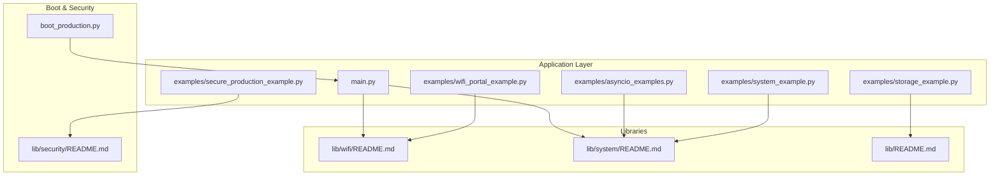
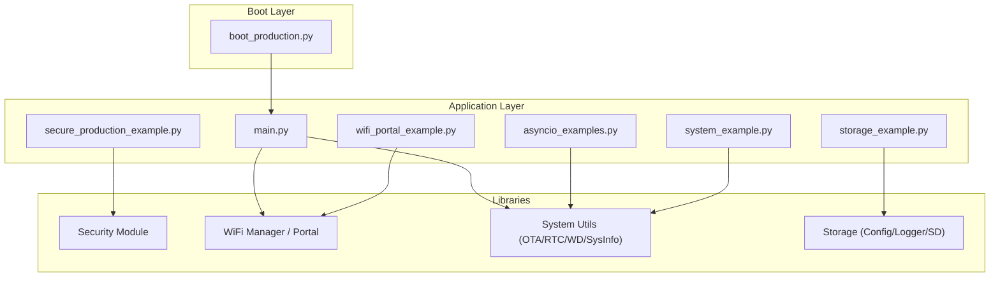
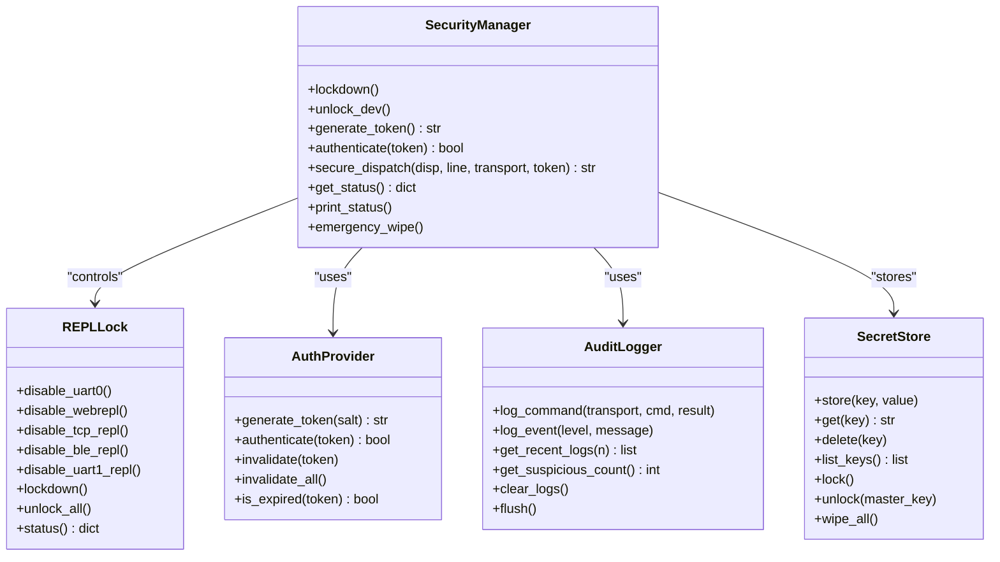
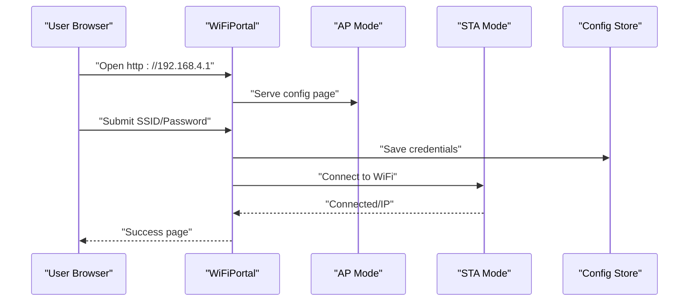
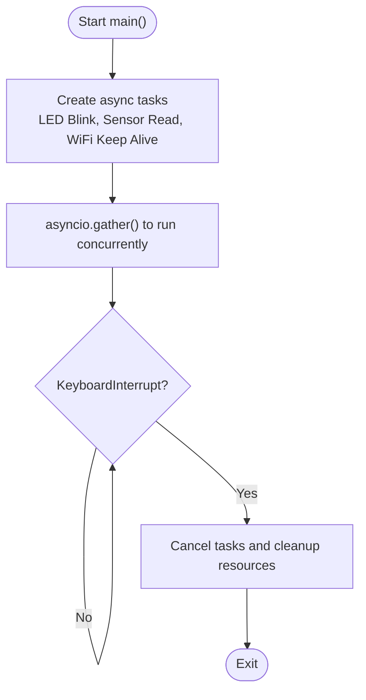
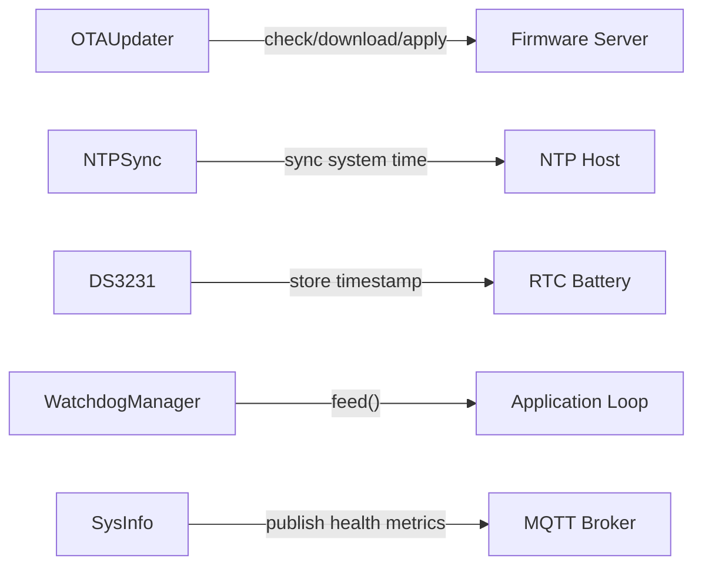
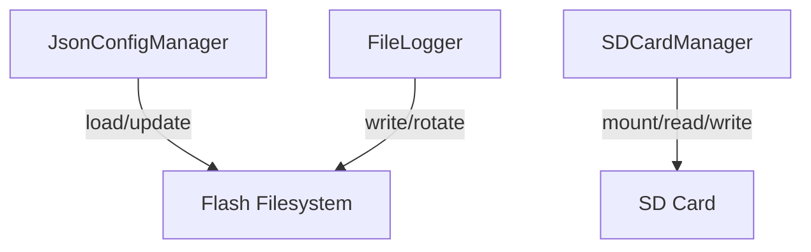
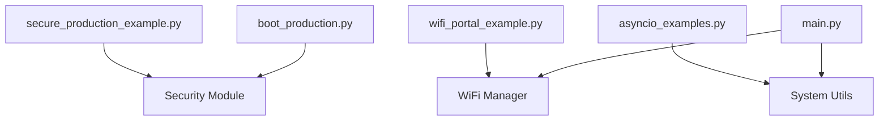

# Production Deployment Examples

<cite>
**Referenced Files in This Document**
- [secure_production_example.py](file://src/main/examples/secure_production_example.py)
- [wifi_portal_example.py](file://src/main/examples/wifi_portal_example.py)
- [asyncio_examples.py](file://src/main/examples/asyncio_examples.py)
- [boot_production.py](file://src/main/boot_production.py)
- [main.py](file://src/main/main.py)
- [system_example.py](file://src/main/examples/system_example.py)
- [storage_example.py](file://src/main/examples/storage_example.py)
- [security README.md](file://src/lib/security/README.md)
- [wifi README.md](file://src/lib/wifi/README.md)
- [system README.md](file://src/lib/system/README.md)
- [lib README.md](file://src/lib/README.md)
- [device.cfg](file://src/device.cfg)
</cite>

## Table of Contents
1. [Introduction](#introduction)
2. [Project Structure](#project-structure)
3. [Core Components](#core-components)
4. [Architecture Overview](#architecture-overview)
5. [Detailed Component Analysis](#detailed-component-analysis)
6. [Dependency Analysis](#dependency-analysis)
7. [Performance Considerations](#performance-considerations)
8. [Troubleshooting Guide](#troubleshooting-guide)
9. [Conclusion](#conclusion)
10. [Appendices](#appendices)

## Introduction
This document provides enterprise-grade production deployment guidance for ESP32-C3 using the repository’s example applications and libraries. It focuses on secure lockdown procedures, secret management, authentication, audit logging, WiFi captive portal configuration, asyncio concurrency patterns, and system integration across multiple framework components. It also covers deployment strategies, security hardening, monitoring/logging, maintenance, troubleshooting, performance optimization, reliability best practices, and operational excellence aligned with regulatory compliance and audit requirements.

## Project Structure
The repository organizes production-ready capabilities across:
- Application entry points and examples under src/main
- Reusable libraries under src/lib organized by domain (wifi, system, security, storage, etc.)
- Configuration metadata under src/device.cfg

**Diagram sources**
- [main.py:1-84](file://src/main/main.py#L1-L84)
- [boot_production.py:1-56](file://src/main/boot_production.py#L1-L56)
- [secure_production_example.py:1-268](file://src/main/examples/secure_production_example.py#L1-L268)
- [wifi_portal_example.py:1-350](file://src/main/examples/wifi_portal_example.py#L1-L350)
- [asyncio_examples.py:1-234](file://src/main/examples/asyncio_examples.py#L1-L234)
- [system_example.py:1-43](file://src/main/examples/system_example.py#L1-L43)
- [storage_example.py:1-63](file://src/main/examples/storage_example.py#L1-L63)
- [security README.md:1-357](file://src/lib/security/README.md#L1-L357)
- [wifi README.md:1-226](file://src/lib/wifi/README.md#L1-L226)
- [system README.md:1-399](file://src/lib/system/README.md#L1-L399)
- [lib README.md:1-72](file://src/lib/README.md#L1-L72)

**Section sources**
- [lib README.md:1-72](file://src/lib/README.md#L1-L72)
- [device.cfg:1-16](file://src/device.cfg#L1-L16)

## Core Components
- Security lockdown and token-based REPL access with encrypted secrets and audit logging
- WiFi captive portal for configuration and seamless STA connection with optional auto-reconnect
- Asyncio concurrency patterns for LED blinking, sensor sampling, WiFi keep-alive, and HTTP server
- System utilities for OTA updates, RTC/NTP synchronization, watchdog, and system health reporting
- Storage utilities for configuration, file logging, and optional SD card support

Key capabilities mapped to example files:
- Security lockdown and audit: [secure_production_example.py:1-268](file://src/main/examples/secure_production_example.py#L1-L268), [security README.md:1-357](file://src/lib/security/README.md#L1-L357)
- WiFi portal and STA mode: [wifi_portal_example.py:1-350](file://src/main/examples/wifi_portal_example.py#L1-L350), [wifi README.md:1-226](file://src/lib/wifi/README.md#L1-L226)
- Asyncio patterns: [asyncio_examples.py:1-234](file://src/main/examples/asyncio_examples.py#L1-L234), [main.py:1-84](file://src/main/main.py#L1-L84)
- System integration: [system_example.py:1-43](file://src/main/examples/system_example.py#L1-L43), [system README.md:1-399](file://src/lib/system/README.md#L1-L399)
- Storage and configuration: [storage_example.py:1-63](file://src/main/examples/storage_example.py#L1-L63), [lib README.md:1-72](file://src/lib/README.md#L1-L72)

**Section sources**
- [secure_production_example.py:1-268](file://src/main/examples/secure_production_example.py#L1-L268)
- [wifi_portal_example.py:1-350](file://src/main/examples/wifi_portal_example.py#L1-L350)
- [asyncio_examples.py:1-234](file://src/main/examples/asyncio_examples.py#L1-L234)
- [main.py:1-84](file://src/main/main.py#L1-L84)
- [system_example.py:1-43](file://src/main/examples/system_example.py#L1-L43)
- [storage_example.py:1-63](file://src/main/examples/storage_example.py#L1-L63)
- [security README.md:1-357](file://src/lib/security/README.md#L1-L357)
- [wifi README.md:1-226](file://src/lib/wifi/README.md#L1-L226)
- [system README.md:1-399](file://src/lib/system/README.md#L1-L399)
- [lib README.md:1-72](file://src/lib/README.md#L1-L72)

## Architecture Overview
The production architecture integrates boot-level lockdown, application-level concurrency, and library-based subsystems for networking, system management, and storage.

**Diagram sources**
- [boot_production.py:1-56](file://src/main/boot_production.py#L1-L56)
- [main.py:1-84](file://src/main/main.py#L1-L84)
- [secure_production_example.py:1-268](file://src/main/examples/secure_production_example.py#L1-L268)
- [wifi_portal_example.py:1-350](file://src/main/examples/wifi_portal_example.py#L1-L350)
- [asyncio_examples.py:1-234](file://src/main/examples/asyncio_examples.py#L1-L234)
- [system_example.py:1-43](file://src/main/examples/system_example.py#L1-L43)
- [storage_example.py:1-63](file://src/main/examples/storage_example.py#L1-L63)
- [security README.md:1-357](file://src/lib/security/README.md#L1-L357)
- [wifi README.md:1-226](file://src/lib/wifi/README.md#L1-L226)
- [system README.md:1-399](file://src/lib/system/README.md#L1-L399)

## Detailed Component Analysis

### Security Module — Production Lockdown, Secrets, Tokens, Audit, and Emergency Wipe
This component provides:
- Device lockdown disabling REPL channels and enforcing token-based access
- Encrypted secret storage with PBKDF2 and AES
- Token generation and authentication with rate limiting
- Audit logging for commands and security events
- Emergency wipe to purge secrets, logs, and tokens

**Diagram sources**
- [security README.md:197-258](file://src/lib/security/README.md#L197-L258)
- [secure_production_example.py:20-178](file://src/main/examples/secure_production_example.py#L20-L178)

**Section sources**
- [security README.md:1-357](file://src/lib/security/README.md#L1-L357)
- [secure_production_example.py:1-268](file://src/main/examples/secure_production_example.py#L1-L268)

### WiFi Portal — Captive Portal Creation and Configuration Management
The WiFi portal enables out-of-band configuration via a web interface, supports temporary and persistent modes, auto-reconnect, and coexistence with BLE.

**Diagram sources**
- [wifi_portal_example.py:13-177](file://src/main/examples/wifi_portal_example.py#L13-L177)
- [wifi README.md:135-214](file://src/lib/wifi/README.md#L135-L214)

**Section sources**
- [wifi_portal_example.py:1-350](file://src/main/examples/wifi_portal_example.py#L1-L350)
- [wifi README.md:1-226](file://src/lib/wifi/README.md#L1-L226)

### Asyncio — Concurrent Task Management and Event-Driven Patterns
Asyncio enables concurrent LED blinking, sensor sampling, WiFi keep-alive, and HTTP server handling with cooperative multitasking.

**Diagram sources**
- [asyncio_examples.py:147-193](file://src/main/examples/asyncio_examples.py#L147-L193)
- [main.py:49-71](file://src/main/main.py#L49-L71)

**Section sources**
- [asyncio_examples.py:1-234](file://src/main/examples/asyncio_examples.py#L1-L234)
- [main.py:1-84](file://src/main/main.py#L1-L84)

### System Integration — OTA, RTC/NTP, Watchdog, and Health Reporting
System utilities provide OTA updates, real-time clock synchronization, watchdog feeding, and health telemetry publishing.

**Diagram sources**
- [system README.md:21-313](file://src/lib/system/README.md#L21-L313)
- [system_example.py:1-43](file://src/main/examples/system_example.py#L1-L43)

**Section sources**
- [system README.md:1-399](file://src/lib/system/README.md#L1-L399)
- [system_example.py:1-43](file://src/main/examples/system_example.py#L1-L43)

### Storage — Configuration, Logging, and Optional SD Card
Storage utilities support JSON configuration, file logging with rotation, and optional SD card mounting and I/O.

**Diagram sources**
- [storage_example.py:10-52](file://src/main/examples/storage_example.py#L10-L52)
- [lib README.md:15-20](file://src/lib/README.md#L15-L20)

**Section sources**
- [storage_example.py:1-63](file://src/main/examples/storage_example.py#L1-L63)
- [lib README.md:1-72](file://src/lib/README.md#L1-L72)

## Dependency Analysis
The examples and libraries exhibit clear separation of concerns and minimal coupling:
- Application entry points depend on library APIs for networking, system, and storage
- Security examples depend on the security module for lockdown, secrets, and audit
- WiFi portal examples depend on WiFi manager and optional BLE
- Asyncio examples demonstrate task orchestration without tight coupling to specific hardware

**Diagram sources**
- [secure_production_example.py:1-268](file://src/main/examples/secure_production_example.py#L1-L268)
- [wifi_portal_example.py:1-350](file://src/main/examples/wifi_portal_example.py#L1-L350)
- [asyncio_examples.py:1-234](file://src/main/examples/asyncio_examples.py#L1-L234)
- [main.py:1-84](file://src/main/main.py#L1-L84)
- [boot_production.py:1-56](file://src/main/boot_production.py#L1-L56)
- [security README.md:1-357](file://src/lib/security/README.md#L1-L357)
- [wifi README.md:1-226](file://src/lib/wifi/README.md#L1-L226)
- [system README.md:1-399](file://src/lib/system/README.md#L1-L399)

**Section sources**
- [secure_production_example.py:1-268](file://src/main/examples/secure_production_example.py#L1-L268)
- [wifi_portal_example.py:1-350](file://src/main/examples/wifi_portal_example.py#L1-L350)
- [asyncio_examples.py:1-234](file://src/main/examples/asyncio_examples.py#L1-L234)
- [main.py:1-84](file://src/main/main.py#L1-L84)
- [boot_production.py:1-56](file://src/main/boot_production.py#L1-L56)
- [security README.md:1-357](file://src/lib/security/README.md#L1-L357)
- [wifi README.md:1-226](file://src/lib/wifi/README.md#L1-L226)
- [system README.md:1-399](file://src/lib/system/README.md#L1-L399)

## Performance Considerations
- Concurrency: Use asyncio.gather to run independent tasks concurrently; avoid blocking operations in event loops
- Memory: Periodically call garbage collection and monitor free RAM; adjust intervals for keep-alive and logging
- Network: Set reasonable reconnect intervals; prefer scanning known networks for faster connections
- Storage: Limit log file sizes and enable rotation; prefer flash-friendly write patterns
- Power: Use deep sleep for low-power designs; ensure proper wake conditions

[No sources needed since this section provides general guidance]

## Troubleshooting Guide
Common issues and remedies:
- REPL access blocked: Use token-based access or development mode via unlock pin in boot
- WiFi connection failures: Verify credentials, increase timeouts, and enable auto-reconnect
- Flash write errors: Ensure sufficient free space and avoid excessive writes
- Memory pressure: Reduce task frequency, minimize allocations, and trigger garbage collection
- Watchdog resets: Feed the watchdog regularly in long-running tasks

**Section sources**
- [boot_production.py:13-48](file://src/main/boot_production.py#L13-L48)
- [wifi README.md:218-226](file://src/lib/wifi/README.md#L218-L226)
- [system README.md:390-399](file://src/lib/system/README.md#L390-L399)
- [security README.md:261-357](file://src/lib/security/README.md#L261-L357)

## Conclusion
The repository demonstrates a robust, production-ready foundation for ESP32-C3 deployments. By integrating boot-level lockdown, secure secret storage, token-authenticated REPL, captive portal configuration, asyncio concurrency, and system utilities, teams can achieve secure, maintainable, and observable IoT devices. Align operational procedures with the examples and library references to meet enterprise requirements for security, reliability, and compliance.

[No sources needed since this section summarizes without analyzing specific files]

## Appendices

### Deployment Strategies
- Boot lockdown: Enable production lockdown in boot script; reserve unlock pin for field diagnostics
- Configuration delivery: Use WiFi portal for initial provisioning; persist credentials securely
- Updates: Implement OTA checks with rollback capability; schedule updates during maintenance windows
- Monitoring: Publish health metrics via MQTT; maintain local logs with rotation

**Section sources**
- [boot_production.py:1-56](file://src/main/boot_production.py#L1-L56)
- [wifi_portal_example.py:1-350](file://src/main/examples/wifi_portal_example.py#L1-L350)
- [system README.md:21-83](file://src/lib/system/README.md#L21-L83)
- [system_example.py:1-43](file://src/main/examples/system_example.py#L1-L43)

### Security Hardening Techniques
- Disable REPL channels by default; require tokens for remote access
- Encrypt secrets with PBKDF2 and AES; enforce rate limiting and lockouts
- Maintain audit logs for all REPL commands and security events
- Perform emergency wipe on suspected compromise

**Section sources**
- [security README.md:1-357](file://src/lib/security/README.md#L1-L357)
- [secure_production_example.py:1-268](file://src/main/examples/secure_production_example.py#L1-L268)

### Monitoring and Logging Approaches
- Use SysInfo for runtime metrics; publish via MQTT for centralized monitoring
- Employ FileLogger with rotation for persistent logs; optionally stream to external systems
- Integrate RTC/NTP for accurate timestamps in logs and alerts

**Section sources**
- [system README.md:317-399](file://src/lib/system/README.md#L317-L399)
- [system_example.py:1-43](file://src/main/examples/system_example.py#L1-L43)
- [storage_example.py:1-63](file://src/main/examples/storage_example.py#L1-L63)

### Maintenance Procedures
- Schedule OTA updates and verify versions before applying
- Rotate logs and manage storage capacity proactively
- Validate watchdog behavior and feed intervals
- Periodically review audit logs for suspicious activity

**Section sources**
- [system README.md:21-83](file://src/lib/system/README.md#L21-L83)
- [storage_example.py:1-63](file://src/main/examples/storage_example.py#L1-L63)
- [security README.md:236-246](file://src/lib/security/README.md#L236-L246)

### Regulatory Compliance and Audit Requirements
- Maintain audit logs for security events and command history
- Use encrypted secret storage and token-based access controls
- Document configuration and change management procedures
- Implement emergency wipe capability for incident response

**Section sources**
- [security README.md:1-357](file://src/lib/security/README.md#L1-L357)
- [secure_production_example.py:115-178](file://src/main/examples/secure_production_example.py#L115-L178)