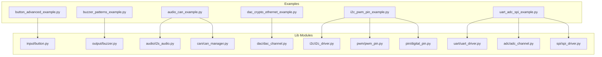
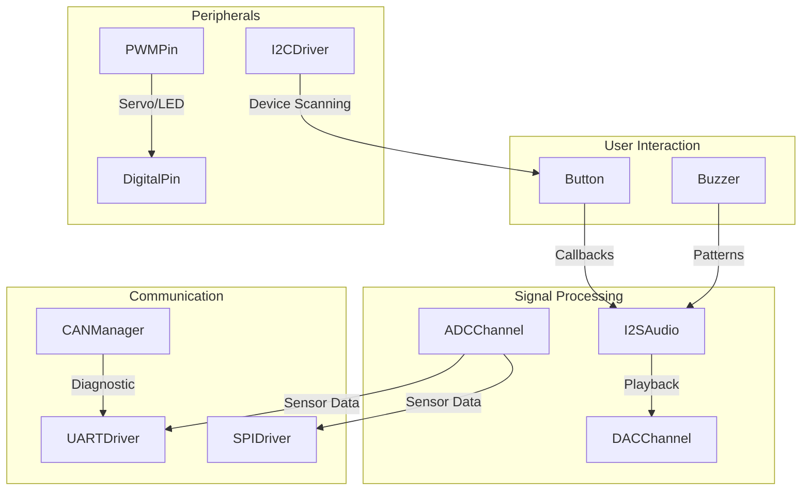
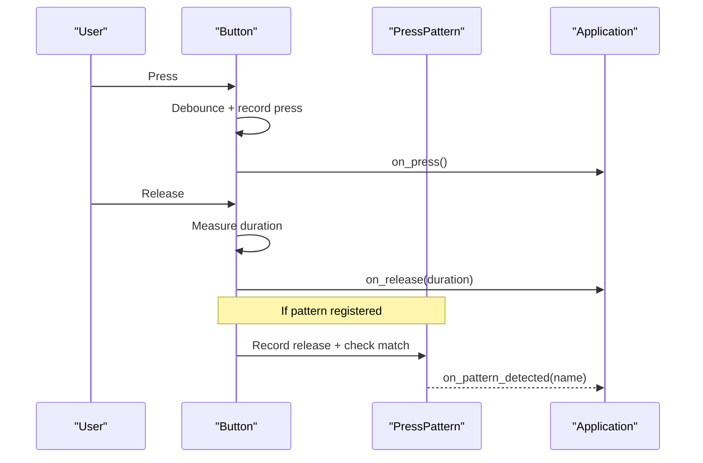
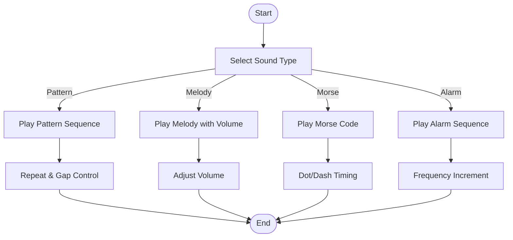
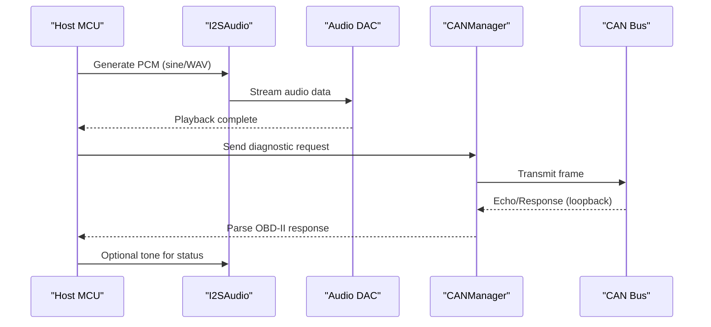
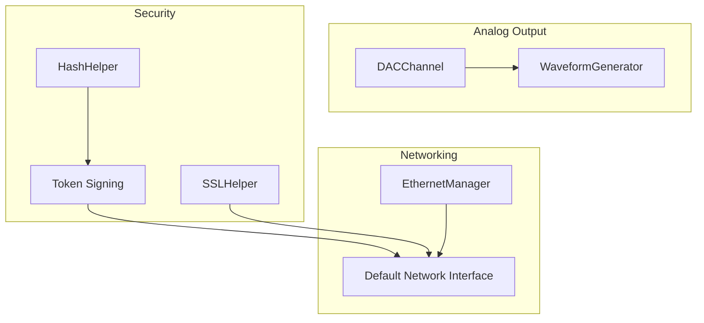
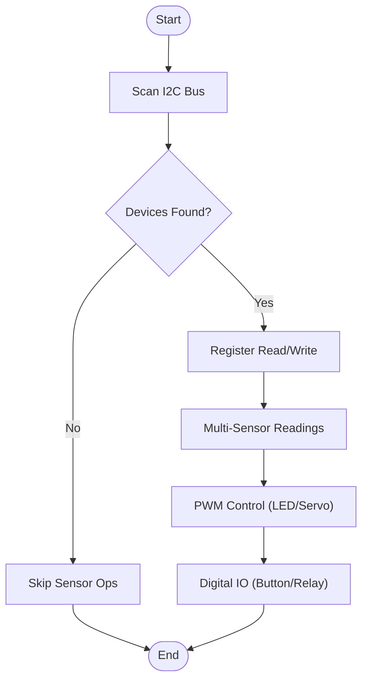
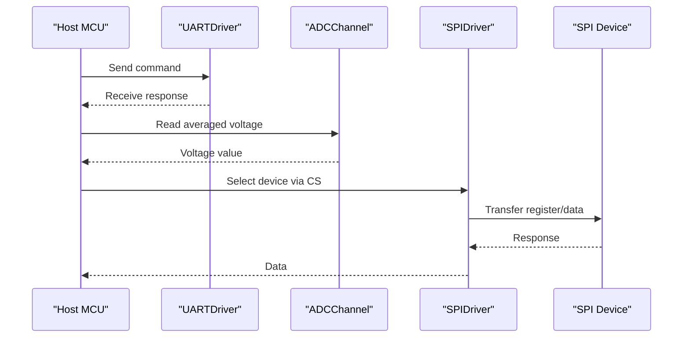
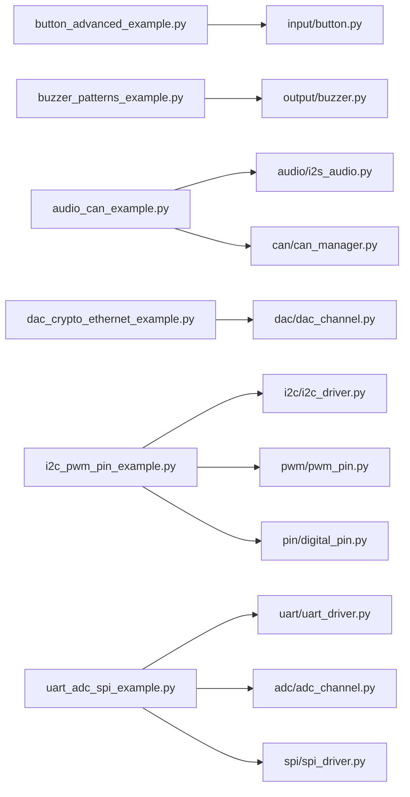

# Specialized & Domain Examples

<cite>
**Referenced Files in This Document**
- [button_advanced_example.py](file://src/main/examples/button_advanced_example.py)
- [buzzer_patterns_example.py](file://src/main/examples/buzzer_patterns_example.py)
- [audio_can_example.py](file://src/main/examples/audio_can_example.py)
- [dac_crypto_ethernet_example.py](file://src/main/examples/dac_crypto_ethernet_example.py)
- [i2c_pwm_pin_example.py](file://src/main/examples/i2c_pwm_pin_example.py)
- [uart_adc_spi_example.py](file://src/main/examples/uart_adc_spi_example.py)
- [README.md](file://src/lib/README.md)
- [README.md](file://src/main/examples/README.md)
- [README.md](file://src/lib/dac/README.md)
- [README.md](file://src/lib/audio/README.md)
- [README.md](file://src/lib/can/README.md)
</cite>

## Table of Contents
1. [Introduction](#introduction)
2. [Project Structure](#project-structure)
3. [Core Components](#core-components)
4. [Architecture Overview](#architecture-overview)
5. [Detailed Component Analysis](#detailed-component-analysis)
6. [Dependency Analysis](#dependency-analysis)
7. [Performance Considerations](#performance-considerations)
8. [Troubleshooting Guide](#troubleshooting-guide)
9. [Conclusion](#conclusion)

## Introduction
This document presents specialized and domain-focused examples for the ESP32-C3 MicroPython project. It consolidates advanced hardware interaction patterns across multiple domains:
- Advanced button handling: long press detection, multi-click recognition, press-duration tracking, and pattern recognition
- Audio synthesis and sound generation: buzzer patterns, melodies, and I2S audio integration
- Communication protocol fusion: combining audio and CAN bus
- DAC and cryptography: analog output with security primitives and SSL support
- Sensor networks via I2C and PWM coordination
- Complex peripheral integration: UART, ADC, and SPI combinations

The goal is to provide practical, code-mapped examples that demonstrate real-world hardware interfacing, signal processing, and cross-domain integrations suitable for embedded IoT, industrial, and audio applications.

## Project Structure
The examples are organized under the main examples directory and leverage modules from the lib directory. Each example file demonstrates a cohesive set of features and often integrates multiple peripherals.

**Diagram sources**
- [button_advanced_example.py](file://src/main/examples/button_advanced_example.py)
- [buzzer_patterns_example.py](file://src/main/examples/buzzer_patterns_example.py)
- [audio_can_example.py](file://src/main/examples/audio_can_example.py)
- [dac_crypto_ethernet_example.py](file://src/main/examples/dac_crypto_ethernet_example.py)
- [i2c_pwm_pin_example.py](file://src/main/examples/i2c_pwm_pin_example.py)
- [uart_adc_spi_example.py](file://src/main/examples/uart_adc_spi_example.py)

**Section sources**
- [README.md](file://src/main/examples/README.md)
- [README.md](file://src/lib/README.md)

## Core Components
This section highlights the primary building blocks used across the specialized examples and their roles in advanced hardware interactions.

- Button subsystem: debouncing, long press detection, multi-click counting, duration tracking, and pattern recognition
- Buzzer subsystem: active and passive buzzer control, pattern playback, melody composition, and volume control
- I2S audio: sine wave generation, WAV playback, volume/mute control, and DMA-driven streaming
- CAN bus: loopback testing, hardware filtering, and OBD-II request/response patterns
- DAC: 8-bit analog output, ramping, waveform generation, and integration with cryptographic and network modules
- I2C/PWM/digital pin: shared bus scanning, register-level operations, multi-device coordination, servo/LED control, and interrupt-driven input
- UART/ADC/SPI: framing, CRC, averaging/smoothing, multi-device SPI with per-device CS, and sensor data patterns

**Section sources**
- [button_advanced_example.py](file://src/main/examples/button_advanced_example.py)
- [buzzer_patterns_example.py](file://src/main/examples/buzzer_patterns_example.py)
- [audio_can_example.py](file://src/main/examples/audio_can_example.py)
- [dac_crypto_ethernet_example.py](file://src/main/examples/dac_crypto_ethernet_example.py)
- [i2c_pwm_pin_example.py](file://src/main/examples/i2c_pwm_pin_example.py)
- [uart_adc_spi_example.py](file://src/main/examples/uart_adc_spi_example.py)

## Architecture Overview
The examples illustrate modular, layered architectures where higher-level features (e.g., pattern recognition, audio synthesis, CAN diagnostics) build upon lower-level drivers (I2C, PWM, UART, ADC, SPI, DAC). Asynchronous programming patterns enable non-blocking I/O and concurrent tasks.

**Diagram sources**
- [button_advanced_example.py](file://src/main/examples/button_advanced_example.py)
- [buzzer_patterns_example.py](file://src/main/examples/buzzer_patterns_example.py)
- [audio_can_example.py](file://src/main/examples/audio_can_example.py)
- [dac_crypto_ethernet_example.py](file://src/main/examples/dac_crypto_ethernet_example.py)
- [i2c_pwm_pin_example.py](file://src/main/examples/i2c_pwm_pin_example.py)
- [uart_adc_spi_example.py](file://src/main/examples/uart_adc_spi_example.py)

## Detailed Component Analysis

### Advanced Button Handling
This example demonstrates sophisticated input handling:
- Long press detection with configurable thresholds
- Multi-click detection (double, triple, and N-click)
- Duration tracking and categorization
- Pattern recognition engine for custom gesture sequences
- Asynchronous watch mode for non-blocking monitoring
- Combined feature demonstrations

**Diagram sources**
- [button_advanced_example.py](file://src/main/examples/button_advanced_example.py)

**Section sources**
- [button_advanced_example.py](file://src/main/examples/button_advanced_example.py)

### Buzzer Music and Sound Patterns
This example showcases audio synthesis and expressive sound generation:
- Active buzzer patterns with customizable on/off timings
- Morse code transmission
- Alarm sequences with incremental frequencies
- Passive buzzer melodies with volume control
- Complex pattern melodies and async playback
- Practical scenarios: low battery alerts, button confirmations, error notifications, status codes, and alarm clocks

**Diagram sources**
- [buzzer_patterns_example.py](file://src/main/examples/buzzer_patterns_example.py)

**Section sources**
- [buzzer_patterns_example.py](file://src/main/examples/buzzer_patterns_example.py)

### Audio and CAN Bus Integration
This example merges audio and vehicle/network protocols:
- I2S audio generation (sine wave, WAV playback, volume/mute, sample-rate changes)
- CAN bus loopback testing (standard and extended frames, DLC variations)
- Hardware filtering (acceptance mask/filter)
- OBD-II diagnostic pattern (request/response, RPM calculation)
- Practical integration: audio feedback for CAN events, status reporting via buzzer

**Diagram sources**
- [audio_can_example.py](file://src/main/examples/audio_can_example.py)

**Section sources**
- [audio_can_example.py](file://src/main/examples/audio_can_example.py)

### DAC and Cryptography with Ethernet
This example demonstrates analog output combined with security and networking:
- DAC basic output, ramping, and waveform generation
- Cryptographic helpers: hashing (SHA-256/512/1, MD5), HMAC, encoding (hex/base64), PBKDF2, and token signing
- SSL context creation and verification toggles
- Ethernet connectivity (DHCP/static IP, async connect), with automatic HTTP/MQTT/cloud compatibility

**Diagram sources**
- [dac_crypto_ethernet_example.py](file://src/main/examples/dac_crypto_ethernet_example.py)

**Section sources**
- [dac_crypto_ethernet_example.py](file://src/main/examples/dac_crypto_ethernet_example.py)

### I2C and PWM Coordination for Sensor Networks
This example coordinates I2C sensors and PWM actuators:
- I2C bus scanning and common device detection
- Register-level operations (WHO_AM_I, power/wake, 16-bit reads, bit-field extraction)
- Shared bus usage with multiple sensors (BMP280, MPU6050, ADS1115)
- PWM LED brightness control, servo angle mapping, dynamic frequency changes
- Digital input/output: debounced buttons, interrupts, and relay control

**Diagram sources**
- [i2c_pwm_pin_example.py](file://src/main/examples/i2c_pwm_pin_example.py)

**Section sources**
- [i2c_pwm_pin_example.py](file://src/main/examples/i2c_pwm_pin_example.py)

### UART, ADC, and SPI Integration
This example integrates foundational peripherals for complex sensor and communication setups:
- UART echo test and frame parsing (CRC-8/16, delimiters, length-prefixed frames)
- ADC averaging, exponential smoothing, threshold checks, and calibration
- SPI basic transfers and per-device CS management
- Sensor patterns: battery monitor, soil moisture, and light level readings

**Diagram sources**
- [uart_adc_spi_example.py](file://src/main/examples/uart_adc_spi_example.py)

**Section sources**
- [uart_adc_spi_example.py](file://src/main/examples/uart_adc_spi_example.py)

## Dependency Analysis
The examples rely on a clean separation of concerns:
- Examples import high-level wrappers from lib modules
- Modules encapsulate hardware-specific drivers and expose consistent APIs
- Asynchronous patterns enable concurrency without blocking I/O

**Diagram sources**
- [button_advanced_example.py](file://src/main/examples/button_advanced_example.py)
- [buzzer_patterns_example.py](file://src/main/examples/buzzer_patterns_example.py)
- [audio_can_example.py](file://src/main/examples/audio_can_example.py)
- [dac_crypto_ethernet_example.py](file://src/main/examples/dac_crypto_ethernet_example.py)
- [i2c_pwm_pin_example.py](file://src/main/examples/i2c_pwm_pin_example.py)
- [uart_adc_spi_example.py](file://src/main/examples/uart_adc_spi_example.py)

**Section sources**
- [README.md](file://src/main/examples/README.md)
- [README.md](file://src/lib/README.md)

## Performance Considerations
- Asynchronous I/O: Use asyncio tasks for non-blocking I/O to maintain responsiveness during audio playback, CAN logging, and sensor polling.
- DMA and buffering: I2S audio uses DMA buffers; tune buffer sizes to balance latency and memory usage.
- Sampling rates and bit depths: Choose appropriate sample rates and bit depths for audio quality and CPU load.
- I2C timing: Optimize frequency and avoid excessive retries; use register-level helpers to minimize overhead.
- PWM and DAC: Avoid sharing GPIO25/26 with PWM when using DAC; use dedicated pins to prevent conflicts.
- CRC and framing: Use efficient framing and CRC routines to reduce CPU overhead in UART communications.
- ADC averaging: Use multi-sample averaging and exponential smoothing judiciously to balance noise reduction and latency.

[No sources needed since this section provides general guidance]

## Troubleshooting Guide
- Button not responding: Verify pull-up/down configuration, debounce settings, and wiring. Use the async watch mode to debug press/release timing.
- Buzzer sounds incorrect: Confirm pin assignments, volume levels, and whether passive buzzer requires PWM configuration.
- I2S audio distorted or silent: Check wiring to DAC/ amplifier, sample rate compatibility, and DMA buffer configuration.
- CAN frames not received: Validate loopback mode, filters, and acceptance masks; ensure correct baudrate and ID formats.
- DAC output unstable: Ensure no conflicting PWM on the same pin; use buffer amplifiers for low-impedance loads.
- I2C device not detected: Confirm bus pull-ups, scan addresses, and device presence checks; verify register operations and timing.
- UART framing errors: Validate baudrate, parity, and framing; use CRC helpers to detect corrupted packets.
- SPI device conflicts: Manage CS per device and ensure correct baudrate per slave.

**Section sources**
- [button_advanced_example.py](file://src/main/examples/button_advanced_example.py)
- [buzzer_patterns_example.py](file://src/main/examples/buzzer_patterns_example.py)
- [audio_can_example.py](file://src/main/examples/audio_can_example.py)
- [dac_crypto_ethernet_example.py](file://src/main/examples/dac_crypto_ethernet_example.py)
- [i2c_pwm_pin_example.py](file://src/main/examples/i2c_pwm_pin_example.py)
- [uart_adc_spi_example.py](file://src/main/examples/uart_adc_spi_example.py)

## Conclusion
These specialized examples demonstrate robust, production-ready patterns for advanced embedded systems:
- Rich input experiences with pattern recognition and multi-modal feedback
- Expressive audio synthesis integrated with communication protocols
- Secure and networked analog output with cryptography and SSL
- Coordinated sensor networks leveraging I2C, PWM, and digital IO
- Complex peripheral setups combining UART, ADC, and SPI

Adopting these patterns enables scalable, maintainable designs for IoT, industrial control, and audio applications on ESP32-C3 platforms.