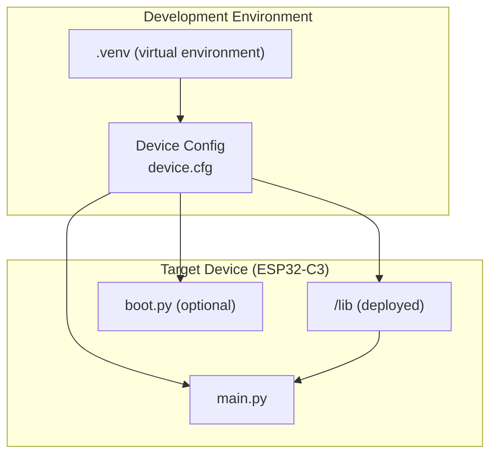
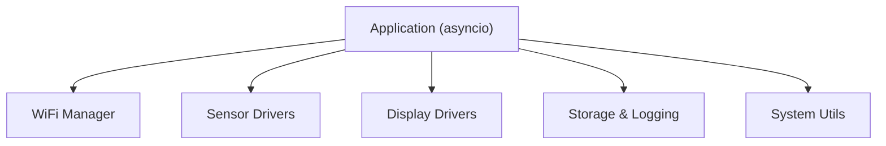
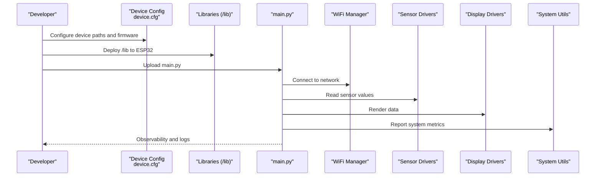
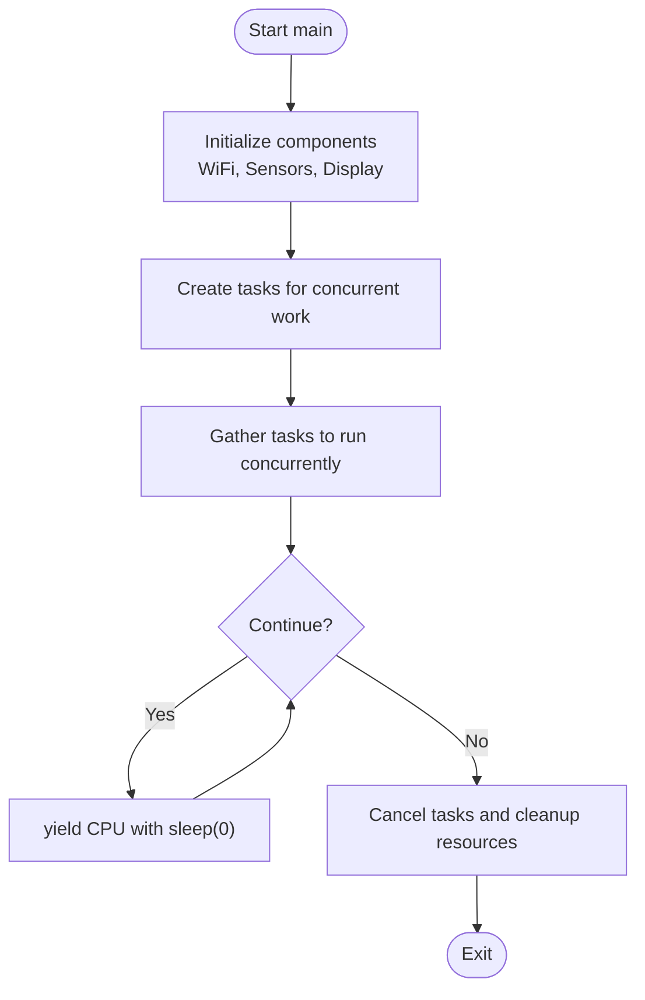
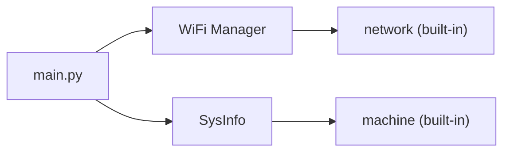

# Getting Started

<cite>
**Referenced Files in This Document**
- [device.cfg](file://src/device.cfg)
- [README.md](file://src/lib/README.md)
- [README_ASYNCIO.md](file://src/main/README_ASYNCIO.md)
- [asyncio_examples.py](file://src/main/examples/asyncio_examples.py)
- [wifi_example.py](file://src/main/examples/wifi_example.py)
- [README_WIFI_MODULE.md](file://src/main/README_WIFI_MODULE.md)
- [sensors_example.py](file://src/main/examples/sensors_example.py)
- [display_example.py](file://src/main/examples/display_example.py)
- [system_example.py](file://src/main/examples/system_example.py)
- [main.py](file://src/main/main.py)
- [boot_production.py](file://src/main/boot_production.py)
- [README.md](file://src/main/examples/README.md)
- [List_module.md](file://src/List_module.md)
</cite>

## Table of Contents
1. [Introduction](#introduction)
2. [Project Structure](#project-structure)
3. [Core Components](#core-components)
4. [Architecture Overview](#architecture-overview)
5. [Detailed Component Analysis](#detailed-component-analysis)
6. [Dependency Analysis](#dependency-analysis)
7. [Performance Considerations](#performance-considerations)
8. [Troubleshooting Guide](#troubleshooting-guide)
9. [Conclusion](#conclusion)
10. [Appendices](#appendices)

## Introduction
This guide helps you set up a development environment for the ESP32-C3 MicroPython Library Framework, configure your device, and build your first project from WiFi connectivity through sensors, displays, and system monitoring. It also covers the async-first programming model used throughout the framework and provides troubleshooting tips for common issues.

## Project Structure
The repository organizes code into:
- src/lib: reusable libraries grouped by domain (WiFi, sensors, display, system, etc.)
- src/main: example applications and starter code
- src/main/examples: runnable example scripts for each domain
- src/main/boot_production.py: optional production boot protection script
- src/device.cfg: device configuration for the development environment

**Diagram sources**
- [device.cfg:1-16](file://src/device.cfg#L1-L16)
- [boot_production.py:1-56](file://src/main/boot_production.py#L1-L56)
- [main.py:1-84](file://src/main/main.py#L1-L84)

**Section sources**
- [device.cfg:1-16](file://src/device.cfg#L1-L16)
- [README.md:1-72](file://src/lib/README.md#L1-L72)
- [README.md:1-403](file://src/main/examples/README.md#L1-L403)

## Core Components
- Device configuration: device.cfg defines device metadata, firmware type, and project paths used by the development environment.
- Library modules: src/lib provides categorized modules for networking, sensors, displays, storage, system utilities, and more.
- Example applications: src/main/examples demonstrates how to use modules asynchronously and integrate multiple subsystems.
- Starter app: src/main/main.py shows a minimal async program that connects to WiFi and runs periodic tasks.
- Optional boot protection: src/main/boot_production.py demonstrates a lockdown mechanism for production deployments.

Key capabilities:
- WiFi connectivity with configuration management and captive portal support
- Sensor reading via ADC and I2C/SPI devices
- Display output for OLED, TFT, LCD, LED matrices, and e-paper
- System monitoring (memory, CPU, OTA updates, RTC)
- Async-first programming patterns (tasks, events, queues, locks)

**Section sources**
- [device.cfg:1-16](file://src/device.cfg#L1-L16)
- [README.md:1-72](file://src/lib/README.md#L1-L72)
- [README.md:1-403](file://src/main/examples/README.md#L1-L403)
- [main.py:1-84](file://src/main/main.py#L1-L84)
- [boot_production.py:1-56](file://src/main/boot_production.py#L1-L56)

## Architecture Overview
The framework follows an async-first architecture:
- Applications are event-driven using asyncio
- Libraries expose high-level APIs for peripherals and protocols
- Example scripts demonstrate composition of tasks for real-world scenarios

[No sources needed since this diagram shows conceptual workflow, not actual code structure]

## Detailed Component Analysis

### Development Environment Setup
- Python virtual environment: Use the preconfigured .venv for consistent tooling.
- Device configuration: device.cfg stores device metadata and project paths. Adjust paths to match your local setup.
- MicroPython firmware: Ensure your ESP32-C3 board runs a recent MicroPython version with asyncio support.

Deployment steps:
- Copy the src/lib folder to the ESP32’s /lib directory
- Place src/main/main.py at the root as main.py
- Optionally upload src/main/boot_production.py as boot.py for production lockdown

**Section sources**
- [device.cfg:1-16](file://src/device.cfg#L1-L16)
- [README.md:67-72](file://src/lib/README.md#L67-L72)
- [main.py:1-84](file://src/main/main.py#L1-L84)
- [boot_production.py:1-56](file://src/main/boot_production.py#L1-L56)

### Device Configuration File (device.cfg)
Structure and fields:
- [device] section: port, mcu type, sync and root folders, timestamps, firmware type, device ID
- [filePath] section: project directories, device code location, virtual environment paths

Typical adjustments:
- Update port to match your OS (e.g., COM ports on Windows)
- Set mcu to esp32c3
- Align projectDir, ProjectFolder, and deviceCodeDir to your workspace paths

**Section sources**
- [device.cfg:1-16](file://src/device.cfg#L1-L16)

### First Project Walkthrough: Async-First Approach
Follow this progression to build your first project:

1) Basic WiFi connectivity
- Use WiFi Manager to connect to your network and optionally persist credentials
- Explore keep-alive mode and status monitoring
- Reference: [wifi_example.py:1-338](file://src/main/examples/wifi_example.py#L1-L338), [README_WIFI_MODULE.md:1-470](file://src/main/README_WIFI_MODULE.md#L1-L470)

2) Sensor reading
- Read analog sensors via ADC or digital sensors via I2C/SPI
- Use examples to validate wiring and interfaces
- Reference: [sensors_example.py:1-529](file://src/main/examples/sensors_example.py#L1-L529)

3) Display output
- Initialize displays (OLED, TFT, LCD, LED matrix, e-paper)
- Render text, shapes, and scrolling content
- Reference: [display_example.py:1-240](file://src/main/examples/display_example.py#L1-L240)

4) System monitoring
- Inspect memory, CPU frequency, and chip ID
- Optionally synchronize RTC via NTP and schedule OTA updates
- Reference: [system_example.py:1-43](file://src/main/examples/system_example.py#L1-L43)

5) Async patterns
- Learn tasks, events, queues, and locks
- Compose multiple concurrent activities
- Reference: [README_ASYNCIO.md:1-840](file://src/main/README_ASYNCIO.md#L1-L840), [asyncio_examples.py:1-234](file://src/main/examples/asyncio_examples.py#L1-L234)

**Diagram sources**
- [device.cfg:1-16](file://src/device.cfg#L1-L16)
- [README.md:67-72](file://src/lib/README.md#L67-L72)
- [main.py:1-84](file://src/main/main.py#L1-L84)
- [wifi_example.py:1-338](file://src/main/examples/wifi_example.py#L1-L338)
- [sensors_example.py:1-529](file://src/main/examples/sensors_example.py#L1-L529)
- [display_example.py:1-240](file://src/main/examples/display_example.py#L1-L240)
- [system_example.py:1-43](file://src/main/examples/system_example.py#L1-L43)

**Section sources**
- [README.md:1-403](file://src/main/examples/README.md#L1-L403)
- [README_ASYNCIO.md:1-840](file://src/main/README_ASYNCIO.md#L1-L840)
- [asyncio_examples.py:1-234](file://src/main/examples/asyncio_examples.py#L1-L234)
- [wifi_example.py:1-338](file://src/main/examples/wifi_example.py#L1-L338)
- [sensors_example.py:1-529](file://src/main/examples/sensors_example.py#L1-L529)
- [display_example.py:1-240](file://src/main/examples/display_example.py#L1-L240)
- [system_example.py:1-43](file://src/main/examples/system_example.py#L1-L43)
- [main.py:1-84](file://src/main/main.py#L1-L84)

### Async-First Programming Model
Key concepts demonstrated in the examples:
- Event loop lifecycle and cooperative multitasking
- Creating and managing tasks
- Gathering multiple coroutines concurrently
- Using events, locks, and queues for inter-task communication
- Practical patterns: state machines, watchdogs, debouncing, producer/consumer

**Diagram sources**
- [README_ASYNCIO.md:1-840](file://src/main/README_ASYNCIO.md#L1-L840)
- [asyncio_examples.py:147-193](file://src/main/examples/asyncio_examples.py#L147-L193)

**Section sources**
- [README_ASYNCIO.md:1-840](file://src/main/README_ASYNCIO.md#L1-L840)
- [asyncio_examples.py:1-234](file://src/main/examples/asyncio_examples.py#L1-L234)

### Installing /lib to ESP32 Flash Memory
- Copy the entire src/lib directory to the root of the ESP32 filesystem as /lib
- Ensure the MicroPython runtime can import modules from /lib
- Verify by importing a module in your main application

References:
- [README.md:67-72](file://src/lib/README.md#L67-L72)
- [main.py:4-6](file://src/main/main.py#L4-L6)

**Section sources**
- [README.md:67-72](file://src/lib/README.md#L67-L72)
- [main.py:4-6](file://src/main/main.py#L4-L6)

### Hardware Requirements for ESP32-C3 Boards
- ESP32-C3 Dev Board (e.g., ESP32-C3 SuperMini)
- USB-to-TTL adapter for flashing and serial console
- Optional sensors/displays per your chosen examples
- Breadboard and jumper wires for prototyping

Notes:
- ESP32-C3 does not have capacitive touch pins; touch.py is not applicable
- For Ethernet, use an external PHY (e.g., LAN8720) via SPI

**Section sources**
- [List_module.md:350-358](file://src/List_module.md#L350-L358)

## Dependency Analysis
The example applications depend on the library modules under /lib. The main application depends on system utilities and WiFi manager.

**Diagram sources**
- [main.py:12-13](file://src/main/main.py#L12-L13)

**Section sources**
- [main.py:12-13](file://src/main/main.py#L12-L13)

## Performance Considerations
- Prefer asyncio.sleep_ms over asyncio.sleep for short delays
- Use queues with bounded capacity to avoid memory pressure
- Run garbage collection periodically in idle tasks
- Avoid blocking operations; use non-blocking I/O and timeouts

[No sources needed since this section provides general guidance]

## Troubleshooting Guide
Common issues and resolutions:
- WiFi connection fails
  - Verify SSID/password and router availability
  - Increase timeout in configuration
  - Use keep-alive mode to recover from disconnections
  - References: [wifi_example.py:440-462](file://src/main/examples/wifi_example.py#L440-L462), [README_WIFI_MODULE.md:438-470](file://src/main/README_WIFI_MODULE.md#L438-L470)

- Configuration not saved
  - Check filesystem write permissions and available space
  - Reference: [README_WIFI_MODULE.md:445-447](file://src/main/README_WIFI_MODULE.md#L445-L447)

- Keep-alive not working
  - Ensure await keep_alive() is called
  - Verify signal strength and reconnect interval
  - Reference: [README_WIFI_MODULE.md:449-451](file://src/main/README_WIFI_MODULE.md#L449-L451)

- Captive portal not opening
  - Confirm sufficient memory and AP mode support
  - Reduce other services to free memory
  - Reference: [README_WIFI_MODULE.md:453-457](file://src/main/README_WIFI_MODULE.md#L453-L457)

- Cannot reach setup page
  - Connect to the AP “ESP32-Setup”
  - Open http://192.168.4.1 in a browser
  - Reference: [README_WIFI_MODULE.md:458-462](file://src/main/README_WIFI_MODULE.md#L458-L462)

- Production lockdown disables REPL
  - Use OTA or esptool to update firmware
  - Optionally enable unlock pin for development mode
  - Reference: [boot_production.py:13-17](file://src/main/boot_production.py#L13-L17)

**Section sources**
- [wifi_example.py:440-462](file://src/main/examples/wifi_example.py#L440-L462)
- [README_WIFI_MODULE.md:438-470](file://src/main/README_WIFI_MODULE.md#L438-L470)
- [boot_production.py:13-17](file://src/main/boot_production.py#L13-L17)

## Conclusion
You now have the essentials to set up your ESP32-C3 development environment, deploy the library modules, and build your first async-first project. Start with WiFi, add sensors and displays, and incorporate system monitoring. Use the examples and references here to accelerate your learning and troubleshoot effectively.

[No sources needed since this section summarizes without analyzing specific files]

## Appendices

### Appendix A: Async Patterns Quick Reference
- Tasks: create_task and gather for concurrency
- Events: coordinate between tasks
- Queues: decouple producers and consumers
- Locks: protect shared resources
- References: [README_ASYNCIO.md:175-203](file://src/main/README_ASYNCIO.md#L175-L203), [asyncio_examples.py:147-193](file://src/main/examples/asyncio_examples.py#L147-L193)

**Section sources**
- [README_ASYNCIO.md:175-203](file://src/main/README_ASYNCIO.md#L175-L203)
- [asyncio_examples.py:147-193](file://src/main/examples/asyncio_examples.py#L147-L193)

### Appendix B: Module Categories Overview
- Sensors, Display, Output/Input, I/O Expanders, Communication, Network, Cloud, Storage, System, Security, REPL, Crypto, Analog I/O, GPIO, Timer
- Reference: [List_module.md:9-29](file://src/List_module.md#L9-L29)

**Section sources**
- [List_module.md:9-29](file://src/List_module.md#L9-L29)