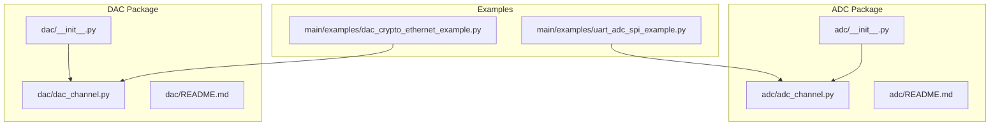
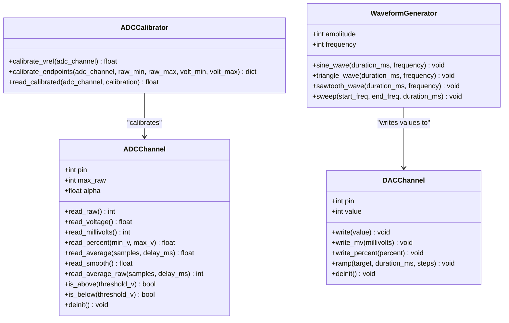
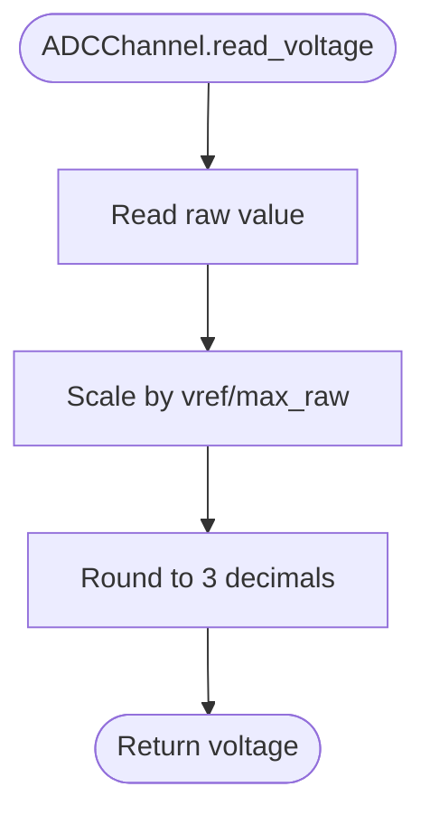
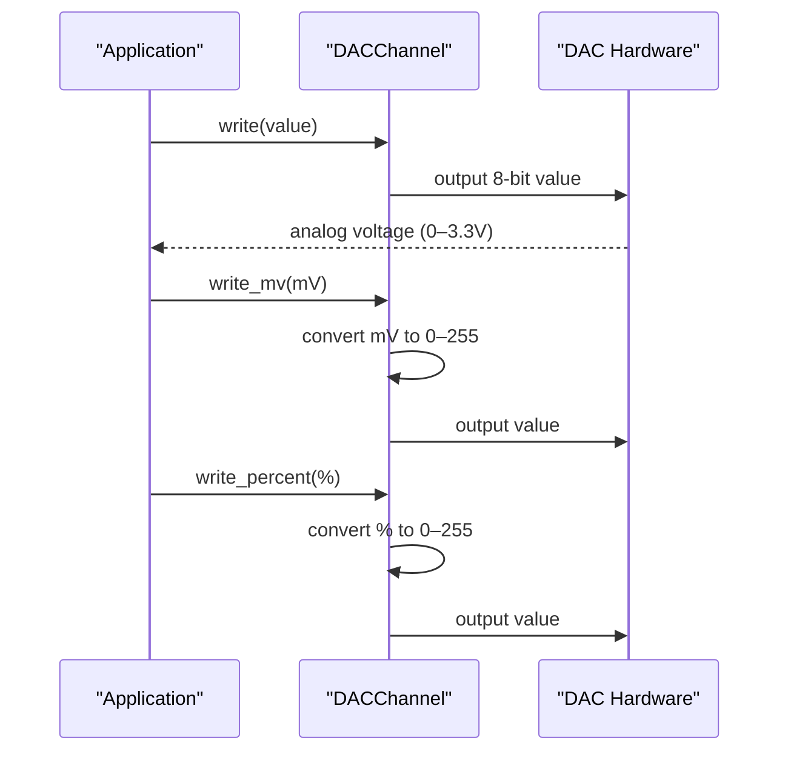
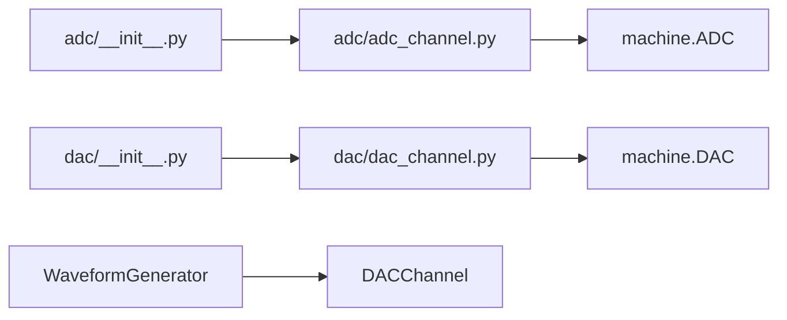

# Analog I/O (ADC/DAC)

<cite>
**Referenced Files in This Document**
- [adc_channel.py](file://src/lib/adc/adc_channel.py)
- [__init__.py](file://src/lib/adc/__init__.py)
- [README.md](file://src/lib/adc/README.md)
- [dac_channel.py](file://src/lib/dac/dac_channel.py)
- [__init__.py](file://src/lib/dac/__init__.py)
- [README.md](file://src/lib/dac/README.md)
- [dac_crypto_ethernet_example.py](file://src/main/examples/dac_crypto_ethernet_example.py)
- [uart_adc_spi_example.py](file://src/main/examples/uart_adc_spi_example.py)
</cite>

## Table of Contents
1. [Introduction](#introduction)
2. [Project Structure](#project-structure)
3. [Core Components](#core-components)
4. [Architecture Overview](#architecture-overview)
5. [Detailed Component Analysis](#detailed-component-analysis)
6. [Dependency Analysis](#dependency-analysis)
7. [Performance Considerations](#performance-considerations)
8. [Troubleshooting Guide](#troubleshooting-guide)
9. [Conclusion](#conclusion)
10. [Appendices](#appendices)

## Introduction
This document explains the analog input/output capabilities of the embedded system, focusing on ADC and DAC channels. It covers:
- ADCChannel configuration for resolution, attenuation, and calibration
- Sampling strategies and noise reduction
- DACChannel output modes and waveform synthesis
- Practical examples from dac_crypto_ethernet_example.py and uart_adc_spi_example.py
- Best practices for analog signal conditioning, filtering, and grounding
- Relationship between resolution, sampling rate, and measurement precision

## Project Structure
The analog modules are organized under src/lib with dedicated packages for ADC and DAC. Example scripts demonstrate usage patterns for real-world scenarios.

**Diagram sources**
- [adc/__init__.py:1-13](file://src/lib/adc/__init__.py#L1-L13)
- [adc/adc_channel.py:1-277](file://src/lib/adc/adc_channel.py#L1-L277)
- [adc/README.md:1-149](file://src/lib/adc/README.md#L1-L149)
- [dac/__init__.py:1-13](file://src/lib/dac/__init__.py#L1-L13)
- [dac/dac_channel.py:1-270](file://src/lib/dac/dac_channel.py#L1-L270)
- [dac/README.md:1-138](file://src/lib/dac/README.md#L1-L138)
- [dac_crypto_ethernet_example.py:1-326](file://src/main/examples/dac_crypto_ethernet_example.py#L1-L326)
- [uart_adc_spi_example.py:1-264](file://src/main/examples/uart_adc_spi_example.py#L1-L264)

**Section sources**
- [adc/__init__.py:1-13](file://src/lib/adc/__init__.py#L1-L13)
- [dac/__init__.py:1-13](file://src/lib/dac/__init__.py#L1-L13)
- [adc/README.md:1-149](file://src/lib/adc/README.md#L1-L149)
- [dac/README.md:1-138](file://src/lib/dac/README.md#L1-L138)

## Core Components
- ADCChannel: Abstraction over machine.ADC providing raw, voltage, millivolt, and percentage readings, plus multi-sample averaging, exponential moving average smoothing, and calibration helpers.
- ADCCalibrator: Static helper for measuring internal reference and performing two-point calibration.
- DACChannel: 8-bit analog output driver for ESP32-C3 with GPIO25/GPIO26, supporting direct value, millivolt, percentage writes, and smooth ramp transitions.
- WaveformGenerator: Optional waveform generator synchronized to DAC output for sine, triangle, sawtooth, and sweep patterns.

Key capabilities:
- ADC: configurable resolution (9/10/11/12-bit), attenuation levels (0/6/11 dB), averaging, smoothing, thresholds, and calibration.
- DAC: 8-bit output with optional waveform generation and ramping.

**Section sources**
- [adc_channel.py:22-277](file://src/lib/adc/adc_channel.py#L22-L277)
- [dac_channel.py:31-270](file://src/lib/dac/dac_channel.py#L31-L270)

## Architecture Overview
The analog subsystem builds on MicroPython’s machine.ADC and machine.DAC abstractions, adding convenience APIs and calibration utilities.

**Diagram sources**
- [adc_channel.py:22-277](file://src/lib/adc/adc_channel.py#L22-L277)
- [dac_channel.py:31-270](file://src/lib/dac/dac_channel.py#L31-L270)

## Detailed Component Analysis

### ADCChannel Analysis
ADCChannel wraps machine.ADC with:
- Resolution and attenuation configuration
- Multiple output formats (raw, voltage, millivolt, percent)
- Noise reduction via multi-sample averaging and exponential moving average
- Threshold checks and calibration helpers

**Diagram sources**
- [adc_channel.py:112-118](file://src/lib/adc/adc_channel.py#L112-L118)

Key configuration:
- Attenuation constants: 0 dB (0–1.0 V), 6 dB (0–2.0 V), 11 dB (0–3.6 V)
- Width selection: 9/10/11/12 bits
- Reference voltage: default 3.3 V, adjustable

Noise reduction strategies:
- Multi-sample averaging: sum N samples and divide by N
- Exponential moving average: smooth factor alpha controls weight of new vs. previous values

Calibration:
- Internal reference calibration: measure internal reference (~1100 mV) and compute calibrated vref
- Two-point endpoint calibration: derive linear mapping from known raw/voltage pairs

Threshold detection:
- is_above/is_below compare measured voltage against thresholds

Practical usage examples:
- Basic reading and percent scale
- Averaging and smoothing
- Calibration and threshold checks
- Sensor patterns (battery, soil moisture, light)

**Section sources**
- [adc_channel.py:40-142](file://src/lib/adc/adc_channel.py#L40-L142)
- [adc_channel.py:145-214](file://src/lib/adc/adc_channel.py#L145-L214)
- [adc_channel.py:222-277](file://src/lib/adc/adc_channel.py#L222-L277)
- [adc/README.md:1-149](file://src/lib/adc/README.md#L1-L149)
- [uart_adc_spi_example.py:81-147](file://src/main/examples/uart_adc_spi_example.py#L81-L147)

### DACChannel Analysis
DACChannel provides 8-bit analog output on ESP32-C3 GPIO25/GPIO26:
- Direct value write (0–255)
- Millivolt and percentage output helpers
- Smooth ramping between values
- Cleanup routine to disable output

**Diagram sources**
- [dac_channel.py:76-107](file://src/lib/dac/dac_channel.py#L76-L107)

Waveform synthesis:
- WaveformGenerator produces synchronized waveforms at a configurable sample rate
- Supports sine, triangle, sawtooth, and sweep patterns

Practical usage examples:
- Basic output, millivolt and percentage writes
- Smooth ramp transitions
- Waveform generation for sound effects and test signals

**Section sources**
- [dac_channel.py:31-135](file://src/lib/dac/dac_channel.py#L31-L135)
- [dac_channel.py:137-270](file://src/lib/dac/dac_channel.py#L137-L270)
- [dac/README.md:1-138](file://src/lib/dac/README.md#L1-L138)
- [dac_crypto_ethernet_example.py:20-114](file://src/main/examples/dac_crypto_ethernet_example.py#L20-L114)

### Real-World Application Examples
- DAC usage in dac_crypto_ethernet_example.py demonstrates:
  - Basic DAC output (values, millivolts, percentages)
  - Smooth ramp transitions
  - Waveform generation (sine, triangle, sawtooth, sweep)
- ADC usage in uart_adc_spi_example.py demonstrates:
  - Basic readings (raw, voltage, millivolts, percent)
  - Averaging and smoothing
  - Calibration and threshold checks
  - Sensor patterns (battery, soil moisture, light)

**Section sources**
- [dac_crypto_ethernet_example.py:20-114](file://src/main/examples/dac_crypto_ethernet_example.py#L20-L114)
- [uart_adc_spi_example.py:81-244](file://src/main/examples/uart_adc_spi_example.py#L81-L244)

## Dependency Analysis
- ADCChannel depends on machine.ADC and Pin for hardware access.
- DACChannel depends on machine.DAC and Pin for hardware access.
- WaveformGenerator depends on DACChannel and uses asyncio for timing.
- ADCCalibrator is a static helper that operates on ADCChannel instances.

**Diagram sources**
- [adc/__init__.py:12-12](file://src/lib/adc/__init__.py#L12-L12)
- [dac/__init__.py:12-12](file://src/lib/dac/__init__.py#L12-L12)
- [adc_channel.py:13-19](file://src/lib/adc/adc_channel.py#L13-L19)
- [dac_channel.py:21-25](file://src/lib/dac/dac_channel.py#L21-L25)

**Section sources**
- [adc_channel.py:13-19](file://src/lib/adc/adc_channel.py#L13-L19)
- [dac_channel.py:21-25](file://src/lib/dac/dac_channel.py#L21-L25)

## Performance Considerations
- Resolution vs. precision: Higher bit widths (12-bit) increase precision but may reduce effective sampling rate depending on hardware constraints.
- Attenuation trade-offs: Higher attenuation increases measurable range but reduces sensitivity; choose based on expected signal levels.
- Sampling rate and noise: Multi-sample averaging improves SNR at the cost of latency; EMA smoothing reduces noise with lower overhead.
- DAC output impedance: ~200 Ω output impedance requires buffering for low-load applications to avoid droop.
- Timing: Waveform generation relies on precise timing; ensure adequate CPU headroom and avoid conflicts with other peripherals.

[No sources needed since this section provides general guidance]

## Troubleshooting Guide
Common analog issues and remedies:
- Quantization noise: Use multi-sample averaging or EMA smoothing to reduce noise; increase averaging window cautiously to balance latency.
- Drift compensation: Periodically recalibrate using internal reference or two-point calibration; store calibration coefficients for runtime correction.
- Calibration accuracy: Use known reference voltages for two-point calibration; validate across the expected operating range.
- Grounding and filtering: Ensure clean power supplies and shared ground between sensors and MCU; add RC filters on analog inputs for high-frequency noise.
- Signal conditioning: Use voltage dividers for high-voltage measurements; employ buffers for low-impedance loads.

**Section sources**
- [adc_channel.py:145-177](file://src/lib/adc/adc_channel.py#L145-L177)
- [adc_channel.py:229-277](file://src/lib/adc/adc_channel.py#L229-L277)
- [dac_channel.py:137-270](file://src/lib/dac/dac_channel.py#L137-L270)
- [adc/README.md:139-149](file://src/lib/adc/README.md#L139-L149)
- [dac/README.md:128-138](file://src/lib/dac/README.md#L128-L138)

## Conclusion
The ADC and DAC modules provide a robust foundation for analog I/O on ESP32-C3:
- ADCChannel offers flexible resolution, attenuation, averaging, smoothing, and calibration for precise measurements.
- DACChannel enables straightforward 8-bit analog output with convenient millivolt and percentage interfaces, plus waveform generation.
- Practical examples demonstrate real-world usage patterns for both modules.

[No sources needed since this section summarizes without analyzing specific files]

## Appendices

### API Quick Reference
- ADCChannel
  - read_raw, read_voltage, read_millivolts, read_percent
  - read_average, read_smooth, read_average_raw
  - is_above, is_below
  - Calibration helpers: calibrate_vref, calibrate_endpoints, read_calibrated
- DACChannel
  - write, write_mv, write_percent
  - ramp
  - deinit
- WaveformGenerator
  - sine_wave, triangle_wave, sawtooth_wave, sweep

**Section sources**
- [adc/README.md:111-136](file://src/lib/adc/README.md#L111-L136)
- [dac/README.md:103-125](file://src/lib/dac/README.md#L103-L125)