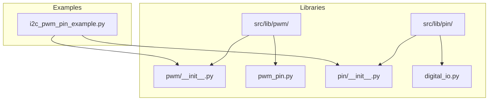
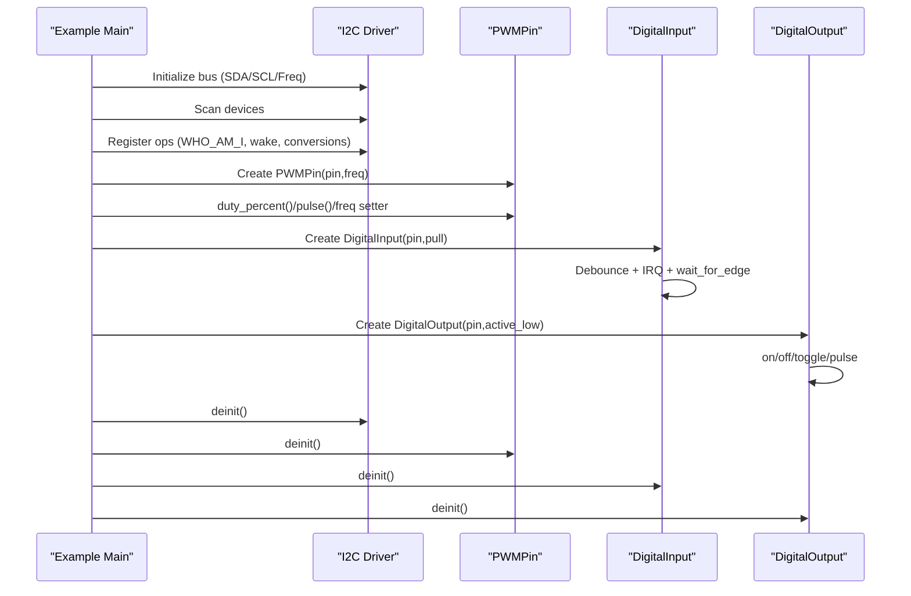
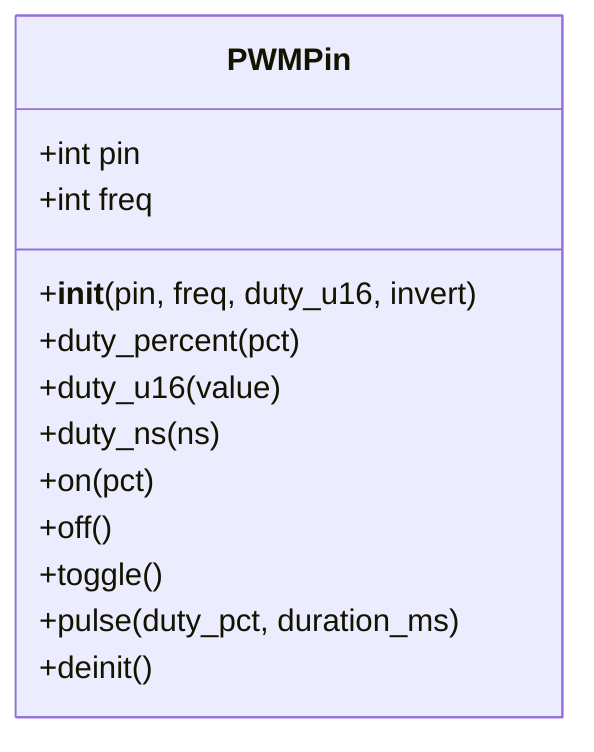
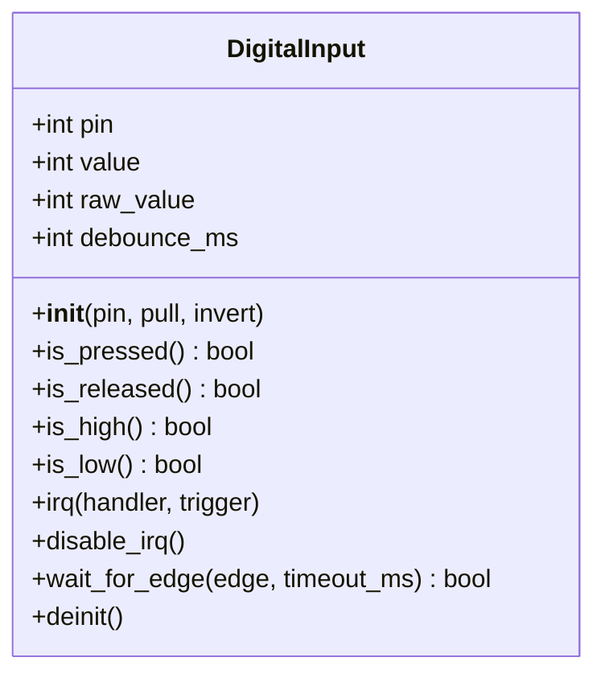
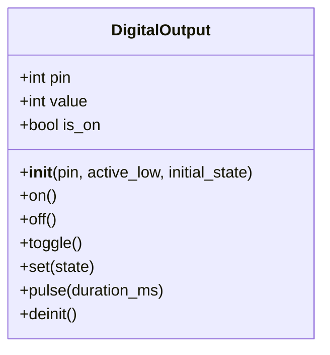
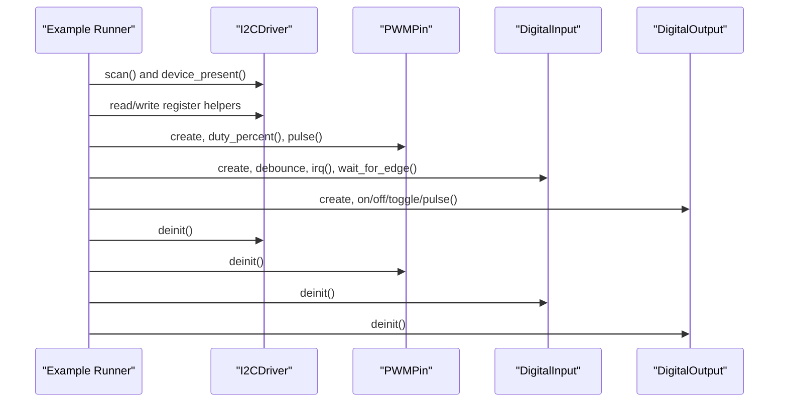
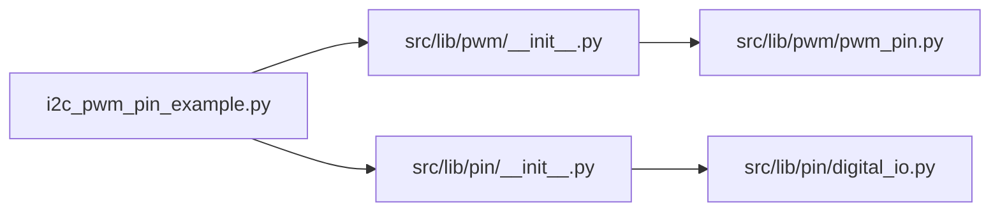

# Digital I/O (PWM & Pins)

<cite>
**Referenced Files in This Document**
- [i2c_pwm_pin_example.py](file://src/main/examples/i2c_pwm_pin_example.py)
- [pwm_pin.py](file://src/lib/pwm/pwm_pin.py)
- [digital_io.py](file://src/lib/pin/digital_io.py)
- [pwm/__init__.py](file://src/lib/pwm/__init__.py)
- [pin/__init__.py](file://src/lib/pin/__init__.py)
- [pwm/README.md](file://src/lib/pwm/README.md)
- [pin/README.md](file://src/lib/pin/README.md)
- [device.cfg](file://src/device.cfg)
</cite>

## Table of Contents
1. [Introduction](#introduction)
2. [Project Structure](#project-structure)
3. [Core Components](#core-components)
4. [Architecture Overview](#architecture-overview)
5. [Detailed Component Analysis](#detailed-component-analysis)
6. [Dependency Analysis](#dependency-analysis)
7. [Performance Considerations](#performance-considerations)
8. [Troubleshooting Guide](#troubleshooting-guide)
9. [Conclusion](#conclusion)
10. [Appendices](#appendices)

## Introduction
This document explains the digital I/O capabilities for the ESP32-C3 platform, focusing on:
- PWM generation via a generic helper for duty cycle control, frequency configuration, and lifecycle management
- General-purpose digital pins for input and output, including pull-up/pull-down resistors, debouncing, interrupts, and edge detection
- Practical examples demonstrating PWM usage alongside I2C communication
- Guidance on timing, noise, and power optimization, plus best practices for pin multiplexing and ESD protection

The examples and APIs are implemented in the repository under src/lib/pwm, src/lib/pin, and demonstrated in src/main/examples/i2c_pwm_pin_example.py.

## Project Structure
The digital I/O stack is organized into reusable libraries with example-driven demonstrations:
- PWM library: src/lib/pwm (helpers and API surface)
- Digital pin library: src/lib/pin (input/output abstractions)
- Example usage: src/main/examples/i2c_pwm_pin_example.py (combines I2C, PWM, and digital pins)
- Device configuration: src/device.cfg (target MCU and runtime info)

**Diagram sources**
- [i2c_pwm_pin_example.py:1-364](file://src/main/examples/i2c_pwm_pin_example.py#L1-L364)
- [pwm/__init__.py:1-13](file://src/lib/pwm/__init__.py#L1-L13)
- [pwm_pin.py:1-151](file://src/lib/pwm/pwm_pin.py#L1-L151)
- [pin/__init__.py:1-14](file://src/lib/pin/__init__.py#L1-L14)
- [digital_io.py:1-317](file://src/lib/pin/digital_io.py#L1-L317)

**Section sources**
- [i2c_pwm_pin_example.py:1-364](file://src/main/examples/i2c_pwm_pin_example.py#L1-L364)
- [pwm/__init__.py:1-13](file://src/lib/pwm/__init__.py#L1-L13)
- [pin/__init__.py:1-14](file://src/lib/pin/__init__.py#L1-L14)
- [device.cfg:1-16](file://src/device.cfg#L1-L16)

## Core Components
- PWMPin: A helper around machine.PWM offering frequency control, percentage and raw duty cycle setters, convenience toggles and pulses, and cleanup.
- DigitalInput: An abstraction for input pins supporting pull-up/pull-down, debouncing, interrupt triggers, and blocking edge waits.
- DigitalOutput: An abstraction for output pins supporting active-high/active-low logic, toggling, pulses, and cleanup.

Key capabilities:
- PWM: frequency setting, duty control (percent, 16-bit, nanoseconds), on/off/toggle/pulse, deinitialization
- Digital I/O: input with pull modes and debounce, interrupt-driven edge detection, output with active-low support and pulse

**Section sources**
- [pwm_pin.py:19-151](file://src/lib/pwm/pwm_pin.py#L19-L151)
- [digital_io.py:21-317](file://src/lib/pin/digital_io.py#L21-L317)
- [pwm/README.md:1-143](file://src/lib/pwm/README.md#L1-L143)
- [pin/README.md:1-173](file://src/lib/pin/README.md#L1-L173)

## Architecture Overview
The example orchestrates I2C scanning/register operations, shared bus usage, and then demonstrates PWM and digital pin usage. It highlights concurrent tasks and resource cleanup.

**Diagram sources**
- [i2c_pwm_pin_example.py:1-364](file://src/main/examples/i2c_pwm_pin_example.py#L1-L364)
- [pwm_pin.py:40-151](file://src/lib/pwm/pwm_pin.py#L40-L151)
- [digital_io.py:50-317](file://src/lib/pin/digital_io.py#L50-L317)

## Detailed Component Analysis

### PWM: PWMPin
The PWMPin class wraps machine.PWM to simplify frequency and duty control, with helpers for common patterns.

- Initialization sets up the underlying PWM channel on the requested pin with optional inversion.
- Frequency property setter updates the PWM channel’s frequency.
- Duty control supports percentage mapping, raw 16-bit scale, and nanosecond-level control.
- Convenience methods provide on/off/toggle and short blocking pulses.
- Deinitialization ensures the PWM output is turned off and resources are released.

Practical usage patterns shown in the example:
- LED brightness fade and pulse
- Servo control with 50Hz and mapped pulse widths
- Dynamic frequency changes

**Diagram sources**
- [pwm_pin.py:19-151](file://src/lib/pwm/pwm_pin.py#L19-L151)
- [i2c_pwm_pin_example.py:153-251](file://src/main/examples/i2c_pwm_pin_example.py#L153-L251)

**Section sources**
- [pwm_pin.py:19-151](file://src/lib/pwm/pwm_pin.py#L19-L151)
- [pwm/README.md:22-105](file://src/lib/pwm/README.md#L22-L105)
- [i2c_pwm_pin_example.py:153-251](file://src/main/examples/i2c_pwm_pin_example.py#L153-L251)

### Digital Pin: DigitalInput
DigitalInput manages input pins with configurable pull resistors, debouncing, and interrupt-driven edge detection.

- Pull modes: pull-up, pull-down, or no pull.
- Debounce: software-based hysteresis with adjustable millisecond window.
- Interrupts: mirror machine.Pin triggers (rising, falling, both).
- Edge detection: blocking wait for transitions with timeout.

Example usage:
- Button input with pull-up, debounce, IRQ, and blocking edge waits.

**Diagram sources**
- [digital_io.py:21-211](file://src/lib/pin/digital_io.py#L21-L211)
- [i2c_pwm_pin_example.py:257-293](file://src/main/examples/i2c_pwm_pin_example.py#L257-L293)

**Section sources**
- [digital_io.py:21-211](file://src/lib/pin/digital_io.py#L21-L211)
- [pin/README.md:28-83](file://src/lib/pin/README.md#L28-L83)
- [i2c_pwm_pin_example.py:257-293](file://src/main/examples/i2c_pwm_pin_example.py#L257-L293)

### Digital Pin: DigitalOutput
DigitalOutput controls output pins with support for active-high and active-low loads, toggling, and short pulses.

- Active-low support for relays and similar loads.
- Logical state accounting for active-low polarity.
- Pulse method performs a short blocking on-off cycle.

Example usage:
- LED blinking and relay switching with active-low configuration.

**Diagram sources**
- [digital_io.py:213-317](file://src/lib/pin/digital_io.py#L213-L317)
- [i2c_pwm_pin_example.py:299-337](file://src/main/examples/i2c_pwm_pin_example.py#L299-L337)

**Section sources**
- [digital_io.py:213-317](file://src/lib/pin/digital_io.py#L213-L317)
- [pin/README.md:53-83](file://src/lib/pin/README.md#L53-L83)
- [i2c_pwm_pin_example.py:299-337](file://src/main/examples/i2c_pwm_pin_example.py#L299-L337)

### Combined Example: I2C + PWM + Digital Pins
The example demonstrates:
- I2C bus scanning and register-level operations
- Sharing a single I2C bus among multiple sensors
- PWM LED brightness control and servo positioning
- Digital input with interrupts and debouncing
- Digital output for LED and relay control

**Diagram sources**
- [i2c_pwm_pin_example.py:1-364](file://src/main/examples/i2c_pwm_pin_example.py#L1-L364)

**Section sources**
- [i2c_pwm_pin_example.py:1-364](file://src/main/examples/i2c_pwm_pin_example.py#L1-L364)

## Dependency Analysis
- The example imports from the public package entry points:
  - from pwm import PWMPin
  - from pin import DigitalInput, DigitalOutput
- These packages re-export the concrete implementations:
  - pwm/__init__.py exports PWMPin from pwm_pin.py
  - pin/__init__.py exports DigitalInput and DigitalOutput from digital_io.py
- Runtime dependencies rely on MicroPython’s machine module for PWM and Pin abstractions.

**Diagram sources**
- [i2c_pwm_pin_example.py:1-364](file://src/main/examples/i2c_pwm_pin_example.py#L1-L364)
- [pwm/__init__.py:1-13](file://src/lib/pwm/__init__.py#L1-L13)
- [pin/__init__.py:1-14](file://src/lib/pin/__init__.py#L1-L14)
- [pwm_pin.py:1-151](file://src/lib/pwm/pwm_pin.py#L1-L151)
- [digital_io.py:1-317](file://src/lib/pin/digital_io.py#L1-L317)

**Section sources**
- [pwm/__init__.py:1-13](file://src/lib/pwm/__init__.py#L1-L13)
- [pin/__init__.py:1-14](file://src/lib/pin/__init__.py#L1-L14)

## Performance Considerations
- PWM resolution and frequency: The ESP32-C3 LEDC peripheral supports up to 20-bit resolution with a wide frequency range, enabling fine-grained control and efficient switching across applications.
- Duty control granularity: Percent-based mapping and raw 16-bit duty values enable precise output shaping.
- Debounce cost: Software debounce adds minor CPU overhead; tune debounce_ms to balance reliability against responsiveness.
- Interrupt handling: Use IRQ handlers judiciously; keep callbacks minimal to avoid latency spikes.
- Power consumption: Prefer lower-frequency PWM for fans and motors; reduce duty cycles when idle; use sleep/idle modes in application loops.

[No sources needed since this section provides general guidance]

## Troubleshooting Guide
Common issues and remedies:
- Timing conflicts
  - Symptom: jittery servo movement or inconsistent PWM output
  - Action: Ensure no other tasks monopolize the scheduler; use async-friendly sleeps and avoid long blocking operations in ISR contexts
- Electrical noise
  - Symptom: false button presses or erratic readings
  - Action: Increase debounce_ms; use proper pull resistors; shield sensitive lines; avoid long floating inputs
- Power consumption
  - Symptom: battery-powered device drains quickly
  - Action: Lower PWM frequency where acceptable; reduce duty cycles; put peripherals to sleep; minimize active pin loads
- Pin multiplexing and routing
  - Symptom: unexpected behavior when sharing I2C or driving multiple loads
  - Action: Verify pin assignments; ensure open-drain/open-collector loads are properly handled; avoid driving conflicting states simultaneously
- ESD protection
  - Symptom: intermittent failures after handling boards
  - Action: Add TVS diodes near connectors; use grounded chassis; avoid touching pads without ESD precautions

**Section sources**
- [pin/README.md:164-173](file://src/lib/pin/README.md#L164-L173)
- [pwm/README.md:134-143](file://src/lib/pwm/README.md#L134-L143)

## Conclusion
The repository provides robust, reusable abstractions for PWM and digital I/O on ESP32-C3:
- PWMPin simplifies frequency and duty control with convenient helpers
- DigitalInput/DigitalOutput offer consistent input/output semantics with debouncing and interrupts
- The example demonstrates practical integration with I2C, showcasing real-world usage patterns

Adopt the best practices outlined here to achieve reliable, efficient embedded designs.

[No sources needed since this section summarizes without analyzing specific files]

## Appendices

### API Quick Reference
- PWMPin
  - Constructor: pin, freq, duty_u16, invert
  - Methods: duty_percent, duty_u16, duty_ns, on, off, toggle, pulse, deinit
  - Properties: freq, pin
- DigitalInput
  - Constructor: pin, pull, invert
  - Methods: is_pressed, is_released, is_high, is_low, irq, disable_irq, wait_for_edge, deinit
  - Properties: value, raw_value, debounce_ms, pin
- DigitalOutput
  - Constructor: pin, active_low, initial_state
  - Methods: on, off, toggle, set, pulse, deinit
  - Properties: value, is_on, pin

**Section sources**
- [pwm_pin.py:40-151](file://src/lib/pwm/pwm_pin.py#L40-L151)
- [digital_io.py:50-317](file://src/lib/pin/digital_io.py#L50-L317)
- [pwm/README.md:109-131](file://src/lib/pwm/README.md#L109-L131)
- [pin/README.md:133-161](file://src/lib/pin/README.md#L133-L161)