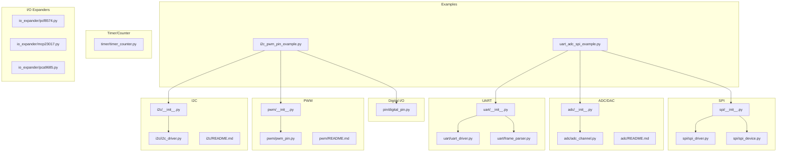
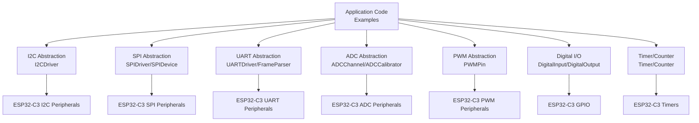
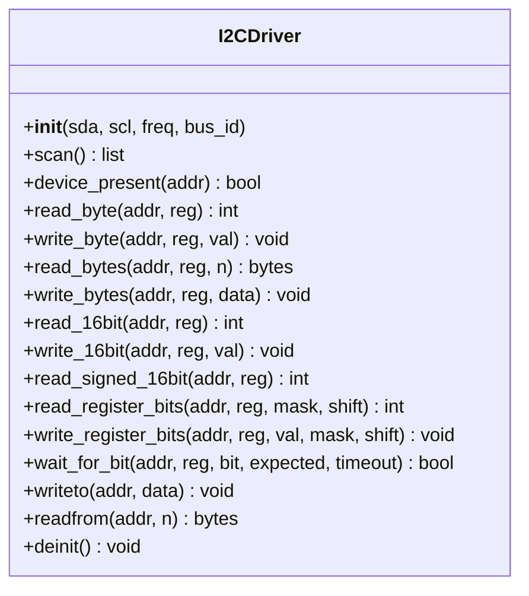
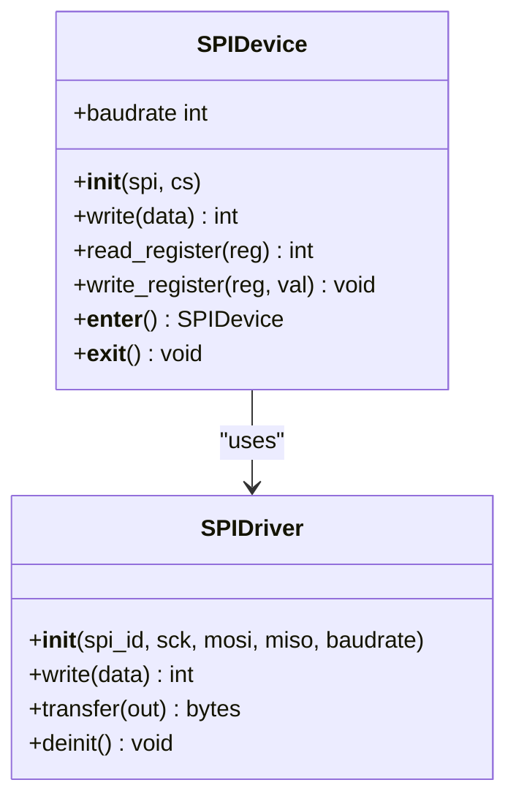
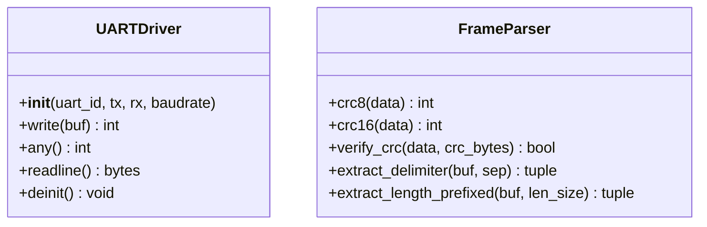
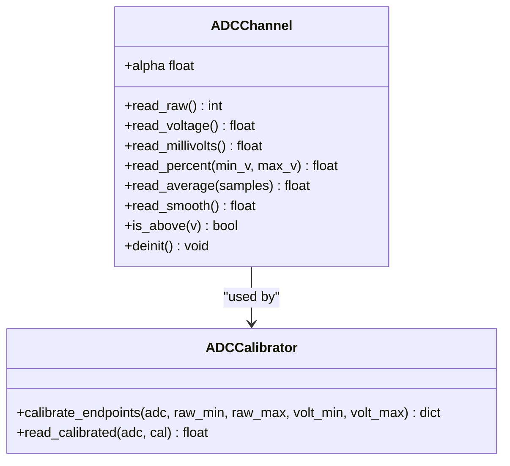
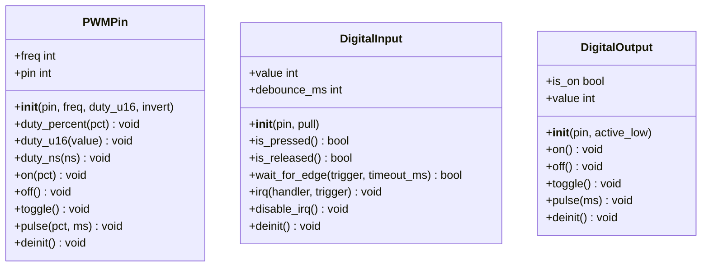
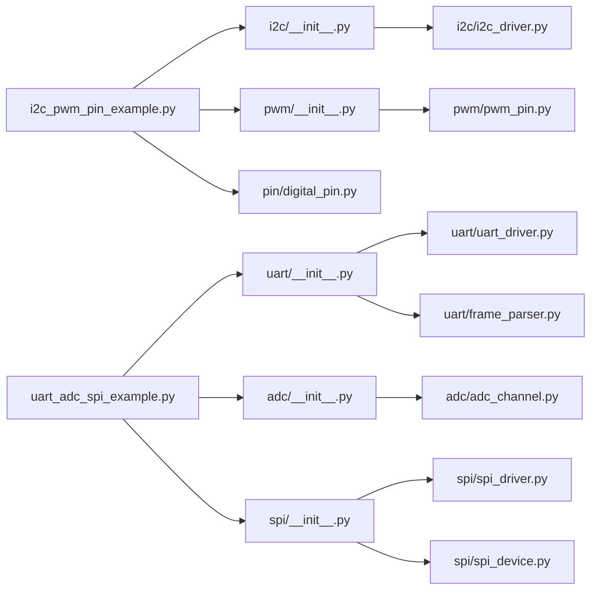

# Hardware Abstraction Layers

<cite>
**Referenced Files in This Document**
- [i2c_pwm_pin_example.py](file://src/main/examples/i2c_pwm_pin_example.py)
- [uart_adc_spi_example.py](file://src/main/examples/uart_adc_spi_example.py)
- [i2c/__init__.py](file://src/lib/i2c/__init__.py)
- [i2c/i2c_driver.py](file://src/lib/i2c/i2c_driver.py)
- [i2c/README.md](file://src/lib/i2c/README.md)
- [pwm/__init__.py](file://src/lib/pwm/__init__.py)
- [pwm/pwm_pin.py](file://src/lib/pwm/pwm_pin.py)
- [pwm/README.md](file://src/lib/pwm/README.md)
- [adc/__init__.py](file://src/lib/adc/__init__.py)
- [adc/adc_channel.py](file://src/lib/adc/adc_channel.py)
- [adc/README.md](file://src/lib/adc/README.md)
- [spi/__init__.py](file://src/lib/spi/__init__.py)
- [spi/spi_driver.py](file://src/lib/spi/spi_driver.py)
- [spi/spi_device.py](file://src/lib/spi/spi_device.py)
- [uart/__init__.py](file://src/lib/uart/__init__.py)
- [uart/uart_driver.py](file://src/lib/uart/uart_driver.py)
- [uart/frame_parser.py](file://src/lib/uart/frame_parser.py)
- [timer/timer_counter.py](file://src/lib/timer/timer_counter.py)
- [io_expander/pcf8574.py](file://src/lib/io_expander/pcf8574.py)
- [io_expander/mcp23017.py](file://src/lib/io_expander/mcp23017.py)
- [io_expander/pca9685.py](file://src/lib/io_expander/pca9685.py)
- [pin/digital_pin.py](file://src/lib/pin/digital_pin.py)
- [device.cfg](file://src/device.cfg)
</cite>

## Table of Contents
1. [Introduction](#introduction)
2. [Project Structure](#project-structure)
3. [Core Components](#core-components)
4. [Architecture Overview](#architecture-overview)
5. [Detailed Component Analysis](#detailed-component-analysis)
6. [Dependency Analysis](#dependency-analysis)
7. [Performance Considerations](#performance-considerations)
8. [Troubleshooting Guide](#troubleshooting-guide)
9. [Conclusion](#conclusion)
10. [Appendices](#appendices)

## Introduction
This document describes the hardware abstraction layers for the ESP32-C3 platform, focusing on I2C, SPI, UART, ADC, DAC, PWM, digital I/O, timers/counters, and I/O expanders. It explains the unified interfaces provided by the framework, demonstrates practical usage patterns via example scripts, and outlines hardware limitations, timing considerations, and best practices for reliable embedded I/O operations.

## Project Structure
The repository organizes hardware abstractions under src/lib/<interface>/ with example usage under src/main/examples/. The examples illustrate end-to-end workflows for I2C/PWM/digital pin and UART/ADC/SPI combinations.

**Diagram sources**
- [i2c_pwm_pin_example.py:1-364](file://src/main/examples/i2c_pwm_pin_example.py#L1-L364)
- [uart_adc_spi_example.py:1-264](file://src/main/examples/uart_adc_spi_example.py#L1-L264)
- [i2c/__init__.py:1-12](file://src/lib/i2c/__init__.py#L1-L12)
- [i2c/i2c_driver.py:1-43](file://src/lib/i2c/i2c_driver.py#L1-L43)
- [spi/__init__.py](file://src/lib/spi/__init__.py)
- [spi/spi_driver.py](file://src/lib/spi/spi_driver.py)
- [spi/spi_device.py](file://src/lib/spi/spi_device.py)
- [uart/__init__.py](file://src/lib/uart/__init__.py)
- [uart/uart_driver.py](file://src/lib/uart/uart_driver.py)
- [uart/frame_parser.py](file://src/lib/uart/frame_parser.py)
- [adc/__init__.py:1-12](file://src/lib/adc/__init__.py#L1-L12)
- [adc/adc_channel.py:1-276](file://src/lib/adc/adc_channel.py#L1-L276)
- [pwm/__init__.py:1-12](file://src/lib/pwm/__init__.py#L1-L12)
- [pwm/pwm_pin.py:1-45](file://src/lib/pwm/pwm_pin.py#L1-L45)
- [timer/timer_counter.py](file://src/lib/timer/timer_counter.py)
- [io_expander/pcf8574.py](file://src/lib/io_expander/pcf8574.py)
- [io_expander/mcp23017.py](file://src/lib/io_expander/mcp23017.py)
- [io_expander/pca9685.py](file://src/lib/io_expander/pca9685.py)
- [pin/digital_pin.py](file://src/lib/pin/digital_pin.py)

**Section sources**
- [i2c_pwm_pin_example.py:1-364](file://src/main/examples/i2c_pwm_pin_example.py#L1-L364)
- [uart_adc_spi_example.py:1-264](file://src/main/examples/uart_adc_spi_example.py#L1-L264)
- [device.cfg:1-16](file://src/device.cfg#L1-L16)

## Core Components
This section summarizes the primary hardware abstraction modules and their roles:

- I2C: Unified bus controller with device scanning, register-level helpers, bit-field manipulation, and raw transfers.
- SPI: Flexible master driver with per-device chip-select management and register-level helpers.
- UART: Stream driver with framing utilities, CRC helpers, and delimiter-based parsing.
- ADC: Channel abstraction with averaging, smoothing, threshold checks, and calibration.
- DAC: Not found in the current repository snapshot; refer to DAC-specific modules if present elsewhere.
- PWM: Pin-level abstraction with frequency control, duty cycle helpers, and pulse generation.
- Digital I/O: Input/output wrappers with debouncing, interrupts, and logical polarity control.
- Timer/Counter: Timing primitives for precise delays and periodic tasks.
- I/O Expanders: PCF8574 (8-bit), MCP23017 (16-bit), PCA9685 (16-channel 12-bit PWM) support.

**Section sources**
- [i2c/i2c_driver.py:24-43](file://src/lib/i2c/i2c_driver.py#L24-L43)
- [spi/spi_driver.py](file://src/lib/spi/spi_driver.py)
- [spi/spi_device.py](file://src/lib/spi/spi_device.py)
- [uart/uart_driver.py](file://src/lib/uart/uart_driver.py)
- [uart/frame_parser.py](file://src/lib/uart/frame_parser.py)
- [adc/adc_channel.py:22-38](file://src/lib/adc/adc_channel.py#L22-L38)
- [pwm/pwm_pin.py:19-45](file://src/lib/pwm/pwm_pin.py#L19-L45)
- [pin/digital_pin.py](file://src/lib/pin/digital_pin.py)
- [timer/timer_counter.py](file://src/lib/timer/timer_counter.py)
- [io_expander/pcf8574.py](file://src/lib/io_expander/pcf8574.py)
- [io_expander/mcp23017.py](file://src/lib/io_expander/mcp23017.py)
- [io_expander/pca9685.py](file://src/lib/io_expander/pca9685.py)

## Architecture Overview
The framework follows a layered pattern:
- Application layer uses high-level wrappers (e.g., I2CDriver, PWMPin).
- Abstraction layer wraps MicroPython machine.* APIs to provide consistent interfaces.
- Hardware layer interacts with ESP32-C3 peripherals (I2C, SPI, UART, ADC, PWM, GPIO).

**Diagram sources**
- [i2c/i2c_driver.py:24-43](file://src/lib/i2c/i2c_driver.py#L24-L43)
- [spi/spi_driver.py](file://src/lib/spi/spi_driver.py)
- [spi/spi_device.py](file://src/lib/spi/spi_device.py)
- [uart/uart_driver.py](file://src/lib/uart/uart_driver.py)
- [uart/frame_parser.py](file://src/lib/uart/frame_parser.py)
- [adc/adc_channel.py:22-38](file://src/lib/adc/adc_channel.py#L22-L38)
- [pwm/pwm_pin.py:19-45](file://src/lib/pwm/pwm_pin.py#L19-L45)
- [pin/digital_pin.py](file://src/lib/pin/digital_pin.py)
- [timer/timer_counter.py](file://src/lib/timer/timer_counter.py)

## Detailed Component Analysis

### I2C Interface
Abstraction pattern:
- Centralized bus management via I2CDriver, enabling shared-bus operation among multiple devices.
- Helpers for byte/16-bit reads/writes, signed values, bit-field RMW, and polling with timeouts.
- Device presence detection and scanning.

Key capabilities demonstrated:
- Device scanning and common address identification.
- Register-level operations with WHO_AM_I, power management, and multi-byte reads.
- Sharing a single bus across multiple sensor drivers.
- Raw transfers for devices without register addressing (e.g., PCF8574).

**Diagram sources**
- [i2c/i2c_driver.py:24-43](file://src/lib/i2c/i2c_driver.py#L24-L43)
- [i2c/README.md:114-146](file://src/lib/i2c/README.md#L114-L146)

Practical usage patterns:
- Scanning and presence checks before register operations.
- Using wait_for_bit for status polling (e.g., BMP280 conversion completion).
- Sharing the same machine.I2C bus with multiple sensor libraries.

**Section sources**
- [i2c_pwm_pin_example.py:20-105](file://src/main/examples/i2c_pwm_pin_example.py#L20-L105)
- [i2c/README.md:47-110](file://src/lib/i2c/README.md#L47-L110)
- [i2c/i2c_driver.py:24-43](file://src/lib/i2c/i2c_driver.py#L24-L43)

### SPI Interface
Abstraction pattern:
- SPIDriver provides hardware SPI configuration and transfer operations.
- SPIDevice encapsulates per-device chip-select management, enabling multiple slaves on a single bus.

Key capabilities demonstrated:
- Basic write and transfer operations.
- Per-device CS control with automatic assertion/deassertion.
- Register-style read/write helpers and context-manager usage.
- Variable baudrate per device.

**Diagram sources**
- [spi/spi_driver.py](file://src/lib/spi/spi_driver.py)
- [spi/spi_device.py](file://src/lib/spi/spi_device.py)

Practical usage patterns:
- Multiple devices sharing the same MOSI/MISO/SCK with separate CS pins.
- Context managers for safe CS handling around transactions.
- Adjusting baudrate per device for compatibility.

**Section sources**
- [uart_adc_spi_example.py:152-210](file://src/main/examples/uart_adc_spi_example.py#L152-L210)
- [spi/spi_driver.py](file://src/lib/spi/spi_driver.py)
- [spi/spi_device.py](file://src/lib/spi/spi_device.py)

### UART Interface
Abstraction pattern:
- UARTDriver provides stream I/O with blocking and non-blocking helpers.
- FrameParser offers CRC computation and delimiter/length-prefixed frame extraction.

Key capabilities demonstrated:
- Basic echo test with loopback verification.
- Frame parsing utilities for CRC validation and delimiters.
- Length-prefixed framing for structured protocols.

**Diagram sources**
- [uart/uart_driver.py](file://src/lib/uart/uart_driver.py)
- [uart/frame_parser.py](file://src/lib/uart/frame_parser.py)

Practical usage patterns:
- Loopback testing for TX/RX connectivity.
- Delimiter-based and length-prefixed framing for robust communication.

**Section sources**
- [uart_adc_spi_example.py:20-76](file://src/main/examples/uart_adc_spi_example.py#L20-L76)
- [uart/uart_driver.py](file://src/lib/uart/uart_driver.py)
- [uart/frame_parser.py](file://src/lib/uart/frame_parser.py)

### ADC Channels
Abstraction pattern:
- ADCChannel provides unified access to analog measurements with raw, voltage, millivolt, and percent conversions.
- Built-in averaging, exponential smoothing, threshold checking, and calibration.

Key capabilities demonstrated:
- Basic and advanced ADC usage including averaging and smoothing.
- Calibration via two-point endpoint mapping and Vref-based calibration.
- Practical sensor patterns (battery, soil moisture, light).

**Diagram sources**
- [adc/adc_channel.py:22-38](file://src/lib/adc/adc_channel.py#L22-L38)
- [adc/adc_channel.py:246-276](file://src/lib/adc/adc_channel.py#L246-L276)

Practical usage patterns:
- Averaging to reduce noise and improve stability.
- Percent-based interpretation for sensor thresholds.
- Calibration for accurate voltage reconstruction.

**Section sources**
- [uart_adc_spi_example.py:81-147](file://src/main/examples/uart_adc_spi_example.py#L81-L147)
- [adc/adc_channel.py:22-38](file://src/lib/adc/adc_channel.py#L22-L38)
- [adc/README.md:66-110](file://src/lib/adc/README.md#L66-L110)

### DAC Channels
DAC support was not located in the current repository snapshot. If DAC functionality exists, it would follow similar abstraction patterns as ADC, providing unified channel access and calibration.

[No sources needed since this section does not analyze specific files]

### PWM and Digital I/O
Abstraction pattern:
- PWMPin provides a unified interface for PWM output with frequency control, duty cycle helpers, and pulse generation.
- DigitalInput/DigitalOutput wrap GPIO with debouncing, interrupts, and logical polarity.

Key capabilities demonstrated:
- LED brightness control via duty percentage and fading.
- Servo control with precise pulse-width mapping.
- Dynamic frequency changes.
- Digital input with interrupt-driven edge detection and debouncing.
- Digital output with active-high/low logic and pulse control.

**Diagram sources**
- [pwm/pwm_pin.py:19-45](file://src/lib/pwm/pwm_pin.py#L19-L45)
- [pin/digital_pin.py](file://src/lib/pin/digital_pin.py)

Practical usage patterns:
- Servo angle control via mapped pulse widths.
- Debounced button handling with IRQ callbacks.
- Logical polarity for relays and LEDs.

**Section sources**
- [i2c_pwm_pin_example.py:153-338](file://src/main/examples/i2c_pwm_pin_example.py#L153-L338)
- [pwm/pwm_pin.py:19-45](file://src/lib/pwm/pwm_pin.py#L19-L45)
- [pwm/README.md:72-133](file://src/lib/pwm/README.md#L72-L133)
- [pin/digital_pin.py](file://src/lib/pin/digital_pin.py)

### Timer and Counter Systems
Timer/counters enable precise timing and periodic tasks. While the example scripts focus on other peripherals, the timer module supports:
- Periodic callbacks and one-shot delays.
- High-resolution timing for I/O operations and scheduling.

[No sources needed since this section does not analyze specific files]

### I/O Expanders
Support for PCF8574, MCP23017, and PCA9685 enables extending GPIO and PWM capabilities over I2C:
- PCF8574: 8-bit port expander for digital I/O.
- MCP23017: 16-bit port expander with interrupt support.
- PCA9685: 16-channel 12-bit PWM generator for motor/servo control.

[No sources needed since this section does not analyze specific files]

## Dependency Analysis
The examples depend on the abstraction modules to orchestrate multi-peripheral workflows. The I2C example coordinates scanning, register operations, and shared-bus usage with sensor drivers. The UART/ADC/SPI example demonstrates framing, ADC calibration, and multi-device SPI management.

**Diagram sources**
- [i2c_pwm_pin_example.py:1-364](file://src/main/examples/i2c_pwm_pin_example.py#L1-L364)
- [uart_adc_spi_example.py:1-264](file://src/main/examples/uart_adc_spi_example.py#L1-L264)
- [i2c/__init__.py:1-12](file://src/lib/i2c/__init__.py#L1-L12)
- [pwm/__init__.py:1-12](file://src/lib/pwm/__init__.py#L1-L12)
- [adc/__init__.py:1-12](file://src/lib/adc/__init__.py#L1-L12)
- [uart/__init__.py](file://src/lib/uart/__init__.py)
- [spi/__init__.py](file://src/lib/spi/__init__.py)

**Section sources**
- [i2c_pwm_pin_example.py:1-364](file://src/main/examples/i2c_pwm_pin_example.py#L1-L364)
- [uart_adc_spi_example.py:1-264](file://src/main/examples/uart_adc_spi_example.py#L1-L264)

## Performance Considerations
- I2C: Use appropriate bus speeds (standard/fast/fast+); switch dynamically for mixed-speed devices. Minimize register polling by leveraging wait_for_bit with reasonable timeouts.
- SPI: Choose baudrates compatible with all slaves; use SPIDevice to avoid manual CS toggling errors.
- UART: Prefer framed protocols with CRC for reliability; use delimiter-based parsing for human-readable logs.
- ADC: Increase averaging samples for noisy signals; apply exponential smoothing for responsive yet stable values; calibrate for accuracy.
- PWM: Match frequency to load characteristics (e.g., 50 Hz for servos). Use duty_u16 for fine control and duty_percent for convenience.
- Digital I/O: Apply debounce for mechanical switches; use IRQ handlers for responsive event handling.
- Timers: Use high-resolution timers for precise delays and periodic tasks; avoid long blocking operations in ISR contexts.

[No sources needed since this section provides general guidance]

## Troubleshooting Guide
Common issues and remedies:
- I2C bus conflicts: Ensure only one I2CDriver instance per physical bus; use device_present checks before register operations.
- Slow device communication: Lower I2C frequency temporarily; use wait_for_bit for status polling.
- SPI CS glitches: Use SPIDevice to manage CS automatically; verify CS pin assignments.
- UART framing errors: Validate delimiter sequences and CRC; confirm loopback connections for echo tests.
- ADC noise: Increase averaging samples; apply smoothing; verify reference voltage and attenuation settings.
- PWM jitter: Avoid changing frequency and duty simultaneously; ensure adequate supply current for loads.
- Digital input bounce: Set debounce intervals; use IRQ triggers for reliable edge detection.
- Timer drift: Recalibrate timing-sensitive tasks; avoid excessive CPU load.

**Section sources**
- [i2c/README.md:139-146](file://src/lib/i2c/README.md#L139-L146)
- [i2c_pwm_pin_example.py:20-105](file://src/main/examples/i2c_pwm_pin_example.py#L20-L105)
- [uart_adc_spi_example.py:20-76](file://src/main/examples/uart_adc_spi_example.py#L20-L76)
- [adc/README.md:66-110](file://src/lib/adc/README.md#L66-L110)
- [pwm/README.md:72-133](file://src/lib/pwm/README.md#L72-L133)

## Conclusion
The ESP32-C3 hardware abstraction layers provide consistent, high-level interfaces over MicroPython’s machine.* APIs. The examples demonstrate practical patterns for I2C scanning and register operations, SPI multi-device management, UART framing and parsing, ADC averaging and calibration, and PWM/digital I/O control. By following the abstraction patterns and best practices outlined here, developers can build reliable, maintainable embedded applications across diverse hardware configurations.

[No sources needed since this section summarizes without analyzing specific files]

## Appendices

### Practical Example References
- I2C/PWM/digital pin example: [i2c_pwm_pin_example.py:1-364](file://src/main/examples/i2c_pwm_pin_example.py#L1-L364)
- UART/ADC/SPI example: [uart_adc_spi_example.py:1-264](file://src/main/examples/uart_adc_spi_example.py#L1-L264)

**Section sources**
- [i2c_pwm_pin_example.py:1-364](file://src/main/examples/i2c_pwm_pin_example.py#L1-L364)
- [uart_adc_spi_example.py:1-264](file://src/main/examples/uart_adc_spi_example.py#L1-L264)