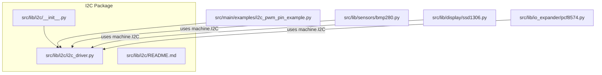
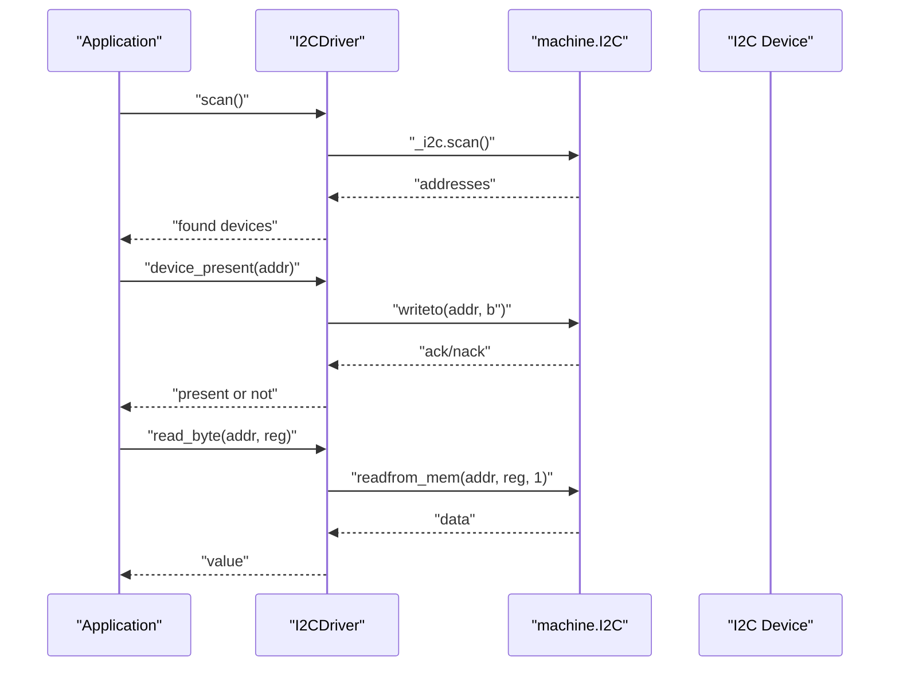
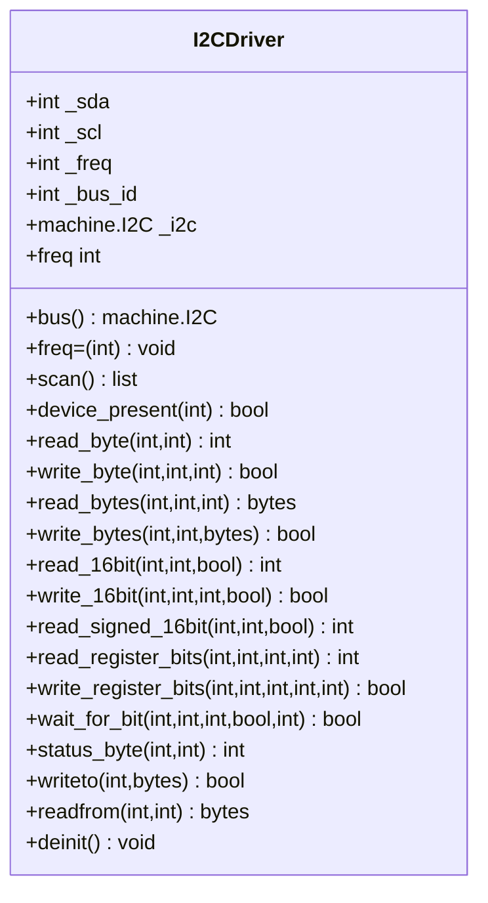
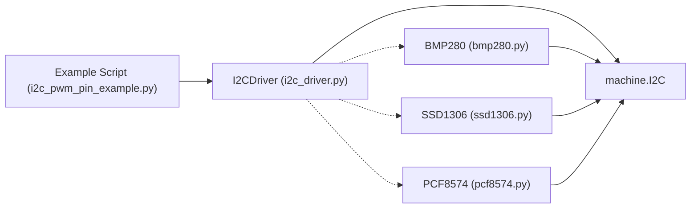

# I2C Interface

<cite>
**Referenced Files in This Document**
- [__init__.py](file://src/lib/i2c/__init__.py)
- [i2c_driver.py](file://src/lib/i2c/i2c_driver.py)
- [README.md](file://src/lib/i2c/README.md)
- [i2c_pwm_pin_example.py](file://src/main/examples/i2c_pwm_pin_example.py)
- [bmp280.py](file://src/lib/sensors/bmp280.py)
- [ssd1306.py](file://src/lib/display/ssd1306.py)
- [pcf8574.py](file://src/lib/io_expander/pcf8574.py)
- [README.md](file://src/lib/README.md)
</cite>

## Table of Contents
1. [Introduction](#introduction)
2. [Project Structure](#project-structure)
3. [Core Components](#core-components)
4. [Architecture Overview](#architecture-overview)
5. [Detailed Component Analysis](#detailed-component-analysis)
6. [Dependency Analysis](#dependency-analysis)
7. [Performance Considerations](#performance-considerations)
8. [Troubleshooting Guide](#troubleshooting-guide)
9. [Conclusion](#conclusion)
10. [Appendices](#appendices)

## Introduction
This document explains the I2C interface implementation for the ESP32-C3 platform within the repository. It focuses on the I2CDriver class, covering initialization parameters, clock speed configuration, device addressing, scanning, and multi-device management patterns. It also documents protocol specifics (SDA/SCL pin configuration, pull-up resistors, and timing), practical examples from the included example script, and best practices for bus topology, signal integrity, and power distribution.

## Project Structure
The I2C subsystem is organized under the library namespace and includes:
- A public package initializer that exposes the I2CDriver class
- The I2CDriver implementation with register helpers and device management
- Example usage demonstrating scanning, register-level operations, and multi-device sharing
- Integration examples with sensor and display drivers that accept a shared I2C bus

**Diagram sources**
- [__init__.py:1-13](file://src/lib/i2c/__init__.py#L1-L13)
- [i2c_driver.py:1-367](file://src/lib/i2c/i2c_driver.py#L1-L367)
- [README.md:1-147](file://src/lib/i2c/README.md#L1-L147)
- [i2c_pwm_pin_example.py:1-364](file://src/main/examples/i2c_pwm_pin_example.py#L1-L364)
- [bmp280.py:1-204](file://src/lib/sensors/bmp280.py#L1-L204)
- [ssd1306.py:160-247](file://src/lib/display/ssd1306.py#L160-L247)
- [pcf8574.py:40-174](file://src/lib/io_expander/pcf8574.py#L40-L174)

**Section sources**
- [__init__.py:1-13](file://src/lib/i2c/__init__.py#L1-L13)
- [README.md:1-147](file://src/lib/i2c/README.md#L1-L147)
- [README.md:1-72](file://src/lib/README.md#L1-L72)

## Core Components
- I2CDriver: A generic I2C bus manager that wraps machine.I2C, providing convenience methods for register-level reads/writes, multi-byte transfers, signed 16-bit values, bit-manipulation helpers, and device presence checks. It supports dynamic frequency changes and exposes the underlying machine.I2C instance for reuse by other drivers.

Key capabilities:
- Initialization with configurable SDA, SCL, frequency, and bus ID
- Device scanning and presence detection
- Byte, multi-byte, and 16-bit register operations
- Signed 16-bit reads
- Bit-level register read-modify-write
- Wait-for-bit with timeout
- Raw I2C writes/reads for devices without register maps
- Deinitialization

**Section sources**
- [i2c_driver.py:24-367](file://src/lib/i2c/i2c_driver.py#L24-L367)

## Architecture Overview
The I2C architecture centers around I2CDriver, which encapsulates a machine.I2C instance and provides a unified API for higher-level drivers. The example script demonstrates scanning, register operations, and multi-device sharing on a single bus.

**Diagram sources**
- [i2c_driver.py:106-134](file://src/lib/i2c/i2c_driver.py#L106-L134)
- [i2c_driver.py:137-166](file://src/lib/i2c/i2c_driver.py#L137-L166)

**Section sources**
- [i2c_driver.py:106-166](file://src/lib/i2c/i2c_driver.py#L106-L166)

## Detailed Component Analysis

### I2CDriver Class
I2CDriver encapsulates a machine.I2C bus and provides a rich set of helpers for register-level operations, bit manipulation, and device presence checks. It supports:
- Initialization with SDA, SCL, frequency, and bus ID
- Dynamic frequency adjustment via property setter
- Device scanning and presence checks
- Byte, multi-byte, and 16-bit register operations
- Signed 16-bit reads
- Bit-level register read-modify-write
- Wait-for-bit with timeout
- Raw I2C writes/reads for devices without register maps
- Deinitialization

**Diagram sources**
- [i2c_driver.py:24-367](file://src/lib/i2c/i2c_driver.py#L24-L367)

**Section sources**
- [i2c_driver.py:24-367](file://src/lib/i2c/i2c_driver.py#L24-L367)

### Device Scanning and Presence Detection
- Scanning: The scan method returns a list of discovered I2C addresses and prints friendly names for known devices.
- Presence detection: device_present performs a minimal write transaction to probe for a device at a given address.

Practical usage is demonstrated in the example script, which scans for common devices and reports results.

**Section sources**
- [i2c_driver.py:106-134](file://src/lib/i2c/i2c_driver.py#L106-L134)
- [i2c_pwm_pin_example.py:20-51](file://src/main/examples/i2c_pwm_pin_example.py#L20-L51)

### Register-Level Operations and Bit Manipulation
I2CDriver provides helpers for:
- Single-byte register reads/writes
- Multi-byte burst reads/writes
- 16-bit register reads/writes (big/little endian)
- Signed 16-bit reads
- Bit-level register read-modify-write with mask and shift
- Wait-for-bit with timeout for status polling

These operations are demonstrated in the example script for devices like MPU6050, INA219, and BMP280.

**Section sources**
- [i2c_driver.py:137-326](file://src/lib/i2c/i2c_driver.py#L137-L326)
- [i2c_pwm_pin_example.py:56-106](file://src/main/examples/i2c_pwm_pin_example.py#L56-L106)

### Multi-Device Management and Shared Bus Patterns
The example script demonstrates sharing a single I2C bus among multiple devices by passing the raw machine.I2C instance to external drivers. This avoids duplicating I2C instances, reduces RAM usage, and prevents bus conflicts.

Integration examples:
- Sensors: BMP280 and MPU6050 drivers accept an existing machine.I2C instance
- Display: SSD1306 driver accepts an existing machine.I2C instance
- IO Expander: PCF8574 driver accepts an existing machine.I2C instance

**Section sources**
- [i2c_pwm_pin_example.py:111-147](file://src/main/examples/i2c_pwm_pin_example.py#L111-L147)
- [bmp280.py:52-76](file://src/lib/sensors/bmp280.py#L52-L76)
- [ssd1306.py:167-180](file://src/lib/display/ssd1306.py#L167-L180)
- [pcf8574.py:47-68](file://src/lib/io_expander/pcf8574.py#L47-L68)

### Protocol Details and Wiring
- Default pins for ESP32-C3 I2C0: SDA on GPIO21, SCL on GPIO22
- Pull-up resistors: Recommended 4.7kΩ on both SDA and SCL
- Speeds: Standard mode (100 kHz), Fast mode (400 kHz), Fast+ mode (1 MHz)
- Bus arbitration: I2C handles multi-master arbitration automatically; ensure only one master drives the bus at a time during transactions

**Section sources**
- [README.md:19-21](file://src/lib/i2c/README.md#L19-L21)
- [README.md:143-146](file://src/lib/i2c/README.md#L143-L146)

### Practical Examples from i2c_pwm_pin_example.py
- I2C bus scan: Demonstrates initializing I2CDriver, scanning for devices, and printing friendly names for common addresses
- Register operations: Shows WHO_AM_I checks, waking up devices, reading 16-bit values, and bit manipulation
- Multi-device sharing: Initializes multiple drivers with the same machine.I2C bus instance and reads from each sensor
- Raw I2C: Demonstrates writeto/readfrom for devices without register maps (e.g., PCF8574)

**Section sources**
- [i2c_pwm_pin_example.py:18-51](file://src/main/examples/i2c_pwm_pin_example.py#L18-L51)
- [i2c_pwm_pin_example.py:56-106](file://src/main/examples/i2c_pwm_pin_example.py#L56-L106)
- [i2c_pwm_pin_example.py:111-147](file://src/main/examples/i2c_pwm_pin_example.py#L111-L147)

## Dependency Analysis
I2CDriver depends on machine.I2C for hardware-level operations and uses standard Python constructs for timeouts and bit manipulation. Higher-level drivers integrate with I2CDriver by accepting either a machine.I2C instance or an I2CDriver instance and using its bus property.

**Diagram sources**
- [i2c_driver.py:14-21](file://src/lib/i2c/i2c_driver.py#L14-L21)
- [i2c_pwm_pin_example.py:1-364](file://src/main/examples/i2c_pwm_pin_example.py#L1-L364)
- [bmp280.py:10-12](file://src/lib/sensors/bmp280.py#L10-L12)
- [ssd1306.py:160-176](file://src/lib/display/ssd1306.py#L160-L176)
- [pcf8574.py:40-56](file://src/lib/io_expander/pcf8574.py#L40-L56)

**Section sources**
- [i2c_driver.py:14-21](file://src/lib/i2c/i2c_driver.py#L14-L21)
- [i2c_pwm_pin_example.py:1-364](file://src/main/examples/i2c_pwm_pin_example.py#L1-L364)
- [bmp280.py:10-12](file://src/lib/sensors/bmp280.py#L10-L12)
- [ssd1306.py:160-176](file://src/lib/display/ssd1306.py#L160-L176)
- [pcf8574.py:40-56](file://src/lib/io_expander/pcf8574.py#L40-L56)

## Performance Considerations
- Frequency selection: Use 400 kHz for most sensors and displays; switch to 100 kHz for slow devices or noisy environments
- Burst operations: Prefer multi-byte reads/writes to reduce overhead
- Bit manipulation: Use read_register_bits and write_register_bits to minimize RMW operations
- Polling vs interrupts: For status polling, use wait_for_bit with reasonable timeouts to avoid blocking the event loop
- Power sequencing: Initialize I2CDriver once and reuse across tasks; deinitialize when shutting down

[No sources needed since this section provides general guidance]

## Troubleshooting Guide
Common issues and resolutions:
- No devices found during scan: Verify wiring, pull-up resistors, and power; confirm device addresses
- Timing violations: Reduce frequency to 100 kHz; ensure adequate pull-up resistance
- Device detection problems: Use device_present to probe; handle OSError gracefully
- Bus conflicts: Ensure only one master drives the bus; avoid sharing I2C pins with other peripherals without isolation
- Signal integrity: Keep traces short, avoid long runs, and use proper grounding; consider ferrite beads near the bus

**Section sources**
- [i2c_driver.py:106-134](file://src/lib/i2c/i2c_driver.py#L106-L134)
- [i2c_driver.py:293-320](file://src/lib/i2c/i2c_driver.py#L293-L320)
- [README.md:143-146](file://src/lib/i2c/README.md#L143-L146)

## Conclusion
The I2C implementation provides a robust, high-level abstraction over machine.I2C with convenient helpers for register-level operations, bit manipulation, and device presence checks. The example script demonstrates practical usage patterns for scanning, register operations, and multi-device sharing on a single bus. Following the protocol guidelines and best practices ensures reliable operation in real-world embedded applications.

[No sources needed since this section summarizes without analyzing specific files]

## Appendices

### API Reference Summary
- I2CDriver constructor: sda, scl, freq, bus_id
- Bus management: bus property, freq getter/setter, deinit
- Scanning: scan(), device_present()
- Register operations: read_byte(), write_byte(), read_bytes(), write_bytes()
- 16-bit operations: read_16bit(), write_16bit(), read_signed_16bit()
- Bit manipulation: read_register_bits(), write_register_bits()
- Status/wait: wait_for_bit(), status_byte()
- Raw I2C: writeto(), readfrom()

**Section sources**
- [README.md:114-136](file://src/lib/i2c/README.md#L114-L136)
- [i2c_driver.py:64-102](file://src/lib/i2c/i2c_driver.py#L64-L102)
- [i2c_driver.py:106-326](file://src/lib/i2c/i2c_driver.py#L106-L326)