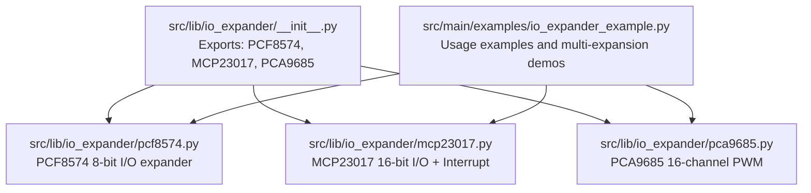
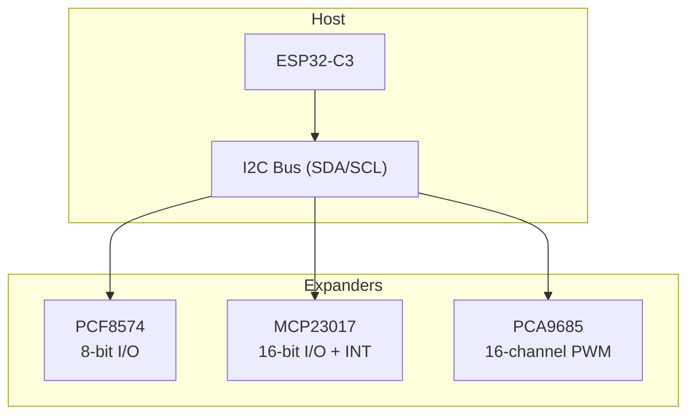
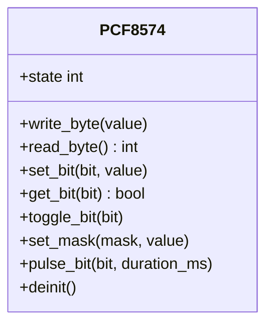
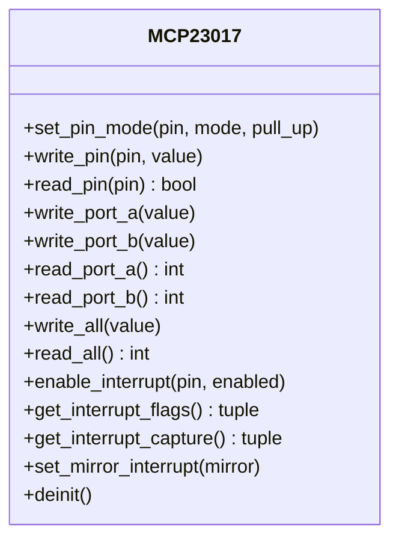
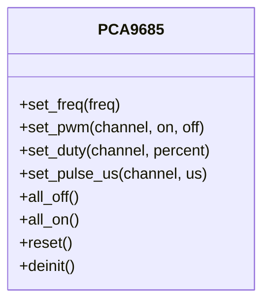
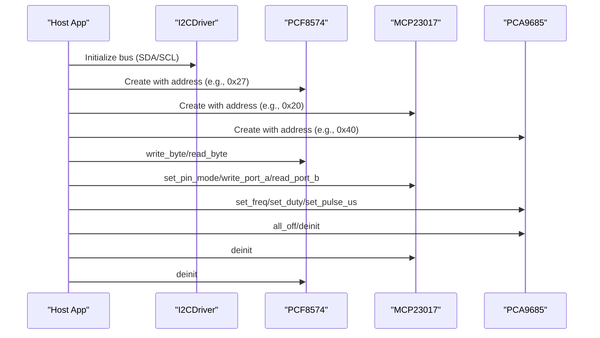
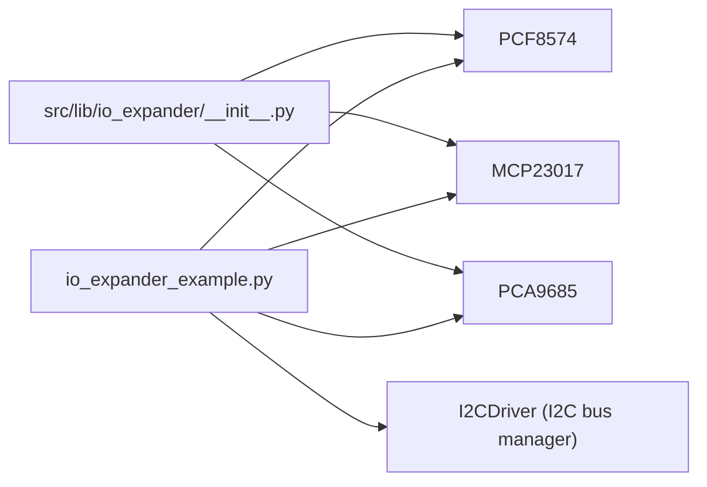

# I/O Expanders

<cite>
**Referenced Files in This Document**
- [__init__.py](file://src/lib/io_expander/__init__.py)
- [pcf8574.py](file://src/lib/io_expander/pcf8574.py)
- [mcp23017.py](file://src/lib/io_expander/mcp23017.py)
- [pca9685.py](file://src/lib/io_expander/pca9685.py)
- [README.md](file://src/lib/io_expander/README.md)
- [io_expander_example.py](file://src/main/examples/io_expander_example.py)
- [i2c_driver.py](file://src/lib/i2c/i2c_driver.py)
- [README.md](file://src/lib/i2c/README.md)
</cite>

## Table of Contents
1. [Introduction](#introduction)
2. [Project Structure](#project-structure)
3. [Core Components](#core-components)
4. [Architecture Overview](#architecture-overview)
5. [Detailed Component Analysis](#detailed-component-analysis)
6. [Dependency Analysis](#dependency-analysis)
7. [Performance Considerations](#performance-considerations)
8. [Troubleshooting Guide](#troubleshooting-guide)
9. [Conclusion](#conclusion)
10. [Appendices](#appendices)

## Introduction
This document provides comprehensive documentation for I/O expander modules implemented in the repository: PCF8574, MCP23017, and PCA9685. It explains address configuration for PCF8574 devices, register mapping and interrupt handling for MCP23017, and PCA9685 PWM control including frequency configuration. Practical examples from io_expander_example.py demonstrate multi-expansion scenarios and daisy-chaining techniques. Common issues such as address conflicts, register corruption, and timing limitations are addressed along with best practices for I/O expansion topology, signal routing, and power distribution in large-scale I/O applications.

## Project Structure
The I/O expander drivers are organized under src/lib/io_expander with a public package entry point and individual implementations for each chip. Example usage is provided under src/main/examples.

**Diagram sources**
- [__init__.py:11-13](file://src/lib/io_expander/__init__.py#L11-L13)
- [pcf8574.py:24-46](file://src/lib/io_expander/pcf8574.py#L24-L46)
- [mcp23017.py:48-68](file://src/lib/io_expander/mcp23017.py#L48-L68)
- [pca9685.py:49-68](file://src/lib/io_expander/pca9685.py#L49-L68)
- [io_expander_example.py:1-344](file://src/main/examples/io_expander_example.py#L1-L344)

**Section sources**
- [__init__.py:1-14](file://src/lib/io_expander/__init__.py#L1-L14)
- [io_expander_example.py:1-344](file://src/main/examples/io_expander_example.py#L1-L344)

## Core Components
- PCF8574: An 8-bit I/O expander accessed via I2C with address range 0x20–0x27 (A0–A2 configurable) and optional 0x38–0x3F range for PCF8574A. Provides byte-level and bit-level operations suitable for LCD backpacks and GPIO expansion.
- MCP23017: A 16-bit I/O expander with two 8-bit ports (PORTA/PORTB), interrupt-on-change capability, and pull-up resistors. Supports mirrored interrupts and 16-bit register operations.
- PCA9685: A 16-channel 12-bit PWM controller with software-configurable frequency (24–1526 Hz), duty cycle control, and pulse-width control for servo applications. Includes global on/off controls and sleep mode.

**Section sources**
- [pcf8574.py:9-11](file://src/lib/io_expander/pcf8574.py#L9-L11)
- [mcp23017.py:19-45](file://src/lib/io_expander/mcp23017.py#L19-L45)
- [pca9685.py:9-10](file://src/lib/io_expander/pca9685.py#L9-L10)
- [README.md:157-165](file://src/lib/io_expander/README.md#L157-L165)

## Architecture Overview
The drivers expose a unified interface for I2C-based I/O expansion. Each driver encapsulates register-level operations and exposes high-level methods for common tasks. The examples demonstrate how to combine multiple expanders on a single I2C bus and coordinate their operation.

**Diagram sources**
- [io_expander_example.py:325-343](file://src/main/examples/io_expander_example.py#L325-L343)
- [__init__.py:11-13](file://src/lib/io_expander/__init__.py#L11-L13)

## Detailed Component Analysis

### PCF8574 — 8-bit I/O Expander
- Address configuration: A0–A2 pins configure the I2C address within 0x20–0x27 (or 0x38–0x3F for PCF8574A). The driver accepts an address parameter and initializes the output state.
- Operations:
  - Byte-level: write_byte/read_byte for simultaneous control of all 8 pins.
  - Bit-level: set_bit/get_bit/toggle_bit for individual pin control.
  - Masked writes: set_mask performs read-modify-write on selected bits.
  - Pulse control: pulse_bit generates short pulses on a single pin.
- Typical use: LCD backpack control (backlight, enable, register select) and general-purpose GPIO expansion.

**Diagram sources**
- [pcf8574.py:71-173](file://src/lib/io_expander/pcf8574.py#L71-L173)

**Section sources**
- [pcf8574.py:24-173](file://src/lib/io_expander/pcf8574.py#L24-L173)
- [io_expander_example.py:21-62](file://src/main/examples/io_expander_example.py#L21-L62)
- [io_expander_example.py:68-107](file://src/main/examples/io_expander_example.py#L68-L107)

### MCP23017 — 16-bit I/O with Interrupts
- Address configuration: A0–A2 pins set the I2C address within 0x20–0x27. Default address is 0x20 when all address pins are grounded.
- Register mapping highlights:
  - IODIRA/IODIRB: Direction selection (input/output).
  - GPINTENA/GPINTENB: Interrupt-on-change enable per pin.
  - DEFVALA/DEFVALB: Default comparison value for change detection.
  - INTCONA/INTCONB: Interrupt control (compare previous/defval).
  - IOCON: Configuration register (mirroring interrupts supported).
  - GPPUA/GPPUB: Internal pull-up enable per pin.
  - INTFA/INTFB: Interrupt flags indicating which pins caused interrupts.
  - INTCAPA/INTCAPB: Captured GPIO values when interrupt occurred.
  - GPIOA/GPIOB: Current logic levels.
  - OLATA/OLATB: Output latches controlling pins.
- Port operations:
  - write_port_a/write_port_b and read_port_a/read_port_b for 8-bit operations.
  - write_all/read_all for 16-bit operations.
- Interrupt handling:
  - enable_interrupt(pin, enabled): Enable/disable interrupt-on-change per pin.
  - get_interrupt_flags(): Returns interrupt flags for PORTA and PORTB.
  - get_interrupt_capture(): Returns captured PORTA/PORTB values at interrupt time.
  - set_mirror_interrupt(mirror): Mirrors INTA and INTB outputs.

**Diagram sources**
- [mcp23017.py:48-261](file://src/lib/io_expander/mcp23017.py#L48-L261)

**Section sources**
- [mcp23017.py:19-45](file://src/lib/io_expander/mcp23017.py#L19-L45)
- [mcp23017.py:48-261](file://src/lib/io_expander/mcp23017.py#L48-L261)
- [io_expander_example.py:113-161](file://src/main/examples/io_expander_example.py#L113-L161)
- [io_expander_example.py:167-207](file://src/main/examples/io_expander_example.py#L167-L207)

### PCA9685 — 16-channel PWM Controller
- Address configuration: A0–A5 pins configure the I2C address within 0x40–0x7F. Default address is 0x40 when all address pins are grounded.
- PWM control:
  - set_freq(freq): Sets the PWM frequency in Hz (typical 24–1526 Hz).
  - set_pwm(channel, on, off): Directly sets 12-bit on/off counts.
  - set_duty(channel, percent): Sets duty cycle percentage (0.0–100.0).
  - set_pulse_us(channel, us): Sets pulse width in microseconds (useful for servo control).
  - all_off()/all_on(): Global control for all channels.
- Operation:
  - Internally calculates prescaler based on 25 MHz oscillator and restarts the oscillator after frequency changes.
  - Sleep mode via MODE1 sleep bit for power-down.

**Diagram sources**
- [pca9685.py:49-197](file://src/lib/io_expander/pca9685.py#L49-L197)

**Section sources**
- [pca9685.py:9-10](file://src/lib/io_expander/pca9685.py#L9-L10)
- [pca9685.py:49-197](file://src/lib/io_expander/pca9685.py#L49-L197)
- [io_expander_example.py:213-273](file://src/main/examples/io_expander_example.py#L213-L273)
- [io_expander_example.py:279-319](file://src/main/examples/io_expander_example.py#L279-L319)

### Practical Examples and Multi-Expansion Scenarios
- PCF8574 basics and LCD backpack pattern: Demonstrates byte/bit operations and enabling backlight and strobing enable for LCD control.
- MCP23017 basics and interrupts: Shows configuring ports A/B, writing outputs, reading inputs, 16-bit operations, and polling interrupt flags/captures.
- PCA9685 servo and LED arrays: Demonstrates setting 50 Hz for servos, converting angles to pulse widths, and controlling multiple LEDs at 1 kHz.

**Diagram sources**
- [io_expander_example.py:21-62](file://src/main/examples/io_expander_example.py#L21-L62)
- [io_expander_example.py:113-161](file://src/main/examples/io_expander_example.py#L113-L161)
- [io_expander_example.py:213-273](file://src/main/examples/io_expander_example.py#L213-L273)
- [io_expander_example.py:279-319](file://src/main/examples/io_expander_example.py#L279-L319)

**Section sources**
- [io_expander_example.py:1-344](file://src/main/examples/io_expander_example.py#L1-L344)

## Dependency Analysis
- Package exports: The package initializer re-exports the three drivers for convenient import.
- Example usage: The example script demonstrates importing and instantiating each driver, scanning for devices, and performing operations.
- I2C driver integration: The examples use I2CDriver to manage the I2C bus and detect device presence before interacting with expanders.

**Diagram sources**
- [__init__.py:11-13](file://src/lib/io_expander/__init__.py#L11-L13)
- [io_expander_example.py:27-38](file://src/main/examples/io_expander_example.py#L27-L38)
- [README.md:25-43](file://src/lib/i2c/README.md#L25-L43)

**Section sources**
- [__init__.py:1-14](file://src/lib/io_expander/__init__.py#L1-L14)
- [io_expander_example.py:1-344](file://src/main/examples/io_expander_example.py#L1-L344)
- [README.md:1-147](file://src/lib/i2c/README.md#L1-L147)

## Performance Considerations
- Frequency tuning: The I2CDriver supports dynamic bus frequency adjustment. Lower frequencies can improve reliability on long or noisy buses.
- Burst operations: Use 16-bit register operations (e.g., MCP23017 write_all/read_all) to minimize I2C transactions when updating many pins.
- Interrupt-driven I/O: Prefer MCP23017 interrupts for event-driven input monitoring to reduce polling overhead.
- PWM granularity: For LED control, higher frequencies (e.g., 1 kHz) reduce visible flicker; for servos, standard 50 Hz is typical.
- Power distribution: PCA9685 logic operates at 3.3 V while external loads (e.g., servo motors) may require separate 5 V–6 V power; ensure proper decoupling capacitors and local bypassing near the expander.

[No sources needed since this section provides general guidance]

## Troubleshooting Guide
Common issues and resolutions:
- Address conflicts:
  - Verify I2C addresses using scan and device_present checks before initialization. The I2CDriver provides helpers to detect devices.
  - Confirm A0–A2 (PCF8574/PCF8574A/MCP23017) or A0–A5 (PCA9685) wiring to avoid overlaps.
- Register corruption:
  - Use read-modify-write patterns (e.g., set_mask) to avoid unintended bit toggles.
  - Reinitialize devices via reset or deinit sequences when encountering unexpected states.
- Timing limitations:
  - Reduce I2C bus speed for long traces or noisy environments.
  - Ensure adequate pull-up resistors (typical 4.7 kΩ) on SDA and SCL.
- Interrupt handling:
  - Clear interrupt flags and capture registers by reading them after detecting an interrupt.
  - Configure mirror interrupts appropriately if using a single interrupt line.
- PCA9685 power and signal integrity:
  - Keep logic and load power supplies separate; use external power for motors and decoupling capacitors.
  - Avoid sharing long signal traces for multiple PCA9685 units without proper termination or isolation.

**Section sources**
- [README.md:31-43](file://src/lib/i2c/README.md#L31-L43)
- [io_expander_example.py:32-36](file://src/main/examples/io_expander_example.py#L32-L36)
- [io_expander_example.py:178-182](file://src/main/examples/io_expander_example.py#L178-L182)
- [io_expander_example.py:224-228](file://src/main/examples/io_expander_example.py#L224-L228)
- [mcp23017.py:231-245](file://src/lib/io_expander/mcp23017.py#L231-L245)
- [pca9685.py:177-196](file://src/lib/io_expander/pca9685.py#L177-L196)

## Conclusion
The I/O expander drivers provide robust, high-level abstractions for PCF8574, MCP23017, and PCA9685 over I2C. They enable scalable GPIO expansion, interrupt-driven input monitoring, and precise multi-channel PWM control. By following the address configuration guidelines, leveraging the provided examples, and applying the best practices outlined here, you can build reliable and maintainable I/O expansion topologies for a wide range of applications.

[No sources needed since this section summarizes without analyzing specific files]

## Appendices

### Address Configuration Reference
- PCF8574: 0x20–0x27 (A0–A2); PCF8574A: 0x38–0x3F (A0–A2)
- MCP23017: 0x20–0x27 (A0–A2)
- PCA9685: 0x40–0x7F (A0–A5)

**Section sources**
- [README.md:157-165](file://src/lib/io_expander/README.md#L157-L165)
- [pcf8574.py:9-11](file://src/lib/io_expander/pcf8574.py#L9-L11)
- [mcp23017.py:57-58](file://src/lib/io_expander/mcp23017.py#L57-L58)
- [pca9685.py:9-10](file://src/lib/io_expander/pca9685.py#L9-L10)

### Best Practices for Large-Scale I/O Applications
- Topology:
  - Use a single I2C bus with unique addresses per expander; avoid daisy-chaining I2C devices like PCF8574 chains (not applicable).
  - For high-channel-count needs, prefer PCA9685 for PWM and MCP23017 for general I/O.
- Signal routing:
  - Keep SDA/SCL traces short and matched; route clock and data close to the host.
  - Use twisted pairs for long runs to mitigate noise.
- Power distribution:
  - Provide local decoupling capacitors (e.g., 0.1 µF ceramic) near each expander.
  - Separate logic power (3.3 V) from load power (e.g., 5 V–6 V for motors) with dedicated planes.
- Thermal and mechanical:
  - Ensure adequate heat sinking for high-current loads.
  - Secure connections with proper crimping or soldering; use PCB mounting for reliability.

[No sources needed since this section provides general guidance]