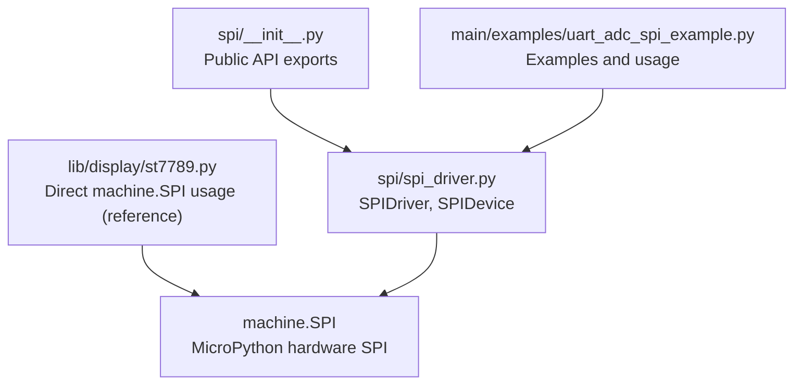
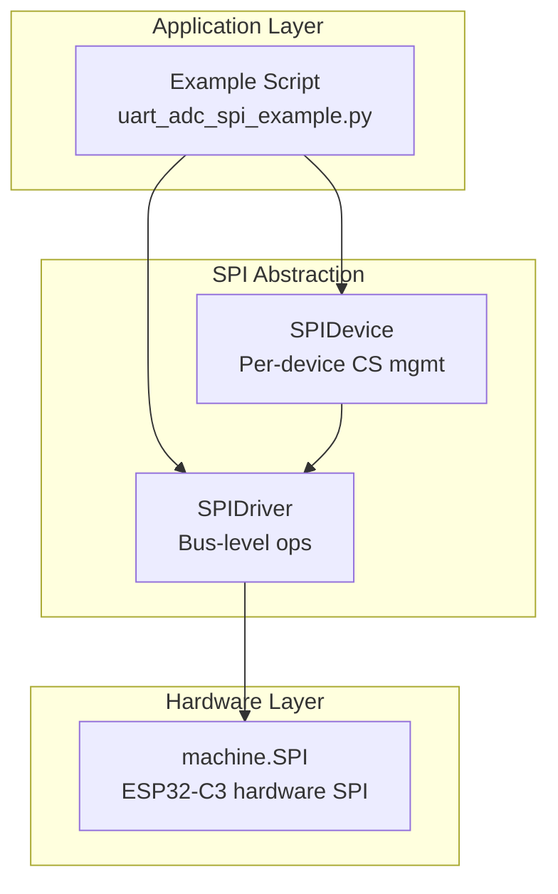
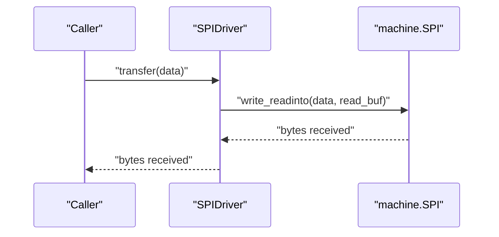
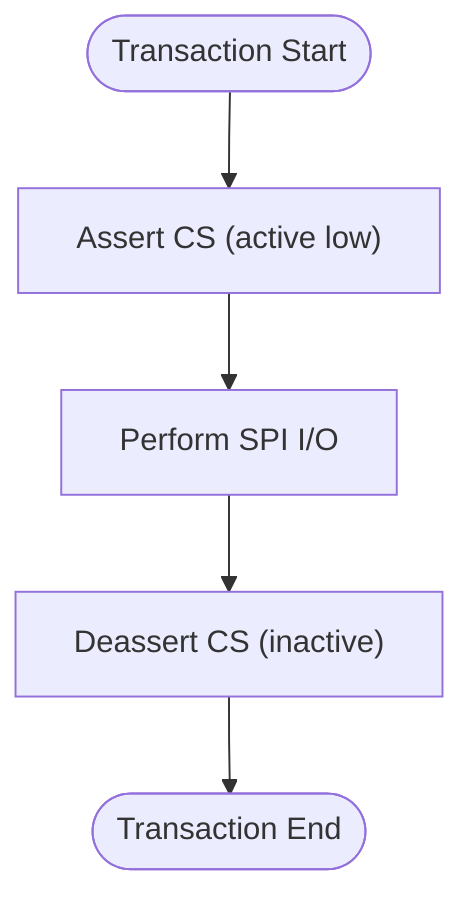
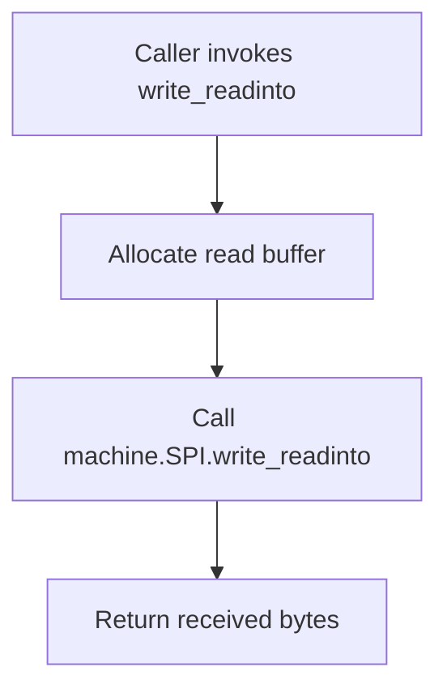
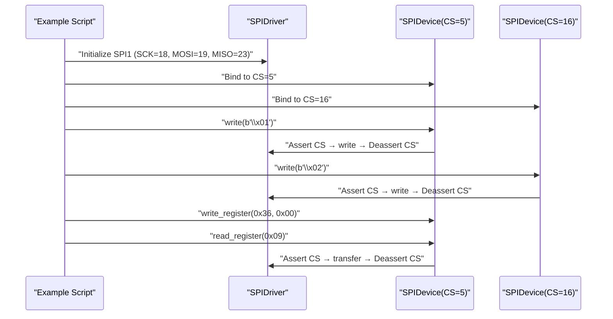
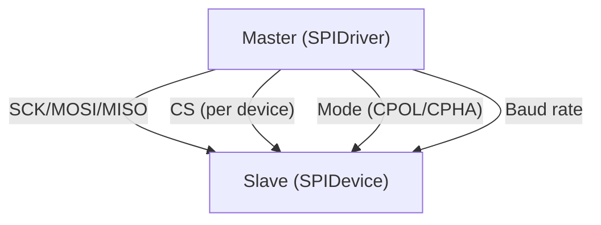
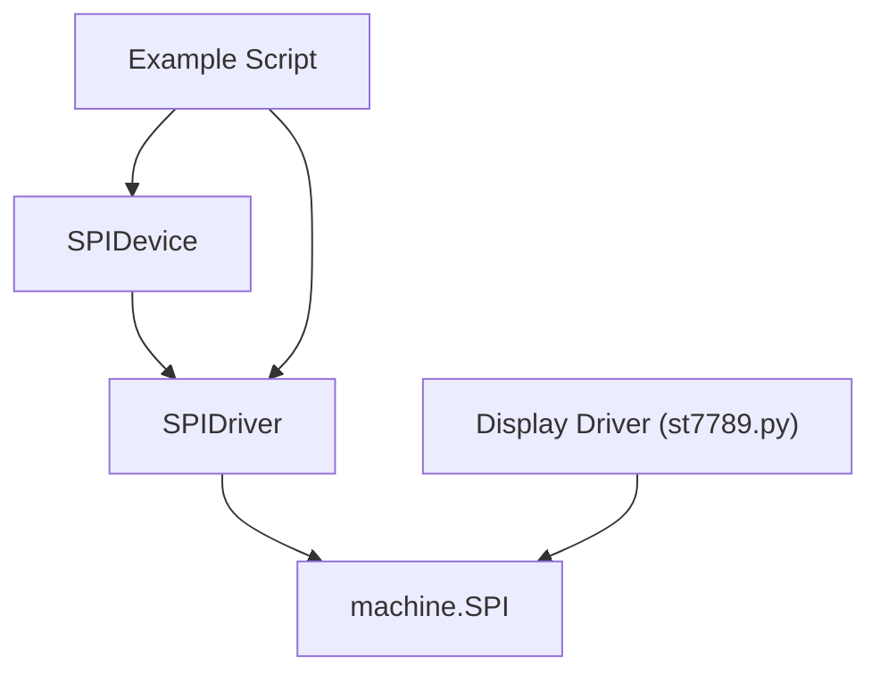

# SPI Interface

<cite>
**Referenced Files in This Document**
- [spi_driver.py](file://src/lib/spi/spi_driver.py)
- [__init__.py](file://src/lib/spi/__init__.py)
- [README.md](file://src/lib/spi/README.md)
- [uart_adc_spi_example.py](file://src/main/examples/uart_adc_spi_example.py)
- [st7789.py](file://src/lib/display/st7789.py)
</cite>

## Table of Contents
1. [Introduction](#introduction)
2. [Project Structure](#project-structure)
3. [Core Components](#core-components)
4. [Architecture Overview](#architecture-overview)
5. [Detailed Component Analysis](#detailed-component-analysis)
6. [Dependency Analysis](#dependency-analysis)
7. [Performance Considerations](#performance-considerations)
8. [Troubleshooting Guide](#troubleshooting-guide)
9. [Conclusion](#conclusion)
10. [Appendices](#appendices)

## Introduction
This document explains the SPI interface implementation for ESP32-C3, focusing on both master and slave modes, hardware SPI configuration, clock polarity/phase settings, and data frame formats. It documents the SPIDriver class for bus-level operations and the SPIDevice abstraction for managing individual slave devices with automatic chip-select handling and per-device mode configuration. Practical examples from the provided example script demonstrate initialization and data transfer sequences. Common SPI issues such as clock phase mismatches, chip-select timing problems, and data corruption are addressed, along with best practices for bus design, signal routing, and device prioritization in multi-slave configurations.

## Project Structure
The SPI implementation consists of:
- A public module exposing SPIDriver and SPIDevice
- An internal driver implementation with full duplex transfer and CS management
- Example usage demonstrating bus-level and per-device operations
- Supporting display driver that uses machine.SPI directly for reference

**Diagram sources**
- [__init__.py:1-13](file://src/lib/spi/__init__.py#L1-L13)
- [spi_driver.py:1-288](file://src/lib/spi/spi_driver.py#L1-L288)
- [uart_adc_spi_example.py:1-264](file://src/main/examples/uart_adc_spi_example.py#L1-L264)
- [st7789.py:1-200](file://src/lib/display/st7789.py#L1-L200)

**Section sources**
- [__init__.py:1-13](file://src/lib/spi/__init__.py#L1-L13)
- [spi_driver.py:1-288](file://src/lib/spi/spi_driver.py#L1-L288)
- [README.md:1-151](file://src/lib/spi/README.md#L1-L151)
- [uart_adc_spi_example.py:1-264](file://src/main/examples/uart_adc_spi_example.py#L1-L264)
- [st7789.py:1-200](file://src/lib/display/st7789.py#L1-L200)

## Core Components
- SPIDriver: Abstraction over machine.SPI providing bus-level read/write/transfer and dynamic baudrate configuration. Supports SPI mode selection via polarity and phase, and configurable first bit order.
- SPIDevice: Per-device wrapper that manages chip-select (CS) automatically, enabling safe multi-slave operation on a shared bus. Provides convenience methods for register read/write and full-duplex transfers.

Key capabilities:
- Hardware SPI pin mapping: flexible GPIO assignment for SCK, MOSI, MISO
- Baud rate configuration: adjustable per bus and per device
- Full-duplex communication: simultaneous send and receive
- Chip-select management: automatic CS assertion/deassertion around transactions
- SPI mode support: CPOL/CPHA selection for compatibility with slave devices

**Section sources**
- [spi_driver.py:22-144](file://src/lib/spi/spi_driver.py#L22-L144)
- [spi_driver.py:146-288](file://src/lib/spi/spi_driver.py#L146-L288)
- [README.md:114-151](file://src/lib/spi/README.md#L114-L151)

## Architecture Overview
The SPI stack sits atop MicroPython’s machine.SPI and provides:
- Bus-level operations (SPIDriver)
- Per-device abstractions with CS management (SPIDevice)
- Example-driven usage patterns for both master and multi-slave scenarios

**Diagram sources**
- [spi_driver.py:22-144](file://src/lib/spi/spi_driver.py#L22-L144)
- [spi_driver.py:146-288](file://src/lib/spi/spi_driver.py#L146-L288)
- [uart_adc_spi_example.py:150-210](file://src/main/examples/uart_adc_spi_example.py#L150-L210)

## Detailed Component Analysis

### SPIDriver: Bus-Level SPI Operations
Responsibilities:
- Initialize machine.SPI with configurable SPI ID, baudrate, SCK/MOSI/MISO pins, polarity, phase, and firstbit
- Provide write, read, write_readinto, and transfer methods for full-duplex operations
- Allow dynamic baudrate updates by reinitializing the underlying SPI peripheral
- Expose the raw machine.SPI instance for advanced use cases

Configuration highlights:
- SPI ID: 1 or 2 (SPI0 reserved for internal flash)
- Baud rate: 1 MHz to 80 MHz (recommended 10–40 MHz for displays)
- First bit: MSB by default
- Polarity and phase: configurable for SPI modes

Full-duplex transfer flow:

**Diagram sources**
- [spi_driver.py:118-136](file://src/lib/spi/spi_driver.py#L118-L136)

**Section sources**
- [spi_driver.py:42-96](file://src/lib/spi/spi_driver.py#L42-L96)
- [spi_driver.py:100-136](file://src/lib/spi/spi_driver.py#L100-L136)
- [README.md:141-151](file://src/lib/spi/README.md#L141-L151)

### SPIDevice: Per-Device CS Management
Responsibilities:
- Bind a SPIDriver to a specific chip-select pin
- Automatically assert CS before transactions and deassert after completion
- Provide context-manager support for scoped CS control
- Offer convenience methods for register read/write and full-duplex transfers
- Allow per-device baudrate override

Chip-select timing:

**Diagram sources**
- [spi_driver.py:187-203](file://src/lib/spi/spi_driver.py#L187-L203)
- [spi_driver.py:207-257](file://src/lib/spi/spi_driver.py#L207-L257)

**Section sources**
- [spi_driver.py:146-184](file://src/lib/spi/spi_driver.py#L146-L184)
- [spi_driver.py:187-203](file://src/lib/spi/spi_driver.py#L187-L203)
- [spi_driver.py:207-257](file://src/lib/spi/spi_driver.py#L207-L257)
- [spi_driver.py:261-277](file://src/lib/spi/spi_driver.py#L261-L277)

### Master vs Slave Modes and SPI Modes
- Master mode: SPIDriver drives the clock and controls chip-select; slaves respond accordingly.
- SPI modes (CPOL/CPHA) are configurable during SPIDriver initialization to match slave requirements.
- The example demonstrates SPI Mode 3 (CPOL=1, CPHA=1) for compatibility with certain devices.

Practical examples:
- Basic SPI loopback test using SPIDriver
- Multi-slave configuration using SPIDevice with separate CS pins
- Per-device baudrate adjustment for different slave requirements

**Section sources**
- [README.md:74-110](file://src/lib/spi/README.md#L74-L110)
- [uart_adc_spi_example.py:150-210](file://src/main/examples/uart_adc_spi_example.py#L150-L210)

### Hardware SPI Pin Mapping and Baud Rate Configuration
- Pin mapping: SCK, MOSI, MISO are configurable to any GPIO pins
- SPI ID: Use SPI1 or SPI2; SPI0 is reserved for internal flash
- Baud rate: Adjustable per bus and per device; recommended range for displays is 10–40 MHz

Reference pinout and usage:
- Typical mapping for ESP32-C3 peripherals
- Example usage in the example script for SPI1 with SCK=18, MOSI=19, MISO=23

**Section sources**
- [README.md:8-22](file://src/lib/spi/README.md#L8-L22)
- [README.md:141-151](file://src/lib/spi/README.md#L141-L151)
- [uart_adc_spi_example.py:160-186](file://src/main/examples/uart_adc_spi_example.py#L160-L186)

### Full-Duplex Communication Patterns
- write_readinto: Performs simultaneous send and receive using a preallocated read buffer
- transfer: Convenience wrapper that allocates a temporary buffer and returns received bytes
- read: Reads N bytes by sending a configurable write value (default 0xFF) to generate clock edges

**Diagram sources**
- [spi_driver.py:118-125](file://src/lib/spi/spi_driver.py#L118-L125)
- [spi_driver.py:127-136](file://src/lib/spi/spi_driver.py#L127-L136)

**Section sources**
- [spi_driver.py:100-136](file://src/lib/spi/spi_driver.py#L100-L136)

### SPIDevice Abstraction for Managing Individual Slave Devices
- Initialization binds a SPIDriver to a CS pin and optionally overrides baudrate
- Automatic CS handling ensures exclusive access to the bus during transactions
- Context manager pattern allows scoped CS control for multi-command sequences

Register read/write convenience:
- write_register: Sends an 8-bit register address followed by an 8-bit value
- read_register: Sends an 8-bit register address and reads back an 8-bit value

**Section sources**
- [spi_driver.py:164-184](file://src/lib/spi/spi_driver.py#L164-L184)
- [spi_driver.py:207-257](file://src/lib/spi/spi_driver.py#L207-L257)
- [spi_driver.py:261-277](file://src/lib/spi/spi_driver.py#L261-L277)

### Practical Examples from uart_adc_spi_example.py
- Basic SPI loopback: Demonstrates write and transfer operations on SPIDriver
- Multi-slave with per-device CS: Creates multiple SPIDevice instances sharing the same bus
- Per-device baudrate override: Adjusts SPI speed for a specific slave device
- Context manager usage: Ensures CS is managed automatically within a block

**Diagram sources**
- [uart_adc_spi_example.py:150-210](file://src/main/examples/uart_adc_spi_example.py#L150-L210)
- [spi_driver.py:207-257](file://src/lib/spi/spi_driver.py#L207-L257)

**Section sources**
- [uart_adc_spi_example.py:150-210](file://src/main/examples/uart_adc_spi_example.py#L150-L210)

### Conceptual Overview
This section provides a high-level view of SPI operation without mapping to specific source files.

[No sources needed since this diagram shows conceptual workflow, not actual code structure]

## Dependency Analysis
The SPI module depends on MicroPython’s machine.SPI and uses GPIO pins for SCK, MOSI, MISO, and CS. The example script demonstrates usage patterns, while the display driver shows an alternative direct usage of machine.SPI for reference.

**Diagram sources**
- [spi_driver.py:13-19](file://src/lib/spi/spi_driver.py#L13-L19)
- [st7789.py:95-100](file://src/lib/display/st7789.py#L95-L100)
- [uart_adc_spi_example.py:150-210](file://src/main/examples/uart_adc_spi_example.py#L150-L210)

**Section sources**
- [spi_driver.py:13-19](file://src/lib/spi/spi_driver.py#L13-L19)
- [st7789.py:95-100](file://src/lib/display/st7789.py#L95-L100)
- [uart_adc_spi_example.py:150-210](file://src/main/examples/uart_adc_spi_example.py#L150-L210)

## Performance Considerations
- Baud rate: Choose speeds within the recommended range for your display or device; higher speeds reduce latency but increase susceptibility to noise.
- Buffer sizes: For bulk transfers, prefer write_readinto with preallocated buffers to minimize allocations.
- CS timing: Keep CS assertion minimal to reduce contention; use SPIDevice context managers to ensure timely deassertion.
- DMA: The README indicates DMA support for transfers larger than 32 bytes; leverage this for high-throughput scenarios.

[No sources needed since this section provides general guidance]

## Troubleshooting Guide
Common issues and resolutions:
- Clock phase mismatch: Ensure SPIDriver polarity and phase match the slave device specification; refer to the example using SPI Mode 3.
- Chip-select timing problems: Use SPIDevice to manage CS automatically; avoid manual CS toggling in multi-slave setups.
- Data corruption: Verify baudrate settings and wiring; confirm SCK/MOSI/MISO pin assignments; use loopback testing to validate bus integrity.
- Multi-slave contention: Assign unique CS pins per device and avoid overlapping transactions; use SPIDevice context managers for scoped access.

**Section sources**
- [README.md:74-110](file://src/lib/spi/README.md#L74-L110)
- [spi_driver.py:187-203](file://src/lib/spi/spi_driver.py#L187-L203)
- [uart_adc_spi_example.py:150-210](file://src/main/examples/uart_adc_spi_example.py#L150-L210)

## Conclusion
The SPI interface implementation provides a robust abstraction for ESP32-C3 hardware SPI, supporting both master and slave-compatible configurations through polarity and phase settings. SPIDriver offers flexible bus-level operations and dynamic baudrate control, while SPIDevice simplifies multi-slave designs with automatic chip-select management. The included examples demonstrate practical initialization and data transfer patterns, and the troubleshooting guide helps diagnose common issues. Adhering to best practices for pin mapping, signal routing, and device prioritization ensures reliable operation across diverse SPI applications.

[No sources needed since this section summarizes without analyzing specific files]

## Appendices

### API Reference Summary
- SPIDriver
  - Methods: write, read, write_readinto, transfer, deinit
  - Properties: baudrate, spi
- SPIDevice
  - Methods: write, read, transfer, write_readinto, write_register, read_register, __enter__, __exit__
  - Properties: baudrate

**Section sources**
- [README.md:114-138](file://src/lib/spi/README.md#L114-L138)
- [spi_driver.py:100-136](file://src/lib/spi/spi_driver.py#L100-L136)
- [spi_driver.py:207-277](file://src/lib/spi/spi_driver.py#L207-L277)